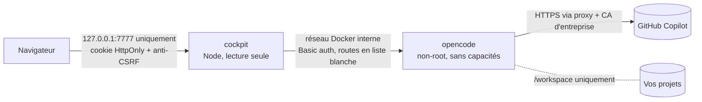

# opencode cockpit

Poste de pilotage web pour [opencode](https://opencode.ai), conçu pour travailler avec **GitHub Copilot** en entreprise :

- **Assistants** : un assistant par tâche (analyser un incident, relire un script avant mise en production, préparer une demande de changement pour le CAB…), avec des droits limités et une IA fixée. Catalogue prêt à l'emploi et création guidée en 5 étapes, sans jamais manipuler « agent », « skill » ni « modèle ».
- **Niveaux d'IA** : Rapide, Équilibré, Expert, reliés aux IA disponibles sur votre compte Copilot, avec le coût estimé d'une demande affiché avant l'envoi.
- **Chat** : réponses en direct, appels d'outils lisibles (commandes, diffs, travail délégué), autorisations à valider en un clic, `@fichier`, `/raccourci`, images. L'IA qui va répondre est affichée avant l'envoi.
- **Studio** (mode Avancé) : créer et régler les agents, skills, commandes et instructions (`AGENTS.md`), avec validation et retour arrière automatique.
- **Archives** : chaque conversation est résumée, **classée automatiquement** (débogage, fonctionnalité, SQL, sécurité…), indexée en plein texte et exportée en Markdown dans un dossier rangé par catégorie.
- **Coûts** : suivi en temps réel de la facturation Copilot au token face à votre budget mensuel, projection de fin de mois, alertes et garde-fou sur les modèles coûteux.

Tout tourne en local dans Docker Desktop. Seul GitHub Copilot est contacté pour les modèles.

L'interface s'ouvre en **mode Simple**, pensé pour des collègues peu familiers de l'IA : règles d'utilisation à accepter au premier lancement, réglages risqués masqués. Le **mode Avancé** (Paramètres › Affichage) donne accès au Studio et aux réglages fins.

---

## Sommaire

1. [Prérequis](#prérequis)
2. [Installation](#installation)
3. [Réseau d'entreprise : proxy et certificats](#réseau-dentreprise--proxy-et-certificats)
4. [Connecter GitHub Copilot](#connecter-github-copilot)
5. [Assistants et niveaux d'IA](#assistants-et-niveaux-dia)
6. [Modes Simple et Avancé](#modes-simple-et-avancé)
7. [Suivi des coûts](#suivi-des-coûts)
8. [Classement et archives](#classement-et-archives)
9. [Studio](#studio)
10. [Commandes du quotidien](#commandes-du-quotidien)
11. [Sécurité](#sécurité)
12. [Dépannage](#dépannage)
13. [Développement](#développement)

---

## Prérequis

| Élément | Détail |
|---|---|
| Docker Desktop | Démarré, avec Docker Compose v2 (inclus). Son installation demande les droits administrateur, WSL 2 et la virtualisation activée. |
| Abonnement GitHub Copilot | Pro, Pro+, Business ou Enterprise. GitHub prend officiellement en charge opencode depuis janvier 2026. |
| Windows PowerShell 5.1+ | Pour `install.ps1` et `cockpit.ps1` |
| Git | Facultatif, pour `cockpit.ps1 update` |

> **À vérifier avec votre DSI :**
> - l'organisation peut restreindre les modèles Copilot disponibles ou l'usage de clients tiers ; les modèles désactivés par l'administrateur n'apparaissent simplement pas ;
> - Docker Desktop n'est gratuit que pour les structures de moins de 250 salariés **et** de moins de 10 M$ de chiffre d'affaires annuel ; au-delà, un abonnement Docker est nécessaire.
>
> **Test rapide :** `docker run --rm hello-world`. S'il échoue au téléchargement, Docker Desktop n'atteint pas Docker Hub : réglez son proxy (**Settings › Resources › Proxies**) ou installez avec l'archive hors ligne (`-Mode Load`).

## Installation

```powershell
git clone https://github.com/Calgar50/opencode-cockpit.git
cd opencode-cockpit
.\install.ps1 -WorkspaceDir C:\dev
```

Sans Git : bouton **Code › Download ZIP** sur la page du dépôt, puis extraire l'archive et lancer `install.ps1` depuis le dossier extrait (si Windows bloque le script : clic droit › Propriétés › Débloquer, ou `Unblock-File .\install.ps1, .\cockpit.ps1`).

Le script :

1. vérifie Docker ;
2. demande le dossier des projets s'il n'est pas indiqué (voir ci-dessous) ;
3. prépare la configuration : secrets aléatoires, proxy, export des autorités de certification de Windows ;
4. construit, télécharge ou charge les images, en enregistrant la configuration dans `.env` (droits restreints à votre compte) ;
5. démarre les conteneurs et ouvre l'interface déjà connectée.

Relancer `install.ps1` est sans danger : secrets, réglages et **mode d'installation** sont conservés dans `.env`. Si la construction ou le téléchargement des images échoue, `.env` garde les images précédentes.

**Dossier des projets (`-WorkspaceDir`) :** indiquez le dossier **parent** de vos dépôts (par exemple `C:\dev`, qui contient `C:\dev\api` et `C:\dev\front`), pas un dépôt précis. Clonez le cockpit **en dehors** de ce dossier : `install.ps1` refuse que l'un contienne l'autre, car l'agent pourrait sinon modifier les scripts que vous lancez sous Windows.

- Chaque sous-dossier de premier niveau devient un projet dans le Chat, en plus de l'entrée « Tout le workspace ».
- Les dossiers masqués, `node_modules` et `__pycache__` sont ignorés ; un dépôt ajouté plus tard apparaît sans réinstallation.
- L'agent ne voit que ce dossier. Pour en changer : `.\install.ps1 -WorkspaceDir <dossier>`.

### Trois façons d'obtenir les images

| Mode | Commande | Quand l'utiliser |
|---|---|---|
| Construction locale (défaut) | `.\install.ps1` | Docker Hub, le registre npm et les dépôts Debian sont joignables |
| Téléchargement GHCR | `.\install.ps1 -Mode Pull` | `ghcr.io` est joignable. Les images sont publiques : ni compte ni `docker login`. |
| Archive hors ligne | `.\install.ps1 -Mode Load -ImagesArchive .\opencode-cockpit-images-1.0.0.tar.gz` | Seul le navigateur accède à GitHub : téléchargez l'archive (et son `.sha256`) depuis la page [Releases](https://github.com/Calgar50/opencode-cockpit/releases) |

Pour vérifier l'archive avant de la charger : `(Get-FileHash .\opencode-cockpit-images-1.0.0.tar.gz -Algorithm SHA256).Hash`, à comparer au contenu du fichier `.sha256`.

### Mettre à jour

`.\cockpit.ps1 update` récupère la dernière version (`git pull`), puis relance `install.ps1` dans le mode mémorisé :

- **Build** : les images sont reconstruites ;
- **Pull** : les images de la nouvelle version sont téléchargées ;
- **Load** : sans nouvelle archive, les images déjà chargées sont gardées, avec un avertissement si leur version diffère. Pour les mettre à jour, téléchargez l'archive de la nouvelle version puis lancez `.\install.ps1 -Mode Load -ImagesArchive <archive>`.

Dossier obtenu par ZIP : `update` affiche seulement un avertissement. Remplacez les fichiers par ceux de la nouvelle version, sans toucher à `.env`, `certs\`, `archives\` ni `backups\`, puis relancez `.\install.ps1`.

**Mise à jour depuis la 0.1.0, nouveautés de la 1.0.0 :** rien n'est réécrit.

- Au premier affichage, la fenêtre des règles d'or s'ouvre, puis l'interface passe en **mode Simple** avec une notice (« Passer en mode Avancé » ou « Compris »).
- Les agents principaux existants apparaissent dans **Assistants** avec l'état « À compléter » : « Compléter » leur donne un titre, un niveau et des droits lisibles.
- **Changement de comportement :** l'IA écrite dans un agent est désormais vraiment utilisée dans le chat (en 0.1.x, le sélecteur du chat l'emportait). La notice liste ces agents avec leur IA. La réflexion (« variante ») écrite dans un raccourci non délégué est aussi appliquée.

**Mise à jour depuis la 0.1.0, réglages à reprendre :**

- **Permissions :** la configuration d'opencode n'est posée qu'au premier démarrage ; une mise à jour garde les anciennes règles, qui autorisaient d'office `git status`, `git diff`, `git log`, `git show`, `git branch` et `ls`. Ces commandes peuvent être détournées pour exécuter du code sans confirmation (voir [Sécurité](#sécurité)). Après la mise à jour : **Paramètres › Sécurité › Revenir au profil Prudent** (en mode Avancé : **Paramètres › opencode › Permissions globales › Prudent › Appliquer**). Les agents créés depuis les anciens modèles « relecteur sécurité » ou « architecte » gardent aussi leurs règles : passez leur shell à « demander » ou « refuser » dans le Studio (mode Avancé).
- **Mode d'installation :** il n'était pas mémorisé. Si `.env` désigne des images publiées, la mise à jour réutilise les images 0.1.0 déjà présentes et le signale. Lancez une fois `.\install.ps1 -Mode Pull`, ou `.\install.ps1 -Mode Load -ImagesArchive <archive de la dernière version>`.

## Réseau d'entreprise : proxy et certificats

Les proxys d'entreprise inspectent souvent le HTTPS en re-signant les certificats avec leur propre autorité. Sans elle, les conteneurs échouent avec `SELF_SIGNED_CERT_IN_CHAIN` ou `unable to get local issuer certificate`.

**Méthode recommandée, vérification TLS conservée :** `install.ps1` exporte automatiquement les autorités de confiance du magasin Windows dans `certs\windows-trust.pem`. Le conteneur opencode les ajoute à son magasin au démarrage (`NODE_EXTRA_CA_CERTS`, `SSL_CERT_FILE`, `GIT_SSL_CAINFO`). Après une mise à jour des certificats du poste : `.\cockpit.ps1 certs`. Depuis la 1.0.1, le serveur du cockpit les charge aussi : il lit lui-même la liste des IA et, si vous l'activez, le solde chez GitHub.

**Certificat ajouté à la main :** déposez le certificat racine du proxy dans `certs\`, au format texte PEM (`-----BEGIN CERTIFICATE-----`), avec l'extension `.pem` ou `.crt`. Un `.cer` binaire se convertit avec `certutil -encode .\racine.cer .\certs\racine.pem`. Ensuite :

- erreur pendant l'utilisation : `.\cockpit.ps1 restart` ;
- erreur pendant la construction des images (npm, apt) : relancez `.\install.ps1`, car les certificats sont intégrés aux images lors de leur construction.

**Proxy :** sans `-Proxy`, le script reprend la valeur déjà enregistrée dans `.env`, sinon la variable d'environnement `HTTPS_PROXY`, sinon le proxy système Windows (script PAC compris).

- Pour le changer : `.\install.ps1 -Proxy http://proxy.entreprise.lan:8080`.
- Pour s'en passer : `.\install.ps1 -Proxy ''`. Ce choix est mémorisé.
- Le trafic interne entre conteneurs ne passe jamais par le proxy.
- Docker Desktop télécharge les images (image de base en mode Build, images GHCR en `-Mode Pull`) avec son propre réglage de proxy (**Settings › Resources › Proxies**), pas avec celui de `.env`.

**Secours, vérification TLS désactivée :** `.\install.ps1 -InsecureTls`. À réserver au cas où l'export des certificats ne suffit pas. La vérification est alors coupée pour opencode **et** pour tous les appels sortants du serveur du cockpit, jeton Copilot compris. Un bandeau rouge le rappelle en permanence dans l'interface. Le réglage est mémorisé : `.\install.ps1 -SecureTls` réactive la vérification.

> Les proxys qui exigent une authentification **NTLM/Kerberos** ne sont pas pris en charge directement par opencode. Il faut un relais local, à faire valider par la DSI.

### Pare-feu qui n'ouvre que l'adresse de votre abonnement Copilot

GitHub propose aux entreprises de n'ouvrir que l'adresse de leur abonnement (`*.business.githubcopilot.com` ou `*.enterprise.githubcopilot.com`) et de bloquer les autres ([documentation GitHub](https://docs.github.com/en/copilot/how-tos/administer-copilot/manage-for-organization/manage-access/manage-network-access)). opencode 1.18.30 utilise pourtant toujours l'adresse générale `api.githubcopilot.com`. Résultat mesuré derrière un tel proxy :

- chaque demande échoue (`AI_APICallError`, par exemple `Unable to connect` ou `Forbidden`) ;
- opencode ne peut pas lire la liste des IA de votre compte et affiche tout son catalogue embarqué, IA désactivées par votre organisation comprises.

Depuis la 1.0.1, le cockpit :

- prend l'adresse imposée par `-CopilotApiUrl` si vous en avez donné une ; sinon il garde l'adresse générale quand elle est joignable, et prend celle que GitHub annonce pour votre abonnement quand le réseau la bloque ;
- l'écrit dans la configuration d'opencode (`provider.github-copilot.options.baseURL`), quand aucune conversation ne travaille ;
- lit lui-même, à cette adresse, la liste des IA de votre compte, chacune marquée disponible ou non.

Pour imposer l'adresse : `.\install.ps1 -CopilotApiUrl https://api.business.githubcopilot.com -NoBrowser`. Pour vérifier : **Diagnostic › Tester la connexion Copilot**, ou `.\cockpit.ps1 diag`.

> **Limites :** avec une adresse remplacée, opencode 1.18.30 ne sait plus joindre les IA Anthropic de Copilot (appelées par `/v1/messages`) ; le cockpit les masque et le signale dans **Diagnostic**. Faute de compte Copilot Business sur le poste de développement, l'acceptation du jeton de connexion d'opencode par l'adresse Business n'a pas pu être vérifiée : le test de connexion l'indique (réponse 401).

## Connecter GitHub Copilot

**Paramètres › Connexion › Connecter** affiche un code dans le cockpit : cliquez **Copier le code**, puis **Ouvrir GitHub**, collez le code et autorisez l'accès. La connexion se termine toute seule ; le code expire au bout d'environ 15 minutes. GitHub Enterprise avec résidence des données est également pris en charge. Le jeton reste dans le volume Docker d'opencode.

Par défaut, **seul le fournisseur `github-copilot` est autorisé**. Les modèles gratuits « OpenCode Zen » qu'opencode active d'origine sont désactivés : aucun code n'est envoyé à un autre prestataire. Le cockpit vérifie aussi chaque demande : une IA d'un autre fournisseur est refusée avant d'atteindre opencode.

**IA disponibles ou non (1.0.1) :** **Paramètres › Connexion** liste les IA de votre compte, lues directement chez GitHub, chacune marquée « Disponible » ou « Pas disponible » avec la raison. Exemple de raison : une IA désactivée par la politique GitHub Copilot de votre organisation. Une IA non disponible n'est proposée nulle part, et le cockpit refuse toute demande qui la vise avant de l'envoyer. Les niveaux d'IA prennent la première IA disponible de leur liste.

## Assistants et niveaux d'IA

L'interface parle de tâches, pas de technique :

| Dans l'interface | Pour opencode | En une phrase |
|---|---|---|
| **Assistant** | agent principal géré par le cockpit | Fait une tâche précise, avec des droits limités et une IA adaptée. |
| **Assistant général** | agent `build` | Pour les demandes qui ne correspondent à aucun assistant. Demande avant de modifier ou d'exécuter. |
| **Fiche** | skill | Une procédure ou une checklist que l'assistant consulte. Elle n'a pas d'IA à elle : l'assistant la lit avec la sienne. |
| **Raccourci** (`/nom`) | commande | Un texte tout prêt, lancé en tapant `/nom` dans le chat. |
| **Niveau d'IA** | liste ordonnée de modèles | Rapide, Équilibré ou Expert. |
| **Réflexion** | variante du modèle | Plus de réflexion : réponses plus lentes et plus chères. |
| **Travail délégué** | sous-agent | Un autre assistant travaille à part, puis l'IA de la conversation reprend la main. |

**Page Assistants :**

- **Catalogue** : six exemples prêts à l'emploi, à relire avec votre équipe. L'installation ajoute les fiches manquantes, sans jamais écraser une fiche existante.

  | Assistant | Droits | Niveau | Fiches |
  |---|---|---|---|
  | Analyser un incident | Lecture seule | Équilibré | `anonymisation-donnees` |
  | Relire un script avant mise en production | Lecture seule | Équilibré | `standards-scripts`, `anonymisation-donnees` |
  | Préparer une demande de changement pour le CAB | Lecture seule | Expert | `checklist-cab` |
  | Relire une requête SQL sur un réplica | Lecture seule | Équilibré | `requetes-sql-sures` |
  | Expliquer une alerte de supervision | Lecture seule | Rapide | — |
  | Rédiger ou mettre à jour un runbook | Propose, vous validez | Équilibré | — |

- **Créer un assistant** en 5 étapes. La **fiche d'identité** se met à jour à chaque étape : tâche, ce que l'assistant peut faire et ne fait jamais, IA, coût estimé d'une demande, fiches. Le fichier produit est vérifié par opencode avant d'être gardé.
- **Deux profils de droits seulement**, sûrs par construction :

  | | Lecture seule (défaut) | Propose, vous validez |
  |---|---|---|
  | Modifier un fichier | jamais | sur confirmation |
  | Lancer une commande | jamais | sur confirmation |
  | Déléguer à un autre assistant | jamais | jamais |
  | Consulter Internet | jamais, ou sur confirmation si la case est cochée | idem |
  | Ouvrir une fiche | seulement les siennes | idem |
  | Lire un fichier de clés (`.pfx`, `.p12`, `.key`, `.jks`, `id_rsa`, kubeconfig…) | jamais ; `.env` sur confirmation | idem |

  Chaque assistant reçoit aussi un bloc « Règles communes » : signaler une donnée client ou un secret sans le recopier, écrire « À VÉRIFIER » plutôt qu'inventer, ne jamais donner de « feu vert » à la place d'un collègue ou du CAB.
- Les agents créés avant la 1.0.0 apparaissent « À compléter ».

**Quelle IA répond ?** Le cockpit applique les règles d'opencode 1.18.30, relevées dans son code, et le serveur les fait respecter :

| Demande | IA utilisée et facturée |
|---|---|
| Message à un assistant | toujours l'IA de l'assistant |
| Message à l'Assistant général | l'IA du niveau choisi sous la zone de saisie (Équilibré par défaut) |
| `/raccourci` | l'IA du raccourci s'il en a une, sinon celle de l'assistant qu'il désigne, sinon celle de la conversation |
| Travail délégué | l'IA de l'assistant délégué, puis une **reprise** sur l'IA de la conversation, qui résume et peut poursuivre : au moins deux appels facturés |
| Fiche | aucune IA propre : lue avec l'IA de l'assistant |

**Niveaux d'IA** (**Paramètres › Niveaux d'IA**) : chaque niveau prend la première IA disponible sur **votre** compte Copilot.

| Niveau | Recommandation livrée : IA préférée, puis IA de secours |
|---|---|
| Rapide | `gpt-5.4-mini` › `gpt-5-mini` › `claude-haiku-4.5` |
| Équilibré | `claude-sonnet-5` › `gpt-5.3-codex` › `claude-sonnet-4.6` |
| Expert | `claude-opus-5` › `claude-opus-4.8` › `gpt-5.6-sol` |

- « IA de secours » s'affiche quand ce n'est pas l'IA préférée qui sert.
- Les IA très chères et les prix promotionnels ne sont jamais proposés d'office ; en mode Avancé, elles apparaissent sous « Réservé (très cher) ».
- La recommandation suit les mises à jour du cockpit. La modifier (mode Avancé) en garde une copie ; « Revenir à la recommandation » la rétablit.
- Un assistant enregistre dans son fichier l'IA de son niveau. **Aucun fichier n'est réécrit en silence** : si cette IA disparaît du compte, l'envoi est bloqué avec un message. **Mettre à jour** réaligne alors les assistants en une fois : sauvegarde de chaque fichier, vérification par opencode, retour arrière complet en cas de refus. La mise à jour attend la fin des réponses en cours.
- « ≈ X $ par demande » est une estimation : d'abord selon la taille de la tâche, puis selon vos dernières demandes avec cet assistant. Le coût réel apparaît dans la page Coûts.

## Modes Simple et Avancé

Chaque installation, mise à jour comprise, s'ouvre en **mode Simple**. On change de mode dans **Paramètres › Affichage**.

| | Mode Simple (défaut) | Mode Avancé |
|---|---|---|
| Pages | Chat, Assistants, Coûts, Archives, Paramètres, Diagnostic | les mêmes, plus **Studio** |
| Paramètres | Connexion, Niveaux d'IA (consultation), Budget, Chat, Affichage, Sécurité | en plus : modification des niveaux d'IA, Tarifs, Classement, opencode |
| Réponse à une demande d'autorisation | « Autoriser une fois » ou « Refuser » | pareil : « Toujours autoriser » n'est jamais proposé (voir [Sécurité](#sécurité)) |
| Un message avec une autre IA que celle de l'assistant | impossible | possible pour un seul message, si l'option est activée |

- **Règles d'or :** au premier lancement, et à chaque changement de leur texte, la fenêtre « Avant de commencer » bloque l'interface jusqu'à leur acceptation. Les 6 règles : tout ce qui est écrit ou joint part chez GitHub Copilot ; jamais de données clients ; jamais de secrets ; l'IA n'agit jamais sur la production ; elle ne remplace ni la relecture par un collègue ni le CAB ; elle peut se tromper avec assurance.
- **Bandeau permanent** sous la zone de saisie : « Avant d'envoyer : aucune donnée client, aucun mot de passe, aucune clé. Relisez toujours la réponse : l'IA peut se tromper. »
- **Garde du serveur :** en mode Simple, le serveur refuse les écritures du Studio, de la configuration d'opencode et des niveaux d'IA, ainsi que les réglages avancés (« Action réservée au mode Avancé »). Elle évite les erreurs, mais ce n'est pas une barrière de sécurité : chacun peut passer en mode Avancé.

## Suivi des coûts

Depuis le **1er juin 2026**, Copilot facture **au token**, en crédits IA (1 crédit = 0,01 $). Le compteur est remis à zéro le 1er de chaque mois à 00:00 UTC, et un budget utilisateur épuisé bloque les requêtes, sans repli sur un modèle gratuit.

Le cockpit enregistre **chaque appel de modèle**, sous-agents, compaction et classement compris :

1. **Montant facturé :** opencode lit le coût réellement facturé renvoyé par GitHub et le cockpit l'utilise en priorité.
2. **Estimation**, à défaut, dans cet ordre :
   - votre tarif personnalisé (**Paramètres › Tarifs**) ;
   - pour les modèles Copilot, la grille officielle GitHub intégrée au cockpit (relevé du 13/09/2026, paliers « long contexte » compris) ;
   - le catalogue d'opencode.

L'option « Toujours appliquer la grille » ignore le montant facturé et retient l'estimation.

Le tableau de bord montre la dépense du mois face au budget (150 $ par défaut), le rythme quotidien, la projection et la date d'épuisement estimée. Les répartitions sont affichées par modèle, catégorie, agent et projet, avec la liste des conversations les plus coûteuses et un export CSV.

**Garde-fou :** au-delà de 80 % du budget, les modèles dont la sortie coûte plus de 15 $/M tokens demandent une confirmation. Une fois le budget atteint, tout modèle payant demande confirmation. Seuils réglables. Le garde-fou vérifie chaque appel facturé d'une demande : IA de l'assistant, d'un raccourci, d'un travail délégué et reprise comprises.

**Solde réel (optionnel) :** l'interface peut interroger l'endpoint GitHub `copilot_internal/user`, celui qu'utilisent les éditeurs. Cet endpoint n'est pas documenté, il est donc désactivé par défaut.

## Classement et archives

Quand une conversation devient inactive :

1. elle est archivée : transcription avec secrets masqués, fichiers modifiés, outils utilisés, coût ;
2. elle est classée immédiatement par une **heuristique gratuite** (mots-clés, outils utilisés, fichiers touchés) ;
3. après 2 minutes d'inactivité, un **petit modèle bon marché** affine la catégorie, les étiquettes et le résumé (environ 0,001 $ par conversation). Il propose aussi un titre, retenu seulement si opencode n'a laissé qu'un titre générique ;
4. une copie Markdown est écrite dans `archives\<Catégorie>\<AAAA-MM>\`.

Les catégories (nom, emoji, couleur, mots-clés) sont personnalisables. Corriger à la main la catégorie, les étiquettes ou le résumé fige tout le classement de la conversation : le classement automatique ne la modifie plus, même après de nouvelles demandes. Seul le bouton « Reclasser avec l'IA » le remplace ; un titre modifié à la main reste conservé. Supprimer une conversation d'opencode conserve son archive.

## Studio

Réservé au mode Avancé. Agents, skills (`SKILL.md` et fichiers annexes), commandes et instructions, avec une galerie de modèles prêts à l'emploi : relecteur sécurité, architecte, testeur, expert SQL, message de commit, etc. La portée globale est utilisée par défaut. Tant que `COCKPIT_PROJECT_CONFIG=0` (valeur par défaut, voir [Sécurité](#sécurité)), la portée projet est en lecture seule pour les agents, skills et commandes, et opencode ne charge pas d'office le `AGENTS.md` des projets : placez vos consignes dans le `AGENTS.md` global. Exception : quand l'agent lit un fichier, opencode joint encore les `AGENTS.md` des dossiers situés entre ce fichier et le dossier de la conversation.

Chaque enregistrement est **validé avec les règles exactes d'opencode**, puis vérifié par opencode lui-même. Si opencode refuse le fichier, la modification est **annulée automatiquement** et opencode est redémarré si nécessaire. Sans cette protection, un seul agent invalide bloque tout le serveur opencode.

Le champ « IA » propose un niveau (Rapide, Équilibré, Expert) ou une IA précise. Le panneau « Quelle IA sera utilisée ? » montre l'IA réellement utilisée et facturée, travail délégué et reprise compris, avec le même calcul que le chat et le serveur. Les modèles de la galerie portent un badge « Niveau conseillé ». La « Variante » d'une commande est désormais appliquée, sauf pour un raccourci délégué : le Studio invite alors à la régler sur l'assistant délégué.

## Commandes du quotidien

```powershell
.\cockpit.ps1 open                 # ouvre l'interface, déjà connectée
.\cockpit.ps1 status               # état des conteneurs
.\cockpit.ps1 logs                 # journaux en direct (ou : logs opencode / logs cockpit)
.\cockpit.ps1 diag                 # diagnostic en lecture seule : conteneurs, accès réseau à Copilot, journal
.\cockpit.ps1 stop                 # arrêt ; start pour relancer
.\cockpit.ps1 restart              # recrée les conteneurs : applique un changement de .env ou de certs\
.\cockpit.ps1 certs                # réexporte les certificats Windows puis recrée les conteneurs
.\cockpit.ps1 update               # git pull puis réinstallation dans le même mode
.\cockpit.ps1 backup               # sauvegarde dans backups\
.\cockpit.ps1 restore <fichier>    # restaure une sauvegarde (remplace les données actuelles)
.\cockpit.ps1 uninstall            # supprime les conteneurs (-Purge : données et images comprises)
```

**Sauvegarde et restauration :**

- `backup` enregistre les réglages, coûts et archives indexées (volume `cockpit-data`), la configuration et les données d'opencode, et le dossier `archives\`. Il exclut le jeton GitHub Copilot, `.env` et `certs\`.
- `restore` vérifie l'archive avant d'arrêter quoi que ce soit et demande de taper `RESTAURER`. Il redémarre ensuite les conteneurs, même en cas d'échec.
- Après une restauration sur un autre poste, reconnectez GitHub Copilot.

## Sécurité



- **Exposition réseau :** interface publiée sur `127.0.0.1` seulement. opencode n'a aucun port publié et exige un mot de passe aléatoire.
- **Accès à l'interface :**
  - jeton de 256 bits ; cookie de session signé par le serveur (`HttpOnly`, `Secure`, `SameSite=Strict`), qui expire au bout de 30 jours et que la déconnexion révoque sur tous les navigateurs ;
  - contrôle de l'en-tête `Host` (anti DNS rebinding) ;
  - en-tête anti-CSRF et vérification de l'origine sur toute requête modifiante ;
  - CSP stricte (aucun script en ligne).
- **Proxy vers opencode en liste blanche :**
  - seules les routes utilisées par l'interface sont relayées : partage public, mise à jour à distance, injection d'identifiants, terminal, exécution shell directe et routes de lecture de fichiers (`/file*`) ne sont pas relayés ;
  - les dossiers transmis et les fichiers joints sont bornés au workspace ; seules les images collées font exception ;
  - dans une `/commande`, un texte contenant à la fois « ! » et un accent grave (syntaxe ``!`commande` ``) et les références `@fichier` qui sortiraient du workspace (résolues comme le fait opencode) sont refusés, car opencode les exécuterait ou les lirait sans demander d'autorisation.
- **Conteneurs :** utilisateurs non-root, `cap_drop: ALL`, `no-new-privileges`, cockpit en système de fichiers en lecture seule, **aucun accès au socket Docker** (le redémarrage d'opencode passe par un fichier de contrôle).
- **Configuration opencode par défaut (profil « Prudent », installations neuves ; après une mise à jour depuis la 0.1.0, voir [Mettre à jour](#mettre-à-jour)) :**
  - confirmation avant chaque modification de fichier par les outils d'édition, chaque commande shell de l'agent, chaque lancement de sous-agent par l'agent (avec sa consigne affichée) et chaque accès web ;
  - aucune commande shell autorisée d'office, à part `pwd` ;
  - partage désactivé, mises à jour automatiques désactivées, téléchargements de serveurs de langage désactivés.
- **Limites propres à opencode**, que la configuration ne peut pas corriger :
  - le contrôle des commandes shell ne voit ni les affectations de variables (`export GIT_CONFIG_...; git status` suffit à faire exécuter du code), ni une redirection seule (`> fichier` vide ou crée un fichier sans confirmation) ;
  - les lignes ``!`commande` `` écrites dans une commande du Studio s'exécutent à chaque lancement sans confirmation (les modèles `commit`, `revue` et `description-pr` lancent ainsi `git diff` ou `git log`) ;
  - une `/commande` liée à un sous-agent (comme `revue`) le lance sans confirmation, et mentionner un agent (`@general`) dans ses arguments lève la confirmation des sous-agents de la réponse ;
  - une réponse « Toujours autoriser » s'appliquerait à tous les agents du projet et lèverait leurs refus jusqu'au redémarrage d'opencode (mesuré : un assistant qui interdit les fichiers de clés en lit un après un « Toujours » donné sur un `.env`). Le cockpit ne la propose pas et la refuse ;
  - `grep` et `glob` peuvent afficher des lignes d'un fichier de clés même quand sa lecture est refusée : ne laissez aucun fichier de clés dans le dossier des projets ;
  - un travail délégué lancé par l'IA elle-même (outil `task`, possible avec l'Assistant général après confirmation) n'est pas estimé par le garde-fou avant de démarrer. Les assistants du catalogue et ceux créés par l'assistant de création refusent la délégation.
- **Fournisseur d'IA verrouillé deux fois :** opencode ne charge que `github-copilot`, et le cockpit refuse toute demande dont un appel facturé (IA d'un assistant, d'un raccourci ou d'un travail délégué comprise) viendrait d'un autre fournisseur. La liste se règle avec `COCKPIT_ALLOWED_PROVIDERS` ; toute autre valeur que `github-copilot` affiche en permanence le bandeau rouge « Mode test : un fournisseur autre que GitHub Copilot est autorisé. »- **IA d'un assistant imposée par le serveur :** une demande envoyée à un assistant avec une autre IA est refusée ; le chat la renvoie une seule fois avec la bonne IA et le signale. Une `/fiche` que l'assistant n'a pas le droit d'ouvrir est refusée, car opencode la lancerait sans aucun contrôle.
- **Pas de « Toujours autoriser » :** chaque action sensible se confirme une fois à la fois, et le serveur refuse une réponse « Toujours ». Pour autoriser d'office une catégorie d'actions, utilisez un profil de permissions (mode Avancé) : ces règles globales ne lèvent pas les refus propres à chaque assistant. Depuis la 1.0.2, appliquer un profil redémarre opencode quelques secondes, jamais pendant une réponse.
- **Arrêt d'une réponse :** les demandes d'autorisation encore en attente sont refusées, et le serveur refuse toute autorisation pour une conversation qui ne tourne plus. Sinon, opencode lancerait un sous-agent détaché, facturé, dont le résultat serait perdu (mesuré).
- **Dossier `.opencode/` des dépôts ignoré** (`COCKPIT_PROJECT_CONFIG=0`) : un dépôt cloné pourrait y livrer des plugins qu'opencode exécuterait dès l'ouverture du projet, sans aucune confirmation. Les agents, skills et commandes se gèrent donc en portée globale, et le `AGENTS.md` à la racine du projet ouvert n'est pas chargé d'office (ceux des sous-dossiers peuvent l'être quand l'agent lit un fichier voisin). Passez à `1` dans `.env` uniquement si tous les dépôts du workspace sont de confiance, puis `.\cockpit.ps1 restart`.
- **Fiches des dépôts ignorées :** tant que `COCKPIT_PROJECT_CONFIG=0`, les fiches qu'un dépôt livrerait dans `.agents/skills` ou `.claude/skills` ne sont pas chargées ; elles ne peuvent donc pas remplacer celles des assistants.
- **Images :** le binaire d'opencode est vérifié par une empreinte SHA-512 épinglée et installé sans script d'installation ; les identifiants d'un proxy d'entreprise ne sont pas inscrits dans les images construites sur le poste.
- **Jeton Copilot confiné :** le cockpit ne l'envoie qu'à `api.github.com` (adresse de l'abonnement, solde facultatif) et aux adresses officielles de l'API Copilot (`api.githubcopilot.com`, `api.business.githubcopilot.com`, `api.enterprise.githubcopilot.com`, `api.individual.githubcopilot.com`), ou au seul domaine GitHub Enterprise déclaré dans `COCKPIT_GITHUB_ENTERPRISE_DOMAIN`. Une adresse annoncée hors de cette liste est ignorée. Dans la configuration d'opencode, le verrou refuse pour le fournisseur Copilot toute autre adresse (`options.baseURL`, `api`, `models.<id>.provider.api`) et tout remplacement de son module d'accès (`npm`). La connexion GitHub Enterprise n'est acceptée que vers ce domaine.
- **Sorties réseau (mesurées et vérifiées dans le code d'opencode) :**
  - l'IA ne passe que par GitHub Copilot ; tout modèle d'un autre fournisseur est refusé sans aucune connexion ;
  - sans IA : le catalogue des modèles (`models.opencode.ai`), le registre npm au premier démarrage (noms de paquets seulement), GitHub pour la connexion, et les pages web que vous autorisez. Bloqués par un proxy, les deux premiers ne gênent pas opencode (mesuré en 1.0.1 : démarrage en 3 secondes, catalogue embarqué) ;
  - le cockpit lui-même (1.0.1) : `api.github.com` et l'adresse de l'API Copilot, pour l'adresse de l'abonnement et la liste des IA du compte ; le test de connexion de **Diagnostic** contacte en plus ces adresses sans jeton ;
  - aucune télémétrie, pas de partage public ; détail dans `docs/RECAPITULATIF.md`, section « Sécurité ».
- **Données :**
  - secrets masqués dans les archives (titres compris) et les journaux ; les aperçus de demandes ne sont pas conservés ;
  - cellules CSV neutralisées contre l'injection de formules, y compris avec le séparateur « ; » de l'Excel français ;
  - Markdown assaini (DOMPurify).
- **Chaîne d'approvisionnement :** versions épinglées (npm, image de base par empreinte, opencode 1.18.30), GitHub Actions épinglées par SHA, `npm audit` en CI.

## Dépannage

| Symptôme | Piste |
|---|---|
| `SELF_SIGNED_CERT_IN_CHAIN` dans **Diagnostic › Journal** | `.\cockpit.ps1 certs`. Si le problème persiste, déposez le certificat racine du proxy au format PEM dans `certs\` (voir `certs\README.md`). Si l'erreur survient pendant la construction des images, relancez `.\install.ps1`. |
| `ECONNREFUSED`, `ETIMEDOUT` | Proxy absent ou erroné : `.\install.ps1 -Proxy http://…` |
| `AI_APICallError` (`Unable to connect`, `Forbidden`, 503) à chaque demande | Le pare-feu bloque `api.githubcopilot.com`. **Diagnostic › Tester la connexion Copilot** : si seule l'adresse Business (ou Enterprise) est joignable, `.\install.ps1 -CopilotApiUrl https://api.business.githubcopilot.com -NoBrowser`. Voir [Pare-feu qui n'ouvre que l'adresse de votre abonnement](#pare-feu-qui-nouvre-que-ladresse-de-votre-abonnement-copilot). |
| Des IA désactivées par votre organisation apparaissent comme utilisables | Liste des IA non vérifiée auprès de GitHub : **Diagnostic › GitHub Copilot et modèles** en donne la raison, **Tester la connexion Copilot** aide à la corriger. |
| Une IA attendue est « Pas disponible » (Paramètres › Connexion) | La raison est affichée : le plus souvent, l'IA est désactivée par la politique GitHub Copilot de votre organisation. Voyez votre administrateur Copilot. |
| Démarrage bloqué sur « Starting », ou journal d'opencode vide | `.\cockpit.ps1 diag` : il indique si Docker n'arrive pas à lancer le conteneur (état `Created`, souvent un dossier de projets sur un lecteur réseau ou OneDrive) et teste les accès réseau. Depuis la 1.0.1, l'interface démarre même si opencode ne répond pas. |
| « GitHub Copilot n'est pas connecté » | **Paramètres › Connexion** |
| Un modèle attendu n'apparaît pas | Désactivé par l'administrateur Copilot ou non inclus dans votre plan. **Diagnostic › Recharger le catalogue**. |
| opencode ne répond plus après une modification de configuration | **Diagnostic › Redémarrer opencode** |
| « Attendez la fin des réponses en cours » en appliquant un profil de permissions ou le fichier brut | Le changement redémarre opencode, ce qui couperait les réponses : attendez qu'elles se terminent (ou arrêtez-les), puis réessayez. |
| 1.0.0 ou 1.0.1 : un profil de permissions affiche « opencode en applique d'autres » | opencode ne relit pas ce fichier sans redémarrer : **Diagnostic › Redémarrer opencode**, ou passez en 1.0.2, qui redémarre de lui-même. |
| Écran « Accès protégé par jeton » | `.\cockpit.ps1 open`. La connexion est valable 30 jours. |
| « Hôte non autorisé » | Ouvrez `http://127.0.0.1:7777` ou `http://localhost:7777`, pas le nom ni l'adresse IP du PC. |
| « Trop de tentatives » | Trop de jetons erronés (20 en 5 minutes) : patientez quelques minutes. |
| Un changement de `.env` semble ignoré | `.\cockpit.ps1 restart`, puis vérifiez **Diagnostic › Réseau et sécurité**. |
| `git commit` ou `git push` échoue depuis l'agent | Normal : le conteneur n'a ni votre identité git ni vos identifiants. Commitez et poussez depuis Windows. |
| « Action réservée au mode Avancé (Paramètres › Affichage). » | Normal en mode Simple. Passez en mode Avancé dans **Paramètres › Affichage** si vous en avez besoin. |
| L'IA d'un assistant n'est plus disponible, rien n'a été envoyé | L'IA enregistrée dans l'assistant a disparu de votre compte Copilot : **Paramètres › Niveaux d'IA › Mettre à jour**, ou modifiez l'assistant dans la page **Assistants**. |
| « Seules les IA GitHub Copilot sont autorisées dans ce cockpit. » | La demande visait un autre fournisseur : choisissez une IA Copilot. |
| Bandeau rouge « Mode test » | `COCKPIT_ALLOWED_PROVIDERS` autorise un autre fournisseur que Copilot : retirez la ligne de `.env`, puis `.\cockpit.ps1 restart`. |

## Développement

```text
app/server/   API Node 24 (TypeScript exécuté nativement), SQLite intégré (node:sqlite), Hono
app/web/      Interface React 19 + Vite
docker/       Image opencode (superviseur, certificats, configuration par défaut)
```

```powershell
cd app
npm ci --ignore-scripts
npm run typecheck
npm test            # tests unitaires et d'intégration (sécurité HTTP, registre des coûts…)
npm run build
```

Développement de l'interface : `npm run dev:server`, avec `COCKPIT_TOKEN`, `OPENCODE_URL`, `OPENCODE_SERVER_PASSWORD` et les dossiers `COCKPIT_*` renseignés dans `.env.dev`, puis `npm run dev:web`.

Publier une version : mettre à jour `VERSION`, puis pousser le tag `vX.Y.Z`. La CI publie les images sur GHCR et joint l'archive hors ligne à la release.

## Licence

MIT. opencode est un projet MIT d'Anomaly (anciennement SST).
