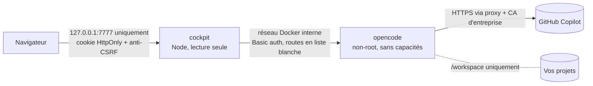

# opencode cockpit

Poste de pilotage web pour [opencode](https://opencode.ai), conçu pour travailler avec **GitHub Copilot** en entreprise :

- **Chat** avec l'agent : réponses en direct, appels d'outils lisibles (commandes, diffs, sous-agents), autorisations à valider en un clic, `@fichier`, `/commande`, images.
- **Studio** : créer et régler les agents, skills, commandes et instructions (`AGENTS.md`), avec validation et retour arrière automatique.
- **Archives** : chaque conversation est résumée, **classée automatiquement** (débogage, fonctionnalité, SQL, sécurité…), indexée en plein texte et exportée en Markdown dans un dossier rangé par catégorie.
- **Coûts** : suivi en temps réel de la facturation Copilot au token face à votre budget mensuel, projection de fin de mois, alertes et garde-fou sur les modèles coûteux.

Tout tourne en local dans Docker Desktop. Seul GitHub Copilot est contacté pour les modèles.

---

## Sommaire

1. [Prérequis](#prérequis)
2. [Installation](#installation)
3. [Réseau d'entreprise : proxy et certificats](#réseau-dentreprise--proxy-et-certificats)
4. [Connecter GitHub Copilot](#connecter-github-copilot)
5. [Suivi des coûts](#suivi-des-coûts)
6. [Classement et archives](#classement-et-archives)
7. [Studio](#studio)
8. [Commandes du quotidien](#commandes-du-quotidien)
9. [Sécurité](#sécurité)
10. [Dépannage](#dépannage)
11. [Développement](#développement)

---

## Prérequis

| Élément | Détail |
|---|---|
| Docker Desktop | Démarré, avec Docker Compose v2 (inclus). Son installation demande les droits administrateur, WSL 2 et la virtualisation activée. |
| Abonnement GitHub Copilot | Pro, Pro+, Business ou Enterprise. GitHub prend officiellement en charge opencode depuis janvier 2026. |
| Windows PowerShell 5.1+ | Pour `install.ps1` et `cockpit.ps1` |
| Git | Facultatif, pour `cockpit.ps1 update` |

> **À vérifier avec votre DSI :**
> - l'organisation peut restreindre les modèles Copilot disponibles ou l'usage de clients tiers ; les modèles désactivés par l'administrateur n'apparaissent simplement pas ;
> - Docker Desktop n'est gratuit que pour les structures de moins de 250 salariés **et** de moins de 10 M$ de chiffre d'affaires annuel ; au-delà, un abonnement Docker est nécessaire.
>
> **Test rapide :** `docker run --rm hello-world`. S'il échoue au téléchargement, Docker Desktop n'atteint pas Docker Hub : réglez son proxy (**Settings › Resources › Proxies**) ou installez avec l'archive hors ligne (`-Mode Load`).

## Installation

```powershell
git clone https://github.com/Calgar50/opencode-cockpit.git
cd opencode-cockpit
.\install.ps1 -WorkspaceDir C:\dev
```

Sans Git : bouton **Code › Download ZIP** sur la page du dépôt, puis extraire l'archive et lancer `install.ps1` depuis le dossier extrait (si Windows bloque le script : clic droit › Propriétés › Débloquer, ou `Unblock-File .\install.ps1, .\cockpit.ps1`).

Le script :

1. vérifie Docker ;
2. demande le dossier des projets s'il n'est pas indiqué (voir ci-dessous) ;
3. prépare la configuration : secrets aléatoires, proxy, export des autorités de certification de Windows ;
4. construit, télécharge ou charge les images, en enregistrant la configuration dans `.env` (droits restreints à votre compte) ;
5. démarre les conteneurs et ouvre l'interface déjà connectée.

Relancer `install.ps1` est sans danger : secrets, réglages et **mode d'installation** sont conservés dans `.env`. Si la construction ou le téléchargement des images échoue, `.env` garde les images précédentes.

**Dossier des projets (`-WorkspaceDir`) :** indiquez le dossier **parent** de vos dépôts (par exemple `C:\dev`, qui contient `C:\dev\api` et `C:\dev\front`), pas un dépôt précis.

- Chaque sous-dossier de premier niveau devient un projet dans le Chat, en plus de l'entrée « Tout le workspace ».
- Les dossiers masqués, `node_modules` et `__pycache__` sont ignorés ; un dépôt ajouté plus tard apparaît sans réinstallation.
- L'agent ne voit que ce dossier. Pour en changer : `.\install.ps1 -WorkspaceDir <dossier>`.

### Trois façons d'obtenir les images

| Mode | Commande | Quand l'utiliser |
|---|---|---|
| Construction locale (défaut) | `.\install.ps1` | Docker Hub, le registre npm et les dépôts Debian sont joignables |
| Téléchargement GHCR | `.\install.ps1 -Mode Pull` | `ghcr.io` est joignable. Les images sont publiques : ni compte ni `docker login`. |
| Archive hors ligne | `.\install.ps1 -Mode Load -ImagesArchive .\opencode-cockpit-images-0.1.1.tar.gz` | Seul le navigateur accède à GitHub : téléchargez l'archive (et son `.sha256`) depuis la page [Releases](https://github.com/Calgar50/opencode-cockpit/releases) |

Pour vérifier l'archive avant de la charger : `(Get-FileHash .\opencode-cockpit-images-0.1.1.tar.gz -Algorithm SHA256).Hash`, à comparer au contenu du fichier `.sha256`.

### Mettre à jour

`.\cockpit.ps1 update` récupère la dernière version (`git pull`), puis relance `install.ps1` dans le mode mémorisé :

- **Build** : les images sont reconstruites ;
- **Pull** : les images de la nouvelle version sont téléchargées ;
- **Load** : sans nouvelle archive, les images déjà chargées sont gardées, avec un avertissement si leur version diffère. Pour les mettre à jour, téléchargez l'archive de la nouvelle version puis lancez `.\install.ps1 -Mode Load -ImagesArchive <archive>`.

Dossier obtenu par ZIP : `update` affiche seulement un avertissement. Remplacez les fichiers par ceux de la nouvelle version, sans toucher à `.env`, `certs\`, `archives\` ni `backups\`, puis relancez `.\install.ps1`.

**Installation antérieure à la 0.1.1 :**

- **Permissions :** la configuration d'opencode n'est posée qu'au premier démarrage ; une mise à jour garde les anciennes règles, qui autorisaient d'office `git status`, `git diff`, `git log`, `git show`, `git branch` et `ls`. Ces commandes peuvent être détournées pour exécuter du code sans confirmation (voir [Sécurité](#sécurité)). Après la mise à jour : **Paramètres › opencode › Permissions globales › Prudent › Appliquer**. Les agents créés depuis les anciens modèles « relecteur sécurité » ou « architecte » gardent aussi leurs règles : passez leur shell à « demander » ou « refuser » dans le Studio.
- **Mode d'installation :** il n'était pas mémorisé. Si `.env` désigne des images publiées, la mise à jour réutilise les images 0.1.0 déjà présentes et le signale. Lancez une fois `.\install.ps1 -Mode Pull`, ou `.\install.ps1 -Mode Load -ImagesArchive <archive 0.1.1>`.

## Réseau d'entreprise : proxy et certificats

Les proxys d'entreprise inspectent souvent le HTTPS en re-signant les certificats avec leur propre autorité. Sans elle, les conteneurs échouent avec `SELF_SIGNED_CERT_IN_CHAIN` ou `unable to get local issuer certificate`.

**Méthode recommandée, vérification TLS conservée :** `install.ps1` exporte automatiquement les autorités de confiance du magasin Windows dans `certs\windows-trust.pem`. Le conteneur opencode les ajoute à son magasin au démarrage (`NODE_EXTRA_CA_CERTS`, `SSL_CERT_FILE`, `GIT_SSL_CAINFO`). Après une mise à jour des certificats du poste : `.\cockpit.ps1 certs`. Le serveur du cockpit ne les charge pas : derrière un proxy TLS, seule la synchronisation facultative du solde Copilot échoue.

**Certificat ajouté à la main :** déposez le certificat racine du proxy dans `certs\`, au format texte PEM (`-----BEGIN CERTIFICATE-----`), avec l'extension `.pem` ou `.crt`. Un `.cer` binaire se convertit avec `certutil -encode .\racine.cer .\certs\racine.pem`. Ensuite :

- erreur pendant l'utilisation : `.\cockpit.ps1 restart` ;
- erreur pendant la construction des images (npm, apt) : relancez `.\install.ps1`, car les certificats sont intégrés aux images lors de leur construction.

**Proxy :** sans `-Proxy`, le script reprend la valeur déjà enregistrée dans `.env`, sinon la variable d'environnement `HTTPS_PROXY`, sinon le proxy système Windows (script PAC compris).

- Pour le changer : `.\install.ps1 -Proxy http://proxy.entreprise.lan:8080`.
- Pour s'en passer : `.\install.ps1 -Proxy ''`. Ce choix est mémorisé.
- Le trafic interne entre conteneurs ne passe jamais par le proxy.
- Docker Desktop télécharge les images (image de base en mode Build, images GHCR en `-Mode Pull`) avec son propre réglage de proxy (**Settings › Resources › Proxies**), pas avec celui de `.env`.

**Secours, vérification TLS désactivée :** `.\install.ps1 -InsecureTls`. À réserver au cas où l'export des certificats ne suffit pas. Un bandeau rouge le rappelle en permanence dans l'interface. Le réglage est mémorisé : `.\install.ps1 -SecureTls` réactive la vérification.

> Les proxys qui exigent une authentification **NTLM/Kerberos** ne sont pas pris en charge directement par opencode. Il faut un relais local, à faire valider par la DSI.

## Connecter GitHub Copilot

**Paramètres › Connexion › Connecter** affiche un code dans le cockpit : cliquez **Copier le code**, puis **Ouvrir GitHub**, collez le code et autorisez l'accès. La connexion se termine toute seule ; le code expire au bout d'environ 15 minutes. GitHub Enterprise avec résidence des données est également pris en charge. Le jeton reste dans le volume Docker d'opencode.

Par défaut, **seul le fournisseur `github-copilot` est autorisé**. Les modèles gratuits « OpenCode Zen » qu'opencode active d'origine sont désactivés : aucun code n'est envoyé à un autre prestataire.

## Suivi des coûts

Depuis le **1er juin 2026**, Copilot facture **au token**, en crédits IA (1 crédit = 0,01 $). Le compteur est remis à zéro le 1er de chaque mois à 00:00 UTC, et un budget utilisateur épuisé bloque les requêtes, sans repli sur un modèle gratuit.

Le cockpit enregistre **chaque appel de modèle**, sous-agents, compaction et classement compris :

1. **Montant facturé :** opencode lit le coût réellement facturé renvoyé par GitHub et le cockpit l'utilise en priorité.
2. **Estimation**, à défaut, dans cet ordre :
   - votre tarif personnalisé (**Paramètres › Tarifs**) ;
   - pour les modèles Copilot, la grille officielle GitHub intégrée au cockpit (relevé du 13/09/2026, paliers « long contexte » compris) ;
   - le catalogue d'opencode.

L'option « Toujours appliquer la grille » ignore le montant facturé et retient l'estimation.

Le tableau de bord montre la dépense du mois face au budget (150 $ par défaut), le rythme quotidien, la projection et la date d'épuisement estimée. Les répartitions sont affichées par modèle, catégorie, agent et projet, avec la liste des conversations les plus coûteuses et un export CSV.

**Garde-fou :** au-delà de 80 % du budget, les modèles dont la sortie coûte plus de 15 $/M tokens demandent une confirmation. Une fois le budget atteint, tout modèle payant demande confirmation. Seuils réglables.

**Solde réel (optionnel) :** l'interface peut interroger l'endpoint GitHub `copilot_internal/user`, celui qu'utilisent les éditeurs. Cet endpoint n'est pas documenté, il est donc désactivé par défaut.

## Classement et archives

Quand une conversation devient inactive :

1. elle est archivée : transcription avec secrets masqués, fichiers modifiés, outils utilisés, coût ;
2. elle est classée immédiatement par une **heuristique gratuite** (mots-clés, outils utilisés, fichiers touchés) ;
3. après 2 minutes d'inactivité, un **petit modèle bon marché** affine la catégorie, les étiquettes et le résumé (environ 0,001 $ par conversation). Il propose aussi un titre, retenu seulement si opencode n'a laissé qu'un titre générique ;
4. une copie Markdown est écrite dans `archives\<Catégorie>\<AAAA-MM>\`.

Les catégories (nom, emoji, couleur, mots-clés) sont personnalisables. Corriger à la main la catégorie, les étiquettes ou le résumé fige tout le classement de la conversation : le classement automatique ne la modifie plus, même après de nouvelles demandes. Seul le bouton « Reclasser avec l'IA » le remplace ; un titre modifié à la main reste conservé. Supprimer une conversation d'opencode conserve son archive.

## Studio

Agents, skills (`SKILL.md` et fichiers annexes), commandes et instructions, avec une galerie de modèles prêts à l'emploi : relecteur sécurité, architecte, testeur, expert SQL, message de commit, etc. La portée globale est utilisée par défaut. Tant que `COCKPIT_PROJECT_CONFIG=0` (valeur par défaut, voir [Sécurité](#sécurité)), la portée projet est en lecture seule pour les agents, skills et commandes, et opencode ne charge pas d'office le `AGENTS.md` des projets : placez vos consignes dans le `AGENTS.md` global. Exception : quand l'agent lit un fichier, opencode joint encore les `AGENTS.md` des dossiers situés entre ce fichier et le dossier de la conversation.

Chaque enregistrement est **validé avec les règles exactes d'opencode**, puis vérifié par opencode lui-même. Si opencode refuse le fichier, la modification est **annulée automatiquement** et opencode est redémarré si nécessaire. Sans cette protection, un seul agent invalide bloque tout le serveur opencode.

## Commandes du quotidien

```powershell
.\cockpit.ps1 open                 # ouvre l'interface, déjà connectée
.\cockpit.ps1 status               # état des conteneurs
.\cockpit.ps1 logs                 # journaux en direct (ou : logs opencode / logs cockpit)
.\cockpit.ps1 stop                 # arrêt ; start pour relancer
.\cockpit.ps1 restart              # recrée les conteneurs : applique un changement de .env ou de certs\
.\cockpit.ps1 certs                # réexporte les certificats Windows puis recrée les conteneurs
.\cockpit.ps1 update               # git pull puis réinstallation dans le même mode
.\cockpit.ps1 backup               # sauvegarde dans backups\
.\cockpit.ps1 restore <fichier>    # restaure une sauvegarde (remplace les données actuelles)
.\cockpit.ps1 uninstall            # supprime les conteneurs (-Purge : données et images comprises)
```

**Sauvegarde et restauration :**

- `backup` enregistre les réglages, coûts et archives indexées (volume `cockpit-data`), la configuration et les données d'opencode, et le dossier `archives\`. Il exclut le jeton GitHub Copilot, `.env` et `certs\`.
- `restore` vérifie l'archive avant d'arrêter quoi que ce soit et demande de taper `RESTAURER`. Il redémarre ensuite les conteneurs, même en cas d'échec.
- Après une restauration sur un autre poste, reconnectez GitHub Copilot.

## Sécurité



- **Exposition réseau :** interface publiée sur `127.0.0.1` seulement. opencode n'a aucun port publié et exige un mot de passe aléatoire.
- **Accès à l'interface :**
  - jeton de 256 bits ; le cookie contient une valeur dérivée, marquée `HttpOnly`, `Secure`, `SameSite=Strict` ;
  - contrôle de l'en-tête `Host` (anti DNS rebinding) ;
  - en-tête anti-CSRF et vérification de l'origine sur toute requête modifiante ;
  - CSP stricte (aucun script en ligne).
- **Proxy vers opencode en liste blanche :**
  - seules les routes utilisées par l'interface sont relayées : partage public, mise à jour à distance, injection d'identifiants, terminal, exécution shell directe et routes de lecture de fichiers (`/file*`) ne sont pas relayés ;
  - les dossiers transmis et les fichiers joints sont bornés au workspace ; seules les images collées font exception ;
  - dans une `/commande`, un texte contenant à la fois « ! » et un accent grave (syntaxe ``!`commande` ``) et les références `@fichier` qui sortiraient du workspace (résolues comme le fait opencode) sont refusés, car opencode les exécuterait ou les lirait sans demander d'autorisation.
- **Conteneurs :** utilisateurs non-root, `cap_drop: ALL`, `no-new-privileges`, cockpit en système de fichiers en lecture seule, **aucun accès au socket Docker** (le redémarrage d'opencode passe par un fichier de contrôle).
- **Configuration opencode par défaut (profil « Prudent », installations neuves ; après une mise à jour depuis la 0.1.0, voir [Mettre à jour](#mettre-à-jour)) :**
  - confirmation avant chaque modification de fichier par les outils d'édition, chaque commande shell de l'agent, chaque lancement de sous-agent par l'agent (avec sa consigne affichée) et chaque accès web ;
  - aucune commande shell autorisée d'office, à part `pwd` ;
  - partage désactivé, mises à jour automatiques désactivées, téléchargements de serveurs de langage désactivés.
- **Limites propres à opencode**, que la configuration ne peut pas corriger :
  - le contrôle des commandes shell ne voit ni les affectations de variables (`export GIT_CONFIG_...; git status` suffit à faire exécuter du code), ni une redirection seule (`> fichier` vide ou crée un fichier sans confirmation) ;
  - les lignes ``!`commande` `` écrites dans une commande du Studio s'exécutent à chaque lancement sans confirmation (les modèles `commit`, `revue` et `description-pr` lancent ainsi `git diff` ou `git log`) ;
  - une `/commande` liée à un sous-agent (comme `revue`) le lance sans confirmation, et mentionner un agent (`@general`) dans ses arguments lève la confirmation des sous-agents de la réponse ;
  - « Toujours autoriser » vaut pour toutes les conversations du projet, jusqu'au redémarrage d'opencode.
- **Dossier `.opencode/` des dépôts ignoré** (`COCKPIT_PROJECT_CONFIG=0`) : un dépôt cloné pourrait y livrer des plugins qu'opencode exécuterait dès l'ouverture du projet, sans aucune confirmation. Les agents, skills et commandes se gèrent donc en portée globale, et le `AGENTS.md` à la racine du projet ouvert n'est pas chargé d'office (ceux des sous-dossiers peuvent l'être quand l'agent lit un fichier voisin). Passez à `1` dans `.env` uniquement si tous les dépôts du workspace sont de confiance, puis `.\cockpit.ps1 restart`.
- **Jeton Copilot confiné :** la synchronisation facultative du solde ne l'envoie qu'à `api.github.com`, ou au seul domaine GitHub Enterprise déclaré dans `COCKPIT_GITHUB_ENTERPRISE_DOMAIN`. La connexion GitHub Enterprise n'est acceptée que vers ce domaine.
- **Sorties réseau (mesurées et vérifiées dans le code d'opencode) :**
  - l'IA ne passe que par GitHub Copilot ; tout modèle d'un autre fournisseur est refusé sans aucune connexion ;
  - sans IA : le catalogue des modèles (`models.opencode.ai`), le registre npm au premier démarrage (noms de paquets seulement), GitHub pour la connexion, et les pages web que vous autorisez ;
  - aucune télémétrie, pas de partage public ; détail dans `docs/RECAPITULATIF.md`, section « Sécurité ».
- **Données :**
  - secrets masqués dans les archives et les journaux ;
  - cellules CSV neutralisées contre l'injection de formules ;
  - Markdown assaini (DOMPurify).
- **Chaîne d'approvisionnement :** versions épinglées (npm, image de base par empreinte, opencode 1.18.30), GitHub Actions épinglées par SHA, `npm audit` en CI.

## Dépannage

| Symptôme | Piste |
|---|---|
| `SELF_SIGNED_CERT_IN_CHAIN` dans **Diagnostic › Journal** | `.\cockpit.ps1 certs`. Si le problème persiste, déposez le certificat racine du proxy au format PEM dans `certs\` (voir `certs\README.md`). Si l'erreur survient pendant la construction des images, relancez `.\install.ps1`. |
| `ECONNREFUSED`, `ETIMEDOUT` | Proxy absent ou erroné : `.\install.ps1 -Proxy http://…` |
| « GitHub Copilot n'est pas connecté » | **Paramètres › Connexion** |
| Un modèle attendu n'apparaît pas | Désactivé par l'administrateur Copilot ou non inclus dans votre plan. **Diagnostic › Recharger le catalogue**. |
| opencode ne répond plus après une modification de configuration | **Diagnostic › Redémarrer opencode** |
| Écran « Accès protégé par jeton » | `.\cockpit.ps1 open`. La connexion est valable 30 jours. |
| « Hôte non autorisé » | Ouvrez `http://127.0.0.1:7777` ou `http://localhost:7777`, pas le nom ni l'adresse IP du PC. |
| « Trop de tentatives » | Trop de jetons erronés (20 en 5 minutes) : patientez quelques minutes. |
| Un changement de `.env` semble ignoré | `.\cockpit.ps1 restart`, puis vérifiez **Diagnostic › Réseau et sécurité**. |
| `git commit` ou `git push` échoue depuis l'agent | Normal : le conteneur n'a ni votre identité git ni vos identifiants. Commitez et poussez depuis Windows. |

## Développement

```text
app/server/   API Node 24 (TypeScript exécuté nativement), SQLite intégré (node:sqlite), Hono
app/web/      Interface React 19 + Vite
docker/       Image opencode (superviseur, certificats, configuration par défaut)
```

```powershell
cd app
npm ci --ignore-scripts
npm run typecheck
npm test            # tests unitaires et d'intégration (sécurité HTTP, registre des coûts…)
npm run build
```

Développement de l'interface : `npm run dev:server`, avec `COCKPIT_TOKEN`, `OPENCODE_URL`, `OPENCODE_SERVER_PASSWORD` et les dossiers `COCKPIT_*` renseignés dans `.env.dev`, puis `npm run dev:web`.

Publier une version : mettre à jour `VERSION`, puis pousser le tag `vX.Y.Z`. La CI publie les images sur GHCR et joint l'archive hors ligne à la release.

## Licence

MIT. opencode est un projet MIT d'Anomaly (anciennement SST).
