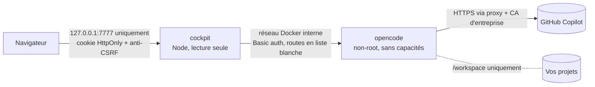

# opencode cockpit

Poste de pilotage web pour [opencode](https://opencode.ai), conçu pour travailler avec **GitHub Copilot** en entreprise :

- **Chat** avec l'agent : réponses en direct, appels d'outils lisibles (commandes, diffs, sous-agents), autorisations à valider en un clic, `@fichier`, `/commande`, images.
- **Studio** : créer et régler les agents, skills, commandes et instructions (`AGENTS.md`), avec validation et retour arrière automatique.
- **Archives** : chaque conversation est résumée, **classée automatiquement** (débogage, fonctionnalité, SQL, sécurité…), indexée en plein texte et exportée en Markdown dans un dossier rangé par catégorie.
- **Coûts** : suivi en temps réel de la facturation Copilot au token face à votre budget mensuel, projection de fin de mois, alertes et garde-fou sur les modèles coûteux.

Tout tourne en local dans Docker Desktop. Seul GitHub Copilot est contacté pour les modèles.

---

## Sommaire

1. [Prérequis](#prérequis)
2. [Installation](#installation)
3. [Réseau d'entreprise : proxy et certificats](#réseau-dentreprise--proxy-et-certificats)
4. [Connecter GitHub Copilot](#connecter-github-copilot)
5. [Suivi des coûts](#suivi-des-coûts)
6. [Classement et archives](#classement-et-archives)
7. [Studio](#studio)
8. [Commandes du quotidien](#commandes-du-quotidien)
9. [Sécurité](#sécurité)
10. [Dépannage](#dépannage)
11. [Développement](#développement)

---

## Prérequis

| Élément | Détail |
|---|---|
| Docker Desktop | Démarré, avec Docker Compose v2 (inclus) |
| Abonnement GitHub Copilot | Pro, Pro+, Business ou Enterprise. GitHub prend officiellement en charge opencode depuis janvier 2026. |
| Windows PowerShell 5.1+ | Pour `install.ps1` et `cockpit.ps1` |
| Git | Facultatif, pour `cockpit.ps1 update` |

> **À vérifier avec votre DSI :** l'organisation peut restreindre les modèles Copilot disponibles ou l'usage de clients tiers. Les modèles désactivés par l'administrateur n'apparaîtront simplement pas.

## Installation

```powershell
git clone https://github.com/Calgar50/opencode-cockpit.git
cd opencode-cockpit
.\install.ps1 -WorkspaceDir C:\dev
```

Sans Git : bouton **Code › Download ZIP** sur la page du dépôt, puis extraire l'archive et lancer `install.ps1` depuis le dossier extrait (si Windows bloque le script : clic droit › Propriétés › Débloquer, ou `Unblock-File .\install.ps1, .\cockpit.ps1`).

Le script :

1. vérifie Docker ;
2. crée `.env` avec des secrets aléatoires (droits restreints à votre compte) ;
3. détecte le proxy système et exporte les autorités de certification de Windows ;
4. construit les images, démarre les conteneurs et ouvre l'interface déjà connectée.

Relancer `install.ps1` est sans danger : secrets et réglages sont conservés.

### Trois façons d'obtenir les images

| Mode | Commande | Quand l'utiliser |
|---|---|---|
| Construction locale (défaut) | `.\install.ps1` | Docker Hub, le registre npm et les dépôts Debian sont joignables |
| Téléchargement GHCR | `.\install.ps1 -Mode Pull` | `ghcr.io` est joignable (compte GitHub connecté à Docker si le paquet est privé : `docker login ghcr.io`) |
| Archive hors ligne | `.\install.ps1 -Mode Load -ImagesArchive .\opencode-cockpit-images-0.1.0.tar.gz` | Seul le navigateur accède à GitHub : téléchargez l'archive (et son `.sha256`) depuis la page [Releases](https://github.com/Calgar50/opencode-cockpit/releases) |

Pour vérifier l'archive avant de la charger : `(Get-FileHash .\opencode-cockpit-images-0.1.0.tar.gz -Algorithm SHA256).Hash`, à comparer au contenu du fichier `.sha256`.

## Réseau d'entreprise : proxy et certificats

Les proxys d'entreprise inspectent souvent le HTTPS en re-signant les certificats avec leur propre autorité. Sans elle, les conteneurs échouent avec `SELF_SIGNED_CERT_IN_CHAIN` ou `unable to get local issuer certificate`.

**Méthode recommandée, vérification TLS conservée :** `install.ps1` exporte automatiquement les autorités de confiance du magasin Windows dans `certs\windows-trust.pem`. Les conteneurs les ajoutent à leur magasin au démarrage (`NODE_EXTRA_CA_CERTS`, `SSL_CERT_FILE`, `GIT_SSL_CAINFO`). Après une mise à jour des certificats du poste : `.\cockpit.ps1 certs`.

**Proxy :** détecté automatiquement (y compris par script PAC). Pour le forcer : `.\install.ps1 -Proxy http://proxy.entreprise.lan:8080`. Le trafic interne entre conteneurs ne passe jamais par le proxy.

**Secours, vérification TLS désactivée :** `.\install.ps1 -InsecureTls`. À réserver au cas où l'export des certificats ne suffit pas. Un bandeau rouge le rappelle en permanence dans l'interface.

> Les proxys qui exigent une authentification **NTLM/Kerberos** ne sont pas pris en charge directement par opencode. Il faut un relais local, à faire valider par la DSI.

## Connecter GitHub Copilot

**Paramètres › Connexion › Connecter** affiche un code à saisir sur `github.com/login/device` (GitHub Enterprise avec résidence des données également pris en charge). Le jeton reste dans le volume Docker d'opencode.

Par défaut, **seul le fournisseur `github-copilot` est autorisé**. Les modèles gratuits « OpenCode Zen » qu'opencode active d'origine sont désactivés : aucun code n'est envoyé à un autre prestataire.

## Suivi des coûts

Depuis le **1er juin 2026**, Copilot facture **au token**, en crédits IA (1 crédit = 0,01 $). Le compteur est remis à zéro le 1er de chaque mois à 00:00 UTC, et un budget utilisateur épuisé bloque les requêtes, sans repli sur un modèle gratuit.

Le cockpit enregistre **chaque appel de modèle**, sous-agents, compaction et classement compris :

1. **Montant facturé :** opencode lit le coût réellement facturé renvoyé par GitHub et le cockpit l'utilise en priorité.
2. **Estimation :** à défaut, le coût est calculé avec la grille officielle GitHub (relevé du 13/09/2026, paliers « long contexte » compris), modifiable dans **Paramètres › Tarifs**.

Le tableau de bord montre la dépense du mois face au budget (150 $ par défaut), le rythme quotidien, la projection et la date d'épuisement estimée. Les répartitions sont affichées par modèle, catégorie, agent et projet, avec la liste des conversations les plus coûteuses et un export CSV.

**Garde-fou :** au-delà de 80 % du budget, les modèles dont la sortie coûte plus de 15 $/M tokens demandent une confirmation. Une fois le budget atteint, tout modèle payant demande confirmation. Seuils réglables.

**Solde réel (optionnel) :** l'interface peut interroger l'endpoint GitHub `copilot_internal/user`, celui qu'utilisent les éditeurs. Cet endpoint n'est pas documenté, il est donc désactivé par défaut.

## Classement et archives

Quand une conversation devient inactive :

1. elle est archivée : transcription avec secrets masqués, fichiers modifiés, outils utilisés, coût ;
2. elle est classée immédiatement par une **heuristique gratuite** (mots-clés, outils utilisés, fichiers touchés) ;
3. après 2 minutes d'inactivité, un **petit modèle bon marché** affine la catégorie, les étiquettes et le résumé (environ 0,001 $ par conversation) ;
4. une copie Markdown est écrite dans `archives\<Catégorie>\<AAAA-MM>\`.

Les catégories (nom, emoji, couleur, mots-clés) sont personnalisables. Un classement corrigé à la main n'est plus jamais écrasé. Supprimer une conversation d'opencode conserve son archive.

## Studio

Agents, skills (`SKILL.md` et fichiers annexes), commandes et instructions, avec une galerie de modèles prêts à l'emploi : relecteur sécurité, architecte, testeur, expert SQL, message de commit, etc. La portée globale est utilisée par défaut. La portée par projet (`.opencode/`) n'est disponible qu'avec `COCKPIT_PROJECT_CONFIG=1` (voir [Sécurité](#sécurité)).

Chaque enregistrement est **validé avec les règles exactes d'opencode**, puis vérifié par opencode lui-même. Si opencode refuse le fichier, la modification est **annulée automatiquement** et opencode est redémarré si nécessaire. Sans cette protection, un seul agent invalide bloque tout le serveur opencode.

## Commandes du quotidien

```powershell
.\cockpit.ps1 open        # ouvre l'interface, déjà connectée
.\cockpit.ps1 status      # état des conteneurs
.\cockpit.ps1 logs        # journaux (ou : logs opencode / logs cockpit)
.\cockpit.ps1 stop        # arrêt ; start pour relancer
.\cockpit.ps1 certs       # réexporte les certificats Windows puis redémarre
.\cockpit.ps1 update      # git pull puis réinstallation
.\cockpit.ps1 backup      # sauvegarde (jeton Copilot exclu) dans backups\
.\cockpit.ps1 uninstall   # supprime les conteneurs (-Purge : données comprises)
```

## Sécurité



- **Exposition réseau :** interface publiée sur `127.0.0.1` seulement. opencode n'a aucun port publié et exige un mot de passe aléatoire.
- **Accès à l'interface :**
  - jeton de 256 bits ; le cookie contient une valeur dérivée, marquée `HttpOnly`, `Secure`, `SameSite=Strict` ;
  - contrôle de l'en-tête `Host` (anti DNS rebinding) ;
  - en-tête anti-CSRF et vérification de l'origine sur toute requête modifiante ;
  - CSP stricte (aucun script en ligne).
- **Proxy vers opencode en liste blanche :**
  - le partage public, la mise à jour à distance, l'injection d'identifiants et le terminal sont inaccessibles depuis le navigateur ;
  - les dossiers transmis sont bornés au workspace.
- **Conteneurs :** utilisateurs non-root, `cap_drop: ALL`, `no-new-privileges`, cockpit en système de fichiers en lecture seule, **aucun accès au socket Docker** (le redémarrage d'opencode passe par un fichier de contrôle).
- **Configuration opencode par défaut :**
  - confirmation avant toute modification de fichier ou commande shell ;
  - partage désactivé, mises à jour automatiques désactivées, téléchargements de serveurs de langage désactivés.
- **Dossier `.opencode/` des dépôts ignoré** (`COCKPIT_PROJECT_CONFIG=0`) : un dépôt cloné pourrait y livrer des plugins qu'opencode exécuterait dès l'ouverture du projet, sans aucune confirmation. Les agents, skills et commandes se gèrent donc en portée globale. Passez à `1` dans `.env` uniquement si tous les dépôts du workspace sont de confiance, puis `.\cockpit.ps1 restart`.
- **Jeton Copilot confiné :** la synchronisation facultative du solde ne l'envoie qu'à `api.github.com`, ou au seul domaine GitHub Enterprise déclaré dans `COCKPIT_GITHUB_ENTERPRISE_DOMAIN`.
- **Données :**
  - secrets masqués dans les archives et les journaux ;
  - cellules CSV neutralisées contre l'injection de formules ;
  - Markdown assaini (DOMPurify).
- **Chaîne d'approvisionnement :** versions épinglées (npm, image de base par empreinte, opencode 1.18.30), GitHub Actions épinglées par SHA, `npm audit` en CI.

## Dépannage

| Symptôme | Piste |
|---|---|
| `SELF_SIGNED_CERT_IN_CHAIN` dans **Diagnostic › Journal** | `.\cockpit.ps1 certs`. Si le problème persiste, déposez le certificat racine du proxy au format PEM dans `certs\` (voir `certs\README.md`). |
| `ECONNREFUSED`, `ETIMEDOUT` | Proxy absent ou erroné : `.\install.ps1 -Proxy http://…` |
| « GitHub Copilot n'est pas connecté » | **Paramètres › Connexion** |
| Un modèle attendu n'apparaît pas | Désactivé par l'administrateur Copilot ou non inclus dans votre plan. **Diagnostic › Recharger le catalogue**. |
| opencode ne répond plus après une modification de configuration | **Diagnostic › Redémarrer opencode** |
| L'interface demande un jeton | `.\cockpit.ps1 open` |

## Développement

```text
app/server/   API Node 24 (TypeScript exécuté nativement), SQLite intégré (node:sqlite), Hono
app/web/      Interface React 19 + Vite
docker/       Image opencode (superviseur, certificats, configuration par défaut)
```

```powershell
cd app
npm ci --ignore-scripts
npm run typecheck
npm test            # tests unitaires et d'intégration (sécurité HTTP, registre des coûts…)
npm run build
```

Développement de l'interface : `npm run dev:server`, avec `COCKPIT_TOKEN`, `OPENCODE_URL`, `OPENCODE_SERVER_PASSWORD` et les dossiers `COCKPIT_*` renseignés dans `.env.dev`, puis `npm run dev:web`.

Publier une version : mettre à jour `VERSION`, puis pousser le tag `vX.Y.Z`. La CI publie les images sur GHCR et joint l'archive hors ligne à la release.

## Licence

MIT. opencode est un projet MIT d'Anomaly (anciennement SST).
