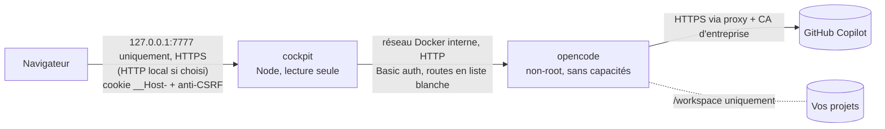

# opencode cockpit

Poste de pilotage web pour [opencode](https://opencode.ai), conçu pour travailler avec **GitHub Copilot** en entreprise :

- **Assistants** : un assistant par tâche (analyser un incident, relire un script avant mise en production, préparer une demande de changement pour le CAB…), avec des droits limités et une IA fixée. Catalogue prêt à l'emploi et création guidée en 5 écrans, sans jamais manipuler « agent », « skill » ni « modèle ».
- **Niveaux d'IA** : Rapide, Équilibré, Expert, reliés aux IA disponibles sur votre compte Copilot, avec le coût estimé d'une demande affiché avant l'envoi.
- **Chat** : réponses en direct, appels d'outils lisibles (commandes, diffs, travail délégué), autorisations à valider en un clic, `@fichier`, `/raccourci`, images. L'IA qui va répondre est affichée avant l'envoi.
- **Travail en direct** (1.1, en préparation) : « Qui travaille ? » montre chaque assistant au travail pour votre demande, avec son état, sa durée et son coût ; **Arrêter** arrête toute la conversation, travail délégué compris ; **Plan d'abord** fait écrire un plan dans une conversation qui ne peut rien modifier.
- **Autonomie à la demande** (1.1, en préparation) : un sélecteur à quatre choix par conversation (demander à chaque fois, modifications automatiques, plan d'abord, autonome avec contrôle), des plafonds qui arrêtent le travail, et un **Journal du contrôle** qui dit, ligne par ligne, qui a décidé quoi et selon quelle règle.
- **Salle Oh My OpenAgent** (1.1, en préparation, **livrée coupée**) : une demande confiée à l'extension Oh My OpenAgent, dans un conteneur à part, sur un réseau fermé sauf GitHub Copilot, bornée et arrêtée par le cockpit. Elle ne s'ouvre qu'au terme d'une procédure de mise en service (voir [Salle Oh My OpenAgent](#salle-oh-my-openagent-11-livrée-coupée)).
- **Studio** (mode Avancé) : créer et régler les agents, skills, commandes et instructions (`AGENTS.md`), avec validation et retour arrière automatique.
- **Archives** : chaque conversation est résumée, **classée automatiquement** (débogage, fonctionnalité, SQL, sécurité…), indexée en plein texte et exportée en Markdown dans un dossier rangé par catégorie.
- **Coûts** : suivi en temps réel de la facturation Copilot au token face à votre budget mensuel, projection de fin de mois, alertes et garde-fou sur les modèles coûteux.

Tout tourne en local dans Docker Desktop. Seul GitHub Copilot est contacté pour les modèles.

L'interface s'ouvre en **mode Simple**, pensé pour des collègues peu familiers de l'IA : règles d'utilisation à accepter au premier lancement, réglages risqués masqués. Le **mode Avancé** (Paramètres › Affichage) donne accès au Studio et aux réglages fins.

---

## Sommaire

1. [Prérequis](#prérequis)
2. [Installation](#installation)
3. [Réseau d'entreprise : proxy et certificats](#réseau-dentreprise--proxy-et-certificats)
4. [Connecter GitHub Copilot](#connecter-github-copilot)
5. [Assistants et niveaux d'IA](#assistants-et-niveaux-dia)
6. [Modes Simple et Avancé](#modes-simple-et-avancé)
7. [Travail en direct, arrêt et Plan d'abord (1.1)](#travail-en-direct-arrêt-et-plan-dabord-11)
8. [Autonomie : quatre choix, plafonds et Journal (1.1)](#autonomie--quatre-choix-plafonds-et-journal-11)
9. [Ce qui échappe au contrôle : limites propres à opencode](#ce-qui-échappe-au-contrôle--limites-propres-à-opencode)
10. [Salle Oh My OpenAgent (1.1, livrée coupée)](#salle-oh-my-openagent-11-livrée-coupée)
11. [Suivi des coûts](#suivi-des-coûts)
12. [Classement et archives](#classement-et-archives)
13. [Studio](#studio)
14. [Commandes du quotidien](#commandes-du-quotidien)
15. [Sécurité](#sécurité)
16. [Dépannage](#dépannage)
17. [Développement](#développement)

---

## Prérequis

| Élément | Détail |
|---|---|
| Docker Desktop | Démarré, avec Docker Compose v2 (inclus). Son installation demande les droits administrateur, WSL 2 et la virtualisation activée. |
| Abonnement GitHub Copilot | Pro, Pro+, Business ou Enterprise. GitHub prend officiellement en charge opencode depuis janvier 2026. |
| Windows PowerShell 5.1+ (langage complet) | Pour `install.ps1` et `cockpit.ps1`. Le `curl.exe` livré avec Windows est recommandé : c'est la voie la plus simple pour vérifier le cockpit en HTTPS. |
| Git | Facultatif, pour `cockpit.ps1 update` et `cockpit.ps1 rollback` |

> **À vérifier avec votre DSI :**
> - l'interface est servie en HTTPS sur `https://127.0.0.1:7777`, avec un certificat créé sur le poste : le navigateur affiche un avertissement au premier accès. Si une stratégie interdit de le passer, il faut l'exception Edge `SSLErrorOverrideAllowedForOrigins = https://127.0.0.1:7777`, ou le [mode HTTP local](#mode-http-local--http). À vérifier d'avance, sans rien modifier : `.\install.ps1 -TlsPreflight` (voir [Poste géré](#poste-géré--le-navigateur-ne-propose-pas-continuer)) ;
> - l'organisation peut restreindre les modèles Copilot disponibles ou l'usage de clients tiers ; les modèles désactivés par l'administrateur n'apparaissent simplement pas ;
> - Docker Desktop n'est gratuit que pour les structures de moins de 250 salariés **et** de moins de 10 M$ de chiffre d'affaires annuel ; au-delà, un abonnement Docker est nécessaire.
>
> **Test rapide :** `docker run --rm hello-world`. S'il échoue au téléchargement, Docker Desktop n'atteint pas Docker Hub : réglez son proxy (**Settings › Resources › Proxies**) ou installez avec l'archive hors ligne (`-Mode Load`).

## Installation

```powershell
git clone https://github.com/Calgar50/opencode-cockpit.git
cd opencode-cockpit
.\install.ps1 -WorkspaceDir C:\dev
```

Sans Git : bouton **Code › Download ZIP** sur la page du dépôt, puis extraire l'archive et lancer `install.ps1` depuis le dossier extrait (si Windows bloque le script : clic droit › Propriétés › Débloquer, ou `Unblock-File .\install.ps1, .\cockpit.ps1, .\CockpitTls.ps1`).

Le script :

1. vérifie Docker ;
2. demande le dossier des projets s'il n'est pas indiqué (voir ci-dessous) ;
3. vérifie, **avant toute modification**, le mode d'accès inscrit dans `.env`, les images (mode Load) et, pour le HTTPS, la stratégie d'Edge du poste. S'il manque quelque chose, il s'arrête en un seul message, sans rien avoir changé ;
4. prépare la configuration : secrets aléatoires, proxy, export des autorités de certification de Windows ;
5. construit, télécharge ou charge les images, en enregistrant la configuration dans `.env` (droits restreints à votre compte) ;
6. démarre les conteneurs, vérifie le cockpit (empreinte du certificat et preuve du jeton), puis ouvre **https://127.0.0.1:7777** avec un lien de connexion à usage unique, après l'avertissement du navigateur (voir [Premier accès en HTTPS](#premier-accès-en-https)).

Relancer `install.ps1` est sans danger : secrets, réglages et **mode d'installation** sont conservés dans `.env`. Le mode d'accès (HTTPS, ou HTTP local s'il a été choisi) est conservé lui aussi. Le passage depuis une version antérieure à la 1.0.5 remplace le jeton de connexion : une reconnexion est alors nécessaire. Si la construction ou le téléchargement des images échoue, `.env` garde les images précédentes.

**Dossier des projets (`-WorkspaceDir`) :** indiquez le dossier **parent** de vos dépôts (par exemple `C:\dev`, qui contient `C:\dev\api` et `C:\dev\front`), pas un dépôt précis. Clonez le cockpit **en dehors** de ce dossier : `install.ps1` refuse que l'un contienne l'autre, car l'agent pourrait sinon modifier les scripts que vous lancez sous Windows.

- Chaque sous-dossier de premier niveau devient un projet dans le Chat, en plus de l'entrée « Tout le workspace ».
- Les dossiers masqués, `node_modules` et `__pycache__` sont ignorés ; un dépôt ajouté plus tard apparaît sans réinstallation.
- L'agent ne voit que ce dossier. Pour en changer : `.\install.ps1 -WorkspaceDir <dossier>`.

### Premier accès en HTTPS

Depuis la 1.0.5, le cockpit est servi en **https://127.0.0.1:7777**. Au premier accès, le navigateur affiche **« Votre connexion n'est pas privée »** (`NET::ERR_CERT_AUTHORITY_INVALID`). C'est attendu :

1. comparez l'empreinte SHA-256 affichée par `install.ps1` (ou par `.\cockpit.ps1 tls`) avec celle du certificat présenté par le navigateur ;
2. si elles sont identiques : **Avancé › Continuer vers 127.0.0.1 (non sécurisé)**.

- Le certificat est **auto-signé**, créé par le cockpit lui-même au premier démarrage, et rangé dans un volume Docker réservé au cockpit. Il n'est **jamais** ajouté au magasin de certificats de Windows : rien n'est installé sur votre poste, et aucun autre site n'est concerné.
- L'avertissement revient au plus tard tous les **7 jours**. Il revient aussi dans chaque profil de navigateur, séparément pour `localhost` et pour `127.0.0.1`, et après chaque nouveau certificat (renouvellement, `.\cockpit.ps1 tls -Renew`, `uninstall -Purge`). Utilisez toujours **127.0.0.1**.
- Le cockpit n'envoie pas d'en-tête HSTS : l'avertissement reste contournable, et aucune adresse `http://` du poste n'est forcée en `https://`.
- Entre les deux conteneurs, le trafic reste en HTTP sur le réseau interne de Docker, sans port publié : il ne sort pas de Docker.

### Poste géré : le navigateur ne propose pas Continuer

Sur un poste d'entreprise, une stratégie peut interdire de passer l'avertissement de certificat. Le symptôme : Edge affiche **« 127.0.0.1 est actuellement inaccessible »** avec le seul bouton **Actualiser**, sans **Avancé** ni **Continuer**.

**À vérifier avant d'installer**, sans rien modifier sur le poste :

```powershell
.\install.ps1 -TlsPreflight
```

Il lit les stratégies du navigateur et dit si le HTTPS local passera. La vérification qui fait foi reste `edge://policy`, filtre `SSLError`.

**Deux issues**, au choix :

1. **Demander l'exception à l'informatique** — stratégie Edge `SSLErrorOverrideAllowedForOrigins` avec la valeur `https://127.0.0.1:7777`, c'est-à-dire pour cette seule adresse et ce seul port. Puis `.\install.ps1`. Si `COCKPIT_PORT` change un jour, l'exception porte sur l'ancien port : il faut la redemander.
2. **Le mode HTTP local** : `.\install.ps1 -Http` (voir la section suivante). Il ne dépend d'aucune exception, mais le trafic entre le navigateur et le cockpit circule alors en clair sur ce PC.

`.\cockpit.ps1 rollback` reste possible pour revenir à la version précédente. Deux contournements ne sont **pas** pris en charge : taper `thisisunsafe` sur la page d'avertissement, et importer le certificat du cockpit dans le magasin de Windows.

> Quand un message d'un script vous arrête, le tableau [Message affiché → commande à lancer](#message-affiché-par-un-script--commande-à-lancer) donne la commande à taper.

### Mode HTTP local (`-Http`)

À utiliser **seulement** quand le navigateur du poste interdit l'avertissement de certificat et que l'exception n'est pas obtenue.

```powershell
.\install.ps1 -Http
```

Le script explique ce qui change, puis demande de taper `HTTP EN CLAIR` pour confirmer. Toute autre réponse annule sans rien modifier. Aucun paramètre ne permet d'éviter cette confirmation, et le cockpit ne bascule **jamais** de lui-même en HTTP.

**Ce qui circule en clair** entre le navigateur et le cockpit, sur ce PC :

- le cookie de session, qui donne accès au cockpit pendant 30 jours ;
- tout le contenu des pages : vos conversations, le code envoyé et reçu, le code de connexion GitHub affiché.

**Qui peut le lire :**

- les outils de sécurité du poste qui inspectent le trafic (EDR, DLP, protection web) : ils peuvent enregistrer les adresses complètes et les cookies ;
- un programme lancé avec les droits administrateur ;
- tout compte capable de piloter Docker Desktop (groupe `docker-users`) : le trafic traverse la machine virtuelle et le réseau de Docker. Ce compte peut de toute façon lire le jeton dans le conteneur, dans les deux modes.

**Ce qui ne change pas :** le cockpit n'écoute que sur `127.0.0.1`, le jeton reste de 256 bits, le cookie garde le préfixe `__Host-`, les contrôles d'hôte et d'origine et la CSP sont identiques, et le trafic vers GitHub Copilot reste chiffré.

**Se connecter :** uniquement avec `.\cockpit.ps1 open`. Il vérifie que le serveur connaît bien le jeton avant d'ouvrir le lien. **Ne tapez jamais le jeton dans une page en `http`** : en mode HTTP local, l'écran de connexion ne le demande pas, et le serveur refuse ce mode de connexion.

**Au quotidien :** un bandeau permanent rappelle le mode dans l'interface, et chaque commande des scripts l'affiche. Le choix est mémorisé dans `.env` avec sa date, et `.\cockpit.ps1 update` le conserve.

**Revenir en HTTPS**, dès que le poste l'autorise :

```powershell
.\install.ps1 -Https
```

Un nouveau jeton est alors généré, car l'ancien a circulé en clair : il faut se reconnecter une fois. Le certificat précédent est réutilisé s'il est encore valable, donc sans nouvel avertissement si vous l'aviez accepté il y a moins de 7 jours.

> Limite déclarée : modifier à la main les deux lignes `COCKPIT_LOCAL_SCHEME` et `COCKPIT_LOCAL_HTTP_CONFIRMED` de `.env` contourne la confirmation. `.env` n'est lisible que par votre compte Windows, et la date du choix est affichée partout.

### Trois façons d'obtenir les images

| Mode | Commande | Quand l'utiliser |
|---|---|---|
| Construction locale (défaut) | `.\install.ps1` | Docker Hub, le registre npm et les dépôts Debian sont joignables |
| Téléchargement GHCR | `.\install.ps1 -Mode Pull` | `ghcr.io` est joignable. Les images sont publiques : ni compte ni `docker login`. |
| Archive hors ligne | `.\install.ps1 -Mode Load -ImagesArchive .\opencode-cockpit-images-1.0.0.tar.gz` | Seul le navigateur accède à GitHub : téléchargez l'archive (et son `.sha256`) depuis la page [Releases](https://github.com/Calgar50/opencode-cockpit/releases) |

Pour vérifier l'archive avant de la charger : `(Get-FileHash .\opencode-cockpit-images-1.0.0.tar.gz -Algorithm SHA256).Hash`, à comparer au contenu du fichier `.sha256`.

### Mettre à jour

`.\cockpit.ps1 update` récupère la dernière version (`git pull`), puis relance `install.ps1` dans le mode mémorisé :

- **Build** : les images sont reconstruites ;
- **Pull** : les images de la nouvelle version sont téléchargées ;
- **Load** : sans nouvelle archive, les images déjà chargées sont gardées, avec un avertissement si leur version diffère. Pour les mettre à jour, téléchargez l'archive de la nouvelle version puis lancez `.\install.ps1 -Mode Load -ImagesArchive <archive>`.

Dossier obtenu par ZIP : `update` affiche seulement un avertissement. Remplacez les fichiers par ceux de la nouvelle version, sans toucher à `.env`, `certs\`, `archives\` ni `backups\`, puis lancez `Unblock-File .\install.ps1, .\cockpit.ps1, .\CockpitTls.ps1` et relancez `.\install.ps1`.

**Mise à jour vers la 1.0.5 :** c'est la version qui fait passer l'interface en HTTPS local. À lire avant de la lancer.

1. **Poste géré :** extrayez le ZIP de la 1.0.5 **dans un dossier à part**, puis lancez `.\install.ps1 -TlsPreflight` depuis ce dossier. Rien n'est modifié : vous saurez si le HTTPS local passera, avant de toucher à votre installation.
2. `.\cockpit.ps1 update` **n'ouvre pas le navigateur**. Une fois la mise à jour terminée, lancez `.\cockpit.ps1 open`.
3. Le **jeton de connexion est remplacé** : l'ancien a circulé en clair avec les versions précédentes. Une reconnexion, une seule fois, est nécessaire.
4. Remplacez votre favori `http://127.0.0.1:7777` par **https://127.0.0.1:7777**. En mode HTTP local, l'adresse ne change pas et le favori reste valable.
5. **Mode Load :** l'archive d'images de la 1.0.5 est obligatoire (`-Mode Load -ImagesArchive <archive>`). Les images 1.0.4 ne savent pas servir le HTTPS.
6. Si le script **s'arrête** (stratégie d'Edge, ou archive manquante) : **rien n'a été modifié et votre cockpit 1.0.4 continue de tourner** à son adresse habituelle. Suivez les commandes affichées dans le message.
7. Pour revenir en arrière : `.\cockpit.ps1 rollback`.

**Mise à jour depuis la 0.1.0, nouveautés de la 1.0.0 :** rien n'est réécrit.

- Au premier affichage, la fenêtre des règles d'or s'ouvre, puis l'interface passe en **mode Simple** avec une notice (« Passer en mode Avancé » ou « Compris »).
- Les agents principaux existants apparaissent dans **Assistants** avec l'état « À compléter » : « Compléter » leur donne un titre, un niveau et des droits lisibles.
- **Changement de comportement :** l'IA écrite dans un agent est désormais vraiment utilisée dans le chat (en 0.1.x, le sélecteur du chat l'emportait). La notice liste ces agents avec leur IA. La réflexion (« variante ») écrite dans un raccourci non délégué est aussi appliquée.

**Mise à jour depuis la 0.1.0, réglages à reprendre :**

- **Permissions :** la configuration d'opencode n'est posée qu'au premier démarrage ; une mise à jour garde les anciennes règles, qui autorisaient d'office `git status`, `git diff`, `git log`, `git show`, `git branch` et `ls`. Ces commandes peuvent être détournées pour exécuter du code sans confirmation (voir [Sécurité](#sécurité)). Après la mise à jour : **Paramètres › Sécurité › Revenir au profil Prudent** (en mode Avancé : **Paramètres › opencode › Permissions globales › Prudent › Appliquer**). Les agents créés depuis les anciens modèles « relecteur sécurité » ou « architecte » gardent aussi leurs règles : passez leur shell à « demander » ou « refuser » dans le Studio (mode Avancé).
- **Mode d'installation :** il n'était pas mémorisé. Si `.env` désigne des images publiées, la mise à jour réutilise les images 0.1.0 déjà présentes et le signale. Lancez une fois `.\install.ps1 -Mode Pull`, ou `.\install.ps1 -Mode Load -ImagesArchive <archive de la dernière version>`.

## Réseau d'entreprise : proxy et certificats

Les proxys d'entreprise inspectent souvent le HTTPS en re-signant les certificats avec leur propre autorité. Sans elle, les conteneurs échouent avec `SELF_SIGNED_CERT_IN_CHAIN` ou `unable to get local issuer certificate`.

**Méthode recommandée, vérification TLS conservée :** `install.ps1` exporte automatiquement les autorités de confiance du magasin Windows dans `certs\windows-trust.pem`. Le conteneur opencode les ajoute à son magasin au démarrage (`NODE_EXTRA_CA_CERTS`, `SSL_CERT_FILE`, `GIT_SSL_CAINFO`). Après une mise à jour des certificats du poste : `.\cockpit.ps1 certs`. Depuis la 1.0.1, le serveur du cockpit les charge aussi : il lit lui-même la liste des IA et, si vous l'activez, le solde chez GitHub.

> Ces certificats ne servent qu'au trafic **sortant**. Le certificat HTTPS du cockpit est ailleurs, dans le volume Docker `cockpit-tls` : ne déposez jamais de certificat ni de clé du cockpit dans `certs\`, qui est aussi monté dans le conteneur de l'agent.

**Certificat ajouté à la main :** déposez le certificat racine du proxy dans `certs\`, au format texte PEM (`-----BEGIN CERTIFICATE-----`), avec l'extension `.pem` ou `.crt`. Un `.cer` binaire se convertit avec `certutil -encode .\racine.cer .\certs\racine.pem`. Ensuite :

- erreur pendant l'utilisation : `.\cockpit.ps1 restart` ;
- erreur pendant la construction des images (npm, apt) : relancez `.\install.ps1`, car les certificats sont intégrés aux images lors de leur construction.

**Proxy :** sans `-Proxy`, le script reprend la valeur déjà enregistrée dans `.env`, sinon la variable d'environnement `HTTPS_PROXY`, sinon le proxy système Windows (script PAC compris).

- Pour le changer : `.\install.ps1 -Proxy http://proxy.entreprise.lan:8080`.
- Pour s'en passer : `.\install.ps1 -Proxy ''`. Ce choix est mémorisé.
- Le trafic interne entre conteneurs ne passe jamais par le proxy.
- Docker Desktop télécharge les images (image de base en mode Build, images GHCR en `-Mode Pull`) avec son propre réglage de proxy (**Settings › Resources › Proxies**), pas avec celui de `.env`.

**Secours, vérification TLS désactivée :** `.\install.ps1 -InsecureTls`. À réserver au cas où l'export des certificats ne suffit pas. La vérification est alors coupée pour opencode **et** pour tous les appels sortants du serveur du cockpit, jeton Copilot compris. Un bandeau rouge le rappelle en permanence dans l'interface. Le réglage est mémorisé : `.\install.ps1 -SecureTls` réactive la vérification.

> Les proxys qui exigent une authentification **NTLM/Kerberos** ne sont pas pris en charge directement par opencode. Il faut un relais local, à faire valider par la DSI.

### Pare-feu qui n'ouvre que l'adresse de votre abonnement Copilot

GitHub propose aux entreprises de n'ouvrir que l'adresse de leur abonnement (`*.business.githubcopilot.com` ou `*.enterprise.githubcopilot.com`) et de bloquer les autres ([documentation GitHub](https://docs.github.com/en/copilot/how-tos/administer-copilot/manage-for-organization/manage-access/manage-network-access)). opencode 1.18.30 utilise pourtant toujours l'adresse générale `api.githubcopilot.com`. Résultat mesuré derrière un tel proxy :

- chaque demande échoue (`AI_APICallError`, par exemple `Unable to connect` ou `Forbidden`) ;
- opencode ne peut pas lire la liste des IA de votre compte et affiche tout son catalogue embarqué, IA désactivées par votre organisation comprises.

Depuis la 1.0.1, le cockpit :

- prend l'adresse imposée par `-CopilotApiUrl` si vous en avez donné une ; sinon il garde l'adresse générale quand elle est joignable, et prend celle que GitHub annonce pour votre abonnement quand le réseau la bloque ;
- l'écrit dans la configuration d'opencode (`provider.github-copilot.options.baseURL`), quand aucune conversation ne travaille, puis vérifie **l'adresse réellement utilisée** par opencode dans chaque dossier et la revérifie après chaque redémarrage d'opencode (1.0.3). Tant que l'adresse n'est pas vérifiée, les nouvelles demandes sont refusées (1.0.4) : quelques secondes au démarrage du cockpit ou après un redémarrage d'opencode, jusqu'à la fin de la réponse en cours quand la correction doit l'attendre, et tant qu'opencode est injoignable. **Diagnostic › Adresse imposée à opencode** l'affiche ; si opencode ne l'utilise pas encore, l'état « redémarrage requis » propose le bouton **Redémarrer opencode** ;
- lit lui-même, à cette adresse, la liste des IA de votre compte, chacune marquée disponible ou non.

Pour imposer l'adresse : `.\install.ps1 -CopilotApiUrl https://api.business.githubcopilot.com -NoBrowser`. Pour vérifier : **Diagnostic › Tester la connexion Copilot**, ou `.\cockpit.ps1 diag`.

> **Limites :** avec une adresse remplacée, opencode 1.18.30 ne sait plus joindre les IA Anthropic de Copilot (appelées par `/v1/messages`) ; le cockpit les masque et le signale dans **Diagnostic**. Faute de compte Copilot Business sur le poste de développement, l'acceptation du jeton de connexion d'opencode par l'adresse Business n'a pas pu être vérifiée : le test de connexion l'indique (réponse 401).

## Connecter GitHub Copilot

**Paramètres › Connexion › Connecter** affiche un code dans le cockpit : cliquez **Copier le code**, puis **Ouvrir GitHub**, collez le code et autorisez l'accès. La connexion se termine toute seule ; le code expire au bout d'environ 15 minutes. GitHub Enterprise avec résidence des données est également pris en charge. Le jeton reste dans le volume Docker d'opencode.

Par défaut, **seul le fournisseur `github-copilot` est autorisé**. Les modèles gratuits « OpenCode Zen » qu'opencode active d'origine sont désactivés : aucun code n'est envoyé à un autre prestataire. Le cockpit vérifie aussi chaque demande : une IA d'un autre fournisseur est refusée avant d'atteindre opencode.

**IA disponibles ou non (1.0.1) :** **Paramètres › Connexion** liste les IA de votre compte, lues directement chez GitHub, chacune marquée « Disponible » ou « Pas disponible » avec la raison. Exemple de raison : une IA désactivée par la politique GitHub Copilot de votre organisation. Une IA non disponible n'est proposée nulle part, et le cockpit refuse toute demande qui la vise avant de l'envoyer. Les niveaux d'IA prennent la première IA disponible de leur liste.

## Assistants et niveaux d'IA

L'interface parle de tâches, pas de technique :

| Dans l'interface | Pour opencode | En une phrase |
|---|---|---|
| **Assistant** | agent principal géré par le cockpit | Fait une tâche précise, avec des droits limités et une IA adaptée. |
| **Assistant général** | agent `build` | Pour les demandes qui ne correspondent à aucun assistant. Demande avant de modifier ou d'exécuter. |
| **Fiche** | skill | Une procédure ou une checklist que l'assistant consulte. Elle n'a pas d'IA à elle : l'assistant la lit avec la sienne. |
| **Raccourci** (`/nom`) | commande | Un texte tout prêt, lancé en tapant `/nom` dans le chat. |
| **Niveau d'IA** | liste ordonnée de modèles | Rapide, Équilibré ou Expert. |
| **Réflexion** | variante du modèle | Plus de réflexion : réponses plus lentes et plus chères. |
| **Travail délégué** | sous-agent | Un autre assistant travaille à part, puis l'IA de la conversation reprend la main. |

**Page Assistants :**

- **Catalogue** : six exemples prêts à l'emploi, à relire avec votre équipe. L'installation ajoute les fiches manquantes, sans jamais écraser une fiche existante.

  | Assistant | Droits | Niveau | Fiches |
  |---|---|---|---|
  | Analyser un incident | Lecture seule | Équilibré | `anonymisation-donnees` |
  | Relire un script avant mise en production | Lecture seule | Équilibré | `standards-scripts`, `anonymisation-donnees` |
  | Préparer une demande de changement pour le CAB | Lecture seule | Expert | `checklist-cab` |
  | Relire une requête SQL sur un réplica | Lecture seule | Équilibré | `requetes-sql-sures` |
  | Expliquer une alerte de supervision | Lecture seule | Rapide | — |
  | Rédiger ou mettre à jour un runbook | Propose, vous validez | Équilibré | — |

- **Créer un assistant** en 5 écrans. La **fiche d'identité** se met à jour à chaque écran : tâche, ce que l'assistant peut faire et ne fait jamais, IA, coût estimé d'une demande, fiches. Le fichier produit est vérifié par opencode avant d'être gardé.
- **Deux profils de droits seulement**, sûrs par construction :

  | | Lecture seule (défaut) | Propose, vous validez |
  |---|---|---|
  | Modifier un fichier | jamais | sur confirmation |
  | Lancer une commande | jamais | sur confirmation |
  | Déléguer à un autre assistant | jamais | jamais |
  | Consulter Internet | jamais, ou sur confirmation si la case est cochée | idem |
  | Ouvrir une fiche | seulement les siennes | idem |
  | Lire un fichier de clés (`.pfx`, `.p12`, `.key`, `.jks`, `id_rsa`, kubeconfig…) | jamais ; `.env` sur confirmation | idem |

  Chaque assistant reçoit aussi un bloc « Règles communes » : signaler une donnée client ou un secret sans le recopier, écrire « À VÉRIFIER » plutôt qu'inventer, ne jamais donner de « feu vert » à la place d'un collègue ou du CAB.
- Les agents créés avant la 1.0.0 apparaissent « À compléter ».

**Quelle IA répond ?** Le cockpit applique les règles d'opencode 1.18.30, relevées dans son code, et le serveur les fait respecter :

| Demande | IA utilisée et facturée |
|---|---|
| Message à un assistant | toujours l'IA de l'assistant |
| Message à l'Assistant général | l'IA du niveau choisi sous la zone de saisie (Équilibré par défaut) |
| `/raccourci` | l'IA du raccourci s'il en a une, sinon celle de l'assistant qu'il désigne, sinon celle de la conversation |
| Travail délégué | l'IA de l'assistant délégué, puis une **reprise** sur l'IA de la conversation, qui résume et peut poursuivre : au moins deux appels facturés |
| Fiche | aucune IA propre : lue avec l'IA de l'assistant |

**Niveaux d'IA** (**Paramètres › Niveaux d'IA**) : chaque niveau prend la première IA disponible sur **votre** compte Copilot.

| Niveau | Recommandation livrée : IA préférée, puis IA de secours |
|---|---|
| Rapide | `gpt-5.4-mini` › `gpt-5-mini` › `claude-haiku-4.5` |
| Équilibré | `claude-sonnet-5` › `gpt-5.3-codex` › `claude-sonnet-4.6` |
| Expert | `claude-opus-5` › `claude-opus-4.8` › `gpt-5.6-sol` |

- « IA de secours » s'affiche quand ce n'est pas l'IA préférée qui sert.
- Les IA très chères et les prix promotionnels ne sont jamais proposés d'office ; en mode Avancé, elles apparaissent sous « Réservé (très cher) ».
- La recommandation suit les mises à jour du cockpit. La modifier (mode Avancé) en garde une copie ; « Revenir à la recommandation » la rétablit.
- Un assistant enregistre dans son fichier l'IA de son niveau. **Aucun fichier n'est réécrit en silence** : si cette IA disparaît du compte, l'envoi est bloqué avec un message. **Mettre à jour** réaligne alors les assistants en une fois : sauvegarde de chaque fichier, vérification par opencode, retour arrière complet en cas de refus. La mise à jour attend la fin des réponses en cours.
- « ≈ X $ par demande » est une estimation : d'abord selon la taille de la tâche, puis selon vos dernières demandes avec cet assistant. Le coût réel apparaît dans la page Coûts.

## Modes Simple et Avancé

Chaque installation, mise à jour comprise, s'ouvre en **mode Simple**. On change de mode dans **Paramètres › Affichage**.

| | Mode Simple (défaut) | Mode Avancé |
|---|---|---|
| Pages | Chat, Assistants, Coûts, Archives, Paramètres, Diagnostic | les mêmes, plus **Studio** |
| Paramètres | Connexion, Niveaux d'IA (consultation), Budget, Chat, Affichage, Sécurité | en plus : modification des niveaux d'IA, Tarifs, Classement, opencode |
| Réponse à une demande d'autorisation | « Autoriser une fois » ou « Refuser » | pareil : « Toujours autoriser » n'est jamais proposé (voir [Sécurité](#sécurité)) |
| Un message avec une autre IA que celle de l'assistant | impossible | possible pour un seul message, si l'option est activée |
| Travail que l'IA veut confier à un autre assistant (1.1) | refusé automatiquement : l'IA continue seule | attend votre accord, avec une carte détaillée |
| Choix d'autonomie (1.1) | les quatre choix, à l'identique | les quatre mêmes choix ; seul change le sort d'un travail délégué que le cockpit ne peut pas laisser passer (refusé en Simple, votre accord en Avancé) |

- **Règles d'or :** au premier lancement, et à chaque changement de leur texte, la fenêtre « Avant de commencer » bloque l'interface jusqu'à leur acceptation. Les 6 règles : tout ce qui est écrit ou joint part chez GitHub Copilot ; jamais de données clients ; jamais de secrets ; l'IA n'agit jamais sur la production ; elle ne remplace ni la relecture par un collègue ni le CAB ; elle peut se tromper avec assurance.
- **Bandeau permanent** sous la zone de saisie : « Avant d'envoyer : aucune donnée client, aucun mot de passe, aucune clé. Relisez toujours la réponse : l'IA peut se tromper. »
- **Garde du serveur :** en mode Simple, le serveur refuse les écritures du Studio, de la configuration d'opencode et des niveaux d'IA, ainsi que les réglages avancés (« Action réservée au mode Avancé »). Elle évite les erreurs, mais ce n'est pas une barrière de sécurité : chacun peut passer en mode Avancé.

## Travail en direct, arrêt et Plan d'abord (1.1)

> **Version 1.1 en préparation, non publiée.** Cette section décrit ce que son code contient déjà : voir qui travaille, arrêter tout le travail d'une conversation, faire écrire un plan qui ne peut rien modifier. Le sélecteur **Autonomie** propose aussi « Modifications automatiques » et « Autonome avec contrôle » : voir [Autonomie : quatre choix, plafonds et Journal](#autonomie--quatre-choix-plafonds-et-journal-11).

### Qui travaille ?

Entre l'en-tête et la conversation, le bandeau **« Qui travaille ? »** apparaît dès qu'un second assistant travaille pour votre demande (travail délégué) ou qu'une action attend votre accord :

- une ligne par intervenant : son état en mot et en icône (« travaille · lit src/app.ts », « attend le travail délégué », « en attente de votre accord », « terminé »…), sa durée et son coût ;
- **Répondre** amène à la demande d'autorisation ; **Voir le travail** ouvre le travail délégué en lecture ;
- le bandeau se replie en fin de demande ; à 400 px de large, il tient sur une ligne (« +2 ») ; en mode Simple, il se replie aussi sur cette ligne, **Répondre** compris, tant qu'une demande attend votre réponse (en mode Avancé, il reste déplié, et garde toute sa hauteur sous la carte du travail en direct : c'est la carte qui se réduit) ;
- un lecteur d'écran reçoit au plus une annonce toutes les 2 secondes : qui commence, attend votre accord, termine, échoue ou s'arrête. **Paramètres › Affichage** permet de couper ces annonces.

Dans la conversation, chaque travail délégué a sa carte (qui, état, durée, consigne et résultat), la reprise par l'assistant de la conversation est signalée (« Reprise dans la conversation »), et le pied de chaque réponse donne son coût : « 0,12 $ dont 0,05 $ de travail délégué · 3 appels d'IA ».

### Déroulé

Le panneau de droite du chat et le détail d'une archive montrent le **Déroulé** de la demande choisie : pour chaque intervenant, des barres « génération », « attente de délégation » et « attente de vous » (hachurée et marquée « vous »), le prévu et le réel avec leurs écarts, et **Tableau** pour lire la même chose en tableau. Pour une conversation antérieure à la 1.1, les temps d'attente n'ont pas été enregistrés : le Déroulé le dit.

### Carte du travail en direct et démonstration

Au-dessus de la liste des intervenants, une carte néon dessine le même travail : l'assistant de la conversation au centre, les consignes confiées (en rose), les résultats rendus (en bleu), les attentes de votre accord et chaque appel vers GitHub Copilot.

- Mode Simple : elle s'appelle « Travail en direct », repliée par défaut, avec un résumé d'une ligne. Mode Avancé : « Carte des agents en direct », dépliée, y compris pendant une demande d'autorisation, où elle montre l'attente de votre accord (hexagone hachuré, cadenas) et la délégation en préparation (pointillé rose). Pendant la demande, elle prend la hauteur que lui laisse « Qui travaille ? » et s'y réduit, jusqu'à une mini-carte ; dans une fenêtre trop basse, on la fait défiler.
- Un clic sur un assistant montre ses outils, ses fichiers (lus, modifiés, refusés) et le panneau « Consigne reçue · Ce qu'il a fait · Résultat rendu ».
- **Figer l'affichage (le travail continue)** arrête le dessin, pas le travail. **Tableau** donne la même scène en tableau.
- La carte ne dessine que ce que le cockpit a enregistré. La liste des intervenants reste la référence, et elle seule s'affiche à 400 px de large.

**Voir une démonstration** rejoue, moment par moment, une capture réelle où deux assistants travaillent en même temps : « Démonstration enregistrée : aucune IA n'est appelée ». Elle a été enregistrée en mode Avancé ; en mode Simple, le lecteur rappelle que l'IA ne délègue pas.

### Arrêter

**Arrêter** reste affiché tant que quelque chose travaille dans la conversation, travail délégué compris. Un clic arrête tout, dans cet ordre :

1. les demandes d'autorisation en attente, dans la conversation et son travail délégué, sont refusées ;
2. la conversation est arrêtée, puis chaque travail délégué encore actif ;
3. le cockpit vérifie l'arrêt toutes les 500 ms pendant 10 s au plus et arrête une seconde fois si besoin ; sinon il écrit « arrêt non confirmé » dans son journal.

Une autorisation donnée ensuite est refusée. Aucun résultat partiel n'est ajouté à la conversation, et opencode n'est pas redémarré. Pour une conversation que le cockpit ne connaît pas encore, il retombe sur l'arrêt de la 1.0.4, qui n'arrête que la conversation.

### Travail délégué par l'IA

Quand l'IA veut confier du travail à un autre assistant :

- **Mode Simple :** la demande est refusée automatiquement, avec un message qui dit à l'IA de travailler seule, et l'avis « En mode Simple, l'IA ne délègue pas : elle continue seule. » s'affiche. Si une autre demande d'autorisation attend dans la même conversation, ou si une autre action de la même réponse est encore en préparation ou en cours, le refus attend qu'elle soit réglée : opencode refuserait sinon toutes les demandes en attente de la conversation, y compris celle qu'une modification ou une commande pose quelques millisecondes après la délégation (mesuré).
- **Mode Avancé :** la demande attend votre accord, avec la carte « Détails de la délégation » : assistant demandé, droits comparés, IA, estimation, compteurs de la demande, et la raison si « Autoriser une fois » sera refusé.
- **« Autoriser une fois » refusé** (rien n'est lancé, la demande reste en attente) quand : la demande n'est plus active ; l'assistant demandé est inconnu, réservé aux conversations ou interne au cockpit ; l'IA veut reprendre un travail d'une autre conversation ; la consigne cite un fichier avec « @ » (il serait lu sans vous demander), une commande « !` » ou une adresse web ; l'IA du travail délégué n'est pas autorisée ou pas disponible sur votre compte ; le garde-fou budgétaire refuse ; le plafond de la demande est atteint (5 délégations ou 1,00 $ par défaut).
- **Assistant réglé pour déléguer sans demander** (Studio) ou raccourci lié à un autre assistant : le cockpit ne le voit qu'après coup. Il compte ces délégations et arrête toute la conversation au-delà du même plafond, dans les deux modes. **Diagnostic › Travail délégué et autonomie** signale ces assistants. Dans « Qui travaille ? », un travail délégué lancé par un raccourci porte la mention « lancé sans confirmation », dans les deux modes.

### Plan d'abord

Le sélecteur **Autonomie** (à côté de « Envoyer », et dans l'en-tête) propose **Plan d'abord**, ou « Plan d'abord (nouvelle conversation) » depuis une conversation existante. Le plan s'écrit toujours dans une nouvelle conversation :

- l'IA n'y a ni outil de modification de fichier ni commande, et son travail délégué non plus. À la création, puis avant chaque envoi, le cockpit vérifie les règles qui retirent ces outils : « Cette conversation ne peut rien modifier, même plus tard. » ;
- après chaque réponse, une carte propose **Exécuter en demandant à chaque fois**, **… avec modifications automatiques**, **… en autonome avec contrôle** et **Continuer à planifier** ; les deux exécutions automatiques demandent la même confirmation que le sélecteur, et restent désactivées avec leur raison quand elles ne sont pas possibles ;
- exécuter crée une autre conversation, avec les protections habituelles, dont la zone de saisie est préremplie par « Exécute le plan suivant. » suivi du dernier texte du plan. Rien ne part avant que vous l'ayez relu et envoyé ;
- créer la conversation de plan ne coûte rien ; ses messages sont facturés comme les autres ;
- si la configuration d'opencode déclare des outils MCP ou des extensions, qui pourraient modifier des fichiers sans vous demander, « Plan d'abord » est refusé.

### Changements qui rechargent opencode

Créer, installer, modifier ou supprimer un assistant, enregistrer dans le Studio et **Redémarrer opencode** rechargent ou redémarrent opencode, ce qui couperait les réponses en cours. Pendant une réponse, le cockpit les refuse : « Des réponses sont en cours : ce changement recharge ou redémarre opencode et les couperait. Attendez qu'elles se terminent. »

- En mode Avancé, il propose de passer outre après confirmation ; les réponses en cours sont alors coupées.
- Quand opencode répond mais que ses conversations sont illisibles, le cockpit le dit : « Impossible de vérifier s'il reste des réponses en cours… ». **Redémarrer opencode**, souvent le remède, accepte alors une confirmation, même en mode Simple. Pour le Studio et les assistants, cette confirmation n'est possible qu'en mode Avancé.
- Les réglages d'opencode (profils et fichier brut, en mode Avancé) et **Mettre à jour** des niveaux d'IA attendent toujours la fin des réponses, sans confirmation possible.

Le cockpit installe aussi ses propres outils dans opencode (classement des archives, et l'IA de contrôle d'« Autonome avec contrôle »). Il ne le fait qu'en l'absence de réponse en cours ; sinon il réessaie 30 s plus tard, puis à intervalle doublé jusqu'à 5 minutes. **Diagnostic › Travail délégué et autonomie** donne leur état, par exemple « installation en attente d'un moment sans réponse en cours ; nouvel essai vers 10:42 ». Tant que l'IA de contrôle n'est pas installée, les commandes qu'elle devrait juger attendent votre accord, avec cette raison.

## Autonomie : quatre choix, plafonds et Journal (1.1)

> **Version 1.1 en préparation, non publiée.** Cette section décrit ce que son code contient déjà. Plusieurs recettes sur une IA Copilot réelle restent à faire avant publication : elles sont listées dans `docs/RECAPITULATIF.md`, section « Limites et points à vérifier ».

Le sélecteur **Autonomie** (à côté de « Envoyer », et dans l'en-tête) porte quatre choix. Le choix vaut pour **une conversation et tout son travail délégué**, jamais pour le cockpit entier, et il ne lève jamais un refus de l'assistant : ce que l'assistant refuse reste refusé.

| Choix | Ce qui passe sans vous demander | Ce qui attend toujours votre accord |
|---|---|---|
| **Demander à chaque fois** (défaut) | rien | chaque modification, commande, accès web et travail délégué |
| **Modifications automatiques** | modifier un fichier du dossier de la conversation, hors fichiers protégés | fichiers protégés, suppressions et vidages, fichiers hors du dossier, commandes, web (et travail délégué en mode Avancé) |
| **Plan d'abord** | rien : les outils de modification et de commande sont retirés | web et travail délégué |
| **Autonome avec contrôle** | modifications comme ci-dessus ; commandes de consultation ; commandes simples inconnues du cockpit, jugées par l'IA de contrôle ; travail délégué conforme, dans les plafonds | fichiers protégés, suppressions, fichiers hors du dossier, web, et toute commande qui exécute du code ou touche au réseau, à la production ou à git |

- **Les deux modes ont les mêmes quatre choix.** Seul change le sort d'un travail délégué que le cockpit ne peut pas laisser passer : refusé automatiquement en mode Simple, votre accord en mode Avancé.
- **Confirmation avant de relâcher.** Resserrer le choix est immédiat. Les deux choix automatiques demandent une confirmation à **chaque fois qu'on relâche le choix** — choix plus permissif, ou plafond relevé —, « Modifications automatiques » comme « Autonome avec contrôle » : le cockpit ne garde pas de trace d'une confirmation déjà donnée. La fenêtre dit ce qui passera sans vous demander, ce qui attendra toujours votre accord, ce qui reste refusé, le montant de l'arrêt automatique, et que certaines actions d'opencode ne passent par aucune demande (voir [Ce qui échappe au contrôle](#ce-qui-échappe-au-contrôle--limites-propres-à-opencode)). Les plafonds y sont modifiables.
- **Aucun choix « sans contrôle ».** Le cockpit n'envoie que des réponses « une fois » ou « refuser », jamais une règle qui autoriserait d'office une catégorie d'actions.

### Quand un choix automatique n'est pas possible

Le choix est alors désactivé dans le menu, avec sa raison, et il est réévalué avant chaque envoi :

| Raison | Ce qu'il faut faire |
|---|---|
| L'assistant choisi agit déjà sans demander (modifier, lancer une commande, confier du travail ou aller sur le web), ou ses droits n'ont pas pu être lus | choisir un autre assistant, ou corriger ses droits dans le Studio (mode Avancé) |
| Des serveurs MCP ou des extensions sont configurés dans opencode, ou sa configuration n'a pas pu être lue | les retirer (**Paramètres › opencode**, mode Avancé) : le contrôle ne verrait pas leurs actions |
| Le profil de droits « Sans confirmation (déconseillé) » est actif, ou n'a pas pu être vérifié | revenir au profil Prudent (**Paramètres › Sécurité**) |
| Les protections de la conversation n'ont pas pu être vérifiées | réessayer ; au besoin, ouvrir une nouvelle conversation |
| `COCKPIT_AUTONOMY=off` dans `.env` | interrupteur d'administration (ci-dessous) |
| Conversation de plan | elle garde « Plan d'abord » et ne peut rien modifier, même plus tard |

**Interrupteur d'administration `COCKPIT_AUTONOMY`** (`.env`, valeurs `on` ou `off`, `on` par défaut, toute autre valeur empêche le cockpit de démarrer) : avec `off`, « Modifications automatiques » et « Autonome avec contrôle » sont coupés pour tout le cockpit ; « Demander à chaque fois » et « Plan d'abord » restent possibles. Il ne se change pas depuis l'interface : modifiez `.env`, puis `.\cockpit.ps1 restart`. **Diagnostic › Travail délégué et autonomie** affiche son état.

### Ce que le cockpit laisse passer, et comment il décide

- **Modifications de fichiers.** Le cockpit lit le fichier visé dans la demande d'opencode, puis applique six règles. Attendent votre accord : un fichier hors du dossier de la conversation ou un lien qui en sort (E1) ; un fichier protégé — configuration, CI/CD, infrastructure, consignes d'IA (E2) ; une suppression, un déplacement, un vidage ou un remplacement (E3) ; une modification dont le cockpit ne peut pas voir le contenu (E4) ; le plafond de fichiers atteint (E5) ; une conversation hors des dossiers de travail du cockpit (E6).
- **Commandes.** Une porte déterministe lit la **commande entière**, jamais le résumé qu'opencode affiche. Elle passe sept étapes : lexique, tête de commande, liste des consultations autorisées avec leurs options, commandes interdites (réseau, production, code et interpréteurs, enveloppes, suppression et droits, éditeurs, déclarations, git qui n'est pas une consultation), chemins sensibles, dépôt git piégé, puis programme inconnu. La première étape qui échoue décide. Sur les 116 commandes relevées par la sonde de préparation, **11** passent automatiquement, toutes des consultations dans le dossier de la conversation ; les autres attendent votre accord.
- **IA de contrôle.** Seuls les programmes inconnus du cockpit lui sont soumis, et seulement en « Autonome avec contrôle ». Elle ne voit que la commande, jamais la conversation ; elle répond « autoriser » ou « attendre », **jamais « refuser »** ; une réponse illisible, un silence de plus de 30 secondes ou une IA Rapide indisponible donnent une attente de votre accord. **Chaque contrôle est un appel d'IA facturé**, compté dans la dépense de la demande, et plafonné. Elle se coupe dans **Paramètres › Budget** : les commandes inconnues attendent alors votre accord.
- **Travail délégué.** En « Autonome avec contrôle », il part seul quand l'assistant demandé existe et n'est ni principal ni interne, que la consigne ne cite ni fichier avec « @ », ni commande « !` », ni adresse web, ni chemin qui sort du dossier (« ~ », « .. », chemin absolu), que son IA est autorisée et disponible, que le garde-fou budgétaire l'accepte, et que les plafonds de la demande le permettent. Sinon : refusé en mode Simple, votre accord en mode Avancé.
- **Raccourci qui contient des lignes ``!`commande` ``** : refusé en choix automatique, car opencode les exécuterait sans aucune demande.

### Plafonds

Valeurs par défaut, modifiables dans **Paramètres › Budget** (dans les deux modes) et dans la confirmation :

| Plafond | Défaut | Effet quand il est atteint |
|---|---|---|
| Coût de la demande | 1,00 $ | **tout s'arrête** : conversation et travail délégué, puis retour à « Demander à chaque fois » |
| Actions automatiques | 60 | retour à « Demander à chaque fois » |
| Durée de la demande | 30 minutes | retour à « Demander à chaque fois » |
| Fichiers modifiés | 25 | retour à « Demander à chaque fois » |
| Travail délégué | 5 | les suivants sont refusés (Simple) ou attendent votre accord (Avancé) |
| Contrôles par IA | 20 | les commandes à juger attendent votre accord |

Le plafond de coût est une borne appliquée par un arrêt, pas une garantie de facturation : **l'appel en cours de chaque assistant au travail peut le dépasser**, et GitHub Copilot peut facturer un appel interrompu. L'appel qui donne son titre à une nouvelle conversation n'est pas compté dans la dépense de la demande. Les seuils mensuels du garde-fou (80 % et 100 % du budget) attendent toujours, eux, une confirmation de votre part : l'autonomie ne les tranche jamais.

### Bandeau, Journal du contrôle et Diagnostic

- **Bandeau**, sous l'en-tête du chat pendant une demande autonome : « Autonome avec contrôle · 12 automatiques · 1 en attente · 0,08 $ sur 1,00 $ », avec **Arrêter** et **Journal**. À 400 px, il tient sur une ligne. En fin de demande, **Voir les modifications de cette demande** montre le diff.
- **Carte de la demande** : « Contrôle de sécurité en cours… » pendant l'examen (seul **Refuser…** est proposé la première minute), puis « En attente de votre accord » avec la règle en toutes lettres (« Règle : Fichier protégé (configuration, CI/CD, infrastructure ou consignes d'IA) »), **Autoriser une fois**, **Refuser…** et **Arrêter**.
- **Journal du contrôle** (depuis le bandeau ou le Déroulé) : une ligne par décision — Heure · Qui · Action (résumée à 120 caractères, secrets masqués) · Décision (Autorisé automatiquement, En attente de votre accord, Refusé automatiquement, Passé sans contrôle) · Par (règles, IA de contrôle, vous, cockpit) · Règle · Raison · Coût du contrôle. Il est enregistré avec la version des règles, relu à la réouverture de la conversation, et supprimé avec elle.
- **Diagnostic › Travail délégué et autonomie** : état de l'interrupteur `COCKPIT_AUTONOMY`, de l'IA de contrôle et de l'installation de l'assistant de contrôle du cockpit.

### Ce qui ramène à « Demander à chaque fois »

- un plafond d'actions, de durée, de fichiers ou de coût atteint ;
- le passage à un assistant qui agit déjà sans demander ;
- un redémarrage du cockpit, ou un redémarrage d'opencode (la demande est alors marquée « interrompue ») ;
- votre propre choix, qui s'applique aussitôt.

**Onglet fermé :** le travail continue dans les plafonds, et les actions qui attendent votre accord vous attendent. En rouvrant la conversation, vous retrouvez le bandeau, la demande en attente et le Journal.

## Ce qui échappe au contrôle : limites propres à opencode

Ces limites viennent d'opencode 1.18.30, pas du cockpit, et la configuration ne peut pas les corriger. Elles sont mesurées sur un opencode réel piloté hors ligne (aucun appel facturé), et la confirmation d'« Autonome avec contrôle » les rappelle.

| Ce qui passe sans aucune demande | Ce que le cockpit en fait |
|---|---|
| Une **redirection seule** (`> fichier`, `>> fichier`, `< fichier`), y compris dans une boucle ou un sous-shell, et y compris vers un fichier hors du dossier de travail | détection **après coup** : en choix automatique, toute la demande est arrêtée (« Passé sans contrôle : la demande a été arrêtée. ») ; ailleurs, la ligne est écrite au Journal |
| Une **affectation de variable** (`x=1`), une **déclaration** (`export`, `declare`, `readonly`, `typeset`, `local`, `unset`), `declare -p > fichier` qui écrit un contenu, un **test** (`[[ … ]]`, `[ … ]`), un `cd` seul ou suivi d'une redirection seule | idem |
| Les lignes ``!`commande` `` d'un raccourci | raccourci refusé en choix automatique |
| Une `/commande` liée à un travail délégué, ou une mention `@assistant` dans ses arguments | travail délégué compté après coup, marqué « lancé sans confirmation » |
| Les outils MCP et les extensions | activation d'un choix automatique refusée quand la configuration en déclare |
| Tout ce que fait un programme déjà autorisé | raison des listes de commandes interdites, et de l'IA de contrôle limitée aux seuls programmes inconnus |

- **La prévention n'est pas possible, la détection l'est.** Mesuré : opencode publie la partie « commande » 3 à 4 millisecondes avant que le fichier apparaisse sur le disque, mais un arrêt envoyé 2,6 ms avant cet effet **n'empêche pas** la commande de s'exécuter. Le cockpit les repère donc après coup et arrête la demande.
- **`echo a > fichier` n'est pas dans cette liste** : cette forme-là déclenche bien une demande d'autorisation. C'est la redirection **seule** qui passe sans demande.
- **G04, le contrôle des dépôts git piégés, ne porte que sur le dépôt.** Le cockpit lit le `.git/config` du dossier de la conversation et met en attente une commande git quand il y trouve de quoi lancer un programme (`core.fsmonitor`, `core.pager`, `diff.external`, `credential.helper`, `include`…). Mesuré : la configuration git **globale** du conteneur opencode n'existe pas au départ, mais elle est inscriptible par une redirection seule (`> ~/.gitconfig`, qui passe sans demande) et elle est **illisible par le cockpit**, qui ne monte pas ce dossier. Le cockpit ne peut donc pas la vérifier ; le repère « Passé sans contrôle » reste la parade.
- **Un refus ne retire pas l'outil.** Un refus posé sur un motif précis (fichiers de clés) laisse l'outil de lecture à l'IA, qui peut tenter la lecture : elle est refusée sans vous demander. De même, un refus `read mcp:*` **refuse les outils de ressources MCP à l'appel, sans les masquer** : l'IA les voit toujours, peut les appeler, et la réponse qui les appelle est facturée (mesuré).
- **Le contrôle porte sur ce que le cockpit a lu au moment de la demande.** Entre cette lecture et l'exécution par opencode, le disque peut changer : un fichier créé entre-temps par une autre action autorisée de la même réponse, un `.git/config` modifié après la vérification, ou un lien créé après la décision ne sont pas revus. La fenêtre est courte et propre à la réponse « une fois », mais elle existe : c'est pourquoi les catégories de commandes interdites et les refus de l'assistant, qui ne dépendent d'aucune lecture du disque, restent la première barrière.
- **Liens vers un fichier protégé.** Un fichier du dossier de travail peut être un second nom d'un fichier protégé (`.git/config`, configuration d'opencode) : son chemin semble intérieur et son nom n'est pas protégé, mais l'écrire modifie l'autre. Une modification automatique n'est donc laissée passer que sur un fichier ordinaire portant **un seul nom** ; sinon elle attend votre accord. Mesuré à travers un montage Docker Desktop d'un dossier Windows : un fichier ordinaire porte bien un seul nom, un fichier à deux noms est vu comme tel. Le cockpit n'accorde jamais de lui-même la commande qui crée ces liens.

<!-- [salle] début : Salle Oh My OpenAgent (DOC-OMO, itération 2 ter) -->
## Salle Oh My OpenAgent (1.1, livrée coupée)

> **Version 1.1 en préparation, non publiée. La salle y est livrée coupée, et aucun réglage de `.env` ne l'ouvre.** Cette section dit ce que son code contient, comment elle s'installe et ce qu'elle ne protège pas. Elle ne servira qu'au terme de la [procédure de mise en service](docs/RECAPITULATIF.md#mettre-la-salle-oh-my-openagent-en-service-11-non-publiée). Les phrases de l'interface citées ici entre « » sont celles de `app/server/shared/omo-room-texts.ts`, à la lettre. L'état des portes, ce qui est prouvé sur le banc ou seulement par les tests, les recettes en attente et les écarts avec la spécification sont dans le récapitulatif : [portes et preuves](docs/RECAPITULATIF.md#chantier-11-salle-oh-my-openagent--portes-et-preuves-non-publiée), [recettes, errata et limites](docs/RECAPITULATIF.md#salle-oh-my-openagent--recettes-en-attente-errata-et-limites-non-publiée).

La **Salle OMO** confie une demande à l'extension **Oh My OpenAgent 4.19.4**, qui enchaîne le travail seule : elle est faite pour déléguer, relancer et résumer sans vous demander (au banc, sa délégation échoue encore dans la salle : voir les [limites](#limites-dites-franchement)). Elle tourne dans une seconde instance d'opencode, le conteneur `opencode-omo`, sur un réseau fermé dont la seule sortie mène à GitHub Copilot. Elle est réservée au mode Avancé ; en mode Simple, le cockpit répond « La Salle OMO est réservée au mode Avancé. ». L'instance principale n'en dépend pas : une salle absente, coupée ou arrêtée ne change rien au reste du cockpit.

### Pourquoi elle est livrée coupée

Dans la salle, une IA modifie les projets et lance commandes, tests et programmes **sans vous demander**. Le cockpit ne l'ouvre qu'une fois prouvé qu'il sait l'arrêter, la borner et voir ce qu'elle fait : c'est le rôle des portes G1 à G14. Au 26 septembre 2026, toutes les portes du banc local sont vertes, hors ligne, sur la vraie salle : réseau, chargement, arrêt, plafonds, interdits, dépôts piégés, homme mort (avec le cockpit réel), agents, actions hors contrôle et configuration. Les interdits ne le sont qu'après une correction du cockpit faite au train de la vague 5 : des commandes étaient encore autorisées juste après un arrêt hors contrôle. La relecture de la vague 5 a fermé une fenêtre qui restait, pendant que l'arrêt lit l'état de la salle avant de clore la demande ; cette dernière correction est prouvée par un test du cockpit, pas encore rejouée au banc. Deux portes restent partielles : l'arrêt attend sa recette sur Copilot réel, et les actions hors contrôle n'ont pas pu éprouver une vraie délégation, qui échoue dans la salle (voir les [limites](#limites-dites-franchement)). Aucune recette sur GitHub Copilot réel n'a été lancée (aucune exécution facturée, sur décision de l'utilisateur).

La coupure est **tenue par le code**, jamais par un réglage :

- la constante `SALLE_OUVERTE` de `app/server/wiring-11.ts` vaut `false`, et plusieurs tests échouent si elle change dans le dépôt ;
- tant qu'elle est fausse, même avec `COCKPIT_OMO=on`, toutes les routes `/api/omo/*` répondent 403, le cockpit n'écrit ni battement, ni accord de démarrage, ni authentification pour la salle, et aucune seconde instance n'est branchée dans le cockpit. La page de la salle affiche « Salle coupée », avec la raison « La Salle OMO est coupée sur ce cockpit. » ;
- sans battement du cockpit, le superviseur de la salle ne lance jamais opencode : les conteneurs de la salle peuvent être créés, par `cockpit.ps1` ou par un `docker compose --profile omo up` tapé à la main, rien n'y démarre ;
- **aucune variable d'environnement n'ouvre la salle.** Les bancs de test basculent la constante dans une copie jetable du dépôt, jamais dans le dépôt. La mise en service est une décision humaine, portée par une version dédiée : voir la [procédure](docs/RECAPITULATIF.md#mettre-la-salle-oh-my-openagent-en-service-11-non-publiée).

### Construire l'image sur le PC personnel

L'image `opencode-omo` (opencode 1.18.30 et Oh My OpenAgent 4.19.4) n'est **jamais publiée** : ni registre, ni release, ni CI. Elle se construit à la main, sur le PC personnel, avec Internet ; seule son archive va au travail.

```powershell
powershell -NoProfile -ExecutionPolicy Bypass -File scripts\build-omo-image.ps1 `
  -BaseImage <image opencode>@sha256:<64 hex> -OutDir <dossier hors du dépôt>
```

- `-BaseImage` exige l'image opencode du cockpit **épinglée par son empreinte**. Piège mesuré : Docker ne résout une empreinte qu'auprès d'un registre, jamais dans le magasin local. Une image construite sur place doit donc d'abord passer par un registre local jetable pour recevoir une empreinte de dépôt : marche à suivre dans [`e2e/omo-banc/README.md`](e2e/omo-banc/README.md#construire-limage-de-la-salle).
- Le script construit sans cache ; il installe l'extension par `npm ci --ignore-scripts` (aucun script d'installation, intégrité SHA-512 du fichier de verrouillage) ; il compare `npm audit` à `docker/opencode-omo/audit-baseline.json` et s'arrête sur une alerte haute nouvelle ; il écrit le SBOM ; il vérifie la configuration **sans réseau** (`--network none`) et compare le manifeste de l'image à la référence du dépôt. Il écrit enfin l'archive `opencode-cockpit-omo-4.19.4-<aaaammjj-hhmmss>.tar.gz` et son fichier `.sha256` (empreinte de l'archive **et** identifiant d'image), avec le rapport d'audit, le SBOM et les journaux, dans `-OutDir` (défaut : `%USERPROFILE%\opencode-cockpit-omo`), jamais dans le dépôt.
- `-SelfTest` prouve que la construction refuse une configuration fausse (nom de crochet inconnu, clé inconnue, valeur épinglée retirée) ; `-DryRun` affiche les commandes sans lancer Docker ; `-UpdateLock` régénère le fichier de verrouillage de l'extension. Le script ne pousse jamais rien (aucun `docker push`).

**Amorçage du manifeste.** `docker/opencode-omo/omo-manifest.sha256` porte l'empreinte SHA-256 de chaque fichier du périmètre de l'image : extension, vérificateurs, filet de garde, configuration, superviseur. Le superviseur refuse de démarrer si l'image s'en écarte, ou si ce fichier n'est qu'une amorce. Il s'écrit avec `-AcceptManifest` : deux constructions sans cache, un manifeste identique exigé, puis la référence écrite dans le dépôt, à commiter. C'est à refaire après tout changement de l'image de base ou d'un fichier copié dans ce périmètre ; `app/server/omo-manifeste-sources.test.ts` signale une référence périmée.

**Transport.** Recopiez l'archive **et** son `.sha256` ensemble jusqu'au poste de travail, sans registre ni partage public.

### Installer au travail : `install.ps1 -OmoArchive`

```powershell
.\install.ps1 -OmoArchive <dossier>\opencode-cockpit-omo-4.19.4-<aaaammjj-hhmmss>.tar.gz
```

- Le `.sha256` voisin est exigé. L'empreinte de l'archive est vérifiée **avant** tout `docker load`, puis l'identifiant de l'image chargée est comparé à celui du `.sha256`. Au moindre écart, l'image n'est pas utilisée et `COCKPIT_OMO_IMAGE` n'est pas écrite.
- `.env` reçoit `COCKPIT_OMO_IMAGE` (étiquette locale), `COCKPIT_OMO=off` s'il n'y figurait pas, et `OPENCODE_OMO_PASSWORD`, mot de passe du serveur de la salle, tiré par le générateur cryptographique de Windows et jamais affiché. **L'installation ne met jamais `COCKPIT_OMO` à `on`.** Son dernier message, `La salle reste coupee (COCKPIT_OMO=off) : activez-la depuis l interface, en mode Avance.`, est inexact : l'interface ne met pas la salle en service (reste consigné dans le récapitulatif).
- Elle prépare aussi les projets (voir plus bas), et le refait à chaque passage d'`install.ps1` tant qu'une image de la salle est inscrite dans `.env`. `.\install.ps1 -OmoProjetsSeulement -WorkspacePath <dossier>` fait cette seule préparation : il réécrit les deux fichiers des projets préparés, sans toucher à `.env` ni à Docker. Donnez-lui le dossier de travail de l'installation, sans quoi la salle en recevrait un autre.
- Le service `opencode-omo` porte `pull_policy: never` : aucune image de la salle n'est jamais tirée d'un registre, même homonyme.
- `.\cockpit.ps1 backup` inclut les conversations de la salle, jamais son `auth.json`. `.\cockpit.ps1 uninstall -Purge` garde l'image de la salle, ses volumes et sa configuration ; `-Purge -PurgeOmo` les supprime aussi (l'image ne se retélécharge pas : il faut recharger son archive, ou la reconstruire sur le PC personnel).

### Interrupteurs : `COCKPIT_OMO` et `COCKPIT_AUTONOMY`

- **`COCKPIT_OMO`** (`.env`, `off` par défaut) : `on` ou `off`, toute autre valeur empêche le cockpit de démarrer. Écrivez `on` en minuscules : `cockpit.ps1` ne crée les conteneurs de la salle (profil compose `omo`) que pour cette forme exacte. À `off`, ils ne sont pas créés et l'entrée **Salle OMO** reste cachée. À `on`, le cockpit exige `OPENCODE_OMO_PASSWORD` (32 caractères au moins), et l'entrée apparaît en mode Avancé quand une image est inscrite. Il se change dans `.env`, puis `.\cockpit.ps1 restart` ; jamais depuis l'interface. **Tant que `SALLE_OUVERTE` est fausse, `on` ne fait qu'afficher la salle coupée** : ses conteneurs attendent un battement qui ne vient pas.
- **`COCKPIT_AUTONOMY=off`** coupe aussi la salle (décision du 14 septembre) : l'activation est refusée avec « Autonomie coupée sur ce cockpit par son administrateur : la Salle OMO l'est aussi. », et le cockpit n'écrit aucun battement, donc la salle ne lance pas opencode.

### Projets préparés et protection des dépôts git

Seuls les **projets préparés** par `install.ps1` s'ouvrent dans la salle. Depuis la décision A16 du 22 septembre, leur protection repose sur des **montages inversés** :

- le dossier de travail **entier** est monté **en lecture seule** sur `/workspace` dans la salle ;
- l'écriture n'y est rouverte que **par exception** : un montage en écriture pour **chaque entrée de premier niveau** (fichier ou dossier) de chaque projet préparé, jamais sur la racine d'un projet ni sur le dossier de travail. Restent en lecture seule : `.git` et tout nom qui s'y ramène (casse, points de fin, nom court comme `GIT~1`), un `.omo` déjà présent, et toute entrée qui contient un dépôt git (sous-module, dépôt imbriqué ou nu) ou un autre projet préparé. La liste vit dans `docker-compose.omo-projets.yml` et `omo-projets.json`, générés par `install.ps1` : ne les modifiez pas à la main ;
- **pourquoi** : sur Docker Desktop pour Windows, le partage de fichiers est insensible à la casse et expose les noms courts. Un `.git` monté en lecture seule **sous** un dossier ouvert en écriture s'y contourne par `.GIT`, `GIT~1` ou le dossier parent (`/workspace/PROJET/.git`) : 10 chemins inscriptibles mesurés, et un crochet `pre-commit` posé depuis le conteneur retrouvé dans le vrai dépôt. Sous un **ancêtre** en lecture seule, tout alias reçoit `EROFS` (système de fichiers en lecture seule), même un alias que personne n'a imaginé ;
- **tous** les dépôts git du dossier de travail sont protégés, pas seulement ceux des projets : `install.ps1` le parcourt sans suivre les liens ni les jonctions (`node_modules` et intérieurs de `.git` exclus, 200 000 entrées et 256 niveaux au plus). Un `.git` fichier (`gitdir:`) est protégé avec sa cible, un dépôt nu aussi. L'installation s'arrête, avec la liste et sans écrire la surcharge, sur : un `.git` lien ou jonction, une cible `gitdir:` introuvable ou hors du dossier de travail, un lien ou une jonction de dossier où que ce soit (hors `node_modules`), un lien de fichier à la racine d'un projet, un dossier illisible, un dossier de travail qui est lui-même un dépôt nu, ou le plafond atteint ;
- au démarrage, le superviseur de la salle **revérifie tout**, en tant qu'utilisateur `node` : il lit la table des montages, exige la lecture seule sur `/workspace`, n'accepte l'écriture que sur une entrée de premier niveau d'un projet préparé (jamais `.git` ni un de ses alias, jamais une entrée remplacée par un lien), et teste les alias de chaque `.git` **et** de ses dossiers parents. Au moindre doute, la salle reste fermée ; la page de la salle et **Diagnostic › Salle Oh My OpenAgent** disent pourquoi : « L'historique git de ces dossiers n'est pas protégé : la salle ne démarre pas. {liste} » ;
- les **carnets** de la salle vont dans un volume Docker à elle (`omo-carnets`) : aucun dossier `.omo` n'est créé dans vos projets, et rien n'est demandé sur votre poste (ni droit administrateur, ni attribut de fichier).

**Deux frictions assumées :**

1. **L'IA de la salle ne peut créer ni fichier ni dossier à la racine d'un projet.** Elle reçoit un refus net (`EROFS`, système de fichiers en lecture seule), jamais une perte silencieuse. Elle écrit librement **dans** les dossiers de premier niveau qui existaient à l'installation, et écrit en place les fichiers de premier niveau. Elle ne peut ni supprimer ni renommer une entrée de premier niveau (chacune est un point de montage), ni remplacer un fichier de premier niveau en renommant par-dessus un fichier temporaire, comme le font certains outils (refusé, mesuré).
2. **Relancez `install.ps1` quand vous ajoutez un fichier ou un dossier à la racine d'un projet** : sans cela, la salle ne peut pas y écrire. De même pour un projet ou un dépôt ajouté après l'installation : « Projet non préparé pour la salle : relancez `install.ps1` », ou, à l'activation, « L'historique git de ces dossiers n'est pas protégé : relancez `install.ps1`. {liste} ».

Après une entrée de premier niveau supprimée, renommée ou remplacée par un lien ou une jonction (`git clean`, changement de branche…), relancez-le aussi : d'ici là, `cockpit.ps1` ne démarre plus la salle et le dit, pour que Docker ne recrée pas un dossier vide à sa place sur votre poste ; le reste du cockpit démarre.

**Règle d'hygiène : les liens symboliques.** Un lien symbolique que la salle pose dans un dossier ouvert en écriture arrive sur votre poste comme un **vrai lien**, qu'un outil du poste qui suit les liens suivrait. La sonde du superviseur les signale à chaque démarrage de la salle, donc après chaque demande, sans les suivre ni les supprimer, dans le journal de son conteneur (`.\cockpit.ps1 logs`, sans nom de service). Relisez-les avant d'ouvrir le projet avec un tel outil.

### Une demande dans la salle

- **Ouvrir une salle** : **Salle OMO** (mode Avancé), choix d'un projet préparé, puis pré-contrôle. Un projet est refusé quand lui-même ou un dossier parent contient une configuration de l'extension ou d'opencode (`.omo/omo.jsonc`, `.opencode/`, `.claude/`, `.agents/`, `.mcp.json`…) ou un fichier de clés ; la liste masquée des chemins trouvés est affichée. Le pré-contrôle couvre aujourd'hui **tous** les projets préparés : un seul non conforme empêche le démarrage de la salle.
- **Activer, à chaque demande** : fenêtre « Lancer cette demande comme Oh My OpenAgent ? », avec un montant d'arrêt automatique **à saisir** (vide la première fois, votre dernier montant ensuite, borné par le maximum de **Paramètres › Budget** ; aucun montant par défaut) et l'aide « Ses appels ne passent pas par le contrôle de coût avant envoi : le cockpit arrête à ce montant ; un appel en cours par assistant peut le dépasser. ». La confirmation ne vaut que pour un envoi. Rien n'est envoyé quand une condition manque : interrupteurs, salle ni suspendue ni en relance, aucune autre demande en cours, battement frais, image et manifeste attendus, dépôts protégés (revérifiés à chaque activation), pré-contrôle de ce démarrage, catalogue des IA du compte lisible, adresse Copilot inchangée, budget du mois, montant valide. Chaque refus a sa phrase.
- **Pendant la demande** : bandeau « Salle OMO · extension active · actions non contrôlées avant exécution · {x} $ sur {montant} $ », avec [Arrêter] et [Journal]. Le cockpit accorde une seule fois chaque demande d'autorisation de la salle, sauf les **interdits absolus** : fichiers de clés et `.env*` (sauf `.env.example`), production, réseau et accès web, envoi git et options globales de git, hors du projet, configuration de l'extension et d'opencode, fichiers d'IDE et de CI, `.git`. Ceux-là sont refusés avec « Interdit absolu du cockpit : {categorie}. N'essayez pas de le contourner. ». Tout s'arrête au montant saisi, à 60 minutes, au-delà de 30 sessions créées par l'extension, à trois nouvelles tentatives d'affilée après un refus de débit de GitHub Copilot, ou au franchissement d'un seuil mensuel du budget (80 % et 100 %).
- **Relance à neuf à la fin de chaque demande** : quand toutes les conversations de la salle sont au repos depuis 15 secondes, sans tâche de fond ni autorisation en attente, le cockpit relance la salle à neuf, ce qui tue tout programme resté en arrière-plan : « Demande terminée : la salle est relancée à neuf. ». Chaque relance repart de dossiers temporaires vides et refait le pré-contrôle ; elle a pris 24 à 26 secondes au banc complet.
- **Arrêter** : refuse les demandes d'autorisation en attente, arrête chaque conversation occupée, relance la salle à neuf et met de côté le `boulder.json` de l'extension dans chaque projet ouvert, sans jamais envoyer de commande à l'extension.
- **Arrêt au redémarrage du cockpit** : si la salle travaillait, elle est arrêtée et la demande marquée interrompue : « Le cockpit a redémarré : la demande en cours a été arrêtée et la salle relancée à neuf. ». La demande suivante exige une nouvelle confirmation.
- **Activité hors demande, puis suspension** : si l'extension agit alors qu'aucune demande n'est en cours, la salle est arrêtée (« L'extension a agi alors qu'aucune demande n'était en cours : la salle a été arrêtée. ») ; deux fois en 10 minutes, elle est suspendue : « Salle suspendue : l'extension a agi sans demande à deux reprises. Rouvrez une salle pour la relancer. ».
- **Homme mort** : le cockpit écrit un battement toutes les 5 secondes ; s'il se tait, la salle s'arrête d'elle-même, en 27 secondes au plus après le dernier battement (borne calculée ; 21,2 et 21,5 secondes mesurées au banc). L'écran promet « 30 secondes au plus ».
- **Détections, toutes suivies d'un arrêt** : réponse d'autorisation que le cockpit n'a pas émise, conversation créée sans lui, rechargement non demandé, permissions modifiées, message d'origine inconnue, configuration apparue, historique git créé, fichier d'IDE ou de CI modifié (dans **tout** projet préparé, ouvert ou non), nouvelles tentatives répétées, activité hors demande. Un `.git` créé pendant la demande n'est jamais supprimé : il est mis de côté **après** l'arrêt, une fois le conteneur de la demande sorti, puis la salle est relancée à neuf, avec « Un historique git créé pendant la demande a été mis de côté ({chemin}). Relisez ces fichiers avant de rouvrir ce projet dans votre éditeur. ». Si la relance n'est pas vue à temps, rien n'est renommé et le chemin est seulement signalé, à relire. `package.json`, `Makefile` et les `*.ps1` modifiés sont listés en fin de demande, « à relire avant de lancer sur votre poste ».

### Limites, dites franchement

- **La détection vient après coup.** « Le cockpit l'a repéré après coup : un programme a pu agir avant l'arrêt. » Aucune prévention n'est possible : un programme lancé par l'extension (tests, scripts, compilations du projet) agit avant que le cockpit le voie.
- **Le plugin de garde est un filet, pas une frontière.** Installé dans la salle, il refuse aux **outils de l'IA** les fichiers de clés et les `.env*`, les chemins hors du projet, le web, `grep`, les outils coupés par l'audit et la délégation au-delà du plafond. Il ne lit pas le texte des commandes shell, et rien de ce que fait un programme ne passe par lui. Il est aussi plus étroit que le répondeur du cockpit pour les `.env*` : il ne regarde que le nom du fichier, pas les dossiers du chemin.
- **`/tmp` et le dossier personnel de la salle permettent l'exécution** (`exec`) : les lanceurs de tests d'un projet en ont besoin. Un `noexec` n'y changerait d'ailleurs rien : `sh /tmp/script.sh` passe quand même (mesuré).
- **Le jeton Copilot est lisible par un programme de la salle.** Le cockpit ne transmet à la salle que l'entrée `github-copilot` de son `auth.json`, jamais le volume de données de l'instance principale ; mais un programme lancé par l'extension peut la lire, et joindre opencode avec le mot de passe de la salle. L'écran d'activation le dit : « Un programme lancé automatiquement peut lire et modifier les fichiers de tous les projets du dossier de travail, dont les `.env` et les fichiers de clés, lire le jeton Copilot et agir sur opencode. Le cockpit arrête tout s'il le détecte, après coup. »
- **Les `.git` sous `node_modules` ne sont pas vérifiés** : les parcours d'`install.ps1` et du superviseur ignorent `node_modules`. Un dépôt git rangé là, dans une entrée ouverte en écriture, n'est pas protégé.
- **Ensemble borné de capacités** : le superviseur démarre root avec les seules capacités `SETUID` et `SETGID`, puis bascule vers l'utilisateur `node` avec des capacités effectives, permises, héritables et ambiantes à 0. L'ensemble borné garde ces deux capacités : le vider demanderait `SETPCAP`, plus dangereuse, et `setpriv --bounding-set -all` sans elle ne fait rien sans le dire (mesure MO-7).
- **DNS et réseau** : la salle ne résout aucun nom public et n'a aucune route vers l'extérieur (mesure MO-10). Elle ne joint que les services de son réseau fermé : le proxy de sortie `egress`, seule sortie (`CONNECT` vers l'hôte de l'API Copilot en vigueur, port 443 seulement ; `api.github.com` toujours refusé), et le cockpit, dont l'API exige la connexion, sauf sa santé et sa page de connexion. Le proxy de sortie ignore `NO_PROXY` : dès qu'un proxy d'entreprise est déclaré, il passe par lui, sans exception par hôte.
- **Configuration git** : la configuration git globale de votre poste (`~/.gitconfig`) est invisible depuis la salle ; `install.ps1` avertit seulement quand un `core.hooksPath` global pointe dans le dossier de travail. Dans la configuration d'un dépôt, seules les cibles de `core.hooksPath`, de `core.fsmonitor` et des inclusions sont surveillées : un filtre, un alias, un `core.pager`… qui désigne un script du projet ne l'est pas, et ce script, que la salle peut modifier, s'exécuterait à votre prochaine commande git sur le poste.
- **Trafic interne en HTTP** : entre le cockpit et la salle, le trafic reste en HTTP sur le réseau fermé de Docker, sans port publié, comme pour l'instance principale.
- **Carnets de l'extension indisponibles** : Oh My OpenAgent 4.19.4 écrit ses plans, son `boulder.json` et ses notes dans un dossier `.omo` figé sous le projet. La racine du projet étant en lecture seule, ces écritures reçoivent `EROFS` : les plans du planificateur et la reprise par `/start-work` ne sont pas disponibles. Le volume `omo-carnets` existe, mais l'extension ne s'en sert pas d'elle-même (à arbitrer).
- **Configuration figée de l'extension non appliquée** : la couche `omo.jsonc` que la salle installe n'est pas lue par la 4.19.4 (mesuré deux fois). Ce qui tient : la configuration d'instance d'opencode, le réseau fermé, les montages en lecture seule, le filet de garde, et côté cockpit les plafonds, les détections et l'arrêt (erratum A14 du récapitulatif).
- **Fournisseurs** : `COCKPIT_ALLOWED_PROVIDERS` vaut pour les deux instances. Une liste qui n'autorise pas `github-copilot` fait refuser tout envoi de la salle.
- **La délégation de l'extension échoue dans la salle** (mesuré au banc complet, 25 et 26 septembre) : chaque délégation à un assistant (`explore`, `multimodal-looker`, par catégorie) finit en erreur et ne crée aucune conversation enfant. Cause supposée, à confirmer : l'extension interroge opencode sans le mot de passe de la salle. D'ici là, la salle travaille sans délégation, et l'arrêt d'une délégation qui change ses permissions n'est prouvé que par les tests.
- **Une demande d'autorisation posée pendant une coupure du flux** entre le cockpit et la salle n'est jamais répondue : le cockpit ne relit pas les demandes en attente quand le flux revient. La demande reste en cours, sans rien autoriser, jusqu'à un plafond (60 minutes au plus) ou à [Arrêter].
- **Une délégation en tâche de fond qui échoue retient la fin de demande** : le cockpit attend le retour d'un enfant qui n'a jamais existé. La demande reste en cours jusqu'à 60 minutes ou à [Arrêter].
- **Flux d'opencode muet** : si opencode accepte la connexion du flux d'événements sans jamais y répondre, le cockpit peut rester jusqu'à 5 minutes sans le voir ni le dire (défaut présent aussi dans les versions 1.0.5 et 1.0.6, instance principale comprise). Dans la salle, ni les demandes d'autorisation ni ce que les détections surveillent ne sont vus pendant ce temps.
- **Détections pendant la reprise du flux** : après chaque relance à neuf, le flux du cockpit vers la salle revient en 0,5 à 10 secondes. Une conversation que l'extension créerait dans ce délai ne serait pas vue ; rien de la demande précédente ne survit à la relance.
- **Mode Simple** : les routes d'activité et de faits d'une conversation de la salle y répondent 403, et ce refus est définitif, voulu. **Revoir** (itération 3) passera par ses propres routes en lecture seule, `GET /api/revoir/:rootId` et `…/consignes/:callId`.
- **Prouvé sur le banc, ou seulement par les tests** : les montages inversés, le réseau fermé, le chargement, l'homme mort (avec le cockpit réel), les permissions d'agents, la configuration, une demande de bout en bout (activation, envoi, fin de demande et relance à neuf), l'arrêt par [Arrêter] et au redémarrage du cockpit, les plafonds, les interdits absolus du répondeur, les dépôts piégés, les détections, la quarantaine et la suspension sont prouvés sur la vraie salle, hors ligne. La coupure du filet n'y est prouvée que pour deux outils (`session_list` et `lsp_status`) : les autres noms de la liste et le préfixe `codegraph_` suivent la même règle, prouvée par les tests unitaires. Restent sans preuve de banc : une vraie délégation (elle échoue dans la salle) et une relance de la salle quand `install.ps1` change la liste des projets pendant que le cockpit tourne. Détail dans le [récapitulatif](docs/RECAPITULATIF.md#chantier-11-salle-oh-my-openagent--portes-et-preuves-non-publiée).
<!-- [salle] fin -->

## Suivi des coûts

Depuis le **1er juin 2026**, Copilot facture **au token**, en crédits IA (1 crédit = 0,01 $). Le compteur est remis à zéro le 1er de chaque mois à 00:00 UTC, et un budget utilisateur épuisé bloque les requêtes, sans repli sur un modèle gratuit.

Le cockpit enregistre **chaque appel de modèle**, sous-agents, compaction et classement compris :

1. **Montant facturé :** opencode lit le coût réellement facturé renvoyé par GitHub et le cockpit l'utilise en priorité.
2. **Estimation**, à défaut, dans cet ordre :
   - votre tarif personnalisé (**Paramètres › Tarifs**) ;
   - pour les modèles Copilot, la grille officielle GitHub intégrée au cockpit (relevé du 13/09/2026, paliers « long contexte » compris) ;
   - le catalogue d'opencode.

L'option « Toujours appliquer la grille » ignore le montant facturé et retient l'estimation.

Le tableau de bord montre la dépense du mois face au budget (150 $ par défaut), le rythme quotidien, la projection et la date d'épuisement estimée. Les répartitions sont affichées par modèle, catégorie, agent et projet, avec la liste des conversations les plus coûteuses et un export CSV.

**Garde-fou :** au-delà de 80 % du budget, les modèles dont la sortie coûte plus de 15 $/M tokens demandent une confirmation. Une fois le budget atteint, tout modèle payant demande confirmation. Seuils réglables. Le garde-fou vérifie chaque appel facturé d'une demande : IA de l'assistant, d'un raccourci, d'un travail délégué et reprise comprises.

**Solde réel (optionnel) :** l'interface peut interroger l'endpoint GitHub `copilot_internal/user`, celui qu'utilisent les éditeurs. Cet endpoint n'est pas documenté, il est donc désactivé par défaut.

## Classement et archives

Quand une conversation devient inactive :

1. elle est archivée : transcription avec secrets masqués, fichiers modifiés, outils utilisés, coût ;
2. elle est classée immédiatement par une **heuristique gratuite** (mots-clés, outils utilisés, fichiers touchés) ;
3. après 2 minutes d'inactivité, un **petit modèle bon marché** affine la catégorie, les étiquettes et le résumé (environ 0,001 $ par conversation). Il propose aussi un titre, retenu seulement si opencode n'a laissé qu'un titre générique ;
4. une copie Markdown est écrite dans `archives\<Catégorie>\<AAAA-MM>\`.

Les catégories (nom, emoji, couleur, mots-clés) sont personnalisables. Corriger à la main la catégorie, les étiquettes ou le résumé fige tout le classement de la conversation : le classement automatique ne la modifie plus, même après de nouvelles demandes. Seul le bouton « Reclasser avec l'IA » le remplace ; un titre modifié à la main reste conservé. Supprimer une conversation d'opencode conserve son archive.

## Studio

Réservé au mode Avancé. Agents, skills (`SKILL.md` et fichiers annexes), commandes et instructions, avec une galerie de modèles prêts à l'emploi : relecteur sécurité, architecte, testeur, expert SQL, message de commit, etc. La portée globale est utilisée par défaut. Tant que `COCKPIT_PROJECT_CONFIG=0` (valeur par défaut, voir [Sécurité](#sécurité)), la portée projet est en lecture seule pour les agents, skills et commandes, et opencode ne charge pas d'office le `AGENTS.md` des projets : placez vos consignes dans le `AGENTS.md` global. Exception : quand l'agent lit un fichier, opencode joint encore les `AGENTS.md` des dossiers situés entre ce fichier et le dossier de la conversation.

Chaque enregistrement est **validé avec les règles exactes d'opencode**, puis vérifié par opencode lui-même. Si opencode refuse le fichier, la modification est **annulée automatiquement** et opencode est redémarré si nécessaire. Sans cette protection, un seul agent invalide bloque tout le serveur opencode.

Le champ « IA » propose un niveau (Rapide, Équilibré, Expert) ou une IA précise. Le panneau « Quelle IA sera utilisée ? » montre l'IA réellement utilisée et facturée, travail délégué et reprise compris, avec le même calcul que le chat et le serveur. Les modèles de la galerie portent un badge « Niveau conseillé ». La « Variante » d'une commande est désormais appliquée, sauf pour un raccourci délégué : le Studio invite alors à la régler sur l'assistant délégué.

## Commandes du quotidien

```powershell
.\cockpit.ps1 open                 # vérifie le cockpit (empreinte, preuve du jeton), puis ouvre l'interface déjà connectée
.\cockpit.ps1 status               # état des conteneurs, mode d'accès, empreinte et échéance du certificat
.\cockpit.ps1 logs                 # journaux en direct (ou : logs opencode / logs cockpit)
.\cockpit.ps1 diag                 # diagnostic en lecture seule : conteneurs, accès réseau à Copilot, journal
.\cockpit.ps1 tls                  # certificat HTTPS local et stratégie du navigateur
.\cockpit.ps1 tls -Renew           # nouveau certificat (après avoir tapé RENOUVELER)
.\cockpit.ps1 stop                 # arrêt ; start pour relancer
.\cockpit.ps1 restart              # recrée les conteneurs : applique un changement de .env ou de certs\
                                   #   (les variables du shell et les fichiers docker-compose.override.yml sont ignorés)
.\cockpit.ps1 certs                # réexporte les certificats Windows puis recrée les conteneurs
                                   #   (ne change pas le certificat HTTPS du cockpit)
.\cockpit.ps1 update               # git pull puis réinstallation dans le même mode
.\cockpit.ps1 rollback             # revient à la version précédente (après confirmation)
.\cockpit.ps1 backup               # sauvegarde dans backups\
.\cockpit.ps1 restore <fichier>    # restaure une sauvegarde (remplace les données actuelles)
.\cockpit.ps1 uninstall            # supprime les conteneurs (-Purge : données et images comprises,
                                   #   certificat HTTPS compris : nouvel avertissement à la réinstallation)

.\install.ps1 -Http                # mode HTTP local (confirmation demandée)
.\install.ps1 -Https               # retour en HTTPS
```

**Revenir à la version précédente (`rollback`) :** après avoir tapé `REVENIR`, la commande remet dans `.env` les images et la version mémorisées avant la mise à jour (clés `COCKPIT_PREVIOUS_VERSION`, `COCKPIT_PREVIOUS_APP_IMAGE`, `COCKPIT_PREVIOUS_OPENCODE_IMAGE` et `COCKPIT_PREVIOUS_INSTALL_MODE`, écrites une seule fois lors du passage à la 1.0.5), repositionne la copie git sur l'étiquette de cette version, puis relance son `install.ps1`. Elle refuse de commencer si le dossier contient des modifications non enregistrées ou des commits non publiés, et n'écrase jamais un fichier. Vos données, archives, sauvegardes, `certs\` et le certificat HTTPS local sont conservés. Sans git, elle affiche la marche à suivre au lieu d'agir.

**Sauvegarde et restauration :**

- `backup` enregistre les réglages, coûts et archives indexées (volume `cockpit-data`), la configuration et les données d'opencode, et le dossier `archives\`. Il exclut le jeton GitHub Copilot, `.env`, `certs\` et le certificat HTTPS local (volume `cockpit-tls`).
- `restore` vérifie l'archive avant d'arrêter quoi que ce soit et demande de taper `RESTAURER`. Il redémarre ensuite les conteneurs, même en cas d'échec.
- Après une restauration sur un autre poste, reconnectez GitHub Copilot.

## Sécurité


```mermaid
flowchart LR
  B[Navigateur] -- "127.0.0.1:7777 uniquement, HTTPS<br/>(HTTP local si choisi)<br/>cookie __Host- + anti-CSRF" --> C[cockpit<br/>Node, lecture seule]
  C -- "réseau Docker interne, HTTP<br/>Basic auth, routes en liste blanche" --> O[opencode<br/>non-root, sans capacités]
  O -- "HTTPS via proxy + CA d'entreprise" --> G[(GitHub Copilot)]
  O -. "/workspace uniquement" .- W[(Vos projets)]
```

- **Exposition réseau :** interface publiée sur `127.0.0.1` seulement, **en HTTPS** (certificat auto-signé créé au premier démarrage, jamais approuvé dans Windows, clé rangée dans un volume réservé au cockpit), ou en HTTP local si vous l'avez choisi (`-Http`, bandeau permanent). opencode n'a aucun port publié et exige un mot de passe aléatoire.
- **Accès à l'interface :**
  - jeton de 256 bits ; cookie de session `__Host-cockpit_session` signé par le serveur (`HttpOnly`, `Secure`, `SameSite=Strict`, `Path=/`, sans `Domain`), qui expire au bout de 30 jours et que la déconnexion révoque sur tous les navigateurs. Le nom du cookie est le même dans les deux modes ; la mise à jour vers la 1.0.5 demande une reconnexion ;
  - le lien ouvert par les scripts est un **lien de connexion à usage unique**, valable 10 minutes : le jeton permanent n'apparaît dans aucune adresse ;
  - contrôle de l'en-tête `Host` (anti DNS rebinding) ;
  - en-tête anti-CSRF et vérification de l'origine (schéma servi et hôte) sur toute requête modifiante ;
  - CSP stricte (aucun script en ligne).
- **Limites :** les cookies n'isolent pas les ports. N'ouvrez pas un service local auquel vous ne faites pas confiance en `http://127.0.0.1:<autre port>` pendant une session du cockpit : il recevrait le cookie de session (c'était déjà vrai avant la 1.0.5). Par ailleurs, une commande `docker compose` lancée à la main utilise les variables de votre shell : préférez `.\cockpit.ps1 restart`, qui applique `.env` seul.
- **Proxy vers opencode en liste blanche :**
  - seules les routes utilisées par l'interface sont relayées : partage public, mise à jour à distance, injection d'identifiants, terminal, exécution shell directe et routes de lecture de fichiers (`/file*`) ne sont pas relayés ;
  - les dossiers transmis et les fichiers joints sont bornés au workspace ; seules les images collées font exception ;
  - dans une `/commande`, un texte contenant à la fois « ! » et un accent grave (syntaxe ``!`commande` ``) et les références `@fichier` qui sortiraient du workspace (résolues comme le fait opencode) sont refusés, car opencode les exécuterait ou les lirait sans demander d'autorisation.
- **Conteneurs :** utilisateurs non-root, `cap_drop: ALL`, `no-new-privileges`, cockpit en système de fichiers en lecture seule, **aucun accès au socket Docker** (le redémarrage d'opencode passe par un fichier de contrôle).
- **Configuration opencode par défaut (profil « Prudent », installations neuves ; après une mise à jour depuis la 0.1.0, voir [Mettre à jour](#mettre-à-jour)) :**
  - confirmation avant chaque modification de fichier par les outils d'édition, chaque commande shell de l'agent, chaque lancement de sous-agent par l'agent (avec sa consigne affichée) et chaque accès web ;
  - aucune commande shell autorisée d'office, à part `pwd` ;
  - partage désactivé, mises à jour automatiques désactivées, téléchargements de serveurs de langage désactivés.
- **Limites propres à opencode**, que la configuration ne peut pas corriger :
  - le contrôle des commandes shell ne voit ni les affectations de variables (`export GIT_CONFIG_...; git status` suffit à faire exécuter du code), ni une redirection seule (`> fichier` vide ou crée un fichier sans confirmation) ;
  - les lignes ``!`commande` `` écrites dans une commande du Studio s'exécutent à chaque lancement sans confirmation (les modèles `commit`, `revue` et `description-pr` lancent ainsi `git diff` ou `git log`) ;
  - une `/commande` liée à un sous-agent (comme `revue`) le lance sans confirmation, et mentionner un agent (`@general`) dans ses arguments lève la confirmation des sous-agents de la réponse ;
  - une réponse « Toujours autoriser » s'appliquerait à tous les agents du projet et lèverait leurs refus jusqu'au redémarrage d'opencode (mesuré : un assistant qui interdit les fichiers de clés en lit un après un « Toujours » donné sur un `.env`). Le cockpit ne la propose pas et la refuse ;
  - `grep` et `glob` peuvent afficher des lignes d'un fichier de clés même quand sa lecture est refusée : ne laissez aucun fichier de clés dans le dossier des projets ;
  - un travail délégué lancé par l'IA elle-même (outil `task`, possible avec l'Assistant général après confirmation) démarre dès qu'il est autorisé, sans estimation par opencode. Depuis la 1.1, le cockpit le refuse d'office en mode Simple et, en mode Avancé, fait passer « Autoriser une fois » par le garde-fou budgétaire et le plafond de la demande (voir [Travail délégué par l'IA](#travail-délégué-par-lia)) ; une délégation qu'un assistant lance sans demander n'est vue qu'après coup. Les assistants du catalogue et ceux créés par l'assistant de création refusent la délégation.
  - d'autres actions encore passent sans aucune demande (redirection seule, déclaration, affectation) : la liste mesurée et ce que l'autonomie de la 1.1 en fait sont réunies dans [Ce qui échappe au contrôle](#ce-qui-échappe-au-contrôle--limites-propres-à-opencode).
- **Autonomie contrôlée (1.1) :** quel que soit le choix, le cockpit n'envoie à opencode que des réponses « une fois » ou « refuser », pour la conversation et son travail délégué seulement ; il n'écrit jamais de règle d'autorisation sur une conversation, ne lève jamais un refus de l'assistant, et ne redémarre jamais opencode. Les refus de lire les fichiers de clés restent posés et vérifiés. Un choix automatique est refusé quand le contrôle ne verrait pas les actions : assistant qui agit déjà sans demander, serveurs MCP ou extensions configurés, profil « Sans confirmation (déconseillé) », protections non vérifiées (voir [Autonomie](#autonomie--quatre-choix-plafonds-et-journal-11)).
- **Porte des commandes (1.1) :** en « Autonome avec contrôle », une commande n'est laissée passer que si elle franchit sept étapes lisant la commande entière (et non le résumé d'opencode) : lexique, tête, consultations autorisées avec leurs options, commandes interdites, chemins sensibles, dépôt git piégé, programme inconnu. Sur les 116 commandes de la sonde de préparation, 11 passent, toutes des consultations dans le dossier de la conversation. Une commande interdite attend votre accord ; l'IA de contrôle n'est pas consultée pour elle.
- **IA de contrôle (1.1) :** elle ne juge que les programmes inconnus du cockpit, ne voit que la commande (jamais la conversation, jamais une sortie d'outil), et ne peut qu'autoriser ou faire attendre — elle ne refuse rien et n'annule aucun refus. Chaque contrôle est un appel d'IA facturé, plafonné par demande. Avant publication, elle doit passer une épreuve de 60 programmes inconnus : une seule autorisation dangereuse et elle est livrée coupée.
- **Fournisseur d'IA verrouillé deux fois :** opencode ne charge que `github-copilot`, et le cockpit refuse toute demande dont un appel facturé (IA d'un assistant, d'un raccourci ou d'un travail délégué comprise) viendrait d'un autre fournisseur. La liste se règle avec `COCKPIT_ALLOWED_PROVIDERS` ; toute autre valeur que `github-copilot` affiche en permanence le bandeau rouge « Mode test : un fournisseur autre que GitHub Copilot est autorisé. »
- **IA d'un assistant imposée par le serveur :** une demande envoyée à un assistant avec une autre IA est refusée ; le chat la renvoie une seule fois avec la bonne IA et le signale. Une `/fiche` que l'assistant n'a pas le droit d'ouvrir est refusée, car opencode la lancerait sans aucun contrôle.
- **Pas de « Toujours autoriser » :** chaque action sensible se confirme une fois à la fois, et le serveur refuse une réponse « Toujours ». Pour autoriser d'office une catégorie d'actions, utilisez un profil de permissions (mode Avancé) : ces règles globales ne lèvent pas les refus propres à chaque assistant. Depuis la 1.0.2, appliquer un profil redémarre opencode quelques secondes, jamais pendant une réponse.
- **Arrêt d'une réponse :** les demandes d'autorisation encore en attente sont refusées, et le serveur refuse toute autorisation pour une conversation qui ne tourne plus. Sinon, opencode lancerait un sous-agent détaché, facturé, dont le résultat serait perdu (mesuré). Depuis la 1.1, **Arrêter** arrête toute la conversation, travail délégué compris (voir [Arrêter](#arrêter)).
- **Fichiers de clés refusés dans chaque conversation (1.1) :** le cockpit pose sur chaque nouvelle conversation, et sur une ancienne avant le premier message que vous y envoyez, un refus de lire les fichiers de clés. Le travail délégué en hérite, y compris les sous-agents intégrés d'opencode (`general`, `explore`), qui n'avaient pas ce refus. Le cockpit vérifie ce refus dans la réponse d'opencode : s'il ne peut pas le vérifier, rien n'est envoyé ni facturé. Ce refus ne retire pas l'outil de lecture : l'IA peut tenter la lecture, qui est refusée sans vous demander. Les `.env` restent lisibles avec votre accord. Le cockpit n'écrit que des refus sur une conversation, jamais d'autorisation.
- **Réponses d'autorisation (1.1) :** celles que vous donnez et celles du cockpit (refus à l'arrêt, refus du mode Simple) passent par une même file, sont vérifiées, puis notées avant d'être envoyées. Seules « une fois » et « refuser » partent, jamais « toujours ».
- **Dossier `.opencode/` des dépôts ignoré** (`COCKPIT_PROJECT_CONFIG=0`) : un dépôt cloné pourrait y livrer des plugins qu'opencode exécuterait dès l'ouverture du projet, sans aucune confirmation. Les agents, skills et commandes se gèrent donc en portée globale, et le `AGENTS.md` à la racine du projet ouvert n'est pas chargé d'office (ceux des sous-dossiers peuvent l'être quand l'agent lit un fichier voisin). Passez à `1` dans `.env` uniquement si tous les dépôts du workspace sont de confiance, puis `.\cockpit.ps1 restart`.
- **Fiches des dépôts ignorées :** tant que `COCKPIT_PROJECT_CONFIG=0`, les fiches qu'un dépôt livrerait dans `.agents/skills` ou `.claude/skills` ne sont pas chargées ; elles ne peuvent donc pas remplacer celles des assistants.
- **Images :** le binaire d'opencode est vérifié par une empreinte SHA-512 épinglée et installé sans script d'installation ; les identifiants d'un proxy d'entreprise ne sont pas inscrits dans les images construites sur le poste.
- **Jeton Copilot confiné :** le cockpit ne l'envoie qu'à `api.github.com` (adresse de l'abonnement, solde facultatif) et aux adresses officielles de l'API Copilot (`api.githubcopilot.com`, `api.business.githubcopilot.com`, `api.enterprise.githubcopilot.com`, `api.individual.githubcopilot.com`), ou au seul domaine GitHub Enterprise déclaré dans `COCKPIT_GITHUB_ENTERPRISE_DOMAIN`. Une adresse annoncée hors de cette liste est ignorée. Dans la configuration d'opencode, le verrou refuse pour le fournisseur Copilot toute autre adresse (`options.baseURL`, `api`, `models.<id>.provider.api`) et tout remplacement de son module d'accès (`npm`). La connexion GitHub Enterprise n'est acceptée que vers ce domaine.
- **Sorties réseau (mesurées et vérifiées dans le code d'opencode) :**
  - l'IA ne passe que par GitHub Copilot ; tout modèle d'un autre fournisseur est refusé sans aucune connexion ;
  - sans IA : le catalogue des modèles (`models.opencode.ai`), le registre npm au premier démarrage (noms de paquets seulement), GitHub pour la connexion, et les pages web que vous autorisez. Bloqués par un proxy, les deux premiers ne gênent pas opencode (mesuré en 1.0.1 : démarrage en 3 secondes, catalogue embarqué) ;
  - le cockpit lui-même (1.0.1) : `api.github.com` et l'adresse de l'API Copilot, pour l'adresse de l'abonnement et la liste des IA du compte ; le test de connexion de **Diagnostic** contacte en plus ces adresses sans jeton ;
  - aucune télémétrie, pas de partage public ; détail dans `docs/RECAPITULATIF.md`, section « Sécurité ».
- **Données :**
  - secrets masqués dans les archives (titres compris) et les journaux ; les aperçus de demandes ne sont pas conservés ;
  - cellules CSV neutralisées contre l'injection de formules, y compris avec le séparateur « ; » de l'Excel français ;
  - Markdown assaini (DOMPurify).
- **Chaîne d'approvisionnement :** versions épinglées (npm, image de base par empreinte, opencode 1.18.30), GitHub Actions épinglées par SHA, `npm audit` en CI.

## Dépannage

| Symptôme | Piste |
|---|---|
| `SELF_SIGNED_CERT_IN_CHAIN` dans **Diagnostic › Journal** | `.\cockpit.ps1 certs`. Si le problème persiste, déposez le certificat racine du proxy au format PEM dans `certs\` (voir `certs\README.md`). Si l'erreur survient pendant la construction des images, relancez `.\install.ps1`. Cela concerne les appels **sortants** via le proxy d'entreprise : c'est sans rapport avec l'avertissement du navigateur sur le certificat local. |
| `ECONNREFUSED`, `ETIMEDOUT` | Proxy absent ou erroné : `.\install.ps1 -Proxy http://…` |
| `AI_APICallError` (`Unable to connect`, `Forbidden`, 503) à chaque demande | Le pare-feu bloque `api.githubcopilot.com`. **Diagnostic › Tester la connexion Copilot** : si seule l'adresse Business (ou Enterprise) est joignable, `.\install.ps1 -CopilotApiUrl https://api.business.githubcopilot.com -NoBrowser`. Voir [Pare-feu qui n'ouvre que l'adresse de votre abonnement](#pare-feu-qui-nouvre-que-ladresse-de-votre-abonnement-copilot). |
| Diagnostic indique « redémarrage requis » pour l'adresse Copilot | L'adresse est écrite mais opencode ne l'utilise pas encore : **Redémarrer opencode** (bouton dans le même encadré). |
| Les demandes échouent après 5 tentatives | opencode n'utilise probablement pas l'adresse de votre abonnement : **Diagnostic › Adresse imposée à opencode**. Si un dossier montre encore l'adresse d'office, **Tester la connexion Copilot**, puis au besoin **Redémarrer opencode**. Le journal du cockpit (`docker logs opencode-cockpit-cockpit-1 --since 1h`) aide à confirmer. |
| Une demande reste « en cours » environ 5 minutes, puis aboutit | Le proxy a coupé en silence une connexion restée inactive : opencode la retente seul après 300 s. **Diagnostic › Redémarrer opencode** la débloque tout de suite. |
| Le refus « opencode est injoignable ou redémarre : reconnexion en cours » dure | opencode ne répond pas, ou le cockpit ne reçoit plus ses événements : ouvrez **Diagnostic**, puis lancez `.\cockpit.ps1 diag`. Les demandes repartent seules à la reconnexion. |
| Refus « L'adresse de l'API Copilot sera corrigée dès la fin de la réponse en cours » | C'est normal : une autre conversation travaille encore sur l'ancienne adresse. Réessayez quand elle a fini ; la correction part aussitôt. |
| Des IA désactivées par votre organisation apparaissent comme utilisables | Liste des IA non vérifiée auprès de GitHub : **Diagnostic › GitHub Copilot et modèles** en donne la raison, **Tester la connexion Copilot** aide à la corriger. |
| Une IA attendue est « Pas disponible » (Paramètres › Connexion) | La raison est affichée : le plus souvent, l'IA est désactivée par la politique GitHub Copilot de votre organisation. Voyez votre administrateur Copilot. |
| Démarrage bloqué sur « Starting », ou journal d'opencode vide | `.\cockpit.ps1 diag` : il indique si Docker n'arrive pas à lancer le conteneur (état `Created`, souvent un dossier de projets sur un lecteur réseau ou OneDrive) et teste les accès réseau. Depuis la 1.0.1, l'interface démarre même si opencode ne répond pas. |
| « GitHub Copilot n'est pas connecté » | **Paramètres › Connexion** |
| Un modèle attendu n'apparaît pas | Désactivé par l'administrateur Copilot ou non inclus dans votre plan. **Diagnostic › Recharger le catalogue**. |
| opencode ne répond plus après une modification de configuration | **Diagnostic › Redémarrer opencode** |
| « Des réponses sont en cours : ce changement recharge ou redémarre opencode et les couperait » (1.1), ou « Attendez la fin des réponses en cours » | Le changement recharge ou redémarre opencode, ce qui couperait les réponses : attendez qu'elles se terminent (ou arrêtez-les), puis réessayez. En 1.1 et en mode Avancé, le Studio, les assistants et **Redémarrer opencode** proposent de passer outre (voir [Changements qui rechargent opencode](#changements-qui-rechargent-opencode)). |
| « Impossible de vérifier s'il reste des réponses en cours » (1.1) | opencode répond, mais ses conversations sont illisibles : **Diagnostic › Redémarrer opencode** accepte une confirmation, même en mode Simple (une réponse en cours serait coupée). |
| « Message non envoyé : le cockpit n'a pas pu vérifier les protections de cette conversation… » (1.1) | Le refus de lire les fichiers de clés n'a pas pu être vérifié : rien n'a été facturé. Réessayez dans un instant ; si le message dit « Continuez dans une nouvelle conversation », ouvrez-en une autre. |
| « Conversation de plan non créée : la configuration d'opencode déclare des outils MCP ou des extensions… » (1.1) | Ces outils pourraient modifier des fichiers sans vous demander. Retirez-les (**Paramètres › opencode**, en mode Avancé) pour utiliser « Plan d'abord ». |
| « Coupé sur ce cockpit par son administrateur… » sur les deux choix automatiques (1.1) | `COCKPIT_AUTONOMY=off` dans `.env` : passez la ligne à `on` (ou retirez-la), puis `.\cockpit.ps1 restart`. « Demander à chaque fois » et « Plan d'abord » restent utilisables. |
| « Cet assistant agit déjà sans demander… », « Des serveurs MCP ou des extensions sont configurés… », « Le profil de droits « Sans confirmation (déconseillé) » est actif… » (1.1) | Le contrôle ne verrait pas ces actions : changez d'assistant, retirez les serveurs MCP et les extensions (**Paramètres › opencode**, mode Avancé), ou revenez au profil Prudent (**Paramètres › Sécurité**). Voir [Autonomie](#autonomie--quatre-choix-plafonds-et-journal-11). |
| « Passé sans contrôle : la demande a été arrêtée. » (1.1) | opencode a lancé une commande sans demander d'autorisation (redirection seule, déclaration, affectation) : le cockpit l'a repéré après coup et a tout arrêté. Le Journal du contrôle donne la ligne. Voir [Ce qui échappe au contrôle](#ce-qui-échappe-au-contrôle--limites-propres-à-opencode). |
| « Arrêtée : plafond d'arrêt atteint… » (1.1) | La demande a dépassé son plafond de coût : le travail est arrêté et la conversation revient à « Demander à chaque fois ». Relevez le plafond dans **Paramètres › Budget** ou dans la confirmation, puis relancez la demande. |
| « Contrôle par IA indisponible : aucune IA Rapide disponible sur votre compte. » (1.1) | Les commandes inconnues attendent votre accord. Vérifiez **Paramètres › Niveaux d'IA › Rapide** et **Paramètres › Connexion**. |
| 1.0.0 ou 1.0.1 : un profil de permissions affiche « opencode en applique d'autres » | opencode ne relit pas ce fichier sans redémarrer : **Diagnostic › Redémarrer opencode**, ou passez en 1.0.2, qui redémarre de lui-même. |
| Écran « Accès protégé par jeton » | `.\cockpit.ps1 open`. La connexion est valable 30 jours. En mode HTTP local, l'écran ne propose pas de saisir le jeton : c'est voulu. |
| « Hôte non autorisé » | Ouvrez `https://127.0.0.1:7777` (ou `http://127.0.0.1:7777` en mode HTTP local), pas le nom ni l'adresse IP du PC. `localhost` fonctionne, mais redemande l'avertissement de certificat. |
| « Trop de tentatives » | Trop de jetons erronés ou de liens de connexion invalides (20 en 5 minutes) : patientez quelques minutes. |
| « Votre connexion n'est pas privée » (`NET::ERR_CERT_AUTHORITY_INVALID`) | Normal au premier accès : comparez l'empreinte affichée par `.\cockpit.ps1 tls`, puis **Avancé › Continuer vers 127.0.0.1 (non sécurisé)** (voir [Premier accès en HTTPS](#premier-accès-en-https)). |
| « 127.0.0.1 est actuellement inaccessible », sans bouton **Continuer** | Le poste interdit de passer l'avertissement : voir [Poste géré](#poste-géré--le-navigateur-ne-propose-pas-continuer). |
| `ERR_EMPTY_RESPONSE`, ou « 127.0.0.1 n'a envoyé aucune donnée » | Vous ouvrez l'ancienne adresse `http://` d'un cockpit passé en HTTPS : utilisez `https://127.0.0.1:7777` et corrigez votre favori. |
| Un nouvel avertissement de certificat apparaît | Le certificat a été renouvelé : comparez la nouvelle empreinte avec `.\cockpit.ps1 tls`, puis continuez. |
| Bannière « Connexion au cockpit perdue » | Le flux d'événements est coupé (redémarrage, veille) : cliquez **Recharger**. |
| « Lien de connexion invalide, expiré ou déjà utilisé », ou « Lien d'une ancienne version » | Le lien ne sert qu'une fois, pendant 10 minutes : relancez `.\cockpit.ps1 open`. |
| Le conteneur cockpit redémarre en boucle, journal « HTTPS local impossible » | Droits du volume du certificat : relancez `.\install.ps1`, ou `.\cockpit.ps1 tls -Renew` pour repartir d'un certificat neuf. |
| Un changement de `.env` semble ignoré | `.\cockpit.ps1 restart`, puis vérifiez **Diagnostic › Réseau et sécurité**. |
| `git commit` ou `git push` échoue depuis l'agent | Normal : le conteneur n'a ni votre identité git ni vos identifiants. Commitez et poussez depuis Windows. |
| « Action réservée au mode Avancé (Paramètres › Affichage). » | Normal en mode Simple. Passez en mode Avancé dans **Paramètres › Affichage** si vous en avez besoin. |
| L'IA d'un assistant n'est plus disponible, rien n'a été envoyé | L'IA enregistrée dans l'assistant a disparu de votre compte Copilot : **Paramètres › Niveaux d'IA › Mettre à jour**, ou modifiez l'assistant dans la page **Assistants**. |
| « Seules les IA GitHub Copilot sont autorisées dans ce cockpit. » | La demande visait un autre fournisseur : choisissez une IA Copilot. |
| Bandeau rouge « Mode test » | `COCKPIT_ALLOWED_PROVIDERS` autorise un autre fournisseur que Copilot : retirez la ligne de `.env`, puis `.\cockpit.ps1 restart`. |

### Message affiché par un script → commande à lancer

Les scripts s'arrêtent ou avertissent en affichant toujours la marche à suivre. Ce tableau reprend les messages les plus importants. Les messages des scripts sont écrits sans accent.

| Message affiché | Ce que cela veut dire | Ce qu'il faut faire |
|---|---|---|
| « Edge interdit de passer l'avertissement de certificat sur ce poste » | Le HTTPS local serait inaccessible dans Edge. Rien n'a été modifié. | Demander l'exception `SSLErrorOverrideAllowedForOrigins = https://127.0.0.1:7777`, puis `.\install.ps1`. Sinon : `.\install.ps1 -Http`. Si `edge://policy` autorise en fait « Continuer » : `.\install.ps1 -AcceptBrowserBlock`. |
| « Strategie Edge lue : … Votre cockpit est deja en HTTPS : la mise a jour continue » | Simple avertissement : la mise à jour n'est pas bloquée. | Rien, si le cockpit s'ouvre bien dans Edge. Sinon : `.\cockpit.ps1 diag`. |
| « Mode Load : images absentes… » | Les images de cette version ne sont pas chargées sur le poste. | Télécharger l'archive de la version, puis relancer avec `-Mode Load -ImagesArchive <archive>`. |
| « Le serveur sur 127.0.0.1:7777 ne presente PAS le certificat du cockpit » | Un autre programme répond sur ce port. Aucune page n'a été ouverte. | `.\cockpit.ps1 status` ; le message nomme le programme à l'écoute. Arrêtez-le, puis réessayez. |
| « Le serveur … ne prouve pas qu'il connait le jeton de ce cockpit » | Le serveur qui répond n'est pas votre cockpit, ou `.env` a changé sans redémarrage. | `.\cockpit.ps1 status`, puis `.\cockpit.ps1 restart`. |
| « Le jeton de .env n'a pas le format genere par install.ps1 » | Le jeton a été remplacé à la main : la vérification est impossible. | `.\install.ps1` (nouveau jeton, reconnexion nécessaire). |
| « Voie de secours : petite classe .NET compilee par PowerShell » | `curl.exe` est absent ou trop ancien ; l'antivirus peut le signaler. | Rien de particulier. Pour l'éviter : installer le `curl.exe` de Windows (7.60 ou plus récent). |
| « Aucune voie de verification utilisable » | Le script ne peut pas vérifier le cockpit : il n'ouvre donc aucune page. | En HTTPS : ouvrir l'adresse à la main et comparer l'empreinte affichée. En HTTP local : `.\cockpit.ps1 diag`. |
| « Mise a jour inachevee » | Les scripts sont dans la nouvelle version, les conteneurs dans l'ancienne, **qui fonctionne toujours**. | Ouvrir le cockpit avec votre ancien favori, puis terminer : `.\install.ps1` (ou `.\install.ps1 -Http`). Pour revenir : `.\cockpit.ps1 rollback`. |
| « Le cockpit en marche ne sert pas le mode inscrit dans .env » | Une variable de votre shell ou un fichier `docker-compose.override.yml` a pris le dessus lors d'un démarrage lancé à la main. | `.\cockpit.ps1 restart`. Le message nomme la variable ou le fichier en cause : supprimez-le pour vos propres commandes docker. |
| « Retour impossible : … » | `rollback` refuse d'agir, et n'a rien modifié. | Faire ce que le message indique (enregistrer vos fichiers, récupérer l'étiquette, charger l'archive…), puis relancer. |
| « Mode d'acces invalide dans .env » | `COCKPIT_LOCAL_SCHEME` a une valeur inconnue, ou `http` sans date de confirmation valable. | `.\install.ps1 -Https` (recommandé), ou `.\install.ps1 -Http` (confirmation demandée). |

## Développement

```text
app/server/   API Node 24 (TypeScript exécuté nativement), SQLite intégré (node:sqlite), Hono
app/web/      Interface React 19 + Vite
docker/       Image opencode (superviseur, certificats, configuration par défaut)
```

```powershell
cd app
npm ci --ignore-scripts
npm run typecheck
npm test            # tests unitaires et d'intégration (sécurité HTTP, registre des coûts…)
npm run build
```

Développement de l'interface : `npm run dev:server`, avec `COCKPIT_TOKEN`, `OPENCODE_URL`, `OPENCODE_SERVER_PASSWORD` et les dossiers `COCKPIT_*` renseignés dans `.env.dev` (jamais versionné), puis `npm run dev:web`.

- Le serveur de développement tourne en mode HTTP local : ajoutez `COCKPIT_LOCAL_SCHEME=http` et `COCKPIT_LOCAL_HTTP_CONFIRMED=<AAAA-MM-JJTHH:MM:SSZ>` aux clés ci-dessus.
- Connexion : `npm run dev:link` affiche un lien de connexion à usage unique vers `http://localhost:5173`. Le jeton n'apparaît jamais dans le lien.
- Serveur de développement en HTTPS, facultatif : `COCKPIT_TLS_DIR=<chemin absolu du dossier app\.tls-dev>` et `COCKPIT_OPENSSL=<chemin absolu d'openssl.exe>`. Les deux chemins doivent être absolus : le serveur refuse de démarrer avec un chemin relatif comme `./.tls-dev`.

Publier une version : mettre à jour `VERSION`, puis pousser le tag `vX.Y.Z`. La CI publie les images sur GHCR et joint l'archive hors ligne à la release.

**Tests de bout en bout (1.1, hors CI) :** `scripts/run-e2e.sh` (bash ; sous Windows, Git Bash) monte une pile Docker jetable, isolée de la vôtre (projet, images, volumes et port propres, jamais 7777), et pilote Edge ou Chromium sans dépendance npm.

- `--faux` (défaut) : cockpit et faux opencode, aucune IA ;
- `--reel-hors-ligne` : vrai opencode 1.18.30 et faux fournisseur d'IA, aucun appel facturé ;
- `--reel` : IA réelle, appels facturés, jamais lancé automatiquement.

Le code de sortie est le nombre de scénarios en échec. Les scénarios de l'itération 1 (`--scenarios 'it1-api-*'`) vérifient par l'API le refus des fichiers de clés, sa transmission au travail délégué, « Arrêter », le titre et l'archive, et « Plan d'abord » ; ceux de l'itération 2 (`--scenarios 'it2-*'`) jouent l'autonomie : modification automatique dans le dossier, attente sur un fichier protégé, `grep` automatique, `git status` sur un dépôt piégé, travail délégué automatique sous plafond, arrêt au plafond, plan exécuté en autonome, onglet fermé pendant une demande, et `COCKPIT_AUTONOMY=off`. Le banc sert le cockpit **en HTTP** tant que la 1.0.5 n'est pas intégrée dans la 1.1 ; il passera alors en HTTPS épinglé. Mode d'emploi : [`e2e/README.md`](e2e/README.md).

## Licence

MIT. opencode est un projet MIT d'Anomaly (anciennement SST).
