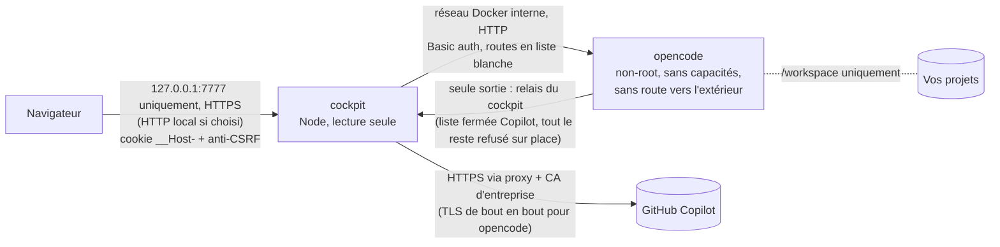

# opencode cockpit

Poste de pilotage web pour [opencode](https://opencode.ai), conçu pour travailler avec **GitHub Copilot** en entreprise :

- **Assistants** : un assistant par tâche (analyser un incident, relire un script avant mise en production, préparer une demande de changement pour le CAB…), avec des droits limités et une IA fixée. Catalogue prêt à l'emploi et création guidée en 5 étapes, sans jamais manipuler « agent », « skill » ni « modèle ».
- **Niveaux d'IA** : Rapide, Équilibré, Expert, reliés aux IA disponibles sur votre compte Copilot, avec le coût estimé d'une demande affiché avant l'envoi.
- **Chat** : réponses en direct, appels d'outils lisibles (commandes, diffs, travail délégué), autorisations à valider en un clic, `@fichier`, `/raccourci`, images. L'IA qui va répondre est affichée avant l'envoi.
- **Studio** (mode Avancé) : créer et régler les agents, skills, commandes et instructions (`AGENTS.md`), avec validation et retour arrière automatique.
- **Archives** : chaque conversation est résumée, **classée automatiquement** (débogage, fonctionnalité, SQL, sécurité…), indexée en plein texte et exportée en Markdown dans un dossier rangé par catégorie.
- **Coûts** : suivi en temps réel de la facturation Copilot au token face à votre budget mensuel, projection de fin de mois, alertes et garde-fou sur les modèles coûteux.

Tout tourne en local dans Docker Desktop. Seul GitHub Copilot est contacté pour les modèles. Depuis la 1.0.6, opencode n'a plus aucun accès direct au réseau : sa seule sortie est le cockpit, qui ne laisse passer que GitHub Copilot et bloque tout le reste sur le poste (voir [Ce qui sort, ce qui est bloqué](#ce-qui-sort-ce-qui-est-bloqué)).

L'interface s'ouvre en **mode Simple**, pensé pour des collègues peu familiers de l'IA : règles d'utilisation à accepter au premier lancement, réglages risqués masqués. Le **mode Avancé** (Paramètres › Affichage) donne accès au Studio et aux réglages fins.

---

## Sommaire

1. [Prérequis](#prérequis)
2. [Installation](#installation)
3. [Réseau d'entreprise : proxy et certificats](#réseau-dentreprise--proxy-et-certificats)
4. [Connecter GitHub Copilot](#connecter-github-copilot)
5. [Assistants et niveaux d'IA](#assistants-et-niveaux-dia)
6. [Modes Simple et Avancé](#modes-simple-et-avancé)
7. [Suivi des coûts](#suivi-des-coûts)
8. [Classement et archives](#classement-et-archives)
9. [Studio](#studio)
10. [Commandes du quotidien](#commandes-du-quotidien)
11. [Sécurité](#sécurité)
12. [Dépannage](#dépannage)
13. [Développement](#développement)

---

## Prérequis

| Élément | Détail |
|---|---|
| Docker Desktop | Démarré, avec Docker Compose v2 (inclus). Son installation demande les droits administrateur, WSL 2 et la virtualisation activée. |
| Abonnement GitHub Copilot | Pro, Pro+, Business ou Enterprise. GitHub prend officiellement en charge opencode depuis janvier 2026. |
| Windows PowerShell 5.1+ (langage complet) | Pour `install.ps1` et `cockpit.ps1`. Le `curl.exe` livré avec Windows est recommandé : c'est la voie la plus simple pour vérifier le cockpit en HTTPS. |
| Git | Facultatif, pour `cockpit.ps1 update` et `cockpit.ps1 rollback` |

> **À vérifier avec votre DSI :**
> - l'interface est servie en HTTPS sur `https://127.0.0.1:7777`, avec un certificat créé sur le poste : le navigateur affiche un avertissement au premier accès. Si une stratégie interdit de le passer, il faut l'exception Edge `SSLErrorOverrideAllowedForOrigins = https://127.0.0.1:7777`, ou le [mode HTTP local](#mode-http-local--http). À vérifier d'avance, sans rien modifier : `.\install.ps1 -TlsPreflight` (voir [Poste géré](#poste-géré--le-navigateur-ne-propose-pas-continuer)) ;
> - l'organisation peut restreindre les modèles Copilot disponibles ou l'usage de clients tiers ; les modèles désactivés par l'administrateur n'apparaissent simplement pas ;
> - Docker Desktop n'est gratuit que pour les structures de moins de 250 salariés **et** de moins de 10 M$ de chiffre d'affaires annuel ; au-delà, un abonnement Docker est nécessaire.
>
> **Test rapide :** `docker run --rm hello-world`. S'il échoue au téléchargement, Docker Desktop n'atteint pas Docker Hub : réglez son proxy (**Settings › Resources › Proxies**) ou installez avec l'archive hors ligne (`-Mode Load`).

## Installation

```powershell
git clone https://github.com/Calgar50/opencode-cockpit.git
cd opencode-cockpit
.\install.ps1 -WorkspaceDir C:\dev
```

Sans Git : bouton **Code › Download ZIP** sur la page du dépôt, puis extraire l'archive et lancer `install.ps1` depuis le dossier extrait (si Windows bloque le script : clic droit › Propriétés › Débloquer, ou `Unblock-File .\install.ps1, .\cockpit.ps1, .\CockpitTls.ps1`).

Le script :

1. vérifie Docker ;
2. demande le dossier des projets s'il n'est pas indiqué (voir ci-dessous) ;
3. vérifie, **avant toute modification**, le mode d'accès inscrit dans `.env`, les images (mode Load) et, pour le HTTPS, la stratégie d'Edge du poste. S'il manque quelque chose, il s'arrête en un seul message, sans rien avoir changé ;
4. prépare la configuration : secrets aléatoires, proxy, export des autorités de certification de Windows ;
5. construit, télécharge ou charge les images, en enregistrant la configuration dans `.env` (droits restreints à votre compte) ;
6. démarre les conteneurs, vérifie le cockpit (empreinte du certificat et preuve du jeton), puis ouvre **https://127.0.0.1:7777** avec un lien de connexion à usage unique, après l'avertissement du navigateur (voir [Premier accès en HTTPS](#premier-accès-en-https)).

Relancer `install.ps1` est sans danger : secrets, réglages et **mode d'installation** sont conservés dans `.env`. Le mode d'accès (HTTPS, ou HTTP local s'il a été choisi) est conservé lui aussi. Le passage depuis une version antérieure à la 1.0.5 remplace le jeton de connexion : une reconnexion est alors nécessaire. Si la construction ou le téléchargement des images échoue, `.env` garde les images précédentes.

**Dossier des projets (`-WorkspaceDir`) :** indiquez le dossier **parent** de vos dépôts (par exemple `C:\dev`, qui contient `C:\dev\api` et `C:\dev\front`), pas un dépôt précis. Clonez le cockpit **en dehors** de ce dossier : `install.ps1` refuse que l'un contienne l'autre, car l'agent pourrait sinon modifier les scripts que vous lancez sous Windows.

- Chaque sous-dossier de premier niveau devient un projet dans le Chat, en plus de l'entrée « Tout le workspace ».
- Les dossiers masqués, `node_modules` et `__pycache__` sont ignorés ; un dépôt ajouté plus tard apparaît sans réinstallation.
- L'agent ne voit que ce dossier. Pour en changer : `.\install.ps1 -WorkspaceDir <dossier>`.

### Premier accès en HTTPS

Depuis la 1.0.5, le cockpit est servi en **https://127.0.0.1:7777**. Au premier accès, le navigateur affiche **« Votre connexion n'est pas privée »** (`NET::ERR_CERT_AUTHORITY_INVALID`). C'est attendu :

1. comparez l'empreinte SHA-256 affichée par `install.ps1` (ou par `.\cockpit.ps1 tls`) avec celle du certificat présenté par le navigateur ;
2. si elles sont identiques : **Avancé › Continuer vers 127.0.0.1 (non sécurisé)**.

- Le certificat est **auto-signé**, créé par le cockpit lui-même au premier démarrage, et rangé dans un volume Docker réservé au cockpit. Il n'est **jamais** ajouté au magasin de certificats de Windows : rien n'est installé sur votre poste, et aucun autre site n'est concerné.
- L'avertissement revient au plus tard tous les **7 jours**. Il revient aussi dans chaque profil de navigateur, séparément pour `localhost` et pour `127.0.0.1`, et après chaque nouveau certificat (renouvellement, `.\cockpit.ps1 tls -Renew`, `uninstall -Purge`). Utilisez toujours **127.0.0.1**.
- Le cockpit n'envoie pas d'en-tête HSTS : l'avertissement reste contournable, et aucune adresse `http://` du poste n'est forcée en `https://`.
- Entre les deux conteneurs, le trafic reste en HTTP sur le réseau interne de Docker, sans port publié : il ne sort pas de Docker.

### Poste géré : le navigateur ne propose pas Continuer

Sur un poste d'entreprise, une stratégie peut interdire de passer l'avertissement de certificat. Le symptôme : Edge affiche **« 127.0.0.1 est actuellement inaccessible »** avec le seul bouton **Actualiser**, sans **Avancé** ni **Continuer**.

**À vérifier avant d'installer**, sans rien modifier sur le poste :

```powershell
.\install.ps1 -TlsPreflight
```

Il lit les stratégies du navigateur et dit si le HTTPS local passera. La vérification qui fait foi reste `edge://policy`, filtre `SSLError`.

**Deux issues**, au choix :

1. **Demander l'exception à l'informatique** — stratégie Edge `SSLErrorOverrideAllowedForOrigins` avec la valeur `https://127.0.0.1:7777`, c'est-à-dire pour cette seule adresse et ce seul port. Puis `.\install.ps1`. Si `COCKPIT_PORT` change un jour, l'exception porte sur l'ancien port : il faut la redemander.
2. **Le mode HTTP local** : `.\install.ps1 -Http` (voir la section suivante). Il ne dépend d'aucune exception, mais le trafic entre le navigateur et le cockpit circule alors en clair sur ce PC.

`.\cockpit.ps1 rollback` reste possible pour revenir à la version précédente. Deux contournements ne sont **pas** pris en charge : taper `thisisunsafe` sur la page d'avertissement, et importer le certificat du cockpit dans le magasin de Windows.

> Quand un message d'un script vous arrête, le tableau [Message affiché → commande à lancer](#message-affiché-par-un-script--commande-à-lancer) donne la commande à taper.

### Mode HTTP local (`-Http`)

À utiliser **seulement** quand le navigateur du poste interdit l'avertissement de certificat et que l'exception n'est pas obtenue.

```powershell
.\install.ps1 -Http
```

Le script explique ce qui change, puis demande de taper `HTTP EN CLAIR` pour confirmer. Toute autre réponse annule sans rien modifier. Aucun paramètre ne permet d'éviter cette confirmation, et le cockpit ne bascule **jamais** de lui-même en HTTP.

**Ce qui circule en clair** entre le navigateur et le cockpit, sur ce PC :

- le cookie de session, qui donne accès au cockpit pendant 30 jours ;
- tout le contenu des pages : vos conversations, le code envoyé et reçu, le code de connexion GitHub affiché.

**Qui peut le lire :**

- les outils de sécurité du poste qui inspectent le trafic (EDR, DLP, protection web) : ils peuvent enregistrer les adresses complètes et les cookies ;
- un programme lancé avec les droits administrateur ;
- tout compte capable de piloter Docker Desktop (groupe `docker-users`) : le trafic traverse la machine virtuelle et le réseau de Docker. Ce compte peut de toute façon lire le jeton dans le conteneur, dans les deux modes.

**Ce qui ne change pas :** le cockpit n'écoute que sur `127.0.0.1`, le jeton reste de 256 bits, le cookie garde le préfixe `__Host-`, les contrôles d'hôte et d'origine et la CSP sont identiques, et le trafic vers GitHub Copilot reste chiffré.

**Se connecter :** uniquement avec `.\cockpit.ps1 open`. Il vérifie que le serveur connaît bien le jeton avant d'ouvrir le lien. **Ne tapez jamais le jeton dans une page en `http`** : en mode HTTP local, l'écran de connexion ne le demande pas, et le serveur refuse ce mode de connexion.

**Au quotidien :** un bandeau permanent rappelle le mode dans l'interface, et chaque commande des scripts l'affiche. Le choix est mémorisé dans `.env` avec sa date, et `.\cockpit.ps1 update` le conserve.

**Revenir en HTTPS**, dès que le poste l'autorise :

```powershell
.\install.ps1 -Https
```

Un nouveau jeton est alors généré, car l'ancien a circulé en clair : il faut se reconnecter une fois. Le certificat précédent est réutilisé s'il est encore valable, donc sans nouvel avertissement si vous l'aviez accepté il y a moins de 7 jours.

> Limite déclarée : modifier à la main les deux lignes `COCKPIT_LOCAL_SCHEME` et `COCKPIT_LOCAL_HTTP_CONFIRMED` de `.env` contourne la confirmation. `.env` n'est lisible que par votre compte Windows, et la date du choix est affichée partout.

### Trois façons d'obtenir les images

| Mode | Commande | Quand l'utiliser |
|---|---|---|
| Construction locale (défaut) | `.\install.ps1` | Docker Hub, le registre npm et les dépôts Debian sont joignables |
| Téléchargement GHCR | `.\install.ps1 -Mode Pull` | `ghcr.io` est joignable. Les images sont publiques : ni compte ni `docker login`. |
| Archive hors ligne | `.\install.ps1 -Mode Load -ImagesArchive .\opencode-cockpit-images-1.0.0.tar.gz` | Seul le navigateur accède à GitHub : téléchargez l'archive (et son `.sha256`) depuis la page [Releases](https://github.com/Calgar50/opencode-cockpit/releases) |

Pour vérifier l'archive avant de la charger : `(Get-FileHash .\opencode-cockpit-images-1.0.0.tar.gz -Algorithm SHA256).Hash`, à comparer au contenu du fichier `.sha256`.

### Mettre à jour

`.\cockpit.ps1 update` récupère la dernière version (`git pull`), puis relance `install.ps1` dans le mode mémorisé :

- **Build** : les images sont reconstruites ;
- **Pull** : les images de la nouvelle version sont téléchargées ;
- **Load** : sans nouvelle archive, les images déjà chargées sont gardées, avec un avertissement si leur version diffère. Pour les mettre à jour, téléchargez l'archive de la nouvelle version puis lancez `.\install.ps1 -Mode Load -ImagesArchive <archive>`.

Dossier obtenu par ZIP : `update` affiche seulement un avertissement. Remplacez les fichiers par ceux de la nouvelle version, sans toucher à `.env`, `certs\`, `archives\` ni `backups\`, puis lancez `Unblock-File .\install.ps1, .\cockpit.ps1, .\CockpitTls.ps1` et relancez `.\install.ps1`.

**Mise à jour vers la 1.0.6 :** plus aucun appel vers un site autre que GitHub Copilot ne part vers le proxy de l'entreprise (voir [Ce qui sort, ce qui est bloqué](#ce-qui-sort-ce-qui-est-bloqué)).

1. `.\cockpit.ps1 update`, comme d'habitude. Le mode d'accès ne change pas : une installation en HTTP local reste en HTTP, une installation en HTTPS reste en HTTPS. Aucune reconnexion n'est demandée.
2. Le mot de passe interne d'opencode est remplacé automatiquement, une seule fois : avant la 1.0.6, il pouvait partir en clair vers le proxy de l'entreprise. Ce mot de passe ne sert qu'entre les deux conteneurs : vous n'avez rien à faire.
3. **Mode Load :** l'archive d'images de la 1.0.6 est obligatoire (`-Mode Load -ImagesArchive <archive>`). Avec les images 1.0.5, opencode n'aurait plus aucune sortie : le script s'arrête avant toute modification.
4. Votre proxy doit être indiqué en `http://` (c'est presque toujours le cas). Sinon, `install.ps1` affiche un avertissement : corrigez-le avec `.\install.ps1 -Proxy http://<proxy>:<port>`.
5. Pour vérifier après la mise à jour : `.\cockpit.ps1 diag`, section « Acces reseau depuis le conteneur opencode ».

**Mise à jour vers la 1.0.5 :** c'est la version qui fait passer l'interface en HTTPS local. À lire avant de la lancer.

1. **Poste géré :** extrayez le ZIP de la 1.0.5 **dans un dossier à part**, puis lancez `.\install.ps1 -TlsPreflight` depuis ce dossier. Rien n'est modifié : vous saurez si le HTTPS local passera, avant de toucher à votre installation.
2. `.\cockpit.ps1 update` **n'ouvre pas le navigateur**. Une fois la mise à jour terminée, lancez `.\cockpit.ps1 open`.
3. Le **jeton de connexion est remplacé** : l'ancien a circulé en clair avec les versions précédentes. Une reconnexion, une seule fois, est nécessaire.
4. Remplacez votre favori `http://127.0.0.1:7777` par **https://127.0.0.1:7777**. En mode HTTP local, l'adresse ne change pas et le favori reste valable.
5. **Mode Load :** l'archive d'images de la 1.0.5 est obligatoire (`-Mode Load -ImagesArchive <archive>`). Les images 1.0.4 ne savent pas servir le HTTPS.
6. Si le script **s'arrête** (stratégie d'Edge, ou archive manquante) : **rien n'a été modifié et votre cockpit 1.0.4 continue de tourner** à son adresse habituelle. Suivez les commandes affichées dans le message.
7. Pour revenir en arrière : `.\cockpit.ps1 rollback`.

**Mise à jour depuis la 0.1.0, nouveautés de la 1.0.0 :** rien n'est réécrit.

- Au premier affichage, la fenêtre des règles d'or s'ouvre, puis l'interface passe en **mode Simple** avec une notice (« Passer en mode Avancé » ou « Compris »).
- Les agents principaux existants apparaissent dans **Assistants** avec l'état « À compléter » : « Compléter » leur donne un titre, un niveau et des droits lisibles.
- **Changement de comportement :** l'IA écrite dans un agent est désormais vraiment utilisée dans le chat (en 0.1.x, le sélecteur du chat l'emportait). La notice liste ces agents avec leur IA. La réflexion (« variante ») écrite dans un raccourci non délégué est aussi appliquée.

**Mise à jour depuis la 0.1.0, réglages à reprendre :**

- **Permissions :** la configuration d'opencode n'est posée qu'au premier démarrage ; une mise à jour garde les anciennes règles, qui autorisaient d'office `git status`, `git diff`, `git log`, `git show`, `git branch` et `ls`. Ces commandes peuvent être détournées pour exécuter du code sans confirmation (voir [Sécurité](#sécurité)). Après la mise à jour : **Paramètres › Sécurité › Revenir au profil Prudent** (en mode Avancé : **Paramètres › opencode › Permissions globales › Prudent › Appliquer**). Les agents créés depuis les anciens modèles « relecteur sécurité » ou « architecte » gardent aussi leurs règles : passez leur shell à « demander » ou « refuser » dans le Studio (mode Avancé).
- **Mode d'installation :** il n'était pas mémorisé. Si `.env` désigne des images publiées, la mise à jour réutilise les images 0.1.0 déjà présentes et le signale. Lancez une fois `.\install.ps1 -Mode Pull`, ou `.\install.ps1 -Mode Load -ImagesArchive <archive de la dernière version>`.

## Réseau d'entreprise : proxy et certificats

Les proxys d'entreprise inspectent souvent le HTTPS en re-signant les certificats avec leur propre autorité. Sans elle, les conteneurs échouent avec `SELF_SIGNED_CERT_IN_CHAIN` ou `unable to get local issuer certificate`.

**Méthode recommandée, vérification TLS conservée :** `install.ps1` exporte automatiquement les autorités de confiance du magasin Windows dans `certs\windows-trust.pem`. Le conteneur opencode les ajoute à son magasin au démarrage (`NODE_EXTRA_CA_CERTS`, `SSL_CERT_FILE`, `GIT_SSL_CAINFO`). Après une mise à jour des certificats du poste : `.\cockpit.ps1 certs`. Depuis la 1.0.1, le serveur du cockpit les charge aussi : il lit lui-même la liste des IA et, si vous l'activez, le solde chez GitHub.

> Ces certificats ne servent qu'au trafic **sortant**. Le certificat HTTPS du cockpit est ailleurs, dans le volume Docker `cockpit-tls` : ne déposez jamais de certificat ni de clé du cockpit dans `certs\`, qui est aussi monté dans le conteneur de l'agent.

**Certificat ajouté à la main :** déposez le certificat racine du proxy dans `certs\`, au format texte PEM (`-----BEGIN CERTIFICATE-----`), avec l'extension `.pem` ou `.crt`. Un `.cer` binaire se convertit avec `certutil -encode .\racine.cer .\certs\racine.pem`. Ensuite :

- erreur pendant l'utilisation : `.\cockpit.ps1 restart` ;
- erreur pendant la construction des images (npm, apt) : relancez `.\install.ps1`, car les certificats sont intégrés aux images lors de leur construction.

**Proxy :** sans `-Proxy`, le script reprend la valeur déjà enregistrée dans `.env`, sinon la variable d'environnement `HTTPS_PROXY`, sinon le proxy système Windows (script PAC compris).

- Pour le changer : `.\install.ps1 -Proxy http://proxy.entreprise.lan:8080`.
- Pour s'en passer : `.\install.ps1 -Proxy ''`. Ce choix est mémorisé.
- Le trafic interne entre conteneurs ne passe jamais par le proxy.
- Depuis la 1.0.6, seul le conteneur du cockpit utilise ce proxy, pour ses propres appels et pour ceux d'opencode qu'il laisse passer. Indiquez-le en `http://` (schéma absent = `http://`) : le cockpit ne sait pas passer par un proxy en `https://` ou `socks`, et `install.ps1` vous le signale.
- Docker Desktop télécharge les images (image de base en mode Build, images GHCR en `-Mode Pull`) avec son propre réglage de proxy (**Settings › Resources › Proxies**), pas avec celui de `.env`.

**Secours, vérification TLS désactivée :** `.\install.ps1 -InsecureTls`. À réserver au cas où l'export des certificats ne suffit pas. La vérification est alors coupée pour opencode **et** pour tous les appels sortants du serveur du cockpit, jeton Copilot compris. Un bandeau rouge le rappelle en permanence dans l'interface. Le réglage est mémorisé : `.\install.ps1 -SecureTls` réactive la vérification.

> Les proxys qui exigent une authentification **NTLM/Kerberos** ne sont pas pris en charge, ni par opencode, ni par le cockpit (identifiants `Basic` seulement, dans l'adresse du proxy). Il faut un relais local, à faire valider par la DSI.

### Ce qui sort, ce qui est bloqué

Depuis la 1.0.6, **tout est bloqué sauf ce dont le cockpit a besoin pour GitHub Copilot**, et ce blocage se fait **sur le poste**, avant le proxy de l'entreprise : un site refusé n'apparaît jamais dans les journaux du proxy, et ne peut donc déclencher aucune alerte.

- **opencode n'a plus aucun accès direct au réseau.** Son conteneur est sur un réseau Docker « interne », sans route vers l'extérieur ni résolution de noms externes. Sa seule sortie est un relais du cockpit, qui n'écoute que sur ce réseau.
- **Le relais ne laisse passer qu'une liste fermée**, en HTTPS (port 443) et par nom, jamais par adresse IP :

| Adresse | Quand | Pourquoi |
|---|---|---|
| L'adresse de l'API Copilot **réellement utilisée** : celle de `-CopilotApiUrl` si vous l'avez imposée, sinon celle que le cockpit a vérifiée, sinon `api.githubcopilot.com` (ou `copilot-api.<domaine>` pour GitHub Enterprise) | Toujours | Liste des IA du compte et demandes d'IA |
| `github.com` | Seulement pendant une connexion à Copilot lancée depuis le cockpit (20 minutes au plus) | Code de connexion, puis attente de votre accord |
| Le domaine déclaré dans `COCKPIT_GITHUB_ENTERPRISE_DOMAIN` | Seulement pendant une connexion, s'il est déclaré | Même connexion, pour GitHub Enterprise |

- **Tout le reste est refusé sur place**, sans aucune requête vers le proxy de l'entreprise : `models.opencode.ai`, `registry.npmjs.org`, `api.github.com`, les autres adresses Copilot, toute page web demandée par l'IA, et toute commande de l'IA qui tenterait de sortir (`curl`, `git push`, `npm`, `pip`…).
- **Journal :** chaque refus est noté dans le journal du cockpit, au plus une fois par hôte et par heure, avec l'hôte, le port et la raison (jamais une adresse complète ni un secret). Pour le lire : `.\cockpit.ps1 diag` (résumé des 24 dernières heures), ou `docker logs opencode-cockpit-cockpit-1 --since 24h 2>&1 | Select-String "sortie d'opencode"`.
- **Les sources elles-mêmes sont coupées**, pour qu'opencode ne tente même plus ces sorties : plus de téléchargement du catalogue des modèles (`models.opencode.ai`, au démarrage puis toutes les heures jusqu'à la 1.0.5), extension `@opencode-ai/plugin` préinstallée dans l'image au lieu d'être téléchargée depuis `registry.npmjs.org`, et npm hors ligne. La liste des IA Copilot vient toujours de l'API Copilot ; le catalogue embarqué dans opencode ne fournit que les descriptions.
- **Appels d'opencode à lui-même :** jusqu'à la 1.0.5, avant chaque demande d'IA, opencode s'adressait à son propre serveur par une adresse qui passait par le proxy de l'entreprise, **en clair et avec le mot de passe de ce serveur**. Ces appels restent désormais dans le conteneur, et la mise à jour remplace ce mot de passe.
- **Le cockpit lui-même** passe par le proxy de l'entreprise pour `api.github.com` (adresse de votre abonnement, solde facultatif) et pour l'adresse de l'API Copilot (liste des IA). Son test **Diagnostic › Tester la connexion Copilot** ne contacte plus que les adresses qu'il utilise.
- **Le TLS reste vérifié de bout en bout** entre opencode et Copilot : le relais ne voit qu'un tunnel chiffré. Si votre proxy inspecte le TLS, son autorité doit toujours être dans `certs\`.

> **Au travail, sans aucune alerte :** si le proxy n'ouvre que l'adresse de votre abonnement (Business ou Enterprise), imposez-la une fois : `.\install.ps1 -CopilotApiUrl https://api.business.githubcopilot.com -NoBrowser`. Sans cela, le cockpit essaie d'abord l'adresse générale `api.githubcopilot.com`, à chaque démarrage puis environ une fois par heure, et le proxy verrait ce refus. Faites aussi les mises à jour en mode Load (archive de la release) : les modes Build et Pull téléchargent depuis Docker Hub, Debian, npm et GHCR.

### Pare-feu qui n'ouvre que l'adresse de votre abonnement Copilot

GitHub propose aux entreprises de n'ouvrir que l'adresse de leur abonnement (`*.business.githubcopilot.com` ou `*.enterprise.githubcopilot.com`) et de bloquer les autres ([documentation GitHub](https://docs.github.com/en/copilot/how-tos/administer-copilot/manage-for-organization/manage-access/manage-network-access)). opencode 1.18.30 utilise pourtant toujours l'adresse générale `api.githubcopilot.com`. Résultat mesuré derrière un tel proxy :

- chaque demande échoue (`AI_APICallError`, par exemple `Unable to connect` ou `Forbidden`) ;
- opencode ne peut pas lire la liste des IA de votre compte et affiche tout son catalogue embarqué, IA désactivées par votre organisation comprises.

Depuis la 1.0.1, le cockpit :

- prend l'adresse imposée par `-CopilotApiUrl` si vous en avez donné une ; sinon il garde l'adresse générale quand elle est joignable, et prend celle que GitHub annonce pour votre abonnement quand le réseau la bloque ;
- l'écrit dans la configuration d'opencode (`provider.github-copilot.options.baseURL`), quand aucune conversation ne travaille, puis vérifie **l'adresse réellement utilisée** par opencode dans chaque dossier et la revérifie après chaque redémarrage d'opencode (1.0.3). Tant que l'adresse n'est pas vérifiée, les nouvelles demandes sont refusées (1.0.4) : quelques secondes au démarrage du cockpit ou après un redémarrage d'opencode, jusqu'à la fin de la réponse en cours quand la correction doit l'attendre, et tant qu'opencode est injoignable. **Diagnostic › Adresse imposée à opencode** l'affiche ; si opencode ne l'utilise pas encore, l'état « redémarrage requis » propose le bouton **Redémarrer opencode** ;
- lit lui-même, à cette adresse, la liste des IA de votre compte, chacune marquée disponible ou non.

Pour imposer l'adresse : `.\install.ps1 -CopilotApiUrl https://api.business.githubcopilot.com -NoBrowser`. Pour vérifier : **Diagnostic › Tester la connexion Copilot**, ou `.\cockpit.ps1 diag`.

> **Limites :** avec une adresse remplacée, opencode 1.18.30 ne sait plus joindre les IA Anthropic de Copilot (appelées par `/v1/messages`) ; le cockpit les masque et le signale dans **Diagnostic**. Faute de compte Copilot Business sur le poste de développement, l'acceptation du jeton de connexion d'opencode par l'adresse Business n'a pas pu être vérifiée : le test de connexion l'indique (réponse 401).

## Connecter GitHub Copilot

**Paramètres › Connexion › Connecter** affiche un code dans le cockpit : cliquez **Copier le code**, puis **Ouvrir GitHub**, collez le code et autorisez l'accès. La connexion se termine toute seule ; le code expire au bout d'environ 15 minutes. GitHub Enterprise avec résidence des données est également pris en charge. Le jeton reste dans le volume Docker d'opencode.

Par défaut, **seul le fournisseur `github-copilot` est autorisé**. Les modèles gratuits « OpenCode Zen » qu'opencode active d'origine sont désactivés : aucun code n'est envoyé à un autre prestataire. Le cockpit vérifie aussi chaque demande : une IA d'un autre fournisseur est refusée avant d'atteindre opencode.

**IA disponibles ou non (1.0.1) :** **Paramètres › Connexion** liste les IA de votre compte, lues directement chez GitHub, chacune marquée « Disponible » ou « Pas disponible » avec la raison. Exemple de raison : une IA désactivée par la politique GitHub Copilot de votre organisation. Une IA non disponible n'est proposée nulle part, et le cockpit refuse toute demande qui la vise avant de l'envoyer. Les niveaux d'IA prennent la première IA disponible de leur liste.

## Assistants et niveaux d'IA

L'interface parle de tâches, pas de technique :

| Dans l'interface | Pour opencode | En une phrase |
|---|---|---|
| **Assistant** | agent principal géré par le cockpit | Fait une tâche précise, avec des droits limités et une IA adaptée. |
| **Assistant général** | agent `build` | Pour les demandes qui ne correspondent à aucun assistant. Demande avant de modifier ou d'exécuter. |
| **Fiche** | skill | Une procédure ou une checklist que l'assistant consulte. Elle n'a pas d'IA à elle : l'assistant la lit avec la sienne. |
| **Raccourci** (`/nom`) | commande | Un texte tout prêt, lancé en tapant `/nom` dans le chat. |
| **Niveau d'IA** | liste ordonnée de modèles | Rapide, Équilibré ou Expert. |
| **Réflexion** | variante du modèle | Plus de réflexion : réponses plus lentes et plus chères. |
| **Travail délégué** | sous-agent | Un autre assistant travaille à part, puis l'IA de la conversation reprend la main. |

**Page Assistants :**

- **Catalogue** : six exemples prêts à l'emploi, à relire avec votre équipe. L'installation ajoute les fiches manquantes, sans jamais écraser une fiche existante.

  | Assistant | Droits | Niveau | Fiches |
  |---|---|---|---|
  | Analyser un incident | Lecture seule | Équilibré | `anonymisation-donnees` |
  | Relire un script avant mise en production | Lecture seule | Équilibré | `standards-scripts`, `anonymisation-donnees` |
  | Préparer une demande de changement pour le CAB | Lecture seule | Expert | `checklist-cab` |
  | Relire une requête SQL sur un réplica | Lecture seule | Équilibré | `requetes-sql-sures` |
  | Expliquer une alerte de supervision | Lecture seule | Rapide | — |
  | Rédiger ou mettre à jour un runbook | Propose, vous validez | Équilibré | — |

- **Créer un assistant** en 5 étapes. La **fiche d'identité** se met à jour à chaque étape : tâche, ce que l'assistant peut faire et ne fait jamais, IA, coût estimé d'une demande, fiches. Le fichier produit est vérifié par opencode avant d'être gardé.
- **Deux profils de droits seulement**, sûrs par construction :

  | | Lecture seule (défaut) | Propose, vous validez |
  |---|---|---|
  | Modifier un fichier | jamais | sur confirmation |
  | Lancer une commande | jamais | sur confirmation |
  | Déléguer à un autre assistant | jamais | jamais |
  | Consulter Internet | jamais, ou sur confirmation si la case est cochée | idem |
  | Ouvrir une fiche | seulement les siennes | idem |
  | Lire un fichier de clés (`.pfx`, `.p12`, `.key`, `.jks`, `id_rsa`, kubeconfig…) | jamais ; `.env` sur confirmation | idem |

  Chaque assistant reçoit aussi un bloc « Règles communes » : signaler une donnée client ou un secret sans le recopier, écrire « À VÉRIFIER » plutôt qu'inventer, ne jamais donner de « feu vert » à la place d'un collègue ou du CAB.
- Les agents créés avant la 1.0.0 apparaissent « À compléter ».

**Quelle IA répond ?** Le cockpit applique les règles d'opencode 1.18.30, relevées dans son code, et le serveur les fait respecter :

| Demande | IA utilisée et facturée |
|---|---|
| Message à un assistant | toujours l'IA de l'assistant |
| Message à l'Assistant général | l'IA du niveau choisi sous la zone de saisie (Équilibré par défaut) |
| `/raccourci` | l'IA du raccourci s'il en a une, sinon celle de l'assistant qu'il désigne, sinon celle de la conversation |
| Travail délégué | l'IA de l'assistant délégué, puis une **reprise** sur l'IA de la conversation, qui résume et peut poursuivre : au moins deux appels facturés |
| Fiche | aucune IA propre : lue avec l'IA de l'assistant |

**Niveaux d'IA** (**Paramètres › Niveaux d'IA**) : chaque niveau prend la première IA disponible sur **votre** compte Copilot.

| Niveau | Recommandation livrée : IA préférée, puis IA de secours |
|---|---|
| Rapide | `gpt-5.4-mini` › `gpt-5-mini` › `claude-haiku-4.5` |
| Équilibré | `claude-sonnet-5` › `gpt-5.3-codex` › `claude-sonnet-4.6` |
| Expert | `claude-opus-5` › `claude-opus-4.8` › `gpt-5.6-sol` |

- « IA de secours » s'affiche quand ce n'est pas l'IA préférée qui sert.
- Les IA très chères et les prix promotionnels ne sont jamais proposés d'office ; en mode Avancé, elles apparaissent sous « Réservé (très cher) ».
- La recommandation suit les mises à jour du cockpit. La modifier (mode Avancé) en garde une copie ; « Revenir à la recommandation » la rétablit.
- Un assistant enregistre dans son fichier l'IA de son niveau. **Aucun fichier n'est réécrit en silence** : si cette IA disparaît du compte, l'envoi est bloqué avec un message. **Mettre à jour** réaligne alors les assistants en une fois : sauvegarde de chaque fichier, vérification par opencode, retour arrière complet en cas de refus. La mise à jour attend la fin des réponses en cours.
- « ≈ X $ par demande » est une estimation : d'abord selon la taille de la tâche, puis selon vos dernières demandes avec cet assistant. Le coût réel apparaît dans la page Coûts.

## Modes Simple et Avancé

Chaque installation, mise à jour comprise, s'ouvre en **mode Simple**. On change de mode dans **Paramètres › Affichage**.

| | Mode Simple (défaut) | Mode Avancé |
|---|---|---|
| Pages | Chat, Assistants, Coûts, Archives, Paramètres, Diagnostic | les mêmes, plus **Studio** |
| Paramètres | Connexion, Niveaux d'IA (consultation), Budget, Chat, Affichage, Sécurité | en plus : modification des niveaux d'IA, Tarifs, Classement, opencode |
| Réponse à une demande d'autorisation | « Autoriser une fois » ou « Refuser » | pareil : « Toujours autoriser » n'est jamais proposé (voir [Sécurité](#sécurité)) |
| Un message avec une autre IA que celle de l'assistant | impossible | possible pour un seul message, si l'option est activée |

- **Règles d'or :** au premier lancement, et à chaque changement de leur texte, la fenêtre « Avant de commencer » bloque l'interface jusqu'à leur acceptation. Les 6 règles : tout ce qui est écrit ou joint part chez GitHub Copilot ; jamais de données clients ; jamais de secrets ; l'IA n'agit jamais sur la production ; elle ne remplace ni la relecture par un collègue ni le CAB ; elle peut se tromper avec assurance.
- **Bandeau permanent** sous la zone de saisie : « Avant d'envoyer : aucune donnée client, aucun mot de passe, aucune clé. Relisez toujours la réponse : l'IA peut se tromper. »
- **Garde du serveur :** en mode Simple, le serveur refuse les écritures du Studio, de la configuration d'opencode et des niveaux d'IA, ainsi que les réglages avancés (« Action réservée au mode Avancé »). Elle évite les erreurs, mais ce n'est pas une barrière de sécurité : chacun peut passer en mode Avancé.

## Suivi des coûts

Depuis le **1er juin 2026**, Copilot facture **au token**, en crédits IA (1 crédit = 0,01 $). Le compteur est remis à zéro le 1er de chaque mois à 00:00 UTC, et un budget utilisateur épuisé bloque les requêtes, sans repli sur un modèle gratuit.

Le cockpit enregistre **chaque appel de modèle**, sous-agents, compaction et classement compris :

1. **Montant facturé :** opencode lit le coût réellement facturé renvoyé par GitHub et le cockpit l'utilise en priorité.
2. **Estimation**, à défaut, dans cet ordre :
   - votre tarif personnalisé (**Paramètres › Tarifs**) ;
   - pour les modèles Copilot, la grille officielle GitHub intégrée au cockpit (relevé du 13/09/2026, paliers « long contexte » compris) ;
   - le catalogue d'opencode.

L'option « Toujours appliquer la grille » ignore le montant facturé et retient l'estimation.

Le tableau de bord montre la dépense du mois face au budget (150 $ par défaut), le rythme quotidien, la projection et la date d'épuisement estimée. Les répartitions sont affichées par modèle, catégorie, agent et projet, avec la liste des conversations les plus coûteuses et un export CSV.

**Garde-fou :** au-delà de 80 % du budget, les modèles dont la sortie coûte plus de 15 $/M tokens demandent une confirmation. Une fois le budget atteint, tout modèle payant demande confirmation. Seuils réglables. Le garde-fou vérifie chaque appel facturé d'une demande : IA de l'assistant, d'un raccourci, d'un travail délégué et reprise comprises.

**Solde réel (optionnel) :** l'interface peut interroger l'endpoint GitHub `copilot_internal/user`, celui qu'utilisent les éditeurs. Cet endpoint n'est pas documenté, il est donc désactivé par défaut.

## Classement et archives

Quand une conversation devient inactive :

1. elle est archivée : transcription avec secrets masqués, fichiers modifiés, outils utilisés, coût ;
2. elle est classée immédiatement par une **heuristique gratuite** (mots-clés, outils utilisés, fichiers touchés) ;
3. après 2 minutes d'inactivité, un **petit modèle bon marché** affine la catégorie, les étiquettes et le résumé (environ 0,001 $ par conversation). Il propose aussi un titre, retenu seulement si opencode n'a laissé qu'un titre générique ;
4. une copie Markdown est écrite dans `archives\<Catégorie>\<AAAA-MM>\`.

Les catégories (nom, emoji, couleur, mots-clés) sont personnalisables. Corriger à la main la catégorie, les étiquettes ou le résumé fige tout le classement de la conversation : le classement automatique ne la modifie plus, même après de nouvelles demandes. Seul le bouton « Reclasser avec l'IA » le remplace ; un titre modifié à la main reste conservé. Supprimer une conversation d'opencode conserve son archive.

## Studio

Réservé au mode Avancé. Agents, skills (`SKILL.md` et fichiers annexes), commandes et instructions, avec une galerie de modèles prêts à l'emploi : relecteur sécurité, architecte, testeur, expert SQL, message de commit, etc. La portée globale est utilisée par défaut. Tant que `COCKPIT_PROJECT_CONFIG=0` (valeur par défaut, voir [Sécurité](#sécurité)), la portée projet est en lecture seule pour les agents, skills et commandes, et opencode ne charge pas d'office le `AGENTS.md` des projets : placez vos consignes dans le `AGENTS.md` global. Exception : quand l'agent lit un fichier, opencode joint encore les `AGENTS.md` des dossiers situés entre ce fichier et le dossier de la conversation.

Chaque enregistrement est **validé avec les règles exactes d'opencode**, puis vérifié par opencode lui-même. Si opencode refuse le fichier, la modification est **annulée automatiquement** et opencode est redémarré si nécessaire. Sans cette protection, un seul agent invalide bloque tout le serveur opencode.

Le champ « IA » propose un niveau (Rapide, Équilibré, Expert) ou une IA précise. Le panneau « Quelle IA sera utilisée ? » montre l'IA réellement utilisée et facturée, travail délégué et reprise compris, avec le même calcul que le chat et le serveur. Les modèles de la galerie portent un badge « Niveau conseillé ». La « Variante » d'une commande est désormais appliquée, sauf pour un raccourci délégué : le Studio invite alors à la régler sur l'assistant délégué.

## Commandes du quotidien

```powershell
.\cockpit.ps1 open                 # vérifie le cockpit (empreinte, preuve du jeton), puis ouvre l'interface déjà connectée
.\cockpit.ps1 status               # état des conteneurs, mode d'accès, empreinte et échéance du certificat
.\cockpit.ps1 logs                 # journaux en direct (ou : logs opencode / logs cockpit)
.\cockpit.ps1 diag                 # diagnostic en lecture seule : conteneurs, accès réseau à Copilot, journal
.\cockpit.ps1 tls                  # certificat HTTPS local et stratégie du navigateur
.\cockpit.ps1 tls -Renew           # nouveau certificat (après avoir tapé RENOUVELER)
.\cockpit.ps1 stop                 # arrêt ; start pour relancer
.\cockpit.ps1 restart              # recrée les conteneurs : applique un changement de .env ou de certs\
                                   #   (les variables du shell et les fichiers docker-compose.override.yml sont ignorés)
.\cockpit.ps1 certs                # réexporte les certificats Windows puis recrée les conteneurs
                                   #   (ne change pas le certificat HTTPS du cockpit)
.\cockpit.ps1 update               # git pull puis réinstallation dans le même mode
.\cockpit.ps1 rollback             # revient à la version précédente (après confirmation)
.\cockpit.ps1 backup               # sauvegarde dans backups\
.\cockpit.ps1 restore <fichier>    # restaure une sauvegarde (remplace les données actuelles)
.\cockpit.ps1 uninstall            # supprime les conteneurs (-Purge : données et images comprises,
                                   #   certificat HTTPS compris : nouvel avertissement à la réinstallation)

.\install.ps1 -Http                # mode HTTP local (confirmation demandée)
.\install.ps1 -Https               # retour en HTTPS
```

**Revenir à la version précédente (`rollback`) :** après avoir tapé `REVENIR`, la commande remet dans `.env` les images et la version mémorisées avant la mise à jour (clés `COCKPIT_PREVIOUS_VERSION`, `COCKPIT_PREVIOUS_APP_IMAGE`, `COCKPIT_PREVIOUS_OPENCODE_IMAGE` et `COCKPIT_PREVIOUS_INSTALL_MODE`, écrites une seule fois lors du passage à la 1.0.5), repositionne la copie git sur l'étiquette de cette version, puis relance son `install.ps1`. Elle refuse de commencer si le dossier contient des modifications non enregistrées ou des commits non publiés, et n'écrase jamais un fichier. Vos données, archives, sauvegardes, `certs\` et le certificat HTTPS local sont conservés. Sans git, elle affiche la marche à suivre au lieu d'agir.

**Sauvegarde et restauration :**

- `backup` enregistre les réglages, coûts et archives indexées (volume `cockpit-data`), la configuration et les données d'opencode, et le dossier `archives\`. Il exclut le jeton GitHub Copilot, `.env`, `certs\` et le certificat HTTPS local (volume `cockpit-tls`).
- `restore` vérifie l'archive avant d'arrêter quoi que ce soit et demande de taper `RESTAURER`. Il redémarre ensuite les conteneurs, même en cas d'échec.
- Après une restauration sur un autre poste, reconnectez GitHub Copilot.

## Sécurité


```mermaid
flowchart LR
  B[Navigateur] -- "127.0.0.1:7777 uniquement, HTTPS<br/>(HTTP local si choisi)<br/>cookie __Host- + anti-CSRF" --> C[cockpit<br/>Node, lecture seule]
  C -- "réseau Docker interne, HTTP<br/>Basic auth, routes en liste blanche" --> O[opencode<br/>non-root, sans capacités,<br/>sans route vers l'extérieur]
  O -- "seule sortie : relais du cockpit<br/>(liste fermée Copilot, tout le reste refusé sur place)" --> C
  C -- "HTTPS via proxy + CA d'entreprise<br/>(TLS de bout en bout pour opencode)" --> G[(GitHub Copilot)]
  O -. "/workspace uniquement" .- W[(Vos projets)]
```

- **Exposition réseau :** interface publiée sur `127.0.0.1` seulement, **en HTTPS** (certificat auto-signé créé au premier démarrage, jamais approuvé dans Windows, clé rangée dans un volume réservé au cockpit), ou en HTTP local si vous l'avez choisi (`-Http`, bandeau permanent). opencode n'a aucun port publié et exige un mot de passe aléatoire.
- **Accès à l'interface :**
  - jeton de 256 bits ; cookie de session `__Host-cockpit_session` signé par le serveur (`HttpOnly`, `Secure`, `SameSite=Strict`, `Path=/`, sans `Domain`), qui expire au bout de 30 jours et que la déconnexion révoque sur tous les navigateurs. Le nom du cookie est le même dans les deux modes ; la mise à jour vers la 1.0.5 demande une reconnexion ;
  - le lien ouvert par les scripts est un **lien de connexion à usage unique**, valable 10 minutes : le jeton permanent n'apparaît dans aucune adresse ;
  - contrôle de l'en-tête `Host` (anti DNS rebinding) ;
  - en-tête anti-CSRF et vérification de l'origine (schéma servi et hôte) sur toute requête modifiante ;
  - CSP stricte (aucun script en ligne).
- **Limites :** les cookies n'isolent pas les ports. N'ouvrez pas un service local auquel vous ne faites pas confiance en `http://127.0.0.1:<autre port>` pendant une session du cockpit : il recevrait le cookie de session (c'était déjà vrai avant la 1.0.5). Par ailleurs, une commande `docker compose` lancée à la main utilise les variables de votre shell : préférez `.\cockpit.ps1 restart`, qui applique `.env` seul.
- **Proxy vers opencode en liste blanche :**
  - seules les routes utilisées par l'interface sont relayées : partage public, mise à jour à distance, injection d'identifiants, terminal, exécution shell directe et routes de lecture de fichiers (`/file*`) ne sont pas relayés ;
  - les dossiers transmis et les fichiers joints sont bornés au workspace ; seules les images collées font exception ;
  - un dossier dont le nom contient une séquence `%` suivie de deux chiffres ou lettres de A à F (`%2F`, `%41`…) n'est ni proposé comme projet, ni transmis à opencode, ni lu ou modifié par le Studio (1.0.6) : opencode décoderait ce nom une seconde fois et pourrait ouvrir un autre dossier. Un `%` isolé (`Remise 20%`) reste accepté ;
  - le cockpit n'envoie jamais à opencode l'en-tête `x-opencode-directory`, qui désignerait un dossier sans ce contrôle ;
  - dans une `/commande`, un texte contenant à la fois « ! » et un accent grave (syntaxe ``!`commande` ``) et les références `@fichier` qui sortiraient du workspace (résolues comme le fait opencode) sont refusés, car opencode les exécuterait ou les lirait sans demander d'autorisation.
- **Conteneurs :** utilisateurs non-root, `cap_drop: ALL`, `no-new-privileges`, cockpit en système de fichiers en lecture seule, **aucun accès au socket Docker** (le redémarrage d'opencode passe par un fichier de contrôle).
- **Configuration opencode par défaut (profil « Prudent », installations neuves ; après une mise à jour depuis la 0.1.0, voir [Mettre à jour](#mettre-à-jour)) :**
  - confirmation avant chaque modification de fichier par les outils d'édition, chaque commande shell de l'agent, chaque lancement de sous-agent par l'agent (avec sa consigne affichée) et chaque accès web ;
  - aucune commande shell autorisée d'office, à part `pwd` ;
  - partage désactivé, mises à jour automatiques désactivées, téléchargements de serveurs de langage désactivés.
- **Limites propres à opencode**, que la configuration ne peut pas corriger :
  - le contrôle des commandes shell ne voit ni les affectations de variables (`export GIT_CONFIG_...; git status` suffit à faire exécuter du code), ni une redirection seule (`> fichier` vide ou crée un fichier sans confirmation) ;
  - les lignes ``!`commande` `` écrites dans une commande du Studio s'exécutent à chaque lancement sans confirmation (les modèles `commit`, `revue` et `description-pr` lancent ainsi `git diff` ou `git log`) ;
  - une `/commande` liée à un sous-agent (comme `revue`) le lance sans confirmation, et mentionner un agent (`@general`) dans ses arguments lève la confirmation des sous-agents de la réponse ;
  - une réponse « Toujours autoriser » s'appliquerait à tous les agents du projet et lèverait leurs refus jusqu'au redémarrage d'opencode (mesuré : un assistant qui interdit les fichiers de clés en lit un après un « Toujours » donné sur un `.env`). Le cockpit ne la propose pas et la refuse ;
  - `grep` et `glob` peuvent afficher des lignes d'un fichier de clés même quand sa lecture est refusée : ne laissez aucun fichier de clés dans le dossier des projets ;
  - un travail délégué lancé par l'IA elle-même (outil `task`, possible avec l'Assistant général après confirmation) n'est pas estimé par le garde-fou avant de démarrer. Les assistants du catalogue et ceux créés par l'assistant de création refusent la délégation.
- **Fournisseur d'IA verrouillé deux fois :** opencode ne charge que `github-copilot`, et le cockpit refuse toute demande dont un appel facturé (IA d'un assistant, d'un raccourci ou d'un travail délégué comprise) viendrait d'un autre fournisseur. La liste se règle avec `COCKPIT_ALLOWED_PROVIDERS` ; toute autre valeur que `github-copilot` affiche en permanence le bandeau rouge « Mode test : un fournisseur autre que GitHub Copilot est autorisé. »- **IA d'un assistant imposée par le serveur :** une demande envoyée à un assistant avec une autre IA est refusée ; le chat la renvoie une seule fois avec la bonne IA et le signale. Une `/fiche` que l'assistant n'a pas le droit d'ouvrir est refusée, car opencode la lancerait sans aucun contrôle.
- **Pas de « Toujours autoriser » :** chaque action sensible se confirme une fois à la fois, et le serveur refuse une réponse « Toujours ». Pour autoriser d'office une catégorie d'actions, utilisez un profil de permissions (mode Avancé) : ces règles globales ne lèvent pas les refus propres à chaque assistant. Depuis la 1.0.2, appliquer un profil redémarre opencode quelques secondes, jamais pendant une réponse.
- **Arrêt d'une réponse :** les demandes d'autorisation encore en attente sont refusées, et le serveur refuse toute autorisation pour une conversation qui ne tourne plus. Sinon, opencode lancerait un sous-agent détaché, facturé, dont le résultat serait perdu (mesuré).
- **Dossier `.opencode/` des dépôts ignoré** (`COCKPIT_PROJECT_CONFIG=0`) : un dépôt cloné pourrait y livrer des plugins qu'opencode exécuterait dès l'ouverture du projet, sans aucune confirmation. Les agents, skills et commandes se gèrent donc en portée globale, et le `AGENTS.md` à la racine du projet ouvert n'est pas chargé d'office (ceux des sous-dossiers peuvent l'être quand l'agent lit un fichier voisin). Passez à `1` dans `.env` uniquement si tous les dépôts du workspace sont de confiance, puis `.\cockpit.ps1 restart`.
- **Fiches des dépôts ignorées :** tant que `COCKPIT_PROJECT_CONFIG=0`, les fiches qu'un dépôt livrerait dans `.agents/skills` ou `.claude/skills` ne sont pas chargées ; elles ne peuvent donc pas remplacer celles des assistants.
- **Images :** le binaire d'opencode est vérifié par une empreinte SHA-512 épinglée et installé sans script d'installation ; les identifiants d'un proxy d'entreprise ne sont pas inscrits dans les images construites sur le poste.
- **Jeton Copilot confiné :** le cockpit ne l'envoie qu'à `api.github.com` (adresse de l'abonnement, solde facultatif) et aux adresses officielles de l'API Copilot (`api.githubcopilot.com`, `api.business.githubcopilot.com`, `api.enterprise.githubcopilot.com`, `api.individual.githubcopilot.com`), ou au seul domaine GitHub Enterprise déclaré dans `COCKPIT_GITHUB_ENTERPRISE_DOMAIN`. Une adresse annoncée hors de cette liste est ignorée. Dans la configuration d'opencode, le verrou refuse pour le fournisseur Copilot toute autre adresse (`options.baseURL`, `api`, `models.<id>.provider.api`) et tout remplacement de son module d'accès (`npm`). La connexion GitHub Enterprise n'est acceptée que vers ce domaine.
- **Sorties réseau (mesurées et vérifiées dans le code d'opencode) :**
  - l'IA ne passe que par GitHub Copilot ; tout modèle d'un autre fournisseur est refusé sans aucune connexion ;
  - depuis la 1.0.6, opencode ne sort plus que par le relais du cockpit, vers la liste fermée décrite dans [Ce qui sort, ce qui est bloqué](#ce-qui-sort-ce-qui-est-bloqué) ; tout le reste est refusé sur le poste, sans requête au proxy de l'entreprise. Le catalogue des modèles (`models.opencode.ai`) et le registre npm ne sont plus contactés du tout. Une page web ou une commande autorisées ne peuvent plus joindre qu'une adresse Copilot de cette liste ;
  - le cockpit lui-même (1.0.1) : `api.github.com` et l'adresse de l'API Copilot, pour l'adresse de l'abonnement et la liste des IA du compte ; le test de connexion de **Diagnostic** ne contacte, sans jeton, que les adresses qu'il utilise (1.0.6) ;
  - aucune télémétrie, pas de partage public ; détail dans `docs/RECAPITULATIF.md`, section « Sécurité ».
- **Données :**
  - secrets masqués dans les archives (titres compris) et les journaux ; les aperçus de demandes ne sont pas conservés ;
  - cellules CSV neutralisées contre l'injection de formules, y compris avec le séparateur « ; » de l'Excel français ;
  - Markdown assaini (DOMPurify).
- **Chaîne d'approvisionnement :** versions épinglées (npm, image de base par empreinte, opencode 1.18.30), GitHub Actions épinglées par SHA, `npm audit` en CI.

## Dépannage

| Symptôme | Piste |
|---|---|
| `SELF_SIGNED_CERT_IN_CHAIN` dans **Diagnostic › Journal** | `.\cockpit.ps1 certs`. Si le problème persiste, déposez le certificat racine du proxy au format PEM dans `certs\` (voir `certs\README.md`). Si l'erreur survient pendant la construction des images, relancez `.\install.ps1`. Cela concerne les appels **sortants** via le proxy d'entreprise : c'est sans rapport avec l'avertissement du navigateur sur le certificat local. |
| `ECONNREFUSED`, `ETIMEDOUT` | Proxy absent ou erroné : `.\install.ps1 -Proxy http://…` |
| `AI_APICallError` (`Unable to connect`, `Forbidden`, 503) à chaque demande | Le pare-feu bloque `api.githubcopilot.com`. **Diagnostic › Tester la connexion Copilot** : si seule l'adresse Business (ou Enterprise) est joignable, `.\install.ps1 -CopilotApiUrl https://api.business.githubcopilot.com -NoBrowser`. Voir [Pare-feu qui n'ouvre que l'adresse de votre abonnement](#pare-feu-qui-nouvre-que-ladresse-de-votre-abonnement-copilot). |
| Diagnostic indique « redémarrage requis » pour l'adresse Copilot | L'adresse est écrite mais opencode ne l'utilise pas encore : **Redémarrer opencode** (bouton dans le même encadré). |
| Les demandes échouent après 5 tentatives | opencode n'utilise probablement pas l'adresse de votre abonnement : **Diagnostic › Adresse imposée à opencode**. Si un dossier montre encore l'adresse d'office, **Tester la connexion Copilot**, puis au besoin **Redémarrer opencode**. Le journal du cockpit (`docker logs opencode-cockpit-cockpit-1 --since 1h`) aide à confirmer. |
| Une demande reste « en cours » environ 5 minutes, puis aboutit | Le proxy a coupé en silence une connexion restée inactive : opencode la retente seul après 300 s. **Diagnostic › Redémarrer opencode** la débloque tout de suite. |
| Le refus « opencode est injoignable ou redémarre : reconnexion en cours » dure | opencode ne répond pas, ou le cockpit ne reçoit plus ses événements : ouvrez **Diagnostic**, puis lancez `.\cockpit.ps1 diag`. Les demandes repartent seules à la reconnexion. |
| Refus « L'adresse de l'API Copilot sera corrigée dès la fin de la réponse en cours » | C'est normal : une autre conversation travaille encore sur l'ancienne adresse. Réessayez quand elle a fini ; la correction part aussitôt. |
| Des IA désactivées par votre organisation apparaissent comme utilisables | Liste des IA non vérifiée auprès de GitHub : **Diagnostic › GitHub Copilot et modèles** en donne la raison, **Tester la connexion Copilot** aide à la corriger. |
| Une IA attendue est « Pas disponible » (Paramètres › Connexion) | La raison est affichée : le plus souvent, l'IA est désactivée par la politique GitHub Copilot de votre organisation. Voyez votre administrateur Copilot. |
| Démarrage bloqué sur « Starting », ou journal d'opencode vide | `.\cockpit.ps1 diag` : il indique si Docker n'arrive pas à lancer le conteneur (état `Created`, souvent un dossier de projets sur un lecteur réseau ou OneDrive) et teste les accès réseau. Depuis la 1.0.1, l'interface démarre même si opencode ne répond pas. |
| « GitHub Copilot n'est pas connecté » | **Paramètres › Connexion** |
| Un modèle attendu n'apparaît pas | Désactivé par l'administrateur Copilot ou non inclus dans votre plan. **Diagnostic › Recharger le catalogue**. |
| opencode ne répond plus après une modification de configuration | **Diagnostic › Redémarrer opencode** |
| « Attendez la fin des réponses en cours » en appliquant un profil de permissions ou le fichier brut | Le changement redémarre opencode, ce qui couperait les réponses : attendez qu'elles se terminent (ou arrêtez-les), puis réessayez. |
| 1.0.0 ou 1.0.1 : un profil de permissions affiche « opencode en applique d'autres » | opencode ne relit pas ce fichier sans redémarrer : **Diagnostic › Redémarrer opencode**, ou passez en 1.0.2, qui redémarre de lui-même. |
| Écran « Accès protégé par jeton » | `.\cockpit.ps1 open`. La connexion est valable 30 jours. En mode HTTP local, l'écran ne propose pas de saisir le jeton : c'est voulu. |
| « Hôte non autorisé » | Ouvrez `https://127.0.0.1:7777` (ou `http://127.0.0.1:7777` en mode HTTP local), pas le nom ni l'adresse IP du PC. `localhost` fonctionne, mais redemande l'avertissement de certificat. |
| « Trop de tentatives » | Trop de jetons erronés ou de liens de connexion invalides (20 en 5 minutes) : patientez quelques minutes. |
| « Votre connexion n'est pas privée » (`NET::ERR_CERT_AUTHORITY_INVALID`) | Normal au premier accès : comparez l'empreinte affichée par `.\cockpit.ps1 tls`, puis **Avancé › Continuer vers 127.0.0.1 (non sécurisé)** (voir [Premier accès en HTTPS](#premier-accès-en-https)). |
| « 127.0.0.1 est actuellement inaccessible », sans bouton **Continuer** | Le poste interdit de passer l'avertissement : voir [Poste géré](#poste-géré--le-navigateur-ne-propose-pas-continuer). |
| `ERR_EMPTY_RESPONSE`, ou « 127.0.0.1 n'a envoyé aucune donnée » | Vous ouvrez l'ancienne adresse `http://` d'un cockpit passé en HTTPS : utilisez `https://127.0.0.1:7777` et corrigez votre favori. |
| Un nouvel avertissement de certificat apparaît | Le certificat a été renouvelé : comparez la nouvelle empreinte avec `.\cockpit.ps1 tls`, puis continuez. |
| Bannière « Connexion au cockpit perdue » | Le flux d'événements est coupé (redémarrage, veille) : cliquez **Recharger**. |
| « Lien de connexion invalide, expiré ou déjà utilisé », ou « Lien d'une ancienne version » | Le lien ne sert qu'une fois, pendant 10 minutes : relancez `.\cockpit.ps1 open`. |
| Le conteneur cockpit redémarre en boucle, journal « HTTPS local impossible » | Droits du volume du certificat : relancez `.\install.ps1`, ou `.\cockpit.ps1 tls -Renew` pour repartir d'un certificat neuf. |
| Un changement de `.env` semble ignoré | `.\cockpit.ps1 restart`, puis vérifiez **Diagnostic › Réseau et sécurité**. |
| `git commit` ou `git push` échoue depuis l'agent | Normal : le conteneur n'a ni votre identité git ni vos identifiants, et depuis la 1.0.6 plus aucun accès au réseau hors Copilot. Commitez et poussez depuis Windows. |
| `.\cockpit.ps1 diag` : « bloque sur place par le relais du cockpit » | Normal pour tout site autre que Copilot (1.0.6). Pour l'adresse Copilot que vous utilisez : ce n'est pas celle que le cockpit a retenue. **Diagnostic › Tester la connexion Copilot**, ou imposez-la : `.\install.ps1 -CopilotApiUrl https://api.business.githubcopilot.com -NoBrowser`. |
| `.\cockpit.ps1 diag` : « permis par le relais, mais refuse ou injoignable en amont » | Le proxy de l'entreprise refuse cette adresse Copilot (ou `HTTPS_PROXY` est illisible). Demandez son ouverture, ou imposez l'adresse de votre abonnement avec `-CopilotApiUrl`. |
| Avertissement « Proxy en https:// » ou « socks5:// » pendant `install.ps1` | Le relais du cockpit ne passe que par un proxy `http://` : `.\install.ps1 -Proxy http://<proxy>:<port>`. |
| Un dossier de projet n'apparaît pas, ou « Nom de dossier non pris en charge (séquence %XX) » | Son nom contient `%` suivi de deux chiffres ou lettres de A à F (`%2F`, `%41`…), qu'opencode interpréterait (1.0.6). Renommez le dossier. Un `%` isolé reste accepté. |
| « Action réservée au mode Avancé (Paramètres › Affichage). » | Normal en mode Simple. Passez en mode Avancé dans **Paramètres › Affichage** si vous en avez besoin. |
| L'IA d'un assistant n'est plus disponible, rien n'a été envoyé | L'IA enregistrée dans l'assistant a disparu de votre compte Copilot : **Paramètres › Niveaux d'IA › Mettre à jour**, ou modifiez l'assistant dans la page **Assistants**. |
| « Seules les IA GitHub Copilot sont autorisées dans ce cockpit. » | La demande visait un autre fournisseur : choisissez une IA Copilot. |
| Bandeau rouge « Mode test » | `COCKPIT_ALLOWED_PROVIDERS` autorise un autre fournisseur que Copilot : retirez la ligne de `.env`, puis `.\cockpit.ps1 restart`. |

### Message affiché par un script → commande à lancer

Les scripts s'arrêtent ou avertissent en affichant toujours la marche à suivre. Ce tableau reprend les messages les plus importants. Les messages des scripts sont écrits sans accent.

| Message affiché | Ce que cela veut dire | Ce qu'il faut faire |
|---|---|---|
| « Edge interdit de passer l'avertissement de certificat sur ce poste » | Le HTTPS local serait inaccessible dans Edge. Rien n'a été modifié. | Demander l'exception `SSLErrorOverrideAllowedForOrigins = https://127.0.0.1:7777`, puis `.\install.ps1`. Sinon : `.\install.ps1 -Http`. Si `edge://policy` autorise en fait « Continuer » : `.\install.ps1 -AcceptBrowserBlock`. |
| « Strategie Edge lue : … Votre cockpit est deja en HTTPS : la mise a jour continue » | Simple avertissement : la mise à jour n'est pas bloquée. | Rien, si le cockpit s'ouvre bien dans Edge. Sinon : `.\cockpit.ps1 diag`. |
| « Mode Load : images absentes… » | Les images de cette version ne sont pas chargées sur le poste. | Télécharger l'archive de la version, puis relancer avec `-Mode Load -ImagesArchive <archive>`. |
| « Le serveur sur 127.0.0.1:7777 ne presente PAS le certificat du cockpit » | Un autre programme répond sur ce port. Aucune page n'a été ouverte. | `.\cockpit.ps1 status` ; le message nomme le programme à l'écoute. Arrêtez-le, puis réessayez. |
| « Le serveur … ne prouve pas qu'il connait le jeton de ce cockpit » | Le serveur qui répond n'est pas votre cockpit, ou `.env` a changé sans redémarrage. | `.\cockpit.ps1 status`, puis `.\cockpit.ps1 restart`. |
| « Le jeton de .env n'a pas le format genere par install.ps1 » | Le jeton a été remplacé à la main : la vérification est impossible. | `.\install.ps1` (nouveau jeton, reconnexion nécessaire). |
| « Voie de secours : petite classe .NET compilee par PowerShell » | `curl.exe` est absent ou trop ancien ; l'antivirus peut le signaler. | Rien de particulier. Pour l'éviter : installer le `curl.exe` de Windows (7.60 ou plus récent). |
| « Aucune voie de verification utilisable » | Le script ne peut pas vérifier le cockpit : il n'ouvre donc aucune page. | En HTTPS : ouvrir l'adresse à la main et comparer l'empreinte affichée. En HTTP local : `.\cockpit.ps1 diag`. |
| « Mise a jour inachevee » | Les scripts sont dans la nouvelle version, les conteneurs dans l'ancienne, **qui fonctionne toujours**. | Ouvrir le cockpit avec votre ancien favori, puis terminer : `.\install.ps1` (ou `.\install.ps1 -Http`). Pour revenir : `.\cockpit.ps1 rollback`. |
| « Le cockpit en marche ne sert pas le mode inscrit dans .env » | Une variable de votre shell ou un fichier `docker-compose.override.yml` a pris le dessus lors d'un démarrage lancé à la main. | `.\cockpit.ps1 restart`. Le message nomme la variable ou le fichier en cause : supprimez-le pour vos propres commandes docker. |
| « Retour impossible : … » | `rollback` refuse d'agir, et n'a rien modifié. | Faire ce que le message indique (enregistrer vos fichiers, récupérer l'étiquette, charger l'archive…), puis relancer. |
| « Mode d'acces invalide dans .env » | `COCKPIT_LOCAL_SCHEME` a une valeur inconnue, ou `http` sans date de confirmation valable. | `.\install.ps1 -Https` (recommandé), ou `.\install.ps1 -Http` (confirmation demandée). |

## Développement

```text
app/server/   API Node 24 (TypeScript exécuté nativement), SQLite intégré (node:sqlite), Hono
app/web/      Interface React 19 + Vite
docker/       Image opencode (superviseur, certificats, configuration par défaut)
```

```powershell
cd app
npm ci --ignore-scripts
npm run typecheck
npm test            # tests unitaires et d'intégration (sécurité HTTP, registre des coûts…)
npm run build
```

Développement de l'interface : `npm run dev:server`, avec `COCKPIT_TOKEN`, `OPENCODE_URL`, `OPENCODE_SERVER_PASSWORD` et les dossiers `COCKPIT_*` renseignés dans `.env.dev` (jamais versionné), puis `npm run dev:web`.

- Le serveur de développement tourne en mode HTTP local : ajoutez `COCKPIT_LOCAL_SCHEME=http` et `COCKPIT_LOCAL_HTTP_CONFIRMED=<AAAA-MM-JJTHH:MM:SSZ>` aux clés ci-dessus.
- Connexion : `npm run dev:link` affiche un lien de connexion à usage unique vers `http://localhost:5173`. Le jeton n'apparaît jamais dans le lien.
- Serveur de développement en HTTPS, facultatif : `COCKPIT_TLS_DIR=<chemin absolu du dossier app\.tls-dev>` et `COCKPIT_OPENSSL=<chemin absolu d'openssl.exe>`. Les deux chemins doivent être absolus : le serveur refuse de démarrer avec un chemin relatif comme `./.tls-dev`.

Publier une version : mettre à jour `VERSION`, puis pousser le tag `vX.Y.Z`. La CI publie les images sur GHCR et joint l'archive hors ligne à la release.

## Licence

MIT. opencode est un projet MIT d'Anomaly (anciennement SST).
