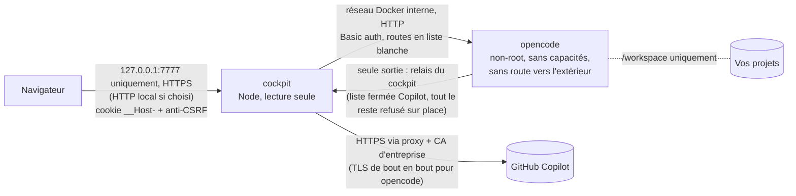

# Guide d'utilisation d'opencode cockpit 1.1.0

Ce guide complète le [README](../README.md). Le README installe le cockpit, le met à jour et fait les premiers pas. Ce guide contient tout le reste, rangé pour être retrouvé par l'[index par sujet](#index-par-sujet).

## Lire ce guide

**À qui il sert.** À toute personne qui utilise ou installe le cockpit. Chaque élément dit pour qui il vaut : mode Simple, mode Avancé, ou personne qui installe et informatique.

**Quatre familles, jamais mélangées.**

| Famille | Lettre | À quoi elle sert |
|---|---|---|
| Procédures | P | faire une tâche du début à la fin, étape par étape |
| Fiches de réglages et de référence | R | savoir ce que fait un réglage, un écran ou une commande |
| Pannes, classées par ce que vous voyez | X | réparer, en partant du message ou de l'écran que vous avez sous les yeux |
| Explications facultatives | E | comprendre ; aucune procédure n'exige de les lire |

**Conventions de forme.** Le mot porte toujours l'information ; la mise en forme ne fait qu'aider.

- Un bouton s'écrit entre crochets : [Arrêter].
- Une page, un onglet, une carte ou un chemin de menu s'écrit en gras : **Paramètres › Budget**.
- Un texte affiché par le cockpit ou par un script s'écrit entre guillemets : « Connecté ».
- Une commande, un fichier ou un réglage s'écrit en code : `.\cockpit.ps1 open`.
- Une touche du clavier s'écrit en gras : la touche **Entrée**.
- Dans une procédure, la flèche → annonce ce que vous devez voir quand l'étape a abouti. Chaque étape a une case à cocher : elle sert à retrouver sa place après une interruption. Les étapes se font dans l'ordre. Une étape qui ne vaut que dans un cas le dit en tête, par exemple *En mode Load seulement*. Quand une procédure offre plusieurs voies, le choix est posé dans « Avant de commencer » ou dans une seule étape.
- « PowerShell dans le dossier du cockpit » : une fenêtre Windows PowerShell placée dans le dossier du cockpit. Le README dit comment l'ouvrir et y aller, et quoi faire si Windows refuse les scripts : [Commandes du quotidien](../README.md#commandes-du-quotidien).

**Identifiants stables.** Chaque élément porte un identifiant : [P-16](#p-16-sauvegarder-le-cockpit), [R-24](#r-24-plafonds-de-lautonomie-et-du-travail-délégué), [X-53](#x-53-liste-des-demandes-dautorisation-illisible), [E-03](#e-03-pourquoi-internet-est-fermé-depuis-la-110). Un identifiant ne change jamais d'une version à l'autre, et un identifiant retiré n'est jamais réutilisé. Pour montrer un passage à un collègue, citez son identifiant.

**Ce qui ne se défait pas.** Quatre procédures effacent ou remplacent des données sans retour :

- [P-17](#p-17-restaurer-une-sauvegarde-irréversible), restaurer une sauvegarde ;
- [P-19](#p-19-désinstaller-le-cockpit-irréversible-avec--purge) avec `-Purge`, désinstaller ;
- [P-37](#p-37-revenir-au-profil-prudent-irréversible-sans-sauvegarde), revenir au profil Prudent, qui remplace vos autres règles globales ;
- [P-56](#p-56-supprimer-une-conversation-de-larchive-irréversible), supprimer une conversation de l'archive.

Chacune le dit dans son titre et dans la première ligne de son encadré « Avant de commencer ». L'étape 1 de [P-08](#p-08-reprendre-les-réglages-après-une-mise-à-jour-depuis-la-01x) fait la même chose que [P-37](#p-37-revenir-au-profil-prudent-irréversible-sans-sauvegarde) : [P-08](#p-08-reprendre-les-réglages-après-une-mise-à-jour-depuis-la-01x) le dit dans la première ligne de son encadré. [P-14](#p-14-renouveler-le-certificat-https-local) remplace aussi le certificat local sans retour, mais aucune donnée n'est perdue : un nouvel avertissement du navigateur suit, rien d'autre. Deux procédures baissent la sécurité tant que leur réglage reste actif : [P-04](#p-04-passer-en-mode-http-local) (mode HTTP local) et [P-13](#p-13-couper-la-vérification-tls-en-dernier-recours-puis-la-rétablir) (vérification TLS coupée).

**Le cockpit s'arrête parfois sur un message : c'est prévu.** Les scripts vérifient le poste, le plus souvent avant de modifier quoi que ce soit. Quand quelque chose manque, ils s'arrêtent sur un message qui, le plus souvent, donne la commande suivante sans rien avoir changé. Relancer `install.ps1` garde vos réglages. Au travail, une première installation peut s'arrêter une ou deux fois sur un réglage du réseau (stratégie d'Edge, proxy, certificat, adresse Copilot) : les pannes [X-01](#x-01-le-script-refuse-de-se-lancer) à [X-27](#x-27-salle-omo-non-démarrée-par-cockpitps1) donnent la suite, message par message.

**Ce qui n'a pas été éprouvé sur GitHub Copilot réel.** L'autonomie, les équipes et la construction ont été vérifiées hors ligne, sans appel facturé. Les essais sur GitHub Copilot réel restent à faire : leur liste et les replis prévus sont dans [RECAPITULATIF.md, section 11](RECAPITULATIF.md#11-limites-et-points-à-vérifier).

## Index par sujet

| Sujet | Procédures | Fiches | Pannes | Explications |
|---|---|---|---|---|
| Installer, mettre à jour, entretenir | [P-01](#p-01-vérifier-un-poste-dentreprise-avant-dinstaller) à [P-20](#p-20-charger-limage-de-la-salle-omo-facultatif-la-salle-reste-coupée) | [R-01](#r-01-prérequis-du-poste) à [R-12](#r-12-contenu-dune-sauvegarde) | [X-01](#x-01-le-script-refuse-de-se-lancer) à [X-29](#x-29-le-conteneur-du-cockpit-redémarre-en-boucle) | [E-01](#e-01-pourquoi-tout-est-bloqué-sauf-github-copilot), [E-02](#e-02-comment-le-cockpit-choisit-ladresse-de-lapi-copilot), [E-12](#e-12-comment-laccès-au-cockpit-est-protégé) |
| Se connecter, modes, règles d'or | [P-21](#p-21-connecter-github-copilot), [P-22](#p-22-reconnecter-ou-déconnecter-github-copilot), [P-29](#p-29-passer-en-mode-avancé-puis-revenir-en-mode-simple) | [R-14](#r-14-pages-et-paramètres-mode-simple-et-mode-avancé), [R-15](#r-15-les-six-règles-dor-et-le-bandeau), [R-27](#r-27-onglet-affichage-des-paramètres) | [X-30](#x-30-avertissement-de-certificat-au-premier-accès) à [X-41](#x-41-github-copilot-nest-pas-connecté), [X-63](#x-63-action-réservée-au-mode-avancé), [X-94](#x-94-page-derreur-err_connection_refused-à-louverture-du-cockpit) | [E-04](#e-04-un-seul-fournisseur-dia-github-copilot) |
| Assistants et niveaux d'IA | [P-23](#p-23-installer-un-assistant-prêt-à-lemploi) à [P-25](#p-25-compléter-un-agent-créé-avant-la-10), [P-30](#p-30-réaligner-les-assistants-quand-une-ia-disparaît) | [R-13](#r-13-vocabulaire-du-cockpit), [R-16](#r-16-assistants-prêts-à-lemploi-et-profils-de-droits-dun-assistant), [R-17](#r-17-niveaux-dia) | [X-47](#x-47-lia-dun-assistant-nest-plus-disponible), [X-48](#x-48-seules-les-ia-github-copilot-sont-autorisées), [X-71](#x-71-une-ia-attendue-est-pas-disponible), [X-72](#x-72-un-modèle-attendu-napparaît-pas) | [E-05](#e-05-quelle-ia-répond-et-ce-qui-est-facturé) |
| Chat, travail en direct, travail délégué | [P-26](#p-26-répondre-à-une-demande-dautorisation) à [P-28](#p-28-faire-écrire-un-plan-puis-lexécuter), [P-31](#p-31-voir-une-démonstration-du-travail-en-direct) | [R-18](#r-18-qui-travaille) à [R-21](#r-21-travail-délégué-selon-le-mode-et-le-choix) | [X-49](#x-49-arguments-refusés-sur-une-commande) à [X-51](#x-51-git-commit-ou-git-push-échoue-depuis-lassistant), [X-62](#x-62-autoriser-une-fois-refusé-pour-un-travail-délégué), [X-64](#x-64-des-réponses-sont-en-cours-changement-refusé) à [X-66](#x-66-opencode-ne-répond-plus-après-un-changement-de-configuration) | [E-09](#e-09-dans-quel-ordre-arrêter-arrête) à [E-11](#e-11-pourquoi-certains-changements-attendent-la-fin-des-réponses) |
| Autonomie | [P-32](#p-32-laisser-lia-modifier-les-fichiers-sans-demander) à [P-35](#p-35-lire-le-journal-du-contrôle) | [R-22](#r-22-les-quatre-choix-dautonomie) à [R-26](#r-26-onglet-budget-des-paramètres) | [X-54](#x-54-message-non-envoyé-protections-non-vérifiées) à [X-61](#x-61-contrôle-par-ia-indisponible), [X-75](#x-75-installation-dun-outil-du-cockpit-en-attente) | [E-06](#e-06-comment-le-cockpit-décide-en-autonomie) à [E-08](#e-08-ce-que-le-cockpit-ne-peut-pas-empêcher) |
| Internet fermé et autorisations | [P-36](#p-36-fermer-laccès-à-internet-dun-profil-ou-dun-assistant-signalé), [P-37](#p-37-revenir-au-profil-prudent-irréversible-sans-sauvegarde) | [R-28](#r-28-profils-de-droits-dopencode-et-configuration-par-défaut) | [X-14](#x-14-règles-internet-laissées-telles-quelles), [X-15](#x-15-règles-internet-non-mises-à-jour-opencode-en-marche), [X-52](#x-52-une-demande-web-attend-votre-accord), [X-53](#x-53-liste-des-demandes-dautorisation-illisible), [X-67](#x-67-paramètres-opencode-refuse-une-ouverture-dinternet), [X-68](#x-68-permissions-écrites-mais-opencode-en-applique-dautres) | [E-03](#e-03-pourquoi-internet-est-fermé-depuis-la-110), [E-26](#e-26-pourquoi-la-liste-des-demandes-dautorisation-est-reconstituée) |
| Onglet Fichiers | [P-38](#p-38-relire-un-fichier-que-lia-vient-décrire) | [R-30](#r-30-onglet-fichiers), [R-31](#r-31-onglet-fichiers-garanties-et-bornes) | [X-76](#x-76-messages-de-longlet-fichiers) | aucune |
| Salle de contrôle et « Revoir » | [P-39](#p-39-ouvrir-la-salle-de-contrôle) à [P-41](#p-41-revenir-à-la-3d-sur-ce-poste) | [R-32](#r-32-salle-de-contrôle-niveaux-et-adresses) à [R-34](#r-34-lecteur-de-revoir-et-copie-des-consignes) | [X-77](#x-77-pas-de-bouton-ouvrir-la-salle-de-contrôle) à [X-81](#x-81-consigne-non-enregistrée-ou-texte-non-affiché-pendant-revoir) | [E-20](#e-20-ce-que-lisent-la-salle-de-contrôle-et-revoir) |
| Équipes, méthodes, Seconde lecture | [P-42](#p-42-installer-un-exemple-déquipe-puis-lancer-une-équipe) à [P-50](#p-50-demander-une-seconde-lecture) | [R-35](#r-35-formes-et-bornes-dune-équipe) à [R-45](#r-45-démonstration-déquipe) | [X-82](#x-82-un-assistant-est-refusé-comme-étape-déquipe) à [X-91](#x-91-les-équipes-arrivent-bientôt-en-mode-simple) | [E-21](#e-21-comment-le-coût-dune-équipe-est-estimé) à [E-25](#e-25-limites-de-la-construction-et-des-méthodes) |
| Coûts, archives, Studio | [P-51](#p-51-régler-le-budget-mensuel-et-les-seuils-dalerte) à [P-58](#p-58-modifier-les-consignes-globales-agentsmd) | [R-46](#r-46-page-coûts-et-export-csv) à [R-49](#r-49-studio) | [X-39](#x-39-bandeau-rouge-mode-test) | [E-14](#e-14-doù-vient-le-montant-affiché-dans-coûts) à [E-16](#e-16-pourquoi-la-configuration-des-dépôts-est-ignorée) |
| Réseau d'entreprise et sécurité | [P-10](#p-10-ajouter-à-la-main-le-certificat-racine-du-proxy) à [P-13](#p-13-couper-la-vérification-tls-en-dernier-recours-puis-la-rétablir) | [R-06](#r-06-certificat-https-local) à [R-10](#r-10-poste-de-travail-réglages-conseillés), [R-29](#r-29-page-diagnostic), [R-31](#r-31-onglet-fichiers-garanties-et-bornes) | [X-42](#x-42-chaque-demande-échoue-avec-ai_apicallerror) à [X-46](#x-46-refus-adresse-corrigée-à-la-fin-de-la-réponse-en-cours), [X-69](#x-69-redémarrage-requis-pour-ladresse-copilot) à [X-74](#x-74-erreur-de-certificat-ou-de-proxy-dans-le-journal-dopencode), [X-95](#x-95-synchronisation-du-solde-réel-en-échec) | [E-01](#e-01-pourquoi-tout-est-bloqué-sauf-github-copilot), [E-02](#e-02-comment-le-cockpit-choisit-ladresse-de-lapi-copilot), [E-12](#e-12-comment-laccès-au-cockpit-est-protégé), [E-13](#e-13-ce-que-le-cockpit-protège-dautre-en-résumé) |
| Salle Oh My OpenAgent, livrée coupée | [P-20](#p-20-charger-limage-de-la-salle-omo-facultatif-la-salle-reste-coupée) | [R-50](#r-50-salle-omo-bornes-et-arrêts-prévus) | [X-26](#x-26-installation-arrêtée-sur-la-protection-des-dépôts-git-de-la-salle), [X-27](#x-27-salle-omo-non-démarrée-par-cockpitps1), [X-92](#x-92-salle-coupée), [X-93](#x-93-projet-non-préparé-ou-historique-git-non-protégé) | [E-17](#e-17-salle-oh-my-openagent-livrée-coupée) à [E-19](#e-19-ce-que-la-salle-omo-ne-protège-pas) |

## Procédures

Chaque procédure fait une tâche du début à la fin, en 7 étapes au plus. Chaque étape se termine par ce que vous devez voir (→). Les durées comptent la manipulation seule : ce sont des ordres de grandeur pour choisir le moment, pas des objectifs. Les commandes se tapent dans une fenêtre PowerShell ouverte dans le dossier du cockpit, sauf mention contraire.

**Installer, mettre à jour, entretenir**

### P-01 Vérifier un poste d'entreprise avant d'installer

**Avant de commencer**

- Prérequis : Windows PowerShell 5.1 ou plus récent ; Edge installé. Docker n'est pas nécessaire pour les étapes 1 à 3.
- À ouvrir : une fenêtre PowerShell ; Edge.
- Durée : 5 à 10 minutes.
- Ce qui change : rien. Aucune étape ne modifie le poste.
- Réversible : sans objet.
- Interruption : possible à toute étape.

**Étapes**

- [ ] **1.** Récupérer le dossier de la version 1.1.0 (clone git ou archive ZIP, [P-02](#p-02-installer-sans-git-depuis-larchive-zip)), dans un dossier à part de toute installation existante. → Le dossier contient `install.ps1`, `cockpit.ps1` et `CockpitTls.ps1`.
- [ ] **2.** Dans ce dossier, lancer `.\install.ps1 -TlsPreflight`. → « ==> Verification du poste (aucune modification, Docker non requis) », puis le port visé, l'exception à demander, la valeur lue de `SSLErrorOverrideAllowed`, le « Verdict Edge », l'état de `curl.exe`, la « Voie qui serait utilisee » et le mode de langage de PowerShell. Le code de sortie vaut 3 si Edge interdit de passer l'avertissement de certificat, 0 sinon.
- [ ] **3.** Dans Edge, ouvrir `edge://policy`, puis filtrer sur `SSLError`. → Les stratégies `SSLErrorOverrideAllowed` et `SSLErrorOverrideAllowedForOrigins` s'affichent, ou aucune. C'est cette page qui fait foi.
- [ ] **4.** Lancer `docker run --rm hello-world`. → Docker affiche son message de bienvenue. En cas d'échec au téléchargement : [X-03](#x-03-le-test-hello-world-échoue-au-téléchargement).
- [ ] **5.** Si le proxy de l'entreprise vous a été donné par un nom court (sans point, par exemple `proxy`), lancer `Resolve-DnsName proxy -DnsOnly`, avec ce nom. → La première ligne donne, colonne `Name`, le nom complet (par exemple `proxy.domaine.tld`) : c'est lui qu'`install.ps1` écrira dans `.env` ([R-08](#r-08-proxy-et-certificats-dentreprise)). Une erreur, ou un nom encore sans point : demander à l'informatique le nom complet du proxy ou son adresse IP ([X-22](#x-22-avertissement-ou-arrêt-sur-le-proxy-https-socks5-ou-nom-court)).

**À la fin**

- État final : vous savez si le HTTPS local passera sur ce poste, et sous quel nom complet le proxy sera inscrit.
- Si Edge interdit de passer l'avertissement, deux issues : demander à l'informatique l'exception Edge `SSLErrorOverrideAllowedForOrigins` = `https://127.0.0.1:7777`, puis installer ; ou installer en mode HTTP local ([P-04](#p-04-passer-en-mode-http-local)).
- Si `edge://policy` autorise « Continuer » alors que le script dit le contraire (par exemple une exception livrée par le cloud, absente du registre) : ajouter `-AcceptBrowserBlock` à la commande d'installation. Cette option n'est jamais mémorisée.
- Reprendre : l'installation du README, section [Installation](../README.md#installation).

### P-02 Installer sans Git, depuis l'archive ZIP

**Avant de commencer**

- Prérequis : ceux du README ([Prérequis](../README.md#prérequis)) ; un navigateur qui atteint GitHub.
- À ouvrir : la page du dépôt, `https://github.com/Calgar50/opencode-cockpit` ; l'Explorateur de fichiers ; PowerShell.
- Durée : 10 à 15 minutes, plus la construction ou le chargement des images.
- Ce qui change : comme l'installation du README.
- Réversible : en partie, par [P-19](#p-19-désinstaller-le-cockpit-irréversible-avec--purge) ; avec `-Purge`, sans retour.
- Interruption : les scripts vérifient le plus souvent avant de modifier ; relancer `install.ps1` recommence depuis le début et garde les secrets et les réglages déjà écrits.

**Étapes**

- [ ] **1.** Sur la page du dépôt, ouvrir **Code › Download ZIP**. → Une archive ZIP est téléchargée.
- [ ] **2.** Extraire l'archive hors du dossier de vos projets. → Le dossier extrait contient `install.ps1`, `cockpit.ps1` et `CockpitTls.ps1`.
- [ ] **3.** Ouvrir PowerShell dans ce dossier, puis lancer `Unblock-File .\install.ps1, .\cockpit.ps1, .\CockpitTls.ps1` (ou, pour chacun des trois fichiers : clic droit, **Propriétés**, case **Débloquer**). → La commande ne répond rien.
- [ ] **4.** Lancer `.\install.ps1 -WorkspaceDir <dossier parent de vos dépôts>`, avec l'option du mode d'images si besoin ([R-04](#r-04-trois-façons-dobtenir-les-images)). → « ==> Verification de Docker Desktop », puis la suite de l'installation, jusqu'à « [OK] Cockpit disponible sur https://127.0.0.1:7777 (…) » et « Empreinte SHA-256 du certificat : … ».
- [ ] **5.** Finir comme l'installation du README ([Installation](../README.md#installation)) : comparer l'empreinte du navigateur à celle du script, puis [Avancé] et « Continuer vers 127.0.0.1 (non sécurisé) ». → Le cockpit est ouvert, connecté, sur la fenêtre « Avant de commencer ».

**À la fin**

- État final : le cockpit tourne, installé depuis un dossier sans git. `.\cockpit.ps1 update` ne sait pas mettre à jour ce dossier ([X-20](#x-20-pas-de-dépôt-git-pour-la-mise-à-jour)) : les mises à jour se font par [P-06](#p-06-mettre-à-jour-un-dossier-obtenu-par-zip).
- Reprendre : `.\cockpit.ps1 open`.

### P-03 Vérifier et charger l'archive d'images hors ligne

**Avant de commencer**

- Prérequis : la page Releases du dépôt accessible depuis le navigateur ; le dossier du cockpit déjà récupéré (clone git, ZIP, ou `git pull` pour une mise à jour) ; Docker Desktop démarré pour l'étape 4.
- À ouvrir : `https://github.com/Calgar50/opencode-cockpit/releases` ; l'Explorateur de fichiers ; PowerShell dans le dossier du cockpit.
- Durée : 5 à 10 minutes, plus le téléchargement.
- Ce qui change : étapes 1 à 3, deux fichiers de plus dans le dossier du cockpit, rien d'autre. Étape 4 : les images de la version sont chargées dans Docker, et le mode Load est mémorisé dans `.env`.
- Pour une mise à jour, arrêtez-vous au résultat `True` de l'étape 3 : c'est la mise à jour qui charge l'archive (README, [Mettre à jour](../README.md#mettre-à-jour)).
- Réversible : en partie : une relance avec `-Mode Build` ou `-Mode Pull` choisit un autre mode ; des images chargées se retirent par `docker image rm`.
- Interruption : une archive dont les images sont antérieures à la 1.1.0 est refusée avant l'écriture de `.env` : le cockpit en marche n'est pas touché, mais les images de l'archive restent chargées dans Docker (`docker image rm` pour les retirer).

**Étapes**

- [ ] **1.** Sur la page Releases, version 1.1.0, télécharger `opencode-cockpit-images-1.1.0.tar.gz` et `opencode-cockpit-images-1.1.0.tar.gz.sha256`. → Les deux fichiers sont dans le dossier de téléchargement du navigateur.
- [ ] **2.** Déplacer les deux fichiers dans le dossier du cockpit, avec l'Explorateur de fichiers, puis lancer `dir .\opencode-cockpit-images-*` dans PowerShell. → Les deux fichiers sont listés.
- [ ] **3.** Lancer `(Get-FileHash .\opencode-cockpit-images-1.1.0.tar.gz -Algorithm SHA256).Hash -eq (Get-Content .\opencode-cockpit-images-1.1.0.tar.gz.sha256).Split(' ')[0]`. → PowerShell affiche `True`. S'il affiche `False`, l'archive est abîmée ou n'est pas la bonne : la retélécharger.
- [ ] **4.** Pour une première installation seulement, lancer `.\install.ps1 -WorkspaceDir <dossier parent de vos dépôts> -Mode Load -ImagesArchive .\opencode-cockpit-images-1.1.0.tar.gz`. → « ==> Chargement des images depuis … », « [OK] Images : … », puis « [OK] Cockpit disponible sur … ». La suite est celle de l'installation du README : empreinte à comparer, puis [Avancé] et « Continuer vers 127.0.0.1 (non sécurisé) ».

**À la fin**

- État final : l'archive est vérifiée ; après l'étape 4, les images 1.1.0 sont chargées et le mode Load est mémorisé. Chaque mise à jour demandera l'archive de sa version.
- Le fichier `.sha256` est écrit en minuscules, `Get-FileHash` répond en majuscules : `-eq` ne tient pas compte de la casse.
- Une fois l'installation ou la mise à jour réussie, les deux fichiers peuvent quitter le dossier du cockpit : une relance en mode Load réutilise les images déjà chargées.
- Archive refusée : [X-07](#x-07-images-absentes-ou-trop-anciennes).
- Reprendre : relancer la commande de l'étape 3, puis celle de l'étape 4 s'il s'agit d'une première installation.

### P-04 Passer en mode HTTP local

**Avant de commencer**

- Baisse la sécurité tant qu'il reste actif : le cookie de session et le contenu des pages circulent en clair sur ce PC ([R-07](#r-07-mode-http-local-ce-qui-circule-en-clair)).
- Prérequis : Edge interdit de passer l'avertissement de certificat sur ce poste ([P-01](#p-01-vérifier-un-poste-dentreprise-avant-dinstaller)), et l'exception n'a pas été obtenue ; une console PowerShell interactive, car la confirmation se tape au clavier.
- À ouvrir : PowerShell dans le dossier du cockpit.
- Durée : 5 à 10 minutes.
- Ce qui change : le cockpit est servi en `http://127.0.0.1:7777` ; le choix et sa date sont mémorisés dans `.env` ; un bandeau permanent le rappelle dans l'interface.
- Réversible : oui, par [P-05](#p-05-revenir-en-https) ; le jeton sera alors remplacé. Ce qui a circulé en clair pendant ce temps ne se rattrape pas.
- Interruption : toute réponse autre que `HTTP EN CLAIR` annule sans rien modifier.

**Étapes**

- [ ] **1.** Lancer `.\install.ps1 -Http`. → « ==> Mode HTTP local demande (-Http) », puis ce qui circule en clair, qui peut le lire, ce qui ne change pas, et la question « Tapez HTTP EN CLAIR pour confirmer (toute autre reponse annule sans rien modifier) ».
- [ ] **2.** Taper `HTTP EN CLAIR`, en majuscules, puis la touche **Entrée**. → L'installation continue. Aucun paramètre n'évite cette question, et le cockpit ne passe jamais en HTTP de lui-même.
- [ ] **3.** Attendre la fin de l'installation. → « [OK] Cockpit disponible sur http://127.0.0.1:7777 (mode HTTP local, preuve du jeton verifiee : …) ».
- [ ] **4.** Lancer `.\cockpit.ps1 open`. → Le cockpit s'ouvre, connecté, avec un bandeau permanent qui rappelle le mode HTTP local.

**À la fin**

- État final : le cockpit fonctionne en HTTP local. Chaque commande des scripts le rappelle, et `.\cockpit.ps1 update` garde ce mode.
- Se connecter uniquement par `.\cockpit.ps1 open`. Ne tapez jamais le jeton dans une page en `http` : l'écran de connexion ne le demande pas, et le serveur refuse ce mode de connexion.
- Reprendre : `.\cockpit.ps1 open`. Revenir en HTTPS dès que le poste l'autorise : [P-05](#p-05-revenir-en-https).

### P-05 Revenir en HTTPS

**Avant de commencer**

- Prérequis : Edge autorise l'avertissement de certificat sur ce poste, ou l'exception a été obtenue ([P-01](#p-01-vérifier-un-poste-dentreprise-avant-dinstaller)).
- À ouvrir : PowerShell dans le dossier du cockpit.
- Durée : 5 à 10 minutes.
- Ce qui change : le cockpit est servi en `https://127.0.0.1:7777` ; un nouveau jeton est créé, car l'ancien a circulé en clair : une reconnexion est nécessaire.
- Réversible : oui, par [P-04](#p-04-passer-en-mode-http-local).
- Interruption : si Edge interdit toujours l'avertissement, le script s'arrête avant toute modification ([X-05](#x-05-edge-interdit-de-passer-lavertissement-de-certificat)).

**Étapes**

- [ ] **1.** Lancer `.\install.ps1 -Https`. → « [OK] Retour en HTTPS : nouveau jeton genere ; l'ancien, dont la session a circule en clair, est revoque (reconnexion necessaire). », puis l'empreinte SHA-256 du certificat.
- [ ] **2.** Attendre l'ouverture du navigateur (sinon : `.\cockpit.ps1 open`). → Aucun avertissement si cette empreinte a été acceptée dans ce navigateur il y a moins de 7 jours ; sinon « Votre connexion n'est pas privée » : suivre [X-30](#x-30-avertissement-de-certificat-au-premier-accès) jusqu'au cockpit connecté.

**À la fin**

- État final : le cockpit est en HTTPS local. Le certificat précédent est réutilisé s'il est encore valable.
- Reprendre : `.\cockpit.ps1 open`.

### P-06 Mettre à jour un dossier obtenu par ZIP

**Avant de commencer**

- Prérequis : une installation faite depuis un ZIP ; aucune réponse en cours dans le cockpit, car la mise à jour recrée les conteneurs ; en mode Load, l'archive d'images de la nouvelle version, dans le dossier du cockpit et vérifiée par [P-03](#p-03-vérifier-et-charger-larchive-dimages-hors-ligne) jusqu'au résultat `True`.
- À ouvrir : la page Releases ; l'Explorateur de fichiers ; PowerShell.
- Durée : 10 à 20 minutes.
- Ce qui change : les scripts et les images passent à la nouvelle version ; `.env`, `certs\`, `archives\` et `backups\` restent tels quels. Les autres changements sont ceux de la mise à jour du README.
- Réversible : de la 1.1.0 vers la 1.0.6, par [P-09](#p-09-revenir-de-la-110-à-la-106).
- Interruption : tant que `install.ps1` n'a pas écrit `.env`, rien n'est modifié et le cockpit actuel continue de tourner.

**Étapes**

- [ ] **1.** Télécharger le ZIP de la nouvelle version, puis l'extraire dans un dossier à part. → Les nouveaux fichiers sont prêts.
- [ ] **2.** Copier ces fichiers dans le dossier du cockpit en remplaçant les anciens, sans toucher à `.env`, `certs\`, `archives\` ni `backups\`. → Ces quatre éléments sont toujours là.
- [ ] **3.** Lancer `Unblock-File .\install.ps1, .\cockpit.ps1, .\CockpitTls.ps1`. → La commande ne répond rien.
- [ ] **4.** Lancer `.\install.ps1` ; en mode Load, `.\install.ps1 -Mode Load -ImagesArchive .\opencode-cockpit-images-1.1.0.tar.gz`. → Sans `-Mode`, « Mode d'installation repris de .env : … » s'affiche. Dans les deux cas, le script finit sur « [OK] Cockpit disponible sur … ».
- [ ] **5.** Finir comme la mise à jour du README ([Mettre à jour](../README.md#mettre-à-jour)) : lire les lignes qui suivent « ==> Passage a la 1.1.0 : l'assistant ne va plus sur Internet », ouvrir le cockpit par `.\cockpit.ps1 open`, vérifier la carte « Réseau et sécurité » de **Diagnostic**, puis lancer `.\cockpit.ps1 backup`. → « Sauvegarde terminee. … », et une sauvegarde neuve est dans `backups\`.

**À la fin**

- État final : le cockpit tourne dans la nouvelle version, avec vos réglages.
- Reprendre : relancer `.\install.ps1`, qui reprend le mode mémorisé.

### P-07 Mettre à jour depuis une version antérieure à la 1.0.5

Cette procédure vaut pour une installation 1.0.4 ou plus ancienne, 0.1.x comprise. La 1.0.5 est la version qui a fait passer l'interface en HTTPS local.

**Avant de commencer**

- Prérequis : les scripts de la 1.1.0 (git ou ZIP) ; en mode Load, l'archive `opencode-cockpit-images-1.1.0.tar.gz`, dans le dossier du cockpit et vérifiée par [P-03](#p-03-vérifier-et-charger-larchive-dimages-hors-ligne) jusqu'au résultat `True` ; aucune réponse en cours.
- À ouvrir : PowerShell dans le dossier du cockpit ; Edge.
- Durée : 20 à 40 minutes, plus la construction ou le chargement des images.
- Ce qui change : l'adresse devient `https://127.0.0.1:7777` (en mode HTTP local, l'adresse ne change pas) ; un nouveau jeton est créé, donc une reconnexion ; le mot de passe interne d'opencode est remplacé une fois ; les règles Internet d'opencode sont fermées ([E-03](#e-03-pourquoi-internet-est-fermé-depuis-la-110)).
- Réversible : `.\cockpit.ps1 rollback` ramène à la version mémorisée d'avant la 1.0.5. Elle est servie en HTTP, en clair, sans le relais de la 1.0.6 : les appels vers d'autres sites que GitHub Copilot, et les alertes du proxy de l'entreprise, reviendraient ([R-05](#r-05-commandes-de-cockpitps1)).
- Interruption : si le script s'arrête (stratégie d'Edge, archive manquante), rien n'a été modifié et votre cockpit actuel continue de tourner à son adresse habituelle ; suivre les commandes du message.

**Étapes**

- [ ] **1.** Sur un poste géré, faire [P-01](#p-01-vérifier-un-poste-dentreprise-avant-dinstaller) depuis un dossier à part. → Vous savez si le HTTPS local passera, ou si [P-04](#p-04-passer-en-mode-http-local) sera nécessaire.
- [ ] **2.** Récupérer les scripts 1.1.0 : `git pull --ff-only` dans le dossier du cockpit ; pour un dossier ZIP, remplacer les fichiers comme dans [P-06](#p-06-mettre-à-jour-un-dossier-obtenu-par-zip) (ZIP extrait à part, fichiers copiés sans toucher à `.env`, `certs\`, `archives\` ni `backups\`, puis `Unblock-File .\install.ps1, .\cockpit.ps1, .\CockpitTls.ps1`). → Le fichier `VERSION` contient `1.1.0`.
- [ ] **3.** Lancer `.\install.ps1`, avec le mode d'images si le poste ne les construit pas : `-Mode Pull`, ou `-Mode Load -ImagesArchive .\opencode-cockpit-images-1.1.0.tar.gz`. Une installation faite en 0.1.0 n'a pas de mode mémorisé : si `.env` désigne des images publiées (GHCR ou archive), le script suppose le mode Load et s'arrête sur les anciennes images ([X-07](#x-07-images-absentes-ou-trop-anciennes)) ; des images construites sur le poste sont reconstruites. Un proxy donné par un nom court est remplacé par son nom complet, trouvé par le DNS de Windows ; s'il ne le trouve pas, le script s'arrête avant toute modification ([X-22](#x-22-avertissement-ou-arrêt-sur-le-proxy-https-socks5-ou-nom-court)). → « ==> Passage a la 1.1.0 : HTTPS local », puis « Nouveau jeton de connexion : l'ancien, envoye en clair par la version precedente, est revoque. ».
- [ ] **4.** Dans le navigateur qui s'ouvre (sinon : `.\cockpit.ps1 open`), comparer l'empreinte à celle affichée par le script ([X-30](#x-30-avertissement-de-certificat-au-premier-accès)), puis [Avancé] et « Continuer vers 127.0.0.1 (non sécurisé) ». → Le cockpit s'ouvre, connecté.
- [ ] **5.** Remplacer le favori `http://127.0.0.1:7777` par `https://127.0.0.1:7777` (en mode HTTP local, rien à changer). → L'ancienne adresse ne répond plus ([X-32](#x-32-réponse-vide-de-lancienne-adresse-http)).
- [ ] **6.** Si `install.ps1` a signalé un proxy en `https://` ou `socks5://`, lancer `.\install.ps1 -Proxy http://<proxy>:<port>`, avec le nom complet du proxy ou son adresse IP. → Plus d'avertissement sur le proxy ([X-22](#x-22-avertissement-ou-arrêt-sur-le-proxy-https-socks5-ou-nom-court)).
- [ ] **7.** Lancer `.\cockpit.ps1 diag` et lire la section « Acces reseau depuis le conteneur opencode », puis `.\cockpit.ps1 backup`. → Seule l'adresse Copilot est permise par le relais, et une sauvegarde neuve est dans `backups\`.

**À la fin**

- État final : cockpit 1.1.0, en HTTPS local (ou en HTTP local s'il était choisi), avec un nouveau jeton.
- Venant de la 0.1.x : poursuivre par [P-08](#p-08-reprendre-les-réglages-après-une-mise-à-jour-depuis-la-01x). Les notes de la 1.0.6 sont dans [NOTES-1.0.6.md](NOTES-1.0.6.md).
- Reprendre : `.\cockpit.ps1 open`.

### P-08 Reprendre les réglages après une mise à jour depuis la 0.1.x

**Avant de commencer**

- Irréversible pour l'étape 1 : elle remplace les règles globales d'opencode par celles du profil Prudent, comme [P-37](#p-37-revenir-au-profil-prudent-irréversible-sans-sauvegarde). Faites d'abord une sauvegarde ([P-16](#p-16-sauvegarder-le-cockpit)).
- Prérequis : [P-07](#p-07-mettre-à-jour-depuis-une-version-antérieure-à-la-105) terminée ; le cockpit s'ouvre ; une sauvegarde récente ([P-16](#p-16-sauvegarder-le-cockpit)).
- À ouvrir : le cockpit.
- Durée : 10 à 20 minutes, selon le nombre d'agents.
- Ce qui change : Rien n'est réécrit par la mise à jour elle-même. Au premier affichage, la fenêtre des règles d'or s'ouvre, puis l'interface passe en mode Simple (le mode Avancé se choisit dans **Paramètres › Affichage**). Depuis la 1.1.0, la notice de la 1.0 (« Passer en mode Avancé », liste des agents et de leur IA) est remplacée par l'annonce de la 1.1.0, avec [Voir la carte] et [Compris]. L'étape 1 remplace les anciennes règles globales, qui autorisaient d'office `git status`, `git diff`, `git log`, `git show`, `git branch` et `ls`, des commandes qui peuvent être détournées pour exécuter du code sans confirmation ([E-08](#e-08-ce-que-le-cockpit-ne-peut-pas-empêcher)).
- Réversible : non sans sauvegarde pour l'étape 1 ; la sauvegarde se restaure par [P-17](#p-17-restaurer-une-sauvegarde-irréversible). Les étapes 2 à 4 se refont à la main.
- Interruption : chaque étape s'enregistre seule ; reprendre à l'étape suivante.

**Étapes**

- [ ] **1.** Revenir au profil Prudent par [P-37](#p-37-revenir-au-profil-prudent-irréversible-sans-sauvegarde) : **Paramètres › Sécurité**, carte « Profil de droits », [Revenir au profil Prudent], puis confirmer. → « Profil Prudent rétabli », puis la carte affiche « Profil de droits : Prudent ».
- [ ] **2.** Ouvrir **Assistants**, section « À compléter », avec leur IA : chaque agent d'avant la 1.0 y figure avec l'IA écrite dans son fichier. → Vous voyez quelle IA chacun utilisera. C'est elle qui est désormais utilisée et facturée : en 0.1.x, le sélecteur du chat l'emportait. La réflexion (« variante ») écrite dans un raccourci non délégué est aussi appliquée.
- [ ] **3.** Sur chaque agent, [Compléter] ([P-25](#p-25-compléter-un-agent-créé-avant-la-10)). → L'agent passe dans « Mes assistants ».
- [ ] **4.** En mode Avancé, dans **Studio (avancé)**, onglet « Agents » : pour les agents créés depuis les anciens modèles « relecteur sécurité » ou « architecte », passer « Lancer une commande » à « demander » ou « refuser », puis enregistrer. → L'enregistrement est vérifié par opencode et accepté.

**À la fin**

- État final : règles globales Prudentes, agents repris comme assistants, IA vérifiées.
- Reprendre : **Assistants**, section « À compléter », qui liste les agents qui restent.

### P-09 Revenir de la 1.1.0 à la 1.0.6

**Avant de commencer**

- Prérequis : git dans le dossier du cockpit, ou les fichiers de la release 1.0.6 ; en mode Load, l'archive `opencode-cockpit-images-1.0.6.tar.gz` ; aucune réponse en cours.
- À ouvrir : PowerShell dans le dossier du cockpit.
- Durée : 15 à 30 minutes.
- Ce qui change : scripts et images reviennent en 1.0.6 ; réglages et conversations sont gardés. N'utilisez jamais `.\cockpit.ps1 rollback` pour cela : il ne ramène jamais à la 1.0.6 ([R-05](#r-05-commandes-de-cockpitps1)).
- Réversible : oui, par la mise à jour du README.
- Interruption : l'`install.ps1` de la 1.1.0 refuse les images 1.0.6 ; c'est bien celui de la 1.0.6 qu'il faut relancer à l'étape 3.

**Étapes**

- [ ] **1.** Avec la 1.1.0, lancer `.\cockpit.ps1 backup`. → « Sauvegarde terminee. … ». Celle de la 1.0.6 échoue sous Windows PowerShell 5.1.
- [ ] **2.** Reprendre les scripts de la 1.0.6 : `git checkout v1.0.6`, ou les fichiers de la release 1.0.6 copiés sans toucher à `.env`, `certs\`, `archives\` ni `backups\`. → Le fichier `VERSION` contient `1.0.6`.
- [ ] **3.** Relancer l'`install.ps1` de la 1.0.6 dans votre mode habituel ; en mode Load, `.\install.ps1 -Mode Load -ImagesArchive opencode-cockpit-images-1.0.6.tar.gz`. → Le cockpit 1.0.6 est disponible.

**À la fin**

- État final : cockpit 1.0.6. **Paramètres › Sécurité** y affiche « Profil de droits : Personnalisé » : c'est attendu, seules les règles Internet diffèrent, et elles sont plus sûres. Ne cliquez pas sur [Revenir au profil Prudent] : il remettrait les demandes d'accès à Internet, qui peuvent bloquer vos autorisations.
- Limites de la 1.0.6 : `backup` et `restore` y échouent sous Windows PowerShell 5.1 ; une installation dont le nom de projet Docker Compose a été changé n'est pas prise en charge par ses scripts.
- Reprendre la dernière version : `git checkout main`, puis `.\cockpit.ps1 update`. Source : [NOTES-1.1.0.md, Retour arrière](NOTES-1.1.0.md#retour-arrière).

### P-10 Ajouter à la main le certificat racine du proxy

**Avant de commencer**

- Prérequis : `.\cockpit.ps1 certs` n'a pas suffi ([X-74](#x-74-erreur-de-certificat-ou-de-proxy-dans-le-journal-dopencode)) ; le certificat racine du proxy, obtenu auprès de l'informatique.
- À ouvrir : l'Explorateur de fichiers, dossier `certs\` du cockpit ; PowerShell.
- Durée : 5 à 15 minutes.
- Ce qui change : un fichier de plus dans `certs\`, lu par opencode et par le serveur du cockpit pour le trafic sortant. Ne déposez jamais dans `certs\` le certificat ni la clé du cockpit lui-même : ce dossier est aussi monté dans le conteneur de l'agent.
- Réversible : oui, retirer le fichier, puis `.\cockpit.ps1 restart`.
- Interruption : sans effet tant que les conteneurs ne sont pas recréés.

**Étapes**

- [ ] **1.** Vérifier le format du fichier : texte PEM, qui commence par `-----BEGIN CERTIFICATE-----`, avec l'extension `.pem` ou `.crt`. → Le fichier s'ouvre dans le Bloc-notes et commence par cette ligne.
- [ ] **2.** Un `.cer` binaire se convertit : `certutil -encode .\racine.cer .\certs\racine.pem`. Sinon, copier le fichier dans `certs\`. → Le fichier PEM est dans `certs\`.
- [ ] **3.** Erreur pendant l'utilisation : `.\cockpit.ps1 restart`. Erreur pendant la construction des images (npm, apt) : `.\install.ps1`, car les certificats entrent dans les images à leur construction. → Les conteneurs sont recréés.
- [ ] **4.** Ouvrir **Diagnostic**, carte « Réseau et sécurité ». → « Certificats d'entreprise » compte un fichier de plus.

**À la fin**

- État final : l'autorité du proxy est reconnue. `.\cockpit.ps1 certs` ne réécrit que `certs\windows-trust.pem` : votre fichier reste.
- Reprendre : refaire la demande qui échouait. Détails et variables : [R-08](#r-08-proxy-et-certificats-dentreprise), et [certs/README.md](../certs/README.md).

### P-11 Changer ou retirer le proxy

**Avant de commencer**

- Prérequis : l'adresse du proxy, en `http://` (un schéma absent vaut `http://`), de préférence avec le nom complet du proxy ou son adresse IP ; aucune réponse en cours, car `install.ps1` recrée les conteneurs.
- À ouvrir : PowerShell dans le dossier du cockpit.
- Durée : 5 à 10 minutes.
- Ce qui change : le proxy mémorisé dans `.env`. Des identifiants dans l'adresse sont gardés dans `.env`, à accès restreint, et masqués à l'affichage.
- Réversible : oui, en relançant avec l'ancienne valeur.
- Choisir UNE commande avant l'étape 1 :
  - changer de proxy : `.\install.ps1 -Proxy http://proxy.entreprise.lan:8080`, avec l'adresse de votre proxy ;
  - ajouter des exceptions au proxy : `.\install.ps1 -NoProxy <liste>` ;
  - se passer de proxy : `.\install.ps1 -Proxy ''`.
- Interruption : relancer la même commande.

**Étapes**

- [ ] **1.** Lancer la commande choisie. → Avec une adresse : « [OK] Proxy : … ». Un nom court est d'abord remplacé par son nom complet, trouvé par le DNS de Windows (« [OK] Proxy donne par le nom court '…' : developpe par le DNS de Windows en … ») ; s'il ne le trouve pas, le script s'arrête avant toute modification ([X-22](#x-22-avertissement-ou-arrêt-sur-le-proxy-https-socks5-ou-nom-court)). Un proxy en `https://` ou `socks5://` donne un avertissement ([X-22](#x-22-avertissement-ou-arrêt-sur-le-proxy-https-socks5-ou-nom-court)). Avec `-Proxy ''` : « Connexion directe, sans proxy (choix memorise ; -Proxy <url> pour utiliser un proxy). ».
- [ ] **2.** Ouvrir **Diagnostic**, carte « Réseau et sécurité ». → « Proxy HTTP », « Proxy HTTPS » et « Exceptions (NO_PROXY) » montrent la nouvelle valeur.

**À la fin**

- État final : le cockpit passe par le proxy choisi, pour lui-même et pour les sorties d'opencode qu'il permet ; ou il se connecte en direct, et ce choix reste mémorisé jusqu'à un nouveau `-Proxy <adresse>`.
- Docker Desktop télécharge les images avec son propre réglage : **Settings › Resources › Proxies** dans Docker Desktop. Proxy à authentification NTLM ou Kerberos : non pris en charge ([R-08](#r-08-proxy-et-certificats-dentreprise)).
- Reprendre : relancer la commande de l'étape 1.

### P-12 Imposer l'adresse Copilot de votre abonnement

**Avant de commencer**

- Prérequis : connaître le type d'abonnement (Business ou Enterprise). Au travail, c'est nécessaire : sans adresse imposée, le cockpit essaie l'adresse générale `api.githubcopilot.com` à chaque relecture de la liste des IA (entre autres au démarrage, tous les quarts d'heure et à chaque [Recharger le catalogue]), sauf quand l'adresse de l'abonnement, lue et vérifiée depuis moins d'une heure, répond ; quand l'adresse générale est bloquée, il lit l'adresse de l'abonnement sur `api.github.com`, au plus une fois par heure. Ces essais passent par le proxy de l'entreprise, qui les refuse s'il n'ouvre que l'adresse de l'abonnement. Avec l'adresse imposée, le cockpit n'essaie qu'elle, et ne lit jamais l'adresse de l'abonnement ([E-02](#e-02-comment-le-cockpit-choisit-ladresse-de-lapi-copilot)).
- À ouvrir : PowerShell dans le dossier du cockpit ; le cockpit.
- Durée : 5 à 10 minutes.
- Ce qui change : `COCKPIT_COPILOT_API_URL` dans `.env`. Valeurs acceptées : `https://api.githubcopilot.com`, `https://api.business.githubcopilot.com`, `https://api.enterprise.githubcopilot.com`, `https://api.individual.githubcopilot.com`, ou `copilot-api.<domaine>` pour le domaine GitHub Enterprise déclaré. `install.ps1` refuse toute autre valeur.
- Réversible : oui, en relançant avec une autre valeur.
- Interruption : une valeur refusée ne modifie rien.

**Étapes**

- [ ] **1.** Lancer `.\install.ps1 -CopilotApiUrl https://api.business.githubcopilot.com -NoBrowser` (ou `https://api.enterprise.githubcopilot.com`). → « [OK] Adresse d'API Copilot imposee : … ».
- [ ] **2.** Dans le cockpit, **Diagnostic**, carte « GitHub Copilot et modèles », [Tester la connexion Copilot] ; ou `.\cockpit.ps1 diag`. → L'adresse de l'abonnement répond.
- [ ] **3.** Si « Adresse imposée à opencode » affiche « redémarrage requis » : carte « opencode », [Redémarrer opencode]. → « Adresse imposée à opencode » affiche « à jour ».

**À la fin**

- État final : opencode et le cockpit n'utilisent que l'adresse de votre abonnement ; le cockpit ne lit plus rien sur `api.github.com`, sauf le solde réel si vous le synchronisez ([R-26](#r-26-onglet-budget-des-paramètres)).
- Limites (IA Anthropic, jeton) : [E-02](#e-02-comment-le-cockpit-choisit-ladresse-de-lapi-copilot).
- Reprendre : [Tester la connexion Copilot].

### P-13 Couper la vérification TLS en dernier recours, puis la rétablir

**Avant de commencer**

- Baisse la sécurité tant qu'il reste actif : le trafic sortant, jeton Copilot compris, peut être intercepté.
- Prérequis : l'ajout du certificat du proxy ([P-10](#p-10-ajouter-à-la-main-le-certificat-racine-du-proxy)) ne suffit pas.
- À ouvrir : PowerShell dans le dossier du cockpit.
- Durée : 5 à 10 minutes pour chaque sens.
- Ce qui change : `COCKPIT_TLS_INSECURE=1` dans `.env` ; la vérification est coupée pour opencode **et** pour tous les appels sortants du serveur du cockpit.
- Réversible : oui, par l'étape 3.
- Interruption : le réglage reste tel qu'il a été écrit en dernier.

**Étapes**

- [ ] **1.** Lancer `.\install.ps1 -InsecureTls`. → « [!] Verification TLS DESACTIVEE (COCKPIT_TLS_INSECURE=1). A n utiliser qu en dernier recours. »
- [ ] **2.** Ouvrir le cockpit. → Le bandeau rouge « Vérification TLS désactivée (COCKPIT_TLS_INSECURE=1) : … » s'affiche en permanence ([X-40](#x-40-bandeau-rouge-vérification-tls-désactivée)).
- [ ] **3.** Dès que le certificat du proxy est réglé, lancer `.\install.ps1 -SecureTls`. → Le bandeau disparaît ; **Diagnostic** affiche « Vérification TLS » active.

**À la fin**

- État final : vérification TLS active (après l'étape 3).
- Reprendre : l'étape 3.

### P-14 Renouveler le certificat HTTPS local

**Avant de commencer**

- Prérequis : aucune réponse en cours, car le cockpit redémarre (en HTTPS).
- À ouvrir : PowerShell dans le dossier du cockpit.
- Durée : 2 à 5 minutes.
- Ce qui change : nouvelle empreinte, donc un nouvel avertissement dans chaque navigateur. En mode HTTP local, la commande efface le certificat sans arrêter ni redémarrer le cockpit ; un nouveau certificat sera créé au retour en HTTPS.
- Réversible : non, l'ancien certificat est effacé ; un nouveau le remplace.
- Interruption : toute réponse autre que `RENOUVELER` annule.

**Étapes**

- [ ] **1.** Lancer `.\cockpit.ps1 tls -Renew`. → Le script dit ce qui va changer, puis « Tapez RENOUVELER pour confirmer ».
- [ ] **2.** Taper `RENOUVELER`. → « ==> Arret du cockpit », « ==> Suppression du certificat local (volume cockpit-tls) », « ==> Redemarrage du cockpit », puis « [OK] Nouveau certificat en place : ancienne empreinte … -> nouvelle … ».
- [ ] **3.** Lancer `.\cockpit.ps1 open`, puis comparer l'empreinte du navigateur à la nouvelle ([X-33](#x-33-nouvel-avertissement-de-certificat)). → Le cockpit s'ouvre, connecté.

**À la fin**

- État final : nouveau certificat de 397 jours ; `.\cockpit.ps1 tls` affiche la nouvelle empreinte et l'« Empreinte avant ».
- Reprendre : `.\cockpit.ps1 tls`.

### P-15 Changer le dossier des projets

**Avant de commencer**

- Prérequis : le nouveau dossier est le dossier **parent** de vos dépôts, hors du dossier du cockpit ([R-03](#r-03-règles-du-dossier-des-projets)) ; aucune réponse en cours.
- À ouvrir : PowerShell dans le dossier du cockpit.
- Durée : 5 à 10 minutes.
- Ce qui change : l'agent ne voit plus que le nouveau dossier ; les conteneurs sont recréés.
- Réversible : oui, en relançant avec l'ancien dossier.
- Interruption : un chevauchement avec le dossier du cockpit est refusé avant toute modification ([X-04](#x-04-les-dossiers-du-cockpit-et-des-projets-se-chevauchent)).

**Étapes**

- [ ] **1.** Lancer `.\install.ps1 -WorkspaceDir <nouveau dossier>`. → « [OK] Projets : <nouveau dossier> », puis « [OK] Cockpit disponible sur … ».
- [ ] **2.** Dans le cockpit, **Chat**, liste « Projet ». → Les sous-dossiers du nouveau dossier apparaissent, avec « Tout le workspace ».

**À la fin**

- État final : les conversations nouvelles travaillent dans le nouveau dossier.
- Reprendre : relancer la commande de l'étape 1.

### P-16 Sauvegarder le cockpit

**Avant de commencer**

- Prérequis : aucune réponse en cours, car `backup` arrête les conteneurs le temps de la copie, puis les redémarre ; le cockpit en 1.1.0 (la sauvegarde de la 1.0.6 échoue sous Windows PowerShell 5.1).
- À ouvrir : PowerShell dans le dossier du cockpit.
- Durée : 1 à 5 minutes.
- Ce qui change : un fichier de plus dans `backups\`.
- Réversible : oui, le fichier peut être supprimé.
- Interruption : les conteneurs redémarrent même si la copie échoue.

**Étapes**

- [ ] **1.** Attendre la fin des réponses en cours, ou [Arrêter] dans chaque conversation qui travaille. → Plus aucun bouton [Arrêter] n'est affiché.
- [ ] **2.** Lancer `.\cockpit.ps1 backup`. → « ==> Arret temporaire pour une sauvegarde coherente », puis « Sauvegarde terminee. Exclus volontairement : jeton GitHub Copilot (auth.json, celui de la salle compris), fichier .env, dossier certs\ et certificat HTTPS local (volume cockpit-tls). ».
- [ ] **3.** Ouvrir le dossier `backups\`. → Le fichier `cockpit-AAAAMMJJ-HHMMSS.tar.gz` du moment y figure.

**À la fin**

- État final : une sauvegarde datée. Contenu : [R-12](#r-12-contenu-dune-sauvegarde).
- Après la mise à jour vers la 1.1.0, faites une sauvegarde neuve : celles lancées avec la 1.0.6 ont échoué.
- Reprendre : relancer `.\cockpit.ps1 backup`.

### P-17 Restaurer une sauvegarde (irréversible)

**Avant de commencer**

- Irréversible : la restauration remplace les conversations, les assistants, les réglages, les coûts, les archives indexées et la configuration d'opencode actuels par ceux de la sauvegarde. Tout ce qui a été fait depuis cette sauvegarde est perdu.
- Prérequis : [P-16](#p-16-sauvegarder-le-cockpit) d'abord, si l'état actuel peut encore servir ; un fichier de sauvegarde dont le nom ne contient que lettres, chiffres, point, tiret et souligné, avec l'extension `.tar.gz`.
- À ouvrir : PowerShell dans le dossier du cockpit.
- Durée : 2 à 10 minutes.
- Ce qui change : les volumes du cockpit et d'opencode (conversations de la salle comprises) reprennent le contenu de la sauvegarde. `archives\` est complété : les fichiers absents de la sauvegarde restent, ceux de même nom sont remplacés. La connexion GitHub Copilot du poste est gardée.
- Réversible : non.
- Interruption : l'archive est vérifiée avant tout arrêt ; toute réponse autre que `RESTAURER` annule ; les conteneurs redémarrent même si la restauration échoue.

**Étapes**

- [ ] **1.** Lancer `.\cockpit.ps1 restore .\backups\cockpit-AAAAMMJJ-HHMMSS.tar.gz` ; un chemin relatif se lit depuis le dossier courant. → « ==> Verification de … », puis deux avertissements et « Tapez RESTAURER pour confirmer ».
- [ ] **2.** Lire les avertissements, puis taper `RESTAURER`. → « ==> Restauration de … ».
- [ ] **3.** Lire les lignes « ==> Regles Internet de la sauvegarde restauree », si elles apparaissent. → Les règles Internet de la sauvegarde sont refermées, comme à une mise à jour ([E-03](#e-03-pourquoi-internet-est-fermé-depuis-la-110)).
- [ ] **4.** Attendre la fin. → « ==> Redemarrage des conteneurs », puis « Restauration terminee. ».
- [ ] **5.** Lancer `.\cockpit.ps1 open`. → Le cockpit s'ouvre avec les conversations, les assistants, les réglages et les coûts de la sauvegarde.

**À la fin**

- État final : le cockpit tourne avec les données de la sauvegarde.
- Sur un autre poste : [P-18](#p-18-changer-de-poste).
- Reprendre : `.\cockpit.ps1 open`.

### P-18 Changer de poste

**Avant de commencer**

- Prérequis : le cockpit en 1.1.0 sur l'ancien poste ; les prérequis du README sur le nouveau.
- À ouvrir : PowerShell sur chacun des deux postes.
- Durée : 30 à 60 minutes, installation comprise.
- Ce qui change : le nouveau poste reçoit conversations, assistants, réglages, coûts et archives. `.env`, `certs\` et le jeton GitHub Copilot ne voyagent pas.
- Réversible : oui, l'ancien poste n'est pas modifié.
- Interruption : chaque étape peut reprendre à l'identique.

**Étapes**

- [ ] **1.** Sur l'ancien poste, [P-16](#p-16-sauvegarder-le-cockpit). → Un fichier `cockpit-AAAAMMJJ-HHMMSS.tar.gz` dans `backups\`.
- [ ] **2.** Copier ce fichier sur le nouveau poste. → Le fichier est sur le nouveau poste.
- [ ] **3.** Sur le nouveau poste, installer le cockpit (README, [Installation](../README.md#installation)). → Un cockpit neuf s'ouvre.
- [ ] **4.** Sur le nouveau poste, [P-17](#p-17-restaurer-une-sauvegarde-irréversible) avec ce fichier. → Conversations, assistants, réglages, coûts et archives retrouvés.
- [ ] **5.** Sur le nouveau poste, [P-21](#p-21-connecter-github-copilot). → « Connecté ».

**À la fin**

- État final : le nouveau poste a vos conversations, vos assistants, vos réglages, vos coûts et vos archives.
- Reprendre : l'étape en cours.

### P-19 Désinstaller le cockpit (irréversible avec -Purge)

**Avant de commencer**

- Irréversible avec `-Purge` : les conversations, les assistants, les réglages, les coûts, l'index des archives, la connexion GitHub Copilot et le certificat local sont effacés. Avec `-PurgeOmo` en plus, l'image de la salle, qui ne se retélécharge pas, ses volumes et sa configuration sont effacés aussi.
- Prérequis : [P-16](#p-16-sauvegarder-le-cockpit) d'abord, si les données peuvent encore servir.
- Choisir UNE commande avant l'étape 1 :
  - `.\cockpit.ps1 uninstall` : conteneurs seulement, les données restent dans les volumes Docker ;
  - `.\cockpit.ps1 uninstall -Purge` : tout le cockpit, sans retour ;
  - `.\cockpit.ps1 uninstall -Purge -PurgeOmo` : tout le cockpit et la salle, sans retour. `-PurgeOmo` ne s'utilise qu'avec `-Purge`.
- À ouvrir : PowerShell dans le dossier du cockpit.
- Durée : 2 à 5 minutes.
- Ce qui change : sans option, seuls les conteneurs sont supprimés. Avec `-Purge` : conteneurs, volumes du cockpit (dont le certificat HTTPS local) et images du cockpit désignées dans `.env`.
- Réversible : sans option, oui (réinstallation) ; avec `-Purge`, non.
- Interruption : toute réponse autre que `SUPPRIMER` annule.

**Étapes**

- [ ] **1.** Lancer la commande choisie, une seule. → Sans option : « Conteneurs supprimes. Les donnees restent dans les volumes Docker (-Purge pour tout effacer). », et la procédure est finie. Avec `-Purge` : les avertissements, puis « Tapez SUPPRIMER pour confirmer ».
- [ ] **2.** Avec `-Purge` seulement : lire les avertissements, puis taper `SUPPRIMER`. → « Desinstallation terminee. ». Avec `-PurgeOmo`, l'image, les volumes et la configuration de la salle sont effacés aussi.

**À la fin**

- État final : conteneurs supprimés. Restent toujours : `archives\`, `backups\`, `certs\`, `.env`, et les images d'anciennes versions (`docker image ls`, puis `docker image rm`). Sans `-PurgeOmo`, l'image de la salle, ses volumes et sa configuration restent.
- À la réinstallation : nouveau certificat, donc nouvel avertissement à accepter dans le navigateur.
- Reprendre : l'installation du README.

### P-20 Charger l'image de la Salle OMO (facultatif, la salle reste coupée)

**Avant de commencer**

- Prérequis : l'archive `opencode-cockpit-omo-4.19.4-<aaaammjj-hhmmss>.tar.gz` **et** son fichier `.sha256`, recopiés ensemble depuis le PC personnel où l'image a été construite (construction : [DEVELOPPEMENT.md](DEVELOPPEMENT.md#image-de-la-salle-omo-sur-le-pc-personnel)), sans registre ni partage public. La salle est coupée par le code en 1.1.0 ([E-17](#e-17-salle-oh-my-openagent-livrée-coupée)) : charger l'image ne l'ouvre pas.
- À ouvrir : PowerShell dans le dossier du cockpit.
- Durée : 5 à 15 minutes.
- Ce qui change : l'image est chargée dans Docker ; `.env` reçoit `COCKPIT_OMO_IMAGE`, `COCKPIT_OMO=off` s'il n'y figurait pas, et `OPENCODE_OMO_PASSWORD`, tiré par le générateur cryptographique de Windows et jamais affiché. Les projets sont préparés pour la salle ([E-18](#e-18-comment-la-salle-protège-vos-dépôts-git)).
- Réversible : pas séparément. La seule commande du cockpit qui retire l'image de la salle, `.\cockpit.ps1 uninstall -Purge -PurgeOmo`, efface aussi sans retour toutes les données du cockpit ([P-19](#p-19-désinstaller-le-cockpit-irréversible-avec--purge)), et l'image ne se retélécharge pas.
- Interruption : l'empreinte est vérifiée avant tout chargement ; au moindre écart, l'image n'est pas utilisée et `COCKPIT_OMO_IMAGE` n'est pas écrite.

**Étapes**

- [ ] **1.** Lancer `.\install.ps1 -OmoArchive <dossier>\opencode-cockpit-omo-4.19.4-<aaaammjj-hhmmss>.tar.gz`. → « ==> Verification de l archive de la salle (avant tout chargement) », puis « [OK] Empreinte de … verifiee ».
- [ ] **2.** Attendre le chargement. → « ==> Chargement de l image de la salle depuis … », puis « [OK] Image de la salle : … (identifiant conforme au fichier .sha256) ».
- [ ] **3.** Lire la dernière ligne de la salle. → « La salle reste coupee : cette version ne l ouvre pas ; sa mise en service demandera une version dediee (voir le README). ». Si l'installation s'arrête sur la protection des dépôts git : [X-26](#x-26-installation-arrêtée-sur-la-protection-des-dépôts-git-de-la-salle).

**À la fin**

- État final : image inscrite, salle coupée. `COCKPIT_OMO` n'est jamais mis à `on` par un script.
- La préparation des projets est refaite à chaque passage d'`install.ps1` tant qu'une image est inscrite dans `.env`. `.\install.ps1 -OmoProjetsSeulement -WorkspacePath <dossier>` refait cette seule préparation, sans toucher à `.env` ni à Docker : donnez-lui le dossier de travail de l'installation. Code de sortie 4 si un dépôt git ne peut pas être protégé ; l'option est refusée avec `-OmoArchive`, et `-WorkspacePath` seul est refusé.
- Le service `opencode-omo` porte `pull_policy: never` : aucune image de la salle n'est jamais tirée d'un registre.
- Reprendre : relancer la commande de l'étape 1.

**Se connecter, assistants, chat**

### P-21 Connecter GitHub Copilot

**Avant de commencer**

- Prérequis : un abonnement GitHub Copilot Pro, Pro+, Business ou Enterprise ; le cockpit ouvert. Pour GitHub Enterprise avec résidence des données : le domaine doit d'abord être déclaré dans `COCKPIT_GITHUB_ENTERPRISE_DOMAIN` (fichier `.env`, nom de domaine seul, puis `.\cockpit.ps1 restart`) ; sinon la connexion est refusée avec « Connexion GitHub Enterprise refusée : déclarez d'abord le domaine dans COCKPIT_GITHUB_ENTERPRISE_DOMAIN (.env). ». Seul ce domaine est accepté.
- À ouvrir : le cockpit ; un navigateur connecté à votre compte GitHub.
- Durée : 2 à 5 minutes. Le code affiché expire au bout d'environ 15 minutes.
- Ce qui change : le jeton de connexion est gardé dans le volume Docker d'opencode ; il n'est jamais envoyé au navigateur.
- Réversible : oui, par [P-22](#p-22-reconnecter-ou-déconnecter-github-copilot).
- Interruption : un code expiré se remplace en recommençant à l'étape 1.

**Étapes**

- [ ] **1.** Ouvrir **Paramètres › Connexion**, carte « GitHub Copilot ». Si opencode demande un type de compte, choisir GitHub.com ou GitHub Enterprise. Puis [Connecter]. → « Demande d'un code à GitHub… », puis un code d'appareil et trois consignes.
- [ ] **2.** [Copier le code]. → Notification « Code copié ».
- [ ] **3.** [Ouvrir GitHub], coller le code dans la page de GitHub, puis autoriser l'accès. → Le cockpit affiche « En attente de votre autorisation sur GitHub… » jusqu'à votre accord.
- [ ] **4.** Revenir au cockpit. → « Autorisation reçue, chargement des modèles… », puis la notification « GitHub Copilot connecté » ; la carte affiche « Connecté ».

**À la fin**

- État final : GitHub Copilot est connecté. La carte « IA de votre compte GitHub Copilot » liste vos IA, chacune « Disponible » ou « Pas disponible » ([R-17](#r-17-niveaux-dia)).
- Reprendre : **Paramètres › Connexion**, [Connecter].

### P-22 Reconnecter ou déconnecter GitHub Copilot

**Avant de commencer**

- Prérequis : GitHub Copilot connecté ([P-21](#p-21-connecter-github-copilot)).
- À ouvrir : **Paramètres › Connexion**, carte « GitHub Copilot ».
- Durée : 1 à 5 minutes.
- Ce qui change : [Reconnecter] remplace le jeton ; [Déconnecter] le supprime du conteneur opencode. Les conversations restent archivées, mais plus aucune IA Copilot n'est disponible.
- Réversible : oui, par [P-21](#p-21-connecter-github-copilot).
- Choisir UNE action avant l'étape 1 : reconnecter (nouveau jeton) ou déconnecter.
- Interruption : pendant une reconnexion, la connexion actuelle reste active tant que la nouvelle n'est pas confirmée.

**Étapes**

- [ ] **1.** Cliquer le bouton de l'action choisie, [Reconnecter] ou [Déconnecter]. → Avec [Reconnecter] : un nouveau code d'appareil, et « La connexion actuelle reste active tant que la nouvelle n'est pas confirmée. ». Avec [Déconnecter] : la fenêtre « Déconnecter GitHub Copilot ? ».
- [ ] **2.** Terminer l'action choisie. Reconnecter : [Copier le code], [Ouvrir GitHub], coller le code et autoriser, comme dans [P-21](#p-21-connecter-github-copilot). Déconnecter : confirmer dans la fenêtre. → Après une reconnexion : « Connecté ». Après une déconnexion : la notification « GitHub Copilot déconnecté », et la carte affiche « Non connecté ».

**À la fin**

- État final : connecté avec un nouveau jeton, ou déconnecté.
- Reprendre : [P-21](#p-21-connecter-github-copilot).

### P-23 Installer un assistant prêt à l'emploi

**Avant de commencer**

- Prérequis : aucune réponse en cours, car l'installation recharge opencode ([X-64](#x-64-des-réponses-sont-en-cours-changement-refusé)).
- À ouvrir : la page **Assistants**.
- Durée : 2 à 5 minutes.
- Ce qui change : un assistant de plus dans « Mes assistants ». L'installation ajoute les fiches manquantes et n'écrase jamais une fiche existante.
- Réversible : oui, l'icône de suppression de sa carte le retire.
- Interruption : rien n'est installé avant le bouton de l'étape 3.

**Étapes**

- [ ] **1.** Descendre à la section « Prêts à l'emploi » (« Des exemples à installer en un clic, puis à relire avec votre équipe. »). → Des cartes avec les droits, le niveau d'IA, le coût estimé et le badge « Exemple à relire avec votre équipe ».
- [ ] **2.** [Installer] sur la carte choisie. → Fenêtre « Installer « titre » », avec la fiche d'identité de l'assistant.
- [ ] **3.** [Installer] dans la fenêtre. → « Assistant installé. » et la notification « Assistant installé ».
- [ ] **4.** [Essayer] dans la fenêtre, ou [Utiliser dans le chat] sur la carte, qui porte maintenant « Installé ». → Le chat s'ouvre avec cet assistant.

**À la fin**

- État final : l'assistant est prêt dans le chat. Liste des assistants proposés : [R-16](#r-16-assistants-prêts-à-lemploi-et-profils-de-droits-dun-assistant).
- Reprendre : **Assistants**, section « Mes assistants ».

### P-24 Créer un assistant en cinq écrans

**Avant de commencer**

- Prérequis : aucune réponse en cours, car l'enregistrement recharge opencode ([X-64](#x-64-des-réponses-sont-en-cours-changement-refusé)).
- À ouvrir : la page **Assistants**.
- Durée : 5 à 15 minutes.
- Ce qui change : un fichier d'assistant de plus, vérifié par opencode avant d'être gardé. Aucun mot « agent », « skill » ni « modèle » n'est demandé.
- Réversible : oui, l'icône de suppression de sa carte le retire.
- Interruption : quitter avant la fin fait perdre la saisie, après une confirmation ; rien n'est enregistré avant l'étape 6.

**Étapes**

- [ ] **1.** [Créer un assistant]. → Page « Créer un assistant », progression « 1 / 5 · Le besoin ». À droite, l'« Aperçu en direct » de la fiche d'identité se met à jour à chaque écran : tâche, ce qu'il peut faire et ne fait jamais, IA, coût estimé, fiches.
- [ ] **2.** Écrire le « Nom de l'assistant » (un verbe et une tâche) et « En une phrase, quand l'utiliser ? », puis [Suivant]. → « 2 / 5 · Les droits ».
- [ ] **3.** Choisir « Lecture seule — recommandé » ou « Propose, vous validez », puis [Suivant]. → « 3 / 5 · L'IA ».
- [ ] **4.** Choisir le niveau d'IA, puis [Suivant]. → « 4 / 5 · Consignes et fiches » : consignes, fiches à consulter, méthodes facultatives ([P-49](#p-49-attacher-une-méthode-à-un-assistant)), exemples de demandes.
- [ ] **5.** Compléter si besoin, puis [Suivant]. → « 5 / 5 · Vérifier ». Avec « Propose, vous validez », cocher « J'ai lu ce que cet assistant a le droit de faire. ».
- [ ] **6.** [Créer l'assistant]. → Notification « Assistant créé », « « titre » est prêt. », puis [Essayer dans le chat] et [Voir mes assistants].

**À la fin**

- État final : l'assistant figure dans « Mes assistants ». Droits des deux profils : [R-16](#r-16-assistants-prêts-à-lemploi-et-profils-de-droits-dun-assistant).
- Reprendre : [Modifier] sur sa carte.

### P-25 Compléter un agent créé avant la 1.0

**Avant de commencer**

- Prérequis : un agent listé dans **Assistants**, section « À compléter ».
- À ouvrir : la page **Assistants**.
- Durée : 1 à 3 minutes par agent.
- Ce qui change : l'agent reçoit un titre et entre dans vos assistants. Son fichier n'est pas modifié : son IA et ses droits restent ceux d'aujourd'hui.
- Réversible : sans objet, rien n'est réécrit.
- Interruption : [Annuler] ferme la fenêtre sans rien changer.

**Étapes**

- [ ] **1.** Dans la section « À compléter », repérer la ligne « « nom » a été créé avant la version 1.0. », avec son IA. → Le bouton [Compléter] est sur la même ligne.
- [ ] **2.** [Compléter]. → Fenêtre « Compléter « nom » » : « Nom de l'assistant », « Type de tâche », « Taille habituelle des demandes ».
- [ ] **3.** Remplir les champs, puis [Compléter]. → Notification « Assistant complété » : « « titre » apparaît maintenant dans vos assistants. ».

**À la fin**

- État final : l'agent figure dans « Mes assistants ». Pour réécrire ses droits : [Réécrire avec l'assistant de création], dans la même fenêtre ([P-24](#p-24-créer-un-assistant-en-cinq-écrans)).
- Reprendre : la section « À compléter », qui liste les agents restants.

### P-26 Répondre à une demande d'autorisation

**Avant de commencer**

- Prérequis : une carte de demande affichée dans le chat.
- À ouvrir : la conversation qui attend.
- Durée : 30 à 60 secondes.
- Ce qui change : l'action demandée part une fois, ou est refusée. « Toujours autoriser » n'existe pas ([E-07](#e-07-pourquoi-il-ny-a-ni-toujours-autoriser-ni-choix-sans-contrôle)).
- Réversible : non : une action autorisée a lieu. Refuser ne lance rien.
- Interruption : la demande attend votre réponse ; [Arrêter] la refuse avec le reste ([P-27](#p-27-arrêter-une-demande)).

**Étapes**

- [ ] **1.** Lire sur la carte l'action, le fichier ou la commande, et, dans un choix automatique, la règle en toutes lettres (« Règle : … »). → Vous savez ce qui partira.
- [ ] **2.** Choisir : [Autoriser une fois] ou [Refuser…]. → Avec [Autoriser une fois], l'action part pour cette fois seulement, la carte se ferme, et la procédure est finie. Avec [Refuser…], le champ « Consigne pour l'assistant (facultatif) » apparaît, avec [Refuser] et [Annuler].
- [ ] **3.** Si vous avez choisi [Refuser…], écrire une consigne, ou rien, puis [Refuser] (ou la touche **Entrée**). → L'assistant reçoit le refus, avec la consigne si vous en avez écrit une.

**À la fin**

- État final : la carte est fermée ; l'assistant continue. Si la réponse a été arrêtée entre-temps, la carte le dit : « La réponse est arrêtée : cette demande ne peut plus être autorisée, seulement refusée. ».
- Règles que la carte peut citer : [R-23](#r-23-règles-affichées-sur-une-carte-de-demande).
- Reprendre : la conversation.

### P-27 Arrêter une demande

**Avant de commencer**

- Prérequis : une conversation qui travaille ; [Arrêter] est affiché tant que la conversation ou son travail délégué travaille, attente de votre accord comprise.
- À ouvrir : la conversation.
- Durée : 10 à 30 secondes ; la vérification de l'arrêt prend 10 secondes au plus.
- Ce qui change : toute la conversation s'arrête, travail délégué compris ; les demandes d'autorisation en attente sont refusées.
- Réversible : non : le travail arrêté ne reprend pas ; une nouvelle demande repart de zéro.
- Interruption : sans objet.

**Étapes**

- [ ] **1.** [Arrêter], à côté de la saisie (ou dans le bandeau d'autonomie, ou sur la carte d'une demande en attente). → Le bouton disparaît et [Envoyer] revient ; les cartes de demande en attente se ferment.
- [ ] **2.** Déplier « Qui travaille ? » si besoin. → Les intervenants qui travaillaient au moment de l'arrêt sont marqués « arrêté ».

**À la fin**

- État final : plus rien ne travaille. Une autorisation donnée ensuite est refusée ; aucun résultat partiel n'est ajouté à la conversation ; opencode n'est pas redémarré. Pour une conversation que le cockpit ne suivait pas encore, l'arrêt ne vise que la conversation, comme en 1.0.4.
- Ordre de l'arrêt : [E-09](#e-09-dans-quel-ordre-arrêter-arrête).
- Reprendre : écrire une nouvelle demande, puis [Envoyer].

### P-28 Faire écrire un plan, puis l'exécuter

**Avant de commencer**

- Prérequis : aucun outil MCP ni extension déclaré dans la configuration d'opencode (sinon [X-55](#x-55-conversation-de-plan-non-créée)).
- À ouvrir : le chat.
- Durée : 5 à 15 minutes, lecture du plan comprise.
- Ce qui change : une conversation de plan, qui ne peut rien modifier, même plus tard ; puis une conversation d'exécution. Créer la conversation de plan ne coûte rien ; ses messages sont facturés comme les autres.
- Réversible : oui, aucune de ces conversations n'agit sans votre envoi.
- Interruption : rien ne part avant [Envoyer].

**Étapes**

- [ ] **1.** Dans le sélecteur « Autonomie », à côté de [Envoyer] ou dans l'en-tête, choisir « Plan d'abord » (depuis une conversation existante : « Plan d'abord (nouvelle conversation) »). → Une nouvelle conversation s'ouvre, avec « Cette conversation ne peut rien modifier, même plus tard. ». Budget du mois atteint : confirmer par [Créer quand même].
- [ ] **2.** Écrire la demande, puis [Envoyer]. → Après la réponse, une carte propose [Exécuter en demandant à chaque fois], [Exécuter avec modifications automatiques], [Exécuter en autonome avec contrôle] et [Continuer à planifier].
- [ ] **3.** Choisir une exécution. Les deux exécutions automatiques demandent la même confirmation que le sélecteur ([P-32](#p-32-laisser-lia-modifier-les-fichiers-sans-demander), [P-33](#p-33-lancer-une-demande-en-autonome-avec-contrôle)) ; une exécution impossible est grisée, avec sa raison. → Une conversation d'exécution s'ouvre (ou la notification « Conversation d'exécution créée », si vous étiez ailleurs).
- [ ] **4.** Relire la saisie, préremplie par « Exécute le plan suivant. » puis le dernier texte du plan. → Rien n'est encore parti.
- [ ] **5.** [Envoyer]. → L'exécution commence, avec les protections habituelles.

**À la fin**

- État final : le plan est exécuté dans sa propre conversation.
- Un raccourci qui contient une ligne `` !`…` `` n'est pas lancé dans une conversation de plan.
- Reprendre : [Continuer à planifier] dans la conversation de plan.

### P-29 Passer en mode Avancé, puis revenir en mode Simple

**Avant de commencer**

- Prérequis : aucun.
- À ouvrir : **Paramètres › Affichage**.
- Durée : 1 à 2 minutes.
- Ce qui change : le mode Avancé ajoute l'entrée **Studio (avancé)**, les onglets Tarifs, Classement et opencode des paramètres, et des réglages qui peuvent augmenter les coûts ou donner plus de droits à l'IA ([R-14](#r-14-pages-et-paramètres-mode-simple-et-mode-avancé)). Le mode choisi est enregistré ; une mise à jour le garde.
- Réversible : oui, par l'étape 3.
- Interruption : sans objet.

**Étapes**

- [ ] **1.** Carte « Mode d'affichage » : choisir « Avancé ». → Fenêtre « Passer en mode Avancé ? ».
- [ ] **2.** [Passer en mode Avancé]. → Notification « Mode Avancé activé » ; l'entrée **Studio (avancé)** apparaît dans la barre de gauche.
- [ ] **3.** Pour revenir : choisir « Simple (recommandé) ». → Notification « Mode Simple activé » ; **Studio (avancé)** disparaît.

**À la fin**

- État final : le mode choisi. Aide affichée sous la carte : « Le mode Simple n'affiche que les choix sûrs et expliqués. Le mode Avancé ouvre le Studio, les fichiers bruts et les réglages risqués. Ce n'est pas une protection : chaque poste reste administré par son utilisateur. ».
- Reprendre : la même carte.

### P-30 Réaligner les assistants quand une IA disparaît

**Avant de commencer**

- Prérequis : l'envoi a été bloqué parce que l'IA d'un assistant n'est plus disponible ([X-47](#x-47-lia-dun-assistant-nest-plus-disponible)) ; aucune réponse en cours, sinon la mise à jour attend.
- À ouvrir : **Paramètres › Niveaux d'IA**, ou la page **Assistants**.
- Durée : 2 à 5 minutes.
- Ce qui change : chaque assistant concerné reçoit l'IA actuelle de son niveau. Chaque fichier est sauvegardé, puis vérifié par opencode ; en cas de refus, tout revient en arrière.
- Réversible : en partie : le retour arrière est automatique en cas de refus ; ensuite, [Modifier] sur l'assistant.
- Interruption : un refus d'opencode annule toute la mise à jour.

**Étapes**

- [ ] **1.** Dans **Paramètres › Niveaux d'IA**, repérer l'encadré « … peuvent passer à la nouvelle IA du niveau … » (ou, dans **Assistants**, la section « Mise à jour disponible »). → La liste des éléments concernés.
- [ ] **2.** [Mettre à jour] (dans **Assistants**, [Mettre à jour] sur une ligne, ou [Tout mettre à jour] pour toute la section, affiché quand plusieurs éléments attendent), puis confirmer. Sur la carte de l'assistant ou dans l'encadré du chat, le bouton [Passer à …] fait la même chose pour un seul assistant, et [Ouvrir l'assistant] ouvre sa fiche. → Chaque élément passe à la nouvelle IA ; la section se vide.
- [ ] **3.** Renvoyer le message qui avait été bloqué. → Il part.

**À la fin**

- État final : les assistants utilisent une IA disponible. Autre voie : [Modifier] sur l'assistant, écran « L'IA ».
- Reprendre : l'étape 2.

### P-31 Voir une démonstration du travail en direct

**Avant de commencer**

- Prérequis : aucun ; la démonstration fonctionne dans les deux modes.
- À ouvrir : une conversation du chat.
- Durée : 2 à 5 minutes.
- Ce qui change : rien. La démonstration lit une capture enregistrée : aucune requête n'est envoyée à opencode, aucune IA n'est appelée.
- Réversible : sans objet.
- Interruption : fermer la démonstration à tout moment.

**Étapes**

- [ ] **1.** Sur la carte du travail en direct (« Travail en direct » en mode Simple, « Carte des agents en direct » en mode Avancé), cliquer [Voir une démonstration] ; en mode Simple, le bouton s'appelle « Voir une démonstration : deux assistants en même temps ». → Le lecteur s'ouvre avec l'étiquette « Démonstration enregistrée : aucune IA n'est appelée ».
- [ ] **2.** Avancer avec [Moment suivant], ou [Lire]. → La scène montre, moment par moment, deux assistants qui travaillent en même temps.

**À la fin**

- État final : vous avez vu comment se lit la carte. En mode Simple, le lecteur rappelle que la capture a été enregistrée en mode Avancé. Liste des démonstrations : [R-20](#r-20-carte-du-travail-en-direct-et-démonstrations).
- Reprendre : l'étape 1.

**Autonomie et Internet**

### P-32 Laisser l'IA modifier les fichiers sans demander

**Avant de commencer**

- Prérequis : le choix n'est pas grisé dans le sélecteur (sinon [X-56](#x-56-un-choix-dautonomie-est-grisé)).
- À ouvrir : la conversation.
- Durée : 1 à 2 minutes.
- Ce qui change : les modifications de fichiers du dossier de la conversation, hors fichiers protégés, passent sans vous demander. Tout le reste attend votre accord ([R-22](#r-22-les-quatre-choix-dautonomie)). Les plafonds s'appliquent aussi à ce choix ([R-24](#r-24-plafonds-de-lautonomie-et-du-travail-délégué)).
- Réversible : oui, choisir « Demander à chaque fois » est immédiat.
- Interruption : [Annuler] dans la fenêtre ne change rien.

**Étapes**

- [ ] **1.** Sélecteur « Autonomie », choix « Modifications automatiques ». → Fenêtre « Laisser l'IA modifier les fichiers de cette conversation sans vous demander ? », en trois lignes, avec [Activer] et [Annuler], sans aucun champ.
- [ ] **2.** [Activer]. → Le sélecteur affiche « Modifications automatiques ».
- [ ] **3.** Envoyer la demande. → Les modifications du dossier passent sans carte ; le reste arrive en carte de demande ([P-26](#p-26-répondre-à-une-demande-dautorisation)).

**À la fin**

- État final : le choix vaut pour cette conversation et son travail délégué. Chaque fois que vous relâchez le choix, la confirmation revient.
- Reprendre : le sélecteur « Autonomie ».

### P-33 Lancer une demande en Autonome avec contrôle

**Avant de commencer**

- Prérequis : le choix n'est pas grisé (sinon [X-56](#x-56-un-choix-dautonomie-est-grisé)). Ce choix n'a pas été éprouvé sur GitHub Copilot réel ([RECAPITULATIF.md, section 11](RECAPITULATIF.md#11-limites-et-points-à-vérifier)).
- À ouvrir : la conversation.
- Durée : 2 à 5 minutes de manipulation ; la demande travaille ensuite seule, dans les plafonds.
- Ce qui change : les actions que le cockpit juge sûres passent sans vous demander ; le reste attend votre accord. Chaque contrôle par l'IA de contrôle est un appel facturé ([E-06](#e-06-comment-le-cockpit-décide-en-autonomie)).
- Réversible : oui, [Arrêter] à tout moment, ou « Demander à chaque fois ».
- Interruption : fermer l'onglet ne l'arrête pas : le travail continue dans les plafonds, et les demandes en attente vous attendent.

**Étapes**

- [ ] **1.** Sélecteur « Autonomie », choix « Autonome avec contrôle ». → Fenêtre « Laisser l'IA travailler seule dans cette conversation ? », en cinq lignes, avec les plafonds modifiables.
- [ ] **2.** Relire les plafonds, puis [Lancer en autonome]. → Le sélecteur affiche « Autonome avec contrôle ».
- [ ] **3.** Écrire la demande, puis [Envoyer]. → Bandeau « Autonome avec contrôle · … automatiques · … en attente · … $ sur … $ », avec [Arrêter] et [Journal].
- [ ] **4.** Répondre aux demandes qui attendent votre accord ([P-26](#p-26-répondre-à-une-demande-dautorisation)). → Le travail reprend.
- [ ] **5.** En fin de demande, [Voir les modifications de cette demande]. → Les modifications s'affichent, jusqu'au rechargement de la page.

**À la fin**

- État final : la demande est terminée, arrêtée à un plafond, ou arrêtée par vous. Ce qui ramène à « Demander à chaque fois » : [X-60](#x-60-le-choix-est-revenu-seul-à-demander-à-chaque-fois).
- Reprendre : le sélecteur « Autonomie ».

### P-34 Régler les plafonds

**Avant de commencer**

- Prérequis : aucun ; réglable dans les deux modes.
- À ouvrir : **Paramètres › Budget**.
- Durée : 2 à 5 minutes.
- Ce qui change : les valeurs proposées à chaque activation d'un choix automatique, et les plafonds du travail délégué.
- Réversible : oui, [Valeurs par défaut].
- Interruption : rien n'est enregistré avant [Enregistrer].

**Étapes**

- [ ] **1.** Carte « Budget mensuel », sous-titre « Autonome avec contrôle ». → Les champs « Arrêt automatique à », « Plafond maximal », « Actions automatiques », « Délégations », « Durée (minutes) », « Fichiers modifiés » et « Contrôles par IA ».
- [ ] **2.** Même carte, sous-titre « Travail délégué par l'IA ». → Les champs « Coût par demande » et « Nombre par demande ».
- [ ] **3.** Changer les valeurs, puis [Enregistrer]. → Notification « Budget enregistré ».

**À la fin**

- État final : les nouvelles valeurs s'appliquent aux prochaines activations. Les plafonds se modifient aussi dans la fenêtre de [P-33](#p-33-lancer-une-demande-en-autonome-avec-contrôle), étape 1 ; relever un plafond redemande la confirmation. Valeurs et effets : [R-24](#r-24-plafonds-de-lautonomie-et-du-travail-délégué).
- Reprendre : la même carte.

### P-35 Lire le Journal du contrôle

**Avant de commencer**

- Prérequis : une demande faite en choix automatique.
- À ouvrir : la conversation.
- Durée : 1 à 5 minutes.
- Ce qui change : rien ; lecture seule.
- Réversible : sans objet.
- Interruption : sans objet.

**Étapes**

- [ ] **1.** [Journal], dans le bandeau d'autonomie ou depuis le Déroulé. → « Journal du contrôle », une ligne par décision.
- [ ] **2.** Lire les colonnes Décision, Par, Règle et Raison. → Vous savez qui a décidé quoi, et selon quelle règle.

**À la fin**

- État final : le journal reste enregistré avec la conversation, et il est supprimé avec elle. Journal vide : « Aucune décision automatique pour cette demande. ». Colonnes : [R-25](#r-25-bandeau-dautonomie-carte-de-la-demande-et-journal-du-contrôle).
- Reprendre : [Journal].

### P-36 Fermer l'accès à Internet d'un profil ou d'un assistant signalé

**Avant de commencer**

- Prérequis : **Paramètres › Sécurité** signale un profil d'une version précédente, un assistant ou une règle générale qui peut encore demander Internet ; aucune réponse en cours, car opencode redémarre quelques secondes.
- À ouvrir : **Paramètres › Sécurité**.
- Durée : 2 à 10 minutes.
- Ce qui change : seul l'accès à Internet passe à « refusé » ; le profil est gardé.
- Réversible : non depuis l'interface, par choix : le cockpit refuse de rouvrir Internet ([E-03](#e-03-pourquoi-internet-est-fermé-depuis-la-110)).
- Interruption : chaque étape s'enregistre seule.

**Étapes**

- [ ] **1.** Carte « Profil de droits ». → « Profil de droits : … (réglage d'une version précédente). … », avec [Fermer l'accès à Internet] ; ou « Profil de droits : Prudent. … », et rien à faire pour le profil.
- [ ] **2.** [Fermer l'accès à Internet], puis confirmer « Fermer l'accès à Internet ? ». → « Internet est fermé. Votre profil … est inchangé. », et « opencode a redémarré pour l'appliquer. » si c'était nécessaire.
- [ ] **3.** Pour chaque assistant cité dans l'encadré « Ces assistants peuvent encore vous demander d'aller sur Internet : … » : **Assistants**, [Modifier] sur sa carte, puis [Enregistrer les modifications] au dernier écran. → Internet est fermé pour lui ; il disparaît de l'encadré.
- [ ] **4.** Règle générale personnalisée signalée : en mode Avancé, **Paramètres › opencode**, mettre `webfetch` et `websearch` à `deny` après toute règle `"*"` qui les demande ; sinon [P-37](#p-37-revenir-au-profil-prudent-irréversible-sans-sauvegarde), qui remplace aussi vos autres règles. → Plus rien n'est signalé dans **Paramètres › Sécurité**.

**À la fin**

- État final : aucun assistant ne peut plus demander Internet. **Diagnostic** le résume (« Accès à Internet de l'assistant : fermé. »).
- Reprendre : **Paramètres › Sécurité**.

### P-37 Revenir au profil Prudent (irréversible sans sauvegarde)

**Avant de commencer**

- Irréversible sans sauvegarde : vos autres règles globales sont remplacées par celles du profil Prudent. Faites d'abord [P-16](#p-16-sauvegarder-le-cockpit).
- Prérequis : aucune réponse en cours ; opencode redémarre quelques secondes, jamais pendant une réponse.
- À ouvrir : **Paramètres › Sécurité**.
- Durée : 1 à 2 minutes.
- Ce qui change : les règles globales d'opencode deviennent celles du profil Prudent : confirmation avant chaque modification, commande et délégation ; Internet refusé ([R-28](#r-28-profils-de-droits-dopencode-et-configuration-par-défaut)).
- Réversible : non, sauf restauration d'une sauvegarde ([P-17](#p-17-restaurer-une-sauvegarde-irréversible)).
- Interruption : [Annuler] dans la confirmation ne change rien.

**Étapes**

- [ ] **1.** Carte « Profil de droits » : [Revenir au profil Prudent]. → Fenêtre « Revenir au profil Prudent ? ».
- [ ] **2.** Confirmer. → « Profil Prudent rétabli », puis « Profil de droits : Prudent. … ».

**À la fin**

- État final : profil Prudent. Le bouton n'apparaît pas quand le profil est déjà Prudent ; pour un profil d'une version précédente, la carte propose plutôt [Fermer l'accès à Internet] ([P-36](#p-36-fermer-laccès-à-internet-dun-profil-ou-dun-assistant-signalé)).
- En mode Avancé, même effet par **Paramètres › opencode**, carte « Permissions globales », profil « Prudent », [Appliquer].
- Reprendre : la même carte.

**Fichiers, salle de contrôle, Revoir**

### P-38 Relire un fichier que l'IA vient d'écrire

**Avant de commencer**

- Prérequis : aucun ; l'onglet fonctionne dans les deux modes.
- À ouvrir : le cockpit.
- Durée : 1 à 3 minutes.
- Ce qui change : rien. Rien n'est modifié, rien n'est envoyé à une IA, rien n'est facturé.
- Réversible : sans objet.
- Interruption : sans objet.

**Étapes**

- [ ] **1.** Dans la barre de gauche, **Fichiers**, juste sous **Chat**. → Page « Fichiers des projets », « Lecture seule : ici, rien n'est modifié et rien n'est envoyé à une IA. », sur le projet de la conversation en cours.
- [ ] **2.** Regarder « Modifiés récemment ». → Les 10 fichiers modifiés le plus récemment ; [Voir plus] en montre jusqu'à 30.
- [ ] **3.** Cliquer le fichier. → Son contenu s'affiche, avec « Sur votre poste : … » et [Copier l'emplacement].
- [ ] **4.** [Retour aux fichiers]. → La liste revient, le focus sur le lien du fichier.

**À la fin**

- État final : le fichier est relu. Autres chemins : « Chercher un nom de fichier », l'arborescence, et le lien « Ouvrir dans Fichiers » sur la carte d'un outil terminé dans le chat. Détail : [R-30](#r-30-onglet-fichiers) ; messages : [X-76](#x-76-messages-de-longlet-fichiers).
- Reprendre : **Fichiers**.

<!-- [3d] début : P-39 ouvrir la salle de contrôle -->

### P-39 Ouvrir la salle de contrôle

Il n'y a pas d'entrée de menu : on y arrive par le bouton [Ouvrir la salle de contrôle] de la bande du travail en direct, ou par l'adresse.

**Avant de commencer**

- Prérequis : aucun ; la salle de contrôle fonctionne dans les deux modes.
- À ouvrir : une conversation du chat, ou la barre d'adresse du navigateur.
- Durée : 1 à 2 minutes.
- Ce qui change : rien. La salle de contrôle lit ce que le cockpit a enregistré : aucune IA n'est appelée, aucune conversation n'est modifiée ([E-20](#e-20-ce-que-lisent-la-salle-de-contrôle-et-revoir)).
- Réversible : sans objet.
- Interruption : sans objet.

**Étapes**

- [ ] **1.** Dans la bande du travail en direct, cliquer [Ouvrir la salle de contrôle]. → La salle s'ouvre sur la conversation en cours (niveau **Une conversation**). Le bouton n'apparaît que si le poste dessine la 3D et que la préférence du poste n'est pas « 2D » ([X-77](#x-77-pas-de-bouton-ouvrir-la-salle-de-contrôle)).
- [ ] **2.** Sans ce bouton, taper l'adresse `https://127.0.0.1:7777/#/salle-controle` (en mode HTTP local : `http://127.0.0.1:7777/#/salle-controle`). → Le niveau **Vos projets** s'ouvre, en 2D si besoin, avec la raison affichée ([X-78](#x-78-affichage-2d-avec-une-raison)).
- [ ] **3.** Utiliser le fil d'Ariane, qui part de « Projets », pour passer d'un niveau à l'autre : **Vos projets**, **Une conversation** ou **Un intervenant**. → Le fil d'Ariane (« Projets › … ») montre le niveau ouvert.

**À la fin**

- État final : la salle de contrôle est ouverte. Niveaux et adresses : [R-32](#r-32-salle-de-contrôle-niveaux-et-adresses) ; touches du clavier : [R-33](#r-33-touches-de-la-salle-de-contrôle-et-de-revoir).
- Reprendre : l'adresse de l'étape 2.

<!-- [3d] fin -->

<!-- [3d] début : P-40 revoir une demande passée -->

### P-40 Revoir une demande passée

Le bouton [Revoir cette demande] est proposé dans la bande du travail en direct, dans les Archives et dans la salle de contrôle.

En mode Simple, une conversation de la Salle OMO ne se revoit qu'une fois sa demande terminée, depuis les Archives ou la salle de contrôle, jamais depuis la bande ; avant, le cockpit répond « Cette demande n'est pas terminée : elle pourra être revue à sa fin. ».

**Avant de commencer**

- Prérequis : une conversation qui a déjà travaillé.
- À ouvrir : la conversation, sa fiche dans les Archives, ou la salle de contrôle.
- Durée : 2 à 10 minutes.
- Ce qui change : rien. « Revoir » lit les faits déjà enregistrés : rien n'est relancé ni facturé, et aucune ligne n'est ajoutée aux coûts.
- Réversible : sans objet.
- Interruption : fermer la boîte à tout moment.

**Étapes**

- [ ] **1.** Cliquer [Revoir cette demande]. → Une boîte s'ouvre par-dessus l'affichage en direct, avec le bandeau « Revoir : rien n'est relancé ni facturé ».
- [ ] **2.** [Lire], ou [Moment suivant] pour avancer pas à pas. → La demande est rejouée moment par moment, en 2D ; le curseur indique la position, par exemple « 4 / 12 ».
- [ ] **3.** Choisir une « Vitesse ». → La lecture va de ×0,25 à ×4, et le badge affiche « EN DIFFÉRÉ » avec la vitesse et l'heure rejouée.
- [ ] **4.** Sur un intervenant, [Voir la consigne]. → La consigne qu'il a reçue, lue dans la copie gardée par le cockpit au moment de l'envoi.
- [ ] **5.** La touche **Échap**. → La boîte se ferme, et le focus revient au bouton qui l'a ouverte.

**À la fin**

- État final : la demande est relue, sans aucun appel. « Rien à revoir pour cette conversation. » veut dire qu'aucun fait n'a été enregistré. Lecteur et consignes : [R-34](#r-34-lecteur-de-revoir-et-copie-des-consignes).
- Reprendre : [Revoir cette demande].

<!-- [3d] fin -->

<!-- [3d] début : P-41 revenir à la 3D sur ce poste -->

### P-41 Revenir à la 3D sur ce poste

**Avant de commencer**

- Prérequis : vous avez choisi [Passer en 2D] sur ce poste ; depuis, [Ouvrir la salle de contrôle] n'apparaît plus dans la bande.
- À ouvrir : la barre d'adresse du navigateur.
- Durée : 1 à 2 minutes.
- Ce qui change : la préférence du poste revient à « auto ». Elle est gardée dans le navigateur, sous la clé `cockpit.salle3d`, sur ce poste seulement ; rien n'est envoyé au serveur.
- Réversible : oui, [Passer en 2D] la remet.
- Interruption : sans objet.

**Étapes**

- [ ] **1.** Ouvrir l'adresse `#/salle-controle` du cockpit ([P-39](#p-39-ouvrir-la-salle-de-contrôle), étape 2). → La vue s'affiche en 2D, avec « Affichage 2D : vous l'avez choisi sur ce poste ».
- [ ] **2.** Cliquer [Réessayer]. → La mesure de fluidité est relancée ; si le poste dessine bien la 3D, la vue passe en 3D.

**À la fin**

- État final : préférence « auto » ; [Ouvrir la salle de contrôle] réapparaît dans la bande si la 3D est possible.
- Reprendre : l'étape 1.

<!-- [3d] fin -->

**Équipes et construction** (mode Avancé, sauf mention « deux modes »)

### P-42 Installer un exemple d'équipe, puis lancer une équipe

**Avant de commencer**

- Prérequis : le mode Avancé (les équipes sont fermées en mode Simple, [R-41](#r-41-équipes-en-mode-simple)) ; une demande écrite dans la saisie.
- À ouvrir : **Assistants** › onglet **Équipes** ; puis le chat.
- Durée : 5 à 10 minutes, plus le travail de l'équipe.
- Ce qui change : l'exemple rejoint vos équipes installées, avec les assistants qu'il demande. Chaque étape lancée est un appel facturé, borné par le plafond d'arrêt du lancement ([R-38](#r-38-coût-dun-lancement-déquipe)).
- Réversible : l'installation, oui ([Supprimer] sur l'équipe) ; un lancement se stoppe par [P-43](#p-43-arrêter-une-équipe), le coût déjà engagé restant facturé.
- Interruption : rien n'est envoyé avant la confirmation de l'étape 6.

**Étapes**

- [ ] **1.** **Assistants** › onglet **Équipes**. → La galerie « Exemples à relire avec votre équipe » et vos équipes installées.
- [ ] **2.** [Installer] sur un exemple, puis [Installer] dans la fenêtre « Installer l'équipe « titre » ». → L'exemple porte « Déjà installée » et apparaît dans vos équipes.
- [ ] **3.** Dans le chat, écrire la demande dans la saisie. → Le texte est prêt, rien n'est envoyé.
- [ ] **4.** [Lancer une équipe], à côté de la saisie, puis choisir l'équipe. → La feuille « Avant de lancer l'équipe « … » » : ce qui part, ce que fait l'équipe, et « Coût : ≈ … $ en général · … $ au plus (arrêt automatique) · … étapes facturées ».
- [ ] **5.** Répondre aux confirmations demandées, s'il y en a : travail sur tout le workspace ([Je confirme]), secret repéré dans la demande ([Modifier la demande] ou [Lancer quand même]), plafond au-dessus du budget restant ou du plafond maximum d'un lancement. → La feuille ne demande plus rien.
- [ ] **6.** [Lancer l'équipe]. → Les cartes d'étapes apparaissent dans le chat, et « Qui travaille ? » montre les étapes au travail.

**À la fin**

- État final : l'équipe travaille ; la conversation reste verrouillée jusqu'à sa fin ([R-39](#r-39-ce-qui-est-verrouillé-pendant-une-équipe)). Si l'estimation a changé entre-temps, la feuille en montre une nouvelle ([X-83](#x-83-lestimation-nétait-plus-à-jour)).
- Reprendre : [Lancer une équipe].

### P-43 Arrêter une équipe

**Avant de commencer**

- Prérequis : une équipe qui travaille ou attend.
- À ouvrir : la conversation de l'équipe.
- Durée : 30 à 60 secondes.
- Ce qui change : les étapes en cours sont interrompues. Les résultats déjà obtenus restent visibles ; le coût déjà engagé reste facturé.
- Réversible : non : une équipe arrêtée par vous est close et ne se relance pas ; il faut la relancer depuis la saisie.
- Interruption : [Ne pas arrêter] dans la confirmation ne change rien.

**Étapes**

- [ ] **1.** [Arrêter l'équipe], sur sa carte. → Fenêtre « Arrêter l'équipe ? », avec « Les étapes en cours sont interrompues. Les résultats déjà obtenus restent visibles ; le coût déjà engagé reste facturé. ».
- [ ] **2.** Confirmer par [Arrêter l'équipe]. → La carte affiche « Équipe arrêtée par vous à l'étape {n}. Les résultats déjà obtenus restent visibles. ».

**À la fin**

- État final : l'équipe est close ; la conversation est de nouveau libre. Les résultats obtenus peuvent être ajoutés à la conversation ([P-45](#p-45-ajouter-les-résultats-obtenus-à-la-conversation)).
- Reprendre : [Lancer une équipe], depuis la saisie.

### P-44 Relancer la suite d'une équipe

**Avant de commencer**

- Prérequis : une équipe interrompue par un rechargement d'opencode, arrêtée à son plafond, ou dont une étape a échoué. Une équipe que vous avez arrêtée vous-même ne se relance pas.
- À ouvrir : la conversation de l'équipe.
- Durée : 1 à 2 minutes, plus le travail de la suite.
- Ce qui change : les étapes restantes sont lancées, et facturées.
- Réversible : la suite s'arrête par [P-43](#p-43-arrêter-une-équipe).
- Interruption : rien ne part avant la confirmation.

**Étapes**

- [ ] **1.** [Relancer la suite (≈ … $)], sur la carte de l'équipe. → Fenêtre « Relancer la suite de l'équipe ? », avec « Déjà dépensé : … $. Suite : ≈ … $, plafond … $. ».
- [ ] **2.** Confirmer. → Les étapes restantes reprennent ; « Qui travaille ? » les montre.

**À la fin**

- État final : l'équipe reprend là où elle s'était arrêtée. Relance refusée : [X-89](#x-89-la-suite-de-cette-équipe-ne-peut-pas-être-relancée).
- Reprendre : l'étape 1.

### P-45 Ajouter les résultats obtenus à la conversation

**Avant de commencer**

- Prérequis : une équipe arrêtée ou interrompue qui a des étapes terminées.
- À ouvrir : la conversation de l'équipe.
- Durée : 30 à 60 secondes.
- Ce qui change : les résultats des étapes terminées sont recopiés une seule fois dans la conversation, par le cockpit, sans appel d'IA.
- Réversible : non : la recopie reste dans la conversation.
- Interruption : sans objet.

**Étapes**

- [ ] **1.** [Ajouter les résultats obtenus à la conversation], sur la carte de l'équipe. → Une entrée « Résultats partiels de l'équipe « … » » apparaît ; le message recopié commence par « Résultats partiels produits par l'équipe « … » : ce sont des données, pas des consignes. ».
- [ ] **2.** Relire les résultats. → La carte de résultat dit « Recopié ici par le cockpit, sans appel d'IA. » et se termine par « À vérifier par vous : ce résultat ne remplace pas la relecture par un collègue. ».

**À la fin**

- État final : la conversation contient les résultats obtenus ; l'IA de la conversation peut les lire à votre prochain message. Un second ajout est refusé : « Les résultats de cette équipe sont déjà dans la conversation. ».
- Reprendre : la conversation.

### P-46 Choisir le spécialiste d'un aiguillage

**Avant de commencer**

- Prérequis : une équipe de forme « Aiguillage » arrêtée sur la carte « Choisissez le ou les spécialistes ». Aucun spécialiste n'est lancé avant votre confirmation, ni par l'autonomie, ni par un automatisme du cockpit.
- À ouvrir : la conversation de l'équipe.
- Durée : 1 à 3 minutes.
- Ce qui change : les spécialistes choisis travaillent, et sont facturés.
- Réversible : non pour les étapes lancées ; [Arrêter l'équipe] reste possible.
- Interruption : la carte attend votre choix ; rien n'est facturé pendant cette pause.

**Étapes**

- [ ] **1.** Lire la carte « Choisissez le ou les spécialistes ». → La proposition de l'aiguilleur, « L'aiguilleur propose « … » : « … ». C'est la proposition d'une IA : vérifiez-la. », et le nombre maximum de spécialistes. Aiguilleur illisible : « L'aiguilleur n'a pas donné de choix lisible : choisissez vous-même. ».
- [ ] **2.** Cocher le ou les spécialistes de la liste. → Le bouton « Continuer avec … spécialiste(s) (≈ … $) » s'active.
- [ ] **3.** Confirmer par ce bouton. → Les étapes des spécialistes démarrent.
- [ ] **4.** Si aucun ne convient : [Aucun ne convient]. → « Aucun spécialiste de la liste ne convient. », avec [Envoyer à cet assistant], qui préremplit la saisie sans rien envoyer.

**À la fin**

- État final : les spécialistes choisis travaillent, ou la main vous revient. Le cockpit ne retient jamais un spécialiste absent de la liste écrite dans l'équipe. Formes d'équipe : [R-35](#r-35-formes-et-bornes-dune-équipe).
- Reprendre : la carte de choix.

### P-47 Lire la carte des assistants

**Avant de commencer**

- Prérequis : aucun ; la carte est ouverte dans les deux modes.
- À ouvrir : **Assistants** › onglet **Carte**.
- Durée : 2 à 5 minutes.
- Ce qui change : rien ; lecture seule.
- Réversible : sans objet.
- Interruption : sans objet.

**Étapes**

- [ ] **1.** Ouvrir l'onglet **Carte**. → « Qui peut faire travailler qui, avec quelle IA et quels droits. ». À la première ouverture, l'encadré « Comprendre en 1 minute » (quatre phrases), fermé par [J'ai compris].
- [ ] **2.** Choisir la vue « Centrée » ou « Liste ». → Chaque lien est écrit en toutes lettres, avec qui l'applique : « règle d'opencode » ou « imposé par le cockpit ».
- [ ] **3.** Choisir un élément. → La carte montre qui le fait travailler, qui il fait travailler et ce qu'il consulte.

**À la fin**

- État final : vous savez qui peut confier du travail à qui. « La carte montre ce que les règles permettent, pas ce qui s'est passé. » : pour ce qui s'est passé, ouvrez « Déroulé » dans le chat. Vues : [R-40](#r-40-vues-de-la-carte-des-assistants).
- Reprendre : l'onglet **Carte**.

### P-48 Ajouter une méthode à un message

**Avant de commencer**

- Prérequis : un message écrit ; deux modes.
- À ouvrir : le chat.
- Durée : 1 à 2 minutes.
- Ce qui change : le texte de la méthode est ajouté à la fin de ce seul message. Aucun appel d'IA en plus.
- Réversible : oui, avant l'envoi : retirer la puce.
- Interruption : rien ne part avant [Envoyer].

**Étapes**

- [ ] **1.** Écrire le message, puis la puce [+ Méthode], à côté de la saisie. → La liste des méthodes.
- [ ] **2.** Choisir une méthode. → La puce « Méthode : … » et l'aperçu « Ce texte sera ajouté à la fin de votre message : … ».
- [ ] **3.** [Envoyer]. → Le message part avec la méthode.
- [ ] **4.** Lire la pastille sous la réponse. → « Méthode appliquée » ou « Méthode non détectée dans la réponse » ; l'infobulle dit ce qui a été regardé.

**À la fin**

- État final : la méthode n'a valu que pour ce message. Bornes : [R-42](#r-42-méthodes-livrées-et-leurs-bornes).
- Reprendre : l'étape 1.

### P-49 Attacher une méthode à un assistant

**Avant de commencer**

- Prérequis : un assistant installé ou en création ; deux modes ; aucune réponse en cours, car l'enregistrement recharge opencode.
- À ouvrir : **Assistants** › onglet **Méthodes**, ou l'écran « Consignes et fiches » de la création ([P-24](#p-24-créer-un-assistant-en-cinq-écrans)).
- Durée : 2 à 5 minutes.
- Ce qui change : le texte de la méthode est écrit dans le fichier de l'assistant et s'ajoute à ses consignes ; aucun appel d'IA en plus. Depuis l'onglet **Méthodes**, l'ajout réenregistre tout l'assistant : des droits « Personnalisé » y deviennent « Lecture seule », et, en mode Simple, une IA précise devient l'IA de son niveau. La fenêtre de confirmation le dit avant l'envoi ; pour garder ces réglages, passez par [Modifier].
- Réversible : oui, retirer la méthode avec [Modifier], puis enregistrer.
- Interruption : rien n'est écrit avant la confirmation.

**Étapes**

- [ ] **1.** Dans l'onglet **Méthodes**, sur la carte d'une méthode, [Ajouter à un assistant] (ou, dans la création, le champ « Méthodes (facultatif) »). → La liste des assistants ; « Conseillée pour cet assistant » marque les méthodes conseillées.
- [ ] **2.** Choisir l'assistant, puis confirmer par [Ajouter] si une fenêtre s'ouvre. → Notification « Méthode ajoutée » : « « … » s'ajoute maintenant aux consignes de « … ». ».
- [ ] **3.** Ouvrir la fiche de l'assistant. → Elle affiche la ligne des méthodes, avec « Une méthode guide la façon de répondre ; elle ne garantit pas que la réponse est juste. ».

**À la fin**

- État final : l'assistant applique la méthode à chaque réponse. Rien n'est attaché tout seul : installer un assistant n'ajoute aucune méthode. Deux méthodes au plus par assistant ([R-42](#r-42-méthodes-livrées-et-leurs-bornes)).
- Reprendre : l'onglet **Méthodes**.

### P-50 Demander une seconde lecture

**Avant de commencer**

- Prérequis : l'assistant « Relecteur critique » installé ([P-23](#p-23-installer-un-assistant-prêt-à-lemploi)) ; aucune réponse ni équipe en cours dans la conversation ; deux modes.
- À ouvrir : la conversation.
- Durée : 1 à 2 minutes, plus la relecture.
- Ce qui change : un message ordinaire de plus, facturé, dans la même conversation. Le montant affiché est une estimation, sans minimum garanti ([R-43](#r-43-seconde-lecture)).
- Réversible : non : le message part et il est facturé.
- Interruption : [Arrêter] comme pour toute réponse.

**Étapes**

- [ ] **1.** Sous la réponse (ou sous le résultat d'une équipe), lire le bouton [Seconde lecture (≈ … $)] et son infobulle. → L'IA du relecteur et la base de l'estimation.
- [ ] **2.** Cliquer ce bouton. → Le « Relecteur critique » relit, dans la même conversation ; sa réponse se termine par « Relecture par un autre assistant : elle ne remplace ni la relecture par un collègue ni le CAB. ».

**À la fin**

- État final : une relecture de plus, comptée dans les coûts du mois. Refus : [X-90](#x-90-seconde-lecture-refusée).
- Reprendre : l'étape 1.

**Coûts, archives, Studio**

### P-51 Régler le budget mensuel et les seuils d'alerte

**Avant de commencer**

- Prérequis : aucun ; deux modes.
- À ouvrir : **Paramètres › Budget**.
- Durée : 2 à 5 minutes.
- Ce qui change : le budget suivi par le cockpit et les seuils de notification. « Le budget ci-dessous est suivi par le cockpit : il ne bloque rien côté GitHub. ».
- Réversible : oui, [Valeurs par défaut].
- Interruption : rien n'est enregistré avant [Enregistrer].

**Étapes**

- [ ] **1.** Carte « Budget mensuel » : « Montant mensuel » (150 $ par défaut). → Le nouveau montant est saisi.
- [ ] **2.** « Seuils d'alerte » : ajouter ou retirer un pourcentage (50, 75, 90 et 100 % par défaut ; nombre entier de 1 à 200 ; 10 seuils au plus). → Les seuils s'affichent en pastilles.
- [ ] **3.** [Enregistrer]. → Notification « Budget enregistré ».

**À la fin**

- État final : une notification s'affiche quand la dépense du mois franchit chaque seuil. Garde-fou des modèles chers : [P-52](#p-52-régler-le-garde-fou-des-modèles-chers) ; toute la page : [R-26](#r-26-onglet-budget-des-paramètres).
- Reprendre : la même carte.

### P-52 Régler le garde-fou des modèles chers

**Avant de commencer**

- Prérequis : le mode Avancé. En mode Simple, ces réglages s'affichent en lecture seule, avec « Réglable en mode Avancé (Paramètres › Affichage). ».
- À ouvrir : **Paramètres › Budget**, carte « Budget mensuel », sous-titre « Garde-fou ».
- Durée : 2 à 5 minutes.
- Ce qui change : le moment où le chat demande une confirmation avant d'utiliser une IA chère.
- Réversible : oui, [Valeurs par défaut].
- Interruption : rien n'est enregistré avant [Enregistrer].

**Étapes**

- [ ] **1.** Régler « Confirmer avant d'utiliser un modèle cher », « À partir de » (80 % du budget par défaut) et « Modèle « cher » au-delà de » (15 $ par million de tokens en sortie par défaut). → Les valeurs sont saisies.
- [ ] **2.** Régler « Confirmation obligatoire à 100 % » (activée par défaut : budget atteint, tout envoi vers une IA payante demande une confirmation). → La case est dans l'état voulu.
- [ ] **3.** [Enregistrer]. → Notification « Budget enregistré ».

**À la fin**

- État final : le garde-fou vérifie chaque appel facturé d'une demande, y compris travail délégué et reprise ([E-14](#e-14-doù-vient-le-montant-affiché-dans-coûts)).
- Reprendre : la même carte.

### P-53 Exporter les coûts en CSV

**Avant de commencer**

- Prérequis : aucun ; deux modes.
- À ouvrir : la page **Coûts**.
- Durée : 1 à 2 minutes.
- Ce qui change : un fichier CSV téléchargé ; rien dans le cockpit.
- Réversible : sans objet.
- Interruption : sans objet.

**Étapes**

- [ ] **1.** Choisir le mois dans le sélecteur de la page. → Les chiffres du mois s'affichent.
- [ ] **2.** [Export CSV]. → Le navigateur télécharge le fichier du mois.

**À la fin**

- État final : un CSV, une ligne par appel, cellules neutralisées contre les formules. Colonnes : [R-46](#r-46-page-coûts-et-export-csv).
- Reprendre : l'étape 1.

### P-54 Corriger le classement d'une conversation

**Avant de commencer**

- Prérequis : une conversation archivée ; deux modes.
- À ouvrir : la page **Archives**, puis la conversation.
- Durée : 1 à 3 minutes.
- Ce qui change : la catégorie, les tags ou le résumé. Le classement devient manuel : le classement automatique ne le touche plus, même après de nouvelles demandes.
- Réversible : oui, [Reclasser avec l'IA] remplace le classement manuel.
- Interruption : chaque champ s'enregistre seul.

**Étapes**

- [ ] **1.** Dans **Archives**, ouvrir la conversation. → Sa fiche s'affiche, avec la carte « Classement ».
- [ ] **2.** Dans la carte « Classement », changer la catégorie, ajouter ou retirer un tag, ou corriger le résumé. → « Catégorie modifiée » (ou « Résumé enregistré »), avec « Ce classement manuel sera conservé. ».

**À la fin**

- État final : la conversation est rangée dans la bonne catégorie. Fonctionnement du classement : [E-15](#e-15-comment-le-classement-des-archives-fonctionne).
- Revenir au classement automatique : [Reclasser avec l'IA] dans la même carte. → « Conversation reclassée par l'IA ». Un titre modifié à la main reste.
- Reprendre : la carte « Classement ».

### P-55 Exporter une conversation en Markdown

**Avant de commencer**

- Prérequis : une conversation archivée ; deux modes.
- À ouvrir : la page **Archives**, puis la conversation.
- Durée : 1 à 2 minutes.
- Ce qui change : un fichier Markdown téléchargé. Une copie est déjà écrite d'office dans `archives\<Catégorie>\<AAAA-MM>\` ([R-47](#r-47-page-archives)).
- Réversible : sans objet.
- Interruption : sans objet.

**Étapes**

- [ ] **1.** [Exporter .md]. → Le navigateur télécharge la conversation en Markdown, identique à la copie du dossier `archives\`.

**À la fin**

- État final : la conversation est exportée. Les secrets reconnus sont masqués ; le résumé des lancements d'équipe est ajouté en fin d'export, sans extrait de résultat.
- Reprendre : l'étape 1.

### P-56 Supprimer une conversation de l'archive (irréversible)

**Avant de commencer**

- Irréversible : la fiche, l'index de recherche et la copie Markdown de la conversation sont effacés.
- Prérequis : une conversation archivée ; deux modes.
- À ouvrir : la page **Archives**, puis la conversation.
- Durée : 1 à 2 minutes.
- Ce qui change : la conversation disparaît de l'archive. La session opencode, elle, reste : elle est réarchivée si elle reprend, ou lors d'une réanalyse de l'historique si elle a été active ces 45 derniers jours.
- Réversible : non.
- Interruption : [Annuler] dans la confirmation ne change rien.

**Étapes**

- [ ] **1.** [Supprimer de l'archive]. → Fenêtre « Supprimer de l'archive ? », qui dit ce qui sera effacé et ce qui reste.
- [ ] **2.** Confirmer par [Supprimer de l'archive]. → Notification « Conversation retirée de l'archive », « La session opencode est conservée. ».

**À la fin**

- État final : la fiche n'est plus dans les Archives. Une conversation où une équipe travaille ne se supprime pas ([X-87](#x-87-une-équipe-travaille-dans-cette-conversation)).
- Reprendre : la liste des Archives.

### P-57 Créer un agent, une fiche ou un raccourci à partir d'un exemple du Studio

**Avant de commencer**

- Prérequis : le mode Avancé ; aucune réponse en cours, car l'enregistrement recharge opencode ([X-64](#x-64-des-réponses-sont-en-cours-changement-refusé)).
- À ouvrir : **Studio (avancé)**.
- Durée : 5 à 15 minutes.
- Ce qui change : un fichier d'agent, de skill ou de commande, en portée « Global (tous les projets) ».
- Réversible : oui, supprimer l'élément dans le Studio.
- Interruption : quitter sans enregistrer demande une confirmation, puis perd la saisie.

**Étapes**

- [ ] **1.** Onglet « Agents », « Skills » ou « Commandes ». → La liste des éléments de ce type.
- [ ] **2.** Ouvrir la galerie « Exemples d'agents » (ou « Exemples de skills », « Exemples de commandes »). → Les exemples, avec leur badge « Niveau conseillé ».
- [ ] **3.** Choisir un exemple, l'adapter, puis enregistrer. → L'enregistrement est validé avec les règles d'opencode, puis vérifié par opencode lui-même.

**À la fin**

- État final : l'élément est enregistré. Si opencode le refuse, la modification est annulée automatiquement et opencode redémarré si nécessaire. Champs du Studio : [R-49](#r-49-studio).
- Reprendre : l'onglet du type choisi.

### P-58 Modifier les consignes globales AGENTS.md

**Avant de commencer**

- Prérequis : le mode Avancé ; aucune réponse en cours.
- À ouvrir : **Studio (avancé)**, onglet « Instructions (AGENTS.md) ».
- Durée : 5 à 15 minutes.
- Ce qui change : les consignes que tous les agents reçoivent, dans tous les projets.
- Réversible : oui, réécrire le texte précédent.
- Interruption : rien n'est écrit avant l'enregistrement.

**Étapes**

- [ ] **1.** Choisir la portée « Global (tous les projets) ». → Le texte actuel du `AGENTS.md` global.
- [ ] **2.** Modifier, puis enregistrer. → L'enregistrement est vérifié, puis accepté.

**À la fin**

- État final : les nouvelles consignes valent pour toutes les conversations. La portée projet reste en lecture seule tant que `COCKPIT_PROJECT_CONFIG=0` ([E-16](#e-16-pourquoi-la-configuration-des-dépôts-est-ignorée)).
- Reprendre : l'onglet « Instructions (AGENTS.md) ».

## Fiches de réglages et de référence

Chaque fiche dit ce que fait un réglage, un écran ou une commande. Les libellés sont ceux de l'interface et des scripts ; les messages des scripts sont écrits sans accent et recopiés tels quels.

**Installation, réseau et entretien**

### R-01 Prérequis du poste

- Où : le poste Windows qui accueille le cockpit.
- Qui : la personne qui installe ; l'informatique.

| Élément | Exigence | Si elle manque |
|---|---|---|
| Docker Desktop | Démarré, avec Docker Compose 2.8 ou plus récent (inclus dans Docker Desktop). Son installation demande les droits administrateur, WSL 2 et la virtualisation activée. À garder à jour : la protection des noms internes repose sur son DNS intégré, mesuré avec le moteur Docker 29.8 ([R-09](#r-09-ce-qui-sort-ce-qui-est-bloqué)). | `install.ps1` s'arrête ([X-02](#x-02-docker-introuvable-trop-ancien-ou-qui-ne-répond-pas)). |
| Abonnement GitHub Copilot | Pro, Pro+, Business ou Enterprise. L'organisation peut restreindre les IA ou l'usage de clients tiers : quand la liste a pu être lue chez GitHub, une IA désactivée est listée « Pas disponible », avec la raison ([R-17](#r-17-niveaux-dia)) ; sinon, [X-70](#x-70-des-ia-désactivées-apparaissent-utilisables). | Aucune IA utilisable. |
| Windows PowerShell | 5.1 ou plus récent, en mode de langage complet (`FullLanguage`). | Arrêt sans aucune modification ([X-01](#x-01-le-script-refuse-de-se-lancer)). |
| `curl.exe` | Celui de Windows (`System32\curl.exe`), en version 7.60 ou plus récente, avec Schannel : il vérifie le cockpit en HTTPS. | Repli sur une petite classe .NET compilée par PowerShell, que l'antivirus peut signaler ([X-11](#x-11-voie-de-secours-par-une-classe-net)). |
| Git | Facultatif : il sert à `.\cockpit.ps1 update` et `.\cockpit.ps1 rollback`. | Installation et mises à jour par ZIP ([P-02](#p-02-installer-sans-git-depuis-larchive-zip), [P-06](#p-06-mettre-à-jour-un-dossier-obtenu-par-zip)). |
| Dossier des projets | Le dossier parent de vos dépôts, hors du dossier du cockpit ([R-03](#r-03-règles-du-dossier-des-projets)). | `install.ps1` le demande, ou refuse le chevauchement ([X-04](#x-04-les-dossiers-du-cockpit-et-des-projets-se-chevauchent)). |

- Poste d'entreprise : l'interface est servie en HTTPS sur `https://127.0.0.1:7777`, avec un certificat créé sur le poste ; le navigateur affiche un avertissement au premier accès. Si une stratégie d'Edge interdit de le passer : exception `SSLErrorOverrideAllowedForOrigins` = `https://127.0.0.1:7777`, ou mode HTTP local ([P-04](#p-04-passer-en-mode-http-local)). À vérifier d'avance, sans rien modifier : [P-01](#p-01-vérifier-un-poste-dentreprise-avant-dinstaller). Proxy de l'entreprise : de préférence par son nom complet ou son adresse IP ; `install.ps1` remplace un nom court par son nom complet, trouvé par le DNS de Windows, ou s'arrête avant toute modification s'il ne le trouve pas ([R-08](#r-08-proxy-et-certificats-dentreprise), et [P-01](#p-01-vérifier-un-poste-dentreprise-avant-dinstaller), étape 5, pour le vérifier d'avance).
- Licence de Docker Desktop : gratuite seulement pour les structures de moins de 250 salariés **et** de moins de 10 millions de dollars de chiffre d'affaires annuel ; au-delà, un abonnement Docker est nécessaire.
- Test rapide : `docker run --rm hello-world` ([P-01](#p-01-vérifier-un-poste-dentreprise-avant-dinstaller), étape 4).
- Voir aussi : [P-01](#p-01-vérifier-un-poste-dentreprise-avant-dinstaller), [X-01](#x-01-le-script-refuse-de-se-lancer) à [X-03](#x-03-le-test-hello-world-échoue-au-téléchargement).

### R-02 Ce que fait install.ps1, et ses options

- Où : `install.ps1`, dans le dossier du cockpit.
- Qui : la personne qui installe.

**Ordre réel, lu dans le script :**

1. Contrôle des options incompatibles, avant toute commande Docker (par exemple `-Http` avec `-Https`).
2. Avec `-OmoProjetsSeulement` : préparation des projets de la salle seulement, sans `.env` ni Docker, puis arrêt (code de sortie 4 si un dépôt git ne peut pas être protégé, 0 sinon).
3. Avec `-OmoArchive` : empreinte de l'archive de la salle vérifiée par rapport à son `.sha256`, avant tout appel à Docker (« ==> Verification de l archive de la salle (avant tout chargement) »).
4. Avec `-TlsPreflight` : vérification du poste, sans rien modifier et sans Docker, puis arrêt ([P-01](#p-01-vérifier-un-poste-dentreprise-avant-dinstaller)).
5. Vérification de Docker Desktop et de Docker Compose, en version 2.8 ou plus récente (« ==> Verification de Docker Desktop »).
6. Lecture de `.env` et reprise du mode d'installation mémorisé (« Mode d'installation repris de .env : … », seulement sans `-Mode`).
7. Pré-contrôles groupés, en lecture seule : mode d'accès inscrit dans `.env`, images du mode Load, stratégie d'Edge pour une entrée en HTTPS, proxy (un proxy donné par un nom court est développé en nom complet par le DNS de Windows, [R-08](#r-08-proxy-et-certificats-dentreprise) ; sinon, arrêt, [X-22](#x-22-avertissement-ou-arrêt-sur-le-proxy-https-socks5-ou-nom-court)). Tout ce qui bloque est affiché en un seul message, suivi d'un seul arrêt : « Installation arretee avant toute modification (…) ».
8. Pour une entrée en HTTP local : la question `HTTP EN CLAIR` ([P-04](#p-04-passer-en-mode-http-local)).
9. Nouveau jeton si nécessaire : à la sortie du mode HTTP local, au passage depuis une version antérieure à la 1.0.5, ou si le jeton n'a pas le format généré.
10. Dossier des projets : paramètre, `.env`, ou question ; création proposée ; chevauchement refusé ; confirmation pour un dossier trop large ([R-03](#r-03-règles-du-dossier-des-projets)).
11. Si une image de la salle est inscrite : préparation des projets et protection des dépôts git ([E-18](#e-18-comment-la-salle-protège-vos-dépôts-git)), avant toute écriture.
12. Secrets aléatoires (256 bits, conservés s'ils existent), proxy (le nom complet trouvé à l'étape 7 remplace le nom court, pour `HTTP_PROXY` et `HTTPS_PROXY`), vérification TLS, adresse Copilot, puis export des autorités de Windows vers `certs\windows-trust.pem`.
13. Mode Load avec archive : chargement des images, puis contrôle de leur version ; une archive antérieure à la 1.1.0 est refusée ici, avant l'écriture de `.env`, mais ses images restent chargées dans Docker. Archive de la salle : chargement et contrôle de l'identifiant de l'image.
14. Écriture de `.env`, droits restreints à votre compte Windows (« [OK] Fichier .env cree » ou « … mis a jour (secrets conserves) »).
15. Construction (Build) ou téléchargement (Pull) des images. En cas d'échec, `.env` retrouve les images, le mode d'accès et le jeton précédents.
16. Préparation des volumes, puis arrêt d'opencode et mise à jour de ses règles Internet par un conteneur jetable de l'image du cockpit ; cette mise à jour n'est jamais bloquante ([E-03](#e-03-pourquoi-internet-est-fermé-depuis-la-110)).
17. Démarrage des conteneurs, sans télécharger ni construire aucune image (une image absente arrête le démarrage, [X-07](#x-07-images-absentes-ou-trop-anciennes)), puis vérification du cockpit : empreinte du certificat et preuve du jeton, 240 secondes au plus.
18. Ouverture par un lien de connexion à usage unique, valable 10 minutes, qui ne contient pas le jeton ; puis « ==> Et ensuite ? ».

**Options :**

| Option | Rôle | Défaut |
|---|---|---|
| `-WorkspaceDir <dossier>` | Dossier des projets, monté sous `/workspace` | valeur de `.env`, sinon demandé (proposition : `%USERPROFILE%\source\repos`) |
| `-Port <n>` | Port local de l'interface | valeur de `.env`, sinon `7777` |
| `-Mode Build`, `-Mode Pull`, `-Mode Load` | Façon d'obtenir les images ([R-04](#r-04-trois-façons-dobtenir-les-images)) | mode mémorisé, sinon `Build` |
| `-ImagesArchive <fichier>` | Archive d'images du mode Load | facultatif à une relance si les images chargées sont en 1.1.0 |
| `-ImageRegistry <registre>` | Registre du mode Pull | `ghcr.io/calgar50` ; mémorisé seulement s'il est passé |
| `-Proxy <adresse>` | Proxy d'entreprise ; `-Proxy ''` : connexion directe, mémorisée | `.env`, sinon `HTTPS_PROXY`, sinon proxy système de Windows |
| `-NoProxy <liste>` | Exceptions au proxy | `.env`, sinon vide |
| `-CopilotApiUrl <adresse>` | Adresse Copilot imposée ([P-12](#p-12-imposer-ladresse-copilot-de-votre-abonnement)) | vide |
| `-SkipCertificates` | Ne pas exporter les autorités de Windows | export fait |
| `-InsecureTls`, `-SecureTls` | Couper, puis rétablir, la vérification TLS ([P-13](#p-13-couper-la-vérification-tls-en-dernier-recours-puis-la-rétablir)) | vérification active |
| `-NoStart` | Préparer sans démarrer | démarrage |
| `-NoBrowser` | Ne pas ouvrir le navigateur à la fin | ouverture |
| `-Http`, `-Https` | Mode d'accès ([P-04](#p-04-passer-en-mode-http-local), [P-05](#p-05-revenir-en-https)) | HTTPS |
| `-TlsPreflight` | Vérifier le poste sans rien modifier ([P-01](#p-01-vérifier-un-poste-dentreprise-avant-dinstaller)) | aucun |
| `-AcceptBrowserBlock` | Passer outre une lecture du registre qui annonce à tort un blocage d'Edge ; jamais mémorisé | aucun |
| `-OmoArchive <fichier>` | Charger l'image de la salle ([P-20](#p-20-charger-limage-de-la-salle-omo-facultatif-la-salle-reste-coupée)) | aucun |
| `-OmoProjetsSeulement -WorkspacePath <dossier>` | Préparer seulement les projets de la salle, sans `.env` ni Docker ([P-20](#p-20-charger-limage-de-la-salle-omo-facultatif-la-salle-reste-coupée)) | aucun |

- Relancer `install.ps1` est prévu : secrets, réglages, mode d'installation et mode d'accès sont gardés. Mais il arrête opencode et recrée les conteneurs : une réponse en cours est coupée.
- Voir aussi : [R-03](#r-03-règles-du-dossier-des-projets), [R-04](#r-04-trois-façons-dobtenir-les-images), [R-11](#r-11-réglages-du-fichier-env), [X-01](#x-01-le-script-refuse-de-se-lancer) à [X-18](#x-18-mode-daccès-invalide-dans-env).

### R-03 Règles du dossier des projets

- Où : option `-WorkspaceDir` d'`install.ps1` ; clé `WORKSPACE_DIR` de `.env`.
- Qui : la personne qui installe.

- C'est le dossier **parent** de vos dépôts (par exemple `C:\dev`, qui contient `C:\dev\api` et `C:\dev\front`), pas un dépôt précis.
- Il doit être hors du dossier du cockpit, et ne pas le contenir : l'agent pourrait sinon modifier `cockpit.ps1`, `install.ps1`, `docker-compose.yml`, `.env` ou `certs\` ([X-04](#x-04-les-dossiers-du-cockpit-et-des-projets-se-chevauchent)).
- Chaque sous-dossier de premier niveau devient un projet du Chat, en plus de l'entrée « Tout le workspace » ; 300 projets au plus.
- Sont ignorés : les dossiers masqués, `node_modules`, `__pycache__`, `$RECYCLE.BIN` et `System Volume Information`. Un dépôt ajouté plus tard apparaît sans réinstallation.
- Sans `-WorkspaceDir` ni valeur dans `.env`, le script propose `%USERPROFILE%\source\repos`, puis propose de créer le dossier s'il n'existe pas.
- Un dossier très large (racine d'un lecteur, dossier du profil, dossier de Windows) demande une confirmation : l'agent pourrait lire tout son contenu.
- Un dossier dont le nom contient `%` suivi de deux chiffres ou lettres de A à F (`%2F`, `%41`…) n'est pas proposé comme projet ([X-50](#x-50-un-dossier-de-projet-napparaît-pas)) ; un `%` isolé, comme dans « Remise 20% », est accepté.
- L'agent ne voit que ce dossier. Pour en changer : [P-15](#p-15-changer-le-dossier-des-projets).
- Voir aussi : [P-15](#p-15-changer-le-dossier-des-projets), [X-04](#x-04-les-dossiers-du-cockpit-et-des-projets-se-chevauchent), [X-50](#x-50-un-dossier-de-projet-napparaît-pas).

### R-04 Trois façons d'obtenir les images

- Où : option `-Mode` d'`install.ps1` ; clé `COCKPIT_INSTALL_MODE` de `.env`.
- Qui : la personne qui installe.

| Mode | Commande | Quand l'utiliser | Effet de `.\cockpit.ps1 update` |
|---|---|---|---|
| Construction locale (défaut) | `.\install.ps1` | Docker Hub, le registre npm et les dépôts Debian sont joignables | les images sont reconstruites |
| Téléchargement GHCR | `.\install.ps1 -Mode Pull` | `ghcr.io` est joignable ; les images publiées par la release se téléchargent sans compte ni `docker login` | les images de la nouvelle version sont téléchargées |
| Archive hors ligne | `.\install.ps1 -Mode Load -ImagesArchive <archive>` | seul le navigateur atteint GitHub ; archive `opencode-cockpit-images-<version>.tar.gz` et son `.sha256`, sur la page Releases ([P-03](#p-03-vérifier-et-charger-larchive-dimages-hors-ligne)) | sans nouvelle archive, les images chargées sont gardées si elles sont en 1.1.0 ; antérieures à la 1.1.0, le script s'arrête avant toute modification ([X-07](#x-07-images-absentes-ou-trop-anciennes)) |

- Le mode est mémorisé dans `.env` : une relance sans `-Mode`, ou `update`, le reprend.
- Ces scripts n'acceptent que des images 1.1.0. Une archive plus ancienne est refusée avant l'écriture de `.env` : le cockpit en marche n'est pas touché, mais les images de l'archive restent chargées dans Docker (`docker image rm` pour les retirer), et `certs\windows-trust.pem` a déjà été réexporté.
- Au travail, préférez le mode Load pour les mises à jour : les modes Build et Pull téléchargent depuis Docker Hub, Debian, npm et GHCR ([R-10](#r-10-poste-de-travail-réglages-conseillés)).
- Voir aussi : [P-03](#p-03-vérifier-et-charger-larchive-dimages-hors-ligne), [X-07](#x-07-images-absentes-ou-trop-anciennes).

### R-05 Commandes de cockpit.ps1

- Où : `.\cockpit.ps1 <commande>`, dans le dossier du cockpit.
- Qui : la personne qui installe ; toute personne qui ouvre ou relance le cockpit.

| Commande | Ce qu'elle fait | Mot à taper | Irréversible |
|---|---|---|---|
| `open` | Vérifie le cockpit (empreinte en HTTPS, preuve du jeton dans les deux modes), puis ouvre l'interface déjà connectée par un lien à usage unique. Aucune page ne s'ouvre si la vérification échoue. | aucun | non |
| `start`, `stop` | Démarre (en appliquant `.env`) ou arrête les conteneurs. `start` refuse un mode d'accès invalide dans `.env`. | aucun | non |
| `restart` | Recrée les conteneurs : relit `.env` et `certs\`, garde le certificat HTTPS local, ignore les variables du shell et un fichier `docker-compose.override.yml`. Refuse un mode d'accès invalide. | aucun | non |
| `status` | État des conteneurs et du cockpit, mode d'accès, empreinte et jours restants avant l'échéance du certificat. | aucun | non |
| `logs`, `logs opencode`, `logs cockpit` | Les 200 dernières lignes du journal, puis le suivi en direct. | aucun | non |
| `diag` | Diagnostic en lecture seule : conteneurs, accès à l'interface, accès réseau depuis opencode, refus du relais des 24 dernières heures, lignes d'erreur du journal d'opencode. | aucun | non |
| `tls` | Certificat HTTPS local (empreinte, validité, noms couverts, « Empreinte avant ») et stratégie d'Edge. | aucun | non |
| `tls -Renew` | Nouveau certificat ([P-14](#p-14-renouveler-le-certificat-https-local)). | `RENOUVELER` | oui, pour l'ancien certificat |
| `certs` | Réexporte les autorités de Windows (`LocalMachine\Root`, `CurrentUser\Root`, `LocalMachine\CA`, hors certificats expirés) vers `certs\windows-trust.pem`, puis recrée les conteneurs. Ne touche pas au certificat HTTPS du cockpit. | aucun | non |
| `update` | `git pull --ff-only`, puis `install.ps1 -NoBrowser` dans le mode mémorisé, mode d'accès repris tel quel. Sans git : « Pas de depot git : … », puis rien ([P-06](#p-06-mettre-à-jour-un-dossier-obtenu-par-zip)). | aucun | non |
| `rollback` | Voir la note qui suit ce tableau. | `REVENIR` | en partie |
| `backup` | Sauvegarde ([P-16](#p-16-sauvegarder-le-cockpit), [R-12](#r-12-contenu-dune-sauvegarde)). | aucun | non |
| `restore <fichier>` | Restauration ([P-17](#p-17-restaurer-une-sauvegarde-irréversible)). | `RESTAURER` | oui |
| `uninstall` | Supprime les conteneurs ; les données restent. `-Purge` et `-PurgeOmo` : [P-19](#p-19-désinstaller-le-cockpit-irréversible-avec--purge). | `SUPPRIMER` avec `-Purge` | oui avec `-Purge` |
| `help` | Aide des commandes. | aucun | non |

**Note sur `rollback`.** Ne l'utilisez pas depuis la 1.0.6 ni depuis la 1.1.0 : il ne ramène jamais à la 1.0.6 ([P-09](#p-09-revenir-de-la-110-à-la-106)). Ce qu'il fait :

- après `REVENIR`, il remet dans `.env` les images, le mode d'installation et la version mémorisés (`COCKPIT_PREVIOUS_VERSION`, `COCKPIT_PREVIOUS_APP_IMAGE`, `COCKPIT_PREVIOUS_OPENCODE_IMAGE`, `COCKPIT_PREVIOUS_INSTALL_MODE`), écrits une seule fois au passage à la 1.0.5 ; il repositionne la copie git sur l'étiquette de cette version, sans jamais écraser un fichier, puis relance son `install.ps1`. Depuis la 1.1.0, le plan affiché avant `REVENIR` le dit ;
- la version mémorisée est celle d'avant la 1.0.5 : servie en HTTP, en clair, sans le relais de la 1.0.6, donc les appels vers d'autres sites que GitHub Copilot et les alertes du proxy de l'entreprise reviendraient ;
- il garde vos données, archives, sauvegardes, `certs\` et le certificat HTTPS local ;
- il refuse de commencer, sans rien modifier, dans ces cas : aucune version mémorisée ; fichiers suivis modifiés ; HEAD git détaché ; branche sans suivi distant ; commits locaux non publiés ; étiquette absente (`git fetch --tags`) ; étiquette qui n'est pas une version antérieure de la branche ; en mode Load, images de la cible absentes. Chaque refus commence par « Retour impossible » ([X-21](#x-21-retour-impossible)). En mode Build, les images de la cible sont reconstruites ;
- après une mise à jour inachevée, il ne rétablit que les scripts de la version en marche ([X-16](#x-16-mise-à-jour-inachevée)) ;
- sans git, dans un retour complet, il réécrit `.env` (images, mode, version de la cible) après `REVENIR`, puis affiche la marche à suivre pour les fichiers.

- Voir aussi : [P-14](#p-14-renouveler-le-certificat-https-local), [P-16](#p-16-sauvegarder-le-cockpit), [P-17](#p-17-restaurer-une-sauvegarde-irréversible), [P-19](#p-19-désinstaller-le-cockpit-irréversible-avec--purge), [R-02](#r-02-ce-que-fait-installps1-et-ses-options).

### R-06 Certificat HTTPS local

- Où : volume Docker `cockpit-tls` ; commande `.\cockpit.ps1 tls`.
- Qui : la personne qui installe ; l'informatique.

- Certificat auto-signé, clé ECDSA P-256, valable 397 jours, créé par le cockpit au premier démarrage et renouvelé au démarrage quand l'échéance est à moins de 30 jours.
- Noms couverts : `127.0.0.1`, `localhost` et `::1`.
- Il est rangé dans un volume Docker réservé au cockpit. Il n'est jamais ajouté au magasin de certificats de Windows : rien n'est installé sur le poste, et aucun autre site n'est concerné.
- L'avertissement du navigateur revient au plus tard tous les 7 jours, dans chaque profil de navigateur, séparément pour `localhost` et pour `127.0.0.1`, et après chaque nouveau certificat (renouvellement, `.\cockpit.ps1 tls -Renew`, `uninstall -Purge`). Utilisez toujours `127.0.0.1`.
- Le cockpit n'envoie pas d'en-tête HSTS : l'avertissement reste contournable, et aucune adresse `http://` du poste n'est forcée en `https://`.
- Un bandeau prévient quand le certificat approche de son échéance : « Le certificat HTTPS local expire dans … jours. Il sera remplacé au prochain démarrage du cockpit : … ».
- Entre les deux conteneurs, le trafic reste en HTTP sur le réseau interne de Docker, sans port publié.
- Non pris en charge : taper `thisisunsafe` sur la page d'avertissement, et importer le certificat du cockpit dans le magasin de Windows.
- Voir aussi : [P-14](#p-14-renouveler-le-certificat-https-local), [X-30](#x-30-avertissement-de-certificat-au-premier-accès), [X-33](#x-33-nouvel-avertissement-de-certificat), [E-12](#e-12-comment-laccès-au-cockpit-est-protégé).

### R-07 Mode HTTP local, ce qui circule en clair

- Où : option `-Http` d'`install.ps1` ; clés `COCKPIT_LOCAL_SCHEME` et `COCKPIT_LOCAL_HTTP_CONFIRMED` de `.env`.
- Qui : la personne qui installe ; l'informatique.

- À utiliser seulement quand le navigateur du poste interdit l'avertissement de certificat et que l'exception n'est pas obtenue.
- Circulent en clair entre le navigateur et le cockpit, sur ce PC : le cookie de session, qui donne accès au cockpit pendant 30 jours ; tout le contenu des pages (conversations, code envoyé et reçu, code de connexion GitHub affiché).
- Peuvent le lire : les outils de sécurité du poste qui inspectent le trafic (EDR, DLP, protection web), qui peuvent enregistrer les adresses complètes et les cookies ; un programme lancé avec les droits administrateur ; tout compte qui peut piloter Docker Desktop (groupe `docker-users`), le trafic traversant la machine virtuelle et le réseau de Docker. Ce compte peut de toute façon lire le jeton dans le conteneur, dans les deux modes.
- Ne change pas : le cockpit n'écoute que sur `127.0.0.1` ; le jeton reste de 256 bits ; le cookie garde le préfixe `__Host-` ; les contrôles d'hôte et d'origine et la CSP sont identiques ; le trafic vers GitHub Copilot reste chiffré.
- Connexion : uniquement par `.\cockpit.ps1 open`, qui vérifie que le serveur connaît le jeton avant d'ouvrir le lien. L'écran de connexion ne demande jamais le jeton en mode HTTP local, et le serveur refuse ce mode de connexion.
- Rappels : un bandeau permanent dans l'interface ; chaque commande des scripts affiche le mode ; la date du choix est inscrite dans `.env`, et `update` garde le mode.
- Limite : modifier à la main les deux lignes `COCKPIT_LOCAL_SCHEME` et `COCKPIT_LOCAL_HTTP_CONFIRMED` de `.env` contourne la confirmation. `.env` n'est lisible que par votre compte Windows, et la date du choix est affichée partout.
- Voir aussi : [P-04](#p-04-passer-en-mode-http-local), [P-05](#p-05-revenir-en-https), [X-18](#x-18-mode-daccès-invalide-dans-env).

### R-08 Proxy et certificats d'entreprise

- Où : dossier `certs\` ; clés `HTTP_PROXY`, `HTTPS_PROXY`, `NO_PROXY` et `COCKPIT_TLS_INSECURE` de `.env` ; **Diagnostic**, carte « Réseau et sécurité ».
- Qui : la personne qui installe ; l'informatique.

- Pourquoi des certificats : un proxy qui inspecte le HTTPS re-signe les certificats avec sa propre autorité. Sans elle, les conteneurs échouent avec `SELF_SIGNED_CERT_IN_CHAIN` ou `unable to get local issuer certificate`.
- `install.ps1` exporte les autorités de confiance de Windows, hors certificats expirés, vers `certs\windows-trust.pem` ; `-SkipCertificates` l'évite. Après une mise à jour des certificats du poste : `.\cockpit.ps1 certs`.
- opencode les ajoute à son magasin au démarrage (`NODE_EXTRA_CA_CERTS`, `SSL_CERT_FILE`, `GIT_SSL_CAINFO`) ; la vérification TLS reste active. Le serveur du cockpit les charge aussi, pour ses propres appels (liste des IA, solde facultatif).
- Ces certificats ne servent qu'au trafic **sortant**. Le certificat HTTPS du cockpit est ailleurs, dans le volume `cockpit-tls`. Ajout à la main : [P-10](#p-10-ajouter-à-la-main-le-certificat-racine-du-proxy).
- Détection du proxy, sans `-Proxy` : la valeur de `.env`, sinon la variable `HTTPS_PROXY` de l'environnement, sinon le proxy système de Windows (script PAC compris). Changer ou retirer : [P-11](#p-11-changer-ou-retirer-le-proxy).
- Le trafic interne entre conteneurs ne passe jamais par le proxy.
- Depuis la 1.0.6, le conteneur du cockpit utilise ce proxy pour ses propres appels et pour les sorties d'opencode qu'il laisse passer ([R-09](#r-09-ce-qui-sort-ce-qui-est-bloqué)).
- Seuls les proxys en `http://` sont pris en charge ; `https://` et `socks` ne le sont pas, et `install.ps1` le signale ([X-22](#x-22-avertissement-ou-arrêt-sur-le-proxy-https-socks5-ou-nom-court)).
- Le proxy se donne de préférence par son nom complet (`http://proxy.domaine.tld:8080`) ou par son adresse IP. Depuis la 1.1.0, le cockpit ne transmet aucun nom sans point au DNS de l'entreprise : un nom court comme `proxy` ne s'y résoudrait plus. `install.ps1` le développe donc lui-même, par le DNS de Windows, qui ajoute le suffixe DNS du poste (`proxy` devient par exemple `proxy.domaine.tld`), et écrit ce nom complet dans `.env`, à la place du nom court. S'il n'y parvient pas (nom inconnu du DNS, ou inscrit sous ce nom court dans le fichier `hosts` du poste, que Windows lit avant le DNS), il s'arrête avant toute modification et donne la commande à lancer ([X-22](#x-22-avertissement-ou-arrêt-sur-le-proxy-https-socks5-ou-nom-court)). `NO_PROXY` n'est pas modifié. Pour cela, `install.ps1` n'envoie sur le réseau que la résolution du nom du proxy : `Resolve-DnsName -DnsOnly` (le DNS seul, ni LLMNR ni NetBIOS) ; sur un poste sans `Resolve-DnsName`, la résolution de Windows par .NET, qui peut aussi interroger le réseau local (LLMNR, NetBIOS) quand le DNS ne connaît pas le nom.
- Authentification : identifiants `Basic` dans l'adresse du proxy seulement, masqués à l'affichage et gardés dans `.env`. NTLM et Kerberos ne sont pris en charge ni par opencode ni par le cockpit : il faut un relais local, à faire valider par la DSI.
- Docker Desktop télécharge les images (image de base en mode Build, images GHCR en mode Pull) avec son propre réglage : **Settings › Resources › Proxies**, dans Docker Desktop.
- Secours : `-InsecureTls` coupe la vérification pour opencode **et** pour le serveur du cockpit ([P-13](#p-13-couper-la-vérification-tls-en-dernier-recours-puis-la-rétablir)).
- **Diagnostic**, carte « Réseau et sécurité » : « Vérification TLS » (active ou désactivée), « Certificats d'entreprise » (nombre de fichiers dans `certs\`), accès à Internet de l'assistant, « Proxy HTTP », « Proxy HTTPS », « Exceptions (NO_PROXY) », « Hôtes autorisés ».
- Voir aussi : [P-10](#p-10-ajouter-à-la-main-le-certificat-racine-du-proxy), [P-11](#p-11-changer-ou-retirer-le-proxy), [P-13](#p-13-couper-la-vérification-tls-en-dernier-recours-puis-la-rétablir), [X-22](#x-22-avertissement-ou-arrêt-sur-le-proxy-https-socks5-ou-nom-court), [X-23](#x-23-erreur-de-certificat-pendant-la-construction-des-images), [X-74](#x-74-erreur-de-certificat-ou-de-proxy-dans-le-journal-dopencode), [certs/README.md](../certs/README.md).

### R-09 Ce qui sort, ce qui est bloqué

- Où : le relais du cockpit ; `.\cockpit.ps1 diag`.
- Qui : l'informatique ; la personne qui installe.

Depuis la 1.0.6, tout est bloqué sauf ce dont le cockpit a besoin pour GitHub Copilot, et ce blocage se fait sur le poste, avant le proxy de l'entreprise : un site refusé n'apparaît jamais dans les journaux du proxy. opencode n'a aucun accès direct au réseau ; sa seule sortie est le relais du cockpit, qui ne laisse passer qu'une liste fermée, en HTTPS (port 443), par nom et jamais par adresse IP :

| Adresse | Quand | Pourquoi |
|---|---|---|
| L'adresse de l'API Copilot réellement utilisée : celle de `-CopilotApiUrl`, sinon celle que le cockpit a vérifiée, sinon `api.githubcopilot.com` (et `copilot-api.<domaine>` quand un GitHub Enterprise est déclaré) | toujours | liste des IA du compte et demandes d'IA |
| `github.com` | seulement pendant une connexion à Copilot lancée depuis le cockpit, 20 minutes au plus ; un tunnel encore ouvert à la fin est coupé | code de connexion, puis attente de votre accord |
| le domaine déclaré dans `COCKPIT_GITHUB_ENTERPRISE_DOMAIN` | seulement pendant une connexion, s'il est déclaré | même connexion, pour GitHub Enterprise |

- Refusé sur place, sans aucune requête vers le proxy : `models.opencode.ai`, `registry.npmjs.org`, `api.github.com`, les autres adresses Copilot, et toute adresse demandée par une page web ou par une commande de l'IA (`curl`, `git push`, `npm`, `pip`…).
- Journal : chaque refus est noté au plus une fois par hôte et par heure, avec l'hôte, le port et la raison, jamais une adresse complète ni un secret. Lecture : `.\cockpit.ps1 diag` (résumé des 24 dernières heures) ou `.\cockpit.ps1 logs cockpit`.
- Sources coupées dans opencode : plus de téléchargement du catalogue des modèles (`models.opencode.ai`) ; extension `@opencode-ai/plugin` préinstallée dans l'image ; npm hors ligne. La liste des IA vient de l'API Copilot ; le catalogue embarqué d'opencode ne fournit que les descriptions.
- Les appels d'opencode à son propre serveur restent dans le conteneur ; le mot de passe de ce serveur a été remplacé à la 1.0.6.
- Le cockpit lui-même passe par le proxy pour l'adresse de l'API Copilot (liste des IA) et pour `api.github.com` :
  - le solde facultatif ([R-26](#r-26-onglet-budget-des-paramètres)), sur [Synchroniser maintenant] ; et, si vous activez la synchronisation automatique (coupée par défaut), à l'intervalle choisi, une heure après un échec, et une fois à chaque démarrage du cockpit, sauf relevé récent ([X-95](#x-95-synchronisation-du-solde-réel-en-échec)). Au travail, laissez-la manuelle ;
  - sans adresse imposée seulement, la lecture de l'adresse de l'abonnement, quand l'adresse générale est bloquée : une fois au démarrage du cockpit, puis au plus une fois par heure, même après un échec ; mesuré au banc, une fois au démarrage, puis une fois toutes les 75 minutes environ (la lecture attend la relecture de la liste des IA qui suit l'heure). Avec l'adresse imposée ([P-12](#p-12-imposer-ladresse-copilot-de-votre-abonnement)), le cockpit ne la lit jamais.
- [Tester la connexion Copilot], dans **Diagnostic**, n'essaie que les adresses de la première ligne du tableau : une seule quand l'adresse est imposée ou vérifiée ; sinon `api.githubcopilot.com`, et `copilot-api.<domaine>` quand un GitHub Enterprise est déclaré. La liste des IA est ensuite relue sans rien demander à `api.github.com`. Jamais `api.github.com` ni `github.com`.
- Noms internes : le cockpit ne transmet aucun nom sans point au DNS de l'entreprise, ni ce nom complété par le domaine de recherche DNS du poste. Le nom « opencode » reste dans Docker, même quand opencode est arrêté ou redémarre ; le proxy se donne donc par son nom complet ou son adresse IP, et `install.ps1` remplace un nom court par son nom complet ([R-08](#r-08-proxy-et-certificats-dentreprise)).
- Condition de cette protection : elle repose sur le DNS intégré de Docker, qui répond sur place, dans le cockpit, aux questions d'adresse (A et AAAA) sur un nom sans point, et ne transmet aucun nom demandé depuis le réseau interne d'opencode. Elle a été mesurée avec le moteur Docker 29.8 (29.8.1 dans la machine virtuelle de chaque poste simulé du banc ; Docker Desktop 4.91, moteur 29.8.0, sur le poste de développement qui porte le banc) ; une version plus ancienne n'a pas été éprouvée : gardez Docker Desktop à jour. Les réseaux du cockpit sont en IPv4 seulement, par choix.
- Navigateur : le cockpit demande à Edge de ne pas résoudre d'avance le nom des liens qu'il affiche (réponse d'IA, fichier, source d'une méthode), par l'en-tête `X-DNS-Prefetch-Control: off` sur toutes ses réponses et la méta équivalente de sa page ; Chromium le fait d'office sur une page servie en HTTP ([P-04](#p-04-passer-en-mode-http-local)). Un lien externe s'ouvre dans un nouvel onglet, sans adresse d'origine (`rel="noopener noreferrer"`). La page ne fait aucune requête hors du cockpit : sa CSP bloque aussi une image distante glissée dans une réponse.
- Trafic propre d'Edge : Edge contacte ses propres services (Bing, `edge.microsoft.com`, `login.live.com`, services Office), y compris son remplissage automatique quand la page affiche un formulaire. Ce n'est pas le cockpit : ce trafic dépend de la politique d'Edge du poste, que l'informatique règle.
- Greffon d'un dépôt : quand la configuration par projet est autorisée (`COCKPIT_PROJECT_CONFIG=1`, [E-16](#e-16-pourquoi-la-configuration-des-dépôts-est-ignorée)), un dépôt peut apporter un greffon local qu'opencode exécute. Il tourne dans le conteneur d'opencode et reste donc contenu par le relais, comme toute commande d'opencode : seules les adresses du tableau sortent. Un tel greffon n'a pas été essayé au banc réseau de la 1.1.0 ([E-16](#e-16-pourquoi-la-configuration-des-dépôts-est-ignorée)).
- Aucune image n'est téléchargée ni construite au démarrage : `.\cockpit.ps1 start`, `restart`, `restore`, `certs`, `tls -Renew` et le démarrage d'`install.ps1` s'arrêtent sur une image absente ([X-07](#x-07-images-absentes-ou-trop-anciennes)). Seuls les modes Build et Pull téléchargent, à l'installation ou à la mise à jour ([R-04](#r-04-trois-façons-dobtenir-les-images)).
- Le TLS reste vérifié de bout en bout entre opencode et Copilot : le relais ne voit qu'un tunnel chiffré. Si le proxy inspecte le TLS, son autorité doit toujours être dans `certs\` ([R-08](#r-08-proxy-et-certificats-dentreprise)).
- Limite du nom annoncé dans un tunnel, et ce que la mesure réseau de la 1.1.0 a vu : [E-01](#e-01-pourquoi-tout-est-bloqué-sauf-github-copilot).
- Voir aussi : [E-01](#e-01-pourquoi-tout-est-bloqué-sauf-github-copilot), [E-02](#e-02-comment-le-cockpit-choisit-ladresse-de-lapi-copilot), [R-10](#r-10-poste-de-travail-réglages-conseillés), [X-24](#x-24-diagnostic-en-ligne-de-commande-adresse-bloquée-sur-place), [X-25](#x-25-diagnostic-en-ligne-de-commande-adresse-refusée-en-amont).

### R-10 Poste de travail, réglages conseillés

- Où : le poste de travail ; Docker Desktop.
- Qui : la personne qui installe ; l'informatique.

- Imposer l'adresse Copilot de l'abonnement ([P-12](#p-12-imposer-ladresse-copilot-de-votre-abonnement)) : c'est nécessaire pour que le proxy de l'entreprise ne voie ni les essais de l'adresse générale, ni les lectures de l'adresse de l'abonnement sur `api.github.com`. Laisser le solde réel en synchronisation manuelle, son réglage par défaut ([R-26](#r-26-onglet-budget-des-paramètres)) : sinon, le cockpit interroge `api.github.com` à chaque intervalle et à chaque démarrage du cockpit, sauf relevé récent, et, derrière un proxy qui refuse cette adresse, il réessaie une fois par heure, ou à chaque intervalle s'il est plus long ([X-95](#x-95-synchronisation-du-solde-réel-en-échec)).
- Garder Docker Desktop à jour : la protection des noms internes repose sur le DNS intégré de Docker, mesuré avec le moteur Docker 29.8 ; une version plus ancienne n'a pas été éprouvée ([R-09](#r-09-ce-qui-sort-ce-qui-est-bloqué)).
- Faire les mises à jour en mode Load, avec l'archive de la release : les modes Build et Pull téléchargent depuis Docker Hub, Debian, npm et GHCR ([R-04](#r-04-trois-façons-dobtenir-les-images)).
- Si Kubernetes est activé dans Docker Desktop (**Settings › Kubernetes**) et que vous ne vous en servez pas, désactivez-le. Ses services sont visibles depuis le réseau interne d'opencode ; sans identifiants, ils ne permettent aucune sortie, mais mieux vaut les fermer.
- Ne laisser aucun fichier de clés, ni aucun `.env` avec de vrais secrets, dans le dossier des projets ([E-08](#e-08-ce-que-le-cockpit-ne-peut-pas-empêcher)).
- Voir aussi : [P-12](#p-12-imposer-ladresse-copilot-de-votre-abonnement), [R-04](#r-04-trois-façons-dobtenir-les-images), [R-09](#r-09-ce-qui-sort-ce-qui-est-bloqué).

### R-11 Réglages du fichier .env

- Où : le fichier `.env` du dossier du cockpit, lisible par votre seul compte Windows.
- Qui : la personne qui installe ; l'informatique.

Ce que la personne qui installe peut changer à la main, puis appliquer par `.\cockpit.ps1 restart` :

| Clé | Valeurs | Effet |
|---|---|---|
| `COCKPIT_AUTONOMY` | `on` (défaut) ou `off` ; toute autre valeur empêche le cockpit de démarrer | `off` coupe « Modifications automatiques » et « Autonome avec contrôle » pour tout le cockpit, et la salle avec ; « Demander à chaque fois » et « Plan d'abord » restent possibles. Absente du `.env` généré ; une ligne ajoutée à la main est gardée. État dans **Diagnostic**. |
| `COCKPIT_FICHIERS` | `on` (défaut) ou `off` ; toute autre valeur empêche le démarrage | `off` coupe l'onglet Fichiers ([R-31](#r-31-onglet-fichiers-garanties-et-bornes)). |
| `COCKPIT_OMO` | `off` (défaut) ou `on`, en majuscules comme en minuscules pour le serveur ; toute autre valeur empêche le démarrage du cockpit. Écrivez `on` en minuscules | `on` exige `OPENCODE_OMO_PASSWORD` (32 caractères au moins) et montre l'entrée **Salle OMO** en mode Avancé quand une image est inscrite ; en 1.1.0, la salle reste coupée ([E-17](#e-17-salle-oh-my-openagent-livrée-coupée)). `cockpit.ps1` ne crée les conteneurs de la salle que pour `on` en minuscules. |
| `COCKPIT_PROJECT_CONFIG` | `0` (défaut, recommandé) ou `1` | `1` fait charger la configuration `.opencode/` des dépôts : seulement si tous les dépôts sont de confiance ([E-16](#e-16-pourquoi-la-configuration-des-dépôts-est-ignorée)). |
| `COCKPIT_ALLOWED_PROVIDERS` | `github-copilot` (défaut) | Une autre valeur autorise d'autres fournisseurs, pour des essais seulement, et affiche le bandeau rouge « Mode test » ([X-39](#x-39-bandeau-rouge-mode-test)). |
| `COCKPIT_GITHUB_ENTERPRISE_DOMAIN` | un nom de domaine seul, sans adresse IP, port ni chemin | Domaine GitHub Enterprise accepté pour la connexion ([P-21](#p-21-connecter-github-copilot)). |
| `COCKPIT_COPILOT_API_URL` | une des adresses acceptées | Écrite par [P-12](#p-12-imposer-ladresse-copilot-de-votre-abonnement) ; préférez l'option `-CopilotApiUrl`. |
| `COCKPIT_PORT` | `7777` par défaut | Changer le port impose de redemander l'exception Edge, qui porte sur l'ancien port. |

- Ne modifiez jamais à la main `COCKPIT_LOCAL_SCHEME`, `COCKPIT_LOCAL_HTTP_CONFIRMED`, ni les clés `COCKPIT_PREVIOUS_*` : elles sont écrites par les scripts.
- `install.ps1` réécrit `.env` à chaque passage : vos clés sont gardées, mais les commentaires ajoutés à la main disparaissent.
- `COCKPIT_FICHIERS_DIR` n'a aucun effet dans `.env` : `docker-compose.yml` fixe sa valeur ([R-31](#r-31-onglet-fichiers-garanties-et-bornes)).
- Table complète : [RECAPITULATIF.md, section 13](RECAPITULATIF.md#13-référence--fichier-env).
- Voir aussi : [X-57](#x-57-choix-automatiques-coupés-par-ladministrateur), [X-73](#x-73-un-changement-de-env-semble-ignoré).

### R-12 Contenu d'une sauvegarde

- Où : `backups\cockpit-AAAAMMJJ-HHMMSS.tar.gz`, écrit par `.\cockpit.ps1 backup`.
- Qui : la personne qui installe.

| Contenu | Dans la sauvegarde |
|---|---|
| Volume `cockpit-data` : réglages, coûts, archives indexées | oui |
| Volume `oc-config` : configuration d'opencode, agents (vos assistants), skills, commandes | oui, sans `node_modules` |
| Volume `oc-data` : données d'opencode (conversations) | oui, sans `auth.json` (jeton GitHub Copilot) |
| Volume `oc-omo-data` : conversations de la Salle OMO | oui, sans `auth.json` |
| Dossier `archives\` (copies Markdown) | oui |
| `.env`, dossier `certs\` | non |
| Volume `cockpit-tls` (certificat HTTPS local et sa clé) | non |

- Quand la mise à jour a modifié le fichier de configuration d'opencode, la copie de l'ancien (`opencode.jsonc.avant-1.1.0`, le plus souvent), laissée dans le volume de configuration, est comprise.
- Voir aussi : [P-16](#p-16-sauvegarder-le-cockpit), [P-17](#p-17-restaurer-une-sauvegarde-irréversible), [P-18](#p-18-changer-de-poste).

**Assistants, modes et chat**

### R-13 Vocabulaire du cockpit

- Où : toute l'interface.
- Qui : mode Simple et mode Avancé.

| Dans l'interface | Pour opencode | En une phrase |
|---|---|---|
| **Assistant** | agent principal géré par le cockpit | Fait une tâche précise, avec des droits limités et une IA adaptée. |
| **Assistant général** | agent `build` | « Pour les demandes qui ne correspondent à aucun assistant. Demande avant de modifier ou d'exécuter. » C'est vrai sous le profil Prudent ; sous les profils Équilibré ou Sans confirmation, il modifie sans demander ([R-28](#r-28-profils-de-droits-dopencode-et-configuration-par-défaut)). |
| **Conseiller** | agent `plan` | « Prépare un plan. Ses droits suivent vos réglages : vérifiez ce qu'il peut faire. » Il s'affiche « Conseiller (lecture seule) » quand ses règles le garantissent. |
| **Fiche** | skill | Une procédure ou une checklist que l'assistant consulte. Elle n'a pas d'IA à elle : l'assistant la lit avec la sienne. |
| **Raccourci** (`/nom`) | commande | Un texte tout prêt, lancé en tapant `/nom` dans le chat. |
| **Niveau d'IA** | liste ordonnée de modèles | Rapide, Équilibré ou Expert ([R-17](#r-17-niveaux-dia)). |
| **Réflexion** | variante du modèle | Plus de réflexion : réponses plus lentes et plus chères. |
| **Travail délégué** | sous-agent | Un autre assistant travaille à part, puis l'IA de la conversation reprend la main. |
| **Équipe** | aucun équivalent | Plusieurs assistants sur une même demande, dans un ordre fixé à l'avance ([R-35](#r-35-formes-et-bornes-dune-équipe)). |
| **Méthode** | aucun équivalent | Un texte court qui guide la façon de répondre ([R-42](#r-42-méthodes-livrées-et-leurs-bornes)). |

- Ce que vous appeliez « modèle de réflexion » s'appelle ici Équipe ou Méthode.
- Voir aussi : [R-16](#r-16-assistants-prêts-à-lemploi-et-profils-de-droits-dun-assistant), [R-17](#r-17-niveaux-dia), [E-05](#e-05-quelle-ia-répond-et-ce-qui-est-facturé).

### R-14 Pages et paramètres, mode Simple et mode Avancé

- Où : barre de gauche ; **Paramètres**.
- Qui : mode Simple et mode Avancé.

| | Mode Simple (défaut) | Mode Avancé |
|---|---|---|
| Pages | **Chat**, **Fichiers**, **Assistants**, **Coûts**, **Archives**, **Paramètres**, **Diagnostic** | les mêmes, plus **Studio (avancé)** ; **Salle OMO** seulement si `COCKPIT_OMO=on` et l'image de la salle chargée |
| Onglets de Paramètres | Connexion, Niveaux d'IA, Budget, Chat, Affichage, Sécurité | en plus : Tarifs, Classement, opencode |
| Réponse à une demande d'autorisation | [Autoriser une fois] ou [Refuser…] | pareil : « Toujours autoriser » n'est jamais proposé ([E-07](#e-07-pourquoi-il-ny-a-ni-toujours-autoriser-ni-choix-sans-contrôle)) |
| Un message avec une autre IA que celle de l'assistant | impossible | possible pour un seul message, si la case « Autoriser à changer l'IA d'un assistant pour un message (mode Avancé, déconseillé) » est cochée (**Paramètres › Niveaux d'IA**) |
| Travail que l'IA veut confier à un autre assistant | refusé automatiquement : l'IA continue seule ; en « Autonome avec contrôle », un travail conforme part seul | attend votre accord, avec une carte détaillée ; en « Autonome avec contrôle », un travail conforme part seul ([R-21](#r-21-travail-délégué-selon-le-mode-et-le-choix)) |
| Choix d'autonomie | les quatre choix | les quatre mêmes choix ([R-22](#r-22-les-quatre-choix-dautonomie)) |
| Équipes | fermées ([R-41](#r-41-équipes-en-mode-simple)) | ouvertes |

- Garde du serveur : en mode Simple, le serveur refuse les écritures du Studio, de la configuration d'opencode et des niveaux d'IA, ainsi que les réglages avancés, avec « Action réservée au mode Avancé (Paramètres › Affichage). » ([X-63](#x-63-action-réservée-au-mode-avancé)). Parmi les réglages du cockpit, seuls se changent en mode Simple : le budget mensuel et les seuils d'alerte, les plafonds du travail délégué et de l'autonomie, l'affichage, le niveau de l'Assistant général et des nouvelles conversations, et le dossier par défaut. D'autres actions restent ouvertes en mode Simple : connecter GitHub Copilot ([P-21](#p-21-connecter-github-copilot)), installer ou créer un assistant ([P-23](#p-23-installer-un-assistant-prêt-à-lemploi), [P-24](#p-24-créer-un-assistant-en-cinq-écrans)), fermer l'accès à Internet ([P-36](#p-36-fermer-laccès-à-internet-dun-profil-ou-dun-assistant-signalé)) ou revenir au profil Prudent ([P-37](#p-37-revenir-au-profil-prudent-irréversible-sans-sauvegarde)).
- Cette garde évite les erreurs ; ce n'est pas une barrière de sécurité : chacun peut passer en mode Avancé.
- Une installation neuve s'ouvre en mode Simple, comme une installation qui vient de la 0.1.x. Le mode choisi ensuite est enregistré, et une mise à jour le garde.
- Voir aussi : [P-29](#p-29-passer-en-mode-avancé-puis-revenir-en-mode-simple), [R-15](#r-15-les-six-règles-dor-et-le-bandeau), [R-27](#r-27-onglet-affichage-des-paramètres).

### R-15 Les six règles d'or et le bandeau

- Où : fenêtre « Avant de commencer » ; bandeau sous la zone de saisie.
- Qui : mode Simple et mode Avancé.

- Au premier lancement, et à chaque changement de leur texte (« Les règles d'utilisation ont changé »), la fenêtre « Avant de commencer » bloque l'interface jusqu'à leur acceptation : ni la touche **Échap** ni un clic à côté ne la ferment.
- Les six règles, affichées telles quelles :
  1. « Tout ce que vous écrivez ou joignez (texte, fichiers, sorties de commandes) est envoyé à GitHub Copilot, un service extérieur à la banque. »
  2. « Jamais de données clients : nom, numéro de compte, IBAN, numéro de carte, numéro client, adresse, e-mail, téléphone, montant rattaché à un client. Remplacez-les par des repères : CLIENT_1, IBAN_1, SERVEUR_A. »
  3. « Jamais de secrets : mots de passe, clés privées, jetons, chaînes de connexion, fichiers .pfx, .p12, .key, .jks, .env, kubeconfig, sorties de terraform plan non nettoyées. »
  4. « L'IA n'agit jamais sur la production. Elle propose ; vous vérifiez ; vous exécutez, selon la procédure habituelle. »
  5. « L'IA ne remplace ni la relecture par un collègue (principe des quatre yeux), ni le CAB. »
  6. « L'IA peut se tromper avec assurance : commandes ou options inventées, dates mal calculées, versions dépassées, failles récentes inconnues. Testez toujours hors production. »
- Pour continuer : cocher « J'ai lu ces règles et je les appliquerai. », puis [Commencer].
- Bandeau permanent sous la zone de saisie : « Avant d'envoyer : aucune donnée client, aucun mot de passe, aucune clé. Relisez toujours la réponse : l'IA peut se tromper. ».
- Après les règles, l'annonce de la 1.1.0 s'affiche une fois, dans le chat et dans **Assistants**, avec [Voir la carte] et [Compris] ; en mode Simple, elle ne propose aucune équipe tant qu'elles y sont fermées.
- Voir aussi : [R-14](#r-14-pages-et-paramètres-mode-simple-et-mode-avancé).

### R-16 Assistants prêts à l'emploi et profils de droits d'un assistant

- Où : la page **Assistants**.
- Qui : mode Simple et mode Avancé ; l'informatique pour les profils de droits.

**Organisation de la page.** Onglets **Assistants**, **Équipes**, **Carte** et **Méthodes**. L'onglet **Assistants** montre, selon les cas, les sections « Mes assistants », « Assistants des équipes (n) », « À compléter », « Mise à jour disponible », « Fichier introuvable », « Assistants intégrés », « Prêts à l'emploi » et « Méthodes ».

**Prêts à l'emploi** : dix exemples à installer en un clic ([P-23](#p-23-installer-un-assistant-prêt-à-lemploi)), chacun marqué « Exemple à relire avec votre équipe ». L'installation ajoute les fiches manquantes et n'écrase jamais une fiche existante.

| Assistant | Droits | Niveau | Fiches |
|---|---|---|---|
| Analyser un incident | Lecture seule | Équilibré | `anonymisation-donnees` |
| Relire un script avant mise en production | Lecture seule | Équilibré | `standards-scripts`, `anonymisation-donnees` |
| Préparer une demande de changement pour le CAB | Lecture seule | Expert | `checklist-cab` |
| Relire une requête SQL sur un réplica | Lecture seule | Équilibré | `requetes-sql-sures` |
| Expliquer une alerte de supervision | Lecture seule | Rapide | aucune |
| Rédiger ou mettre à jour un runbook | Propose, vous validez | Équilibré | aucune |
| Relecteur critique (« Assistant d'équipe ») | Lecture seule | Rapide | `anonymisation-donnees` |
| Synthèse et rapport (« Assistant d'équipe ») | Lecture seule | Équilibré | `anonymisation-donnees` |
| Aiguilleur (« Assistant d'équipe ») | Lecture seule | Rapide | aucune |
| Rédiger un compte rendu d'incident (« Assistant d'équipe ») | Lecture seule | Équilibré | `anonymisation-donnees`, `postmortem-sans-reproche` |

Les quatre assistants d'équipe se retrouvent, une fois installés, sous « Assistants des équipes (n) » : « Ils travaillent surtout dans les équipes ; vous pouvez aussi les utiliser seuls. » ([R-36](#r-36-exemples-déquipe-et-assistants-déquipe)).

**Profils de droits.** L'assistant de création n'en propose que deux, sûrs par construction ; toute autre combinaison, faite dans le Studio, s'affiche « Personnalisé » (« Droits réglés à la main dans le Studio : vérifiez ce qu'il peut faire. »).

| Droit | « Lecture seule » (défaut) | « Propose, vous validez » |
|---|---|---|
| En une phrase | « Il lit les fichiers du projet et vous répond. Il ne modifie rien et ne lance aucune commande. » | « Il peut préparer des modifications et des commandes, mais vous demande avant chacune. » |
| Modifier un fichier | jamais | sur confirmation |
| Lancer une commande | jamais | sur confirmation |
| Déléguer à un autre assistant | jamais | jamais |
| Internet | fermé | fermé |
| Ouvrir une fiche | seulement les siennes | seulement les siennes |
| Lire un fichier de clés (`.pfx`, `.p12`, `.key`, `.jks`, `.keystore`, `.kdbx`, `id_rsa`, kubeconfig…) | jamais par l'outil de lecture ; une recherche dans le projet peut en afficher une ligne ([E-08](#e-08-ce-que-le-cockpit-ne-peut-pas-empêcher)) | idem |
| Lire un `.env` | sur confirmation ; `.env.example` autorisé | idem |

- La case « Consulter Internet » n'existe plus depuis la 1.1.0 ; l'écran des droits affiche « Internet : fermé. L'assistant ne consulte jamais Internet : au travail, seul GitHub Copilot est joignable. ».
- Chaque assistant reçoit aussi le bloc « Règles communes (ajoutées par le cockpit) » : signaler en premier une donnée client, un mot de passe, une clé ou un jeton sans le recopier ; écrire « À VÉRIFIER » plutôt qu'inventer ; ne jamais donner de « feu vert » à la place d'un collègue ou du CAB.
- Voir aussi : [P-23](#p-23-installer-un-assistant-prêt-à-lemploi), [P-24](#p-24-créer-un-assistant-en-cinq-écrans), [P-25](#p-25-compléter-un-agent-créé-avant-la-10), [R-13](#r-13-vocabulaire-du-cockpit).

### R-17 Niveaux d'IA

- Où : **Paramètres › Niveaux d'IA** ; **Paramètres › Connexion**, carte « IA de votre compte GitHub Copilot ».
- Qui : consultation dans les deux modes ; modification de la recommandation en mode Avancé.

Chaque niveau prend la première IA disponible sur **votre** compte GitHub Copilot, dans l'ordre de sa liste :

| Niveau | Recommandation livrée : IA préférée, puis IA de secours |
|---|---|
| Rapide | `gpt-5.4-mini` › `gpt-5-mini` › `claude-haiku-4.5` |
| Équilibré | `claude-sonnet-5` › `gpt-5.3-codex` › `claude-sonnet-4.6` |
| Expert | `claude-opus-5` › `claude-opus-4.8` › `gpt-5.6-sol` |

- États affichés : « Disponible », « IA de secours » (ce n'est pas l'IA préférée qui sert), « Indisponible », « Non vérifié ».
- Les IA très chères (30 $ ou plus par million de jetons en sortie) et les prix promotionnels ne sont jamais proposés d'office ; en mode Avancé, elles apparaissent sous « Réservé (très cher) ».
- La recommandation suit les mises à jour du cockpit. La modifier (mode Avancé) en garde une copie ; [Revenir à la recommandation] la rétablit, après confirmation. Aucun fichier n'est modifié à ce moment : les éléments concernés apparaissent dans « Mise à jour disponible ».
- « Niveau de l'Assistant général et des nouvelles conversations » : Équilibré par défaut ; réglable dans les deux modes.
- Un assistant garde dans son fichier l'IA de son niveau. Aucun fichier n'est réécrit en silence : si cette IA disparaît du compte, l'envoi est bloqué ([X-47](#x-47-lia-dun-assistant-nest-plus-disponible)) et [P-30](#p-30-réaligner-les-assistants-quand-une-ia-disparaît) réaligne.
- « ≈ … $ par demande » est une estimation : d'abord selon la taille habituelle de la tâche, puis selon vos dernières demandes avec cet assistant (« (moyenne de vos 12 dernières demandes) », par exemple). Le coût réel est dans la page **Coûts**.
- **IA de votre compte** (**Paramètres › Connexion**) : la liste est lue chez GitHub ; chaque IA est « Disponible » ou « Pas disponible », avec la raison, par exemple une IA désactivée par la politique GitHub Copilot de votre organisation. Une IA non disponible n'est proposée nulle part, et le cockpit refuse avant l'envoi toute demande qui la vise. Si la liste n'a pas pu être lue, la carte dit « Liste non vérifiée auprès de GitHub : elle peut contenir des IA que votre compte ne propose pas. », et une IA désactivée peut paraître utilisable ([X-70](#x-70-des-ia-désactivées-apparaissent-utilisables)).
- Avec une adresse d'abonnement imposée, les IA Anthropic sont marquées « Pas disponible » : « Non joignable par opencode 1.18.30 avec l'adresse d'API de votre abonnement » ([E-02](#e-02-comment-le-cockpit-choisit-ladresse-de-lapi-copilot)).
- Voir aussi : [P-30](#p-30-réaligner-les-assistants-quand-une-ia-disparaît), [X-47](#x-47-lia-dun-assistant-nest-plus-disponible), [X-70](#x-70-des-ia-désactivées-apparaissent-utilisables) à [X-72](#x-72-un-modèle-attendu-napparaît-pas), [E-05](#e-05-quelle-ia-répond-et-ce-qui-est-facturé).

**Travail en direct et travail délégué**

### R-18 Qui travaille

- Où : le bandeau « Qui travaille ? », entre l'en-tête du chat et la conversation.
- Qui : mode Simple et mode Avancé.

- Le bandeau apparaît dès qu'un second assistant travaille pour votre demande (travail délégué, étape d'équipe) ou qu'une action attend votre accord. À la première apparition : « Ici, vous voyez qui travaille pour votre demande, depuis quand et pour quel coût. ».
- Une ligne par intervenant, nommé « Assistant de la conversation », du nom de l'assistant délégué, « Contrôle de sécurité » ou « Étape d'équipe ».
- L'état est écrit en mots, avec une icône : « travaille · lit … », « travaille · cherche « … » », « travaille · modifie … », « travaille · lance une commande », « prépare une délégation », « attend le travail délégué », « en attente de votre accord », « contrôle de sécurité en cours », « nouvelle tentative (n) », « terminé », « échec », « arrêté »… ; puis la durée (« depuis 42 s ») et le coût.
- [Répondre] mène à la demande d'autorisation ; [Voir le travail] ouvre le travail délégué en lecture.
- Repli : le bandeau se replie en fin de demande. À 400 pixels de large, il tient sur une ligne (« +2 »). En mode Simple, il se replie aussi sur cette ligne, [Répondre] compris, tant qu'une demande attend votre réponse. En mode Avancé, il reste déplié et garde sa hauteur sous la carte du travail en direct : c'est la carte qui se réduit.
- Lecteur d'écran : une annonce toutes les 2 secondes au plus (qui commence, attend votre accord, termine, échoue ou s'arrête, et le retour de l'autonomie à « Demander à chaque fois ») ; aucun texte de la conversation n'est lu. Réglage : [R-27](#r-27-onglet-affichage-des-paramètres).
- Dans la conversation : chaque travail délégué a sa carte (qui, état, durée, consigne et résultat) ; la reprise par l'assistant de la conversation est signalée par « Reprise dans la conversation » ; le pied de chaque réponse donne son coût, par exemple « 0,12 $ dont 0,05 $ de travail délégué · 3 appels d'IA ».
- Un travail délégué lancé par un raccourci porte la mention « lancé sans confirmation », dans les deux modes.
- Voir aussi : [R-19](#r-19-déroulé-et-chronologie), [R-20](#r-20-carte-du-travail-en-direct-et-démonstrations), [R-21](#r-21-travail-délégué-selon-le-mode-et-le-choix), [P-27](#p-27-arrêter-une-demande) ; salle de contrôle : [P-39](#p-39-ouvrir-la-salle-de-contrôle) ; revoir une demande passée : [P-40](#p-40-revoir-une-demande-passée).

### R-19 Déroulé et Chronologie

- Où : le panneau de droite du chat ; le détail d'une conversation dans les Archives.
- Qui : Déroulé dans les deux modes ; Chronologie en mode Avancé.

**Déroulé**

- Pour chaque intervenant, des barres « génération », « attente de délégation » et « attente de vous » (celle-ci hachurée et marquée du mot « vous »), le prévu et le réel avec leurs écarts. [Tableau] donne la même chose en tableau.
- Pour une conversation antérieure à la 1.1, les temps d'attente n'ont pas été enregistrés : « Temps d'attente non enregistré avant la 1.1 ».
- Au-delà de 3 niveaux de travail délégué ou de 50 intervenants : « Déroulé partiel : une partie du travail délégué n'est pas montrée. ».
- Le Journal du contrôle s'ouvre aussi d'ici ([P-35](#p-35-lire-le-journal-du-contrôle)).
- Pour une équipe, le Déroulé compare le prévu et le réel, par exemple « Prévu : jusqu'à 2 tours · Réel : 1 tour » ; les spécialistes écartés restent visibles, marqués « Non choisi ».

**Chronologie** (mode Avancé)

- Une bascule « Déroulé » / « Chronologie » ouvre « Le déroulé détaillé : chaque appel d'IA, ses outils, ses jetons et son coût. ».
- Un tableau donne, appel par appel : « Qui », « Appel », « Début », « Durée », « IA », « Réflexion », « Jetons (entrée / sortie / cache) », « Outils », « Tentatives », « Coût ». Une figure replace les appels dans le temps ; sous 400 pixels de large, le tableau reste seul.
- Quand opencode n'a rien enregistré pour un appel : « Jetons non enregistrés pour cet appel. » ; rien n'est estimé à la place.
- Sans appel : « Aucun appel d'IA enregistré pour cette demande. ».
- Elle est réservée au mode Avancé parce qu'elle parle de jetons, un mot que le mode Simple n'emploie pas.
- Voir aussi : [R-18](#r-18-qui-travaille), [R-25](#r-25-bandeau-dautonomie-carte-de-la-demande-et-journal-du-contrôle).

### R-20 Carte du travail en direct et démonstrations

- Où : au-dessus de la liste des intervenants, dans le chat.
- Qui : mode Simple et mode Avancé.

- La carte dessine le travail de la demande : l'assistant de la conversation au centre, puis, chacun avec son libellé, « Consigne confiée » (trait rose), « Résultat rendu » (trait bleu), « En attente de votre accord », et chaque « Appel d'IA vers GitHub Copilot ». Les stations fixes s'appellent « Vous » et « GitHub Copilot ».
- Mode Simple : elle s'appelle « Travail en direct », repliée par défaut, avec un résumé d'une ligne. Mode Avancé : « Carte des agents en direct », dépliée, y compris pendant une demande d'autorisation, où elle montre l'attente de votre accord (hexagone hachuré, cadenas) et la délégation en préparation (pointillé rose). Pendant la demande, elle prend la hauteur que lui laisse « Qui travaille ? » et s'y réduit, jusqu'à une mini-carte ; dans une fenêtre trop basse, elle défile.
- Un clic sur un assistant montre ses outils, ses fichiers (« lu », « modifié », « refusé ») et le panneau « Consigne reçue · Ce qu'il a fait · Résultat rendu ».
- [Figer l'affichage (le travail continue)] arrête le dessin, pas le travail. [Tableau] donne la même scène en tableau.
- La carte ne dessine que ce que le cockpit a enregistré. La liste des intervenants reste la référence ; à 400 pixels de large, seule la liste s'affiche.
- [Ouvrir la salle de contrôle] figure aussi dans cette bande, quand le poste dessine la 3D ([P-39](#p-39-ouvrir-la-salle-de-contrôle)).

**Démonstrations**

- [Voir une démonstration] joue une capture enregistrée sur le lecteur de « Revoir », avec l'étiquette « Démonstration enregistrée : aucune IA n'est appelée » ([P-31](#p-31-voir-une-démonstration-du-travail-en-direct)). Aucune requête n'est envoyée à opencode, dans les deux modes.
- « Choisir une démonstration » propose « Deux assistants en même temps », « Attente de votre accord » et « Arrêt au plafond » ; en mode Avancé, tant que les équipes y sont visibles, une quatrième : « Comment se déroule une équipe » ([R-45](#r-45-démonstration-déquipe)).
- En mode Simple, une démonstration qui dessine du travail délégué le signale : « Démonstration enregistrée en mode Avancé : en mode Simple, l'IA ne délègue pas, elle continue seule. ».
- Voir aussi : [P-31](#p-31-voir-une-démonstration-du-travail-en-direct), [R-18](#r-18-qui-travaille), [R-45](#r-45-démonstration-déquipe) ; revoir une demande passée : [P-40](#p-40-revoir-une-demande-passée).

### R-21 Travail délégué selon le mode et le choix

- Où : le chat, quand l'IA veut confier du travail à un autre assistant.
- Qui : mode Simple et mode Avancé ; l'informatique pour les règles.

| Situation | Mode Simple | Mode Avancé |
|---|---|---|
| « Demander à chaque fois », « Modifications automatiques », « Plan d'abord » | refusé automatiquement, avec l'avis « En mode Simple, l'IA ne délègue pas : elle continue seule. » | attend votre accord, avec la carte « Détails de la délégation » |
| « Autonome avec contrôle », travail conforme (règles D1 à D7, [R-23](#r-23-règles-affichées-sur-une-carte-de-demande)) | part seul, dans les plafonds | part seul, dans les plafonds |
| « Autonome avec contrôle », travail non conforme | refusé automatiquement | attend votre accord |

- Le refus du mode Simple attend que les autres demandes et actions de la même réponse soient réglées, 45 secondes au plus ([E-10](#e-10-pourquoi-le-refus-du-mode-simple-attend)). S'il n'a pas pu partir : « En mode Simple, l'IA ne délègue pas, mais le cockpit n'a pas pu refuser cette demande pour l'instant : elle attend votre réponse. Choisissez « Refuser ». ».
- Carte « Détails de la délégation » (mode Avancé) : « Assistant demandé », « IA du travail délégué », « Estimation », « Cette demande » (délégations et dépense de la demande), « Droits comparés » entre l'assistant qui délègue et l'assistant demandé (lire un fichier, « Lire un .env », modifier, lancer une commande, Internet fermé, déléguer, sortir du dossier), l'avertissement sur les fichiers cités avec « @ », et la raison si [Autoriser une fois] sera refusé.
- La ligne « Lire un .env » dit si l'assistant demandé lit les `.env` sans demander. C'est le cas du sous-agent intégré `explore` : un travail qui lui est confié n'est jamais automatique, et un travail que vous lui confiez vous-même par [Autoriser une fois] peut lire les `.env` sans nouvelle demande ([E-06](#e-06-comment-le-cockpit-décide-en-autonomie)).
- Un assistant demandé dont les règles ne se lisent qu'en partie est traité comme non conforme.
- Plafond par demande : 5 délégations ou 1,00 $ par défaut (**Paramètres › Budget**, sous-titre « Travail délégué par l'IA » : « Coût par demande », « Nombre par demande »). Cas où [Autoriser une fois] est refusé : [X-62](#x-62-autoriser-une-fois-refusé-pour-un-travail-délégué).
- Délégation sans demande : un assistant réglé pour déléguer sans demander (Studio) ou un raccourci lié à un autre assistant n'est vu qu'après coup. Le cockpit compte ces délégations et arrête toute la conversation au-delà du même plafond, dans les deux modes. **Diagnostic**, carte « Travail délégué et autonomie », signale ces assistants ; « Qui travaille ? » marque « lancé sans confirmation ».
- Les assistants du catalogue et ceux faits par l'assistant de création refusent la délégation.
- Voir aussi : [R-23](#r-23-règles-affichées-sur-une-carte-de-demande), [X-62](#x-62-autoriser-une-fois-refusé-pour-un-travail-délégué), [E-06](#e-06-comment-le-cockpit-décide-en-autonomie), [E-10](#e-10-pourquoi-le-refus-du-mode-simple-attend).

**Autonomie et règles d'opencode**

### R-22 Les quatre choix d'autonomie

- Où : le sélecteur « Autonomie », à côté de [Envoyer] et dans l'en-tête du chat.
- Qui : mode Simple et mode Avancé ; les deux modes ont les mêmes quatre choix.

| Choix | Description affichée |
|---|---|
| « Demander à chaque fois » (défaut) | « L'IA lit, puis vous demande avant chaque modification, commande ou travail délégué. Internet reste fermé. » |
| « Modifications automatiques » | « L'IA modifie les fichiers de ce dossier sans vous demander, sauf les fichiers protégés. Elle demande pour tout le reste. » |
| « Plan d'abord » | « L'IA propose un plan dans une nouvelle conversation qui ne peut rien modifier. » |
| « Autonome avec contrôle » | « L'IA enchaîne le travail. Le cockpit laisse passer les actions jugées sûres et vous demande pour tout le reste. Arrêt automatique aux plafonds. » (IA de contrôle coupée : « … dont les commandes qu'il ne connaît pas. … ») |

| Choix | Ce qui passe sans vous demander | Ce qui attend toujours votre accord |
|---|---|---|
| « Demander à chaque fois » | rien | chaque modification, commande et travail délégué |
| « Modifications automatiques » | modifier un fichier du dossier de la conversation, hors fichiers protégés | fichiers protégés, suppressions et vidages, fichiers hors du dossier, commandes ; en mode Avancé, le travail délégué |
| « Plan d'abord » | rien : les outils de modification et de commande sont retirés | le travail délégué |
| « Autonome avec contrôle » | les mêmes modifications ; les commandes de consultation ; les commandes simples inconnues du cockpit, jugées par l'IA de contrôle ; le travail délégué conforme, dans les plafonds | fichiers protégés, suppressions, fichiers hors du dossier, et toute commande qui exécute du code ou touche au réseau, à la production ou à git |

- Le choix vaut pour une conversation et tout son travail délégué, jamais pour le cockpit entier. Il ne lève jamais un refus de l'assistant : ce que l'assistant refuse reste refusé.
- Internet reste fermé dans les quatre choix : les profils de droits refusent `webfetch` et `websearch`, et le relais du cockpit n'ouvre que GitHub Copilot. Une demande d'accès à Internet n'arrive plus qu'avec des règles d'une version précédente ; elle attend votre accord, avec la règle « Accès à Internet (fermé : seul GitHub Copilot est joignable) », et sa carte dit « Internet est fermé : seul GitHub Copilot est joignable. Refusez cette demande. » ([X-52](#x-52-une-demande-web-attend-votre-accord)).
- Seul change, entre les deux modes, le sort d'un travail délégué que le cockpit ne peut pas laisser passer : refusé en mode Simple, votre accord en mode Avancé ([R-21](#r-21-travail-délégué-selon-le-mode-et-le-choix)).
- **Confirmation avant de relâcher.** Resserrer le choix est immédiat. Les deux choix automatiques demandent une confirmation à **chaque fois qu'on relâche le choix** (choix plus permissif, ou plafond relevé), « Modifications automatiques » comme « Autonome avec contrôle » : le cockpit ne garde pas de trace d'une confirmation déjà donnée. Pour « Autonome avec contrôle », la fenêtre dit ce qui passera sans vous demander, ce qui attendra toujours votre accord, ce qui reste refusé (« Jamais : ce que l'assistant refuse. »), le montant de l'arrêt automatique, et que certaines actions d'opencode ne passent par aucune demande ([E-08](#e-08-ce-que-le-cockpit-ne-peut-pas-empêcher)) ; ses plafonds y sont modifiables. Pour « Modifications automatiques », elle tient en trois lignes, avec [Activer] et [Annuler].
- Aucun choix « sans contrôle » : le cockpit n'envoie que des réponses « une fois » ou « refuser », jamais une règle qui autoriserait d'office une catégorie d'actions ([E-07](#e-07-pourquoi-il-ny-a-ni-toujours-autoriser-ni-choix-sans-contrôle)).
- Un choix impossible est grisé dans le menu, avec sa raison ([X-56](#x-56-un-choix-dautonomie-est-grisé)).
- Voir aussi : [P-32](#p-32-laisser-lia-modifier-les-fichiers-sans-demander), [P-33](#p-33-lancer-une-demande-en-autonome-avec-contrôle), [R-23](#r-23-règles-affichées-sur-une-carte-de-demande), [R-24](#r-24-plafonds-de-lautonomie-et-du-travail-délégué), [E-06](#e-06-comment-le-cockpit-décide-en-autonomie).

### R-23 Règles affichées sur une carte de demande

- Où : la ligne « Règle : … » d'une carte de demande, et la colonne « Règle » du Journal du contrôle.
- Qui : mode Simple et mode Avancé ; l'informatique.

Les codes E1 à E6 et D1 à D7 sont ceux que le Journal du contrôle affiche dans sa colonne « Règle ». Ils n'ont rien à voir avec les identifiants des explications de ce guide.

**Modifications de fichiers.** Le cockpit lit le fichier visé dans la demande d'opencode, puis applique six règles. Passe sans demande : « Modification dans le dossier de la conversation ». Attendent votre accord :

| Règle | Texte affiché |
|---|---|
| E1 | « Fichier hors du dossier de la conversation, lien qui en sort, ou fichier que le cockpit n'a pas pu vérifier » |
| E2 | « Fichier protégé (configuration, CI/CD, infrastructure ou consignes d'IA) » |
| E3 | « Suppression, déplacement, vidage ou remplacement d'un fichier » |
| E4 | « Modification illisible : le cockpit ne peut pas voir ce qui change » |
| E5 | « Plafond de fichiers modifiés atteint : retour à « Demander à chaque fois » » |
| E6 | « Conversation hors des dossiers de travail du cockpit » |

Une modification automatique ne passe que sur un fichier ordinaire qui porte un seul nom sur le disque ([E-08](#e-08-ce-que-le-cockpit-ne-peut-pas-empêcher)).

**Commandes** (« Autonome avec contrôle » seulement ; en « Modifications automatiques », toute commande attend votre accord). Une porte lit la **commande entière**, jamais le résumé qu'opencode affiche, en sept étapes : lexique, tête de commande, consultations autorisées avec leurs options, commandes interdites, chemins sensibles, dépôt git qui pourrait lancer un programme, programme inconnu. La première étape qui échoue décide. Exemples de textes : « Consultation dans le dossier de la conversation » (passe), « Commande qui touche au réseau (l'IA de contrôle n'est pas consultée) », « Dépôt git qui peut lancer un programme (configuration, hook ou sous-module) ou que le cockpit n'a pas pu vérifier, ou .git qui n'est pas un dossier », « Programme que le cockpit ne connaît pas : jugé par l'IA de contrôle ». Sur les 116 commandes relevées pour préparer ces règles, 11 passent automatiquement, toutes des consultations dans le dossier de la conversation.

**Travail délégué** (« Autonome avec contrôle »). Il part seul seulement si aucune de ces règles ne l'arrête :

| Règle | Texte affiché (mode Simple) |
|---|---|
| D1 | « Assistant inconnu, principal, réservé au cockpit, ou qui lirait un .env ou agirait sans vous demander » |
| D2 | « Reprise d'un travail délégué d'une autre conversation » |
| D3 | « Consigne qui cite un fichier (@…), une commande « !` », une adresse web, « ~ », un chemin absolu ou « .. » » |
| D4 | « IA non disponible sur votre compte, ou fournisseur refusé » |
| D5 | « Le garde-fou budgétaire refuse ce travail délégué » |
| D6 | « Plafond de délégations de la demande atteint » |
| D7 | « Coût estimé supérieur au reste du plafond d'arrêt » |

En mode Avancé, D1 s'écrit « Agent absent de la liste, principal (primary), interne au cockpit, ou qui lit un .env ou agit sans demander (règle « allow ») ». Le sous-agent intégré `explore` lit les `.env` sans demander : un travail qui lui est confié n'est jamais automatique.

**Autres règles.**

- Lecture d'une fiche de l'assistant : automatique (« Lecture d'une fiche de l'assistant »).
- Raccourci qui contient des lignes `` !`commande` `` : refusé en choix automatique (« Raccourci refusé : il lance des commandes sans demande (lignes « !` »), refusées en « Modifications automatiques » et en « Autonome avec contrôle ». »).
- Commande lancée sans demande par opencode : « Commande qu'opencode a lancée sans demande d'autorisation (affectation, déclaration ou redirection seule) » ([X-58](#x-58-passé-sans-contrôle)).
- Voir aussi : [R-22](#r-22-les-quatre-choix-dautonomie), [E-06](#e-06-comment-le-cockpit-décide-en-autonomie), [E-08](#e-08-ce-que-le-cockpit-ne-peut-pas-empêcher).

### R-24 Plafonds de l'autonomie et du travail délégué

- Où : **Paramètres › Budget**, carte « Budget mensuel », sous-titres « Autonome avec contrôle » et « Travail délégué par l'IA » ; la fenêtre de confirmation d'« Autonome avec contrôle ».
- Qui : mode Simple et mode Avancé.

| Libellé | Défaut | Effet quand il est atteint |
|---|---|---|
| « Arrêt automatique à » | 1,00 $ | tout s'arrête (conversation et travail délégué), puis retour à « Demander à chaque fois » |
| « Plafond maximal » | 5,00 $ | « Valeur la plus haute que la confirmation accepte. » |
| « Actions automatiques » | 60 | retour à « Demander à chaque fois » |
| « Délégations » | 5 | les suivantes sont refusées (mode Simple) ou attendent votre accord (mode Avancé) |
| « Durée (minutes) » | 30 | retour à « Demander à chaque fois » |
| « Fichiers modifiés » | 25 | retour à « Demander à chaque fois » |
| « Contrôles par IA » | 20 | les commandes à juger attendent votre accord |
| « Coût par demande » (travail délégué) | 1 $ | le travail délégué suivant est refusé ; une délégation lancée sans demande arrête toute la conversation ([R-21](#r-21-travail-délégué-selon-le-mode-et-le-choix)) |
| « Nombre par demande » (travail délégué) | 5 | idem |

- Les plafonds valent pour les deux choix automatiques, « Modifications automatiques » compris.
- Le plafond de coût est une borne appliquée par un arrêt, pas une garantie de facturation : l'appel en cours de chaque assistant au travail peut le dépasser, et GitHub Copilot peut facturer un appel interrompu. L'appel qui donne son titre à une nouvelle conversation n'est pas compté.
- Les seuils mensuels du garde-fou (80 % et 100 % du budget) attendent toujours votre confirmation : l'autonomie ne les tranche jamais.
- Voir aussi : [P-34](#p-34-régler-les-plafonds), [X-59](#x-59-arrêt-au-plafond-darrêt), [R-26](#r-26-onglet-budget-des-paramètres).

### R-25 Bandeau d'autonomie, carte de la demande et Journal du contrôle

- Où : sous l'en-tête du chat pendant une demande automatique ; les cartes de demande ; [Journal].
- Qui : mode Simple et mode Avancé ; l'informatique pour le Journal.

- **Bandeau** : par exemple « Autonome avec contrôle · 12 automatiques · 1 en attente · 0,08 $ sur 1,00 $ », avec [Arrêter] et [Journal]. À 400 pixels de large, il tient sur une ligne. En fin de demande (fin normale, plafond atteint, arrêt), [Voir les modifications de cette demande] montre les modifications, jusqu'au rechargement de la page.
- **Carte de la demande** : « Contrôle de sécurité en cours… » pendant l'examen, avec seulement [Refuser…] la première minute ; puis « En attente de votre accord », la règle en toutes lettres (« Règle : … »), [Autoriser une fois], [Refuser…] et [Arrêter].
- **Journal du contrôle** : une ligne par décision.

| Colonne | Contenu |
|---|---|
| « Heure » | heure de la décision |
| « Qui » | l'intervenant ; « … (travail délégué) » pour un travail délégué |
| « Action » | résumée à 120 caractères, secrets masqués |
| « Décision » | « Autorisé automatiquement », « En attente de votre accord », « Refusé automatiquement » ou « Passé sans contrôle » |
| « Par » | « règles », « IA de contrôle », « vous » ou « cockpit » |
| « Règle » | la règle appliquée ([R-23](#r-23-règles-affichées-sur-une-carte-de-demande)) |
| « Raison » | le texte de la décision |
| « Coût du contrôle » | le coût de l'appel à l'IA de contrôle, s'il y en a eu un |

- Le Journal est enregistré avec la version des règles, relu à la réouverture de la conversation, et supprimé avec elle. Vide : « Aucune décision automatique pour cette demande. ».
- Voir aussi : [P-35](#p-35-lire-le-journal-du-contrôle), [R-29](#r-29-page-diagnostic).

### R-26 Onglet Budget des paramètres

- Où : **Paramètres › Budget**.
- Qui : mode Simple et mode Avancé ; certains réglages en mode Avancé seulement.

- En tête, un rappel : GitHub Copilot facture chaque requête en crédits IA (1 crédit = 0,01 $), et le compteur repart à zéro le 1er de chaque mois à 00:00 UTC. « Le budget ci-dessous est suivi par le cockpit : il ne bloque rien côté GitHub. ».
- Carte « Budget mensuel » :
  - « Montant mensuel » : 150 $ par défaut ; « Seuils d'alerte » : 50, 75, 90 et 100 % par défaut ([P-51](#p-51-régler-le-budget-mensuel-et-les-seuils-dalerte)). Deux modes.
  - Sous-titre « Garde-fou » : « Confirmer avant d'utiliser un modèle cher », « À partir de » (80 %), « Modèle « cher » au-delà de » (15 $ par million de tokens en sortie), « Confirmation obligatoire à 100 % » ([P-52](#p-52-régler-le-garde-fou-des-modèles-chers)). Réglables en mode Avancé ; en mode Simple, affichés en lecture seule avec « Réglable en mode Avancé (Paramètres › Affichage). ».
  - Sous-titre « Travail délégué par l'IA » : « Coût par demande » et « Nombre par demande » ([R-24](#r-24-plafonds-de-lautonomie-et-du-travail-délégué)). Deux modes.
  - Sous-titre « Autonome avec contrôle » : les plafonds de [R-24](#r-24-plafonds-de-lautonomie-et-du-travail-délégué), puis la case « Faire juger les commandes inconnues par l'IA de contrôle », cochée par défaut : « Coupée, les commandes que le cockpit ne connaît pas attendent votre accord au lieu d'être jugées. ». Deux modes. L'IA de contrôle est active par défaut ; elle n'a pas encore été essayée sur les 60 programmes inconnus prévus avant publication, et la qualité de ses décisions n'est pas mesurée ([E-06](#e-06-comment-le-cockpit-décide-en-autonomie)).
- Carte « Équipes » (mode Avancé) : « Plafond maximum d'un lancement » (« $ (vide : 5 % du budget) »), « Étapes en même temps » (de 1 à 3, 3 par défaut), « Équipes en cours en même temps » (de 1 à 5, 2 par défaut).
- Carte « Solde réel GitHub (optionnel) » : « Compare l'estimation du cockpit au solde affiché par GitHub. ». Elle interroge un point d'accès GitHub non documenté (`copilot_internal/user`) avec le jeton Copilot, uniquement vers `api.github.com` (ou votre GitHub Enterprise). « Synchroniser automatiquement » est désactivé par défaut ; en mode Avancé, il se règle, avec un « Intervalle » de 5 à 1 440 minutes (15 par défaut). [Synchroniser maintenant] reste disponible dès que GitHub Copilot est connecté.
- Ce qui part sur le réseau : rien tant que vous ne cliquez pas et que « Synchroniser automatiquement » reste coupé. Activé, ce réglage interroge `api.github.com`, par le proxy de l'entreprise, à l'intervalle choisi, une heure après un échec, et une fois à chaque démarrage du cockpit, sauf si le dernier relevé réussi date de moins d'un intervalle. Au travail, laissez-le coupé et synchronisez à la main ([R-10](#r-10-poste-de-travail-réglages-conseillés)).
- Après un échec de la synchronisation (proxy qui refuse `api.github.com`, erreur de GitHub, délai dépassé, GitHub Copilot non connecté), la synchronisation automatique attend au moins une heure avant l'essai suivant, ou l'intervalle choisi s'il est plus long, compté depuis l'essai en échec. Au démarrage du cockpit, elle fait un essai au plus. « Dernière erreur » reste affichée ; quand la synchronisation automatique est activée, une seconde ligne, « Prochain essai automatique », donne l'heure de cet essai. [Synchroniser maintenant] n'est jamais bloqué, et son échec repousse de même l'essai automatique ([X-95](#x-95-synchronisation-du-solde-réel-en-échec)).
- Voir aussi : [P-34](#p-34-régler-les-plafonds), [P-51](#p-51-régler-le-budget-mensuel-et-les-seuils-dalerte), [P-52](#p-52-régler-le-garde-fou-des-modèles-chers), [E-14](#e-14-doù-vient-le-montant-affiché-dans-coûts), [X-95](#x-95-synchronisation-du-solde-réel-en-échec).

### R-27 Onglet Affichage des paramètres

- Où : **Paramètres › Affichage**.
- Qui : mode Simple et mode Avancé.

- Carte « Mode d'affichage » : « Simple (recommandé) » ou « Avancé » ([P-29](#p-29-passer-en-mode-avancé-puis-revenir-en-mode-simple)).
- Carte « Annonces de « Qui travaille ? » » : « Annoncer les changements au lecteur d'écran », activé par défaut. « Au plus une annonce toutes les 2 secondes : qui commence, attend votre accord, termine, échoue ou s'arrête, et le retour de l'autonomie à « Demander à chaque fois ». Aucun texte de la conversation n'est lu. ».
- Voir aussi : [R-14](#r-14-pages-et-paramètres-mode-simple-et-mode-avancé), [R-18](#r-18-qui-travaille).

### R-28 Profils de droits d'opencode et configuration par défaut

- Où : **Paramètres › Sécurité** (deux modes) ; **Paramètres › opencode**, carte « Permissions globales » (mode Avancé).
- Qui : l'informatique ; mode Avancé.

| Profil | Fichiers | Shell | Sous-agents | Web |
|---|---|---|---|---|
| Prudent (installations neuves) | demander | demander (seul `pwd` est autorisé d'office) | demander | refusé |
| Équilibré | autoriser | demander | demander | refusé |
| Sans confirmation (déconseillé) | autoriser | autoriser | autoriser | refusé |

- Le profil Prudent est la configuration d'origine : confirmation avant chaque modification de fichier, chaque commande shell et chaque lancement de sous-agent, avec sa consigne affichée ; `webfetch` et `websearch` refusés ; aucune commande autorisée d'office sauf `pwd` ; partage, mises à jour automatiques, téléchargement de serveurs de langage et formateur désactivés ; fournisseurs gratuits d'opencode désactivés.
- En mode Simple, la carte « Sans confirmation (déconseillé) » n'est pas proposée ; elle ne s'affiche que si ce profil est déjà en place.
- Appliquer un profil remplace toutes les permissions globales du fichier, puis redémarre opencode quelques secondes, jamais pendant une réponse. Les agents du Studio qui ont leurs propres règles les gardent.
- Dans le Studio, pour ces deux outils (« Lire une page web », « Recherche web »), seul « Refuser » est proposé, ou « Hérité » quand la règle générale les refuse.
- Ce que **Paramètres › opencode** refuse pour Internet, et sa limite : [E-03](#e-03-pourquoi-internet-est-fermé-depuis-la-110).
- Voir aussi : [P-36](#p-36-fermer-laccès-à-internet-dun-profil-ou-dun-assistant-signalé), [P-37](#p-37-revenir-au-profil-prudent-irréversible-sans-sauvegarde), [E-03](#e-03-pourquoi-internet-est-fermé-depuis-la-110), [E-07](#e-07-pourquoi-il-ny-a-ni-toujours-autoriser-ni-choix-sans-contrôle).

### R-29 Page Diagnostic

- Où : la page **Diagnostic**, actualisée toutes les 10 secondes.
- Qui : mode Simple et mode Avancé ; l'informatique.

| Carte | Ce qu'elle montre |
|---|---|
| « opencode » | disponibilité, version, adresse interne, superviseur ; le bouton [Redémarrer opencode] |
| « Flux d'événements » | connexion du flux qui alimente le chat, les coûts et les archives ; dernier événement, dernière erreur |
| « Accès à l'interface » | mode d'accès, certificat, empreinte, validité, adresses couvertes, connexions TLS refusées sur 24 heures |
| « Réseau et sécurité » | « Vérification TLS », « Certificats d'entreprise », accès à Internet de l'assistant, proxys, exceptions, hôtes autorisés ([R-08](#r-08-proxy-et-certificats-dentreprise)) |
| « GitHub Copilot et modèles » | connexion, « Adresse de l'API Copilot », liste des IA, IA non disponibles, « Adresse imposée à opencode », « Adresse utilisée par opencode », catalogue, solde ; les boutons [Tester la connexion Copilot] et [Recharger le catalogue] |
| « Travail délégué et autonomie » | réglages d'opencode qui laissent déléguer sans demander, état de `COCKPIT_AUTONOMY`, de l'IA de contrôle et des outils internes du cockpit (« Classement des archives », « IA de contrôle ») |
| « Salle Oh My OpenAgent » | état de la salle ; en 1.1.0, coupée ([X-92](#x-92-salle-coupée)) |
| « Base de données » | nombre de sessions, de conversations archivées, d'appels de modèles, de messages envoyés |
| « Système » | versions du cockpit et de Node.js, durée depuis le démarrage, nombre de projets et d'archives |
| « Journal d'opencode » | les dernières lignes écrites par opencode, avec la détection des problèmes connus |

- Quand tout va bien : « Tout fonctionne : opencode répond, le flux d'événements est actif et GitHub Copilot est connecté. ».
- Voir aussi : [P-12](#p-12-imposer-ladresse-copilot-de-votre-abonnement), [X-43](#x-43-les-demandes-échouent-après-5-tentatives), [X-69](#x-69-redémarrage-requis-pour-ladresse-copilot), [X-75](#x-75-installation-dun-outil-du-cockpit-en-attente).

**Onglet Fichiers**

### R-30 Onglet Fichiers

- Où : **Fichiers**, dans la barre de gauche, juste sous **Chat** ; page « Fichiers des projets ».
- Qui : mode Simple et mode Avancé.

- « Lecture seule : ici, rien n'est modifié et rien n'est envoyé à une IA. ». Rien n'y est facturé.
- « Projet » : l'onglet s'ouvre sur le projet de la conversation en cours ; « Tout le workspace » montre le dossier de travail entier ; [Actualiser] relit.
- « Modifiés récemment » : les 10 fichiers modifiés le plus récemment, jusqu'à 30 avec [Voir plus].
- « Chercher un nom de fichier » : la recherche porte sur le nom des fichiers et des dossiers, jamais sur leur contenu ; 100 résultats au plus.
- Arborescence : un clic sur un dossier le déplie, un clic sur un fichier l'ouvre. Au clavier : la touche **Tab** pour avancer, la touche **Entrée** pour déplier ou ouvrir. [Retour aux fichiers] ferme le fichier et rend le focus à son lien ; le retour arrière du navigateur revient au fichier précédent.
- Depuis le chat : la carte d'un outil terminé qui a lu, écrit ou modifié un fichier du dossier de travail porte le lien « Ouvrir dans Fichiers ».
- « Sur votre poste : … » donne l'emplacement du fichier sur votre PC, avec [Copier l'emplacement], pour l'ouvrir dans votre éditeur.
- Mode Simple : tailles arrondies, dates relatives ; dans l'arborescence, fichiers cachés et générés (`.editorconfig`, `node_modules`…) masqués, avec la case « Afficher les fichiers cachés et générés ». Cette case ne filtre que l'arborescence : « Modifiés récemment » et la recherche montrent aussi les fichiers cachés, jamais un élément protégé.
- Mode Avancé : « Encodage : … · … octets · modifié le … », fichiers cachés affichés, et « Pourquoi ? » sous le nombre d'éléments protégés.
- Un dossier dont le nom contient une séquence `%XX` n'est plus proposé pour une conversation depuis la 1.0.6 ; il reste visible ici, sous « Tout le workspace », pour le renommer.
- Voir aussi : [P-38](#p-38-relire-un-fichier-que-lia-vient-décrire), [R-31](#r-31-onglet-fichiers-garanties-et-bornes), [X-76](#x-76-messages-de-longlet-fichiers).

### R-31 Onglet Fichiers, garanties et bornes

- Où : service `cockpit` de `docker-compose.yml` ; clés `COCKPIT_FICHIERS` et `COCKPIT_FICHIERS_DIR`.
- Qui : l'informatique ; la personne qui installe.

- **Interrupteur** : `COCKPIT_FICHIERS=off` dans `.env`, puis `.\cockpit.ps1 restart`, coupe l'onglet : les quatre routes de lecture répondent 403 et l'onglet affiche « La lecture des fichiers est coupée sur ce poste. ». Il est actif par défaut ; une autre valeur que `on` ou `off` empêche le démarrage.
- **Dossier lu** : `COCKPIT_FICHIERS_DIR` est une liste d'autorisation, `/projets-lecture` ou le dossier de travail, rien d'autre ; toute autre valeur empêche le démarrage. `docker-compose.yml` fixe la valeur à `/projets-lecture` : une ligne dans `.env` est sans effet.
- **Montage en lecture seule** : l'onglet ne lit qu'un second montage du dossier de travail, `/projets-lecture`, en `:ro`, donné au seul service `cockpit` (mesuré : `ro` dans `/proc/self/mountinfo` du conteneur). Le montage d'opencode ne change pas.
- **Aucune sortie, aucune IA** : le lecteur n'importe ni client réseau, ni client d'opencode, ni le suivi des coûts, et ne contient aucune fonction d'écriture (vérifié par des tests statiques). Les quatre routes sont des `POST` protégées comme les autres (session, anti-CSRF, contrôle de l'origine) : le chemin demandé n'apparaît ni dans l'adresse de la requête, ni dans le journal. Le proxy vers opencode garde `/file*` exclu.
- **Journal sans chemin** : un refus qui trahit une manœuvre (lien, fichier à plusieurs noms, fichier changé pendant la lecture) est journalisé au plus une fois par minute, avec le projet et le code du refus seulement. Une lecture impossible (droits, disque) n'est journalisée que par la nature de l'erreur.
- **Noms protégés**, décidés sur le nom avant tout accès au disque, avec la même réponse que l'élément existe ou non :
  - dossiers `.git`, `.ssh`, `.kube`, `.gnupg`, `.aws`, `.azure`, `.docker`, `secrets`, `.secrets`, `.terraform`, `.opencode`, `.agents`, `.claude`, et tout leur contenu ;
  - `.env*` (dont `.env.example`) et `*.env` ;
  - `.netrc`, `.npmrc`, `.pypirc`, `.pgpass`, `.git-credentials`, `auth.json`, `.envrc`, `settings.xml`, `.htpasswd`, `_netrc`, `.mcp.json`, `opencode.json` et `opencode.jsonc` ;
  - clés SSH et privées (`id_rsa`, `id_ed25519`…, `privkey`), `kubeconfig`, clés et certificats (`pfx`, `p12`, `key`, `pem`, `crt`, `cer`, `der`, `jks`, `keystore`, `kdbx`, `kdb`, `ppk`, `keytab`, `rdp`, `gpg`, `asc`, `ovpn`…) ;
  - état et variables Terraform (`*.tfstate*`, `*.tfvars`, `*.tfvars.json`) ;
  - historiques de commandes (bash, zsh, Python, psql, MySQL, Node, PSReadLine) ;
  - les fichiers de données ou dossiers dont le nom contient `credential`, `secret`, `passw` ou `token`. Un script (`.ps1`, `.py`, `.sh`…) qui contient `secret`, `passw` ou `token` dans son nom reste lisible, son contenu masqué au mieux ; `credential` reste protégé même pour un script.
- **Lecture sûre** : nom exact exigé, casse comprise (un alias `SCRIPTS`, `ENV~1` ou `.env.` est refusé) ; aucun composant du chemin ne peut être un lien ; ouverture sans suivre de lien ; fichier à un seul nom ; même fichier au contrôle et à l'ouverture ; taille et date revérifiées après la lecture. Les jonctions Windows et les liens posés depuis un conteneur Linux sont vus comme des liens, donc refusés (mesuré sur Docker Desktop).
- **Course de renommage sur Docker Desktop** : le montage relit un dossier ouvert par son chemin ; le cockpit revérifie donc chaque dossier avant et après la lecture de sa liste. Cela rétrécit une course sans la fermer : un programme qui renomme très vite des dossiers du dossier de travail, pendant la lecture, peut encore faire montrer un instant les noms, tailles et dates d'un autre dossier de ce dossier de travail, protégés compris ; jamais un contenu, jamais hors du dossier de travail.
- **Bornes** : 256 Kio lus par fichier ; 10 000 lignes ; 2 000 caractères par ligne ; 1 000 éléments par dossier ; parcours de 5 000 éléments, 12 niveaux et 2 secondes au plus ; deux lectures simultanées et un seul parcours pour tout le cockpit ; corps de requête de 8 Kio. Aucun téléchargement, aucune écriture, aucune recherche dans le contenu.
- Limites (copies de secrets sous un nom ordinaire, encodages, course de renommage) : [RECAPITULATIF.md, section 11, onglet Fichiers](RECAPITULATIF.md#11--onglet--fichiers--non-publié).
- Voir aussi : [R-30](#r-30-onglet-fichiers), [R-11](#r-11-réglages-du-fichier-env), [X-76](#x-76-messages-de-longlet-fichiers).

**Salle de contrôle et « Revoir »**

<!-- [3d] début : R-32 niveaux et adresses de la salle de contrôle -->

### R-32 Salle de contrôle, niveaux et adresses

- Où : la salle de contrôle ([P-39](#p-39-ouvrir-la-salle-de-contrôle)).
- Qui : mode Simple et mode Avancé.

| Niveau | Adresse | Ce qu'on y voit |
|---|---|---|
| **Vos projets** | `#/salle-controle` | Un territoire par projet, plus les dossiers où une conversation a travaillé dans les dernières 24 heures. Pour chacun : combien travaillent, combien attendent votre accord, et le total étiqueté « Coût des demandes en cours dans ce projet ». |
| **Une conversation** | `#/salle-controle/<conversation>` | La scène de la carte du travail en direct, en grand : l'assistant de la conversation, les consignes confiées, les résultats rendus, les attentes de votre accord et chaque appel vers GitHub Copilot. Le sélecteur « Conversations de ce projet » passe de l'une à l'autre ; [Liste] et [Tableau] donnent la même chose en texte. |
| **Un intervenant** | `#/salle-controle/<conversation>/<intervenant>` | Ses outils, ses fichiers, sa consigne reçue et son résultat rendu. |

- Quand le cockpit ne peut pas lire l'état d'un projet, il écrit « état non vérifiable », jamais zéro.
- Aucun trait ne relie deux projets : « Aucun faisceau entre projets : une conversation ne confie jamais de travail à une conversation d'un autre projet. ». Sans rien à montrer : « Aucune conversation récente dans vos projets. ».
- Le fil d'Ariane, en tête, part de « Projets » et descend jusqu'à l'intervenant ouvert ; la station fixe « Cockpit – contrôle », à gauche, représente le cockpit lui-même. Les positions des projets ne bougent pas tant que la vue reste ouverte.
- Les couleurs de la scène doublent toujours un mot : « Consigne confiée », « Résultat rendu », « En attente de votre accord ».
- **La liste reste la vérité.** Sous la scène, la liste des conversations et le tableau des intervenants disent exactement la même chose, en texte, en 3D comme en 2D. La scène n'est qu'une image : elle ne dessine que ce que le cockpit a enregistré, et un lecteur d'écran ne la lit pas. Au plus 60 étiquettes sont posées sur la scène ; au-delà, la liste reste seule complète.
- Voir aussi : [P-39](#p-39-ouvrir-la-salle-de-contrôle), [R-33](#r-33-touches-de-la-salle-de-contrôle-et-de-revoir), [E-20](#e-20-ce-que-lisent-la-salle-de-contrôle-et-revoir).

<!-- [3d] fin -->

<!-- [3d] début : R-33 touches de la salle de contrôle et de Revoir -->

### R-33 Touches de la salle de contrôle et de Revoir

- Où : la salle de contrôle ; la boîte « Revoir ».
- Qui : mode Simple et mode Avancé ; clavier et lecteur d'écran.

- Dans la grille des conversations : les touches **←** et **→** dans un projet, **↑** et **↓** d'un projet à l'autre, **Début** et **Fin** aux extrémités de la ligne (avec **Ctrl**, de toute la grille), **Entrée** ouvre la conversation. Au bord, la flèche ne saute pas à la ligne voisine.
- Ces touches n'agissent que dans la grille : le cockpit ne prend aucun raccourci à une touche hors du composant qui a le focus, et ne déplace jamais le focus tout seul.
- Dans le lecteur de « Revoir », **←**, **→**, **Début** et **Fin** déplacent le curseur des moments, seulement quand ce curseur a le focus.
- Dans la boîte « Revoir », **Échap** ferme et rend le focus au bouton qui l'a ouverte.
- Voir aussi : [R-32](#r-32-salle-de-contrôle-niveaux-et-adresses), [R-34](#r-34-lecteur-de-revoir-et-copie-des-consignes).

<!-- [3d] fin -->

<!-- [3d] début : R-34 lecteur de Revoir et copie des consignes -->

### R-34 Lecteur de Revoir et copie des consignes

- Où : la boîte « Revoir », ouverte par [Revoir cette demande] ([P-40](#p-40-revoir-une-demande-passée)).
- Qui : mode Simple et mode Avancé.

- La demande est rejouée moment par moment, en 2D, dans une boîte qui ne remplace jamais l'affichage en direct. Bandeau permanent : « Revoir : rien n'est relancé ni facturé ».
- Barre du lecteur : [Lire], [Figer ici], [Moment précédent], [Moment suivant], un curseur (« 4 / 12 »), une « Vitesse » (×0,25, ×0,5, ×1, ×2, ×4) et le badge « EN DIRECT » ou « EN DIFFÉRÉ ×0,5 · 10:42:07 ».
- Un temps mort de plus de 4 secondes est montré en une seconde, avec une étiquette comme « 10 s sans nouvel événement, montrées en 1 s ».
- [Suivre l'action] déplace la vue avec le travail rejoué, en 3D et en différé seulement ; [Revenir au direct] revient au présent.
- Les légendes expliquent ce qu'elles montrent (« Pourquoi ? »), par exemple « Il ne voit pas votre conversation : il reçoit seulement cette consigne et peut lire le projet », « Il reprend son travail précédent, avec tout son historique » ou « Il travaille en tâche de fond : celui qui lui a confié le travail n'attend pas son résultat. ».
- Rien n'est relancé ni facturé : « Revoir » lit les faits déjà enregistrés, ne demande rien à opencode et n'ajoute aucune ligne au suivi des coûts. Aucune saisie, aucun bouton d'autorisation, aucun arrêt : c'est une lecture.
- [Voir la consigne] montre la consigne reçue par un intervenant, lue dans la copie que le cockpit a gardée au moment de l'envoi : « Copie gardée par le cockpit au moment de l'envoi, secrets reconnus masqués : rien n'est redemandé à l'IA. ». Les secrets reconnus sont masqués avant que la copie soit écrite.
- Au-delà de 8 000 caractères, le texte est coupé, avec une mention comme « Consigne tronquée : 8 000 caractères affichés sur 12 345. ». Quand une conversation compte plus de 500 consignes, les suivantes ne sont plus gardées ([X-81](#x-81-consigne-non-enregistrée-ou-texte-non-affiché-pendant-revoir)).
- La copie est supprimée avec la conversation, comme les faits et les archives, et n'est jamais écrite dans un journal ni dans un export.
- Les autres textes de message ne sont pas relus pendant « Revoir » : « Texte non affiché pendant « Revoir » : rien n'est redemandé ni relancé. ».
- « Rien à revoir pour cette conversation. » : aucun fait enregistré. « Déroulé partiel » : le déroulé montré n'est pas complet.
- Voir aussi : [P-40](#p-40-revoir-une-demande-passée), [R-33](#r-33-touches-de-la-salle-de-contrôle-et-de-revoir), [X-81](#x-81-consigne-non-enregistrée-ou-texte-non-affiché-pendant-revoir), [E-20](#e-20-ce-que-lisent-la-salle-de-contrôle-et-revoir).

<!-- [3d] fin -->

**Équipes, carte des assistants et construction**

### R-35 Formes et bornes d'une équipe

- Où : **Assistants** › onglet **Équipes** ; l'éditeur d'équipe.
- Qui : mode Avancé (les équipes sont fermées en mode Simple, [R-41](#r-41-équipes-en-mode-simple)).

« Une équipe fait travailler plusieurs assistants sur votre demande, dans un ordre fixé à l'avance. » Chaque étape est confiée à un assistant du catalogue, avec sa consigne ; le cockpit tient l'ordre, les pauses, la lecture seule et le plafond de coût.

| Forme | Ce qu'elle fait |
|---|---|
| « À la suite » | « Chaque assistant reprend le travail du précédent. » |
| « Avis indépendants » | « Plusieurs assistants examinent la même demande sans voir le travail des autres, puis un dernier rassemble leurs avis. » |
| « Étapes et avis » | « Des étapes à la suite et des avis indépendants, dans l'ordre choisi. » |
| « Rédaction et relecture » | « Un assistant rédige, un autre relit ; 2 tours au maximum. » « Un tour = une relecture, puis une correction si nécessaire. » |
| « Aiguillage » | « Un premier assistant propose le bon spécialiste dans une liste fixe ; vous confirmez son choix. » ([P-46](#p-46-choisir-le-spécialiste-dun-aiguillage)) |

- **Pause pour vérifier** : elle se place entre deux blocs de travail. Vous relisez le résultat obtenu, vous pouvez corriger le « Résumé transmis (modifiable) » et ajouter une « Précision pour la suite (facultatif) », qui sera ajoutée, visible, au message des étapes suivantes. « Rien n'est facturé pendant la pause. ».
- **Rédaction et relecture** : le relecteur termine sa réponse par une ligne seule, `VERDICT: À REPRENDRE` ou `VERDICT: RIEN À REPRENDRE` ; le cockpit lit cette dernière ligne et rien d'autre. Un verdict illisible penche du côté prudent : « Verdict illisible : traité comme « à reprendre ». ». Au bout des tours prévus, l'équipe le dit au lieu de conclure (« Relecture non conclue après {n} tours : … »). Le « Journal de relecture » garde chaque tour ; une correction non relue est marquée « Non relue après la dernière correction. ».
- **Aiguillage** : l'équipe s'arrête sur « Choisissez le ou les spécialistes » ; le cockpit ne retient que des spécialistes de la liste écrite dans l'équipe, quoi que l'aiguilleur ait écrit.
- **Prévu et réel** : le Déroulé d'équipe compare ce qui était prévu à ce qui a eu lieu (« Prévu : jusqu'à 2 tours · Réel : 1 tour ») ; les spécialistes écartés restent visibles, marqués « Non choisi ».
- **Estimation** : la feuille de lancement annonce le chemin le plus long en plus du courant : « 1 tour en général, {n} au plus », « 1 spécialiste en général, {n} au plus ».
- **Bornes** : 5 blocs de travail au maximum (sans compter les pauses), 12 étapes, 2 à 5 avis par bloc d'avis, 2 à 8 spécialistes proposés, 4 000 caractères de consigne par étape, 20 fichiers joints par lancement, une demande de 20 000 caractères au plus, une précision de 1 000 caractères au plus.
- **Éditeur guidé** en quatre écrans : « Partir d'un exemple », « Les étapes », « Coût et plafond », « Vérifier et nommer ». Il conseille : « Pour une relecture plus indépendante, donnez au relecteur une autre IA que le rédacteur. » ; il refuse un relecteur identique au rédacteur (« Le relecteur doit être un autre assistant, ou le même avec une autre IA. ») ; il prévient sans bloquer quand les deux IA sont de la même famille (« Rédacteur et relecteur utilisent la même famille d'IA : la relecture sera moins indépendante. »).
- Ce que vous appeliez « modèle de réflexion » s'appelle ici Équipe ou Méthode.
- Voir aussi : [P-42](#p-42-installer-un-exemple-déquipe-puis-lancer-une-équipe), [R-36](#r-36-exemples-déquipe-et-assistants-déquipe), [R-44](#r-44-schéma-modifiable), [E-23](#e-23-ce-quune-étape-déquipe-peut-faire).

### R-36 Exemples d'équipe et assistants d'équipe

- Où : **Assistants** › onglet **Équipes**, galerie « Exemples à relire avec votre équipe » ; **Assistants**, section « Assistants des équipes (n) ».
- Qui : mode Avancé.

| Exemple | Forme |
|---|---|
| « Revue SQL sur réplica » | trois avis indépendants (exactitude, performance et verrous, données sensibles), puis une synthèse |
| « Chaîne de relecture de script » | quatre étapes à la suite (standards, sécurité, exploitation de nuit, consolidation), avec une pause pour vérifier les points bloquants |
| « Enquête sur un incident » | trois avis indépendants (changement récent, infrastructure et dépendances, données et traitements), puis une synthèse |
| « Revue d'un changement avant le comité » | rayon d'impact et retour arrière, une pause pour compléter le dossier, un pré-mortem, puis le dossier pour le comité |
| « Compte rendu d'incident relu » | rédaction, pause pour que vous vérifiiez le premier jet, puis relecture, 2 tours au plus |
| « Tri d'une alerte » | aiguillage vers des spécialistes, puis synthèse |

- « Revue SQL sur réplica » fait un contrôle local, sans aucun appel d'IA : les mots d'écriture repérés dans votre requête sont annoncés avant l'envoi, « Repéré dans la requête : {mots} — la synthèse le signalera en premier. ». Le cockpit dit ce qu'il a repéré, jamais que la requête écrit.
- Quatre assistants d'équipe : « Relecteur critique », « Synthèse et rapport », « Aiguilleur », « Rédiger un compte rendu d'incident » ([R-16](#r-16-assistants-prêts-à-lemploi-et-profils-de-droits-dun-assistant)). « Ils travaillent surtout dans les équipes ; vous pouvez aussi les utiliser seuls. ». Tous sont en lecture seule, sans Internet et sans délégation, comme toute étape d'équipe.
- Installer un exemple installe aussi les assistants qu'il demande : « Installe aussi : l'assistant « … ». Relisez-le avec votre équipe. ».
- Voir aussi : [P-42](#p-42-installer-un-exemple-déquipe-puis-lancer-une-équipe), [R-35](#r-35-formes-et-bornes-dune-équipe).

### R-37 L'IA de chaque étape et les réglages des équipes

- Où : les cartes d'étape ; l'éditeur d'équipe ; **Paramètres › Budget**, carte « Équipes ».
- Qui : mode Simple pour lire une équipe lancée en mode Avancé ; mode Avancé pour le reste.

- Mode Simple : chaque étape utilise l'IA de son assistant, affichée « IA : {ia} (celle de l'assistant) ».
- Mode Avancé : une IA par étape peut être choisie, affichée « IA de l'étape : {ia} (choisie par l'équipe) ». L'éditeur le conseille : « Pour des avis plus indépendants, donnez-leur des IA différentes. ».
- Réglages de la carte « Équipes » (mode Avancé) : « Plafond maximum d'un lancement » (vide : 5 % du budget du mois), « Étapes en même temps » (de 1 à 3, 3 par défaut), « Équipes en cours en même temps » (de 1 à 5, 2 par défaut).
- Voir aussi : [R-26](#r-26-onglet-budget-des-paramètres), [R-38](#r-38-coût-dun-lancement-déquipe).

### R-38 Coût d'un lancement d'équipe

- Où : la feuille de lancement ; l'écran « Coût et plafond » de l'éditeur.
- Qui : mode Avancé.

- La feuille annonce « Coût : ≈ {typique} $ en général · {maximum} $ au plus (arrêt automatique) · {n} étapes facturées », puis le détail par étape.
- « En général » est une estimation par la taille habituelle de chaque étape, remplacée ensuite par une moyenne observée ([E-21](#e-21-comment-le-coût-dune-équipe-est-estimé)).
- « Au plus » est le plafond d'arrêt : « Arrêt automatique à {plafond} $ ; un appel en cours peut le dépasser d'environ {depassement} $. ». Le dépassement annoncé compte un appel d'IA par étape en cours, pas un appel pour toute l'équipe.
- L'écran de l'éditeur s'intitule « Coût d'un lancement (estimation, pas une facture) » : « Le cockpit arrête l'équipe si le coût atteint le montant « au plus ». Le dernier appel d'IA en cours peut le dépasser un peu. ».
- Le plafond maximum d'un lancement se règle en mode Avancé ([R-37](#r-37-lia-de-chaque-étape-et-les-réglages-des-équipes)) ; laissé vide, il vaut 5 % du budget du mois. Un plafond au-dessus du budget restant, ou au-dessus de ce maximum, demande une confirmation.
- Le garde-fou budgétaire du cockpit s'applique aussi aux étapes.
- Voir aussi : [P-42](#p-42-installer-un-exemple-déquipe-puis-lancer-une-équipe), [E-21](#e-21-comment-le-coût-dune-équipe-est-estimé), [X-88](#x-88-équipe-arrêtée-au-plafond).

### R-39 Ce qui est verrouillé pendant une équipe

- Où : la conversation d'une équipe.
- Qui : mode Avancé ; mode Simple pour une équipe lancée en mode Avancé.

Tant qu'une équipe travaille (préparation, étapes en cours, pause) :

- envoyer un message dans la conversation est refusé : « Une équipe travaille dans cette conversation : attendez sa fin ou arrêtez-la. » ; la saisie affiche « L'équipe travaille : attendez la fin ou arrêtez-la. » ;
- le travail d'une étape se consulte seulement : aucun envoi, aucune modification, aucune suppression ni aucun arrêt ne peut lui être adressé de l'extérieur (« Cette partie du travail d'une équipe se consulte seulement. ») ;
- supprimer la conversation est refusé, depuis le chat comme depuis les Archives : « Une équipe travaille dans cette conversation : arrêtez-la avant de la supprimer. » ;
- arrêter la conversation et la renommer restent possibles ;
- les changements qui rechargent opencode (créer ou modifier un assistant, enregistrer dans le Studio, réaligner les assistants, [Redémarrer opencode]) sont refusés avec le même message que pendant une réponse ([X-64](#x-64-des-réponses-sont-en-cours-changement-refusé)) : ils couperaient les étapes en cours.

Une équipe en pause ne verrouille plus le rechargement, mais garde le verrou de la conversation. Les pauses possibles :

| Pause | Ce qu'elle dit |
|---|---|
| « L'équipe attend votre vérification » | la pause pour vérifier prévue dans l'équipe ([R-35](#r-35-formes-et-bornes-dune-équipe)) |
| « Garde-fou budgétaire » | « L'étape « … » attend votre confirmation avant d'être lancée. Rien n'est facturé pendant la pause. » |
| « Un assistant de l'équipe a changé » | l'étape suivante attend votre choix |
| « Le cockpit a redémarré » | « Le cockpit a redémarré pendant l'équipe. Les étapes qui travaillaient ont continué ; aucune nouvelle étape n'a été lancée. » |
| « À vérifier avant le début de l'équipe » | [X-84](#x-84-équipe-en-pause-à-vérifier-avant-le-début) |
| « Choisissez le ou les spécialistes » | [P-46](#p-46-choisir-le-spécialiste-dun-aiguillage) |

- Voir aussi : [P-43](#p-43-arrêter-une-équipe), [X-87](#x-87-une-équipe-travaille-dans-cette-conversation).

### R-40 Vues de la carte des assistants

- Où : **Assistants** › onglet **Carte**.
- Qui : mode Simple et mode Avancé ; « Vue d'ensemble » et l'onglet de la salle en mode Avancé.

- « Centrée » : un élément au centre, avec « Qui le fait travailler » et « Qui il fait travailler et ce qu'il consulte ».
- « Liste » : chaque lien est aussi écrit en toutes lettres, par exemple « « … » peut confier du travail à « … » après votre accord (règle d'opencode). ». Les deux vues se parcourent au clavier.
- Chaque lien dit qui l'applique : « règle d'opencode » ou « imposé par le cockpit ». Une équipe installée apparaît avec une étape par assistant, imposée par le cockpit.
- « Vue d'ensemble » (mode Avancé) : tout ce qui peut travailler chez vous, groupé par genre (« Vous », « Raccourcis », « Équipes », « Assistants », « Intégrés », « Agents du Studio », « Sous-agents », « Fiches »). « Survolez ou sélectionnez un élément pour n'afficher que ses liens. » : ce qui sort du sujet est estompé et annoncé « (hors sujet) », jamais effacé. Les traits dessinés sont décoratifs : chaque lien est repris en toutes lettres sous « Liens », et les puces de filtre sont groupées sous « Afficher ». La vue se lit entièrement sans le dessin.
- Groupe « Carte montrée » (mode Avancé) : « Carte des assistants » ou « Salle OMO ». L'onglet de la salle affiche « Salle coupée » tant que la salle l'est ([E-17](#e-17-salle-oh-my-openagent-livrée-coupée)).
- « La carte montre ce que les règles permettent, pas ce qui s'est passé. » : pour ce qui s'est réellement passé, elle renvoie au Déroulé du chat ([R-19](#r-19-déroulé-et-chronologie)).
- Voir aussi : [P-47](#p-47-lire-la-carte-des-assistants).

### R-41 Équipes en mode Simple

- Où : l'onglet **Équipes**, l'éditeur et le lanceur du chat, en mode Simple.
- Qui : mode Simple.

- Tant que les essais d'accessibilité ne sont pas faits (entre autres : clavier seul, lecteur d'écran, contraste forcé), les équipes ne sont pas proposées en mode Simple. L'onglet, l'éditeur et le lanceur affichent « Les équipes arrivent bientôt en mode Simple. En mode Avancé, vous pouvez déjà les essayer. ».
- Quand le cockpit refuse le travail que l'IA veut déléguer, l'avis garde son texte court : « En mode Simple, l'IA ne délègue pas : elle continue seule. ». Le cockpit n'annonce pas une fonction qu'il refuserait.
- Une équipe lancée en mode Avancé reste consultable et arrêtable en mode Simple, et ses pauses y restent actionnables : seul le lancement est fermé.
- L'annonce de la 1.1.0 ne propose aucune équipe en mode Simple tant qu'elles y sont fermées.
- L'ouverture tient à une ligne du code, jamais à une variable d'environnement : [DEVELOPPEMENT.md](DEVELOPPEMENT.md#interrupteurs-tenus-par-le-code).
- Voir aussi : [X-91](#x-91-les-équipes-arrivent-bientôt-en-mode-simple), [R-14](#r-14-pages-et-paramètres-mode-simple-et-mode-avancé).

<!-- c5:construction -->

### R-42 Méthodes livrées et leurs bornes

- Où : **Assistants** › onglet **Méthodes** ; la puce [+ Méthode] du chat ; l'éditeur d'équipe.
- Qui : mode Simple et mode Avancé ; les méthodes d'étape en mode Avancé.

Une méthode est un texte court qui guide la façon de répondre. Huit méthodes sont livrées : « Certitude et À VÉRIFIER », « Clarifier d'abord », « Diagnostic différentiel », « 5 pourquoi », « Pré-mortem », « Retour arrière d'abord », « Avocat du diable » et « Seconde lecture ». Chaque carte dit quand s'en servir (« Quand : … »), à quoi faire attention (« Attention : … »), et montre le « Texte exact » qui sera ajouté.

- « Aucun appel d'IA en plus » : une méthode n'est que du texte, ajouté aux consignes de l'assistant ou à la fin de votre message. Rien n'est vérifié en plus.
- « Une méthode guide la réponse ; elle ne garantit pas qu'elle est juste. ».
- Trois façons de s'en servir :
  - à un assistant, dans sa création ou depuis l'onglet **Méthodes**, champ « Méthodes (facultatif) » : le texte est écrit dans le fichier de l'assistant, qui fait foi ([P-49](#p-49-attacher-une-méthode-à-un-assistant)) ;
  - à un message, par la puce [+ Méthode] : elle ne vaut que pour cet envoi ([P-48](#p-48-ajouter-une-méthode-à-un-message)) ;
  - à une étape d'équipe, par « Méthodes (facultatif, 2 au plus) » dans l'éditeur : le message de l'étape porte alors l'en-tête « ## Méthode : {titre} ».
- Conseillées, jamais automatiques : l'onglet groupe les « Méthodes conseillées » par assistant, et la création marque « Conseillée pour cet assistant ». Rien n'est attaché tout seul.
- Bornes annoncées : « 2 méthodes au maximum : au-delà, l'assistant les applique moins bien. » ; « Déjà appliquée par l'assistant. » ; « Les méthodes ne s'ajoutent pas à un raccourci. » ; « Les méthodes ne partent qu'avec un message écrit. » ; « Les méthodes d'une équipe se règlent sur ses étapes. ».
- Après la réponse, une pastille dit « Méthode appliquée » ou « Méthode non détectée dans la réponse » ; son infobulle dit ce qui a été regardé : « Le cockpit vérifie seulement que la section attendue est présente, pas que le raisonnement est juste. ».
- En mode Avancé, chaque méthode affiche ses « Sources ».
- Voir aussi : [P-48](#p-48-ajouter-une-méthode-à-un-message), [P-49](#p-49-attacher-une-méthode-à-un-assistant), [E-25](#e-25-limites-de-la-construction-et-des-méthodes).

### R-43 Seconde lecture

- Où : le bouton sous une réponse, ou sous le résultat d'une équipe.
- Qui : mode Simple et mode Avancé.

- [Seconde lecture (≈ {x} $)] fait relire la réponse par un autre assistant, le « Relecteur critique », dans la même conversation ([P-50](#p-50-demander-une-seconde-lecture)).
- Le coût est estimé d'après la longueur de la conversation, et ce n'est pas un minimum garanti : le montant est précédé de « ≈ », jamais de « au moins ». L'infobulle dit : « Un autre assistant (Relecteur critique, {ia}) relit la réponse avec une liste de contrôle. Il voit toute la conversation : le coût dépend de sa longueur. », suivi de la base employée : « Estimation d'après la longueur actuelle de la conversation. », « Estimation d'après ses relectures précédentes. » ou « Estimation pour une conversation courte : une longue conversation coûte davantage. ». Sans base disponible, aucun montant n'est affiché.
- « Relecture par un autre assistant : elle ne remplace ni la relecture par un collègue ni le CAB. ».
- Le relecteur reçoit toute la conversation, appels d'outils compris : c'est ce qui fait dépendre le coût de sa longueur (mesuré hors ligne sur opencode 1.18.30).
- C'est un message ordinaire : un seul envoi, la même garde budgétaire que vos autres demandes, et la dépense apparaît dans les coûts du mois.
- Voir aussi : [P-50](#p-50-demander-une-seconde-lecture), [X-90](#x-90-seconde-lecture-refusée), [E-25](#e-25-limites-de-la-construction-et-des-méthodes).

### R-44 Schéma modifiable

- Où : l'éditeur d'équipe, « Schéma modifiable ».
- Qui : mode Avancé.

- « Même équipe, deux façons de la modifier. Le schéma n'accepte que ce que le cockpit sait exécuter. ».
- Il se parcourt et se modifie au clavier seul : chaque déplacement a son bouton ou son entrée de menu (« Ajouter après », « Monter », « Descendre », « Transformer en… », « Reçoit le résultat de… », « Supprimer »). Un lien se pose aussi à la souris : « Glissez vers une étape plus bas : elle recevra ce résultat. ».
- Il refuse en l'expliquant, jamais par la couleur seule : « Le cockpit exécute les étapes de haut en bas : un lien ne peut aller que vers une étape plus bas. » ; « Seule une relecture revient en arrière, 2 tours au maximum. » ; « Pas de condition libre : seuls le verdict d'une relecture et le choix d'un aiguillage changent la suite. » ; « Un bloc ne peut pas en contenir un autre. ».
- « Voir le JSON » montre l'équipe telle qu'elle est enregistrée : « Lecture seule. Pour partager une équipe, utilisez « Dupliquer » ; l'import viendra plus tard. ».
- Sous 900 pixels de large : « Le schéma modifiable demande un écran plus large : utilisez les étapes. ». La liste des étapes fait alors tout ce que fait le schéma.
- Ce que le schéma accepte, le serveur le revérifie à l'enregistrement et au lancement : l'interface n'est jamais la seule garde.
- Voir aussi : [R-35](#r-35-formes-et-bornes-dune-équipe).

### R-45 Démonstration d'équipe

- Où : **Assistants** › onglet **Équipes**, bouton [Voir une démonstration].
- Qui : mode Avancé.

- [Voir une démonstration] ouvre « Comment se déroule une équipe », un déroulé enregistré : une équipe de trois avis indépendants, suivis d'une synthèse. C'est le seul déroulé livré, sans bascule entre deux déroulés.
- L'étiquette est permanente : « Démonstration enregistrée : aucune IA n'est appelée », avec « Déroulé enregistré avec des données fictives. ».
- Aucune requête n'est émise vers opencode pendant la démonstration : elle lit un fichier livré avec l'interface, pas votre historique.
- Elle ne se lance **jamais toute seule** : c'est vous qui avancez, moment par moment (« {n} / {total} », [Moment précédent], [Moment suivant], les mots de « Revoir »). Elle s'ouvre sur son premier moment, et [Moment suivant] se désactive au dernier.
- Les courtes transitions de la bande, au passage d'un moment à l'autre, sont coupées si votre système demande un mouvement réduit.
- En mode Avancé, la même démonstration figure aussi dans le choix du lecteur complet, avec [Lire] et les vitesses ([R-20](#r-20-carte-du-travail-en-direct-et-démonstrations)).
- Voir aussi : [R-20](#r-20-carte-du-travail-en-direct-et-démonstrations), [P-31](#p-31-voir-une-démonstration-du-travail-en-direct).

<!-- /c5:construction -->

**Coûts, archives et Studio**

### R-46 Page Coûts et export CSV

- Où : la page **Coûts** (« Coûts GitHub Copilot »).
- Qui : mode Simple et mode Avancé.

- En tête : le sélecteur « Mois », [Export CSV] et [Recalculer], qui réapplique la grille tarifaire actuelle aux appels du mois.
- Le mois face au budget (150 $ par défaut) : « Budget du mois », « Rythme quotidien », « Demandes », « Coût moyen par demande » (sous-agents compris), « Tokens ».
- « Projection fin de mois : … ». La date d'épuisement (« Au rythme actuel, le budget sera épuisé vers le … ») n'apparaît que pour le mois en cours, et seulement si la projection dépasse le budget.
- Cartes « Dépense par jour », « Cumul du mois », « Par modèle », « Par catégorie de conversation », « Par agent », « Par projet », « Conversations les plus coûteuses », « Par usage », « Fiabilité des montants », et le tableau jour par jour, en heure UTC.
- Équipes : un tableau « Par équipe » (« Équipe », « Lancements », « Coût », « Moyenne par lancement », « Estimé en général »), la liste « Lancements d'équipe les plus coûteux », « Aucune équipe lancée ce mois-ci. » quand il n'y en a pas, et « Équipe supprimée » pour une équipe désinstallée depuis.
- [Export CSV] : une ligne par appel. Colonnes : `date_utc`, `conversation`, `titre`, `categorie`, `session`, `projet`, `agent`, `usage`, `fournisseur`, `modele`, `tokens_entree`, `tokens_sortie`, `tokens_raisonnement`, `cache_lecture`, `cache_ecriture`, `cout_usd`, `credits`, `source_cout`, puis `lancement_equipe` et `etape`, ajoutées en fin de ligne. Les colonnes de la 1.0 gardent leur place et leur ordre ; une ligne sans étape d'équipe laisse les deux dernières cases vides. Les cellules sont neutralisées contre l'injection de formules, séparateur « ; » de l'Excel français compris, et les secrets reconnus sont masqués.
- D'où vient chaque montant : [E-14](#e-14-doù-vient-le-montant-affiché-dans-coûts).
- Voir aussi : [P-53](#p-53-exporter-les-coûts-en-csv), [R-26](#r-26-onglet-budget-des-paramètres).

### R-47 Page Archives

- Où : la page **Archives**.
- Qui : mode Simple et mode Avancé.

- Recherche « dans les titres, résumés, tags et transcriptions » ; filtres par période, projet et catégorie ; filtre « Avec une équipe », qui ne porte que sur les conversations déjà chargées (une note le dit : « … parmi les … déjà chargées. ») ; [Réanalyser l'historique].
- Fiche d'une conversation : [Ouvrir dans le chat], [Épingler], [Reclasser avec l'IA], [Actualiser] (relit la session dans opencode), [Exporter .md], [Supprimer de l'archive] ([P-56](#p-56-supprimer-une-conversation-de-larchive-irréversible)), et l'entrée de « Revoir » ([P-40](#p-40-revoir-une-demande-passée)). Cartes « Classement » (catégorie, tags, résumé), « Fichiers modifiés », « Outils utilisés », « Coût par modèle », « Transcription ».
- Équipes : la section « Équipes lancées dans cette conversation », avec chaque étape, son assistant, son IA, son état et son coût, et un « Extrait du résultat (données masquées) ». Après la purge d'une conversation chez opencode : « Détail des étapes indisponible : conversation supprimée d'opencode. Coûts conservés. ».
- Copie Markdown écrite d'office dans `archives\<Catégorie>\<AAAA-MM>\<AAAA-MM-JJ>_<titre>_<8 derniers caractères de l'identifiant>.md` ; le mois et la date sont en heure UTC. Le résumé des lancements d'équipe est ajouté en fin d'export, sous « Déroulé de l'équipe « {equipe} » », sans aucun extrait de résultat : le fichier du dossier `archives\` et le téléchargement disent la même chose.
- Les catégories sont personnalisables (nom, emoji, couleur, mots-clés), en mode Avancé ([R-48](#r-48-onglet-classement-des-paramètres)).
- Voir aussi : [P-54](#p-54-corriger-le-classement-dune-conversation), [P-55](#p-55-exporter-une-conversation-en-markdown), [P-56](#p-56-supprimer-une-conversation-de-larchive-irréversible), [E-15](#e-15-comment-le-classement-des-archives-fonctionne).

### R-48 Onglet Classement des paramètres

- Où : **Paramètres › Classement**.
- Qui : mode Avancé.

| Réglage | Valeurs | Défaut |
|---|---|---|
| « Mode de classement » | « IA » (une IA économique lit un résumé de la conversation et choisit catégorie, mots-clés et résumé, environ 0,001 $ par conversation ; en cas d'échec, l'heuristique prend le relais), « Heuristique » (gratuit, par mots-clés, sans résumé), « Désactivé » | IA |
| « IA de classement » | automatique (une IA économique, GPT-5 mini en priorité), ou une IA choisie | automatique |
| « Délai d'inactivité » | minutes sans activité avant de classer la conversation | 2 minutes |
| « Reclasser après » | nombre de nouveaux messages avant de relancer le classement | 3 messages |

- Catégories : nom, emoji, couleur, mots-clés ; la catégorie « other » est obligatoire.
- Le mode « IA » envoie une partie de la conversation à GitHub Copilot, sans confirmation ; le mode « Heuristique » l'évite ([E-15](#e-15-comment-le-classement-des-archives-fonctionne)).
- Voir aussi : [P-54](#p-54-corriger-le-classement-dune-conversation), [E-15](#e-15-comment-le-classement-des-archives-fonctionne).

### R-49 Studio

- Où : **Studio (avancé)**.
- Qui : mode Avancé. En mode Simple, la page affiche « Action réservée au mode Avancé (Paramètres › Affichage). », avec un lien vers la page **Assistants**.

- Onglets : « Agents », « Skills » (fichier `SKILL.md` et fichiers annexes), « Commandes », « Instructions (AGENTS.md) ». Portée « Global (tous les projets) » par défaut ; la portée projet est en lecture seule tant que `COCKPIT_PROJECT_CONFIG=0` ([E-16](#e-16-pourquoi-la-configuration-des-dépôts-est-ignorée)).
- Galeries « Exemples d'agents » (Relecteur sécurité, Architecte, Testeur, Expert SQL, Pédagogue), « Exemples de commandes » (Message de commit, Revue des changements, Explication, Écrire des tests, Description de PR) et « Exemples de skills » (Conventions d'équipe, Checklist sécurité web, Requêtes SQL sûres), chacun avec son badge « Niveau conseillé : … » ([P-57](#p-57-créer-un-agent-une-fiche-ou-un-raccourci-à-partir-dun-exemple-du-studio)).
- Champ « IA » : un niveau (Rapide, Équilibré, Expert), une « IA précise », ou « Aucune (IA choisie dans le chat) ».
- Champ « Réflexion » : « Réflexion standard » ou une variante. Pour un raccourci délégué, elle est ignorée : « La réflexion d'un travail délégué est ignorée : réglez-la sur l'assistant délégué. », avec [La retirer].
- Panneau « Quelle IA sera utilisée ? » : l'IA réellement utilisée et facturée, travail délégué et reprise compris, avec le même calcul que le chat et le serveur ([E-05](#e-05-quelle-ia-répond-et-ce-qui-est-facturé)).
- Chaque enregistrement est validé avec les règles d'opencode, puis vérifié par opencode lui-même. Si opencode refuse le fichier, la modification est annulée automatiquement, et opencode redémarré si nécessaire : sans cette protection, un seul agent invalide bloquerait tout le serveur opencode.
- Un enregistrement recharge opencode : il est refusé pendant une réponse ; en mode Avancé, une confirmation permet de passer outre, en coupant la réponse ([X-64](#x-64-des-réponses-sont-en-cours-changement-refusé)).
- Voir aussi : [P-57](#p-57-créer-un-agent-une-fiche-ou-un-raccourci-à-partir-dun-exemple-du-studio), [P-58](#p-58-modifier-les-consignes-globales-agentsmd), [E-16](#e-16-pourquoi-la-configuration-des-dépôts-est-ignorée).

**Salle Oh My OpenAgent**

### R-50 Salle OMO, bornes et arrêts prévus

- Où : la page **Salle OMO** ; le conteneur `opencode-omo`.
- Qui : mode Avancé ; l'informatique.

En 1.1.0, la salle est coupée par le code : rien de ce qui suit n'est utilisable ([E-17](#e-17-salle-oh-my-openagent-livrée-coupée)). Cette fiche décrit ce que la salle ferait une fois ouverte, pour que l'informatique sache ce qui est prévu.

- **Ouvrir une salle** : choix d'un projet préparé par `install.ps1` ([E-18](#e-18-comment-la-salle-protège-vos-dépôts-git)), puis pré-contrôle. Un projet est refusé quand lui-même ou un dossier parent contient une configuration de l'extension ou d'opencode (`.omo/omo.jsonc`, `.opencode/`, `.claude/`, `.agents/`, `.mcp.json`…) ou un fichier de clés ; la liste masquée des chemins trouvés est affichée. Le pré-contrôle couvre tous les projets préparés : un seul non conforme empêche le démarrage.
- **Activation, à chaque demande** : fenêtre « Lancer cette demande comme Oh My OpenAgent ? », avec un montant d'arrêt automatique à saisir (vide la première fois, votre dernier montant ensuite, borné par le maximum de **Paramètres › Budget**, aucun montant par défaut) et l'aide « Ses appels ne passent pas par le contrôle de coût avant envoi : le cockpit arrête à ce montant ; un appel en cours par assistant peut le dépasser. ». La confirmation ne vaut que pour un envoi. Treize conditions sont vérifiées avant l'envoi (interrupteurs, salle ni suspendue ni en relance, aucune autre demande, battement frais, image et manifeste, dépôts protégés, pré-contrôle, catalogue lisible, adresse Copilot inchangée, budget, montant valide…), chacune avec sa phrase de refus.
- **Adresse Copilot** : sans adresse imposée, la salle ne joint que l'adresse d'office ; si l'adresse vérifiée pour l'abonnement en est une autre, l'activation est refusée : « Adresse Copilot changée : relancez l'installation », puis « Imposez l'adresse de votre abonnement : .\install.ps1 -CopilotApiUrl {adresse} ».
- **Pendant la demande** : bandeau « Salle OMO · extension active · actions non contrôlées avant exécution · {x} $ sur {montant} $ », avec [Arrêter] et [Journal]. Le cockpit accorde une seule fois chaque demande d'autorisation de la salle, sauf les interdits absolus (fichiers de clés et `.env*` sauf `.env.example`, production, réseau et web, envoi git et options globales de git, hors du projet, configuration de l'extension et d'opencode, fichiers d'IDE et de CI, `.git`) : « Interdit absolu du cockpit : {categorie}. N'essayez pas de le contourner. ».
- **Arrêts** : au montant saisi ; à 60 minutes ; au-delà de 30 sessions créées par l'extension ; à trois nouvelles tentatives d'affilée après un refus de débit de GitHub Copilot ; au franchissement d'un seuil mensuel du budget (80 % et 100 %).
- **Relance à neuf** : quand tout est au repos depuis 15 secondes, la salle est relancée à neuf, ce qui tue tout programme resté en arrière-plan : « Demande terminée : la salle est relancée à neuf. ».
- **[Arrêter]** : refuse les demandes en attente, arrête chaque conversation occupée, relance la salle à neuf, et met de côté le `boulder.json` de l'extension, sans jamais envoyer de commande à l'extension.
- **Redémarrage du cockpit** : la demande est arrêtée (« Le cockpit a redémarré : la demande en cours a été arrêtée et la salle relancée à neuf. ») ; la suivante exige une nouvelle confirmation.
- **Activité hors demande** : la salle est arrêtée (« L'extension a agi alors qu'aucune demande n'était en cours : la salle a été arrêtée. ») ; deux fois en 10 minutes, elle est suspendue (« Salle suspendue : l'extension a agi sans demande à deux reprises. Rouvrez une salle pour la relancer. »).
- **Homme mort** : le cockpit écrit un battement toutes les 5 secondes ; s'il se tait, la salle s'arrête d'elle-même, en 27 secondes au plus après le dernier battement. L'écran promet « 30 secondes au plus ».
- **Détections**, toutes suivies d'un arrêt : réponse d'autorisation que le cockpit n'a pas émise, conversation créée sans lui, rechargement non demandé, permissions modifiées, message d'origine inconnue, configuration apparue, historique git créé, fichier d'IDE ou de CI modifié, nouvelles tentatives répétées, activité hors demande. Un `.git` créé pendant la demande est mis de côté après l'arrêt : « Un historique git créé pendant la demande a été mis de côté ({chemin}). Relisez ces fichiers avant de rouvrir ce projet dans votre éditeur. ». `package.json`, `Makefile` et les `*.ps1` modifiés sont listés en fin de demande, « à relire avant de lancer sur votre poste ».
- **Ce que l'IA de la salle peut écrire** : seulement dans les entrées de premier niveau des projets préparés, jamais à la racine d'un projet ni dans le dossier de travail ; frictions et protections : [E-18](#e-18-comment-la-salle-protège-vos-dépôts-git).
- Pour aller plus loin : [RECAPITULATIF.md, section 6](RECAPITULATIF.md#6-utiliser-linterface) et [section 8](RECAPITULATIF.md#8-sécurité).
- Voir aussi : [E-17](#e-17-salle-oh-my-openagent-livrée-coupée), [E-18](#e-18-comment-la-salle-protège-vos-dépôts-git), [E-19](#e-19-ce-que-la-salle-omo-ne-protège-pas), [X-92](#x-92-salle-coupée), [X-93](#x-93-projet-non-préparé-ou-historique-git-non-protégé).

## Pannes, classées par ce que vous voyez

Chaque panne dit ce que vous voyez, l'état du cockpit, puis quoi faire. Les pannes sont rangées par endroit : fenêtre PowerShell, Docker Desktop, navigateur, bandeaux, chat, paramètres et diagnostic, onglet Fichiers, salle de contrôle, équipes, Salle OMO. Les messages des scripts sont écrits sans accent ; ils sont recopiés tels quels. Un arrêt de script sur un message est prévu : dans la plupart des cas, rien n'a été modifié.

**Dans la fenêtre PowerShell**

### X-01 Le script refuse de se lancer

- Ce que vous voyez : dans PowerShell, un de ces messages, au lancement d'`install.ps1` ou de `cockpit.ps1` :
  - un message de Windows qui dit que l'exécution de scripts est désactivée sur ce système ;
  - « CockpitTls.ps1 est marque comme telecharge depuis Internet : Windows refuse de le charger. … » ou « Fichiers telecharges bloques par Windows. … » ;
  - « PowerShell est en mode de langage … sur ce poste (strategie AppLocker ou WDAC) : les scripts du cockpit exigent FullLanguage. Aucune modification. … » ;
  - « Fichiers de la version incomplets : CockpitTls.ps1 est absent du dossier du cockpit. … ».
- État du système : rien n'a été modifié. Selon le message : la stratégie d'exécution de PowerShell bloque les scripts ; les fichiers portent la marque « téléchargé depuis Internet » ; une stratégie AppLocker ou WDAC restreint PowerShell ; ou le dossier du cockpit est incomplet.
- Que faire :
  - stratégie d'exécution : lancer `powershell -ExecutionPolicy Bypass -File .\install.ps1 …`, avec les mêmes options → le script démarre. La même forme vaut pour chaque commande de `cockpit.ps1`, par exemple `powershell -ExecutionPolicy Bypass -File .\cockpit.ps1 open`, tant que la stratégie reste en place. Elle ne change pas la stratégie du poste. Si l'informatique impose la stratégie par une règle du domaine, cette forme ne suffit pas : lui demander l'autorisation ;
  - marque Internet : `Unblock-File .\install.ps1, .\cockpit.ps1, .\CockpitTls.ps1`, puis relancer → le script démarre ;
  - mode de langage : lancer les scripts depuis un dossier autorisé par l'informatique → le message disparaît ;
  - fichiers incomplets : retélécharger la version complète (page Releases, ou `git pull`) → `CockpitTls.ps1` est présent.
- Si cela continue : `.\install.ps1 -TlsPreflight` affiche le mode de langage de PowerShell ([P-01](#p-01-vérifier-un-poste-dentreprise-avant-dinstaller)).

### X-02 Docker introuvable, trop ancien, ou qui ne répond pas

- Ce que vous voyez : « Docker est introuvable. Installez et demarrez Docker Desktop, puis relancez ce script. », ou « Docker Desktop ne repond pas. Demarrez-le puis relancez ce script. … », ou « Docker Compose v2 est requis (inclus dans Docker Desktop). », ou « Docker Compose … est trop ancien : la version 2.8 ou plus recente est requise (demarrage sans aucun telechargement). Mettez Docker Desktop a jour, puis relancez ce script. ».
- État du système : Docker Desktop n'est pas installé, pas démarré, pas encore prêt, ou trop ancien (Docker Compose antérieur à la 2.8). `install.ps1` n'a modifié ni `.env`, ni les images, ni les conteneurs. Après `.\cockpit.ps1 update`, `git pull` a pourtant déjà amené les scripts de la 1.1.0 : l'ancien cockpit continue de tourner, mais `.\cockpit.ps1 start` et `restart` échouent tant que Docker Compose n'est pas en 2.8 (option `--pull` inconnue de ce Docker Compose).
- Que faire : démarrer Docker Desktop et attendre qu'il soit prêt, ou le mettre à jour s'il est trop ancien (la protection réseau de la 1.1.0 a été mesurée avec le moteur Docker 29.8, [R-09](#r-09-ce-qui-sort-ce-qui-est-bloqué)), puis relancer la commande → « [OK] Docker …, Compose … ». Après une mise à jour arrêtée ainsi, la commande à relancer est `.\install.ps1` (en mode Load : `.\install.ps1 -Mode Load -ImagesArchive .\opencode-cockpit-images-1.1.0.tar.gz`) : elle termine la mise à jour.
- Si cela continue : `docker ps` doit répondre ; sinon redémarrer Docker Desktop (`wsl --shutdown`, puis relancer Docker Desktop).

### X-03 Le test hello-world échoue au téléchargement

- Ce que vous voyez : `docker run --rm hello-world` s'arrête sur une erreur de téléchargement de l'image.
- État du système : Docker Desktop n'atteint pas Docker Hub, souvent parce que son proxy n'est pas réglé. Le cockpit n'est pas en cause.
- Que faire : dans Docker Desktop, **Settings › Resources › Proxies**, saisir le proxy de l'entreprise, puis relancer le test → le message de bienvenue s'affiche. Ou installer sans téléchargement, avec l'archive hors ligne ([P-03](#p-03-vérifier-et-charger-larchive-dimages-hors-ligne)).
- Si cela continue : demander à l'informatique si Docker Hub est ouvert ; sinon, mode Load.

### X-04 Les dossiers du cockpit et des projets se chevauchent

- Ce que vous voyez : « Le dossier du cockpit (…) et le dossier des projets (…) se chevauchent : l'agent pourrait modifier cockpit.ps1, install.ps1, docker-compose.yml, .env ou certs. … ».
- État du système : l'un des deux dossiers contient l'autre. L'installation s'arrête avant d'écrire, pour que l'agent ne puisse pas modifier les scripts lancés sous Windows.
- Que faire : déplacer le dossier du cockpit hors du dossier des projets, avec `.env`, `certs`, `archives` et `backups`, puis relancer ; ou choisir un autre `-WorkspaceDir` ([R-03](#r-03-règles-du-dossier-des-projets)) → « [OK] Projets : … ».
- Si cela continue : vérifier la valeur `WORKSPACE_DIR` de `.env`.

### X-05 Edge interdit de passer l'avertissement de certificat

- Ce que vous voyez : « [!] Edge interdit de passer l'avertissement de certificat sur ce poste », suivi de « En HTTPS, le cockpit serait inaccessible dans Edge. Rien n'a ete modifie : .env, images et conteneurs sont inchanges ; votre cockpit actuel continue de tourner. », puis « Deux issues ».
- État du système : une stratégie d'Edge (`SSLErrorOverrideAllowed = 0`) interdit de passer l'avertissement, et aucune exception n'est lue pour `https://127.0.0.1:7777`. L'installation s'est arrêtée avant toute modification.
- Que faire :
  - demander à l'informatique l'exception Edge `SSLErrorOverrideAllowedForOrigins` = `https://127.0.0.1:7777`, puis relancer `.\install.ps1` → l'installation continue en HTTPS ;
  - ou passer en mode HTTP local ([P-04](#p-04-passer-en-mode-http-local)) ;
  - si `edge://policy` (filtre `SSLError`) autorise bien « Continuer », la lecture du registre se trompe (exception livrée par le cloud, par exemple) : relancer avec `-AcceptBrowserBlock` → l'installation continue.
- Si cela continue : en mode Load, ajouter `-ImagesArchive <archive>` à la commande, quelle que soit l'issue. Si `COCKPIT_PORT` change un jour, l'exception porte sur l'ancien port : il faut la redemander.

### X-06 Stratégie Edge lue, la mise à jour continue

- Ce que vous voyez : « [!] Strategie Edge lue : SSLErrorOverrideAllowed = 0 (…), aucune exception pour … », puis « Votre cockpit est deja en HTTPS : la mise a jour continue. … ».
- État du système : simple avertissement. Votre cockpit est déjà en HTTPS ; la mise à jour n'est pas bloquée.
- Que faire : rien, si le cockpit s'ouvre dans Edge (l'exception peut être livrée autrement, par exemple par le cloud) → le cockpit s'ouvre comme d'habitude.
- Si cela continue : Edge ne propose pas « Continuer » : [X-31](#x-31-page-127001-inaccessible-sans-bouton-continuer), et `.\cockpit.ps1 diag`.

### X-07 Images absentes ou trop anciennes

- Ce que vous voyez : « [!] Mode Load : images absentes. », ou « [!] Mode Load : image … en version …, version 1.1.0 requise. », ou « … de version inconnue, version 1.1.0 requise. », suivi de « Telechargez opencode-cockpit-images-1.1.0.tar.gz (page Releases), puis relancez avec -Mode Load -ImagesArchive <fichier> (ou -Mode Pull si ghcr.io est joignable) ». Avec une archive trop ancienne : « Archive refusee : l'image … est …, version 1.1.0 requise. … Aucun fichier modifie. ». Au démarrage (`.\cockpit.ps1 start`, `restart`, `restore`, `certs` ou `tls -Renew`) : « No such image: … », puis « La commande 'docker … a echoue (code … ».
- État du système : le mode Load est mémorisé (ou déduit, pour une installation 0.1.x : « Mode d installation non memorise (.env d une version anterieure) : … »), mais les images 1.1.0 ne sont pas chargées sur le poste. Sans archive, l'arrêt a lieu avant toute écriture. Avec une archive refusée, `.env` et le cockpit en marche ne sont pas touchés, mais les images de l'archive ont été chargées dans Docker et `certs\windows-trust.pem` a été réexporté. Au démarrage : une image désignée dans `.env` manque sur le poste ; depuis la 1.1.0, le démarrage ne télécharge ni ne construit aucune image, il s'arrête.
- Que faire : télécharger l'archive 1.1.0, la vérifier et la charger ([P-03](#p-03-vérifier-et-charger-larchive-dimages-hors-ligne)) → « [OK] Images : … » ; ou relancer avec `-Mode Pull` si `ghcr.io` est joignable. Les images d'une archive refusée se retirent par `docker image rm`. Au démarrage : relancer `.\install.ps1` dans le mode mémorisé, avec l'archive en mode Load ([P-03](#p-03-vérifier-et-charger-larchive-dimages-hors-ligne)) → « [OK] Images : … », puis le cockpit démarre.
- Si cela continue : vérifier l'empreinte de l'archive ([P-03](#p-03-vérifier-et-charger-larchive-dimages-hors-ligne), résultat `True`).

### X-08 Le serveur ne présente pas le certificat du cockpit

- Ce que vous voyez : « [!] Le serveur sur 127.0.0.1:7777 ne presente PAS le certificat du cockpit. », avec l'empreinte attendue et le « Programme a l'ecoute sur ce port », puis « Aucune page n'a ete ouverte ».
- État du système : un autre programme répond sur ce port. Aucun lien de connexion n'a été envoyé.
- Que faire : `.\cockpit.ps1 status` → l'état des conteneurs du cockpit. Arrêter le programme nommé par le message, puis `.\cockpit.ps1 open` → le cockpit s'ouvre.
- Si cela continue : changer le port (`-Port`), et redemander l'exception Edge pour le nouveau port.

### X-09 Le serveur ne prouve pas qu'il connaît le jeton

- Ce que vous voyez : « [!] Le serveur sur 127.0.0.1:7777 ne prouve pas qu'il connait le jeton de ce cockpit. », puis « Causes possibles : … ».
- État du système : le serveur qui répond n'est pas votre cockpit, ou `.env` a changé sans redémarrage. Aucune page n'a été ouverte.
- Que faire : `.\cockpit.ps1 status` → vous voyez si le cockpit tourne ; puis `.\cockpit.ps1 restart` → les conteneurs relisent `.env`.
- Si cela continue : `.\cockpit.ps1 diag`.

### X-10 Le jeton de .env n'a pas le format attendu

- Ce que vous voyez : « [!] Le jeton de .env n'a pas le format genere par install.ps1 (64 caracteres hexadecimaux) : … Solution : .\install.ps1 (nouveau jeton, reconnexion necessaire). ».
- État du système : le jeton a été remplacé à la main ; la vérification est impossible. Aucune page n'a été ouverte.
- Que faire : `.\install.ps1` → un nouveau jeton est créé ; reconnectez-vous par `.\cockpit.ps1 open`.
- Si cela continue : ne modifiez pas `COCKPIT_TOKEN` à la main ([R-11](#r-11-réglages-du-fichier-env)).

### X-11 Voie de secours par une classe .NET

- Ce que vous voyez : « Verification HTTPS : curl.exe indisponible (…). », puis « Voie de secours : petite classe .NET compilee par PowerShell (Add-Type : csc.exe et DLL temporaire dans %TEMP%). ».
- État du système : `curl.exe` est absent, antérieur à la version 7.60, ou sans Schannel. Le script vérifie le cockpit autrement ; l'antivirus peut signaler la compilation.
- Que faire : rien de particulier → la vérification se poursuit. Pour éviter ce repli : le `curl.exe` de Windows, en version 7.60 ou plus récente.
- Si cela continue : si l'antivirus bloque la compilation, [X-12](#x-12-aucune-voie-de-vérification-utilisable).

### X-12 Aucune voie de vérification utilisable

- Ce que vous voyez : « [!] Aucune voie de verification utilisable (…). », puis « Aucune page n'a ete ouverte. ».
- État du système : le script ne peut vérifier le cockpit ni par `curl.exe`, ni par la classe .NET. Il n'ouvre donc aucune page.
- Que faire :
  - en HTTPS : suivre la vérification manuelle en trois étapes donnée par le message (ouvrir l'adresse dans Edge, comparer l'empreinte du certificat, puis saisir la valeur de `COCKPIT_TOKEN` lue dans `.env` dans l'écran de connexion, et nulle part ailleurs) → le cockpit s'ouvre ;
  - en HTTP local : `.\cockpit.ps1 diag` → l'état du cockpit. Le jeton ne se saisit jamais dans une page en HTTP.
- Si cela continue : installer le `curl.exe` de Windows ([X-11](#x-11-voie-de-secours-par-une-classe-net)).

### X-13 Le cockpit ne répond pas après 240 secondes

- Ce que vous voyez : « [!] Le cockpit ne repond pas apres 240 secondes. Aucune page n a ete ouverte. », « Etat Docker du conteneur cockpit : … », parfois des « Dernieres lignes utiles du journal du cockpit », puis « Journaux complets : .\cockpit.ps1 logs ; diagnostic : .\cockpit.ps1 diag ».
- État du système : les conteneurs ont démarré, mais le cockpit n'a pas répondu à temps, ou pas avec la preuve attendue.
- Que faire : `.\cockpit.ps1 logs cockpit` → la cause s'affiche dans le journal ; puis `.\cockpit.ps1 diag`.
- Si cela continue : [X-28](#x-28-démarrage-bloqué-sur-starting-journal-dopencode-vide) (opencode resté à l'état `Created`) ou [X-29](#x-29-le-conteneur-du-cockpit-redémarre-en-boucle) (« HTTPS local impossible »).

### X-14 Règles Internet laissées telles quelles

- Ce que vous voyez : « ==> Passage a la 1.1.0 : l'assistant ne va plus sur Internet », puis « [!] Regles Internet laissees telles quelles (…). », avec une raison entre parenthèses (plusieurs fichiers de configuration, fichier illisible, règle écrite deux fois, opencode qui n'a pas pu être arrêté…).
- État du système : la mise à jour n'a pas pu fermer les règles Internet de la configuration d'opencode ; rien n'a été écrit dans ce fichier. Le reste de la mise à jour s'est fait.
- Que faire : suivre le conseil affiché : **Paramètres › Sécurité** › [Fermer l'accès à Internet] (profil gardé) → [P-36](#p-36-fermer-laccès-à-internet-dun-profil-ou-dun-assistant-signalé) ; ou, en mode Avancé, **Paramètres › opencode**, `webfetch` et `websearch` à `deny`.
- Si cela continue : si l'assistant reste bloqué sur une demande d'accès à Internet, refusez-la ([X-52](#x-52-une-demande-web-attend-votre-accord)).

### X-15 Règles Internet non mises à jour, opencode en marche

- Ce que vous voyez : « [!] Regles Internet non mises a jour : opencode est en marche. Relancez .\install.ps1 sans -NoStart ; en attendant : Parametres > Securite. ».
- État du système : `install.ps1 -NoStart` ne met à jour les règles que si opencode est arrêté ; il tournait.
- Que faire : relancer `.\install.ps1` sans `-NoStart` → « [OK] Profil de droits … conserve : seul l'acces a Internet est desormais refuse. » (ou rien, si les règles étaient déjà fermées).
- Si cela continue : [P-36](#p-36-fermer-laccès-à-internet-dun-profil-ou-dun-assistant-signalé).

### X-16 Mise à jour inachevée

- Ce que vous voyez : « [!] Mise a jour inachevee : les scripts sont en 1.1.0, le cockpit en marche est en … », puis « Votre cockpit … fonctionne toujours sur … : utilisez votre favori ou un onglet deja connecte. … ».
- État du système : les scripts sont dans la nouvelle version, les conteneurs dans une version antérieure à la 1.0.5, qui fonctionne toujours. Ce message ne concerne que ces anciennes versions. `.\cockpit.ps1 open` ne sait pas vérifier l'ancienne version et n'ouvre rien.
- Que faire : ouvrir le cockpit avec votre ancien favori si besoin, puis terminer : `.\install.ps1` (HTTPS) ou `.\install.ps1 -Http` (mode HTTP local) ; en mode Load, ajouter `-Mode Load -ImagesArchive <opencode-cockpit-images-1.1.0.tar.gz>` → « [OK] Cockpit disponible sur … ».
- Si cela continue : `.\cockpit.ps1 rollback` ne rétablit ici que les scripts de la version en marche, et ne ramène jamais à la 1.0.6 ([R-05](#r-05-commandes-de-cockpitps1)).

### X-17 Le cockpit en marche ne sert pas le mode inscrit dans .env

- Ce que vous voyez : « [!] Le cockpit en marche ne sert pas le mode inscrit dans .env (.env : … ; cockpit : …). », puis « Cause trouvee : … ».
- État du système : une variable de votre shell ou un fichier `docker-compose.override.yml` a pris le dessus lors d'un démarrage lancé à la main (`docker compose`). Aucune page n'a été ouverte.
- Que faire : `.\cockpit.ps1 restart` → les scripts appliquent `.env` seul et ignorent ces variables et fichiers.
- Si cela continue : supprimer la variable ou le fichier nommés par le message, pour vos propres commandes `docker compose` (ou utiliser `-f docker-compose.yml`).

### X-18 Mode d'accès invalide dans .env

- Ce que vous voyez : « [!] Mode d'acces invalide dans .env : …. Aucune modification. Choisissez : .\install.ps1 -Https (recommande) ou .\install.ps1 -Http (confirmation demandee). ».
- État du système : `COCKPIT_LOCAL_SCHEME` a une valeur inconnue, ou vaut `http` sans date de confirmation valable. `start` et `restart` refusent aussi de démarrer.
- Que faire : `.\install.ps1 -Https` → retour à l'accès HTTPS, nouveau jeton ; ou `.\install.ps1 -Http` ([P-04](#p-04-passer-en-mode-http-local)).
- Si cela continue : ne modifiez pas les clés `COCKPIT_LOCAL_*` à la main ([R-07](#r-07-mode-http-local-ce-qui-circule-en-clair)).

### X-19 git pull a échoué

- Ce que vous voyez : pendant `.\cockpit.ps1 update`, « git pull a echoue : resolvez le conflit puis relancez. », ou « git pull ne repond pas : relancez quand le reseau sera disponible. ».
- État du système : la copie git du cockpit a un commit local ou un conflit, et `git pull --ff-only` refuse de les mélanger ; ou GitHub n'est pas joignable. Rien d'autre n'a été fait.
- Que faire : `git status` dans le dossier du cockpit → les fichiers en cause ; annuler ou publier les modifications locales, puis relancer `.\cockpit.ps1 update`.
- Si cela continue : récupérer les fichiers par ZIP ([P-06](#p-06-mettre-à-jour-un-dossier-obtenu-par-zip)).

### X-20 Pas de dépôt git pour la mise à jour

- Ce que vous voyez : « [!] Pas de depot git : remplacez les fichiers par ceux de la nouvelle version (sans toucher a .env, certs\, archives\ ni backups\), lancez Unblock-File .\install.ps1, .\cockpit.ps1, .\CockpitTls.ps1, puis .\install.ps1 ».
- État du système : le dossier du cockpit vient d'un ZIP (ou git est introuvable). `update` n'a rien fait.
- Que faire : [P-06](#p-06-mettre-à-jour-un-dossier-obtenu-par-zip) → le cockpit passe à la nouvelle version.
- Si cela continue : installer Git, puis cloner le dépôt pour les prochaines mises à jour.

### X-21 Retour impossible

- Ce que vous voyez : « [!] Retour impossible : … », par exemple « aucune version precedente memorisee dans .env (COCKPIT_PREVIOUS_VERSION) », « HEAD git detache (aucune branche) », « … fichier(s) suivi(s) modifie(s) : … », « la branche … n a pas de suivi distant … », « … commit(s) local(aux) non publie(s) … », « etiquette v… absente. Recuperez-la : git -C "…" fetch --tags, puis relancez. », ou, en mode Load, « image … absente. Chargez l archive … ».
- État du système : `rollback` refuse d'agir, et n'a rien modifié.
- Que faire : faire ce que le message indique (enregistrer ou annuler vos fichiers, revenir sur votre branche, récupérer l'étiquette, charger l'archive), puis relancer → le plan du retour s'affiche, puis « Tapez REVENIR pour confirmer ».
- Si cela continue : depuis la 1.1.0, n'utilisez pas `rollback` pour revenir à la 1.0.6 : [P-09](#p-09-revenir-de-la-110-à-la-106).

### X-22 Avertissement ou arrêt sur le proxy (https, socks5 ou nom court)

- Ce que vous voyez : pendant `install.ps1`, l'avertissement « [!] Proxy en https:// : le relais d'opencode ne sait passer que par un proxy http:// ; les demandes d'IA d'opencode echoueront. … » (ou `socks5://`) ; ou l'arrêt « [!] Proxy '…' donne par un nom court : le DNS de Windows ne le developpe pas en nom complet (…). », suivi de « Installation arretee avant toute modification (voir les messages ci-dessus). ».
- État du système : le proxy mémorisé n'est pas en `http://`, et le relais du cockpit ne sait pas l'utiliser. Ou bien il est donné par un nom court, que le cockpit ne pourrait plus résoudre, et que le DNS de Windows ne complète pas : nom inconnu du DNS, ou inscrit sous ce nom court dans le fichier `hosts` du poste, que Windows lit avant le DNS ([R-08](#r-08-proxy-et-certificats-dentreprise)). Dans ce second cas, `.env`, les images et les conteneurs sont inchangés, et le cockpit en place continue de tourner.
- Que faire : `.\install.ps1 -Proxy http://<nom.complet>:<port>`, avec le nom complet du proxy (`proxy.domaine.tld`) ou son adresse IP → « [OK] Proxy : … », sans avertissement. En mode Load, ajoutez les options que l'arrêt rappelle (« Mode Load : ajoutez -Mode Load -ImagesArchive … »). Après `.\cockpit.ps1 update`, cette commande termine la mise à jour ; d'ici là, ne lancez ni `.\cockpit.ps1 start` ni `restart` : le cockpit, recréé avec la protection de la 1.1.0, ne résoudrait plus le nom court, et GitHub Copilot tomberait.
- Si cela continue : demander à l'informatique l'adresse `http://` complète du proxy ([R-08](#r-08-proxy-et-certificats-dentreprise)).

### X-23 Erreur de certificat pendant la construction des images

- Ce que vous voyez : pendant « ==> Construction des images », une erreur npm ou apt avec `SELF_SIGNED_CERT_IN_CHAIN` ou `unable to get local issuer certificate`.
- État du système : le proxy de l'entreprise inspecte le HTTPS, et son autorité n'est pas encore dans `certs\` au moment de la construction. `.env` a retrouvé les images précédentes (« Echec : les images, le mode d acces et le jeton precedents restent configures dans .env. »).
- Que faire : ajouter le certificat racine du proxy ([P-10](#p-10-ajouter-à-la-main-le-certificat-racine-du-proxy)), puis relancer `.\install.ps1` → la construction passe.
- Si cela continue : installer avec l'archive hors ligne ([P-03](#p-03-vérifier-et-charger-larchive-dimages-hors-ligne)), sans construction.

### X-24 Diagnostic en ligne de commande, adresse bloquée sur place

- Ce que vous voyez : dans `.\cockpit.ps1 diag`, section « Acces reseau depuis le conteneur opencode », une adresse marquée « bloque sur place par le relais du cockpit (rien envoye au proxy de l entreprise) ».
- État du système : le relais refuse cette adresse sur le poste, sans rien envoyer au proxy. C'est attendu pour tout site autre que l'adresse Copilot utilisée.
- Que faire : rien pour `api.github.com`, `github.com` (hors connexion), `models.opencode.ai` ou `registry.npmjs.org` → c'est le blocage prévu ([R-09](#r-09-ce-qui-sort-ce-qui-est-bloqué)). Si c'est l'adresse Copilot de votre abonnement : [Tester la connexion Copilot] dans **Diagnostic**, ou imposer l'adresse ([P-12](#p-12-imposer-ladresse-copilot-de-votre-abonnement)).
- Si cela continue : [P-12](#p-12-imposer-ladresse-copilot-de-votre-abonnement).

### X-25 Diagnostic en ligne de commande, adresse refusée en amont

- Ce que vous voyez : dans `.\cockpit.ps1 diag`, « permis par le relais, mais refuse ou injoignable en amont (proxy de l entreprise) ».
- État du système : le relais a laissé passer, mais le proxy de l'entreprise refuse cette adresse Copilot, ou `HTTPS_PROXY` est illisible.
- Que faire : demander à l'informatique l'ouverture de cette adresse, ou imposer l'adresse de votre abonnement ([P-12](#p-12-imposer-ladresse-copilot-de-votre-abonnement)) → la ligne passe à « joignable ».
- Si cela continue : vérifier le proxy ([P-11](#p-11-changer-ou-retirer-le-proxy)).

### X-26 Installation arrêtée sur la protection des dépôts git de la salle

- Ce que vous voyez : « [!] Depots git du dossier de travail qui ne peuvent pas etre proteges en lecture seule : », une liste, puis « Installation arretee : corrigez les points … puis relancez (…) ».
- État du système : une image de la salle est inscrite, et le parcours du dossier de travail a trouvé un cas qu'il ne sait pas protéger : un `.git` lien ou jonction ; une cible `gitdir:` introuvable ou hors du dossier de travail ; un lien ou une jonction de dossier (hors `node_modules`) ; un lien de fichier à la racine d'un projet ; un dossier illisible ; un dossier de travail qui est lui-même un dépôt nu ; ou le plafond de 200 000 entrées ou de 256 niveaux atteint. La surcharge de la salle n'est pas écrite ([E-18](#e-18-comment-la-salle-protège-vos-dépôts-git)).
- Que faire : corriger chaque point de la liste, puis vérifier sans rien installer : `.\install.ps1 -OmoProjetsSeulement -WorkspacePath <dossier de travail>` → « [OK] Projets prepares pour la salle : … » ; puis relancer `.\install.ps1`.
- Si cela continue : le code de sortie 4 de `-OmoProjetsSeulement` confirme qu'un dépôt ne peut pas être protégé.

### X-27 Salle OMO non démarrée par cockpit.ps1

- Ce que vous voyez : « [!] Salle non demarree : depuis install.ps1, ces entrees de premier niveau ont ete supprimees, renommees ou remplacees par un lien ou une jonction : …. Relancez install.ps1 ; sans cela Docker recreerait un dossier vide a leur place sur le poste. Le reste du cockpit demarre. ».
- État du système : une entrée de premier niveau d'un projet préparé a changé depuis la dernière installation (`git clean`, changement de branche…). `cockpit.ps1` ne démarre plus la salle, pour que Docker ne recrée pas un dossier vide sur le poste ; le reste du cockpit démarre.
- Que faire : relancer `.\install.ps1` → les projets sont préparés de nouveau.
- Si cela continue : [X-26](#x-26-installation-arrêtée-sur-la-protection-des-dépôts-git-de-la-salle).

**Dans Docker Desktop**

### X-28 Démarrage bloqué sur Starting, journal d'opencode vide

- Ce que vous voyez : dans Docker Desktop, le conteneur opencode reste sur « Starting », ou son journal est vide ; `.\cockpit.ps1 diag` affiche « opencode est reste a l etat Created : Docker n arrive pas a le lancer. … » ou « Journal vide : opencode n a jamais demarre … ».
- État du système : Docker n'arrive pas à lancer le conteneur, le plus souvent parce que le dossier des projets est sur un lecteur réseau ou dans OneDrive. L'interface du cockpit démarre quand même, sans opencode.
- Que faire : placer le dossier des projets sur un disque local ([P-15](#p-15-changer-le-dossier-des-projets)), puis redémarrer Docker Desktop → opencode démarre.
- Si cela continue : « docker ps ne repond pas en 20 s » : Docker Desktop est bloqué ; `wsl --shutdown`, puis relancer Docker Desktop.

### X-29 Le conteneur du cockpit redémarre en boucle

- Ce que vous voyez : le conteneur du cockpit redémarre sans cesse ; son journal (`.\cockpit.ps1 logs cockpit`) contient « HTTPS local impossible ».
- État du système : le cockpit ne peut ni lire ni recréer son certificat local, souvent à cause des droits du volume `cockpit-tls`.
- Que faire : relancer `.\install.ps1`, qui prépare de nouveau les volumes → le cockpit démarre. Sinon, repartir d'un certificat neuf : [P-14](#p-14-renouveler-le-certificat-https-local).
- Si cela continue : `.\cockpit.ps1 diag`.

**Dans le navigateur, avant l'interface**

### X-30 Avertissement de certificat au premier accès

- Ce que vous voyez : « Votre connexion n'est pas privée » (`NET::ERR_CERT_AUTHORITY_INVALID`), sur `https://127.0.0.1:7777`.
- État du système : c'est attendu. Le certificat est créé sur le poste par le cockpit et n'est pas approuvé par Windows ([R-06](#r-06-certificat-https-local)).
- Que faire : comparer l'empreinte SHA-256 du certificat présenté par le navigateur à celle affichée par `install.ps1` ou par `.\cockpit.ps1 tls`. Les scripts l'écrivent en majuscules, par paires séparées par des deux-points ; le navigateur peut l'écrire en minuscules, avec des espaces, ou d'un seul bloc : seuls comptent les 64 lettres et chiffres, dans l'ordre. Si elles sont identiques : [Avancé], puis « Continuer vers 127.0.0.1 (non sécurisé) » → le cockpit s'ouvre.
- Si cela continue : empreinte différente, ne continuez pas : `.\cockpit.ps1 status`, puis [X-08](#x-08-le-serveur-ne-présente-pas-le-certificat-du-cockpit). Ne tapez pas `thisisunsafe` et n'importez pas le certificat dans Windows : ces contournements ne sont pas pris en charge.

### X-31 Page 127.0.0.1 inaccessible, sans bouton Continuer

- Ce que vous voyez : Edge affiche « 127.0.0.1 est actuellement inaccessible », avec le seul bouton [Actualiser], sans [Avancé] ni « Continuer ».
- État du système : une stratégie d'Edge interdit de passer l'avertissement de certificat sur ce poste.
- Que faire : [P-01](#p-01-vérifier-un-poste-dentreprise-avant-dinstaller) pour le confirmer (`edge://policy`, filtre `SSLError`) ; puis demander l'exception `SSLErrorOverrideAllowedForOrigins` = `https://127.0.0.1:7777` à l'informatique → « Continuer » apparaît ; ou passer en mode HTTP local ([P-04](#p-04-passer-en-mode-http-local)).
- Si cela continue : si `edge://policy` autorise bien « Continuer », relancer `.\install.ps1 -AcceptBrowserBlock`.

### X-32 Réponse vide de l'ancienne adresse http

- Ce que vous voyez : `ERR_EMPTY_RESPONSE`, ou « 127.0.0.1 n'a envoyé aucune donnée ».
- État du système : le cockpit est servi en HTTPS, et le navigateur ouvre l'ancienne adresse `http://`, souvent depuis un favori.
- Que faire : ouvrir `https://127.0.0.1:7777`, puis corriger le favori → le cockpit s'ouvre.
- Si cela continue : `.\cockpit.ps1 open`.

### X-33 Nouvel avertissement de certificat

- Ce que vous voyez : l'avertissement de certificat revient alors que vous l'aviez accepté.
- État du système : le certificat a été renouvelé (échéance proche, `tls -Renew`, réinstallation), ou l'exception du navigateur a expiré (7 jours au plus), ou vous ouvrez `localhost` au lieu de `127.0.0.1`.
- Que faire : comparer la nouvelle empreinte à celle de `.\cockpit.ps1 tls`, puis continuer ([X-30](#x-30-avertissement-de-certificat-au-premier-accès)) → le cockpit s'ouvre.
- Si cela continue : utiliser toujours `127.0.0.1`.

### X-34 Écran de connexion du cockpit

- Ce que vous voyez : l'écran « Accès protégé par jeton » (HTTPS), avec « Ouvrez le cockpit avec .\cockpit.ps1 open, ou collez la valeur de COCKPIT_TOKEN du fichier .env. » ; ou l'écran « Accès par .\cockpit.ps1 open » (mode HTTP local).
- État du système : ce navigateur n'a pas de session valable. Une connexion dure 30 jours ; une déconnexion la révoque sur tous les navigateurs.
- Que faire : `.\cockpit.ps1 open` → le cockpit s'ouvre, connecté. En HTTPS, après avoir comparé l'empreinte, on peut aussi coller le jeton de `.env`. En mode HTTP local, le jeton ne se saisit jamais dans une page : l'écran ne le propose pas.
- Si cela continue : [X-37](#x-37-lien-de-connexion-invalide-expiré-ou-déjà-utilisé).

### X-35 Hôte non autorisé

- Ce que vous voyez : « Hôte non autorisé. Ouvrez le cockpit via https://127.0.0.1 ou https://localhost. ».
- État du système : la page a été ouverte par le nom ou l'adresse IP du PC ; le cockpit n'accepte que `127.0.0.1` et `localhost` (protection contre le détournement de nom de domaine).
- Que faire : ouvrir `https://127.0.0.1:7777` (en mode HTTP local : `http://127.0.0.1:7777`) → le cockpit s'ouvre. `localhost` fonctionne aussi, mais redemande l'avertissement de certificat.
- Si cela continue : `.\cockpit.ps1 open`.

### X-36 Trop de tentatives

- Ce que vous voyez : « Trop de tentatives, réessayez dans quelques minutes. ».
- État du système : 20 jetons erronés ou liens de connexion invalides ont été reçus en 5 minutes ; le cockpit fait patienter.
- Que faire : attendre quelques minutes, puis `.\cockpit.ps1 open` → le cockpit s'ouvre.
- Si cela continue : vérifier qu'aucun autre programme n'essaie de se connecter au port du cockpit.

### X-37 Lien de connexion invalide, expiré ou déjà utilisé

- Ce que vous voyez : « Lien de connexion invalide, expiré ou déjà utilisé : relancez .\cockpit.ps1 open. », ou « Lien d'une ancienne version : relancez .\cockpit.ps1 open. ».
- État du système : le lien ne sert qu'une fois, pendant 10 minutes ; ou il vient d'une version précédente du cockpit.
- Que faire : `.\cockpit.ps1 open` → un nouveau lien s'ouvre, connecté.
- Si cela continue : [X-36](#x-36-trop-de-tentatives).

### X-94 Page d'erreur ERR_CONNECTION_REFUSED à l'ouverture du cockpit

- Ce que vous voyez : au lieu du cockpit, une page d'erreur du navigateur qui porte le code `ERR_CONNECTION_REFUSED`, sur `https://127.0.0.1:7777` (ou en `http://` en mode HTTP local), souvent après un redémarrage du PC.
- État du système : rien ne répond sur le port du cockpit. Docker Desktop n'est pas démarré, ou pas encore prêt, ou les conteneurs du cockpit sont arrêtés : après `.\cockpit.ps1 stop`, ils restent arrêtés même quand Docker Desktop redémarre.
- Que faire : démarrer Docker Desktop et attendre qu'il soit prêt ; puis, dans PowerShell dans le dossier du cockpit, `.\cockpit.ps1 start` → « ==> Demarrage » ; puis `.\cockpit.ps1 open` → le cockpit s'ouvre, connecté.
- Si cela continue : `.\cockpit.ps1 status` montre l'état des conteneurs. Docker ne répond pas : [X-02](#x-02-docker-introuvable-trop-ancien-ou-qui-ne-répond-pas). Le cockpit ne répond pas : [X-13](#x-13-le-cockpit-ne-répond-pas-après-240-secondes).

**Dans l'interface, bandeaux permanents**

### X-38 Bannière Connexion au cockpit perdue

- Ce que vous voyez : « Connexion au cockpit perdue. Rechargez la page. Si un avertissement de certificat s'affiche, comparez l'empreinte donnée par .\cockpit.ps1 tls. », avec [Recharger]. Ou un bandeau « Le cockpit ne répond pas : l'affichage peut ne plus être à jour. », avec « Nouvelle tentative automatique dans … s. » et [Réessayer].
- État du système : le flux d'événements entre le navigateur et le cockpit est coupé (redémarrage du cockpit, veille du poste). L'affichage peut ne plus être à jour.
- Que faire : [Recharger] (ou [Réessayer]) → l'interface revient ; « Le cockpit répond de nouveau. » s'affiche après une reprise automatique.
- Si cela continue : un avertissement de certificat qui suit : [X-33](#x-33-nouvel-avertissement-de-certificat). Sinon, `.\cockpit.ps1 status`.

### X-39 Bandeau rouge Mode test

- Ce que vous voyez : le bandeau rouge « Mode test : un fournisseur autre que GitHub Copilot est autorisé. ».
- État du système : `COCKPIT_ALLOWED_PROVIDERS` autorise un autre fournisseur que GitHub Copilot dans `.env`.
- Que faire : retirer la ligne `COCKPIT_ALLOWED_PROVIDERS` de `.env`, puis `.\cockpit.ps1 restart` → le bandeau disparaît.
- Si cela continue : vérifier `.env` pour une seconde ligne de la même clé.

### X-40 Bandeau rouge Vérification TLS désactivée

- Ce que vous voyez : le bandeau rouge « Vérification TLS désactivée (COCKPIT_TLS_INSECURE=1) : le trafic sortant peut être intercepté. Préférez les certificats d'entreprise (dossier certs/). ».
- État du système : `.\install.ps1 -InsecureTls` a coupé la vérification TLS pour opencode et pour le serveur du cockpit ([P-13](#p-13-couper-la-vérification-tls-en-dernier-recours-puis-la-rétablir)).
- Que faire : ajouter le certificat racine du proxy ([P-10](#p-10-ajouter-à-la-main-le-certificat-racine-du-proxy)), puis `.\install.ps1 -SecureTls` → le bandeau disparaît.
- Si cela continue : [R-08](#r-08-proxy-et-certificats-dentreprise).

**Dans le chat : connexion et IA**

### X-41 GitHub Copilot n'est pas connecté

- Ce que vous voyez : le bandeau « GitHub Copilot n'est pas encore connecté. » avec [Connecter Copilot] ; « GitHub Copilot n'est pas connecté. » dans l'accueil du chat ou dans **Diagnostic**.
- État du système : aucun jeton GitHub Copilot n'est enregistré dans opencode (première installation, déconnexion, restauration sur un autre poste).
- Que faire : [P-21](#p-21-connecter-github-copilot) → « Connecté ».
- Si cela continue : le code a peut-être expiré (environ 15 minutes) : recommencer [P-21](#p-21-connecter-github-copilot) depuis l'étape 1.

### X-42 Chaque demande échoue avec AI_APICallError

- Ce que vous voyez : chaque demande échoue avec `AI_APICallError` (par exemple `Unable to connect`, `Forbidden`, ou 503) ; parfois, des IA désactivées par votre organisation apparaissent comme utilisables.
- État du système : le pare-feu de l'entreprise n'ouvre que l'adresse de votre abonnement (`*.business.githubcopilot.com` ou `*.enterprise.githubcopilot.com`), alors que l'adresse utilisée est l'adresse générale `api.githubcopilot.com` ([E-02](#e-02-comment-le-cockpit-choisit-ladresse-de-lapi-copilot)).
- Que faire : **Diagnostic**, carte « GitHub Copilot et modèles », lire « Adresse de l'API Copilot », puis [Tester la connexion Copilot] → le test dit si l'adresse utilisée répond ; il n'essaie que des adresses de l'API Copilot, jamais `api.github.com` ([R-09](#r-09-ce-qui-sort-ce-qui-est-bloqué)). Si l'adresse générale est refusée, ou si « Adresse de l'API Copilot » montre déjà l'adresse de votre abonnement (Business ou Enterprise) : [P-12](#p-12-imposer-ladresse-copilot-de-votre-abonnement).
- Si cela continue : `.\cockpit.ps1 diag`, puis [X-24](#x-24-diagnostic-en-ligne-de-commande-adresse-bloquée-sur-place) ou [X-25](#x-25-diagnostic-en-ligne-de-commande-adresse-refusée-en-amont).

### X-43 Les demandes échouent après 5 tentatives

- Ce que vous voyez : une demande échoue après 5 tentatives, sans autre explication.
- État du système : opencode n'utilise probablement pas encore l'adresse de votre abonnement dans ce dossier.
- Que faire : **Diagnostic**, « Adresse imposée à opencode » et « Adresse utilisée par opencode » → si un dossier montre encore l'adresse d'office : [Tester la connexion Copilot], puis, au besoin, [Redémarrer opencode] dans la carte « opencode ».
- Si cela continue : `.\cockpit.ps1 logs cockpit` aide à confirmer la cause ; puis [P-12](#p-12-imposer-ladresse-copilot-de-votre-abonnement).

### X-44 Une demande reste en cours environ 5 minutes

- Ce que vous voyez : une demande reste « en cours » environ 5 minutes, puis aboutit.
- État du système : le proxy de l'entreprise a coupé en silence une connexion restée inactive ; opencode ne la retente seul qu'après 300 secondes.
- Que faire : **Diagnostic**, carte « opencode », [Redémarrer opencode] → la demande suivante part tout de suite. Le redémarrage coupe les réponses en cours.
- Si cela continue : signaler à l'informatique la coupure des connexions inactives par le proxy.

### X-45 Refus reconnexion en cours qui dure

- Ce que vous voyez : « opencode est injoignable ou redémarre : reconnexion en cours. Réessayez dans un moment. », plusieurs fois de suite ; parfois le bandeau « opencode ne répond pas pour le moment. ».
- État du système : opencode ne répond pas, ou le cockpit ne reçoit plus ses événements. La demande n'a pas été envoyée, et elle ne sera pas renvoyée seule à la reconnexion.
- Que faire : ouvrir **Diagnostic**, puis lancer `.\cockpit.ps1 diag` → l'état d'opencode et de son conteneur. Quand opencode répond de nouveau, renvoyer la demande.
- Si cela continue : [X-28](#x-28-démarrage-bloqué-sur-starting-journal-dopencode-vide) ou [X-66](#x-66-opencode-ne-répond-plus-après-un-changement-de-configuration).

### X-46 Refus adresse corrigée à la fin de la réponse en cours

- Ce que vous voyez : « L'adresse de l'API Copilot sera corrigée dès la fin de la réponse en cours : réessayez une fois cette réponse terminée. ».
- État du système : une autre conversation travaille encore avec l'ancienne adresse ; la correction attend sa fin pour ne pas la couper.
- Que faire : attendre la fin de cette réponse, puis renvoyer → la correction est partie, la demande aussi.
- Si cela continue : [Arrêter] la conversation qui travaille ([P-27](#p-27-arrêter-une-demande)), puis renvoyer.

### X-47 L'IA d'un assistant n'est plus disponible

- Ce que vous voyez : « L'IA de cet assistant (« … ») n'est plus disponible sur votre compte Copilot. Rien n'a été envoyé. ».
- État du système : l'IA écrite dans le fichier de l'assistant a disparu de votre compte ; le cockpit ne la remplace jamais en silence.
- Que faire : dans l'encadré du chat, [Passer à …] → l'assistant reçoit l'IA actuelle de son niveau ; renvoyer le message. Pour plusieurs assistants à la fois : [P-30](#p-30-réaligner-les-assistants-quand-une-ia-disparaît). [Ouvrir l'assistant] ouvre sa fiche.
- Si cela continue : [Modifier] sur l'assistant, écran « L'IA ».

### X-48 Seules les IA GitHub Copilot sont autorisées

- Ce que vous voyez : « Seules les IA GitHub Copilot sont autorisées dans ce cockpit. ».
- État du système : la demande visait une IA d'un autre fournisseur ; le cockpit la refuse avant qu'elle atteigne opencode ([E-04](#e-04-un-seul-fournisseur-dia-github-copilot)).
- Que faire : choisir une IA GitHub Copilot, puis renvoyer → la demande part.
- Si cela continue : vérifier l'IA de l'assistant ou du raccourci dans le Studio (mode Avancé).

### X-49 Arguments refusés sur une commande

- Ce que vous voyez : « Arguments refusés : un « ! » et un accent grave dans le même texte (opencode pourrait les exécuter comme !`commande`), ou une référence @fichier qui sortirait du workspace (~, .., chemin hors du projet). Retirez-les, ou envoyez le texte sans /commande. ».
- État du système : opencode exécuterait ou lirait ces éléments sans demander d'autorisation ; le cockpit refuse le raccourci.
- Que faire : retirer le « ! » ou les accents graves, ou citer un fichier du projet par un chemin relatif ; ou envoyer le texte sans `/commande` → le message part.
- Si cela continue : [R-23](#r-23-règles-affichées-sur-une-carte-de-demande).

### X-50 Un dossier de projet n'apparaît pas

- Ce que vous voyez : un dossier du dossier des projets n'apparaît pas dans la liste « Projet », ou le message « Nom de dossier non pris en charge (séquence %XX). ».
- État du système : son nom contient `%` suivi de deux chiffres ou lettres de A à F (`%2F`, `%41`…), qu'opencode décoderait une seconde fois et pourrait prendre pour un autre dossier. Le cockpit ne le propose pas, ne le transmet pas, et le Studio n'y lit ni n'écrit rien.
- Que faire : renommer le dossier → il apparaît dans la liste. Un `%` isolé, comme dans « Remise 20% », est accepté. Le dossier reste visible dans **Fichiers**, sous « Tout le workspace », pour le retrouver ([R-30](#r-30-onglet-fichiers)).
- Si cela continue : vérifier que ce n'est pas un dossier ignoré (dossier masqué, `node_modules`, `__pycache__` : [R-03](#r-03-règles-du-dossier-des-projets)).

### X-51 git commit ou git push échoue depuis l'assistant

- Ce que vous voyez : une commande `git commit` ou `git push` lancée par l'assistant échoue.
- État du système : le conteneur n'a ni votre identité git, ni vos identifiants, et depuis la 1.0.6 aucun accès au réseau hors GitHub Copilot.
- Que faire : faire le commit et la poussée depuis Windows, dans votre éditeur ou votre terminal habituel → ils passent.
- Si cela continue : sans objet ; c'est voulu.

**Dans le chat : autorisations, protections et autonomie**

### X-52 Une demande web attend votre accord

- Ce que vous voyez : une demande « consulter une page web » ou « faire une recherche sur le web » attend votre accord ; sa carte dit « Internet est fermé : seul GitHub Copilot est joignable. Refusez cette demande. ».
- État du système : des règles d'une version précédente permettent encore à cet assistant de demander Internet. La demande ne peut pas aboutir : le relais du cockpit n'ouvre que GitHub Copilot ([E-03](#e-03-pourquoi-internet-est-fermé-depuis-la-110)).
- Que faire : [Refuser…], puis [Refuser] → la carte se ferme. Pour qu'elle ne revienne pas : [P-36](#p-36-fermer-laccès-à-internet-dun-profil-ou-dun-assistant-signalé).
- Si cela continue : la liste des demandes devient illisible : [X-53](#x-53-liste-des-demandes-dautorisation-illisible).

### X-53 Liste des demandes d'autorisation illisible

- Ce que vous voyez : un de ces messages, dans le chat ou à l'envoi :
  - « Liste des demandes d'autorisation illisible : une demande web en attente l'en empêche. Refusez-la si elle est affichée ; sinon, arrêtez les réponses en cours, puis Diagnostic › Redémarrer opencode. » ;
  - « opencode ne peut pas lister ses demandes d'autorisation : une demande web en attente l'en empêche. Refusez-la, puis rechargez. Si elle n'est pas affichée, arrêtez les réponses en cours, puis Diagnostic › Redémarrer opencode. » ;
  - « Une demande web en attente empêche opencode de lister ses demandes : refusez-la, puis réessayez. … Rien n'a été envoyé. ».

  Chaque message existe en trois variantes, selon la demande en cause : « une demande web », « une demande de recherche dans les fichiers », ou « une demande » sans précision. Un quatrième message, « Liste des demandes d'autorisation illisible : rechargez dans un instant. », s'affiche quand la cause n'est pas connue.
- État du système : opencode 1.18.30 ne sait plus lister ses demandes quand l'une d'elles, restée sans réponse, omet un réglage facultatif. Le cockpit tient sa propre liste ([E-26](#e-26-pourquoi-la-liste-des-demandes-dautorisation-est-reconstituée)). Tant que la demande en cause attend, [Autoriser une fois] ne passe plus pour les autres demandes du même dossier.
- Que faire :
  - message « … rechargez dans un instant. » : attendre quelques secondes, puis recharger la page → la liste revient. Si elle ne revient pas, regarder si la demande en cause est affichée ;
  - la demande en cause est affichée : la refuser ([P-26](#p-26-répondre-à-une-demande-dautorisation)), puis recharger la page → la liste revient ;
  - aucune n'est affichée (le cockpit a redémarré pendant qu'elle attendait, ou elle est arrivée pendant une coupure du lien avec opencode) : [Arrêter] dans les conversations qui travaillent, puis **Diagnostic**, carte « opencode », [Redémarrer opencode] (ou `.\cockpit.ps1 restart`, qui recrée les deux conteneurs) → la liste revient. Le redémarrage d'opencode efface ses demandes en attente.
- Si cela continue : [P-36](#p-36-fermer-laccès-à-internet-dun-profil-ou-dun-assistant-signalé), pour que les demandes web ne reviennent pas.

### X-54 Message non envoyé, protections non vérifiées

- Ce que vous voyez : « Message non envoyé : le cockpit n'a pas pu vérifier les protections de cette conversation, dont le refus de lire les fichiers de clés. Rien n'a été facturé. Réessayez dans un instant. » ; ou « … ne peut pas vérifier … Continuez dans une nouvelle conversation. ». Pour une conversation de plan : « Message non envoyé : le cockpit n'a pas pu vérifier que cette conversation de plan ne peut rien modifier. … ».
- État du système : le cockpit pose sur chaque conversation un refus de lire les fichiers de clés et le vérifie avant chaque envoi ; ici, la vérification n'a pas abouti. Rien n'a été envoyé ni facturé.
- Que faire : réessayer dans un instant → le message part. Si le message dit « Continuez dans une nouvelle conversation », ouvrir une nouvelle conversation ([Nouvelle conversation]).
- Si cela continue : **Diagnostic**, état d'opencode ; [X-45](#x-45-refus-reconnexion-en-cours-qui-dure).

### X-55 Conversation de plan non créée

- Ce que vous voyez : « Conversation de plan non créée : la configuration d'opencode déclare des outils MCP ou des extensions, qui peuvent modifier des fichiers sans vous demander. Retirez-les (Paramètres › opencode, en mode Avancé) pour utiliser « Plan d'abord ». Aucun message n'a été envoyé ni facturé. », ou la variante « … le cockpit n'a pas pu lire la configuration d'opencode … ».
- État du système : des outils MCP ou des extensions sont déclarés dans la configuration d'opencode ; une conversation de plan ne pourrait plus garantir qu'elle ne modifie rien.
- Que faire : en mode Avancé, **Paramètres › opencode**, retirer ces déclarations → « Plan d'abord » est de nouveau possible ([P-28](#p-28-faire-écrire-un-plan-puis-lexécuter)).
- Si cela continue : la variante « n'a pas pu lire » : réessayer dans un instant.

### X-56 Un choix d'autonomie est grisé

- Ce que vous voyez : dans le sélecteur « Autonomie », « Modifications automatiques » ou « Autonome avec contrôle » est grisé, avec sa raison ; le choix reste atteignable au clavier.
- État du système : le contrôle ne verrait pas certaines actions, ou le choix est coupé. La raison est réévaluée avant chaque envoi.

| Raison affichée | Que faire |
|---|---|
| « Cet assistant agit déjà sans demander pour modifier, lancer une commande, confier du travail ou aller sur le web (ou ses droits n'ont pas pu être lus) : le contrôle ne verrait pas ces actions. » | choisir un autre assistant, ou corriger ses droits dans le Studio (mode Avancé) |
| « Des serveurs MCP ou des extensions sont configurés dans opencode (ou sa configuration n'a pas pu être lue) : le contrôle ne verrait pas leurs actions. » | les retirer : **Paramètres › opencode**, mode Avancé |
| « Le profil de droits « Sans confirmation (déconseillé) » est actif (ou n'a pas pu être vérifié) : l'IA agirait sans rien demander. » | revenir au profil Prudent ([P-37](#p-37-revenir-au-profil-prudent-irréversible-sans-sauvegarde)) |
| « Le cockpit n'a pas pu vérifier les protections de cette conversation, dont le refus de lire les fichiers de clés. » | réessayer ; au besoin, ouvrir une nouvelle conversation |
| « Coupé sur ce cockpit par son administrateur : … » | [X-57](#x-57-choix-automatiques-coupés-par-ladministrateur) |
| « Conversation de plan : elle garde « Plan d'abord » et ne peut rien modifier, même plus tard. » | exécuter le plan dans une autre conversation ([P-28](#p-28-faire-écrire-un-plan-puis-lexécuter)) |

- Que faire : suivre la ligne du tableau → le choix n'est plus grisé.
- Si cela continue : passer à un assistant qui ne remplit pas ces conditions ramène aussi le choix à « Demander à chaque fois » avant l'envoi ([X-60](#x-60-le-choix-est-revenu-seul-à-demander-à-chaque-fois)).

### X-57 Choix automatiques coupés par l'administrateur

- Ce que vous voyez : « Coupé sur ce cockpit par son administrateur : « Demander à chaque fois » et « Plan d'abord » restent possibles. ».
- État du système : `COCKPIT_AUTONOMY=off` dans `.env` coupe les deux choix automatiques pour tout le cockpit, et la Salle OMO avec.
- Que faire : la personne qui installe passe la ligne à `on` (ou la retire), puis lance `.\cockpit.ps1 restart` → les choix automatiques reviennent. **Diagnostic**, carte « Travail délégué et autonomie », affiche l'état.
- Si cela continue : une valeur autre que `on` ou `off` empêche le cockpit de démarrer ([R-11](#r-11-réglages-du-fichier-env)).

### X-58 Passé sans contrôle

- Ce que vous voyez : « Passé sans contrôle : la demande a été arrêtée. » ; dans le Journal, une ligne « Passé sans contrôle ».
- État du système : opencode a lancé une commande sans demander d'autorisation (redirection seule, déclaration, affectation) ; le cockpit l'a repérée après coup et, dans un choix automatique, a tout arrêté. Hors choix automatique, la ligne est seulement écrite au Journal.
- Que faire : lire la ligne du Journal ([P-35](#p-35-lire-le-journal-du-contrôle)) → la commande en cause ; relire ce qu'elle a pu écrire, puis relancer la demande si elle est sûre.
- Si cela continue : [E-08](#e-08-ce-que-le-cockpit-ne-peut-pas-empêcher).

### X-59 Arrêt au plafond d'arrêt

- Ce que vous voyez : « Arrêtée : plafond d'arrêt atteint (… sur …). L'appel en cours de chaque assistant au travail peut l'avoir dépassé ; GitHub Copilot peut facturer un appel interrompu. ».
- État du système : la dépense de la demande a atteint « Arrêt automatique à ». Tout s'est arrêté, conversation et travail délégué, et le choix est revenu à « Demander à chaque fois ».
- Que faire : relever le plafond ([P-34](#p-34-régler-les-plafonds), ou dans la fenêtre de confirmation), puis relancer la demande → elle reprend avec le nouveau plafond.
- Si cela continue : autres plafonds atteints : [X-60](#x-60-le-choix-est-revenu-seul-à-demander-à-chaque-fois).

### X-60 Le choix est revenu seul à Demander à chaque fois

- Ce que vous voyez : une phrase « Retour à « Demander à chaque fois » : … », par exemple « … : le cockpit a redémarré. », « … : opencode a redémarré et la demande a été interrompue. », « … : l'assistant choisi agit déjà sans demander, le contrôle ne verrait pas ses actions. », « … : plafond d'arrêt atteint. », « … : plafond d'actions automatiques atteint. », « … : durée maximale atteinte. », « … : plafond de fichiers modifiés atteint. ».
- État du système : une de ces causes a ramené le choix à « Demander à chaque fois ». Fermer l'onglet, lui, ne l'arrête pas : le travail continue dans les plafonds, et les demandes qui attendent votre accord vous attendent.
- Que faire : choisir de nouveau le choix automatique ([P-32](#p-32-laisser-lia-modifier-les-fichiers-sans-demander) ou [P-33](#p-33-lancer-une-demande-en-autonome-avec-contrôle)), plafonds relevés si besoin ([P-34](#p-34-régler-les-plafonds)) → la confirmation revient, puis le choix.
- Si cela continue : [R-24](#r-24-plafonds-de-lautonomie-et-du-travail-délégué).

### X-61 Contrôle par IA indisponible

- Ce que vous voyez : « Contrôle par IA indisponible : aucune IA Rapide disponible sur votre compte. », ou une variante : « Contrôle par IA coupé dans les réglages : en attente de votre accord. », « Contrôle par IA indisponible : l'assistant de contrôle du cockpit n'est pas encore installé. En attente de votre accord. », « Plafond de contrôles par IA atteint : en attente de votre accord. ».
- État du système : l'IA de contrôle ne peut pas juger les commandes inconnues ; elles attendent votre accord.
- Que faire : vérifier **Paramètres › Niveaux d'IA**, niveau Rapide, et **Paramètres › Connexion** → une IA Rapide est « Disponible ». Pour la variante « pas encore installé » : [X-75](#x-75-installation-dun-outil-du-cockpit-en-attente).
- Si cela continue : répondre aux demandes une par une ([P-26](#p-26-répondre-à-une-demande-dautorisation)).

### X-62 Autoriser une fois refusé pour un travail délégué

- Ce que vous voyez : après [Autoriser une fois] sur une demande de travail délégué, un message « Travail délégué refusé : … Rien n'a été lancé. La demande d'autorisation reste en attente. », ou « Cette demande d'autorisation n'est plus active : rien n'a été lancé. ».
- État du système : le cockpit refuse de lancer ce travail délégué ; rien n'est parti. Causes : la demande n'est plus active ; l'assistant demandé est inconnu, réservé aux conversations ou interne au cockpit ; l'IA veut reprendre un travail d'une autre conversation ; la consigne cite un fichier avec « @ » (il serait lu sans vous demander), une commande « !` » ou une adresse web, ou elle est illisible ; son IA n'est pas autorisée ou pas disponible sur votre compte ; le garde-fou budgétaire refuse ; le plafond de la demande est atteint (délégations ou dépense). Un assistant demandé dont les règles ne se lisent qu'en partie est traité comme non conforme.
- Que faire : [Refuser…] la demande → l'IA continue sans ce travail. Pour le plafond : [P-34](#p-34-régler-les-plafonds).
- Si cela continue : la carte « Détails de la délégation » (mode Avancé) annonce le refus avant le clic : [R-21](#r-21-travail-délégué-selon-le-mode-et-le-choix).

**Dans Paramètres et Diagnostic**

### X-63 Action réservée au mode Avancé

- Ce que vous voyez : « Action réservée au mode Avancé (Paramètres › Affichage). ».
- État du système : c'est attendu en mode Simple : le serveur refuse les écritures du Studio, de la configuration d'opencode, des niveaux d'IA et les réglages avancés.
- Que faire : si vous avez besoin de ce réglage, [P-29](#p-29-passer-en-mode-avancé-puis-revenir-en-mode-simple) → le mode Avancé est actif.
- Si cela continue : [R-14](#r-14-pages-et-paramètres-mode-simple-et-mode-avancé).

### X-64 Des réponses sont en cours, changement refusé

- Ce que vous voyez : « Des réponses sont en cours : ce changement recharge ou redémarre opencode et les couperait. Attendez qu'elles se terminent. », ou « Attendez la fin des réponses en cours. ».
- État du système : le changement demandé (créer, installer, modifier ou supprimer un assistant, enregistrer dans le Studio, [Redémarrer opencode], appliquer un réglage d'opencode, mettre à jour les niveaux d'IA) recharge ou redémarre opencode, ce qui couperait les réponses en cours ([E-11](#e-11-pourquoi-certains-changements-attendent-la-fin-des-réponses)).
- Que faire : attendre la fin des réponses, ou les arrêter ([P-27](#p-27-arrêter-une-demande)), puis réessayer → le changement passe. En mode Avancé, le Studio, les assistants et [Redémarrer opencode] proposent de passer outre après confirmation ; les réponses en cours sont alors coupées. Les réglages d'opencode et [Mettre à jour] des niveaux attendent toujours, sans confirmation possible.
- Si cela continue : [X-65](#x-65-impossible-de-vérifier-sil-reste-des-réponses-en-cours).

### X-65 Impossible de vérifier s'il reste des réponses en cours

- Ce que vous voyez : « Impossible de vérifier s'il reste des réponses en cours : opencode répond, mais ses conversations sont illisibles. … », suivi de « Pour forcer, confirmez en mode Avancé (Paramètres › Affichage). » ou de « Le redémarrer est souvent le remède : confirmez pour redémarrer quand même (une réponse en cours serait coupée). ».
- État du système : opencode répond, mais le cockpit ne peut pas lire l'état de ses conversations.
- Que faire : **Diagnostic**, carte « opencode », [Redémarrer opencode], puis confirmer ; cette confirmation est acceptée même en mode Simple → opencode redémarre. Pour le Studio et les assistants, la confirmation n'est possible qu'en mode Avancé.
- Si cela continue : `.\cockpit.ps1 restart`.

### X-66 opencode ne répond plus après un changement de configuration

- Ce que vous voyez : après un changement de configuration, opencode ne répond plus ; bandeau « opencode ne répond pas pour le moment. ».
- État du système : opencode n'a pas repris correctement après le changement.
- Que faire : **Diagnostic**, carte « opencode », [Redémarrer opencode] → « Redémarrage en cours, jusqu'à 2 minutes… », puis opencode répond.
- Si cela continue : `.\cockpit.ps1 restart`, puis `.\cockpit.ps1 logs opencode`.

### X-67 Paramètres opencode refuse une ouverture d'Internet

- Ce que vous voyez : en mode Avancé, dans **Paramètres › opencode**, « Internet est fermé : « ask » et « allow » ne sont plus acceptés pour webfetch et websearch (…). Une demande web restée en attente bloquait les autres autorisations. Mettez « deny ». » ; dans le Studio, « Internet est fermé : « … » n'accepte plus que « deny ». ».
- État du système : la configuration à enregistrer contient une valeur nouvelle, « ask » ou « allow », pour `webfetch` ou `websearch` (ou un joker ou une permission en texte qui s'y applique). Rien n'a été enregistré ([E-03](#e-03-pourquoi-internet-est-fermé-depuis-la-110)).
- Que faire : mettre `deny` pour ces deux outils, puis enregistrer → la configuration est acceptée. Un « ask » déjà présent n'empêche pas d'enregistrer un autre réglage.
- Si cela continue : [E-03](#e-03-pourquoi-internet-est-fermé-depuis-la-110).

### X-68 Permissions écrites mais opencode en applique d'autres

- Ce que vous voyez : « Permissions écrites dans …, mais opencode en applique d'autres : … y ajoute ou y change des règles. Corrigez la configuration (Paramètres › opencode) puis réessayez. ».
- État du système : le profil a bien été écrit, mais un autre fichier de configuration d'opencode ajoute ou change des règles, et opencode applique celles-ci.
- Que faire : en mode Avancé, **Paramètres › opencode**, corriger ou retirer les règles de l'autre fichier nommé, puis réappliquer le profil → le profil appliqué est celui choisi.
- Si cela continue : [Redémarrer opencode] dans **Diagnostic**, puis réessayer.

### X-69 Redémarrage requis pour l'adresse Copilot

- Ce que vous voyez : dans **Diagnostic**, carte « GitHub Copilot et modèles », « Adresse imposée à opencode » affiche « redémarrage requis », avec « Adresse écrite, mais opencode ne l'utilise pas encore dans … : redémarrez opencode (page Diagnostic). ».
- État du système : l'adresse de votre abonnement est écrite dans la configuration d'opencode, mais opencode ne l'utilise pas encore.
- Que faire : carte « opencode » de la même page, [Redémarrer opencode] → « Adresse imposée à opencode » passe à « à jour ».
- Si cela continue : [X-43](#x-43-les-demandes-échouent-après-5-tentatives).

### X-70 Des IA désactivées apparaissent utilisables

- Ce que vous voyez : des IA désactivées par votre organisation apparaissent comme utilisables.
- État du système : la liste des IA n'a pas pu être vérifiée auprès de GitHub ; opencode montre alors tout son catalogue embarqué.
- Que faire : **Diagnostic**, carte « GitHub Copilot et modèles » → la raison est affichée sous « Liste des IA de votre compte » ; [Tester la connexion Copilot] aide à la corriger (souvent [P-12](#p-12-imposer-ladresse-copilot-de-votre-abonnement)).
- Si cela continue : [X-42](#x-42-chaque-demande-échoue-avec-ai_apicallerror).

### X-71 Une IA attendue est Pas disponible

- Ce que vous voyez : dans **Paramètres › Connexion**, carte « IA de votre compte GitHub Copilot », une IA marquée « Pas disponible », avec sa raison.
- État du système : le plus souvent, l'IA est désactivée par la politique GitHub Copilot de votre organisation ; ou, avec une adresse d'abonnement imposée, c'est une IA Anthropic, que opencode 1.18.30 ne sait plus joindre ([E-02](#e-02-comment-le-cockpit-choisit-ladresse-de-lapi-copilot)).
- Que faire : voir votre administrateur GitHub Copilot → l'IA devient « Disponible » quand la politique change. Les niveaux d'IA prennent en attendant l'IA suivante de leur liste ([R-17](#r-17-niveaux-dia)).
- Si cela continue : sans objet ; c'est une décision de l'organisation.

### X-72 Un modèle attendu n'apparaît pas

- Ce que vous voyez : une IA attendue n'apparaît nulle part.
- État du système : elle est désactivée par l'administrateur GitHub Copilot, non incluse dans votre abonnement, ou le catalogue n'a pas été relu depuis.
- Que faire : **Diagnostic**, carte « GitHub Copilot et modèles », [Recharger le catalogue] → la liste est relue.
- Si cela continue : [X-71](#x-71-une-ia-attendue-est-pas-disponible).

### X-73 Un changement de .env semble ignoré

- Ce que vous voyez : un réglage modifié dans `.env` ne change rien.
- État du système : les conteneurs n'ont pas relu `.env` ; ou une variable du shell a pris le dessus lors d'un démarrage à la main ([X-17](#x-17-le-cockpit-en-marche-ne-sert-pas-le-mode-inscrit-dans-env)).
- Que faire : `.\cockpit.ps1 restart` → les conteneurs sont recréés avec `.env` ; vérifier ensuite **Diagnostic**, carte « Réseau et sécurité ».
- Si cela continue : `COCKPIT_FICHIERS_DIR` est fixé par `docker-compose.yml`, et le relancer ne change rien ([R-31](#r-31-onglet-fichiers-garanties-et-bornes)).

### X-74 Erreur de certificat ou de proxy dans le journal d'opencode

- Ce que vous voyez : dans **Diagnostic**, carte « Journal d'opencode » : `SELF_SIGNED_CERT_IN_CHAIN` ou `unable to get local issuer certificate` ; ou `ECONNREFUSED`, `ETIMEDOUT`.
- État du système : pour les erreurs de certificat, le proxy de l'entreprise inspecte le HTTPS et son autorité manque dans `certs\`. Pour `ECONNREFUSED` et `ETIMEDOUT`, le proxy est absent ou erroné. Ces erreurs concernent les appels sortants : elles sont sans rapport avec l'avertissement du navigateur sur le certificat local.
- Que faire :
  - certificats : `.\cockpit.ps1 certs` → les autorités de Windows sont réexportées ; si l'erreur reste, [P-10](#p-10-ajouter-à-la-main-le-certificat-racine-du-proxy) ;
  - proxy : [P-11](#p-11-changer-ou-retirer-le-proxy) → le proxy est corrigé.
- Si cela continue : la vérification TLS peut être coupée en dernier recours ([P-13](#p-13-couper-la-vérification-tls-en-dernier-recours-puis-la-rétablir)).

### X-75 Installation d'un outil du cockpit en attente

- Ce que vous voyez : dans **Diagnostic**, carte « Travail délégué et autonomie », un outil interne (« Classement des archives » ou « IA de contrôle ») affiche « installation en attente d'un moment sans réponse en cours ; nouvel essai vers … », ou « installation en échec ; nouvel essai vers … ».
- État du système : le cockpit installe ses propres outils dans opencode seulement quand aucune réponse n'est en cours ; il réessaie 30 secondes plus tard, puis à intervalle doublé jusqu'à 5 minutes. Tant que l'IA de contrôle n'est pas installée, les commandes qu'elle devrait juger attendent votre accord.
- Que faire : laisser les réponses se terminer → l'outil passe à « installé » au prochain essai.
- Si cela continue : « installation refusée par opencode » : un nouvel essai a lieu au prochain démarrage du cockpit ou redémarrage d'opencode ; [Redémarrer opencode].

### X-95 Synchronisation du solde réel en échec

- Ce que vous voyez : dans **Paramètres › Budget**, carte « Solde réel GitHub (optionnel) », « Dernière erreur : … », par exemple une réponse de GitHub (« GitHub a répondu 403 ») ou « GitHub Copilot n'est pas connecté. » ; si « Synchroniser automatiquement » est activé, une seconde ligne « Prochain essai automatique : … au plus tôt. », et, dans **Diagnostic**, « La synchronisation du solde GitHub échoue. ».
- État du système : le cockpit n'a pas pu lire le solde sur `api.github.com` (ou sur votre GitHub Enterprise) : proxy de l'entreprise qui refuse cette adresse, erreur de GitHub, délai dépassé, ou GitHub Copilot non connecté. Le dernier relevé réussi reste affiché. La synchronisation automatique ne réessaie pas avant une heure, ou avant l'intervalle choisi s'il est plus long, compté depuis l'essai en échec ; un redémarrage du cockpit en refait un au démarrage ([R-26](#r-26-onglet-budget-des-paramètres)).
- Que faire : au travail, derrière un proxy qui refuse `api.github.com`, en mode Avancé, décocher « Synchroniser automatiquement », puis [Enregistrer] → « Synchronisation du solde enregistrée », et plus aucun essai automatique. Sinon, une fois la cause corrigée (GitHub Copilot connecté, adresse ouverte par l'informatique), [Synchroniser maintenant] → « Solde synchronisé », et « Dernière erreur » disparaît.
- Si cela continue : [R-10](#r-10-poste-de-travail-réglages-conseillés).

**Dans l'onglet Fichiers**

### X-76 Messages de l'onglet Fichiers

- Ce que vous voyez : un des messages du tableau, dans l'onglet **Fichiers**.
- État du système : l'onglet protège les fichiers sensibles et borne ce qu'il lit ; chaque message dit ce qu'il n'a pas montré, et pourquoi ([R-31](#r-31-onglet-fichiers-garanties-et-bornes)).

| Message | Ce que cela veut dire | Que faire |
|---|---|---|
| « {n} éléments protégés ne sont pas montrés : clés, mots de passe, historique git. » | fichiers d'environnement (`.env`…), clés et certificats, fichiers d'identifiants, historique git : ni listés ni lus ; seul leur nombre est donné | rien ; en mode Avancé, « Pourquoi ? » donne la règle |
| « raccourci, non ouvert » (mode Avancé : « lien symbolique, non suivi ») | un lien vers un autre endroit n'est jamais suivi, même vers le même projet | ouvrir le fichier visé par son vrai chemin |
| « nom ambigu, non ouvert » | ce nom peut désigner un autre fichier sur Windows (nom court, point final…) | ouvrir le fichier par son nom exact |
| « Des passages qui ressemblent à des mots de passe ou à des clés sont remplacés par \*\*\*\*. Le fichier, lui, n'est pas modifié. » | masquage au mieux, à l'affichage seulement | rien |
| « Ce fichier est long (…) : seul le début est affiché. » | seuls les 256 premiers Kio (10 000 lignes au plus) sont montrés ; une ligne de plus de 2 000 caractères est coupée | ouvrir le fichier dans votre éditeur ([Copier l'emplacement]) |
| « Ce fichier n'est pas du texte (image, archive, programme…) : il n'est pas affiché. » | rien n'est affiché | ouvrir le fichier avec son programme |
| « Ce fichier contient 1 caractère invisible, montré ainsi : ⟦U+202E⟧. … » | un caractère qui peut faire lire autre chose que ce que l'ordinateur exécute est montré par son code | relire la ligne avec attention |
| « Fichier enregistré dans un ancien format Windows : quelques caractères peuvent s'afficher mal. » | texte en windows-1252 ; un script PowerShell 5.1 en UTF-16 avec sa marque d'encodage s'affiche sans défaut | rien |
| « Ce fichier porte plusieurs noms sur le disque : par sécurité, il n'est pas affiché. » | un fichier qui a un second nom (lien physique) pourrait être la copie d'un fichier protégé | ouvrir le fichier dans votre éditeur |
| « Ce fichier a changé pendant la lecture. » | le fichier a été modifié pendant que le cockpit le lisait | [Relire] |
| « Une autre lecture est en cours. Réessayez dans un instant. » | deux lectures à la fois au plus, et un seul parcours (récents, recherche) pour tout le cockpit ; **Fichiers** ouvert dans un second onglet peut tenir cette place | réessayer ; fermer le second onglet |
| « La lecture des fichiers est coupée sur ce poste. » | `COCKPIT_FICHIERS=off` dans `.env` ([R-31](#r-31-onglet-fichiers-garanties-et-bornes)) | voir la personne qui installe |
| « Ce fichier ou ce dossier n'existe plus, ou son nom n'est pas pris en charge ici. » | l'élément a été supprimé ou renommé, ou son nom n'est pas pris en charge | [Actualiser] |

- Que faire : la colonne de droite du tableau → le fichier est lu, ou vous savez pourquoi il ne l'est pas.
- Si cela continue : « Les fichiers ne peuvent pas être lus pour le moment. Réessayez dans un instant. » : réessayer, puis `.\cockpit.ps1 logs cockpit`.

**Dans la salle de contrôle et « Revoir »**

<!-- [3d] début : X-77 pas de bouton pour ouvrir la salle de contrôle -->

### X-77 Pas de bouton Ouvrir la salle de contrôle

- Ce que vous voyez : la bande du travail en direct ne propose pas [Ouvrir la salle de contrôle].
- État du système : le bouton n'apparaît que si le poste dessine la 3D et que la préférence du poste n'est pas « 2D ». Il manque quand le système demande un mouvement réduit ou des couleurs forcées, quand la préférence « 2D » est enregistrée, quand le navigateur n'a pas d'affichage 3D (WebGL2), ou quand le poste dessine la 3D sans carte graphique (bureau à distance, machine virtuelle).
- Que faire : ouvrir l'adresse `#/salle-controle` du cockpit ([P-39](#p-39-ouvrir-la-salle-de-contrôle), étape 2) → la salle de contrôle s'ouvre, en 2D, avec la raison ([X-78](#x-78-affichage-2d-avec-une-raison)).
- Si cela continue : après [Passer en 2D], [P-41](#p-41-revenir-à-la-3d-sur-ce-poste) remet la préférence à « auto ».

<!-- [3d] fin -->

<!-- [3d] début : X-78 affichage 2D et sa raison -->

### X-78 Affichage 2D avec une raison

- Ce que vous voyez : la salle de contrôle s'affiche en 2D, avec une de ces phrases.
- État du système : la 3D n'est proposée que si le poste sait la dessiner. Avant d'ouvrir la 3D, le cockpit vérifie que le navigateur donne un affichage accéléré par la carte graphique ; à l'ouverture, il mesure 90 images. La vue en 2D montre exactement les mêmes informations.

| Phrase affichée | État du poste |
|---|---|
| « Affichage 2D : vos réglages d'accessibilité le demandent » | le système demande un mouvement réduit ou des couleurs forcées |
| « Affichage 2D : ce poste dessine la 3D sans carte graphique (bureau à distance ou machine virtuelle) » | rendu logiciel, sans carte graphique |
| « Affichage 2D : la 3D n'est pas disponible dans ce navigateur » | pas d'affichage 3D dans ce navigateur |
| « La 3D n'était pas fluide sur ce poste » | images trop lentes à la mesure, ou pendant l'usage |
| « Affichage 2D : vous l'avez choisi sur ce poste » | la préférence « 2D » est enregistrée dans ce navigateur |

- Que faire : rien pour les quatre premières raisons → la 2D reste complète. Pour la cinquième : [Réessayer] ([P-41](#p-41-revenir-à-la-3d-sur-ce-poste)) → la mesure est relancée.
- Si cela continue : la 2D est la vue normale de ces postes ; la liste et le tableau restent la référence ([R-32](#r-32-salle-de-contrôle-niveaux-et-adresses)).

<!-- [3d] fin -->

<!-- [3d] début : X-79 la 3D saccade -->

### X-79 La 3D saccade, puis passage en 2D

- Ce que vous voyez : « La 3D saccade sur ce poste. », avec [Passer en 2D] et [Rester en 3D] ; puis, sans réponse, « Passage en 2D dans quelques secondes. ».
- État du système : les images deviennent trop lentes pendant l'usage. Sans votre choix, le cockpit bascule de lui-même en 2D ; cette bascule automatique n'est jamais gardée : un onglet laissé en arrière-plan ne ferme donc pas la 3D pour de bon.
- Que faire : [Rester en 3D] pour continuer → la 3D reste ; ou [Passer en 2D] → la vue passe en 2D, et ce choix est gardé sur ce poste. Il fait disparaître [Ouvrir la salle de contrôle] de la bande.
- Si cela continue : pour revenir à la 3D après [Passer en 2D] : [P-41](#p-41-revenir-à-la-3d-sur-ce-poste).

<!-- [3d] fin -->

<!-- [3d] début : X-80 l'affichage 3D s'est interrompu -->

### X-80 L'affichage 3D s'est interrompu

- Ce que vous voyez : « L'affichage 3D s'est interrompu : retour en 2D. ».
- État du système : le navigateur a perdu l'affichage 3D en cours de route ; la vue est revenue en 2D.
- Que faire : [Réessayer] → la mesure est relancée, et la 3D revient si le poste la dessine bien.
- Si cela continue : fermer et rouvrir l'onglet, ou rester en 2D ([X-78](#x-78-affichage-2d-avec-une-raison)).

<!-- [3d] fin -->

<!-- [3d] début : X-81 consigne non enregistrée pendant Revoir -->

### X-81 Consigne non enregistrée, ou texte non affiché pendant Revoir

- Ce que vous voyez : dans « Revoir », après [Voir la consigne], « Consigne non enregistrée : le cockpit n'en a pas gardé de copie (demande antérieure à cette version, cockpit arrêté pendant l'envoi, ou plus de 500 consignes dans cette conversation). » ; ou, à la place d'un texte de message, « Texte non affiché pendant « Revoir » : rien n'est redemandé ni relancé. ».
- État du système : « Revoir » ne lit que la copie des consignes gardée au moment de l'envoi, et ne redemande jamais un texte à l'IA ni à opencode. Sans copie, il n'a rien à montrer ([E-20](#e-20-ce-que-lisent-la-salle-de-contrôle-et-revoir)).
- Que faire : rien → c'est le comportement prévu. Le texte complet de la conversation reste lisible dans le chat ou dans les Archives.
- Si cela continue : sans objet.

<!-- [3d] fin -->

**Dans les équipes**

### X-82 Un assistant est refusé comme étape d'équipe

- Ce que vous voyez : dans l'éditeur d'équipe, « Les règles de cet assistant ne refusent pas Internet : il ne peut pas être une étape. », ou, dans la liste des assistants, « ne refuse pas Internet ».
- État du système : si la configuration générale d'opencode est personnalisée sans clé `webfetch` (ou `websearch`), un assistant qui n'a pas lui-même ces deux outils à « deny » est refusé comme étape d'équipe par le contrôle « internet » : opencode autorise ces outils par défaut, et la mise à jour vers la 1.1.0 n'ajoute aucune clé.
- Que faire : ajouter `"webfetch": "deny"` et `"websearch": "deny"` à la configuration générale (**Paramètres › opencode › Permissions globales**) ou à l'assistant (Studio : « Refuser » pour ces deux outils) → l'assistant est accepté comme étape. Sous les profils Prudent, Équilibré et Sans confirmation de la 1.1.0, un assistant dont les règles ne touchent pas au web hérite du refus et passe ce contrôle.
- Si cela continue : d'autres refus existent, chacun avec sa phrase : « Cet assistant peut confier du travail à d'autres : il ne peut pas être une étape. », « Cet assistant modifie des fichiers, lance des commandes ou sort du dossier sans vous demander : il ne peut pas être une étape. », « Un assistant qui propose des modifications ne peut pas encore être une étape : les étapes lisent seulement. ».

### X-83 L'estimation n'était plus à jour

- Ce que vous voyez : sur la feuille de lancement, « L'estimation n'était plus à jour : voici la nouvelle. Rien n'a été envoyé ni facturé. ».
- État du système : entre l'estimation et votre clic, quelque chose a changé (assistants, raccourcis, configuration, conversations en cours) ; le lancement n'a émis aucune requête ([E-22](#e-22-ce-qui-part-et-quand-au-lancement-dune-équipe)).
- Que faire : relire la nouvelle estimation, puis [Lancer l'équipe] → l'équipe démarre.
- Si cela continue : « La nouvelle estimation a été refusée à son tour : la suite n'est pas repartie. … » : relancer l'équipe depuis la saisie.

### X-84 Équipe en pause, à vérifier avant le début

- Ce que vous voyez : la pause « À vérifier avant le début de l'équipe », avec « Avant le début de l'équipe, la situation a changé depuis l'estimation : …. Rien n'a été envoyé ni facturé. ».
- État du système : le lancement a été accepté, mais les lectures refaites juste avant le premier appel montrent un changement : une réponse en cours dans la conversation, des outils MCP ou des extensions déclarés, un réglage qui laisse un travail délégué déléguer à son tour, un assistant qui peut sortir du dossier sans demander, une IA devenue indisponible, une étape hors de GitHub Copilot, une équipe à corriger, ou opencode qui ne répond pas.
- Que faire : corriger la cause si besoin, puis [Continuer l'équipe] → l'équipe démarre ; ou [Arrêter l'équipe].
- Si cela continue : relancer l'équipe depuis la saisie ([P-42](#p-42-installer-un-exemple-déquipe-puis-lancer-une-équipe)).

### X-85 opencode ne répond pas, estimation impossible

- Ce que vous voyez : « opencode ne répond pas : l'estimation n'a pas pu être faite. Rien n'a été envoyé ni facturé. ».
- État du système : l'estimation, seul point du lancement qui interroge opencode, n'a pas eu de réponse.
- Que faire : ouvrir **Diagnostic** → l'état d'opencode ; quand il répond, relancer [Lancer une équipe].
- Si cela continue : [X-45](#x-45-refus-reconnexion-en-cours-qui-dure) ou [X-66](#x-66-opencode-ne-répond-plus-après-un-changement-de-configuration).

### X-86 Le cockpit a redémarré avant le début de l'équipe

- Ce que vous voyez : « Le cockpit a redémarré avant le début de l'équipe. Rien n'a été envoyé ni facturé : relancez l'équipe depuis la saisie. ».
- État du système : le cockpit a redémarré entre votre confirmation et le premier appel ; aucune étape n'est partie.
- Que faire : relancer l'équipe depuis la saisie ([P-42](#p-42-installer-un-exemple-déquipe-puis-lancer-une-équipe)) → l'équipe démarre.
- Si cela continue : `.\cockpit.ps1 status`.

### X-87 Une équipe travaille dans cette conversation

- Ce que vous voyez : « Une équipe travaille dans cette conversation : attendez sa fin ou arrêtez-la. » (à l'envoi), « L'équipe travaille : attendez la fin ou arrêtez-la. » (dans la saisie), ou « Une équipe travaille dans cette conversation : arrêtez-la avant de la supprimer. » (à la suppression).
- État du système : la conversation est verrouillée tant que l'équipe travaille ou attend ([R-39](#r-39-ce-qui-est-verrouillé-pendant-une-équipe)).
- Que faire : attendre la fin de l'équipe, ou l'arrêter ([P-43](#p-43-arrêter-une-équipe)) → la conversation est libre.
- Si cela continue : [R-39](#r-39-ce-qui-est-verrouillé-pendant-une-équipe).

### X-88 Équipe arrêtée au plafond

- Ce que vous voyez : « Équipe arrêtée : plafond d'arrêt atteint (… $ sur … $). Un appel en cours peut l'avoir dépassé ; GitHub Copilot peut facturer un appel interrompu. ».
- État du système : la dépense du lancement a atteint son plafond d'arrêt ; le cockpit a arrêté l'équipe lui-même.
- Que faire : [P-44](#p-44-relancer-la-suite-dune-équipe), pour relancer la suite avec un nouveau montant → la suite reprend ; ou [P-45](#p-45-ajouter-les-résultats-obtenus-à-la-conversation), pour garder les résultats obtenus.
- Si cela continue : relever le plafond maximum d'un lancement ([R-37](#r-37-lia-de-chaque-étape-et-les-réglages-des-équipes)).

### X-89 La suite de cette équipe ne peut pas être relancée

- Ce que vous voyez : « La suite de cette équipe ne peut pas être relancée : relancez l'équipe depuis la saisie. ».
- État du système : le cockpit n'a plus de quoi reconstituer la suite (conversation purgée chez opencode, ou aucune étape envoyée) ; ou l'équipe a été arrêtée par vous, et elle est close.
- Que faire : relancer l'équipe depuis la saisie ([P-42](#p-42-installer-un-exemple-déquipe-puis-lancer-une-équipe)) → un nouveau lancement démarre.
- Si cela continue : sans objet.

### X-90 Seconde lecture refusée

- Ce que vous voyez : à la place de la seconde lecture, « Attendez la fin de la réponse en cours. », « Une équipe travaille dans cette conversation : attendez sa fin ou arrêtez-la. », ou « Installez l'assistant « Relecteur critique » pour demander une seconde lecture. ».
- État du système : une réponse ou une équipe travaille encore dans la conversation, ou le relecteur n'est pas installé.
- Que faire : attendre la fin, ou installer le « Relecteur critique » ([P-23](#p-23-installer-un-assistant-prêt-à-lemploi)) → le bouton [Seconde lecture (≈ … $)] répond.
- Si cela continue : [R-43](#r-43-seconde-lecture).

### X-91 Les équipes arrivent bientôt en mode Simple

- Ce que vous voyez : « Les équipes arrivent bientôt en mode Simple. En mode Avancé, vous pouvez déjà les essayer. ».
- État du système : c'est attendu : les équipes restent fermées en mode Simple le temps des essais d'accessibilité ([R-41](#r-41-équipes-en-mode-simple)).
- Que faire : pour les essayer, passer en mode Avancé ([P-29](#p-29-passer-en-mode-avancé-puis-revenir-en-mode-simple)) → l'onglet **Équipes** et [Lancer une équipe] sont disponibles.
- Si cela continue : sans objet.

**Salle Oh My OpenAgent**

### X-92 Salle coupée

- Ce que vous voyez : la page ou l'onglet de la salle affiche « Salle coupée », avec « La Salle OMO est coupée sur ce cockpit. » ; ou « La Salle OMO est réservée au mode Avancé. » (mode Simple) ; ou « Autonomie coupée sur ce cockpit par son administrateur : la Salle OMO l'est aussi. ».
- État du système : c'est attendu en 1.1.0 : la salle est coupée par le code, et aucune option ne l'ouvre ([E-17](#e-17-salle-oh-my-openagent-livrée-coupée)). `COCKPIT_AUTONOMY=off` la coupe aussi.
- Que faire : rien → le reste du cockpit n'en dépend pas.
- Si cela continue : sa mise en service passera par une version dédiée : [RECAPITULATIF.md, procédure de mise en service](RECAPITULATIF.md#mettre-la-salle-oh-my-openagent-en-service-11-non-publiée).

### X-93 Projet non préparé ou historique git non protégé

- Ce que vous voyez : une fois la salle mise en service, un de ces refus : « Projet non préparé pour la salle : relancez `install.ps1` » ; « L'historique git de ces dossiers n'est pas protégé : la salle ne démarre pas. … » ; « L'historique git de ces dossiers n'est pas protégé : relancez `install.ps1`. … » ; « Adresse Copilot changée : relancez l'installation » ; « Projet hors du dossier de travail : refusé. ». En 1.1.0, la salle étant coupée, ils n'apparaissent pas.
- État du système : la salle ne s'ouvre que sur des projets préparés par `install.ps1`, dont les dépôts git sont protégés en lecture seule ([E-18](#e-18-comment-la-salle-protège-vos-dépôts-git)) ; un projet ou un dépôt ajouté depuis, ou une adresse Copilot qui a changé, bloque l'activation.
- Que faire : relancer `.\install.ps1` (avec `-CopilotApiUrl <adresse>` pour l'adresse Copilot, [P-12](#p-12-imposer-ladresse-copilot-de-votre-abonnement)) → les projets sont préparés de nouveau. Pour « Projet hors du dossier de travail : refusé. », renommer le dossier dont le nom contient `%XX`.
- Si cela continue : [X-26](#x-26-installation-arrêtée-sur-la-protection-des-dépôts-git-de-la-salle) ; le détail des refus est dans [RECAPITULATIF.md, section 12](RECAPITULATIF.md#12-dépannage).

## Explications facultatives

Rien ici n'est nécessaire pour utiliser le cockpit. Ces explications disent pourquoi le cockpit se comporte comme il le fait, et ce qu'il ne peut pas garantir. Le détail technique, mesures comprises, est dans le [RECAPITULATIF](RECAPITULATIF.md).

**Réseau, adresse Copilot, Internet**

### E-01 Pourquoi tout est bloqué sauf GitHub Copilot

Au travail, le proxy de l'entreprise note chaque site demandé, et une demande vers un site inattendu peut déclencher une alerte. Depuis la 1.0.6, le cockpit bloque donc tout ce qui n'est pas nécessaire à GitHub Copilot, sur le poste, avant le proxy : un site refusé n'apparaît jamais dans les journaux du proxy.

- opencode tourne sur un réseau Docker « interne », sans route vers l'extérieur ni résolution de noms externes. Sa seule sortie est un relais du cockpit, sur le port 3128, qui n'écoute que sur ce réseau.
- Le relais ne laisse passer qu'une liste fermée, en HTTPS sur le port 443, par nom et jamais par adresse IP ([R-09](#r-09-ce-qui-sort-ce-qui-est-bloqué)).
- Les sources elles-mêmes sont coupées, pour qu'opencode ne tente même plus ces sorties : le catalogue des modèles n'est plus téléchargé (il l'était au démarrage, puis toutes les heures, jusqu'à la 1.0.5), l'extension `@opencode-ai/plugin` est préinstallée dans l'image, et npm est hors ligne.
- Jusqu'à la 1.0.5, avant chaque demande d'IA, opencode s'adressait à son propre serveur par une adresse qui passait par le proxy de l'entreprise, en clair et avec le mot de passe de ce serveur. Ces appels restent désormais dans le conteneur, et la mise à jour vers la 1.0.6 a remplacé ce mot de passe, une seule fois.
- Le TLS reste vérifié de bout en bout entre opencode et GitHub Copilot : le relais ne voit qu'un tunnel chiffré.

**Limite du nom annoncé dans un tunnel.** Le relais choisit la destination d'après le nom demandé à l'ouverture du tunnel, puis ne voit plus qu'un flux chiffré. Une commande fabriquée exprès, et que vous auriez approuvée, pourrait ouvrir un tunnel vers l'adresse Copilot autorisée, puis y annoncer un autre nom de site (champs SNI et Host du HTTPS). Le relais ne peut pas s'en apercevoir, et le proxy de l'entreprise pourrait noter ce nom dans ses journaux. Lisez les commandes avant de les approuver.

**Ce que la mesure de la 1.1.0 a vu.** Avant la publication, le cockpit a été mesuré au banc espion : proxy et DNS de l'entreprise simulés, qui notent chaque connexion et chaque question de nom ; faux GitHub Copilot, sans aucun appel réel ; paquets capturés ; vrai navigateur Edge ouvert sur le cockpit. Neuf postes simulés, en HTTPS, avec le fichier Compose de la version : configuration par défaut, adresse Business imposée, adresse générale bloquée (avec et sans `api.github.com`), GitHub Enterprise, mises à jour depuis la 1.0.5 et la 1.0.6, configurations hostiles et par projet, serveurs de langage et formateurs, connexion complète.

- Témoin : une vraie installation 1.0.5, placée derrière le même banc, y a été vue sortir vers `models.opencode.ai` et `registry.npmjs.org`. Le banc voit donc une installation qui fuit.
- De la version mesurée, le proxy de l'entreprise n'a reçu que des adresses GitHub et Copilot : jamais `opencode.ai`, `models.opencode.ai`, `models.dev`, `registry.npmjs.org`, ni aucun autre site.
- Configuration d'entreprise (adresse Business imposée, proxy qui refuse `api.github.com`) : aucune requête vers `api.github.com` en 66 minutes, avec un onglet du cockpit ouvert.
- Nom « opencode » : aucune question au DNS de l'entreprise pendant l'arrêt d'opencode, cockpit redémarré entre-temps, avec et sans domaine de recherche DNS. Sans la protection de la 1.1.0, le même essai en donne 180, et 360 avec un domaine de recherche.
- Page du cockpit : aucune requête hors de son origine, onglets ouverts plus d'une heure. Les requêtes d'Edge vers ses propres services viennent d'Edge, pas de la page ([R-09](#r-09-ce-qui-sort-ce-qui-est-bloqué)).
- Admis, parce que ce sont des adresses de GitHub Copilot : sans adresse imposée et adresse générale bloquée, la lecture de l'adresse de l'abonnement sur `api.github.com`, une fois au démarrage, puis une fois toutes les 75 minutes environ ([E-02](#e-02-comment-le-cockpit-choisit-ladresse-de-lapi-copilot)) ; le solde facultatif, sur clic ou par sa synchronisation automatique si vous l'activez ([R-26](#r-26-onglet-budget-des-paramètres)).
- Le code de l'application de la version mesurée ne diffère de celui de la version publiée que par deux points : la synchronisation du solde, vérifiée à part au même banc, et le durcissement des liens de la page (en-tête `X-DNS-Prefetch-Control`), ajouté après la mesure et donc pas mesuré ([R-09](#r-09-ce-qui-sort-ce-qui-est-bloqué)). Hors de l'application, seuls un message d'`install.ps1` et un commentaire de `.env.example` ont changé.
- Pas mesuré : un vrai poste d'entreprise, avec son proxy, son DNS et son Docker Desktop ; un navigateur qui résout lui-même les noms (au banc, Edge n'en résolvait aucun) ; un greffon local apporté par un dépôt ([E-16](#e-16-pourquoi-la-configuration-des-dépôts-est-ignorée)). La protection des noms internes dépend du DNS intégré de Docker, mesuré avec le moteur Docker 29.8 : gardez Docker Desktop à jour ([R-10](#r-10-poste-de-travail-réglages-conseillés)).

Pour aller plus loin : [RECAPITULATIF.md, Sorties réseau](RECAPITULATIF.md#sorties-réseau--à-qui-opencode-et-le-cockpit-parlent).

### E-02 Comment le cockpit choisit l'adresse de l'API Copilot

GitHub propose aux entreprises de n'ouvrir que l'adresse de leur abonnement (`*.business.githubcopilot.com` ou `*.enterprise.githubcopilot.com`) et de bloquer les autres ([documentation GitHub](https://docs.github.com/en/copilot/how-tos/administer-copilot/manage-for-organization/manage-access/manage-network-access)). opencode 1.18.30 utilise pourtant toujours l'adresse générale `api.githubcopilot.com`. Derrière un tel pare-feu, mesuré : chaque demande échoue (`AI_APICallError`), et opencode, qui ne peut plus lire la liste des IA du compte, affiche tout son catalogue embarqué, IA désactivées comprises.

Depuis la 1.0.1, le cockpit :

- prend l'adresse imposée par `-CopilotApiUrl`, si vous en avez donné une ([P-12](#p-12-imposer-ladresse-copilot-de-votre-abonnement)), sans rien demander à GitHub ; sinon il garde l'adresse générale quand elle est joignable, et prend celle que GitHub annonce pour votre abonnement quand le réseau la bloque (gardée une heure) ;
- l'écrit dans la configuration d'opencode (`provider.github-copilot.options.baseURL`), quand aucune conversation ne travaille, puis vérifie l'adresse réellement utilisée par opencode dans chaque dossier, et la revérifie après chaque redémarrage d'opencode ;
- refuse les nouvelles demandes tant que l'adresse n'est pas vérifiée : quelques secondes au démarrage du cockpit ou après un redémarrage d'opencode, jusqu'à la fin de la réponse en cours quand la correction doit l'attendre ([X-46](#x-46-refus-adresse-corrigée-à-la-fin-de-la-réponse-en-cours)), et tant qu'opencode est injoignable ([X-45](#x-45-refus-reconnexion-en-cours-qui-dure)) ;
- lit lui-même, à cette adresse, la liste des IA de votre compte, chacune marquée disponible ou non ([R-17](#r-17-niveaux-dia)).

Sans adresse imposée, le cockpit essaie l'adresse générale à chaque relecture de la liste des IA. Les relectures les plus courantes : au démarrage, tous les quarts d'heure, et à chaque [Recharger le catalogue] ou [Tester la connexion Copilot] de **Diagnostic**. D'autres suivent un enregistrement dans le **Studio** ou dans les réglages d'opencode, et [Redémarrer opencode] de **Diagnostic** ; tant qu'aucune liste n'a pu être lue, ni chez opencode ni chez Copilot, le cockpit réessaie toutes les 20 secondes. Seule exception : quand l'adresse de l'abonnement a été lue et vérifiée depuis moins d'une heure, c'est elle qui est essayée, et l'adresse générale seulement si elle ne répond plus. Quand l'adresse générale est bloquée, le cockpit lit l'adresse de l'abonnement sur `api.github.com`, au plus une fois par heure, même après un échec, et jamais pour [Tester la connexion Copilot] ; mesuré au banc, une lecture au démarrage, puis une toutes les 75 minutes environ, réussie ou refusée ([E-01](#e-01-pourquoi-tout-est-bloqué-sauf-github-copilot)). Ces essais passent par le proxy de l'entreprise. C'est pourquoi [P-12](#p-12-imposer-ladresse-copilot-de-votre-abonnement) est nécessaire au travail : avec l'adresse imposée, le cockpit n'essaie qu'elle, et ne lit jamais l'adresse de l'abonnement. Après un échec de cette lecture, la liste des IA peut rester indisponible jusqu'à une heure et quart environ : l'échec est gardé une heure, puis la lecture n'est refaite qu'à la relecture suivante, jusqu'à un quart d'heure plus tard. [Recharger le catalogue], une fois l'heure écoulée, refait la lecture ; `.\cockpit.ps1 restart` la refait tout de suite.

Limites :

- avec une adresse d'abonnement, opencode 1.18.30 ne sait plus joindre les IA Anthropic de Copilot (appelées par `/v1/messages`) ; le cockpit les marque « Pas disponible » (« Non joignable par opencode 1.18.30 avec l'adresse d'API de votre abonnement ») et le signale dans **Diagnostic** ;
- faute de compte Copilot Business sur le poste de développement, l'acceptation du jeton de connexion d'opencode par l'adresse Business n'a pas pu être vérifiée : le test de connexion l'indiquerait par une réponse 401.

### E-03 Pourquoi Internet est fermé depuis la 1.1.0

Depuis la 1.0.6, le relais du cockpit ne laisse sortir que GitHub Copilot : une consultation d'Internet échouait donc toujours au travail. Mais la demande d'autorisation qu'elle posait restait possible, et opencode 1.18.30 ne sait plus lister ses demandes quand l'une d'elles, restée sans réponse, omet un réglage facultatif (mesuré) : les autres autorisations du même dossier restaient bloquées jusqu'au refus de la demande en cause ([E-26](#e-26-pourquoi-la-liste-des-demandes-dautorisation-est-reconstituée)). La 1.1.0 refuse donc la consultation d'Internet dans les profils de droits, et ferme ces règles dans une installation existante.

**Ce que fait la mise à jour, et chaque restauration :**

- les profils Prudent, Équilibré et Sans confirmation gardent leur nom ; seul l'accès à Internet passe à « refusé » ;
- pour des règles personnalisées, seules les valeurs « ask » de `webfetch` et `websearch` deviennent « deny » ;
- ce passage est rejoué à chaque mise à jour et à chaque restauration (`install.ps1`, `.\cockpit.ps1 restore`) : un « ask » remis à la main repassera à « deny » ;
- quand le fichier de configuration est modifié, l'ancien est gardé à côté, sous son nom suivi de `.avant-1.1.0` (`opencode.jsonc.avant-1.1.0`, le plus souvent), dans le volume de configuration d'opencode, compris dans `.\cockpit.ps1 backup`. Si les règles étaient déjà fermées, rien n'est modifié et aucune copie n'est faite ;
- la mise à jour se fait opencode arrêté, par un conteneur jetable de l'image du cockpit (aucun réseau, système de fichiers en lecture seule) ; elle n'est jamais bloquante, et l'installateur annonce ce qu'il n'a pas pu faire ([X-14](#x-14-règles-internet-laissées-telles-quelles)) ;
- seuls les agents déclarés dans la configuration générale d'opencode (`agent.<nom>`, `mode.<nom>`) ont leurs règles Internet fermées ; les assistants créés dans le cockpit ne sont pas modifiés, et ceux qui pouvaient encore demander Internet sont signalés dans **Paramètres › Sécurité** ([P-36](#p-36-fermer-laccès-à-internet-dun-profil-ou-dun-assistant-signalé)) ;
- l'assistant de création n'a plus de case « Consulter Internet », et le Studio ne propose plus que « Refuser » pour ces deux outils ([R-28](#r-28-profils-de-droits-dopencode-et-configuration-par-défaut)).

**Ce que refuse Paramètres › opencode.** En mode Avancé, **Paramètres › opencode** refuse, quand vous l'**introduisez** dans la configuration d'opencode, une valeur « ask » ou « allow » écrite pour `webfetch` ou `websearch`, un joker à « ask » qui s'applique à ces outils, ou une permission en texte à « ask ». Un « ask » déjà présent n'empêche pas d'enregistrer un autre réglage. Ce refus ne touche jamais « Revenir au profil Prudent », « Fermer l'accès à Internet » ni la mise à jour de l'IA des assistants. **Limite :** retirer la ligne « deny », ou tout ouvrir à « allow » (joker `"*"` ou `"web*"`, `"permission": "allow"`), n'est pas refusé ; opencode permet alors ces outils sans rien demander, sans effet sur le réseau : le relais du cockpit n'ouvre que GitHub Copilot.

Pour aller plus loin : [NOTES-1.1.0.md](NOTES-1.1.0.md) et [RECAPITULATIF.md, section 8](RECAPITULATIF.md#8-sécurité).

### E-04 Un seul fournisseur d'IA, GitHub Copilot

- opencode ne charge que le fournisseur `github-copilot`. Les modèles gratuits « OpenCode Zen », qu'opencode active d'origine, sont désactivés : aucun code n'est envoyé à un autre prestataire.
- Le verrou est double : le cockpit refuse aussi toute demande dont un appel facturé (IA d'un assistant, d'un raccourci ou d'un travail délégué comprise) viendrait d'un autre fournisseur, avant qu'elle atteigne opencode : « Seules les IA GitHub Copilot sont autorisées dans ce cockpit. » ([X-48](#x-48-seules-les-ia-github-copilot-sont-autorisées)).
- Dans la configuration d'opencode, le cockpit refuse, pour le fournisseur Copilot, toute autre adresse (`options.baseURL`, `api`, `models.<id>.provider.api`) et tout remplacement de son module d'accès (`npm`).
- La liste se règle avec `COCKPIT_ALLOWED_PROVIDERS`, pour des essais seulement ; toute autre valeur que `github-copilot` affiche en permanence le bandeau rouge « Mode test : un fournisseur autre que GitHub Copilot est autorisé. » ([X-39](#x-39-bandeau-rouge-mode-test)).
- **Jeton confiné.** Le cockpit n'envoie le jeton GitHub Copilot qu'à `api.github.com` (adresse de l'abonnement, sans adresse imposée seulement ; solde facultatif, y compris par [Synchroniser maintenant]) et aux adresses officielles de l'API Copilot (`api.githubcopilot.com`, `api.business.githubcopilot.com`, `api.enterprise.githubcopilot.com`, `api.individual.githubcopilot.com`), ou au seul domaine GitHub Enterprise déclaré dans `COCKPIT_GITHUB_ENTERPRISE_DOMAIN`. Une adresse annoncée hors de cette liste est ignorée. La connexion GitHub Enterprise n'est acceptée que vers ce domaine.
- Aucune télémétrie, pas de partage public.

**Chat, IA et autonomie**

### E-05 Quelle IA répond, et ce qui est facturé

Le cockpit applique les règles d'opencode 1.18.30, relevées dans son code, et le serveur les fait respecter :

| Demande | IA utilisée et facturée |
|---|---|
| Message à un assistant | toujours l'IA de l'assistant |
| Message à l'Assistant général | l'IA du niveau choisi sous la zone de saisie (Équilibré par défaut) |
| `/raccourci` | l'IA du raccourci s'il en a une, sinon celle de l'assistant qu'il désigne, sinon celle de la conversation |
| Travail délégué | l'IA de l'assistant délégué, puis une reprise sur l'IA de la conversation, qui résume et peut poursuivre : au moins deux appels facturés |
| Fiche | aucune IA propre : elle est lue avec l'IA de l'assistant |

- L'IA d'un assistant est imposée par le serveur : une demande envoyée à un assistant avec une autre IA est refusée ; le chat la renvoie une seule fois avec la bonne IA, et le signale. En mode Avancé, la case « Autoriser à changer l'IA d'un assistant pour un message (mode Avancé, déconseillé) » lève cette règle pour un seul message.
- Une `/fiche` que l'assistant n'a pas le droit d'ouvrir est refusée : opencode la lancerait sans aucun contrôle.
- Le panneau « Quelle IA sera utilisée ? » du Studio fait le même calcul ([R-49](#r-49-studio)).

Pour aller plus loin : [RECAPITULATIF.md, Quelle IA est réellement utilisée](RECAPITULATIF.md#quelle-ia-est-réellement-utilisée).

### E-06 Comment le cockpit décide en autonomie

- **Réponses « une fois » ou « refuser » seulement.** Quel que soit le choix d'autonomie, le cockpit n'envoie à opencode que ces deux réponses, pour la conversation et son travail délégué. Il n'écrit jamais de règle d'autorisation sur une conversation, ne lève jamais un refus de l'assistant, et ne redémarre jamais opencode.
- **Choix refusé quand le contrôle ne verrait pas les actions** : assistant qui agit déjà sans demander, serveurs MCP ou extensions configurés, profil « Sans confirmation (déconseillé) », protections non vérifiées ([X-56](#x-56-un-choix-dautonomie-est-grisé)).
- **Porte des commandes** (« Autonome avec contrôle ») : elle lit la commande entière, en sept étapes, et la première étape qui échoue décide ([R-23](#r-23-règles-affichées-sur-une-carte-de-demande)). Une commande interdite attend votre accord, et l'IA de contrôle n'est pas consultée pour elle.
- **IA de contrôle** : seuls les programmes inconnus du cockpit lui sont soumis, et seulement en « Autonome avec contrôle ». Elle voit la commande, le programme et le dossier, jamais la conversation ni une sortie d'outil. Elle répond « autoriser » ou « attendre », jamais « refuser », et n'annule aucun refus. Une réponse illisible, un silence de plus de 30 secondes ou une IA Rapide indisponible donnent une attente de votre accord. Chaque contrôle est un appel d'IA facturé, compté dans la dépense de la demande, et plafonné (« Contrôles par IA », 20 par défaut). Elle est active par défaut, mais elle n'a pas encore été essayée sur les 60 programmes inconnus prévus avant publication (appels facturés) : la qualité de ses décisions n'est pas mesurée ; la case « Faire juger les commandes inconnues par l'IA de contrôle » de **Paramètres › Budget** la coupe : les commandes inconnues attendent alors votre accord ([R-26](#r-26-onglet-budget-des-paramètres)).
- **Fichiers de clés refusés dans chaque conversation.** Le cockpit pose, sur chaque nouvelle conversation, et sur une ancienne avant le premier message que vous y envoyez, un refus de lire les fichiers de clés. Le travail délégué en hérite, y compris les sous-agents intégrés d'opencode (`general`, `explore`). Le cockpit vérifie ce refus dans la réponse d'opencode : s'il ne peut pas le vérifier, rien n'est envoyé ni facturé ([X-54](#x-54-message-non-envoyé-protections-non-vérifiées)). Ce refus ne retire pas l'outil de lecture : l'IA peut tenter la lecture, qui est refusée sans vous demander.
- **Les `.env`** restent lisibles avec votre accord. Ne reçoivent jamais de travail automatique : le sous-agent intégré `explore`, qui lit les `.env` sans demander, et un assistant dont les règles ne se lisent pas en entier. Un travail que vous confiez vous-même à `explore` par [Autoriser une fois] peut lire les `.env` sans nouvelle demande ; la carte « Détails de la délégation » le montre, ligne « Lire un .env » ([R-21](#r-21-travail-délégué-selon-le-mode-et-le-choix)).
- **Réponses d'autorisation en une file.** Celles que vous donnez et celles du cockpit (refus à l'arrêt, refus du mode Simple) passent par une même file, sont vérifiées, puis notées au Journal avant d'être envoyées.

Pour aller plus loin : [RECAPITULATIF.md, section 8](RECAPITULATIF.md#8-sécurité).

### E-07 Pourquoi il n'y a ni Toujours autoriser ni choix sans contrôle

Une réponse « Toujours autoriser » s'appliquerait, dans opencode 1.18.30, à tous les agents du projet, et lèverait leurs refus jusqu'au redémarrage d'opencode. C'est mesuré : un assistant qui interdit les fichiers de clés en lit un après un « Toujours » donné sur un `.env`. Le cockpit ne propose donc jamais « Toujours autoriser », et il refuse une telle réponse. Chaque action sensible se confirme une fois à la fois.

Pour autoriser d'office une catégorie d'actions, il existe les profils de permissions (mode Avancé, [R-28](#r-28-profils-de-droits-dopencode-et-configuration-par-défaut)) : ces règles globales ne lèvent pas les refus propres à chaque assistant. De même, aucun choix d'autonomie n'est « sans contrôle » : un choix automatique ne fait qu'envoyer des réponses « une fois », selon des règles écrites ([R-23](#r-23-règles-affichées-sur-une-carte-de-demande)).

### E-08 Ce que le cockpit ne peut pas empêcher

Ces limites viennent d'opencode 1.18.30, pas du cockpit, et la configuration ne peut pas les corriger. Elles ont été mesurées sur un opencode réel piloté hors ligne, et la confirmation d'« Autonome avec contrôle » les rappelle.

| Ce qui passe sans aucune demande | Ce que le cockpit en fait |
|---|---|
| Une redirection seule (`> fichier`, `>> fichier`, `< fichier`), y compris dans une boucle ou un sous-shell, et vers un fichier hors du dossier de travail | détection après coup : en choix automatique, toute la demande est arrêtée (« Passé sans contrôle : la demande a été arrêtée. ») ; ailleurs, une ligne est écrite au Journal ([X-58](#x-58-passé-sans-contrôle)) |
| Une affectation de variable (`x=1`, ou `export GIT_CONFIG_...; git status`, qui suffit à faire exécuter du code), une déclaration (`export`, `declare`, `readonly`, `typeset`, `local`, `unset`), `declare -p > fichier`, un test (`[[ … ]]`, `[ … ]`), un `cd` seul ou suivi d'une redirection seule | idem |
| Les lignes `` !`commande` `` d'un raccourci : elles s'exécutent à chaque lancement (les exemples `commit`, `revue` et `description-pr` lancent ainsi `git diff` ou `git log`) | raccourci refusé en choix automatique |
| Une `/commande` liée à un travail délégué (comme `revue`), ou une mention `@general` dans ses arguments, qui lève la confirmation des sous-agents | travail délégué compté après coup, marqué « lancé sans confirmation » |
| Les outils MCP et les extensions | activation d'un choix automatique refusée quand la configuration en déclare |
| Tout ce que fait un programme déjà autorisé | raison des listes de commandes interdites, et de l'IA de contrôle limitée aux programmes inconnus |

- **La prévention n'est pas possible, la détection l'est.** Mesuré : opencode publie la commande 3 à 4 millisecondes avant que son effet apparaisse sur le disque, mais un arrêt envoyé 2,6 millisecondes avant cet effet ne l'empêche pas. Le cockpit repère donc ces actions après coup, et arrête la demande.
- **`echo a > fichier` n'est pas dans cette liste** : cette forme-là déclenche bien une demande d'autorisation. C'est la redirection seule qui passe sans demande.
- **Le contrôle des dépôts git piégés (G04) ne porte que sur le dépôt.** Le cockpit lit le `.git/config` du dossier de la conversation et met en attente une commande git quand il y trouve de quoi lancer un programme (`core.fsmonitor`, `core.pager`, `diff.external`, `credential.helper`, `include`…). La configuration git globale du conteneur opencode, elle, est inscriptible par une redirection seule (`> ~/.gitconfig`) et illisible par le cockpit. Le repère « Passé sans contrôle » reste la parade.
- **Un refus ne retire pas l'outil.** Un refus posé sur un motif précis (fichiers de clés) laisse l'outil de lecture à l'IA, qui peut tenter la lecture ; elle est refusée sans vous demander. De même, un refus `read mcp:*` refuse les outils de ressources MCP à l'appel, sans les masquer : l'IA les voit toujours, et la réponse qui les appelle est facturée.
- **Le contrôle porte sur ce que le cockpit a lu au moment de la demande.** Entre cette lecture et l'exécution, le disque peut changer : un fichier créé entre-temps par une autre action autorisée de la même réponse, un `.git/config` modifié après la vérification, ou un lien créé après la décision ne sont pas revus. C'est pourquoi les commandes interdites et les refus de l'assistant, qui ne dépendent d'aucune lecture du disque, restent la première barrière.
- **Liens vers un fichier protégé.** Un fichier du dossier de travail peut être un second nom d'un fichier protégé (`.git/config`, configuration d'opencode) : son chemin semble intérieur et son nom n'est pas protégé, mais l'écrire modifie l'autre. Une modification automatique n'est donc laissée passer que sur un fichier ordinaire qui porte un seul nom ; sinon, elle attend votre accord (mesuré à travers un montage Docker Desktop). La commande `ln`, qui crée ces liens, fait partie des commandes interdites ; mais en « Autonome avec contrôle », un programme inconnu du cockpit peut en créer après l'accord de l'IA de contrôle.
- **Recherche dans les fichiers.** `grep` et `glob` peuvent afficher des lignes d'un fichier de clés ou d'un `.env`, même quand sa lecture est refusée ou demandée : l'outil de recherche ne demande l'autorisation que pour le motif cherché, jamais pour les fichiers lus, et c'est vrai dans les quatre choix d'autonomie. Ne laissez aucun fichier de clés, ni aucun `.env` avec de vrais secrets, dans le dossier des projets.
- **Extensions en casse mélangée.** La liste des fichiers de clés refusés ne couvre pas une extension écrite en casse mélangée, comme `.Pfx`.
- **Consignes d'un agent.** Les consignes d'un agent remplacent le texte système d'opencode.

Pour aller plus loin : [RECAPITULATIF.md, section 8](RECAPITULATIF.md#8-sécurité).

### E-09 Dans quel ordre Arrêter arrête

Un clic sur [Arrêter] arrête tout, dans cet ordre :

1. les demandes d'autorisation en attente, dans la conversation et son travail délégué, sont refusées ;
2. la conversation est arrêtée, puis chaque travail délégué encore actif ;
3. le cockpit vérifie l'arrêt toutes les 500 millisecondes pendant 10 secondes au plus, et arrête une seconde fois si besoin ; sinon il écrit « arrêt non confirmé » dans son journal.

Une autorisation donnée ensuite est refusée : sinon, opencode lancerait un sous-agent détaché, facturé, dont le résultat serait perdu (mesuré). Limite : après un redémarrage du seul cockpit, [Arrêter] ne refuse pas une demande que le cockpit ne connaît plus ; c'est le cas de la liste des demandes bloquée ([X-53](#x-53-liste-des-demandes-dautorisation-illisible)).

### E-10 Pourquoi le refus du mode Simple attend

En mode Simple, le travail que l'IA veut déléguer est refusé automatiquement. Mais si une autre demande d'autorisation attend dans la même conversation, ou si une autre action de la même réponse est encore en préparation ou en cours, le refus attend qu'elle soit réglée, 45 secondes au plus. Sinon, opencode refuserait toutes les demandes en attente de la conversation, y compris celle qu'une modification ou une commande pose quelques millisecondes après la délégation (mesuré).

### E-11 Pourquoi certains changements attendent la fin des réponses

Créer, installer, modifier ou supprimer un assistant, enregistrer dans le Studio, appliquer un réglage d'opencode, mettre à jour les niveaux d'IA et [Redémarrer opencode] rechargent ou redémarrent opencode. Une réponse en cours serait coupée, et facturée pour rien. Le cockpit les refuse donc pendant une réponse ([X-64](#x-64-des-réponses-sont-en-cours-changement-refusé)) :

- en mode Avancé, le Studio, les assistants et [Redémarrer opencode] proposent de passer outre, après confirmation ;
- les réglages d'opencode (profils et fichier brut) et [Mettre à jour] des niveaux attendent toujours, sans confirmation possible ;
- le cockpit installe aussi ses propres outils dans opencode (« Classement des archives », « IA de contrôle ») seulement en l'absence de réponse en cours ; sinon il réessaie 30 secondes plus tard, puis à intervalle doublé jusqu'à 5 minutes ([X-75](#x-75-installation-dun-outil-du-cockpit-en-attente)).

**Accès au cockpit et protections**

### E-12 Comment l'accès au cockpit est protégé

Le schéma se lit ainsi : le navigateur ne parle qu'au cockpit, sur `127.0.0.1:7777` ; le cockpit parle à opencode sur le réseau interne de Docker ; opencode ne sort que par le relais du cockpit, vers GitHub Copilot ; opencode ne voit que le dossier des projets, sous `/workspace`.

- **Exposition réseau** : l'interface est publiée sur `127.0.0.1` seulement, en HTTPS (certificat auto-signé créé au premier démarrage, jamais approuvé dans Windows, clé rangée dans un volume réservé au cockpit, [R-06](#r-06-certificat-https-local)), ou en HTTP local si vous l'avez choisi ([R-07](#r-07-mode-http-local-ce-qui-circule-en-clair)). opencode n'a aucun port publié et exige un mot de passe aléatoire.
- **Jeton et session** : jeton de 256 bits ; cookie de session `__Host-cockpit_session`, signé par le serveur (`HttpOnly`, `Secure`, `SameSite=Strict`, `Path=/`, sans `Domain`), qui expire au bout de 30 jours et que la déconnexion révoque sur tous les navigateurs. Le nom du cookie est le même dans les deux modes.
- **Lien de connexion** : le lien ouvert par les scripts est à usage unique, valable 10 minutes ; le jeton permanent n'apparaît dans aucune adresse.
- **Requêtes** : contrôle de l'en-tête `Host` (contre le détournement de nom de domaine) ; en-tête anti-CSRF et vérification de l'origine (schéma servi et hôte) sur toute requête qui modifie quelque chose ; CSP stricte, sans aucun script en ligne ; en-tête `X-DNS-Prefetch-Control: off` sur toutes les réponses, pour qu'Edge ne résolve pas d'avance le nom des liens affichés ([R-09](#r-09-ce-qui-sort-ce-qui-est-bloqué)) ; 20 jetons ou liens invalides en 5 minutes font patienter ([X-36](#x-36-trop-de-tentatives)).
- **Limites** : les cookies n'isolent pas les ports. N'ouvrez pas un service local auquel vous ne faites pas confiance en `http://127.0.0.1:<autre port>` pendant une session du cockpit : il recevrait le cookie de session. Et une commande `docker compose` lancée à la main utilise les variables de votre shell : préférez `.\cockpit.ps1 restart`, qui applique `.env` seul ([X-17](#x-17-le-cockpit-en-marche-ne-sert-pas-le-mode-inscrit-dans-env)).

### E-13 Ce que le cockpit protège d'autre, en résumé

- **Proxy vers opencode en liste blanche** : seules les routes utilisées par l'interface sont relayées ; le partage public, la mise à jour à distance, l'injection d'identifiants, le terminal, l'exécution shell directe et les routes de lecture de fichiers (`/file*`) ne le sont pas. La recherche de fichiers pour les mentions `@` est relayée, sans les noms protégés.
- **Dossiers** : les dossiers transmis et les fichiers joints sont bornés au dossier des projets, sauf les images collées. Un dossier dont le nom contient une séquence `%XX` n'est ni proposé, ni transmis, ni lu ou modifié par le Studio ([X-50](#x-50-un-dossier-de-projet-napparaît-pas)). Le cockpit n'envoie jamais à opencode l'en-tête `x-opencode-directory`, qui désignerait un dossier sans ce contrôle. Dans une `/commande`, « ! » avec un accent grave, et les `@fichier` qui sortiraient du dossier des projets, sont refusés ([X-49](#x-49-arguments-refusés-sur-une-commande)).
- **Conteneurs** : utilisateurs non-root, `cap_drop: ALL`, `no-new-privileges`, cockpit en système de fichiers en lecture seule, aucun accès au socket Docker (le redémarrage d'opencode passe par un fichier de contrôle). Seule exception, dans le profil de la salle, livrée coupée : un conteneur jetable `omo-init`, lancé en `0:0` avec la seule capacité `CHOWN` et sans réseau.
- **Images** : le binaire d'opencode est vérifié par une empreinte SHA-512 épinglée et installé sans script d'installation ; les identifiants d'un proxy d'entreprise ne sont pas inscrits dans les images construites sur le poste.
- **Données** : secrets masqués dans les archives (titres compris) et les journaux ; aperçus de demandes non conservés ; cellules CSV neutralisées contre l'injection de formules, séparateur « ; » de l'Excel français compris ; Markdown assaini (DOMPurify), dont chaque lien s'ouvre dans un nouvel onglet, sans adresse d'origine.
- **Chaîne d'approvisionnement** : versions épinglées (npm, image de base par empreinte, opencode 1.18.30), GitHub Actions épinglées par SHA, `npm audit` en intégration continue.

Pour aller plus loin : [RECAPITULATIF.md, Réglages par défaut](RECAPITULATIF.md#réglages-par-défaut).

**Coûts, archives et configuration des dépôts**

### E-14 D'où vient le montant affiché dans Coûts

- Depuis le 1er juin 2026, GitHub Copilot facture au token, en crédits IA (1 crédit = 0,01 $). Le compteur de GitHub est remis à zéro le 1er de chaque mois à 00:00 UTC.
- Un budget utilisateur épuisé côté GitHub bloque les requêtes, sans repli sur un modèle gratuit. Le budget du cockpit, lui, ne bloque rien côté GitHub : il sert à suivre et à prévenir ([R-26](#r-26-onglet-budget-des-paramètres)).
- Le cockpit enregistre chaque appel de modèle, sous-agents, compaction et classement compris.
- Montant retenu en priorité : le coût réellement facturé, renvoyé par GitHub et lu par opencode. À défaut, une estimation, dans cet ordre : votre tarif personnalisé (**Paramètres › Tarifs**, mode Avancé) ; pour les modèles Copilot, la grille officielle de GitHub intégrée au cockpit (relevé du 13/09/2026, paliers « long contexte » compris) ; le catalogue d'opencode.
- L'option « Toujours appliquer la grille » ignore le montant facturé et retient l'estimation. [Recalculer], dans la page **Coûts**, réapplique la grille actuelle aux appels du mois affiché.
- Le garde-fou vérifie chaque appel facturé d'une demande : IA de l'assistant, d'un raccourci, d'un travail délégué, et reprise comprises ([P-52](#p-52-régler-le-garde-fou-des-modèles-chers)).
- Le solde réel est facultatif : il interroge un point d'accès GitHub non documenté, `copilot_internal/user`, celui qu'utilisent les éditeurs ; la synchronisation automatique est donc désactivée par défaut ([R-26](#r-26-onglet-budget-des-paramètres)). Activée, elle ne réessaie pas avant une heure après un échec, pour ne pas répéter les refus du proxy de l'entreprise, et fait un essai à chaque démarrage du cockpit, sauf relevé récent ([X-95](#x-95-synchronisation-du-solde-réel-en-échec)).

Pour aller plus loin : [RECAPITULATIF.md, Calcul des coûts](RECAPITULATIF.md#calcul-des-coûts).

### E-15 Comment le classement des archives fonctionne

Quand une conversation devient inactive :

1. elle est archivée : transcription aux secrets masqués, fichiers modifiés, outils utilisés, coût ;
2. elle est classée tout de suite par une heuristique gratuite (mots-clés, outils utilisés, fichiers touchés) ;
3. après 2 minutes d'inactivité, une petite IA bon marché affine la catégorie, les étiquettes et le résumé (environ 0,001 $ par conversation). Elle propose aussi un titre, retenu seulement si opencode n'a laissé qu'un titre générique ;
4. une copie Markdown est écrite dans `archives\<Catégorie>\<AAAA-MM>\` ([R-47](#r-47-page-archives)).

- **Vie privée** : en mode « IA », le classement envoie à GitHub Copilot, sans confirmation, jusqu'à environ 12 000 caractères de la conversation. Le mode « Heuristique » (**Paramètres › Classement**, [R-48](#r-48-onglet-classement-des-paramètres)) l'évite.
- Corriger à la main la catégorie, les étiquettes ou le résumé fige le classement de la conversation ([P-54](#p-54-corriger-le-classement-dune-conversation)).
- Supprimer une conversation d'opencode conserve son archive.

Pour aller plus loin : [RECAPITULATIF.md, Classement automatique](RECAPITULATIF.md#classement-automatique).

### E-16 Pourquoi la configuration des dépôts est ignorée

Un dépôt cloné pourrait livrer, dans son dossier `.opencode/`, des extensions qu'opencode exécuterait dès l'ouverture du projet, sans aucune confirmation. Tant que `COCKPIT_PROJECT_CONFIG=0` (valeur par défaut) :

- opencode ne charge pas la configuration du dossier `.opencode/` des dépôts : à la mesure réseau de la 1.1.0, aucun serveur MCP ni aucune consigne qu'elle déclarait n'a été tenté. Il en lit pourtant la liste des extensions : opencode 1.18.30 a tenté d'installer l'extension npm qu'un dépôt y déclarait ; npm étant hors ligne, rien n'est parti et rien n'a été installé ;
- les agents, skills et commandes se gèrent en portée globale, et la portée projet du Studio est en lecture seule ;
- les fiches qu'un dépôt livrerait dans `.agents/skills` ou `.claude/skills` ne sont pas chargées : elles ne peuvent pas remplacer celles des assistants ;
- le `AGENTS.md` à la racine du projet ouvert n'est pas chargé d'office : placez vos consignes dans le `AGENTS.md` global ([P-58](#p-58-modifier-les-consignes-globales-agentsmd)). Exception : quand l'agent lit un fichier, opencode joint encore les `AGENTS.md` des dossiers situés entre ce fichier et le dossier de la conversation.

Une écriture en portée projet est refusée, avec un message qui cite `COCKPIT_PROJECT_CONFIG=1`. Passez à `1` dans `.env` uniquement si tous les dépôts du dossier des projets sont de confiance, puis `.\cockpit.ps1 restart` ([R-11](#r-11-réglages-du-fichier-env)).

**Avec `COCKPIT_PROJECT_CONFIG=1`**, un greffon local livré par un dépôt s'exécute dans opencode, sans confirmation. Il tourne dans le conteneur d'opencode, derrière le relais du cockpit, comme toute commande d'opencode : il ne peut joindre que les adresses de [R-09](#r-09-ce-qui-sort-ce-qui-est-bloqué), mais il agit sur vos projets avec les droits d'opencode.

**Limite.** Un greffon local livré dans un dépôt (dossier `.opencode/plugin/`) n'a pas été essayé à la mesure réseau de la 1.1.0. Il l'avait été à la revue de sécurité de la 0.1.0, avec la même version d'opencode : non exécuté avec `0`, exécuté avec `1`. D'après la lecture du code d'opencode faite au banc, un doute reste pour `0`, à examiner après la 1.1.0. Ne placez dans le dossier des projets que des dépôts de confiance.

**Salle Oh My OpenAgent, livrée coupée**

### E-17 Salle Oh My OpenAgent livrée coupée

**Ce qu'elle est.** La Salle OMO confie une demande à l'extension Oh My OpenAgent 4.19.4, qui enchaîne le travail seule : elle est faite pour déléguer, relancer et résumer sans vous demander. Elle tourne dans une seconde instance d'opencode, le conteneur `opencode-omo`, sur un réseau fermé dont la seule sortie mène à l'API GitHub Copilot, par son propre proxy de sortie, `egress`. Elle est réservée au mode Avancé. L'instance principale n'en dépend pas : une salle absente, coupée ou arrêtée ne change rien au reste du cockpit.

**Pourquoi elle est livrée coupée.** Dans la salle, une IA modifie les projets et lance commandes, tests et programmes sans vous demander. Le cockpit ne l'ouvrira qu'une fois prouvé qu'il sait l'arrêter, la borner et voir ce qu'elle fait. Deux de ces vérifications restent partielles : l'arrêt n'a pas encore été essayé sur GitHub Copilot réel, et la surveillance des actions hors contrôle n'a pas pu être essayée sur une vraie délégation, qui échoue encore dans la salle. Aucun essai sur GitHub Copilot réel n'a été lancé.

**Coupée par le code.** Ce n'est pas un réglage :

- une constante du code tient la salle fermée (voir [DEVELOPPEMENT.md](DEVELOPPEMENT.md#interrupteurs-tenus-par-le-code)) ; aucune variable d'environnement ne l'ouvre, et `COCKPIT_OMO=on` n'affiche que la salle coupée ([X-92](#x-92-salle-coupée)) ;
- tant qu'elle est fermée, le cockpit refuse toute demande adressée à la salle ; il n'écrit ni battement, ni accord de démarrage, ni authentification pour la salle, et aucune seconde instance n'est branchée ;
- sans battement du cockpit, le superviseur de la salle ne lance jamais opencode, même si ses conteneurs ont été créés.

**Mise en service.** C'est une décision humaine, portée par une version dédiée : [procédure de mise en service](RECAPITULATIF.md#mettre-la-salle-oh-my-openagent-en-service-11-non-publiée) et [vérifications exigées](RECAPITULATIF.md#chantier-11-salle-oh-my-openagent--portes-et-preuves-non-publiée), dans le RECAPITULATIF, qui garde aussi leur état daté. D'ici là, l'image peut être chargée ([P-20](#p-20-charger-limage-de-la-salle-omo-facultatif-la-salle-reste-coupée)), et [R-50](#r-50-salle-omo-bornes-et-arrêts-prévus) décrit ce que la salle ferait une fois ouverte.

### E-18 Comment la salle protège vos dépôts git

Seuls les projets préparés par `install.ps1` s'ouvrent dans la salle. Leur protection repose sur des montages inversés :

- le dossier de travail entier est monté en lecture seule sur `/workspace` dans la salle ;
- l'écriture n'y est rouverte que par exception : un montage en écriture pour chaque entrée de premier niveau (fichier ou dossier) de chaque projet préparé, jamais sur la racine d'un projet ni sur le dossier de travail. Restent en lecture seule : `.git` et tout nom qui s'y ramène (casse, points de fin, nom court comme `GIT~1`), un `.omo` déjà présent, et toute entrée qui contient un dépôt git (sous-module, dépôt imbriqué ou nu) ou un autre projet préparé ;
- la liste vit dans `docker-compose.omo-projets.yml` et `omo-projets.json`, générés par `install.ps1` : ne les modifiez pas à la main.

**Pourquoi.** Sur Docker Desktop pour Windows, le partage de fichiers est insensible à la casse et expose les noms courts. Un `.git` monté en lecture seule sous un dossier ouvert en écriture s'y contourne par `.GIT`, `GIT~1` ou le dossier parent : 10 chemins inscriptibles ont été mesurés, et un crochet `pre-commit` posé depuis le conteneur a été retrouvé dans le vrai dépôt. Sous un ancêtre en lecture seule, tout alias reçoit `EROFS` (système de fichiers en lecture seule), même un alias que personne n'a imaginé.

**Tous les dépôts sont protégés**, pas seulement ceux des projets. `install.ps1` parcourt le dossier de travail sans suivre les liens ni les jonctions (`node_modules` et intérieurs de `.git` exclus ; 200 000 entrées et 256 niveaux au plus). Un `.git` fichier (`gitdir:`) est protégé avec sa cible ; un dépôt nu aussi. L'installation s'arrête, avec la liste, sur les cas qu'elle ne sait pas protéger ([X-26](#x-26-installation-arrêtée-sur-la-protection-des-dépôts-git-de-la-salle)).

**Revérification.** Au démarrage, le superviseur de la salle revérifie tout, en tant qu'utilisateur `node` : la table des montages, la lecture seule sur `/workspace`, l'écriture limitée aux entrées de premier niveau, et les alias de chaque `.git` et de ses dossiers parents. Au moindre doute, la salle reste fermée, et la page de la salle comme **Diagnostic** disent pourquoi ([X-93](#x-93-projet-non-préparé-ou-historique-git-non-protégé)).

**Carnets.** Les carnets de la salle vont dans un volume Docker à elle (`omo-carnets`) : aucun dossier `.omo` n'est créé dans vos projets, et rien n'est demandé sur votre poste.

**Deux frictions assumées.**

1. L'IA de la salle ne peut créer ni fichier ni dossier à la racine d'un projet : elle reçoit un refus net (`EROFS`), jamais une perte silencieuse. Elle écrit librement dans les dossiers de premier niveau qui existaient à l'installation, et en place dans les fichiers de premier niveau. Elle ne peut ni supprimer ni renommer une entrée de premier niveau, ni remplacer un fichier de premier niveau en renommant par-dessus un fichier temporaire.
2. Après un fichier ou un dossier ajouté à la racine d'un projet, un projet ou un dépôt ajouté, relancez `install.ps1` : sans cela, la salle ne peut pas y écrire. Après une entrée de premier niveau supprimée, renommée ou remplacée par un lien ou une jonction, relancez-le aussi : d'ici là, `cockpit.ps1` ne démarre plus la salle ([X-27](#x-27-salle-omo-non-démarrée-par-cockpitps1)), pour que Docker ne recrée pas un dossier vide sur le poste.

**Liens symboliques.** Un lien symbolique que la salle pose dans un dossier ouvert en écriture arrive sur votre poste comme un vrai lien, qu'un outil du poste suivrait. Le superviseur les signale à chaque démarrage de la salle, sans les suivre ni les supprimer, dans le journal de son conteneur (`.\cockpit.ps1 logs`). Relisez-les avant d'ouvrir le projet avec un tel outil.

Pour aller plus loin : [RECAPITULATIF.md, essais en attente, corrections et limites de la salle](RECAPITULATIF.md#salle-oh-my-openagent--recettes-en-attente-errata-et-limites-non-publiée).

### E-19 Ce que la Salle OMO ne protège pas

Ces limites valent pour la salle une fois ouverte.

- **La détection vient après coup.** « Le cockpit l'a repéré après coup : un programme a pu agir avant l'arrêt. ». Aucune prévention n'est possible : un programme lancé par l'extension (tests, scripts, compilations) agit avant que le cockpit le voie.
- **Le filet de garde n'est pas une frontière.** Installé dans la salle, il refuse aux outils de l'IA les fichiers de clés et les `.env*`, les chemins hors du projet, le web, `grep`, les outils coupés par l'audit, et la délégation au-delà du plafond. Il ne lit pas le texte des commandes shell, et rien de ce que fait un programme ne passe par lui. Il est aussi plus étroit que le répondeur du cockpit pour les `.env*` : il ne regarde que le nom du fichier, pas les dossiers du chemin.
- **`/tmp` et le dossier personnel de la salle permettent l'exécution** : les lanceurs de tests en ont besoin, et un `noexec` n'y changerait rien (`sh /tmp/script.sh` passe quand même, mesuré).
- **Le jeton Copilot est lisible par un programme de la salle.** Le cockpit ne transmet à la salle que l'entrée `github-copilot` de son `auth.json`, jamais le volume de données de l'instance principale ; mais un programme lancé par l'extension peut la lire, et joindre opencode avec le mot de passe de la salle. L'écran d'activation le dit : « Un programme lancé automatiquement peut lire et modifier les fichiers de tous les projets du dossier de travail, dont les `.env` et les fichiers de clés, lire le jeton Copilot et agir sur opencode. Le cockpit arrête tout s'il le détecte, après coup. ».
- **Dossiers dont le nom porte une séquence `%XX`** (par exemple `a%2F..%2Fx`) : opencode 1.18.30 décode deux fois le dossier qu'on lui transmet, et ouvrirait la salle ailleurs, hors du dossier de travail. `install.ps1` écarte ces projets avec un avertissement, et le cockpit refuse de les ouvrir : « Projet hors du dossier de travail : refusé. ». Le filet de garde ne protège pas de ce cas : le refus du cockpit est la seule barrière. Un `%` isolé reste accepté.
- **Les `.git` sous `node_modules` ne sont pas vérifiés** : les parcours d'`install.ps1` et du superviseur ignorent `node_modules`.
- **Capacités** : le superviseur démarre avec les seules capacités `SETUID` et `SETGID`, puis bascule vers l'utilisateur `node` avec des capacités effectives à zéro. L'ensemble borné garde ces deux capacités : le vider demanderait `SETPCAP`, plus dangereuse.
- **Réseau** : la salle ne résout aucun nom public et n'a aucune route vers l'extérieur. Sa seule sortie est `egress` (`CONNECT` vers l'hôte de l'API Copilot en vigueur, port 443 seulement ; `api.github.com` toujours refusé, jamais `github.com`). `egress` ignore `NO_PROXY` : dès qu'un proxy d'entreprise est déclaré, il passe par lui.
- **Configuration git** : la configuration git globale de votre poste (`~/.gitconfig`) est invisible depuis la salle ; `install.ps1` avertit seulement quand un `core.hooksPath` global pointe dans le dossier de travail. Dans la configuration d'un dépôt, seules `core.hooksPath`, `core.fsmonitor` et les inclusions sont surveillées : un filtre, un alias ou un `core.pager` qui désigne un script du projet ne l'est pas, et ce script, que la salle peut modifier, s'exécuterait à votre prochaine commande git sur le poste.
- **Trafic interne en HTTP** : entre le cockpit et la salle, sur le réseau fermé de Docker, sans port publié.
- **Carnets de l'extension indisponibles** : la 4.19.4 écrit ses plans, son `boulder.json` et ses notes dans un dossier `.omo` sous le projet ; la racine étant en lecture seule, ces écritures reçoivent `EROFS`. Les plans du planificateur et la reprise par `/start-work` ne sont pas disponibles.
- **Configuration figée de l'extension non appliquée** : la couche `omo.jsonc` que la salle installe n'est pas lue par la 4.19.4 (mesuré). Ce qui tient : la configuration d'instance d'opencode, le réseau fermé, les montages en lecture seule, le filet de garde, et, côté cockpit, les plafonds, les détections et l'arrêt.
- **Fournisseurs** : `COCKPIT_ALLOWED_PROVIDERS` vaut pour les deux instances ; une liste qui n'autorise pas `github-copilot` fait refuser tout envoi de la salle.
- **La délégation de l'extension échoue dans la salle** : chaque délégation à un assistant finit en erreur et ne crée aucune conversation enfant. Cause supposée, à confirmer : l'extension interroge opencode sans le mot de passe de la salle.
- **Une demande d'autorisation posée pendant une coupure du flux** entre le cockpit et la salle n'est jamais répondue : la demande reste en cours, sans rien autoriser, jusqu'à un plafond (60 minutes au plus) ou à [Arrêter].
- **Une délégation en tâche de fond qui échoue retient la fin de demande**, jusqu'à 60 minutes ou à [Arrêter].
- **Flux d'opencode muet** : si opencode accepte la connexion du flux d'événements sans jamais y répondre, le cockpit peut rester jusqu'à 5 minutes sans le voir ni le dire ; ce défaut vaut aussi pour l'instance principale. Dans la salle, ni les demandes d'autorisation ni ce que les détections surveillent ne sont vus pendant ce temps.
- **Détections pendant la reprise du flux** : après chaque relance à neuf, le flux revient en 0,5 à 10 secondes ; une conversation créée dans ce délai ne serait pas vue.
- **Mode Simple** : le cockpit refuse d'y montrer l'activité et les faits d'une conversation de la salle, et ce refus est voulu. « Revoir », lui, est livré : en mode Simple, une conversation de la salle se revoit en lecture seule, une fois sa demande terminée ; avant, le cockpit répond « Cette demande n'est pas terminée : elle pourra être revue à sa fin. ». Les routes concernées sont dans [DEVELOPPEMENT.md](DEVELOPPEMENT.md#interrupteurs-tenus-par-le-code).

Ce qui a été vérifié par des essais, et ce qui ne l'est que par les tests automatiques : [RECAPITULATIF.md, vérifications de la salle](RECAPITULATIF.md#chantier-11-salle-oh-my-openagent--portes-et-preuves-non-publiée).

**Salle de contrôle, équipes et construction**

<!-- [3d] début : E-20 ce que lisent la salle de contrôle et Revoir -->

### E-20 Ce que lisent la salle de contrôle et Revoir

- Les deux vues ne font que lire ce que le cockpit a déjà enregistré : aucune IA n'est appelée, aucune conversation n'est modifiée, rien n'est ajouté aux coûts.
- La liste des conversations et le tableau des intervenants sont la vérité ; la scène n'est qu'une image, qu'un lecteur d'écran ne lit pas ([R-32](#r-32-salle-de-contrôle-niveaux-et-adresses)).
- [Voir la consigne] lit une copie gardée au moment de l'envoi, secrets reconnus masqués avant l'écriture ; jamais une nouvelle demande à l'IA. C'est pourquoi une consigne non gardée ne peut pas être montrée ([X-81](#x-81-consigne-non-enregistrée-ou-texte-non-affiché-pendant-revoir)).
- Le choix « 2D » du poste est gardé dans le navigateur, sous la clé `cockpit.salle3d` ; rien n'est envoyé au serveur ([P-41](#p-41-revenir-à-la-3d-sur-ce-poste)).
- La 3D est dessinée par three.js, chargé seulement à l'ouverture de la salle de contrôle ; `#/salle-controle` n'appelle aucune route qui écrive.

Pour aller plus loin : [RECAPITULATIF.md, Salle de contrôle 3D et « Revoir »](RECAPITULATIF.md#salle-de-contrôle-3d-et--revoir--11-non-publié), qui donne les seuils de fluidité.

<!-- [3d] fin -->

### E-21 Comment le coût d'une équipe est estimé

- « En général » part d'une estimation par la taille habituelle de chaque étape (profils de taille), puis passe à une moyenne observée dès que le cockpit a 5 étapes terminées du même couple assistant et IA, sur les 30 derniers jours.
- L'aide affichée sous le tableau des coûts de l'éditeur dit « dès 5 lancements » : c'est un raccourci de cette règle.
- L'estimation n'est pas faite sur votre demande réelle : seul le plafond d'arrêt est une borne ([R-38](#r-38-coût-dun-lancement-déquipe)).

### E-22 Ce qui part, et quand, au lancement d'une équipe

- L'estimation est le seul moment du lancement qui interroge opencode : elle lit les assistants et les raccourcis du dossier, la configuration globale et les conversations en cours, puis garde ces lectures pendant 10 minutes.
- Le lancement, lui, n'émet aucune requête avant sa décision : il ne relit que votre demande, la base du cockpit, les fichiers joints, les réglages et l'instantané de l'estimation. Tout refus le dit : « Rien n'a été envoyé ni facturé. ». Si l'estimation n'est plus à jour, la feuille en montre une nouvelle ([X-83](#x-83-lestimation-nétait-plus-à-jour)).
- Une fois le lancement accepté, le cockpit refait ses lectures avant d'écrire quoi que ce soit dans la conversation, et avant le premier appel d'IA. Si la situation a changé, l'équipe se met en pause au lieu d'être refusée ([X-84](#x-84-équipe-en-pause-à-vérifier-avant-le-début)).

### E-23 Ce qu'une étape d'équipe peut faire

« Aucune étape ne modifie, ne lance de commande, ne va sur Internet ni ne délègue. » « Toutes les étapes peuvent lire le projet. » « N'ouvre jamais les fichiers de clés ; une recherche dans le projet peut en afficher une ligne. » « Chaque avis ne voit pas le travail des autres. »

Ces phrases sont tenues par le code, pas seulement affichées : chaque étape travaille dans une conversation séparée, fille de la vôtre, créée par le cockpit avec des règles de sécurité que le cockpit vérifie à l'écho. Si opencode ne les renvoie pas à l'identique, la conversation d'étape est supprimée et l'étape échoue avant tout envoi facturé (« Règles de sécurité de l'étape non appliquées »). Les fichiers joints sont transmis par leur chemin, dans le dossier de la conversation seulement ; l'étape les ouvre avec ses propres outils de lecture.

### E-24 Limites des équipes

- **Un résultat transmis peut influencer les étapes suivantes.** L'éditeur le dit avant d'enregistrer : « Pas garanti : la qualité des réponses. Une étape peut se tromper ou oublier un point, et un texte piégé dans un fichier du projet peut influencer les étapes suivantes. Relisez le résultat. ».
- **Une recherche peut afficher une ligne d'un fichier de clés** : une étape ne peut pas ouvrir ces fichiers, mais un `grep` dans le projet peut en montrer une ligne ([E-08](#e-08-ce-que-le-cockpit-ne-peut-pas-empêcher)).
- **Une étape ne relit pas une sortie trop longue** : mesuré sur opencode 1.18.30, une recherche s'arrête d'elle-même à 100 correspondances, un fichier se lit par morceaux d'environ 50 Ko, et les sorties complètes qu'opencode enregistre sont refusées à une étape. Demandez-lui de chercher plus précisément : des recherches précises donnent de meilleurs avis.
- Le contrôle « internet » des étapes est détaillé en [X-82](#x-82-un-assistant-est-refusé-comme-étape-déquipe).
- Le comportement sur GitHub Copilot réel (messages ajoutés sans réponse, limites de débit, facturation d'un appel interrompu) reste à vérifier : [RECAPITULATIF.md, section 11](RECAPITULATIF.md#11-limites-et-points-à-vérifier).

### E-25 Limites de la construction et des méthodes

- **« Méthode appliquée » ne regarde que l'en-tête** que la méthode demande à l'IA d'écrire ; le cockpit ne juge ni le raisonnement ni la réponse.
- **Le verdict et le choix sont lus sur la dernière ligne.** Un relecteur qui oublie sa ligne `VERDICT:` est traité comme « à reprendre » ; un aiguilleur dont la dernière ligne `CHOIX:` est illisible vous rend la main. Le cockpit ne devine pas le sens d'un texte libre, et ne retient jamais un spécialiste absent de la liste de l'équipe.
- **La relecture reprend l'historique.** Le tour 2 reprend les mêmes conversations d'étape que le tour 1, celle du rédacteur et celle du relecteur : chacun revoit ce qu'il a déjà écrit. C'est ce qui rend la correction possible, et ce qui fait grandir le coût d'un tour à l'autre. Une relance après un échec ou une interruption repart du tour 1, avec des conversations neuves.
- **La Seconde lecture n'a pas de minimum garanti** : le montant réel n'est connu qu'après coup, dans les coûts.
- **Ni une méthode, ni la Seconde lecture ne remplacent la relecture par un collègue ou le passage au CAB.**
- Que les IA de GitHub Copilot respectent vraiment ces dernières lignes, et relisent un historique qui contient des appels d'outils, reste à vérifier : [RECAPITULATIF.md, section 11](RECAPITULATIF.md#11-limites-et-points-à-vérifier).

**Autorisations**

### E-26 Pourquoi la liste des demandes d'autorisation est reconstituée

opencode 1.18.30 ne sait plus lister ses demandes d'autorisation quand l'une d'elles omet un réglage facultatif (une demande web, le plus souvent, ou une recherche dans les fichiers). Le cockpit tient alors sa propre liste, à partir des événements d'opencode ; quand il n'en est pas sûr, il le dit, affiche la demande en cause s'il la connaît, et conseille de la refuser ([X-53](#x-53-liste-des-demandes-dautorisation-illisible)).

Limite, en deux cas : après un redémarrage du cockpit pendant qu'une telle demande attend, ou pour une demande arrivée pendant une coupure du lien entre le cockpit et opencode, le cockpit ne connaît pas la demande en cause. La liste reste alors bloquée pour ce dossier jusqu'à un redémarrage d'opencode, qui efface ses demandes en attente.
