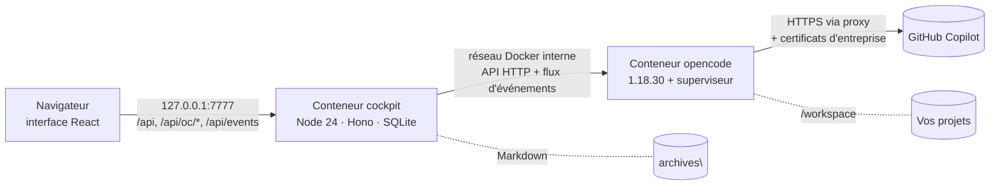

# Récapitulatif — opencode cockpit

> État au 14 septembre 2026. Ce document rassemble tout : ce qui a été construit, d'où vient l'interface, où se trouvent les fichiers, comment installer et lancer les scripts au travail, ce qui a été vérifié, corrigé et testé, et ce qui reste à vérifier.

> **Où en est la publication ?**
> - La **version 1.0.0** est publiée sur GitHub le 14 septembre 2026 : dépôt, release, images GHCR et archive hors ligne. **C'est elle qu'on installe au travail.**
> - La **version 1.0.1** est prête localement, **non publiée** : réseau d'entreprise à routage par abonnement Copilot, IA du compte lues directement chez GitHub et affichées disponibles ou non, interface démarrée même sans opencode, `cockpit.ps1 diag` (voir [section 9](#9-ce-qui-a-été-fait-étape-par-étape)).
> - Elle regroupe deux étapes de développement jamais publiées : **0.1.1**, les corrections du 13 septembre, et **0.2.0**, les assistants, les niveaux d'IA et le mode Simple (voir [section 9](#9-ce-qui-a-été-fait-étape-par-étape)). Ces numéros restent cités plus bas pour retracer l'historique.
> - La **version 0.1.0**, publiée le 13 septembre, contient les défauts corrigés depuis : ne plus l'installer.

## Sommaire

1. [En bref](#1-en-bref)
2. [D'où vient l'interface ?](#2-doù-vient-linterface-)
3. [Où sont les fichiers](#3-où-sont-les-fichiers)
4. [Installer au travail, pas à pas](#4-installer-au-travail-pas-à-pas)
5. [Les scripts en détail](#5-les-scripts-en-détail)
6. [Utiliser l'interface](#6-utiliser-linterface)
7. [Comment ça marche](#7-comment-ça-marche)
8. [Sécurité](#8-sécurité)
9. [Ce qui a été fait, étape par étape](#9-ce-qui-a-été-fait-étape-par-étape)
10. [Validations réalisées](#10-validations-réalisées)
11. [Limites et points à vérifier](#11-limites-et-points-à-vérifier)
12. [Dépannage](#12-dépannage)
13. [Référence : fichier .env](#13-référence--fichier-env)
14. [Faire évoluer le projet](#14-faire-évoluer-le-projet)

---

## 1. En bref

**opencode cockpit** est un poste de pilotage web pour l'agent de code [opencode](https://opencode.ai). Il est pensé pour un poste de travail d'entreprise où seul **GitHub Copilot** est autorisé. Il ajoute à opencode :

- des **assistants** par tâche (analyser un incident, relire un script, préparer un CAB…), avec des droits limités et une IA fixée, installés depuis un catalogue ou créés en 5 étapes ;
- des **niveaux d'IA** (Rapide, Équilibré, Expert) reliés aux IA du compte Copilot de chacun, avec le coût estimé d'une demande avant l'envoi ;
- un **mode Simple** par défaut pour les collègues peu familiers de l'IA (règles d'or, réglages risqués masqués), et un **mode Avancé** ;
- un **chat** visuel : appels d'outils, diffs, autorisations, travail délégué ;
- un **studio** (mode Avancé) pour créer agents, skills et commandes ;
- des **archives** classées automatiquement par type de conversation ;
- un **suivi des coûts** Copilot face à un budget mensuel (150 $ par défaut).

| Élément | Où |
|---|---|
| Dépôt GitHub (public) | https://github.com/Calgar50/opencode-cockpit |
| Release 1.0.0 (publiée) | https://github.com/Calgar50/opencode-cockpit/releases/tag/v1.0.0 |
| Archive d'images hors ligne 1.0.0 | `opencode-cockpit-images-1.0.0.tar.gz` et son `.sha256`, dans la release |
| Images Docker 1.0.0 | `ghcr.io/calgar50/opencode-cockpit-opencode:1.0.0` et `ghcr.io/calgar50/opencode-cockpit-app:1.0.0` |
| Release 0.1.0 (ancienne, à ne plus installer) | https://github.com/Calgar50/opencode-cockpit/releases/tag/v0.1.0 |
| Interface une fois installée | http://127.0.0.1:7777 |
| CI (tests, build, audit) et release | GitHub Actions, onglet « Actions » du dépôt |

---

## 2. D'où vient l'interface ?

**Elle a été créée de zéro pour ce projet.** Ce n'est ni l'interface web intégrée d'opencode (`opencode web`), ni un modèle ou un thème existant.

### Ce qu'elle est

- Une application **React 19 + Vite 8**, écrite en **TypeScript**, dans `app/web/`.
- Elle est construite en fichiers statiques (`app/dist/web/`), puis servie par le serveur du cockpit (`app/server/`), qui tourne dans le conteneur « cockpit ».
- Elle ne parle **jamais directement** à opencode. Elle appelle l'API du cockpit (`/api/...`), qui relaie vers opencode une **liste blanche** de routes (`/api/oc/...`) et diffuse les événements en temps réel (`/api/events`).

### De quoi elle est faite

| Partie | Origine |
|---|---|
| Système de design (couleurs, thèmes clair et sombre, composants CSS) | Écrit à la main : `app/web/styles.css`. La palette des graphiques reprend une palette validée pour le daltonisme. |
| Icônes | Dessinées à la main en SVG : `app/web/components/Icon.tsx`, sans bibliothèque d'icônes |
| Graphiques des coûts | Codés à la main en SVG : `app/web/pages/costs/charts.tsx`, sans bibliothèque de graphiques |
| Rendu Markdown des réponses | `marked` + `DOMPurify` (nettoyage anti-XSS) |
| Coloration du code | `highlight.js` |
| Éditeurs de texte (agents, skills, configuration) | `CodeMirror 6` |
| Composants (boutons, modales, notifications…) | Écrits à la main : `app/web/components/ui.tsx`, `Toast.tsx` |

### Qui a écrit quoi

- **Fondations**, écrites directement par Claude : design, composants, client API, flux d'événements, routage, coquille avec navigation et connexion. Également les pages **Chat** et **Coûts**.
- Page **Archives** : écrite par un agent secondaire, sur un cahier des charges détaillé et avec interdiction de toucher aux fondations.
- Pages **Studio**, **Paramètres** et **Diagnostic** : écrites par un second agent secondaire, dans les mêmes conditions.
- **Contrôle de l'ensemble** par Claude : vérification de types, build, 24 captures d'écran (12 écrans × 2 thèmes), revues de sécurité.
- **Étape 0.2.0, publiée dans la 1.0.0** (assistants, niveaux d'IA, modes) : trois conceptions concurrentes rédigées par des agents secondaires, jugées puis fusionnées ; implémentation en lots parallèles sur un contrat d'interfaces commun ; intégration, tests, revue adversariale et captures par Claude (voir [section 9](#9-ce-qui-a-été-fait-étape-par-étape)).

### Et l'interface d'opencode ?

opencode possède sa propre interface web. Elle n'est **ni utilisée ni exposée** : le port d'opencode n'est pas publié hors de Docker, et le cockpit ne relaie que les routes d'API dont sa propre interface a besoin.

---

## 3. Où sont les fichiers

```text
opencode-cockpit\
├─ install.ps1              ← INSTALLATION (à lancer en premier, et pour mettre à jour)
├─ cockpit.ps1              ← USAGE QUOTIDIEN (open, restart, logs, backup, restore…)
├─ README.md                ← documentation d'utilisation
├─ docs\RECAPITULATIF.md    ← ce document
├─ VERSION                  ← numéro de version
├─ docker-compose.yml       ← définition des 2 conteneurs (ne pas modifier : tout passe par .env)
├─ .env.example             ← modèle de configuration
├─ .env                     ← CRÉÉ par install.ps1 : secrets et réglages (jamais versionné, jamais partagé)
├─ certs\                   ← certificats d'entreprise (windows-trust.pem créé par install.ps1)
├─ archives\                ← CRÉÉ : conversations classées en Markdown
├─ backups\                 ← CRÉÉ par « cockpit.ps1 backup »
├─ docker\opencode\         ← image opencode : Dockerfile, superviseur, contrôle de santé, configuration par défaut
├─ app\                     ← le cockpit
│  ├─ Dockerfile
│  ├─ server\               ← serveur Node (API, proxy, coûts, archives, studio, sécurité) et tests
│  └─ web\                  ← interface React (pages, composants, styles)
└─ .github\workflows\       ← ci.yml : types, tests, build, audit, images (push sur main et pull requests)
                               release.yml : images GHCR et archive hors ligne (tag v*)
```

> **Les deux scripts `install.ps1` et `cockpit.ps1` sont à la racine du dossier**, pas dans un sous-dossier. Ouvrez PowerShell *dans ce dossier* pour les lancer.

---

## 4. Installer au travail, pas à pas

### Avant de commencer : vérifier avec la DSI

- **Docker Desktop :**
  - il n'est gratuit que pour les structures de moins de 250 salariés **et** de moins de 10 M$ de chiffre d'affaires annuel ; au-delà, un abonnement Docker est nécessaire ;
  - son installation demande les droits administrateur, WSL 2 et la virtualisation activée dans le BIOS.
- **GitHub Copilot :**
  - un abonnement Pro, Pro+, Business ou Enterprise est nécessaire ;
  - l'administrateur peut restreindre les modèles disponibles ou l'usage d'un client tiers comme opencode.
- **Windows PowerShell 5.1** ou plus récent : présent d'office sous Windows.

**Test rapide de Docker :** `docker run --rm hello-world`. S'il échoue au téléchargement, Docker Desktop n'atteint pas Docker Hub. Deux solutions :

- régler le proxy dans **Docker Desktop › Settings › Resources › Proxies** ;
- ou installer directement avec l'archive hors ligne (`-Mode Load`, voir plus bas).

`install.ps1 -Proxy` configure les conteneurs et la construction des images (npm, apt), mais pas les téléchargements faits par Docker Desktop lui-même : l'image de base en mode Build et les images GHCR en `-Mode Pull` passent par son propre réglage de proxy.

### Étapes

1. **Récupérer le projet**, au choix :
   - `git clone https://github.com/Calgar50/opencode-cockpit.git` ;
   - ou, sur la page du dépôt : **Code › Download ZIP**, puis extraire.

   Placez le dossier par exemple dans `C:\outils\opencode-cockpit`, **en dehors** du dossier de vos projets : `install.ps1` refuse que l'un contienne l'autre.
2. **Démarrer Docker Desktop** et attendre qu'il soit prêt.
3. **Ouvrir PowerShell dans le dossier du projet :**
   ```powershell
   cd C:\outils\opencode-cockpit
   ```
4. **Si vous avez pris le ZIP**, débloquer les scripts téléchargés :
   ```powershell
   Unblock-File .\install.ps1, .\cockpit.ps1
   ```
5. **Lancer l'installation** en indiquant le dossier qui contient vos projets (voir le choix du dossier juste après) :
   ```powershell
   .\install.ps1 -WorkspaceDir C:\chemin\vers\mes\projets
   ```
   - Si PowerShell refuse d'exécuter le script (stratégie d'exécution) :
     ```powershell
     powershell -ExecutionPolicy Bypass -File .\install.ps1 -WorkspaceDir C:\chemin\vers\mes\projets
     ```
     Si la stratégie est imposée par la DSI, cela peut rester bloqué : demandez l'autorisation.
   - La première construction des images prend quelques minutes.
6. **Le navigateur s'ouvre, déjà connecté au cockpit.** Si le cockpit ne répond pas dans les 4 minutes, le script affiche un avertissement : consultez `.\cockpit.ps1 logs`, puis lancez `.\cockpit.ps1 open`. Acceptez d'abord les 6 règles d'or de la fenêtre « Avant de commencer » (case « J'ai lu ces règles et je les appliquerai. », puis **Commencer**), puis allez dans **Paramètres › Connexion › Connecter**. Le cockpit affiche un code :
   - cliquez **Copier le code**, puis **Ouvrir GitHub** ;
   - collez le code sur la page GitHub et autorisez l'accès ;
   - revenez au cockpit : la connexion se termine toute seule. Le code expire au bout d'environ 15 minutes.
7. C'est prêt : **Assistants** pour installer les assistants du catalogue, puis **Chat › Nouvelle conversation**.

### Choisir le dossier des projets

Indiquez le dossier **parent** de vos dépôts, par exemple `C:\dev`, qui contient `C:\dev\api` et `C:\dev\front`. N'indiquez pas un dépôt précis : ses sous-dossiers (`src`, `docs`…) deviendraient autant de « projets ».

- Chaque sous-dossier de premier niveau apparaît comme un projet dans le Chat, avec l'entrée « Tout le workspace » (300 dossiers au maximum).
- Les dossiers masqués (`.xxx`), `node_modules` et `__pycache__` sont ignorés.
- Un dépôt cloné plus tard apparaît sans réinstallation.
- L'agent ne voit **que** ce dossier.
- Sans `-WorkspaceDir`, le script propose `%USERPROFILE%\source\repos` et peut créer le dossier.
- Un dossier trop large (racine d'un lecteur, profil utilisateur, dossier Windows) demande une confirmation ; sans elle, l'installation est annulée.
- Pour changer de dossier plus tard : `.\install.ps1 -WorkspaceDir <nouveau dossier>`.

### Variantes selon le réseau de l'entreprise

| Situation | Solution |
|---|---|
| La construction échoue : Docker Hub, npm ou dépôts Debian bloqués | Télécharger l'archive d'images de la release depuis le navigateur, puis `.\install.ps1 -Mode Load -ImagesArchive .\opencode-cockpit-images-<version>.tar.gz` |
| Vérifier l'archive avant de la charger | `(Get-FileHash .\opencode-cockpit-images-<version>.tar.gz -Algorithm SHA256).Hash`, à comparer au fichier `.sha256` |
| `ghcr.io` joignable | `.\install.ps1 -Mode Pull`. Les images sont publiques : ni compte ni `docker login` (vérifié le 13/09/2026 pour la 0.1.0). |
| Le proxy n'est pas détecté | `.\install.ps1 -Proxy http://proxy.entreprise:8080` |
| Les conteneurs doivent se connecter sans proxy alors que Windows en déclare un | `.\install.ps1 -Proxy ''` : connexion directe, choix mémorisé |
| Erreur de certificat (`SELF_SIGNED_CERT_IN_CHAIN`) **à l'usage** | `.\cockpit.ps1 certs`. Sinon, déposer le certificat racine du proxy dans `certs\` puis `.\cockpit.ps1 restart` (détails ci-dessous). |
| Erreur de certificat **pendant la construction** des images | Déposer le certificat dans `certs\` puis relancer `.\install.ps1` (les certificats sont intégrés aux images lors de leur construction), ou passer en `-Mode Load` |
| Rien d'autre ne fonctionne pour les certificats | **Dernier recours :** `.\install.ps1 -InsecureTls`. La vérification TLS est désactivée, un bandeau rouge le rappelle, et le réglage est mémorisé. `.\install.ps1 -SecureTls` la réactive. |
| Chaque demande échoue (`AI_APICallError`, `Unable to connect`, `Forbidden`) et des IA désactivées par l'organisation apparaissent : le pare-feu n'ouvre que l'adresse de l'abonnement Copilot | 1.0.1 : le cockpit prend de lui-même l'adresse que GitHub annonce pour l'abonnement quand l'adresse générale est bloquée. Pour l'imposer : `.\install.ps1 -CopilotApiUrl https://api.business.githubcopilot.com -NoBrowser` (ou `api.enterprise.githubcopilot.com`). Vérifier : **Diagnostic › Tester la connexion Copilot**. |
| Démarrage bloqué sur « Starting », journal d'opencode vide | 1.0.1 : `.\cockpit.ps1 diag` (état des conteneurs, accès réseau testés depuis opencode, journal). L'interface démarre même quand opencode ne répond pas. |

**Ajouter un certificat d'entreprise à la main :**

- Format : texte PEM (le fichier commence par `-----BEGIN CERTIFICATE-----`), extension `.pem` ou `.crt` uniquement.
- Un `.cer` binaire se convertit : `certutil -encode .\racine.cer .\certs\racine.pem`.
- `.\cockpit.ps1 certs` ne réécrit que `certs\windows-trust.pem` : vos fichiers ajoutés sont conservés.
- **Diagnostic › Réseau et sécurité** affiche le nombre de fichiers de certificats chargés par le conteneur opencode et l'état de la vérification TLS. Le serveur du cockpit (1.0.1) note dans son journal les certificats qu'il charge et ceux qu'il ignore.
- Ces certificats servent au conteneur opencode, à la construction des images et, depuis la 1.0.1, au serveur du cockpit (liste des IA et solde lus chez GitHub).

### Mettre à jour

`.\cockpit.ps1 update` récupère la dernière version (`git pull`), puis relance `install.ps1` **dans le mode mémorisé** :

| Mode | Effet de `update` |
|---|---|
| Build | Les images sont reconstruites sur le poste. |
| Pull | Les images de la nouvelle version sont téléchargées depuis GHCR. |
| Load | Sans nouvelle archive, les images déjà chargées sont gardées, avec un avertissement si leur version diffère. Pour les mettre à jour : télécharger l'archive de la nouvelle version, puis `.\install.ps1 -Mode Load -ImagesArchive <archive>`. |

- **Dossier obtenu par ZIP** (pas de git) : `update` affiche un avertissement et s'arrête. Remplacez les fichiers par ceux de la nouvelle version sans toucher à `.env`, `certs\`, `archives\` ni `backups\`, puis lancez `.\install.ps1`.
- **Installation faite en 0.1.0** : le mode n'était pas mémorisé. Si `.env` désigne des images publiées (`ghcr.io/...`, installation faite en Pull ou en Load), la 1.0.0 réutilise les images **0.1.0** déjà présentes, sans rien construire ni télécharger, et le signale à chaque passage : leurs correctifs ne sont donc pas actifs. Lancez une fois `.\install.ps1 -Mode Pull` (GHCR joignable) ou `.\install.ps1 -Mode Load -ImagesArchive <archive 1.0.0>` : ce mode est ensuite mémorisé.
- **Permissions d'opencode** : la configuration par défaut n'est posée qu'au premier démarrage. Une installation existante garde ses anciennes règles, qui autorisaient d'office `git status`, `git diff`, `git log`, `git show`, `git branch` et `ls`, des commandes détournables (voir [section 8](#8-sécurité)). Pour passer aux règles actuelles : **Paramètres › Sécurité › Revenir au profil Prudent** (en mode Avancé : **Paramètres › opencode › Permissions globales › Prudent › Appliquer**). Les agents créés depuis les anciens modèles « relecteur sécurité » ou « architecte » gardent aussi leurs règles : passez leur shell à « demander » ou « refuser » dans le Studio (mode Avancé).
- **Installation 0.1.0, nouveautés de la 1.0.0** : rien n'est réécrit.
  - Au premier affichage, la fenêtre des règles d'or s'ouvre, puis l'interface passe en **mode Simple** avec une notice (« Passer en mode Avancé » ou « Compris »).
  - Les agents principaux existants apparaissent dans **Assistants** avec l'état « À compléter ». « Compléter » reprend leur nom, déduit le niveau quand leur IA correspond à un niveau, et marque les droits « Personnalisé » s'ils ne correspondent à aucun profil.
  - **Changement de comportement :** l'IA écrite dans un agent est désormais vraiment utilisée dans le chat (en 0.1.x, le sélecteur du chat l'emportait). La notice liste ces agents avec leur IA. La réflexion (« variante ») écrite dans un raccourci non délégué est aussi appliquée.

---

## 5. Les scripts en détail

### `install.ps1`

| Paramètre | Rôle | Valeur par défaut |
|---|---|---|
| `-WorkspaceDir` | Dossier des projets, monté dans les conteneurs sous `/workspace` | valeur de `.env`, sinon demandé |
| `-Port` | Port local de l'interface | valeur de `.env`, sinon `7777` |
| `-Mode` | `Build` (construit les images), `Pull` (télécharge depuis GHCR), `Load` (charge une archive) | mode mémorisé dans `.env` ; sinon `Load`, sans le mémoriser, si `.env` désigne déjà des images publiées (installation 0.1.0) ; sinon `Build` |
| `-ImagesArchive` | Archive d'images pour `-Mode Load` | facultatif lors d'une relance : les images déjà chargées sont réutilisées |
| `-ImageRegistry` | Registre pour `-Mode Pull` | `ghcr.io/calgar50` ; mémorisé seulement s'il est passé |
| `-Proxy` | Proxy d'entreprise (URL) | valeur de `.env`, sinon variable `HTTPS_PROXY`, sinon proxy système Windows (script PAC compris). `-Proxy ''` : connexion directe, mémorisée jusqu'à un nouveau `-Proxy <url>` ou un proxy saisi dans `.env`. |
| `-NoProxy` | Exceptions supplémentaires au proxy | valeur de `.env`, sinon vide. `localhost`, `127.0.0.1`, `::1`, `opencode` et `cockpit` sont toujours ajoutés dans les conteneurs. |
| `-SkipCertificates` | Ne pas exporter les certificats Windows | export activé |
| `-InsecureTls` | Désactiver la vérification TLS (secours) ; mémorisé | — |
| `-SecureTls` | Réactiver la vérification TLS | — |
| `-NoStart` | Préparer sans démarrer les conteneurs | — |
| `-NoBrowser` | Ne pas ouvrir le navigateur à la fin | — |

**Ce que fait le script, dans l'ordre :**

1. Vérifie que Docker et Docker Compose v2 répondent.
2. Lit `.env` s'il existe et reprend le mode d'installation mémorisé. Pour un `.env` de la 0.1.0, sans mode : réutilise les images publiées qu'il désigne (mode Load, non mémorisé), sinon `Build`.
3. Détermine le dossier des projets (paramètre, `.env` ou question), propose de le créer, et demande confirmation s'il est trop large.
4. Prépare la configuration en mémoire :
   - port ;
   - secrets aléatoires de 64 caractères, conservés s'ils existent ;
   - proxy, TLS, fuseau horaire.
5. Exporte les autorités de certification de confiance de Windows (hors certificats expirés) vers `certs\windows-trust.pem`, sauf avec `-SkipCertificates`.
6. Crée `archives\`. En mode Load avec archive, charge les images (`docker load`).
7. Écrit `.env` et restreint ses droits à votre compte Windows. Si le script s'arrête avant cette étape, `.env` n'est ni créé ni modifié.
8. Construit (Build) ou télécharge (Pull) les images. En cas d'échec, `.env` retrouve les images précédentes, pour que `start` et `restart` continuent de fonctionner.
9. Sauf avec `-NoStart` : donne les volumes Docker à l'utilisateur des conteneurs, puis démarre.
10. Attend que le cockpit réponde (jusqu'à 4 minutes). S'il répond, ouvre `http://127.0.0.1:<port>` déjà connecté (port de `-Port` ou de `COCKPIT_PORT`, `7777` par défaut ; rien ne s'ouvre avec `-NoBrowser`). Sinon, affiche un avertissement qui renvoie vers `.\cockpit.ps1 logs`, puis s'arrête : lancez `.\cockpit.ps1 open` une fois le cockpit prêt.

Relancer `install.ps1` est sans danger : secrets, réglages et mode d'installation sont conservés.

### `cockpit.ps1`

Toujours lancé depuis le dossier du projet : `.\cockpit.ps1 <commande>`.

| Commande | Effet |
|---|---|
| `open` | Ouvre l'interface déjà connectée (utile si l'interface demande un jeton) |
| `start` | Démarre les conteneurs (applique aussi une modification de `.env`) |
| `stop` | Arrête les conteneurs |
| `restart` | **Recrée** les conteneurs : relit `.env`, et `certs\` pour opencode |
| `status` | État des conteneurs et du cockpit |
| `logs` | Journaux en direct. `logs opencode` montre le journal complet d'opencode (superviseur et serveur) ; `logs cockpit` celui du cockpit. |
| `certs` | Réexporte les certificats Windows, puis recrée les conteneurs |
| `update` | `git pull`, puis `install.ps1` dans le mode mémorisé. Dossier sans git : avertissement seulement. |
| `backup` | Sauvegarde dans `backups\cockpit-AAAAMMJJ-HHMMSS.tar.gz` (détail ci-dessous) |
| `restore <fichier>` | Restaure une sauvegarde (détail ci-dessous) |
| `uninstall` | Supprime les conteneurs ; les données restent dans les volumes Docker |
| `uninstall -Purge` | Après avoir tapé `SUPPRIMER` : supprime aussi les volumes, les images désignées dans `.env` (construites, téléchargées ou chargées) et les images construites sur ce poste. Les images de versions précédentes restent (`docker image ls`, puis `docker image rm`). `archives\`, `backups\`, `certs\` et `.env` sont conservés. |
| `help` | Aide |

### Sauvegarder et restaurer

**`backup`** arrête brièvement les conteneurs, crée l'archive, puis les redémarre.

| Contenu | Inclus ? |
|---|---|
| Volume `cockpit-data` : réglages, coûts, archives indexées | oui |
| Volume `oc-config` : configuration opencode, agents, skills, commandes | oui, sans `node_modules` |
| Volume `oc-data` : données d'opencode (sessions) | oui, **sans `auth.json`** (jeton GitHub Copilot) |
| Dossier `archives\` (exports Markdown) | oui |
| `.env`, `certs\` | non |

**`restore <fichier>`**, par exemple `.\cockpit.ps1 restore .\backups\cockpit-20260913-180000.tar.gz` :

1. Un chemin relatif se lit depuis le dossier courant.
2. Le nom du fichier n'accepte que lettres, chiffres, point, tiret et souligné, avec l'extension `.tar.gz`.
3. L'archive est vérifiée **avant** tout arrêt : une archive illisible ne coupe pas le cockpit.
4. Vous tapez `RESTAURER` pour confirmer.
5. Les conteneurs sont arrêtés.
6. `cockpit-data`, `oc-config` et `oc-data` sont vidés, sauf le jeton Copilot, puis remplis depuis l'archive. `archives\` est complété : les fichiers absents de la sauvegarde restent, ceux qui portent le même nom sont remplacés par la version sauvegardée.
7. Les conteneurs redémarrent, **même si la restauration a échoué**.

Sur un nouveau poste : `.\install.ps1`, puis `restore`, puis **Paramètres › Connexion › Connecter**.

---

## 6. Utiliser l'interface

| Page | Ce qu'on y fait |
|---|---|
| **Chat** | Choisir le projet, puis un assistant (cartes d'accueil) ou l'Assistant général et son niveau d'IA. Écrire une demande : `@` joint un fichier, `/` lance un raccourci, on peut coller une image. L'IA qui va répondre et le coût estimé d'une demande sont affichés avant l'envoi ; l'IA d'un assistant ne se change pas depuis le chat. Rouvrir une conversation reprend l'assistant et le niveau enregistrés. Suivre la réponse en direct : réflexion, outils, diffs, sous-agents. Valider ou refuser les autorisations. Le panneau de droite montre le coût de la conversation, son classement, le plan de l'agent et les fichiers modifiés. |
| **Assistants** | Installer un assistant du catalogue, créer un assistant en 5 étapes, le modifier, compléter un agent créé avant la 1.0.0. Chaque assistant a une fiche d'identité : tâche, ce qu'il peut faire et ne fait jamais, IA, coût estimé, fiches. |
| **Coûts** | Dépense du mois face au budget, projection de fin de mois et date d'épuisement estimée. Dépense par jour, cumul, répartitions par modèle, catégorie, agent et projet. Conversations les plus coûteuses, export CSV. |
| **Archives** | Toutes les conversations classées, avec recherche plein texte et filtres (catégorie, période, projet, épinglées). Dans le détail : résumé, étiquettes et catégorie modifiables, transcription, bouton « Reclasser avec l'IA », export `.md`. |
| **Studio** (mode Avancé) | Agents, skills (avec fichiers annexes), commandes et `AGENTS.md`, plus une galerie de modèles prêts à l'emploi. Un sélecteur « Portée » propose « Global (tous les projets) » ou un projet (voir ci-dessous). |
| **Paramètres** | Onglets Connexion (Copilot), Niveaux d'IA, Budget (budget et garde-fou), Chat (valeurs par défaut), Affichage (mode Simple ou Avancé) et Sécurité (profil de droits, fournisseur d'IA). En mode Avancé seulement : Tarifs, Classement (catégories, modèle de classement) et opencode (modèles par défaut, fournisseurs, profils de permissions, fichier brut). |
| **Diagnostic** | État d'opencode et de son superviseur, flux d'événements, réseau et sécurité (proxy, TLS, certificats), catalogue des modèles. Journal d'opencode avec détection des erreurs connues. Boutons « Redémarrer opencode », « Rattraper l'historique » et « Recharger le catalogue ». |

### Modes Simple et Avancé

Chaque installation, mise à jour comprise, s'ouvre en **mode Simple**. On change de mode dans **Paramètres › Affichage**.

| | Mode Simple (défaut) | Mode Avancé |
|---|---|---|
| Pages | Chat, Assistants, Coûts, Archives, Paramètres, Diagnostic | les mêmes, plus **Studio** |
| Paramètres | Connexion, Niveaux d'IA (consultation), Budget, Chat, Affichage, Sécurité | en plus : modification des niveaux d'IA, Tarifs, Classement, opencode |
| Réponse à une demande d'autorisation | « Autoriser une fois » ou « Refuser » | pareil : « Toujours autoriser » n'est jamais proposé (voir [section 8](#8-sécurité)) |
| Un message avec une autre IA que celle de l'assistant | impossible | possible pour un seul message, si l'option est activée |

- **Règles d'or :** au premier lancement, et à chaque changement de leur texte, la fenêtre « Avant de commencer » bloque l'interface (ni Échap, ni clic à côté) jusqu'à la case « J'ai lu ces règles et je les appliquerai. » et le bouton **Commencer**. Le texte n'est pas modifiable depuis l'interface :
  1. Tout ce que vous écrivez ou joignez (texte, fichiers, sorties de commandes) est envoyé à GitHub Copilot, un service extérieur à la banque.
  2. Jamais de données clients : nom, numéro de compte, IBAN, numéro de carte, numéro client, adresse, e-mail, téléphone, montant rattaché à un client. Remplacez-les par des repères : CLIENT_1, IBAN_1, SERVEUR_A.
  3. Jamais de secrets : mots de passe, clés privées, jetons, chaînes de connexion, fichiers .pfx, .p12, .key, .jks, .env, kubeconfig, sorties de terraform plan non nettoyées.
  4. L'IA n'agit jamais sur la production. Elle propose ; vous vérifiez ; vous exécutez, selon la procédure habituelle.
  5. L'IA ne remplace ni la relecture par un collègue (principe des quatre yeux), ni le CAB.
  6. L'IA peut se tromper avec assurance : commandes ou options inventées, dates mal calculées, versions dépassées, failles récentes inconnues. Testez toujours hors production.
- **Bandeau permanent** sous la zone de saisie : « Avant d'envoyer : aucune donnée client, aucun mot de passe, aucune clé. Relisez toujours la réponse : l'IA peut se tromper. »
- **Paramètres › Sécurité** (consultation) : profil de droits d'opencode et fournisseur d'IA. Si le profil a été modifié en mode Avancé, un bouton ramène au profil Prudent.
- **Garde du serveur :** en mode Simple, le serveur refuse (« Action réservée au mode Avancé (Paramètres › Affichage). ») les écritures du Studio, de la configuration d'opencode et des niveaux d'IA, la remise à zéro des réglages autres que le budget, et tout réglage autre que le budget mensuel, les seuils d'alerte, l'affichage, le niveau et le dossier par défaut du chat. Elle évite les erreurs ; ce n'est pas une barrière de sécurité, puisque chacun peut passer en mode Avancé.

### Assistants et niveaux d'IA

**Vocabulaire.** En mode Simple, l'interface ne montre ni « agent », ni « skill », ni « commande », ni « modèle » :

| Dans l'interface | Pour opencode | En une phrase |
|---|---|---|
| **Assistant** | agent principal géré par le cockpit | Fait une tâche précise, avec des droits limités et une IA adaptée. |
| **Assistant général** | agent `build` | Pour les demandes qui ne correspondent à aucun assistant. Proposé, mais jamais présélectionné. |
| **Fiche** | skill | Une procédure ou une checklist que l'assistant consulte. Elle n'a pas d'IA à elle. |
| **Raccourci** (`/nom`) | commande | Un texte tout prêt, lancé en tapant `/nom` dans le chat. |
| **Niveau d'IA** | liste ordonnée de modèles | Rapide, Équilibré ou Expert. |
| **Réflexion** | variante du modèle | Plus de réflexion : réponses plus lentes et plus chères. |
| **Travail délégué** | sous-agent (`subtask`) | Un autre assistant travaille à part, puis l'IA de la conversation reprend la main. |

**Ce qu'est un assistant.** Un vrai fichier d'agent opencode (`agents/<nom>.md`, portée globale), plus une ligne dans la base du cockpit :

- le fichier ne contient que des clés connues d'opencode : `description`, `mode: primary`, `model`, `variant` éventuelle, `steps`, `color`, `permission`. opencode transmettrait au fournisseur toute clé inconnue ; le titre, le niveau, la taille de tâche et l'origine restent donc dans la base du cockpit ;
- ses consignes se terminent par un bloc « Règles communes (ajoutées par le cockpit) », délimité par des marqueurs pour ne jamais être dupliqué : signaler une donnée client ou un secret sans le recopier, écrire « À VÉRIFIER » plutôt qu'inventer, ne jamais donner de « feu vert » à la place d'un collègue ou du CAB.

**Deux profils de droits**, les seuls que peut produire l'assistant de création :

| | Lecture seule (défaut) | Propose, vous validez |
|---|---|---|
| Modifier un fichier (`edit`) | refusé | sur confirmation |
| Commande shell (`bash`) | refusé | sur confirmation |
| Déléguer (`task`) | refusé | refusé |
| Internet (`webfetch`, `websearch`) | refusé, ou sur confirmation si « Consulter Internet » est coché | idem |
| Fiches (`skill`) | seulement les siennes | idem |
| Lecture (`read`) | fichiers de clés refusés (`.pfx`, `.p12`, `.key`, `.jks`, `.keystore`, `.kdbx`, clés SSH, kubeconfig…, en minuscules et en majuscules) ; `.env` sur confirmation | idem |
| Nombre d'étapes (`steps`) | selon la taille de la tâche | idem |

- Aucune règle `"*"` générale dans `read` : les règles de l'agent passent en dernier chez opencode, et `"*": allow` annulerait la confirmation par défaut sur `.env`.
- `external_directory` n'est jamais touché : un refus casserait l'ouverture des fiches et les sorties d'outils tronquées.
- Toute autre combinaison, faite dans le Studio, s'affiche « Personnalisé », en rouge sur la fiche d'identité.

**Catalogue** (`app/server/assistants-catalogue.ts`, versionné) : six exemples, marqués « Exemple à relire avec votre équipe ».

| Assistant | Droits | Niveau | Taille | Fiches |
|---|---|---|---|---|
| Analyser un incident | Lecture seule | Équilibré | M | `anonymisation-donnees` |
| Relire un script avant mise en production | Lecture seule | Équilibré | M | `standards-scripts`, `anonymisation-donnees` |
| Préparer une demande de changement pour le CAB | Lecture seule | Expert | M | `checklist-cab` |
| Relire une requête SQL sur un réplica | Lecture seule | Équilibré | S | `requetes-sql-sures` |
| Expliquer une alerte de supervision | Lecture seule | Rapide | S | — |
| Rédiger ou mettre à jour un runbook | Propose, vous validez | Équilibré | M | — |

- Les trois nouvelles fiches (`anonymisation-donnees`, `standards-scripts`, `checklist-cab`) ont un contenu utilisable.
- L'installation ajoute les fiches manquantes sans jamais écraser une fiche existante, et ne crée pas de doublon si on la relance.

**Niveaux d'IA** (**Paramètres › Niveaux d'IA**) :

| Niveau | Recommandation livrée : IA préférée, puis IA de secours |
|---|---|
| Rapide | `github-copilot/gpt-5.4-mini` › `gpt-5-mini` › `claude-haiku-4.5` |
| Équilibré | `github-copilot/claude-sonnet-5` › `gpt-5.3-codex` › `claude-sonnet-4.6` |
| Expert | `github-copilot/claude-opus-5` › `claude-opus-4.8` › `gpt-5.6-sol` |

- **Choix :** la première IA du catalogue de **votre** compte Copilot, d'un fournisseur autorisé, capable d'utiliser des outils et non obsolète. État affiché : « ok », « secours » (une IA de secours sert), « indisponible », ou « non vérifié » quand le catalogue n'est pas chargé (les modifications sont alors bloquées).
- **Réflexion** d'un niveau : retirée avec un avertissement si l'IA retenue ne la propose pas.
- **IA réservées :** les IA à prix promotionnel et celles dont la sortie coûte 30 $ par million de jetons ou plus ne sont jamais dans la recommandation. En mode Avancé, elles apparaissent sous « Réservé (très cher) ».
- **Recommandation ou copie :** tant que les niveaux n'ont pas été modifiés, la recommandation suit les mises à jour du cockpit. Les modifier (mode Avancé) enregistre une copie ; « Revenir à la recommandation » demande confirmation.
- **Fichiers jamais réécrits en silence :** un assistant garde l'IA écrite dans son fichier. Si elle disparaît du compte, l'envoi est bloqué et rien n'est envoyé. **Mettre à jour** réaligne alors tous les assistants concernés en un seul lot : refus tant qu'une réponse est en cours ; sauvegarde de chaque fichier ; écriture ; rechargement et vérification par opencode ; en cas de refus, restauration de tous les fichiers, nouvelle vérification et redémarrage d'opencode si besoin. Pour un assistant dont le fichier a été modifié hors du cockpit, « Garder cette IA précise » retire sa liaison au niveau sans réécrire le fichier.
- **Assistant général :** utilise directement l'IA résolue du niveau choisi, secours compris.
- **Coût « ≈ X $ par demande » :** calculé avec le prix retenu partout (tarif personnalisé, sinon grille GitHub, sinon catalogue). D'abord estimé selon la taille de la tâche (S, M, L), puis selon la moyenne observée des demandes de l'assistant quand elles sont assez nombreuses. C'est une estimation, pas une facture.

**Dans le Studio (mode Avancé) :** champ « IA » (niveau ou IA précise), panneau « Quelle IA sera utilisée ? » calculé comme dans le chat et le serveur, badge « Niveau conseillé » sur les modèles de la galerie. La « Variante » d'une commande est désormais appliquée, sauf pour un raccourci délégué : le Studio invite alors à la régler sur l'assistant délégué. Les identifiants d'IA sont vérifiés contre le catalogue. Une clé inconnue d'opencode ajoutée dans l'en-tête d'un agent est refusée ; celles déjà présentes dans un fichier existant sont gardées, avec un avertissement.

**Studio et portée projet :**

- Tant que `COCKPIT_PROJECT_CONFIG=0` (valeur par défaut), les agents, skills et commandes d'un projet (dossier `.opencode/`) se consultent mais ne s'enregistrent pas.
- Le `AGENTS.md` à la racine d'un projet peut être enregistré, mais **opencode ne le charge pas d'office** dans ce mode (vérifié dans le code d'opencode 1.18.30). Exception : quand l'agent lit un fichier, opencode joint encore les `AGENTS.md` des dossiers situés entre ce fichier et le dossier de la conversation ; depuis « Tout le workspace », celui de chaque projet peut donc être lu.
- Placez donc vos consignes dans le `AGENTS.md` **global**. Le Studio le rappelle quand la configuration par projet est désactivée.

**Modèles prêts à l'emploi du Studio :**

- **5 agents :** `revue-securite` (ne modifie rien, commandes sur confirmation), `architecte` et `pedagogue` (ni modification, ni commande, ni sous-agent), `testeur`, `expert-sql`.
- **5 commandes :** `commit`, `revue`, `explique`, `tests`, `description-pr`.
- **3 skills :** `conventions-equipe`, `checklist-securite-web`, `requetes-sql-sures`.
- **Attention aux lignes ``!`…` `` des commandes :** opencode exécute directement, à chaque lancement, toute ligne ``!`commande` `` écrite dans une commande, **sans confirmation et quel que soit le profil**. Les modèles `commit`, `revue` et `description-pr` lancent ainsi `git diff` ou `git log`. Relisez toute commande qui en contient avant de l'enregistrer.

**Profils de permissions** (Paramètres › opencode) :

| Profil | Fichiers | Shell | Sous-agents | Web |
|---|---|---|---|---|
| **Prudent** (configuration d'origine) | demander | demander (seul `pwd` est autorisé d'office ; exception : les lignes ``!`…` `` des commandes) | demander | demander |
| Équilibré | autoriser | demander | demander | demander |
| Autonome (risqué) | autoriser | autoriser | autoriser | autoriser |

Appliquer un profil **remplace** tout le bloc `permission` du fichier de configuration : les commentaires placés à l'intérieur de ce bloc sont perdus, les autres sont conservés.

Les règles d'un agent ne s'appliquent pas aux sous-agents qu'il lance : ceux-ci suivent le profil global. Un agent qui ne doit rien modifier doit donc aussi refuser les sous-agents, comme `architecte` et `pedagogue`.

---

## 7. Comment ça marche



### Quelle IA est réellement utilisée

opencode choisit l'IA de chaque appel selon des règles relevées ligne à ligne dans son code (version 1.18.30). Le cockpit les reproduit dans un seul module sans dépendance, `app/server/shared/assistant-rules.ts`, utilisé par le chat (affichage avant l'envoi), l'assistant de création, le panneau du Studio et le serveur (contrôle de chaque demande).

| Demande | IA | Réflexion | Source dans opencode (`packages/opencode/src/`) |
|---|---|---|---|
| Message | IA de la demande, sinon celle de l'agent, sinon celle de la session | celle de la demande ; sinon celle de l'agent, seulement si l'IA retenue est la sienne | `session/prompt.ts:646-689` |
| Raccourci non délégué | IA du raccourci, sinon celle de l'agent désigné par le raccourci, sinon celle de la demande | celle de la demande. opencode ignore la `variant:` écrite dans un raccourci : le cockpit la recopie dans la demande. | `session/prompt.ts:1370-1473`, `command/index.ts` |
| Travail délégué (raccourci lié à un sous-agent, ou `subtask: true`) | IA du sous-agent, sinon celle du raccourci ; puis **reprise** sur l'IA et l'agent de la conversation (« Summarize the task tool output above and continue with your task. ») | héritée seulement si le sous-agent n'a pas d'IA | `tool/task.ts:179-209`, `session/prompt.ts:430-448` |
| Résumer | IA de l'agent caché `compaction` s'il en a une, sinon IA de la demande | aucune | `session/compaction.ts:358-361` |
| Fiche (skill) | aucune : un `SKILL.md` ne lit que `name` et `description` | — | `skill/index.ts:53-59` |

Ce qui en découle :

- une IA absente du catalogue produit « Model not found », sans repli ; une réflexion inconnue est ignorée sans message ;
- toute fiche est aussi lançable en `/nom`, sans contrôle de droits ni d'IA (`command/index.ts:134-152`) : le cockpit refuse donc une `/fiche` que l'assistant n'a pas le droit d'ouvrir ;
- une clé inconnue dans l'en-tête d'un agent est transmise au fournisseur comme option : le cockpit n'écrit que les clés connues d'opencode.

**Contrôle par le serveur du cockpit** sur `prompt_async`, `command` et `summarize`, après les filtres de contenu de la 0.1.1 :

| Situation | Réponse |
|---|---|
| Demande sans IA explicite (opencode prendrait celle de la session, hors contrôle) | 400 `modele-requis` |
| Un appel facturé (IA de la demande, d'un assistant, d'un raccourci ou d'un sous-agent) vers un fournisseur non autorisé | 403 `fournisseur-refuse` |
| Assistant qui a son IA, demande envoyée avec une autre IA | 409 `assistant-model-changed`, avec l'IA de l'assistant. Le chat renvoie une seule fois avec celle-ci et l'indique. |
| `/fiche` interdite à l'assistant, ou raccourci lié à un assistant introuvable | 403 |
| IA absente du catalogue | 409 `ia-indisponible`, rien n'est envoyé |
| Garde-fou budgétaire sur l'un des appels facturés | 409, confirmation demandée |

Chaque demande acceptée est notée dans la base (table `chat_turns` : assistant, raccourci, niveau, IA, réflexion, appels prévus). Rouvrir une conversation reprend ainsi les mêmes choix. En mode Avancé, si l'option est activée, un message peut partir avec une autre IA que celle de l'assistant.

### Deux conteneurs

- **opencode** : l'agent lui-même, en utilisateur non-root, avec `git` et `ripgrep`. Un **superviseur** le relance s'il s'arrête ou si le cockpit le demande. La demande passe par un fichier dans un dossier partagé, **sans accès au socket Docker**.
- **cockpit** : le serveur de l'interface. Il écoute tous les événements d'opencode pour tenir le registre des coûts et les archives.

### Où sont les données

| Volume Docker | Contenu |
|---|---|
| `cockpit-data` | Base SQLite du cockpit : sessions, coûts par appel, demandes, archives et index plein texte, alertes, réglages, assistants (titre, niveau, taille de tâche, origine) et choix de chaque demande |
| `oc-config` | Configuration opencode : `opencode.jsonc`, `agents/`, `commands/`, `skills/`, `AGENTS.md` |
| `oc-data` | Données opencode, dont `auth.json` (jeton Copilot) |
| `oc-cache` | Cache opencode |
| `control` | Dialogue superviseur ↔ cockpit (demande de redémarrage) et journal `opencode.log` |

À cela s'ajoutent deux dossiers visibles sous Windows : le dossier des projets (`/workspace`) et `archives\`.

**Journaux :** le journal d'opencode est écrit dans `opencode.log`, affiché dans **Diagnostic**, et recopié en continu dans les journaux du conteneur (`cockpit.ps1 logs opencode`). Docker les limite à 3 fichiers de 10 Mo par conteneur.

### Calcul des coûts

- **Mode de facturation :** depuis le 1er juin 2026, GitHub Copilot facture **au token**, en crédits IA (1 crédit = 0,01 $). Le compteur est remis à zéro le **1er de chaque mois à 00:00 UTC**. Un budget utilisateur épuisé bloque les requêtes, sans repli sur un modèle gratuit.
- **Enregistrement :** chaque appel de modèle est enregistré, sous-agents, compaction et classement compris.
- **Montant retenu, par ordre de priorité :**
  1. le coût **réellement facturé**, lu par opencode dans la réponse de GitHub ;
  2. à défaut, **votre tarif personnalisé** (Paramètres › Tarifs) ;
  3. à défaut, pour les modèles GitHub Copilot, la **grille officielle GitHub** intégrée au cockpit (relevée le 13/09/2026, paliers « long contexte » compris) ;
  4. à défaut, le catalogue d'opencode.
- **Personnalisation :**
  - dans Paramètres › Tarifs, modifier le tarif d'un modèle crée un tarif personnalisé, sans toucher à la grille officielle ; « Retirer » le supprime ;
  - l'option « Toujours appliquer la grille » ignore le coût facturé et calcule avec les niveaux 2 à 4.
- **Alertes :** à 50, 75, 90 et 100 % du budget.
- **Garde-fou :**
  - à partir de 80 % du budget, un modèle dont la sortie coûte plus de 15 $/M tokens demande confirmation ;
  - à 100 %, tout modèle payant demande confirmation ;
  - depuis la 1.0.0, il vérifie **chaque appel facturé** d'une demande (IA d'un assistant, d'un raccourci, d'un travail délégué et reprise comprises), et non plus seulement l'IA choisie dans le chat.

### Classement automatique

Le déroulé dépend du mode choisi dans **Paramètres › Classement** (IA par défaut). Les étapes 3 et 4 n'ont lieu qu'en mode IA. En mode par mots-clés seuls, la catégorie est posée une seule fois, au premier archivage, et le bouton « Reclasser avec l'IA » applique l'heuristique sans appeler de modèle. Sans classement automatique, l'heuristique est quand même posée au premier archivage, puis rien n'est reclassé.

1. **Archivage à l'inactivité :** quelques secondes après la fin d'une réponse, la conversation est archivée, avec les secrets de la transcription masqués.
2. **Heuristique immédiate :** un classement gratuit est posé à partir des mots-clés, des outils utilisés et des fichiers touchés.
3. **Affinage par un modèle :** après 2 minutes d'inactivité (délai réglable), un petit modèle peu coûteux affine la catégorie, les étiquettes et le résumé (environ 0,001 $).
   - **Titre :** le modèle en propose un, retenu seulement si opencode n'a laissé qu'un titre générique (« New session… ») et que le titre n'a pas été modifié à la main.
   - **Choix du modèle :** celui choisi dans **Paramètres › Classement**, sinon le premier disponible parmi GPT-5 mini, MAI Code 1.1 Flash, GPT-5.6 Luna, GPT-5.4 mini et Claude Haiku 4.5, sinon le modèle GitHub Copilot connecté le moins cher (prix d'entrée + prix de sortie). Sans modèle Copilot disponible, le classement reste heuristique.
   - **Échec :** l'heuristique est conservée, et un nouvel essai a lieu à l'inactivité suivante.
4. **Mise à jour :** une fois classée par le modèle, la conversation est reclassée après 3 nouvelles demandes (réglable).
   - Corriger à la main la catégorie, les étiquettes ou le résumé fige tout le classement de la conversation : le classement automatique ne la modifie plus, même après de nouvelles demandes.
   - Un titre modifié à la main est toujours conservé.
   - Le bouton « Reclasser avec l'IA » passe outre ces corrections, mais garde le titre. Ensuite, la conversation n'est plus marquée comme corrigée à la main.
5. **Copie Markdown :** `archives\<Catégorie>\<AAAA-MM>\<AAAA-MM-JJ>_<titre>_<id>.md`.
   - `<Catégorie>` : le libellé, où les caractères interdits dans un nom de fichier (`/ \ : * ? " < > |`) deviennent `-`. « Data / SQL » donne donc le dossier `Data - SQL`, pas un sous-dossier.
   - `<titre>` : le titre en minuscules, sans accents, mots séparés par des tirets, 50 caractères au plus ; `<id>` : les 8 derniers caractères de l'identifiant de session.
   - Le mois et la date sont ceux de la création **en UTC** : une conversation ouverte le 1er juste après minuit (heure de Paris) est rangée dans le mois précédent.

Catégories par défaut, toutes modifiables : Débogage, Fonctionnalité, Refactoring, Revue de code, Tests, Question / Explication, Documentation, Data / SQL, DevOps / Infra, Sécurité, Exploration / Idée, Autre.

---

## 8. Sécurité

### Réglages par défaut

- **Exposition réseau :**
  - interface publiée **uniquement** sur `127.0.0.1` ;
  - opencode n'a **aucun** port publié et exige un mot de passe aléatoire.
- **Accès à l'interface :**
  - jeton de 256 bits ; le cookie de session (`HttpOnly`, `Secure`, `SameSite=Strict`) porte sa date d'émission et une signature calculée avec un secret aléatoire du serveur. L'expiration de 30 jours est vérifiée par le serveur, et la déconnexion change ce secret : toutes les sessions ouvertes sont révoquées. Après la mise à jour depuis la 0.1.0, il faut se reconnecter une fois (`.\cockpit.ps1 open`) ;
  - 20 jetons erronés en 5 minutes bloquent temporairement la connexion ;
  - contrôle de l'en-tête `Host` (anti DNS rebinding) ;
  - en-tête anti-CSRF obligatoire et vérification de l'origine ;
  - CSP stricte, aucun script en ligne ;
  - le lien de connexion `/auth` refuse les requêtes émises par une autre page.
- **Proxy vers opencode :**
  - **liste blanche minimale** : seules les routes utilisées par l'interface sont relayées. Partage public, mise à jour à distance, injection d'identifiants, terminal, exécution shell directe et routes de lecture de fichiers (`/file*`) ne sont pas relayés ;
  - les dossiers transmis (`directory`) sont bornés au workspace ;
  - les demandes ne peuvent contenir que du texte et des fichiers. Un fichier désigné par une URL `file:` doit être dans le workspace ; seules les images collées (URL `data:image/…`) font exception ;
  - dans une commande (`/commande`), les arguments sont filtrés, car opencode exécuterait ou lirait leur contenu **sans demander d'autorisation**. Sont refusés : tout texte contenant à la fois « ! » et un accent grave (syntaxe ``!`commande` ``, même en morceaux), et les références `@fichier` qui commencent par `~`, contiennent `..`, ou désignent un chemin hors du workspace une fois résolues comme le fait opencode (depuis la racine du dépôt git, ou depuis la racine du conteneur hors dépôt).
- **Conteneurs :** non-root, `cap_drop: ALL`, `no-new-privileges`, cockpit en lecture seule, journaux plafonnés.
- **Configuration opencode par défaut (profil Prudent) :**
  - **seul GitHub Copilot est autorisé**. opencode active d'origine des modèles gratuits hébergés chez un tiers ;
  - confirmation avant chaque modification de fichier par les outils d'édition, chaque commande shell de l'agent, chaque lancement de sous-agent par l'agent et chaque accès web ;
  - **aucune commande shell autorisée d'office, sauf `pwd`** : autoriser `git status` ou `git diff` d'office ouvrirait une porte (voir les limites ci-dessous) ;
  - les sous-agents lancés par l'agent demandent confirmation, et la demande affiche leur consigne, car opencode lit sans contrôle un `@chemin` qui s'y trouverait. « Toujours autoriser » n'est jamais proposé (voir plus bas) ;
  - partage public désactivé ; mises à jour automatiques et téléchargements de serveurs de langage désactivés.
- **Fournisseur d'IA verrouillé deux fois (1.0.0) :** en plus de la configuration d'opencode, le serveur du cockpit refuse toute demande dont un appel facturé viendrait d'un fournisseur hors de `COCKPIT_ALLOWED_PROVIDERS` (`github-copilot` par défaut). Toute autre valeur affiche en permanence le bandeau rouge « Mode test : un fournisseur autre que GitHub Copilot est autorisé. »
- **IA d'un assistant imposée par le serveur (1.0.0) :** voir [section 7](#7-comment-ça-marche).
- **Assistants sûrs par construction (1.0.0) :** l'assistant de création ne peut produire ni autorisation d'office pour modifier, exécuter ou déléguer, ni portée projet, ni IA d'un fournisseur non autorisé ; la lecture des fichiers de clés est refusée (voir [section 6](#6-utiliser-linterface)).
- **Mode Simple (1.0.0) :** règles d'or, bandeau, écritures risquées refusées par le serveur. Protection contre les erreurs, pas contre un utilisateur qui passe volontairement en mode Avancé.
- **« Toujours autoriser » supprimé dans les deux modes (1.0.0) :** dans opencode 1.18.30, une réponse « Toujours » ajoute une règle « tout autoriser » pour cette catégorie d'actions (lecture, modification, web…), valable pour tous les agents du projet et évaluée **après** leurs propres refus, jusqu'au redémarrage d'opencode (`permission/index.ts:28-38, 73, 145-150`). Mesuré sur un opencode isolé : après un « Toujours » sur la lecture d'un `.env`, un assistant qui refuse les `.pfx` en lit un, dans la même conversation, dans une autre, et même quand le « Toujours » a été donné à un autre agent ; un agent qui refuse les modifications par motif écrit un fichier après un « Toujours » d'édition donné ailleurs. Le cockpit ne propose donc plus ce bouton, et son serveur refuse une réponse « Toujours ». Pour autoriser d'office une catégorie d'actions, un profil de permissions (mode Avancé) reste possible : ces règles globales passent **avant** les refus de chaque assistant.
- **Arrêt d'une réponse (1.0.0) :** mesuré sur un opencode isolé, une demande de délégation en attente survit à l'arrêt de la conversation ; y répondre « une fois » deux minutes plus tard a lancé un sous-agent détaché, facturé, dont le résultat a été perdu. À l'arrêt, le cockpit refuse les demandes en attente de la conversation et de ses sous-agents, et son serveur refuse toute autorisation pour une conversation qui ne tourne plus.
- **Limites propres à opencode**, que la configuration ne peut pas corriger :
  - le contrôle des commandes shell ne voit pas ce qui n'est pas une commande. Une affectation de variable (`export GIT_CONFIG_...; git status` suffit à faire exécuter du code par une commande « de consultation ») ou une redirection seule (`> fichier` vide ou crée un fichier, configuration d'opencode comprise) passent sans confirmation ;
  - les lignes ``!`commande` `` écrites dans une commande du Studio s'exécutent à chaque lancement, sans confirmation et quel que soit le profil ;
  - une `/commande` liée à un sous-agent ou marquée `subtask: true` (comme le modèle `revue`) le lance sans confirmation, et mentionner un agent (`@general`) dans les arguments d'une `/commande` lève la confirmation des sous-agents de cette réponse ;
  - une réponse « Toujours autoriser » vaudrait pour tous les agents du projet et lèverait leurs refus, jusqu'au redémarrage d'opencode : le cockpit ne la propose pas et la refuse (voir plus haut) ;
  - `grep` et `glob` demandent l'autorisation avec le **motif recherché**, pas avec le fichier (`tool/grep.ts:39-41`) : un refus de lecture sur un fichier de clés n'empêche pas `grep` d'en afficher des lignes. La fiche d'identité le rappelle : ne laissez aucun fichier de clés dans le dossier des projets. Les extensions en casse mélangée (`.Pfx`) ne sont pas couvertes par la liste de refus ;
  - un travail délégué lancé par l'IA elle-même (outil `task`, possible avec l'Assistant général après confirmation) n'est pas estimé par le garde-fou avant de démarrer. Les assistants du catalogue et ceux de l'assistant de création refusent la délégation ;
  - les consignes d'un agent remplacent le texte système par défaut d'opencode (`session/llm/request.ts`), ce qui peut changer sa façon d'utiliser les outils.
- **Dossier `.opencode/` des dépôts ignoré par défaut** (`COCKPIT_PROJECT_CONFIG=0`) : un plugin piégé ne peut pas s'exécuter, et le `AGENTS.md` à la racine du projet ouvert n'est pas chargé d'office. En revanche, quand l'agent lit un fichier, opencode joint encore les `AGENTS.md` des dossiers situés entre ce fichier et le dossier de la conversation : celui d'un sous-dossier, ou celui de chaque projet depuis « Tout le workspace », peut donc atteindre le modèle. Les fiches qu'un dépôt livrerait dans `.agents/skills` ou `.claude/skills` ne sont pas chargées non plus (`OPENCODE_DISABLE_EXTERNAL_SKILLS=1`, `OPENCODE_DISABLE_CLAUDE_CODE_SKILLS=1`) : sans cela, opencode les chargeait malgré la configuration par projet désactivée, et elles pouvaient remplacer une fiche d'assistant du même nom.
- **Jeton Copilot confiné :** la synchronisation facultative du solde ne l'envoie qu'à `api.github.com`, ou au seul domaine GitHub Enterprise déclaré ; la connexion GitHub Enterprise n'est acceptée que vers ce domaine.
- **Données :**
  - secrets masqués dans les archives (titres compris) et les journaux du cockpit : jetons, clés, options de mot de passe de `curl`, `wget`, `mysql` ou `sshpass`, chaînes de connexion JDBC et Oracle, signatures SAS, contenus de kubeconfig, blocs de clés privées ; les aperçus de demandes ne sont plus conservés, et ceux d'avant la 1.0.0 sont effacés de la base ;
  - export CSV protégé contre l'injection de formules, y compris derrière le séparateur « ; » de l'Excel français (vérifié dans Excel) ;
  - réponses de l'API servies avec une CSP « sandbox » et un type de contenu limité à JSON ou au flux d'événements.
- **Écritures de configuration vérifiées :** le serveur refuse un modèle de classement, un modèle par défaut, un modèle d'agent ou une liste `enabled_providers` qui sortiraient de `COCKPIT_ALLOWED_PROVIDERS`. Appliquer un profil de permissions retire les clés `permission` en double, puis relit la configuration pour vérifier que les règles ont vraiment été appliquées.
- **Emplacement du cockpit :** `install.ps1` et `cockpit.ps1` refusent que le dossier du cockpit et le dossier des projets se contiennent l'un l'autre, car l'agent pourrait sinon réécrire les scripts lancés sous Windows.
- **Images :** le paquet opencode de la plateforme est téléchargé puis vérifié par une empreinte SHA-512 épinglée, sans script d'installation lancé en root ; aucun argument de proxy n'est déclaré dans les Dockerfile, et les certificats d'entreprise sont montés pendant la construction au lieu d'être copiés, donc aucun identifiant ne reste dans l'historique des images.
  - Markdown nettoyé (DOMPurify).
- **Chaîne d'approvisionnement :** versions épinglées, image de base épinglée par empreinte, GitHub Actions épinglées par SHA, `npm audit` en CI.

### Sorties réseau : à qui opencode et le cockpit parlent

Vérifié le 13 septembre de deux façons :

- **mesure réelle** : opencode lancé avec la configuration par défaut sur un réseau Docker sans accès Internet, sa seule sortie étant un proxy qui note chaque requête ;
- **audit du code source** d'opencode 1.18.30, contre-vérifié.

**Intelligence artificielle : uniquement GitHub Copilot.**

- `enabled_providers: ["github-copilot"]` retire tous les autres fournisseurs une fois chargés : modèles gratuits « OpenCode Zen », et ceux qu'une clé d'API ou `auth.json` activerait. `disabled_providers` coupe en plus les deux fournisseurs gratuits d'opencode.
- Un modèle d'un autre fournisseur est **refusé sans aucune connexion** : mesuré pour Zen, Anthropic, OpenAI et une demande sans modèle. Il n'existe aucun repli vers un modèle gratuit.
- Tous les appels de modèle passent par ce filtre : conversation, sous-agents, compaction, génération des titres, classement du cockpit (dont le repli est limité aux modèles Copilot).
- Claude, GPT ou Gemini choisis dans le cockpit sont appelés **chez GitHub** (`api.githubcopilot.com`, ou `copilot-api.<domaine>` pour GitHub Enterprise ; depuis la 1.0.1, l'adresse de l'abonnement comme `api.business.githubcopilot.com` quand le cockpit l'impose à opencode), jamais directement chez Anthropic, OpenAI ou Google. La suite du trajet se fait chez GitHub, dans le cadre du contrat Copilot.

**Envoyé à Copilot sans confirmation :**

- le titre de chaque conversation, à partir du premier message ;
- la compaction d'une conversation trop longue ;
- le classement automatique : jusqu'à environ 12 000 caractères de la conversation. Choisissez le mode par mots-clés seuls pour l'éviter.

**Autres sorties, sans intelligence artificielle :**

| Destination | Quand | Ce qui part |
|---|---|---|
| `models.opencode.ai` | Au démarrage d'opencode, puis toutes les heures | Rien : lecture du catalogue des modèles |
| `registry.npmjs.org` | Au premier démarrage, et quand ce paquet manque (par exemple après une restauration) | Noms et versions de paquets (installation de `@opencode-ai/plugin`, vérification de sécurité npm) ; aucun code |
| `api.githubcopilot.com/models`, `github.com/login/…` | Connexion à Copilot, liste des modèles | Le jeton GitHub ; aucun code |
| `api.github.com` (cockpit) | Synchronisation du solde, si vous l'activez ou cliquez « Synchroniser maintenant » ; depuis la 1.0.1, lecture de l'adresse de l'abonnement (au plus une fois par heure) | Le jeton GitHub ; aucun code |
| Adresse de l'API Copilot, `/models` (cockpit, 1.0.1) | Au démarrage, toutes les 15 minutes, **Recharger le catalogue** et **Tester la connexion Copilot** | Le jeton GitHub, seulement vers une adresse officielle de l'API Copilot ; aucun code |
| Adresses GitHub et Copilot, sans jeton (cockpit, 1.0.1) | **Diagnostic › Tester la connexion Copilot** | Rien : test de joignabilité |
| Page web choisie par l'agent (`webfetch`) | Seulement après votre confirmation | L'adresse demandée, qui peut contenir ce que le modèle y met |

**Absents :**

- aucune télémétrie : ni PostHog, ni Sentry, ni autre. Un export OpenTelemetry n'aurait lieu que si une variable d'environnement le demandait, ce qui n'est pas le cas ;
- pas de partage public, désactivé deux fois (configuration et `OPENCODE_DISABLE_SHARE`) ;
- pas de mise à jour automatique, pas de téléchargement de serveurs de langage ;
- la recherche web (services Exa ou Parallel) n'est pas proposée aux modèles Copilot.

**Ce qui pourrait changer cela :**

- **Une modification de la configuration** : ajouter un fournisseur (Paramètres › opencode › Fournisseurs, avec avertissement) ou, dans le fichier brut, rediriger `github-copilot` vers une autre adresse, ajouter un plugin ou un serveur MCP. C'est possible et volontaire : relisez toute modification du fichier brut, et vérifiez les fournisseurs après une réinstallation sur un ancien volume ou une restauration.
- **Une connexion GitHub Enterprise vers un faux domaine** : opencode y enverrait toutes les demandes et le jeton. Le cockpit refuse tout domaine autre que `COCKPIT_GITHUB_ENTERPRISE_DOMAIN`, et n'accepte de connexion que pour Copilot.
- **Des règles de permission glissées dans une requête** (champ `permission` d'une conversation, ou `tools` dans une demande) : le cockpit les refuse.
- **Un proxy d'entreprise qui inspecte le TLS** : il voit le trafic en clair, Copilot compris. C'est le principe de ces proxys.
- **Ce que vous autorisez** : une commande shell (`curl`, `git push`…), une page web ou un sous-agent approuvés peuvent envoyer des données ailleurs. Le profil « Autonome » ne demande plus rien.

### Première revue de sécurité (avant publication de la 0.1.0) : 4 failles, toutes corrigées

| Gravité | Faille | Correctif | Test |
|---|---|---|---|
| Haute | Studio : le champ « ancien nom » d'un renommage n'était pas validé. Une requête forgée pouvait supprimer des fichiers hors du dossier de configuration, jusque dans vos projets. | Validation centrale de tout nom et confinement du chemin avant suppression ou copie | test automatisé |
| Haute | Fichiers annexes des skills : le nom du skill n'était pas validé. Écriture et suppression possibles hors du dossier autorisé. | Même validation centrale | test automatisé |
| Moyenne | N'importe quelle page web visitée pouvait bloquer la connexion pendant 5 minutes en envoyant 20 faux jetons. | `/auth` refuse les requêtes provenant d'une autre page | test automatisé |
| Moyenne | Un dépôt piégé contenant `.opencode/plugin/` voyait son code exécuté **sans confirmation** dès l'ouverture du projet, avec accès au jeton Copilot. | Configuration par projet désactivée par défaut ; synchro du solde limitée au domaine GitHub déclaré | vérifié en réel : plugin **non exécuté** par défaut, exécuté si on l'autorise |

### Seconde revue (13 septembre, après publication) : corrigée dans la 0.1.1

Une revue adversariale menée par 34 agents sur ces corrections a produit 30 constats : 25 confirmés (reproduits, ou vérifiés dans le code et les sources d'opencode) et 5 réfutés. Le tableau regroupe les défauts de la 0.1.0 corrigés dans la 0.1.1, qu'ils viennent de cette revue ou de la vérification du récapitulatif (voir [section 9](#9-ce-qui-a-été-fait-étape-par-étape)). Principaux défauts corrigés :

| Gravité | Défaut dans la 0.1.0 | Correctif 0.1.1 |
|---|---|---|
| Haute (bloquante) | Dans les scripts PowerShell, `-v` et `-d` étaient pris pour `-Verbose` et `-Debug`. `install.ps1` ne pouvait pas aller au bout ; `backup` échouait toujours ; `compose up -d` ne rendait jamais la main. | Fonctions d'appel à Docker réécrites ; vérifié sous PowerShell 5.1 |
| Haute | La route `/commande` exécutait ``!`commande` `` sans autorisation et lisait des `@fichiers` hors du workspace, jeton Copilot compris | Arguments de commande filtrés (références `@` résolues comme le fait opencode) ; demandes limitées au texte, aux fichiers du workspace et aux images collées |
| Haute | Les commandes « de consultation » autorisées d'office (`git status`, `git diff`, `git log`…) pouvaient être détournées par `export` pour exécuter du code | Plus aucune commande autorisée d'office, sauf `pwd` |
| Moyenne | Routes de lecture de fichiers arbitraires et d'exécution shell directe relayées ; fichiers joints non bornés | Liste blanche réduite ; fichiers joints bornés au workspace |
| Moyenne | Un sous-agent pouvait lire un fichier hors du workspace via sa consigne | Sous-agents sur confirmation, consigne affichée (exceptions propres à opencode : voir ci-dessus) |
| Moyenne | Appliquer un profil de permissions gardait les anciennes règles, et passer d'« Autonome » à « Prudent » échouait | Remplacement complet du bloc de permissions |
| Moyenne | `restore` absent ; `restart` ne relisait pas `.env` ; `update` repassait une installation Load ou Pull en Build | `restore` sécurisé, `restart` recrée les conteneurs, mode mémorisé ou déduit |
| Moyenne | `-Proxy ''` n'était pas mémorisé, et une variable de proxy du shell l'emportait sur `.env` | Choix mémorisé ; variables du shell masquées pendant les appels à Docker |
| Faible | Journal d'opencode invisible dans `logs opencode`, `-InsecureTls` irréversible, `-Purge` laissant les images téléchargées, sauvegarde sans `archives\`… | Corrigés |

### Revue adversariale de la 0.2.0

Quatre relecteurs (sécurité, conformité aux règles d'opencode, robustesse du serveur, interface), puis un vérificateur par relecteur chargé de réfuter chaque constat : 17 constats, **15 confirmés** et 2 réfutés. Les 15 confirmés, soit 12 défauts distincts (deux ont été vus côté serveur et côté interface), sont corrigés avec des tests.

| Gravité | Défaut | Correctif |
|---|---|---|
| Moyenne | Le serveur lisait l'IA d'une demande sous n'importe quelle forme, alors qu'opencode n'en lit qu'une par route. Une IA « leurre » contournait la liste des fournisseurs et le garde-fou budgétaire. | L'IA est lue exactement comme opencode la lit : objet `model` pour un message, texte pour un raccourci, champs de premier niveau pour Résumer. Une demande qui contient une autre forme est refusée. |
| Moyenne | « Conseiller (lecture seule) » n'est pas en lecture seule dans opencode 1.18.30 : avec le profil Prudent, il peut modifier ou exécuter après confirmation. | Les droits affichés suivent ce qu'opencode applique réellement. Avec le profil Prudent, il s'appelle « Conseiller » et sa fiche dit qu'il demande avant de modifier ou d'exécuter. |
| Moyenne | Mode Avancé : « Autre IA » pour un seul message était ignorée pour un raccourci, qui partait sur l'IA de l'assistant avec un message trompeur. | Le changement d'IA est aussi transmis pour les raccourcis. |
| Moyenne | Un assistant à IA précise enregistré dans le Studio apparaissait ensuite « Modifié hors du cockpit ». | L'IA appliquée est mise à jour à l'enregistrement. |
| Moyenne | « Réaligner » était proposé sur un élément sans niveau et échouait toujours. | Bouton retiré pour ces éléments ; le serveur explique qu'il faut choisir un niveau ou garder l'IA précise. |
| Faible | En mode Simple, remplacer d'un bloc les tarifs personnalisés échappait à la garde du serveur. | Les blocs remplacés en entier sont comparés en entier. |
| Faible | « Compléter » acceptait les agents intégrés d'opencode et les sous-agents : en mode Simple, on pouvait ainsi supprimer des fichiers d'agents du Studio. | Seuls les agents principaux ordinaires se complètent ; agents intégrés et agent de classement refusés. |
| Faible | Un niveau dont les IA ont un prix promotionnel était ignoré en silence, puis utilisé quand même par le chat. | Une IA promotionnelle choisie en mode Avancé est retenue ; un niveau indisponible bloque l'envoi. |
| Faible | L'IA propre d'un raccourci délégué n'était pas vérifiée dans le catalogue. | Vérifiée ; l'envoi est bloqué si elle manque. |
| Faible | Un premier échec de lecture du catalogue bloquait pendant 15 minutes tout enregistrement portant une IA. | Nouvel essai toutes les 20 secondes tant que le catalogue n'a jamais été lu. |
| Faible | Studio en portée projet : choisir un niveau laissait l'éditeur « modifié » après l'enregistrement. | Corrigé. |
| Faible | Mode Simple : « Choisir un niveau » ouvrait la page Assistants sans l'élément concerné. | Proposé seulement pour les agents qu'on peut compléter ; sinon « Réglable en mode Avancé ». |

**Réfutés :**

- « Toujours autoriser » masqué seulement dans l'interface en mode Simple : c'est la conception retenue. La garde du mode Simple évite les erreurs ; une requête fabriquée à la main peut de toute façon passer d'abord en mode Avancé. *Point dépassé depuis : la recherche menée avant la publication a montré qu'une réponse « Toujours » lève les refus de tous les agents ; la 1.0.0 supprime « Toujours autoriser » dans les deux modes et le serveur la refuse.*
- Réflexion d'un assistant transmise à un travail délégué : c'est bien le comportement d'opencode, et le cockpit en tient déjà compte dans l'aperçu, l'estimation et le garde-fou.

### Revue de sécurité avant publication (1.0.0)

Cinq relecteurs se sont partagé le travail : régressions des derniers correctifs, surface HTTP, écritures de fichiers et de configuration, chaîne d'approvisionnement et empaquetage, secrets et fuites de données. Pour chacun, un vérificateur était chargé de réfuter ses constats. Bilan : **23 constats, 20 confirmés, 3 réfutés** ; 19 sont corrigés avec des tests, 1 reste une limite documentée. Deux défauts de plus, trouvés en préparant le chantier multi-agents puis mesurés sur un opencode isolé, sont corrigés aussi (deux premières lignes).

| Gravité | Défaut | Correctif |
|---|---|---|
| Haute | « Toujours autoriser » levait les refus de tous les agents du projet. Mesuré : fichiers de clés lus malgré l'interdiction, écritures par un agent qui les refusait. | Bouton supprimé ; le serveur refuse une réponse « Toujours ». |
| Moyenne | Après un arrêt, répondre à une demande d'autorisation restée ouverte lançait un sous-agent détaché et facturé. Mesuré. | À l'arrêt, les demandes en attente sont refusées ; le serveur refuse toute autorisation pour une conversation qui ne tourne plus. |
| Moyenne | Les identifiants d'un proxy d'entreprise restaient dans l'historique de l'image opencode construite sur le poste. | Arguments de proxy retirés des Dockerfile ; certificats montés pendant la construction au lieu d'être copiés. |
| Moyenne | Un dépôt pouvait livrer des fiches (`.agents/skills`, `.claude/skills`), chargées malgré la configuration par projet désactivée, qui remplaçaient celles des assistants. | Fiches externes désactivées tant que `COCKPIT_PROJECT_CONFIG=0`. |
| Moyenne | `install.ps1` acceptait le dossier du cockpit à l'intérieur du dossier des projets : l'agent pouvait réécrire les scripts lancés sous Windows. | `install.ps1` et `cockpit.ps1` refusent que l'un contienne l'autre. |
| Moyenne | Le verrou « fournisseurs autorisés » du serveur ne couvrait ni le modèle de classement ni les écritures de configuration d'opencode. | Modèle de classement et configuration vérifiés (fournisseurs, modèles par défaut, modèles d'agents) ; repli automatique sur Copilot. |
| Moyenne | La protection contre les formules de l'export CSV ne marchait pas avec le séparateur « ; » de l'Excel français. Reproduit dans Excel. | Toute formule placée après un séparateur, une tabulation ou un retour à la ligne est neutralisée. |
| Moyenne | Un agent « lecture seule » pouvait déléguer à un sous-agent qui modifie. | La mention « lecture seule » exige que modification, commande **et** délégation soient refusées. |
| Faible | Les réponses du proxy gardaient le type de contenu d'opencode et la CSP de la page. | Types limités à JSON et au flux d'événements ; CSP « sandbox » sur toute l'API. |
| Faible | Cookie de session partagé par tous les ports de 127.0.0.1, jamais renouvelé, non révoqué à la déconnexion. | Cookie signé avec un secret du serveur, expiration contrôlée, déconnexion qui révoque toutes les sessions. |
| Faible | Un seul limiteur de tentatives de connexion, épuisable depuis le conteneur opencode. | Le bon jeton passe toujours ; les échecs restent ralentis. |
| Faible | Résumer contrôlait l'IA de la demande, alors qu'opencode facture celle de l'agent caché de compaction quand il en a une. | Les contrôles et le garde-fou portent sur l'IA réellement facturée. |
| Faible | `install.ps1` affichait le proxy en clair, identifiants compris. | Identifiants masqués à l'affichage. |
| Faible | Masquage des secrets incomplet (options de mot de passe de `curl` ou `mysql`, chaînes JDBC, signatures SAS, kubeconfig…) ; titres de conversation non masqués ; aperçus de demandes conservés en clair. | Règles étendues, titres masqués partout, aperçus supprimés (migration de la base, effacement sécurisé). |
| Faible | Appliquer un profil de permissions pouvait laisser une clé `permission` en double et annoncer un succès sans effet. | Doublons retirés ; règles relues et comparées après l'écriture. |
| Faible | `COCKPIT_TLS_INSECURE=true` ou `yes` coupait la vérification TLS sans afficher le bandeau rouge. | Seule la valeur `1` désactive la vérification. |
| Faible | opencode était installé par `npm install -g`, sans empreinte, avec son script d'installation lancé en root. | Paquet de la plateforme vérifié par une empreinte SHA-512 épinglée, sans script d'installation. |

**Non corrigé, documenté :** les blocs de droits des assistants ne couvrent pas les outils MCP ni ceux des plugins ; aucun serveur MCP ni plugin n'est configuré par défaut (voir [section 11](#11-limites-et-points-à-vérifier)).

**Réfutés :** la mention du secteur bancaire dans l'interface et la documentation (aucune donnée sensible) ; des jetons OAuth MCP dans les sauvegardes (ce fichier ne peut pas en contenir dans cette configuration) ; la branche `main` non protégée pour `cockpit.ps1 update` (réglage du dépôt GitHub, hors du code livré).

---

## 9. Ce qui a été fait, étape par étape

1. **Recherche sur des faits vérifiés :**
   - lancement du vrai binaire opencode 1.18.30 et lecture de son contrat d'API (environ 230 routes) ;
   - test d'une vraie conversation ;
   - deux recherches documentaires : fonctionnement d'opencode et facturation de Copilot.
2. **Découvertes qui ont orienté la conception :**
   - Copilot est passé à la **facturation au token** le 1er juin 2026 : le suivi compte les tokens de chaque appel, pas les prompts ;
   - opencode fournit le **coût réellement facturé** par GitHub pour chaque appel ;
   - opencode active par défaut des **modèles gratuits d'un tiers**, désactivés ici pour ne pas envoyer de code hors de Copilot ;
   - un **fichier d'agent invalide bloque tout le serveur opencode**, même après correction. Le Studio valide donc avant d'écrire, annule et redémarre opencode si nécessaire.
3. **Construction du serveur** (Node 24, TypeScript exécuté nativement, SQLite intégré) : proxy filtré, flux d'événements, registre des coûts, archives, classement, studio, sécurité HTTP.
4. **Construction de l'interface** (voir [section 2](#2-doù-vient-linterface-)).
5. **Emballage :** deux images Docker, `docker-compose.yml`, `install.ps1` et `cockpit.ps1` (ASCII pur avec BOM, pour éviter les pièges d'encodage de PowerShell 5.1), CI et release GitHub.
6. **Tests réels et corrections de bogues trouvés en route :**
   - opencode **redémarrait en boucle** parce qu'un volume Docker partagé appartenait à root, selon l'ordre de création des conteneurs. Corrigé dans les images **et** dans `install.ps1` ;
   - les archives gardaient le titre générique « New session ». Le titre est maintenant synchronisé avec opencode, ou proposé par le modèle de classement.
7. **Première revue de sécurité**, 4 failles corrigées (voir [section 8](#8-sécurité)).
8. **Publication de la 0.1.0 :** dépôt public, tag `v0.1.0`, CI et release au vert, archive d'images en téléchargement.
9. **Ce récapitulatif, puis sa vérification point par point :** 310 affirmations contrôlées contre le code, 19 erreurs confirmées. Plusieurs révélaient de vrais défauts du produit, par exemple `restart` qui ne relisait pas `.env` ou le mode d'installation non mémorisé.
10. **Corrections du produit** plutôt que de la seule documentation : mode mémorisé, `-SecureTls`, `restore`, sauvegarde complète, journal d'opencode visible, purge des images installées, routes et chemins mieux bornés.
11. **Seconde revue de sécurité adversariale** sur ces corrections : 25 défauts confirmés, dont un bloquant antérieur (voir [section 8](#8-sécurité)). Tous ont été traités : la plupart dans le code, certains par une limite documentée lorsqu'ils viennent d'opencode lui-même.
12. **Nouvelle validation** (voir [section 10](#10-validations-réalisées)), puis mise à jour du README et de ce document.
13. **Contre-vérification** des corrections et de ce document par 48 agents : 40 points confirmés, 2 réfutés. Surtout des formulations trop affirmatives, corrigées ici, mais aussi de vrais défauts corrigés dans le code :
    - références `@` relatives dans une `/commande`, qui permettaient de lire le jeton Copilot hors d'un dépôt git ;
    - installation 0.1.0 en Pull bloquée en Load ;
    - proxy saisi dans `.env` effacé par le mode direct ;
    - consigne des sous-agents non affichée ;
    - agents « architecte » et « pédagogue » capables de lancer des sous-agents ;
    - chemins accentués mal lus par la sauvegarde.
14. **Vérification des communications** (« opencode parle-t-il à d'autres IA que Copilot ? ») : mesure réelle derrière un proxy espion, puis audit du code source d'opencode par 8 agents. Seul GitHub Copilot reçoit des demandes d'IA. Deux trous exploitables par une simple requête ont été bouchés dans le cockpit : domaine GitHub Enterprise libre, et règles de permission glissées dans une conversation. S'y ajoutent une seconde barrière (`disabled_providers`, `OPENCODE_DISABLE_SHARE`) et un classement limité aux modèles Copilot.
15. **Question « puis-je choisir l'IA selon les skills ? »** : vérification dans le code d'opencode. Réponse : oui par agent et par commande, non par skill. Et le chat du cockpit 0.1.1 ignorait l'IA des agents principaux : 12 défauts relevés.
16. **Conception de la 0.2.0** pour des collègues peu familiers de l'IA : trois approches concurrentes (par cas d'usage, par niveaux d'IA, pack d'équipe avec modes), jugées par trois juges, puis fusionnées autour de l'approche « par cas d'usage ». Quatre décisions prises sans attendre : correspondance des niveaux, IA verrouillée par assistant (changement pour un seul message en mode Avancé seulement), Assistant général visible mais jamais présélectionné, règles d'or et bandeau sans texte juridique.
17. **Implémentation** en lots parallèles sur un contrat d'interfaces : module de règles partagé, contrôle par le serveur, assistants et catalogue, niveaux d'IA, modes et règles d'or, écrans. Puis intégration : types, tests et build au vert.
18. **Revue adversariale** de la 0.2.0 et corrections (voir [section 8](#8-sécurité)), répétition générale étendue aux nouveaux contrôles, captures des nouveaux écrans, documentation, passage en version 0.2.0.
19. **Publication en 1.0.0**, avec l'accord de l'utilisateur. Étapes :
    - renommage de la version ;
    - revue de sécurité avant publication (5 relecteurs, 23 constats, 20 confirmés, 19 corrigés) ;
    - deux défauts trouvés en préparant le chantier multi-agents, mesurés sur un opencode isolé puis corrigés : « Toujours autoriser », et l'autorisation orpheline après un arrêt ;
    - nouvelle construction des images, nouvelle répétition générale, publication du tag `v1.0.0`.
20. **Correctif 1.0.1 après les premiers essais au travail** (symptômes : `AI_APICallError … Unable to connect`, aucune IA utilisable, des IA désactivées par l'organisation affichées, démarrage bloqué sur « Starting ») :
    - **mesures sur des conteneurs de test** derrière un proxy qui n'ouvre que GitHub : opencode démarre en 3 secondes même quand `models.opencode.ai` et npm sont bloqués (refus immédiat ou connexion pendante) ; il envoie pourtant chaque demande et sa lecture de la liste des IA à `api.githubcopilot.com`, adresse codée en dur ; faute de liste, il affiche ses 30 IA embarquées sans aucun filtre ; le réglage `provider.github-copilot.options.baseURL` redirige bien les demandes vers `api.business.githubcopilot.com`, mais pas la lecture de la liste ;
    - **cause côté entreprise**, documentée par GitHub : le routage réseau par abonnement n'ouvre que `*.business.githubcopilot.com` ou `*.enterprise.githubcopilot.com` ;
    - **corrections :** adresse générale gardée quand elle est joignable, sinon adresse de l'abonnement (imposée par `-CopilotApiUrl` ou annoncée par GitHub), écrite dans opencode ; liste des IA du compte lue directement par le cockpit, chaque IA affichée « Disponible » ou « Pas disponible » avec la raison (**Paramètres › Connexion**), une IA non disponible n'étant proposée nulle part ; certificats d'entreprise chargés par le serveur du cockpit ; interface démarrée sans attendre opencode ; test de connexion dans **Diagnostic** ; `cockpit.ps1 diag`.
    - **Revue de sécurité avant publication** (4 relecteurs, chaque constat contre-vérifié) : 10 constats vérifiés, 9 confirmés, 1 réfuté, tous corrigés, plus 3 constats mineurs non contre-vérifiés, corrigés aussi. Principaux :
      - le verrou de configuration ne contrôlait que `options.baseURL`, alors que `provider.api`, `models.<id>.provider.api` et le module `npm` du fournisseur Copilot peuvent aussi envoyer le jeton ailleurs : tous refusés maintenant ;
      - une lecture ratée de l'adresse de l'abonnement restait une heure en mémoire, et une adresse jamais confirmée pouvait être écrite dans opencode : seules une lecture réussie ou l'adresse de `.env` sont écrites, et « Tester la connexion Copilot » repart de zéro ;
      - `cockpit.ps1 diag` pouvait lancer un `docker.exe` déposé dans le dossier courant et affichait le journal brut : chemin absolu de Docker, seules les lignes d'erreur sont affichées, avec les secrets courants masqués ;
      - page de blocage renvoyée en 200 reconnue comme un blocage ; certificat illisible signalé sans écarter les autres ; contrôle de `-CopilotApiUrl` aligné sur le serveur ; `COCKPIT_TLS_INSECURE=1` documenté pour le serveur du cockpit.
    - **Écarté à la demande de l'utilisateur :** une règle locale qui bloquerait des IA (par exemple GPT-6 Astra) en plus de la politique Copilot. Le cockpit reflète la politique de l'organisation telle que GitHub la renvoie.

---

## 10. Validations réalisées

| Validation | Version | Résultat |
|---|---|---|
| Répétition générale sur une pile Docker jetable : proxy qui n'ouvre que GitHub et `api.business.githubcopilot.com`, adresse Business imposée, jeton Copilot factice | 1.0.1 | **20 contrôles OK sur 20** : interface démarrée et utilisable sans opencode ; adresse Business retenue et liste demandée à cette adresse à travers le proxy (401 de GitHub, attendu avec un jeton factice) ; test de connexion (Business et api.github.com joignables, adresse générale « refusée par le proxy d'entreprise (réponse 403) », Enterprise non joignable) ; adresse écrite par `PATCH`, appliquée par opencode, commentaires du fichier conservés, verrou sans anomalie, Diagnostic « appliquée » ; demande GPT-5.4 mini relayée, **appel du modèle par opencode à `api.business.githubcopilot.com`** (journal du proxy), erreur venue de GitHub (`AuthenticateToken authentication failed`) et non du proxy. Aucune ressource de test restante. |
| Tests automatisés (`npm test`) | 1.0.1 | **174 / 174**, dont 15 ajoutés : adresse d'API Copilot (liste d'hôtes officiels, `.env`, verrou de configuration), IA de l'API Copilot (disponibles, désactivées par l'organisation, règles d'opencode), choix de l'adresse (adresse d'office joignable, bloquée par le proxy ou par une page de blocage, adresse annoncée hors liste ignorée, `.env` prioritaire), messages d'erreur réseau sans jeton (forme mesurée du refus du proxy), catalogue croisé opencode / Copilot, écriture de l'adresse par `PATCH` (attente pendant une conversation, retour à l'adresse d'office, échec), certificats d'entreprise |
| Vérification de types TypeScript, build de l'interface, scripts PowerShell (parseur de Windows PowerShell 5.1) | 1.0.1 | 0 erreur ; scripts 100 % ASCII avec BOM |
| Démarrage d'opencode derrière un proxy qui filtre tout sauf GitHub (conteneurs de test) | 1.0.1 | Refus immédiat ou connexion pendante : santé OK en 3 s. Liste des IA : 30 IA embarquées sans filtre quand `api.githubcopilot.com` est bloquée. Demandes : envoyées à `api.githubcopilot.com`, puis à `api.business.githubcopilot.com` avec `options.baseURL`. |
| Relecture de la configuration globale par opencode 1.18.30 | 1.0.1 | Écriture directe du fichier : **jamais relue** avant redémarrage (ni après `/global/dispose`, ni après un `PATCH` anodin). `PATCH /global/config` : appliqué. |
| `cockpit.ps1 diag` sur la pile locale (lecture seule) | 1.0.1 | Conteneurs, 7 adresses testées depuis opencode, journal : conforme |
| Tests automatisés (`npm test`) | 1.0.0 | **159 / 159**, dont 20 ajoutés avant la publication : masquage des secrets, export CSV, cookie de session, limiteur de connexion, vérification des fournisseurs dans la configuration, doublons de permissions, migration effaçant les aperçus, et garde des autorisations (« Toujours » refusé, demande inactive ou appel d'outil arrêté refusés, arrêt pendant une autorisation, refus des demandes en attente à l'arrêt sans toucher une conversation relancée, opencode injoignable pendant la vérification). Chaque protection de la garde a été désactivée une à une pour vérifier qu'un test échoue. |
| Vérification de types TypeScript, build de l'interface, audit des dépendances | 1.0.0 | 0 erreur, build réussi, 0 vulnérabilité |
| Construction réelle de l'image opencode par `docker compose` (chemin d'`install.ps1`) | 1.0.0 | Réussie : opencode 1.18.30 démarre en utilisateur 1000, aucune variable ni ligne d'historique contenant un identifiant de proxy |
| Répétition générale sur la vraie pile Docker, avec un modèle gratuit | 1.0.0 | **54 contrôles OK sur 54**, sur les images 1.0.0 construites par `docker compose`. Aux 52 contrôles de la 0.2.0 s'ajoutent : « Toujours autoriser » refusé par le serveur (403) ; autorisation d'une demande qui n'est plus active refusée (409). |
| « Toujours autoriser » mesuré sur un opencode 1.18.30 isolé (modèle gratuit, conteneurs de test) | 1.0.0 | **Refus levés** : après un « Toujours » sur un `.env`, lecture d'un `.pfx` interdit dans la même conversation, dans une autre et par un autre agent ; écriture par un agent qui refuse les modifications par motif. Règles d'origine rétablies au redémarrage d'opencode. Un agent en `edit: deny` simple n'écrit pas, car opencode lui masque les outils d'écriture. |
| Délégation et arrêt mesurés sur un opencode 1.18.30 isolé | 1.0.0 | Délégations parallèles, raccourci délégué, mention `@agent`, arrêt : le flux d'événements suffit à reconstituer qui travaille quand. **Défaut trouvé :** la demande d'autorisation survit à l'arrêt, et y répondre lance un sous-agent détaché facturé. |
| Tests automatisés (`npm test`) | 0.2.0 | **139 / 139**, dont 83 ajoutés depuis la 0.1.1 : module de règles (IA et réflexion de chaque appel, droits effectifs, comparés au code d'opencode 1.18.30), niveaux d'IA, contrôle des demandes par le serveur (IA leurre, fournisseurs, IA verrouillée, fiches, garde-fou sur chaque appel), assistants (installation, adoption, mise à jour en lot avec restauration des fichiers à l'octet près si opencode refuse), garde du mode Simple |
| Vérification de types TypeScript et build de l'interface | 0.2.0 | 0 erreur |
| Répétition générale sur la vraie pile Docker, avec un modèle gratuit | 0.2.0 | **52 contrôles OK sur 52**, sur les images finales. Les 32 contrôles de la 0.1.1, plus : mode Simple par défaut et réglage avancé refusé ; niveaux d'IA réglés ; assistant du catalogue installé et chargé par opencode avec l'IA de son niveau, modification et délégation refusées ; demande avec une autre IA refusée (409, avec l'IA de l'assistant), fournisseur hors liste refusé (403), demande sans IA refusée (400) ; réponse produite par l'assistant avec sa propre IA ; choix de la conversation mémorisé ; estimation de coût ; mise à jour des IA sans confirmation refusée ; Studio et niveaux d'IA non modifiables en mode Simple. Le test autorise `opencode` en plus de Copilot (`COCKPIT_ALLOWED_PROVIDERS`), faute de compte Copilot sur ce PC. |
| Captures d'écran | 0.2.0 | **38 captures**, thèmes clair et sombre, **0 erreur** dans la console du navigateur. 13 écrans en mode Simple (accueil du chat, chat sur un assistant, conversation, Assistants, création, fiche d'identité, Niveaux d'IA, Affichage, Sécurité, Budget, Coûts, Archives, Diagnostic) et 5 en mode Avancé (Studio, éditeur d'agent, niveaux d'IA, Tarifs, opencode), plus la fenêtre des règles d'or, acceptée par l'interface elle-même. Navigation vérifiée : Studio absent en mode Simple, présent en mode Avancé. |
| Tests automatisés (`npm test`) | 0.1.1 | **56 / 56** : 32 unitaires et 24 d'intégration (sécurité HTTP sur un vrai serveur, filtrage des demandes relayées à opencode, connexion limitée à Copilot, remplacement des permissions, registre des coûts sur SQLite réel, confinement des chemins) |
| Vérification de types TypeScript et build de l'interface | 0.1.1 | 0 erreur |
| Audit des dépendances (`npm audit`) | 0.1.1 | 0 vulnérabilité |
| Scripts PowerShell : analyse par le parseur de Windows PowerShell 5.1 | 0.1.1 | 0 erreur, 100 % ASCII avec BOM |
| Scripts PowerShell : passage des options à Docker (`-v`, `-d`, chemins avec espaces, tableaux, proxy du shell masqué puis restauré) | 0.1.1 | réussi, avec un faux exécutable Docker |
| Règles de permission simulées avec l'algorithme exact d'opencode 1.18.30 | 0.1.1 | conformes |
| Configuration par défaut chargée par opencode 1.18.30, dans un conteneur neuf | 0.1.1 | acceptée : permissions relues telles quelles (`bash` : demander sauf `pwd` ; `task` : demander). Journal complet et message d'arrêt visibles dans `docker logs`. |
| Répétition générale sur la vraie pile Docker, avec un modèle gratuit | 0.1.1 | **32 contrôles OK sur 32** : sécurité HTTP ; conversation (le modèle a trouvé le bogue volontaire) ; demande d'autorisation puis création du fichier ; coûts comptés et CSV ; archivage et classement par IA ; recherche ; Studio (agent invalide bloqué) ; exécution shell directe non exposée ; diagnostic. Depuis que le classement ne se replie plus que sur des modèles Copilot, le test choisit explicitement le modèle gratuit utilisé, faute de compte Copilot sur ce PC. |
| Scripts réels `install.ps1` et `cockpit.ps1` sur une pile de test (données de test, réponses aux questions simulées) | 0.1.1 | **41 contrôles OK sur 41** : `status` ; `restart` rend la main et recrée les conteneurs (journaux plafonnés) ; journal complet dans `logs opencode` ; `backup` (contenu vérifié, jeton exclu) ; `restore` d'une archive corrompue refusé sans rien arrêter ; `restore` réel depuis un chemin relatif (données remises, jeton conservé) ; annulation de `uninstall -Purge` ; relance d'`install.ps1` en Build sans question ; installation en Load depuis une archive `docker save`, avec proxy direct ; relance sans `-Mode` ni archive, proxy du shell ignoré ; retour en Build. **Non exécutés :** la suppression réelle par `-Purge`, et `update` (qui fait `git pull`). Second passage après les dernières corrections : 38 contrôles OK et 3 faux échecs du script d'essai (lancé depuis Git Bash, il listait l'archive avec le `tar` de MSYS, qui échoue) ; contenu de la sauvegarde revérifié ensuite avec le `tar` de Windows : conforme. |
| Sorties réseau d'opencode, configuration par défaut, réseau Docker sans Internet et proxy espion | 0.1.1 | Hôtes contactés : `models.opencode.ai` (1 requête) et `registry.npmjs.org` (72, noms de paquets). Demandes vers Zen, Anthropic, OpenAI et sans modèle : **toutes refusées, aucune connexion**. Aucune télémétrie observée. Non couvert (pas de compte Copilot) : appels Copilot réussis, titres, `webfetch`. |
| Proxy d'entreprise simulé (mitmproxy interceptant le TLS) | 0.1.0 | Sans certificat : refusé (attendu). Avec le certificat du proxy et la vérification TLS active : requête au modèle **réussie**, dépendances npm téléchargées. Mode secours : réussi. |
| Plugin piégé dans un dépôt | 0.1.0 | Par défaut : **non exécuté**. Configuration par projet autorisée : exécuté, ce qui prouve que le test mesure bien quelque chose. |
| Captures d'écran | 0.1.0 | 24 captures (12 écrans × thèmes clair et sombre), **0 erreur** dans la console du navigateur |
| CI GitHub et release | 0.1.0 | Au vert : images publiées sur GHCR, archive hors ligne et empreinte SHA-256 jointes |

---

## 11. Limites et points à vérifier

**Pas testé ici, faute d'environnement adapté :**

- **GitHub Copilot réel :** aucun compte Copilot n'est connecté sur le PC de développement ; tout a été testé avec un modèle gratuit. Restent à vérifier au travail : la connexion, le montant facturé remonté par GitHub, les prix de la grille.
- **Le vrai proxy de l'entreprise :** seulement simulé. Un proxy exigeant une authentification **NTLM/Kerberos** n'est pas pris en charge par opencode : il faudrait un relais local validé par la DSI.
- **Installation depuis les images publiées 1.0.0 :** l'archive et les images GHCR sont produites par la CI de publication. Une installation complète en `-Mode Pull` ou `-Mode Load` n'a pas été rejouée sur ce PC, car elle recrée les conteneurs en service.

**1.0.0, pas vérifié ici :**

- **Identifiants des IA des niveaux :** ils viennent de la grille de prix GitHub. Sans compte Copilot sur le PC de développement, leur présence exacte dans le catalogue réel n'a pas été vérifiée. Au travail, ouvrez **Paramètres › Niveaux d'IA** : un niveau « secours » ou « indisponible » le signalera.
- **Qualité des réponses des assistants :** leurs consignes remplacent le texte système par défaut d'opencode. À comparer sur de vraies demandes.
- **IA refusée par l'abonnement au moment de la demande :** mesuré en 1.0.1, opencode retombe bien sur sa liste générique quand il ne peut pas lire celle de Copilot. Depuis la 1.0.1, le cockpit lit lui-même la liste du compte ; si cette lecture échoue aussi, **Diagnostic** indique « non vérifiée » et la raison.

**1.0.1, pas vérifié ici (aucun compte Copilot Business sur le PC de développement) :**

- **Jeton d'opencode sur l'adresse Business :** l'adresse `api.business.githubcopilot.com` accepte-t-elle le jeton de connexion d'opencode, utilisé tel quel ? Mesuré seulement jusqu'à la réponse de GitHub (401 avec un jeton factice). Au travail, **Diagnostic › Tester la connexion Copilot** le montre : liste « vérifiée auprès de GitHub » ou refus 401.
- **Défaut de la 1.0.0 trouvé en préparant la 1.0.1, non corrigé :** opencode 1.18.30 garde sa configuration globale en mémoire et ne relit pas une écriture directe de `opencode.jsonc`, même après `/global/dispose` (mesuré). « Revenir au profil Prudent » et les profils de permissions écrivent directement ce fichier : les nouvelles règles ne s'appliquent qu'au prochain redémarrage d'opencode, et l'interface affiche « opencode en applique d'autres ». En attendant : **Diagnostic › Redémarrer opencode** après un changement de profil. La correction proposée (redémarrage automatique) attend l'accord de l'utilisateur.
- **IA Anthropic avec une adresse remplacée :** affichées « Pas disponible » par précaution, car opencode 1.18.30 ne leur ajoute plus le suffixe `/v1`. Sans effet quand l'organisation n'autorise que les GPT.
- **Rechargement pendant une réponse :** l'effet d'un enregistrement dans le Studio pendant qu'une réponse s'affiche n'a pas été mesuré ; la mise à jour groupée des IA, elle, refuse de démarrer tant qu'une réponse est en cours.
- **Estimations de coût :** fondées sur des profils de demande (S, M, L) tant que l'assistant n'a pas assez servi.
- **Règles d'or et bandeau :** texte de bon sens, volontairement sans référence juridique (secret bancaire, RGPD, DORA, AI Act). À faire relire par la conformité ou le DPO avant diffusion.
- **Pack d'équipe** (distribuer les mêmes assistants et fiches à toute l'équipe, avec signature et plancher de conformité) : prévu en phase 2, non fait.
- **Mise à jour d'opencode :** le module de règles reproduit opencode 1.18.30 ligne à ligne. Toute nouvelle version impose de revérifier ses tests contre le nouveau code.

**À savoir :**

- **« Conseiller » (agent `plan` d'opencode) :** avec le profil Prudent, il n'est **pas** en lecture seule : comme l'Assistant général, il demande avant de modifier un fichier ou de lancer une commande. Sa fiche d'identité l'indique. Pour le rendre vraiment en lecture seule, ajouter en mode Avancé, dans le fichier brut de configuration d'opencode, `"agent": { "plan": { "permission": { "edit": "deny", "bash": "deny", "task": "deny" } } }` (la délégation doit être refusée aussi : un sous-agent, lui, pourrait modifier) ; il s'affichera alors « Conseiller (lecture seule) ».
- **Outils MCP et plugins :** les blocs de droits générés pour les assistants ne les mentionnent pas. Aucun serveur MCP ni plugin n'est configuré par défaut ; en ajouter un (mode Avancé, fichier brut) les rend utilisables par les assistants selon les règles globales.
- **Images construites avec un proxy authentifié avant la 1.0.0 :** les identifiants du proxy restent dans l'historique de ces anciennes images ; supprimez-les après la mise à jour (`docker image ls`, puis `docker image rm`).
- **Budget de 150 $ :** supposé correspondre à un **budget utilisateur Copilot** (15 000 crédits), ajustable dans Paramètres › Budget. Le cockpit **suit** la dépense ; c'est GitHub qui bloque réellement au-delà du budget.
- **Prix :** relevés le 13/09/2026 ; les prix Gemini Flash sont promotionnels jusqu'au 31/12/2026.
- **Solde réel GitHub :** synchronisation facultative et désactivée par défaut, car elle repose sur un endpoint **non documenté** de GitHub.
- **Politique de la DSI :** vérifier que l'usage de Copilot via un client tiers est autorisé.
- **Configuration par projet** (`.opencode/`) désactivée par défaut pour la sécurité. Conséquence : le `AGENTS.md` à la racine d'un projet n'est pas chargé d'office (voir [section 6](#6-utiliser-linterface)) ; utilisez le `AGENTS.md` global.
- **Pas de « Toujours autoriser » :** chaque action sensible se confirme une fois à la fois. Pour autoriser d'office une catégorie d'actions (par exemple les modifications de fichiers), passez par un profil de permissions en mode Avancé : ces règles globales, contrairement à « Toujours », ne lèvent pas les refus propres à chaque assistant (voir [section 8](#8-sécurité)).
- **Limites d'opencode :** redirection seule, lignes ``!`…` `` des commandes, `/commande` de type sous-agent et mention `@agent` passent sans confirmation (détail en [section 8](#8-sécurité)).
- **Git dans le conteneur :** l'agent n'a ni votre identité git, ni vos clés SSH, ni vos identifiants. `git commit` et `git push` échouent depuis opencode : faites-les depuis Windows. Le conteneur force `core.autocrlf=true` pour rester compatible avec les dépôts Windows.
- **Mises à jour d'opencode :** version épinglée (1.18.30). La changer se fait volontairement dans `docker/opencode/Dockerfile`, puis se valide.
- **Architecture :** images publiées pour processeurs x86-64 uniquement.

---

## 12. Dépannage

| Symptôme | Solution |
|---|---|
| Écran « Accès protégé par jeton » | `.\cockpit.ps1 open`, ou coller la valeur de `COCKPIT_TOKEN` du fichier `.env`. La connexion dure 30 jours. |
| « Hôte non autorisé » | Ouvrir uniquement `http://127.0.0.1:7777` ou `http://localhost:7777`, pas le nom ni l'adresse IP du PC |
| « Trop de tentatives » | 20 jetons erronés en 5 minutes : patienter quelques minutes |
| `SELF_SIGNED_CERT_IN_CHAIN` dans **Diagnostic › Journal** | `.\cockpit.ps1 certs`, sinon certificat PEM dans `certs\` puis `.\cockpit.ps1 restart`. Pendant la construction des images : relancer `.\install.ps1`. |
| `ECONNREFUSED`, `ETIMEDOUT` dans **Diagnostic › Journal** | Proxy absent ou erroné : `.\install.ps1 -Proxy http://…` |
| `AI_APICallError` (`Unable to connect`, `Forbidden`, 503) à chaque demande | Pare-feu à routage par abonnement : **Diagnostic › Tester la connexion Copilot**, puis `.\install.ps1 -CopilotApiUrl https://api.business.githubcopilot.com -NoBrowser` si seule l'adresse Business est joignable |
| Des IA désactivées par l'organisation apparaissent comme utilisables | Liste non vérifiée auprès de GitHub : raison dans **Diagnostic**, puis **Tester la connexion Copilot** |
| Une IA attendue est « Pas disponible » | Raison affichée dans **Paramètres › Connexion** ; le plus souvent, désactivée par la politique Copilot de l'organisation |
| Démarrage bloqué sur « Starting », journal vide | `.\cockpit.ps1 diag` |
| Un réglage de `.env` semble ignoré | `.\cockpit.ps1 restart`, puis vérifier **Diagnostic › Réseau et sécurité** |
| « GitHub Copilot n'est pas connecté » | **Paramètres › Connexion** |
| Un modèle attendu n'apparaît pas | Désactivé par l'administrateur Copilot ou hors de votre plan ; **Diagnostic › Recharger le catalogue** |
| opencode ne répond plus après une modification de configuration | **Diagnostic › Redémarrer opencode** |
| « Arguments refusés » sur une `/commande` | L'argument contient à la fois un « ! » et un accent grave, même éloignés (``ça plante ! voir `main.ts` `` est refusé), ou une référence `@` qui commence par `~`, contient `..` ou sort du workspace. Retirer le « ! » ou les accents graves, écrire un chemin relatif au dépôt, ou demander à l'agent de lancer la commande (avec autorisation) |
| `git commit` ou `git push` échoue depuis l'agent | Normal : voir [section 11](#11-limites-et-points-à-vérifier). Commiter depuis Windows. |

---

## 13. Référence : fichier `.env`

Créé et maintenu par `install.ps1`, qui le **réécrit entièrement** à chaque passage, y compris lors de `.\cockpit.ps1 update` : commentaires et lignes vides supprimés, `HTTP_PROXY` aligné sur `HTTPS_PROXY`, images recalculées en mode Build ou Pull.

- À modifier à la main seulement si nécessaire, puis `.\cockpit.ps1 restart`, qui recrée les conteneurs avec la nouvelle configuration.
- `COCKPIT_INSTALL_MODE`, `COCKPIT_IMAGE_REGISTRY` et `COCKPIT_PROXY_MODE` ne sont lus que par `install.ps1` : relancez-le après les avoir modifiés.
- En mode Build, un changement de proxy qui doit aussi servir à la construction des images demande de relancer `install.ps1`.

| Variable | Rôle |
|---|---|
| `WORKSPACE_DIR` | Dossier des projets (barres obliques, ex. `C:/dev`) |
| `ARCHIVE_DIR` | Dossier des exports Markdown (défaut `./archives`) |
| `COCKPIT_PORT` | Port local de l'interface (défaut `7777`) |
| `COCKPIT_TOKEN` | Jeton d'accès à l'interface. **Secret.** |
| `OPENCODE_SERVER_PASSWORD` | Mot de passe du serveur opencode. **Secret.** |
| `HTTP_PROXY`, `HTTPS_PROXY`, `NO_PROXY` | Proxy d'entreprise et exceptions |
| `COCKPIT_PROXY_MODE` | `direct` : connexion sans proxy choisie avec `-Proxy ''` (plus de détection) ; `manual` : proxy passé avec `-Proxy` ou saisi dans `HTTPS_PROXY` (information seulement). Un proxy présent dans `.env` est toujours repris tel quel. Pour revenir à la détection automatique : supprimez cette ligne, videz `HTTP_PROXY` et `HTTPS_PROXY`, puis relancez `.\install.ps1`. |
| `COCKPIT_TLS_INSECURE` | `0` : TLS vérifié (recommandé) ; `1` : secours sans vérification. Toute autre valeur vaut `0`. |
| `COCKPIT_PROJECT_CONFIG` | `0` : `.opencode/` et `AGENTS.md` des dépôts ignorés (recommandé) ; `1` : autorisés (dépôts de confiance uniquement) |
| `COCKPIT_GITHUB_ENTERPRISE_DOMAIN` | GitHub Enterprise avec résidence des données uniquement (ex. `entreprise.ghe.com`) : seul domaine accepté pour la connexion Copilot Enterprise et la synchronisation du solde |
| `COCKPIT_OPENCODE_IMAGE`, `COCKPIT_APP_IMAGE` | Images utilisées (renseignées selon le mode d'installation) |
| `COCKPIT_INSTALL_MODE` | Mode d'installation mémorisé : `Build`, `Pull` ou `Load` |
| `COCKPIT_IMAGE_REGISTRY` | Registre du mode Pull, seulement s'il a été choisi avec `-ImageRegistry` |
| `COCKPIT_VERSION` | Numéro de version recopié du fichier `VERSION` par `install.ps1`. Il est intégré aux images construites sur le poste et affiché dans l'interface ; sans lui : « version de développement ». |
| `COCKPIT_ALLOWED_PROVIDERS` | Facultatif, absent du fichier généré. Fournisseurs d'IA acceptés par le serveur du cockpit, séparés par des virgules ; défaut `github-copilot`. Toute autre valeur affiche en permanence le bandeau rouge « Mode test ». Réservé aux essais : la répétition générale l'utilise pour un modèle gratuit. |
| `COCKPIT_COPILOT_API_URL` | 1.0.1. Adresse d'API Copilot imposée à opencode et au cockpit (ex. `https://api.business.githubcopilot.com`). Vide : adresse générale si elle est joignable, sinon celle que GitHub annonce pour l'abonnement. Seules les adresses officielles de Copilot sont acceptées ; une autre valeur empêche le cockpit de démarrer. Réglé par `install.ps1 -CopilotApiUrl`. |
| `COCKPIT_ALLOWED_HOSTS` | Facultatif, absent du fichier généré (une ligne ajoutée à la main est conservée). Noms d'hôte acceptés dans l'en-tête `Host`, séparés par des virgules, sans port ; défaut `localhost,127.0.0.1,[::1]`. La valeur remplace ce défaut. Seuls des noms en `.localhost` fonctionnent en plus : ailleurs, le navigateur refuse le cookie de connexion. |
| `TZ` | Fuseau horaire (défaut `Europe/Paris`) |

---

## 14. Faire évoluer le projet

**Commandes de développement**, dans `app\` :

```powershell
npm ci --ignore-scripts
npm run typecheck   # vérification des types
npm test            # tests unitaires et d'intégration
npm run build       # construit l'interface
```

**Publier une nouvelle version :**

1. Modifier `VERSION` (ex. `1.0.1`) et commiter.
2. `git tag -a v1.0.1 -m "..."`, puis `git push origin main v1.0.1` : poussez le commit et le tag **ensemble**, car `-Mode Pull` cherche les images de la version indiquée dans `VERSION`.
3. GitHub Actions construit les images, les publie sur GHCR et joint l'archive hors ligne à la release.

**Chiffres du projet :**

- serveur : environ 13 300 lignes de TypeScript, dont 2 700 de tests ;
- interface : environ 22 000 lignes de TypeScript et CSS ;
- 5 dépendances d'exécution seulement : `hono`, `@hono/node-server`, `zod`, `yaml`, `jsonc-parser`.
