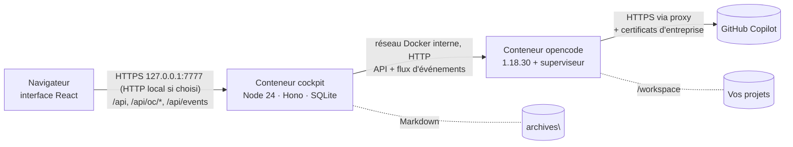

# Récapitulatif — opencode cockpit

> État au 15 septembre 2026. Ce document rassemble tout : ce qui a été construit, d'où vient l'interface, où se trouvent les fichiers, comment installer et lancer les scripts au travail, ce qui a été vérifié, corrigé et testé, et ce qui reste à vérifier.

> **Où en est la publication ?**
> - La **version 1.0.5** est en préparation, **non publiée** : HTTPS local par défaut (certificat auto-signé créé par le cockpit, avertissement du navigateur au premier accès, jamais approuvé dans Windows), mode HTTP local explicite (`install.ps1 -Http`, confirmation tapée, bandeau permanent), vérification du cockpit avant toute ouverture (empreinte du certificat, preuve du jeton, lien de connexion à usage unique), vérification du poste avant de passer en HTTPS, et retour arrière par `cockpit.ps1 rollback` (voir [section 9](#9-ce-qui-a-été-fait-étape-par-étape)).
> - La **version 1.0.4** est prête localement, **non publiée**. Les demandes facturées sont refusées tant qu'opencode est injoignable, redémarre ou n'a pas vérifié l'adresse de l'API Copilot, y compris au démarrage du cockpit. La correction de l'adresse part dès la fin de la réponse en cours, et les messages de refus sont exacts (voir [section 9](#9-ce-qui-a-été-fait-étape-par-étape)).
> - La **version 1.0.3** est publiée sur GitHub le 14 septembre 2026 : release, images GHCR et archive hors ligne. **C'est la dernière version publiée, donc celle à installer aujourd'hui**, au travail comme ailleurs. L'adresse de l'API Copilot y est vérifiée dans l'état réel d'opencode et revérifiée après chaque redémarrage.
> - La **version 1.0.2**, publiée le même jour, applique réellement les profils de permissions, « Revenir au profil Prudent » et le fichier brut de configuration, par un redémarrage d'opencode (défaut présent depuis la 1.0.0).
> - La **version 1.0.1**, publiée le même jour, apporte le réseau d'entreprise à routage par abonnement Copilot, les IA du compte lues directement chez GitHub et affichées disponibles ou non, l'interface démarrée même sans opencode et `cockpit.ps1 diag`.
> - La **version 1.0.0**, publiée le même jour, regroupe deux étapes de développement jamais publiées : **0.1.1**, les corrections du 13 septembre, et **0.2.0**, les assistants, les niveaux d'IA et le mode Simple (voir [section 9](#9-ce-qui-a-été-fait-étape-par-étape)). Ces numéros restent cités plus bas pour retracer l'historique.
> - La **version 0.1.0**, publiée le 13 septembre, contient les défauts corrigés depuis : ne plus l'installer.

> **Chantier 1.1, état au 19 septembre 2026 : non publié.** Le code de la première itération, « voir, borner, arrêter », est intégré : « Qui travaille ? », Déroulé, carte du travail en direct et démonstration, « Arrêter » sur toute la conversation, refus des fichiers de clés posé sur chaque conversation, « Plan d'abord », travail délégué refusé en mode Simple et détaillé en mode Avancé. Restent pour clore cette itération : relecture des corrections de la clôture (la revue globale et la vérification de la clôture ont été faites), `/security-review` et les recettes en attente de la [section 11](#11-limites-et-points-à-vérifier). Détails dans les sections [6](#6-utiliser-linterface), [8](#8-sécurité), [9](#9-ce-qui-a-été-fait-étape-par-étape) et [10](#10-validations-réalisées).

## Sommaire

1. [En bref](#1-en-bref)
2. [D'où vient l'interface ?](#2-doù-vient-linterface-)
3. [Où sont les fichiers](#3-où-sont-les-fichiers)
4. [Installer au travail, pas à pas](#4-installer-au-travail-pas-à-pas)
5. [Les scripts en détail](#5-les-scripts-en-détail)
6. [Utiliser l'interface](#6-utiliser-linterface)
7. [Comment ça marche](#7-comment-ça-marche)
8. [Sécurité](#8-sécurité)
9. [Ce qui a été fait, étape par étape](#9-ce-qui-a-été-fait-étape-par-étape)
10. [Validations réalisées](#10-validations-réalisées)
11. [Limites et points à vérifier](#11-limites-et-points-à-vérifier)
12. [Dépannage](#12-dépannage)
13. [Référence : fichier .env](#13-référence--fichier-env)
14. [Faire évoluer le projet](#14-faire-évoluer-le-projet)

---

## 1. En bref

**opencode cockpit** est un poste de pilotage web pour l'agent de code [opencode](https://opencode.ai). Il est pensé pour un poste de travail d'entreprise où seul **GitHub Copilot** est autorisé. Il ajoute à opencode :

- des **assistants** par tâche (analyser un incident, relire un script, préparer un CAB…), avec des droits limités et une IA fixée, installés depuis un catalogue ou créés en 5 écrans ;
- des **niveaux d'IA** (Rapide, Équilibré, Expert) reliés aux IA du compte Copilot de chacun, avec le coût estimé d'une demande avant l'envoi ;
- un **mode Simple** par défaut pour les collègues peu familiers de l'IA (règles d'or, réglages risqués masqués), et un **mode Avancé** ;
- un **chat** visuel : appels d'outils, diffs, autorisations, travail délégué ;
- un **studio** (mode Avancé) pour créer agents, skills et commandes ;
- des **archives** classées automatiquement par type de conversation ;
- un **suivi des coûts** Copilot face à un budget mensuel (150 $ par défaut).

| Élément | Où |
|---|---|
| Dépôt GitHub (public) | https://github.com/Calgar50/opencode-cockpit |
| Release 1.0.0 (publiée) | https://github.com/Calgar50/opencode-cockpit/releases/tag/v1.0.0 |
| Archive d'images hors ligne 1.0.0 | `opencode-cockpit-images-1.0.0.tar.gz` et son `.sha256`, dans la release |
| Images Docker 1.0.0 | `ghcr.io/calgar50/opencode-cockpit-opencode:1.0.0` et `ghcr.io/calgar50/opencode-cockpit-app:1.0.0` |
| Release 0.1.0 (ancienne, à ne plus installer) | https://github.com/Calgar50/opencode-cockpit/releases/tag/v0.1.0 |
| Interface une fois installée | **https**://127.0.0.1:7777 (avertissement du navigateur au premier accès) ; http://127.0.0.1:7777 si le mode HTTP local a été choisi |
| CI (tests, build, audit) et release | GitHub Actions, onglet « Actions » du dépôt |

---

## 2. D'où vient l'interface ?

**Elle a été créée de zéro pour ce projet.** Ce n'est ni l'interface web intégrée d'opencode (`opencode web`), ni un modèle ou un thème existant.

### Ce qu'elle est

- Une application **React 19 + Vite 8**, écrite en **TypeScript**, dans `app/web/`.
- Elle est construite en fichiers statiques (`app/dist/web/`), puis servie par le serveur du cockpit (`app/server/`), qui tourne dans le conteneur « cockpit ».
- Elle ne parle **jamais directement** à opencode. Elle appelle l'API du cockpit (`/api/...`), qui relaie vers opencode une **liste blanche** de routes (`/api/oc/...`) et diffuse les événements en temps réel (`/api/events`).

### De quoi elle est faite

| Partie | Origine |
|---|---|
| Système de design (couleurs, thèmes clair et sombre, composants CSS) | Écrit à la main : `app/web/styles.css`. La palette des graphiques reprend une palette validée pour le daltonisme. |
| Icônes | Dessinées à la main en SVG : `app/web/components/Icon.tsx`, sans bibliothèque d'icônes |
| Graphiques des coûts | Codés à la main en SVG : `app/web/pages/costs/charts.tsx`, sans bibliothèque de graphiques |
| Rendu Markdown des réponses | `marked` + `DOMPurify` (nettoyage anti-XSS) |
| Coloration du code | `highlight.js` |
| Éditeurs de texte (agents, skills, configuration) | `CodeMirror 6` |
| Composants (boutons, modales, notifications…) | Écrits à la main : `app/web/components/ui.tsx`, `Toast.tsx` |

### Qui a écrit quoi

- **Fondations**, écrites directement par Claude : design, composants, client API, flux d'événements, routage, coquille avec navigation et connexion. Également les pages **Chat** et **Coûts**.
- Page **Archives** : écrite par un agent secondaire, sur un cahier des charges détaillé et avec interdiction de toucher aux fondations.
- Pages **Studio**, **Paramètres** et **Diagnostic** : écrites par un second agent secondaire, dans les mêmes conditions.
- **Contrôle de l'ensemble** par Claude : vérification de types, build, 24 captures d'écran (12 écrans × 2 thèmes), revues de sécurité.
- **Étape 0.2.0, publiée dans la 1.0.0** (assistants, niveaux d'IA, modes) : trois conceptions concurrentes rédigées par des agents secondaires, jugées puis fusionnées ; implémentation en lots parallèles sur un contrat d'interfaces commun ; intégration, tests, revue adversariale et captures par Claude (voir [section 9](#9-ce-qui-a-été-fait-étape-par-étape)).

### Et l'interface d'opencode ?

opencode possède sa propre interface web. Elle n'est **ni utilisée ni exposée** : le port d'opencode n'est pas publié hors de Docker, et le cockpit ne relaie que les routes d'API dont sa propre interface a besoin.

---

## 3. Où sont les fichiers

```text
opencode-cockpit\
├─ install.ps1              ← INSTALLATION (à lancer en premier, et pour mettre à jour)
├─ cockpit.ps1              ← USAGE QUOTIDIEN (open, restart, logs, backup, restore…)
├─ CockpitTls.ps1           ← vérification du cockpit et isolation de compose (utilisée par les deux scripts)
├─ README.md                ← documentation d'utilisation
├─ docs\RECAPITULATIF.md    ← ce document
├─ VERSION                  ← numéro de version
├─ docker-compose.yml       ← définition des 2 conteneurs (ne pas modifier : tout passe par .env)
├─ .env.example             ← modèle de configuration
├─ .env                     ← CRÉÉ par install.ps1 : secrets et réglages (jamais versionné, jamais partagé)
│                             (le certificat HTTPS local, lui, est dans le volume Docker cockpit-tls,
│                              hors du dossier et hors des sauvegardes)
├─ certs\                   ← certificats d'entreprise (windows-trust.pem créé par install.ps1)
├─ archives\                ← CRÉÉ : conversations classées en Markdown
├─ backups\                 ← CRÉÉ par « cockpit.ps1 backup »
├─ docker\opencode\         ← image opencode : Dockerfile, superviseur, contrôle de santé, configuration par défaut
├─ app\                     ← le cockpit
│  ├─ Dockerfile
│  ├─ server\               ← serveur Node (API, proxy, coûts, archives, studio, sécurité) et tests
│  └─ web\                  ← interface React (pages, composants, styles)
└─ .github\workflows\       ← ci.yml : types, tests, build, audit, images (push sur main et pull requests)
                               release.yml : images GHCR et archive hors ligne (tag v*)
```

> **Les deux scripts `install.ps1` et `cockpit.ps1` sont à la racine du dossier**, pas dans un sous-dossier. Ouvrez PowerShell *dans ce dossier* pour les lancer.

---

## 4. Installer au travail, pas à pas

### Avant de commencer : vérifier avec la DSI

- **Docker Desktop :**
  - il n'est gratuit que pour les structures de moins de 250 salariés **et** de moins de 10 M$ de chiffre d'affaires annuel ; au-delà, un abonnement Docker est nécessaire ;
  - son installation demande les droits administrateur, WSL 2 et la virtualisation activée dans le BIOS.
- **GitHub Copilot :**
  - un abonnement Pro, Pro+, Business ou Enterprise est nécessaire ;
  - l'administrateur peut restreindre les modèles disponibles ou l'usage d'un client tiers comme opencode.
- **Windows PowerShell 5.1** ou plus récent : présent d'office sous Windows.

**Test rapide de Docker :** `docker run --rm hello-world`. S'il échoue au téléchargement, Docker Desktop n'atteint pas Docker Hub. Deux solutions :

- régler le proxy dans **Docker Desktop › Settings › Resources › Proxies** ;
- ou installer directement avec l'archive hors ligne (`-Mode Load`, voir plus bas).

`install.ps1 -Proxy` configure les conteneurs et la construction des images (npm, apt), mais pas les téléchargements faits par Docker Desktop lui-même : l'image de base en mode Build et les images GHCR en `-Mode Pull` passent par son propre réglage de proxy.

### Étapes

1. **Récupérer le projet**, au choix :
   - `git clone https://github.com/Calgar50/opencode-cockpit.git` ;
   - ou, sur la page du dépôt : **Code › Download ZIP**, puis extraire.

   Placez le dossier par exemple dans `C:\outils\opencode-cockpit`, **en dehors** du dossier de vos projets : `install.ps1` refuse que l'un contienne l'autre.
2. **Démarrer Docker Desktop** et attendre qu'il soit prêt.
3. **Ouvrir PowerShell dans le dossier du projet :**
   ```powershell
   cd C:\outils\opencode-cockpit
   ```
4. **Si vous avez pris le ZIP**, débloquer les scripts téléchargés :
   ```powershell
   Unblock-File .\install.ps1, .\cockpit.ps1, .\CockpitTls.ps1
   ```
5. **Lancer l'installation** en indiquant le dossier qui contient vos projets (voir le choix du dossier juste après) :
   ```powershell
   .\install.ps1 -WorkspaceDir C:\chemin\vers\mes\projets
   ```
   - Si PowerShell refuse d'exécuter le script (stratégie d'exécution) :
     ```powershell
     powershell -ExecutionPolicy Bypass -File .\install.ps1 -WorkspaceDir C:\chemin\vers\mes\projets
     ```
     Si la stratégie est imposée par la DSI, cela peut rester bloqué : demandez l'autorisation.
   - La première construction des images prend quelques minutes.
6. **Le navigateur s'ouvre sur un avertissement de certificat** (« Votre connexion n'est pas privée ») : c'est attendu en HTTPS local. Comparez l'empreinte affichée par le script avec celle du certificat présenté, puis **Avancé › Continuer vers 127.0.0.1 (non sécurisé)**. Vous êtes alors **connecté au cockpit**, sans rien saisir. Si le cockpit ne répond pas dans les 4 minutes, le script affiche un avertissement : consultez `.\cockpit.ps1 logs`, puis lancez `.\cockpit.ps1 open`.

   *Poste où Edge ne propose pas « Continuer » :* le script s'arrête **avant toute modification** et affiche deux issues : demander l'exception `SSLErrorOverrideAllowedForOrigins = https://127.0.0.1:7777` à l'informatique, ou choisir le mode HTTP local (`.\install.ps1 -Http`, confirmation `HTTP EN CLAIR`). Pour le savoir à l'avance, sans rien modifier : `.\install.ps1 -TlsPreflight`.

   Acceptez ensuite les 6 règles d'or de la fenêtre « Avant de commencer » (case « J'ai lu ces règles et je les appliquerai. », puis **Commencer**), puis allez dans **Paramètres › Connexion › Connecter**. Le cockpit affiche un code :
   - cliquez **Copier le code**, puis **Ouvrir GitHub** ;
   - collez le code sur la page GitHub et autorisez l'accès ;
   - revenez au cockpit : la connexion se termine toute seule. Le code expire au bout d'environ 15 minutes.
7. C'est prêt : **Assistants** pour installer les assistants du catalogue, puis **Chat › Nouvelle conversation**.

### Choisir le dossier des projets

Indiquez le dossier **parent** de vos dépôts, par exemple `C:\dev`, qui contient `C:\dev\api` et `C:\dev\front`. N'indiquez pas un dépôt précis : ses sous-dossiers (`src`, `docs`…) deviendraient autant de « projets ».

- Chaque sous-dossier de premier niveau apparaît comme un projet dans le Chat, avec l'entrée « Tout le workspace » (300 dossiers au maximum).
- Les dossiers masqués (`.xxx`), `node_modules` et `__pycache__` sont ignorés.
- Un dépôt cloné plus tard apparaît sans réinstallation.
- L'agent ne voit **que** ce dossier.
- Sans `-WorkspaceDir`, le script propose `%USERPROFILE%\source\repos` et peut créer le dossier.
- Un dossier trop large (racine d'un lecteur, profil utilisateur, dossier Windows) demande une confirmation ; sans elle, l'installation est annulée.
- Pour changer de dossier plus tard : `.\install.ps1 -WorkspaceDir <nouveau dossier>`.

### Variantes selon le réseau de l'entreprise

| Situation | Solution |
|---|---|
| La construction échoue : Docker Hub, npm ou dépôts Debian bloqués | Télécharger l'archive d'images de la release depuis le navigateur, puis `.\install.ps1 -Mode Load -ImagesArchive .\opencode-cockpit-images-<version>.tar.gz` |
| Vérifier l'archive avant de la charger | `(Get-FileHash .\opencode-cockpit-images-<version>.tar.gz -Algorithm SHA256).Hash`, à comparer au fichier `.sha256` |
| `ghcr.io` joignable | `.\install.ps1 -Mode Pull`. Les images sont publiques : ni compte ni `docker login` (vérifié le 13/09/2026 pour la 0.1.0). |
| Le proxy n'est pas détecté | `.\install.ps1 -Proxy http://proxy.entreprise:8080` |
| Les conteneurs doivent se connecter sans proxy alors que Windows en déclare un | `.\install.ps1 -Proxy ''` : connexion directe, choix mémorisé |
| Erreur de certificat (`SELF_SIGNED_CERT_IN_CHAIN`) **à l'usage** | `.\cockpit.ps1 certs`. Sinon, déposer le certificat racine du proxy dans `certs\` puis `.\cockpit.ps1 restart` (détails ci-dessous). |
| Erreur de certificat **pendant la construction** des images | Déposer le certificat dans `certs\` puis relancer `.\install.ps1` (les certificats sont intégrés aux images lors de leur construction), ou passer en `-Mode Load` |
| Rien d'autre ne fonctionne pour les certificats | **Dernier recours :** `.\install.ps1 -InsecureTls`. La vérification TLS est désactivée, un bandeau rouge le rappelle, et le réglage est mémorisé. `.\install.ps1 -SecureTls` la réactive. |
| Chaque demande échoue (`AI_APICallError`, `Unable to connect`, `Forbidden`) et des IA désactivées par l'organisation apparaissent : le pare-feu n'ouvre que l'adresse de l'abonnement Copilot | 1.0.1 : le cockpit prend de lui-même l'adresse que GitHub annonce pour l'abonnement quand l'adresse générale est bloquée. Pour l'imposer : `.\install.ps1 -CopilotApiUrl https://api.business.githubcopilot.com -NoBrowser` (ou `api.enterprise.githubcopilot.com`). Vérifier : **Diagnostic › Tester la connexion Copilot**. |
| Démarrage bloqué sur « Starting », journal d'opencode vide | 1.0.1 : `.\cockpit.ps1 diag` (état des conteneurs, accès réseau testés depuis opencode, journal). L'interface démarre même quand opencode ne répond pas. |
| Edge ne propose pas « Continuer » sur l'avertissement de certificat de `127.0.0.1` | 1.0.5 : demander à l'informatique l'exception Edge `SSLErrorOverrideAllowedForOrigins = https://127.0.0.1:7777`, puis `.\install.ps1`. Sinon : `.\install.ps1 -Http` (mode HTTP local, confirmation demandée, trafic en clair sur ce PC). Pour vérifier avant d'installer, sans rien modifier : `.\install.ps1 -TlsPreflight`. |

**Ajouter un certificat d'entreprise à la main :**

- Format : texte PEM (le fichier commence par `-----BEGIN CERTIFICATE-----`), extension `.pem` ou `.crt` uniquement.
- Un `.cer` binaire se convertit : `certutil -encode .\racine.cer .\certs\racine.pem`.
- `.\cockpit.ps1 certs` ne réécrit que `certs\windows-trust.pem` : vos fichiers ajoutés sont conservés.
- **Diagnostic › Réseau et sécurité** affiche le nombre de fichiers de certificats chargés par le conteneur opencode et l'état de la vérification TLS. Le serveur du cockpit (1.0.1) note dans son journal les certificats qu'il charge et ceux qu'il ignore.
- Ces certificats servent au conteneur opencode, à la construction des images et, depuis la 1.0.1, au serveur du cockpit (liste des IA et solde lus chez GitHub). Ils ne concernent que le trafic **sortant** : ne jamais placer dans `certs\` le certificat ni la clé du cockpit lui-même (ils sont dans le volume `cockpit-tls`, voir [section 8](#8-sécurité)).

### Mettre à jour

`.\cockpit.ps1 update` récupère la dernière version (`git pull`), puis relance `install.ps1` **dans le mode mémorisé** :

| Mode | Effet de `update` |
|---|---|
| Build | Les images sont reconstruites sur le poste. |
| Pull | Les images de la nouvelle version sont téléchargées depuis GHCR. |
| Load | Sans nouvelle archive, les images déjà chargées sont gardées, avec un avertissement si leur version diffère. Pour les mettre à jour : télécharger l'archive de la nouvelle version, puis `.\install.ps1 -Mode Load -ImagesArchive <archive>`. |

- **Dossier obtenu par ZIP** (pas de git) : `update` affiche un avertissement et s'arrête. Remplacez les fichiers par ceux de la nouvelle version sans toucher à `.env`, `certs\`, `archives\` ni `backups\`, puis lancez `.\install.ps1`.
- **Installation faite en 0.1.0** : le mode n'était pas mémorisé. Si `.env` désigne des images publiées (`ghcr.io/...`, installation faite en Pull ou en Load), la 1.0.0 réutilise les images **0.1.0** déjà présentes, sans rien construire ni télécharger, et le signale à chaque passage : leurs correctifs ne sont donc pas actifs. Lancez une fois `.\install.ps1 -Mode Pull` (GHCR joignable) ou `.\install.ps1 -Mode Load -ImagesArchive <archive 1.0.0>` : ce mode est ensuite mémorisé.
- **Permissions d'opencode** : la configuration par défaut n'est posée qu'au premier démarrage. Une installation existante garde ses anciennes règles, qui autorisaient d'office `git status`, `git diff`, `git log`, `git show`, `git branch` et `ls`, des commandes détournables (voir [section 8](#8-sécurité)). Pour passer aux règles actuelles : **Paramètres › Sécurité › Revenir au profil Prudent** (en mode Avancé : **Paramètres › opencode › Permissions globales › Prudent › Appliquer**). Les agents créés depuis les anciens modèles « relecteur sécurité » ou « architecte » gardent aussi leurs règles : passez leur shell à « demander » ou « refuser » dans le Studio (mode Avancé).
- **Installation 0.1.0, nouveautés de la 1.0.0** : rien n'est réécrit.
  - Au premier affichage, la fenêtre des règles d'or s'ouvre, puis l'interface passe en **mode Simple** avec une notice (« Passer en mode Avancé » ou « Compris »).
  - Les agents principaux existants apparaissent dans **Assistants** avec l'état « À compléter ». « Compléter » reprend leur nom, déduit le niveau quand leur IA correspond à un niveau, et marque les droits « Personnalisé » s'ils ne correspondent à aucun profil.
  - **Changement de comportement :** l'IA écrite dans un agent est désormais vraiment utilisée dans le chat (en 0.1.x, le sélecteur du chat l'emportait). La notice liste ces agents avec leur IA. La réflexion (« variante ») écrite dans un raccourci non délégué est aussi appliquée.

---

## 5. Les scripts en détail

### `install.ps1`

| Paramètre | Rôle | Valeur par défaut |
|---|---|---|
| `-WorkspaceDir` | Dossier des projets, monté dans les conteneurs sous `/workspace` | valeur de `.env`, sinon demandé |
| `-Port` | Port local de l'interface | valeur de `.env`, sinon `7777` |
| `-Mode` | `Build` (construit les images), `Pull` (télécharge depuis GHCR), `Load` (charge une archive) | mode mémorisé dans `.env` ; sinon `Load`, sans le mémoriser, si `.env` désigne déjà des images publiées (installation 0.1.0) ; sinon `Build` |
| `-ImagesArchive` | Archive d'images pour `-Mode Load` | facultatif lors d'une relance : les images déjà chargées sont réutilisées |
| `-ImageRegistry` | Registre pour `-Mode Pull` | `ghcr.io/calgar50` ; mémorisé seulement s'il est passé |
| `-Proxy` | Proxy d'entreprise (URL) | valeur de `.env`, sinon variable `HTTPS_PROXY`, sinon proxy système Windows (script PAC compris). `-Proxy ''` : connexion directe, mémorisée jusqu'à un nouveau `-Proxy <url>` ou un proxy saisi dans `.env`. |
| `-NoProxy` | Exceptions supplémentaires au proxy | valeur de `.env`, sinon vide. `localhost`, `127.0.0.1`, `::1`, `opencode` et `cockpit` sont toujours ajoutés dans les conteneurs. |
| `-SkipCertificates` | Ne pas exporter les certificats Windows | export activé |
| `-InsecureTls` | Désactiver la vérification TLS (secours) ; mémorisé | — |
| `-SecureTls` | Réactiver la vérification TLS | — |
| `-NoStart` | Préparer sans démarrer les conteneurs | — |
| `-NoBrowser` | Ne pas ouvrir le navigateur à la fin | — |
| `-TlsPreflight` | Vérifier le poste (stratégie du navigateur, `curl.exe`, voie de vérification) **sans rien modifier** et sans Docker, puis s'arrêter | — |
| `-AcceptBrowserBlock` | Passer outre la garde du navigateur pour une entrée en HTTPS, quand `edge://policy` montre que la lecture du registre se trompe. Non mémorisé. | — |
| `-Http` | Mode HTTP local : le cockpit est servi en `http://127.0.0.1:<port>`. Confirmation `HTTP EN CLAIR` demandée, choix mémorisé dans `.env` avec sa date. | — |
| `-Https` | Retour en HTTPS. Nouveau jeton (l'ancien a circulé en clair), reconnexion nécessaire. | mode par défaut |

**Ce que fait le script, dans l'ordre :**

1. Vérifie que Docker et Docker Compose v2 répondent.
2. Lit `.env` s'il existe et reprend le mode d'installation mémorisé. Pour un `.env` de la 0.1.0, sans mode : réutilise les images publiées qu'il désigne (mode Load, non mémorisé), sinon `Build`.
3. **Pré-contrôles, avant toute modification** : mode d'accès inscrit dans `.env`, images du mode Load, et garde du navigateur pour une entrée en HTTPS (installation neuve, passage depuis une version antérieure à la 1.0.5, `-Https`). Tout ce qui bloque est affiché en **un seul message**, suivi d'un seul arrêt : `.env`, images et conteneurs sont alors inchangés. Puis, avec `-Http`, la confirmation `HTTP EN CLAIR`.
4. Détermine le dossier des projets (paramètre, `.env` ou question), propose de le créer, et demande confirmation s'il est trop large.
5. Prépare la configuration en mémoire :
   - port, mode d'accès et date de confirmation du mode HTTP ;
   - secrets aléatoires de 64 caractères, conservés s'ils existent. Le jeton est **remplacé** à la sortie du mode HTTP local, au passage depuis une version antérieure à la 1.0.5, et s'il n'a pas le format généré ;
   - proxy, TLS, fuseau horaire.
6. Exporte les autorités de certification de confiance de Windows (hors certificats expirés) vers `certs\windows-trust.pem`, sauf avec `-SkipCertificates`.
7. Crée `archives\`. En mode Load avec archive, charge les images (`docker load`).
8. Écrit `.env` et restreint ses droits à votre compte Windows. Si le script s'arrête avant cette étape, `.env` n'est ni créé ni modifié.
9. Construit (Build) ou télécharge (Pull) les images. En cas d'échec, `.env` retrouve les images précédentes, pour que `start` et `restart` continuent de fonctionner.
10. Sauf avec `-NoStart` : donne les volumes Docker à l'utilisateur des conteneurs, prépare aussi le volume `cockpit-tls` du certificat local, puis démarre.
11. Attend que le cockpit réponde avec le mode attendu et la preuve du jeton — et, en HTTPS, l'empreinte du certificat épinglée — jusqu'à 4 minutes. S'il répond, affiche l'empreinte et ouvre `https://127.0.0.1:<port>` (ou `http://…` en mode HTTP local) avec un **lien de connexion à usage unique** (port de `-Port` ou de `COCKPIT_PORT`, `7777` par défaut ; rien ne s'ouvre avec `-NoBrowser`). Sinon, affiche un avertissement qui renvoie vers `.\cockpit.ps1 logs`, puis s'arrête : lancez `.\cockpit.ps1 open` une fois le cockpit prêt.

Relancer `install.ps1` est sans danger : secrets, réglages, mode d'installation et mode d'accès sont conservés. Le passage depuis une version antérieure à la 1.0.5 affiche un bloc qui rappelle la nouvelle adresse, le nouveau jeton et le retour arrière possible — même avec `-NoBrowser`.

### `cockpit.ps1`

Toujours lancé depuis le dossier du projet : `.\cockpit.ps1 <commande>`.

| Commande | Effet |
|---|---|
| `open` | Vérifie le cockpit (empreinte du certificat en HTTPS, preuve du jeton dans les deux modes), puis ouvre l'interface déjà connectée. **Aucune page n'est ouverte si la vérification échoue.** |
| `start` | Démarre les conteneurs (applique aussi une modification de `.env`). Refuse un mode d'accès invalide dans `.env`. |
| `stop` | Arrête les conteneurs |
| `restart` | **Recrée** les conteneurs : relit `.env`, et `certs\` pour opencode. Garde le certificat HTTPS local, et applique `.env` seul : les variables du shell et un fichier `docker-compose.override.yml` sont ignorés. |
| `status` | État des conteneurs et du cockpit, mode d'accès, empreinte du certificat et jours restants avant son échéance |
| `logs` | Journaux en direct. `logs opencode` montre le journal complet d'opencode (superviseur et serveur) ; `logs cockpit` celui du cockpit. |
| `certs` | Réexporte les certificats Windows, puis recrée les conteneurs. Ne touche pas au certificat HTTPS du cockpit. |
| `tls` | Certificat HTTPS local servi (empreinte SHA-256, dates, noms couverts) et stratégie du navigateur. En mode HTTP local : rappelle qu'aucun certificat n'est servi. |
| `tls -Renew` | Après avoir tapé `RENOUVELER` : efface la clé et le certificat local, puis le cockpit crée une nouvelle paire à son redémarrage. Nouvelle empreinte, donc nouvel avertissement du navigateur. Le fichier d'informations publié (`cockpit-tls.json`, sans secret) reste : `tls` et la page Diagnostic affichent l'empreinte précédente. |
| `update` | `git pull`, puis `install.ps1` dans le mode mémorisé (le mode d'accès est repris tel quel). Dossier sans git : avertissement seulement. |
| `rollback` | Revient à la version précédente, après avoir tapé `REVENIR`. Conditions : dépôt git propre, aucun commit local non publié, étiquette de la version cible présente. Remet dans `.env` les images, le mode d'installation et la version mémorisés, repositionne la branche sur l'étiquette sans jamais écraser un fichier, puis relance l'`install.ps1` de cette version. Sans git : affiche la marche à suivre. Retour limité aux scripts si les conteneurs sont restés dans l'ancienne version. |
| `backup` | Sauvegarde dans `backups\cockpit-AAAAMMJJ-HHMMSS.tar.gz` (détail ci-dessous) |
| `restore <fichier>` | Restaure une sauvegarde (détail ci-dessous) |
| `uninstall` | Supprime les conteneurs ; les données restent dans les volumes Docker |
| `uninstall -Purge` | Après avoir tapé `SUPPRIMER` : supprime aussi les volumes — dont `cockpit-tls`, le certificat HTTPS local, d'où un nouvel avertissement du navigateur à la réinstallation —, les images désignées dans `.env` (construites, téléchargées ou chargées) et les images construites sur ce poste. Les images de versions précédentes restent (`docker image ls`, puis `docker image rm`). `archives\`, `backups\`, `certs\` et `.env` sont conservés. |
| `help` | Aide |

### Sauvegarder et restaurer

**`backup`** arrête brièvement les conteneurs, crée l'archive, puis les redémarre.

| Contenu | Inclus ? |
|---|---|
| Volume `cockpit-data` : réglages, coûts, archives indexées | oui |
| Volume `oc-config` : configuration opencode, agents, skills, commandes | oui, sans `node_modules` |
| Volume `oc-data` : données d'opencode (sessions) | oui, **sans `auth.json`** (jeton GitHub Copilot) |
| Dossier `archives\` (exports Markdown) | oui |
| `.env`, `certs\` | non |
| Volume `cockpit-tls` (certificat HTTPS local et sa clé) | non |

**`restore <fichier>`**, par exemple `.\cockpit.ps1 restore .\backups\cockpit-20260913-180000.tar.gz` :

1. Un chemin relatif se lit depuis le dossier courant.
2. Le nom du fichier n'accepte que lettres, chiffres, point, tiret et souligné, avec l'extension `.tar.gz`.
3. L'archive est vérifiée **avant** tout arrêt : une archive illisible ne coupe pas le cockpit.
4. Vous tapez `RESTAURER` pour confirmer.
5. Les conteneurs sont arrêtés.
6. `cockpit-data`, `oc-config` et `oc-data` sont vidés, sauf le jeton Copilot, puis remplis depuis l'archive. `archives\` est complété : les fichiers absents de la sauvegarde restent, ceux qui portent le même nom sont remplacés par la version sauvegardée.
7. Les conteneurs redémarrent, **même si la restauration a échoué**.

Sur un nouveau poste : `.\install.ps1`, puis `restore`, puis **Paramètres › Connexion › Connecter**.

---

## 6. Utiliser l'interface

| Page | Ce qu'on y fait |
|---|---|
| **Chat** | Choisir le projet, puis un assistant (cartes d'accueil) ou l'Assistant général et son niveau d'IA. Écrire une demande : `@` joint un fichier, `/` lance un raccourci, on peut coller une image. L'IA qui va répondre et le coût estimé d'une demande sont affichés avant l'envoi ; l'IA d'un assistant ne se change pas depuis le chat. Rouvrir une conversation reprend l'assistant et le niveau enregistrés. Suivre la réponse en direct : réflexion, outils, diffs, sous-agents. Valider ou refuser les autorisations. Le panneau de droite montre le coût de la conversation, son classement, le plan de l'agent et les fichiers modifiés. |
| **Assistants** | Installer un assistant du catalogue, créer un assistant en 5 écrans, le modifier, compléter un agent créé avant la 1.0.0. Chaque assistant a une fiche d'identité : tâche, ce qu'il peut faire et ne fait jamais, IA, coût estimé, fiches. |
| **Coûts** | Dépense du mois face au budget, projection de fin de mois et date d'épuisement estimée. Dépense par jour, cumul, répartitions par modèle, catégorie, agent et projet. Conversations les plus coûteuses, export CSV. |
| **Archives** | Toutes les conversations classées, avec recherche plein texte et filtres (catégorie, période, projet, épinglées). Dans le détail : résumé, étiquettes et catégorie modifiables, transcription, bouton « Reclasser avec l'IA », export `.md`. |
| **Studio** (mode Avancé) | Agents, skills (avec fichiers annexes), commandes et `AGENTS.md`, plus une galerie de modèles prêts à l'emploi. Un sélecteur « Portée » propose « Global (tous les projets) » ou un projet (voir ci-dessous). |
| **Paramètres** | Onglets Connexion (Copilot), Niveaux d'IA, Budget (budget et garde-fou), Chat (valeurs par défaut), Affichage (mode Simple ou Avancé) et Sécurité (profil de droits, fournisseur d'IA). En mode Avancé seulement : Tarifs, Classement (catégories, modèle de classement) et opencode (modèles par défaut, fournisseurs, profils de permissions, fichier brut). |
| **Diagnostic** | État d'opencode et de son superviseur, flux d'événements, réseau et sécurité (proxy, TLS, certificats), catalogue des modèles. Journal d'opencode avec détection des erreurs connues. Boutons « Redémarrer opencode », « Rattraper l'historique » et « Recharger le catalogue ». |

### Modes Simple et Avancé

Chaque installation, mise à jour comprise, s'ouvre en **mode Simple**. On change de mode dans **Paramètres › Affichage**.

| | Mode Simple (défaut) | Mode Avancé |
|---|---|---|
| Pages | Chat, Assistants, Coûts, Archives, Paramètres, Diagnostic | les mêmes, plus **Studio** |
| Paramètres | Connexion, Niveaux d'IA (consultation), Budget, Chat, Affichage, Sécurité | en plus : modification des niveaux d'IA, Tarifs, Classement, opencode |
| Réponse à une demande d'autorisation | « Autoriser une fois » ou « Refuser » | pareil : « Toujours autoriser » n'est jamais proposé (voir [section 8](#8-sécurité)) |
| Un message avec une autre IA que celle de l'assistant | impossible | possible pour un seul message, si l'option est activée |
| Travail que l'IA veut confier à un autre assistant (1.1) | refusé automatiquement, avec un message à l'IA ; avis « En mode Simple, l'IA ne délègue pas : elle continue seule. » | attend votre accord, avec la carte « Détails de la délégation » |

- **Règles d'or :** au premier lancement, et à chaque changement de leur texte, la fenêtre « Avant de commencer » bloque l'interface (ni Échap, ni clic à côté) jusqu'à la case « J'ai lu ces règles et je les appliquerai. » et le bouton **Commencer**. Le texte n'est pas modifiable depuis l'interface :
  1. Tout ce que vous écrivez ou joignez (texte, fichiers, sorties de commandes) est envoyé à GitHub Copilot, un service extérieur à la banque.
  2. Jamais de données clients : nom, numéro de compte, IBAN, numéro de carte, numéro client, adresse, e-mail, téléphone, montant rattaché à un client. Remplacez-les par des repères : CLIENT_1, IBAN_1, SERVEUR_A.
  3. Jamais de secrets : mots de passe, clés privées, jetons, chaînes de connexion, fichiers .pfx, .p12, .key, .jks, .env, kubeconfig, sorties de terraform plan non nettoyées.
  4. L'IA n'agit jamais sur la production. Elle propose ; vous vérifiez ; vous exécutez, selon la procédure habituelle.
  5. L'IA ne remplace ni la relecture par un collègue (principe des quatre yeux), ni le CAB.
  6. L'IA peut se tromper avec assurance : commandes ou options inventées, dates mal calculées, versions dépassées, failles récentes inconnues. Testez toujours hors production.
- **Bandeau permanent** sous la zone de saisie : « Avant d'envoyer : aucune donnée client, aucun mot de passe, aucune clé. Relisez toujours la réponse : l'IA peut se tromper. »
- **Paramètres › Sécurité** (consultation) : profil de droits d'opencode et fournisseur d'IA. Si le profil a été modifié en mode Avancé, un bouton ramène au profil Prudent.
- **Garde du serveur :** en mode Simple, le serveur refuse (« Action réservée au mode Avancé (Paramètres › Affichage). ») les écritures du Studio, de la configuration d'opencode et des niveaux d'IA, la remise à zéro des réglages autres que le budget, et tout réglage autre que le budget mensuel, les seuils d'alerte, l'affichage, le niveau et le dossier par défaut du chat. Elle évite les erreurs ; ce n'est pas une barrière de sécurité, puisque chacun peut passer en mode Avancé.

### Assistants et niveaux d'IA

**Vocabulaire.** En mode Simple, l'interface ne montre ni « agent », ni « skill », ni « commande », ni « modèle » :

| Dans l'interface | Pour opencode | En une phrase |
|---|---|---|
| **Assistant** | agent principal géré par le cockpit | Fait une tâche précise, avec des droits limités et une IA adaptée. |
| **Assistant général** | agent `build` | Pour les demandes qui ne correspondent à aucun assistant. Proposé, mais jamais présélectionné. |
| **Fiche** | skill | Une procédure ou une checklist que l'assistant consulte. Elle n'a pas d'IA à elle. |
| **Raccourci** (`/nom`) | commande | Un texte tout prêt, lancé en tapant `/nom` dans le chat. |
| **Niveau d'IA** | liste ordonnée de modèles | Rapide, Équilibré ou Expert. |
| **Réflexion** | variante du modèle | Plus de réflexion : réponses plus lentes et plus chères. |
| **Travail délégué** | sous-agent (`subtask`) | Un autre assistant travaille à part, puis l'IA de la conversation reprend la main. |

**Ce qu'est un assistant.** Un vrai fichier d'agent opencode (`agents/<nom>.md`, portée globale), plus une ligne dans la base du cockpit :

- le fichier ne contient que des clés connues d'opencode : `description`, `mode: primary`, `model`, `variant` éventuelle, `steps`, `color`, `permission`. opencode transmettrait au fournisseur toute clé inconnue ; le titre, le niveau, la taille de tâche et l'origine restent donc dans la base du cockpit ;
- ses consignes se terminent par un bloc « Règles communes (ajoutées par le cockpit) », délimité par des marqueurs pour ne jamais être dupliqué : signaler une donnée client ou un secret sans le recopier, écrire « À VÉRIFIER » plutôt qu'inventer, ne jamais donner de « feu vert » à la place d'un collègue ou du CAB.

**Deux profils de droits**, les seuls que peut produire l'assistant de création :

| | Lecture seule (défaut) | Propose, vous validez |
|---|---|---|
| Modifier un fichier (`edit`) | refusé | sur confirmation |
| Commande shell (`bash`) | refusé | sur confirmation |
| Déléguer (`task`) | refusé | refusé |
| Internet (`webfetch`, `websearch`) | refusé, ou sur confirmation si « Consulter Internet » est coché | idem |
| Fiches (`skill`) | seulement les siennes | idem |
| Lecture (`read`) | fichiers de clés refusés (`.pfx`, `.p12`, `.key`, `.jks`, `.keystore`, `.kdbx`, clés SSH, kubeconfig…, en minuscules et en majuscules) ; `.env` sur confirmation | idem |
| Actions maximum (`steps`) | selon la taille de la tâche | idem |

- Aucune règle `"*"` générale dans `read` : les règles de l'agent passent en dernier chez opencode, et `"*": allow` annulerait la confirmation par défaut sur `.env`.
- `external_directory` n'est jamais touché : un refus casserait l'ouverture des fiches et les sorties d'outils tronquées.
- Toute autre combinaison, faite dans le Studio, s'affiche « Personnalisé », en rouge sur la fiche d'identité.

**Catalogue** (`app/server/assistants-catalogue.ts`, versionné) : six exemples, marqués « Exemple à relire avec votre équipe ».

| Assistant | Droits | Niveau | Taille | Fiches |
|---|---|---|---|---|
| Analyser un incident | Lecture seule | Équilibré | M | `anonymisation-donnees` |
| Relire un script avant mise en production | Lecture seule | Équilibré | M | `standards-scripts`, `anonymisation-donnees` |
| Préparer une demande de changement pour le CAB | Lecture seule | Expert | M | `checklist-cab` |
| Relire une requête SQL sur un réplica | Lecture seule | Équilibré | S | `requetes-sql-sures` |
| Expliquer une alerte de supervision | Lecture seule | Rapide | S | — |
| Rédiger ou mettre à jour un runbook | Propose, vous validez | Équilibré | M | — |

- Les trois nouvelles fiches (`anonymisation-donnees`, `standards-scripts`, `checklist-cab`) ont un contenu utilisable.
- L'installation ajoute les fiches manquantes sans jamais écraser une fiche existante, et ne crée pas de doublon si on la relance.

**Niveaux d'IA** (**Paramètres › Niveaux d'IA**) :

| Niveau | Recommandation livrée : IA préférée, puis IA de secours |
|---|---|
| Rapide | `github-copilot/gpt-5.4-mini` › `gpt-5-mini` › `claude-haiku-4.5` |
| Équilibré | `github-copilot/claude-sonnet-5` › `gpt-5.3-codex` › `claude-sonnet-4.6` |
| Expert | `github-copilot/claude-opus-5` › `claude-opus-4.8` › `gpt-5.6-sol` |

- **Choix :** la première IA du catalogue de **votre** compte Copilot, d'un fournisseur autorisé, capable d'utiliser des outils et non obsolète. État affiché : « ok », « secours » (une IA de secours sert), « indisponible », ou « non vérifié » quand le catalogue n'est pas chargé (les modifications sont alors bloquées).
- **Réflexion** d'un niveau : retirée avec un avertissement si l'IA retenue ne la propose pas.
- **IA réservées :** les IA à prix promotionnel et celles dont la sortie coûte 30 $ par million de jetons ou plus ne sont jamais dans la recommandation. En mode Avancé, elles apparaissent sous « Réservé (très cher) ».
- **Recommandation ou copie :** tant que les niveaux n'ont pas été modifiés, la recommandation suit les mises à jour du cockpit. Les modifier (mode Avancé) enregistre une copie ; « Revenir à la recommandation » demande confirmation.
- **Fichiers jamais réécrits en silence :** un assistant garde l'IA écrite dans son fichier. Si elle disparaît du compte, l'envoi est bloqué et rien n'est envoyé. **Mettre à jour** réaligne alors tous les assistants concernés en un seul lot : refus tant qu'une réponse est en cours ; sauvegarde de chaque fichier ; écriture ; rechargement et vérification par opencode ; en cas de refus, restauration de tous les fichiers, nouvelle vérification et redémarrage d'opencode si besoin. Pour un assistant dont le fichier a été modifié hors du cockpit, « Garder cette IA précise » retire sa liaison au niveau sans réécrire le fichier.
- **Assistant général :** utilise directement l'IA résolue du niveau choisi, secours compris.
- **Coût « ≈ X $ par demande » :** calculé avec le prix retenu partout (tarif personnalisé, sinon grille GitHub, sinon catalogue). D'abord estimé selon la taille de la tâche (S, M, L), puis selon la moyenne observée des demandes de l'assistant quand elles sont assez nombreuses. C'est une estimation, pas une facture.

**Dans le Studio (mode Avancé) :** champ « IA » (niveau ou IA précise), panneau « Quelle IA sera utilisée ? » calculé comme dans le chat et le serveur, badge « Niveau conseillé » sur les modèles de la galerie. La « Variante » d'une commande est désormais appliquée, sauf pour un raccourci délégué : le Studio invite alors à la régler sur l'assistant délégué. Les identifiants d'IA sont vérifiés contre le catalogue. Une clé inconnue d'opencode ajoutée dans l'en-tête d'un agent est refusée ; celles déjà présentes dans un fichier existant sont gardées, avec un avertissement.

**Studio et portée projet :**

- Tant que `COCKPIT_PROJECT_CONFIG=0` (valeur par défaut), les agents, skills et commandes d'un projet (dossier `.opencode/`) se consultent mais ne s'enregistrent pas.
- Le `AGENTS.md` à la racine d'un projet peut être enregistré, mais **opencode ne le charge pas d'office** dans ce mode (vérifié dans le code d'opencode 1.18.30). Exception : quand l'agent lit un fichier, opencode joint encore les `AGENTS.md` des dossiers situés entre ce fichier et le dossier de la conversation ; depuis « Tout le workspace », celui de chaque projet peut donc être lu.
- Placez donc vos consignes dans le `AGENTS.md` **global**. Le Studio le rappelle quand la configuration par projet est désactivée.

**Modèles prêts à l'emploi du Studio :**

- **5 agents :** `revue-securite` (ne modifie rien, commandes sur confirmation), `architecte` et `pedagogue` (ni modification, ni commande, ni sous-agent), `testeur`, `expert-sql`.
- **5 commandes :** `commit`, `revue`, `explique`, `tests`, `description-pr`.
- **3 skills :** `conventions-equipe`, `checklist-securite-web`, `requetes-sql-sures`.
- **Attention aux lignes ``!`…` `` des commandes :** opencode exécute directement, à chaque lancement, toute ligne ``!`commande` `` écrite dans une commande, **sans confirmation et quel que soit le profil**. Les modèles `commit`, `revue` et `description-pr` lancent ainsi `git diff` ou `git log`. Relisez toute commande qui en contient avant de l'enregistrer.

**Profils de permissions** (Paramètres › opencode) :

| Profil | Fichiers | Shell | Sous-agents | Web |
|---|---|---|---|---|
| **Prudent** (configuration d'origine) | demander | demander (seul `pwd` est autorisé d'office ; exception : les lignes ``!`…` `` des commandes) | demander | demander |
| Équilibré | autoriser | demander | demander | demander |
| Autonome (risqué) | autoriser | autoriser | autoriser | autoriser |

Appliquer un profil **remplace** tout le bloc `permission` du fichier de configuration : les commentaires placés à l'intérieur de ce bloc sont perdus, les autres sont conservés.

Depuis la 1.0.2, le cockpit **redémarre ensuite opencode** quelques secondes pour appliquer les règles, car opencode ne relit pas ce fichier autrement. Il ne le fait jamais pendant une réponse : il demande d'attendre la fin des réponses en cours. Même chose pour « Revenir au profil Prudent » et pour l'enregistrement du fichier brut. Rien n'est redémarré quand les règles sont déjà en place.

Les règles d'un agent ne s'appliquent pas aux sous-agents qu'il lance : ceux-ci suivent le profil global. Un agent qui ne doit rien modifier doit donc aussi refuser les sous-agents, comme `architecte` et `pedagogue`.

### 1.1, itération 1 : qui travaille, Arrêter, Plan d'abord (non publié)

Ce qui suit est dans le code du chantier 1.1, pas dans une version publiée. L'usage pas à pas est dans le README, section « Travail en direct, arrêt et Plan d'abord (1.1) ».

| Élément | Où | Ce qu'on y voit ou fait |
|---|---|---|
| **Qui travaille ?** | entre l'en-tête du chat et la conversation | Apparaît dès qu'un second assistant travaille ou qu'une action attend votre accord, puis reste, replié en fin de demande ; en mode Simple, replié aussi sur sa ligne de tête, [Répondre] compris, tant qu'une demande attend votre réponse (en mode Avancé, il reste déplié et garde toute sa hauteur sous la carte, qui se réduit). Une ligne par intervenant : état en mot et en icône (« travaille · lit {chemin} », « travaille · cherche « {motif} » », « travaille · modifie {chemin} », « travaille · lance une commande », « attend le travail délégué », « en attente de votre accord », « nouvelle tentative (n) », « terminé », « échec », « arrêté »…), durée, coût. [Répondre] amène à la demande d'autorisation (le focus ne bouge qu'à ce clic) ; [Voir le travail] ouvre le travail délégué dans le tiroir de lecture. Un travail délégué lancé par un raccourci porte « lancé sans confirmation » dans les deux modes, précédé de « raccourci /nom » en mode Avancé. À 400 px : une ligne et « +2 ». Phrase d'accueil au premier affichage. |
| Transcription | conversation | Une carte par travail délégué (qui, état, durée, consigne et résultat, affichés en texte). « Reprise dans la conversation » quand l'assistant reprend après un travail délégué. Réponse sans appel d'IA marquée « Sans appel d'IA : non facturé ». Pied de réponse : « {coût} dont {x} $ de travail délégué · {n} appels d'IA ». |
| **Déroulé** | panneau de droite du chat, détail d'une archive | Demande choisie ; par intervenant, barres « génération », « attente de délégation » et « attente de vous » (hachure et mot « vous ») ; prévu et réel avec les écarts ; [Tableau]. « Déroulé partiel » au-delà de 3 niveaux ou de 50 intervenants. « Temps d'attente non enregistré avant la 1.1 » pour une conversation plus ancienne. |
| **Carte du travail en direct** | au-dessus de la liste des intervenants | « Travail en direct » en mode Simple (repliée, résumé d'une ligne), « Carte des agents en direct » en mode Avancé (dépliée, y compris pendant une demande d'autorisation : elle y montre l'attente de votre accord, hexagone hachuré, cadenas, ambre, et la délégation en préparation, pointillé rose fixe ; elle prend alors la hauteur que lui laisse « Qui travaille ? » et s'y réduit, jusqu'à une mini-carte, puis défile). Dessinée depuis les faits enregistrés, jamais sans eux. Un bouton par assistant ouvre ses outils, ses fichiers (lu, modifié, refusé) et « Consigne reçue · Ce qu'il a fait · Résultat rendu ». [Figer l'affichage (le travail continue)], [Tableau]. Au plus 4 rendus par seconde ; un retard de plus de 2 s est rattrapé d'un coup (« Affichage rattrapé », enregistré). Transitions d'environ 900 ms, seulement si le système ne demande pas de réduire les animations ; aucune animation sans fin. Liste seule à 400 px. |
| **Démonstration** | [Voir une démonstration] de la carte | Capture réelle de deux délégations lancées par une même réponse, rejouée moment par moment (←/→, Début, Fin, [Moment précédent], [Moment suivant], [Recommencer]) : « Démonstration enregistrée : aucune IA n'est appelée ». Aucune requête vers opencode. En mode Simple : « Enregistrée en mode Avancé. », suivi de l'avis sur la délégation. |
| **Autonomie** | à côté de « Envoyer », et dans l'en-tête | Menu au clavier (flèches, position annoncée), sans raccourci global. Utilisables : « Demander à chaque fois » (défaut) et « Plan d'abord ». « Modifications automatiques » et « Autonome avec contrôle » : désactivés mais focalisables, avec la raison « Pas encore disponible dans cette version du cockpit. » |
| **Plan d'abord** | sélecteur Autonomie | Nouvelle conversation de plan : outils de modification et de commande retirés à la conversation et à son travail délégué, vérifiés à la création puis avant chaque envoi ; « Cette conversation ne peut rien modifier, même plus tard. » Après chaque réponse, carte à quatre boutons : [Exécuter en demandant à chaque fois] et [Continuer à planifier] utilisables, les deux exécutions automatiques désactivées avec leur raison. Exécuter crée une autre conversation, saisie préremplie par « Exécute le plan suivant. » et le dernier texte du plan ; rien n'est envoyé sans vous. Budget du mois atteint : confirmation, la création ne coûtant rien. Refusé si la configuration d'opencode déclare des outils MCP ou des extensions. |
| **Arrêter** | zone de saisie | Visible tant que la conversation ou son travail délégué travaille, attente de votre accord comprise. Arrête tout l'arbre (voir [section 8](#8-sécurité)). |
| **Travail délégué** | conversation | Mode Simple : refusé automatiquement, avis « En mode Simple, l'IA ne délègue pas : elle continue seule. » Mode Avancé : votre accord, carte « Détails de la délégation » (assistant demandé, IA, estimation, compteurs de la demande, droits comparés, « Tout @fichier cité dans la consigne est lu sans vous demander… », refus prévu et sa raison). |
| **Diagnostic** | carte « Travail délégué et autonomie » | Bandeaux affichés seulement quand le relevé le constate : un travail délégué peut lui-même déléguer ; travail délégué en tâche de fond ; extensions installées ; assistants qui délèguent sans demander ; relevé incomplet. État des outils internes du cockpit (« Classement des archives », « IA de contrôle »). |
| **Paramètres › Affichage** | « Annonces de « Qui travaille ? » » | Activées par défaut : au plus une annonce toutes les 2 s au lecteur d'écran, sans jamais lire de texte de la conversation. |

---

## 7. Comment ça marche


```mermaid
flowchart LR
  B[Navigateur<br/>interface React] -- "HTTPS 127.0.0.1:7777 (HTTP local si choisi)<br/>/api, /api/oc/*, /api/events" --> C[Conteneur cockpit<br/>Node 24 · Hono · SQLite]
  C -- "réseau Docker interne, HTTP<br/>API + flux d'événements" --> O[Conteneur opencode<br/>1.18.30 + superviseur]
  O -- "HTTPS via proxy<br/>+ certificats d'entreprise" --> G[(GitHub Copilot)]
  O -. "/workspace" .- W[(Vos projets)]
  C -. "Markdown" .- A[(archives\)]
```

### Quelle IA est réellement utilisée

opencode choisit l'IA de chaque appel selon des règles relevées ligne à ligne dans son code (version 1.18.30). Le cockpit les reproduit dans un seul module sans dépendance, `app/server/shared/assistant-rules.ts`, utilisé par le chat (affichage avant l'envoi), l'assistant de création, le panneau du Studio et le serveur (contrôle de chaque demande).

| Demande | IA | Réflexion | Source dans opencode (`packages/opencode/src/`) |
|---|---|---|---|
| Message | IA de la demande, sinon celle de l'agent, sinon celle de la session | celle de la demande ; sinon celle de l'agent, seulement si l'IA retenue est la sienne | `session/prompt.ts:646-689` |
| Raccourci non délégué | IA du raccourci, sinon celle de l'agent désigné par le raccourci, sinon celle de la demande | celle de la demande. opencode ignore la `variant:` écrite dans un raccourci : le cockpit la recopie dans la demande. | `session/prompt.ts:1370-1473`, `command/index.ts` |
| Travail délégué (raccourci lié à un sous-agent, ou `subtask: true`) | IA du sous-agent, sinon celle du raccourci ; puis **reprise** sur l'IA et l'agent de la conversation (« Summarize the task tool output above and continue with your task. ») | héritée seulement si le sous-agent n'a pas d'IA | `tool/task.ts:179-209`, `session/prompt.ts:430-448` |
| Résumer | IA de l'agent caché `compaction` s'il en a une, sinon IA de la demande | aucune | `session/compaction.ts:358-361` |
| Fiche (skill) | aucune : un `SKILL.md` ne lit que `name` et `description` | — | `skill/index.ts:53-59` |

Ce qui en découle :

- une IA absente du catalogue produit « Model not found », sans repli ; une réflexion inconnue est ignorée sans message ;
- toute fiche est aussi lançable en `/nom`, sans contrôle de droits ni d'IA (`command/index.ts:134-152`) : le cockpit refuse donc une `/fiche` que l'assistant n'a pas le droit d'ouvrir ;
- une clé inconnue dans l'en-tête d'un agent est transmise au fournisseur comme option : le cockpit n'écrit que les clés connues d'opencode.

**Contrôle par le serveur du cockpit** sur `prompt_async`, `command` et `summarize`, après les filtres de contenu de la 0.1.1 :

| Situation | Réponse |
|---|---|
| Demande sans IA explicite (opencode prendrait celle de la session, hors contrôle) | 400 `modele-requis` |
| Un appel facturé (IA de la demande, d'un assistant, d'un raccourci ou d'un sous-agent) vers un fournisseur non autorisé | 403 `fournisseur-refuse` |
| Assistant qui a son IA, demande envoyée avec une autre IA | 409 `assistant-model-changed`, avec l'IA de l'assistant. Le chat renvoie une seule fois avec celle-ci et l'indique. |
| `/fiche` interdite à l'assistant, ou raccourci lié à un assistant introuvable | 403 |
| IA absente du catalogue | 409 `ia-indisponible`, rien n'est envoyé |
| Garde-fou budgétaire sur l'un des appels facturés | 409, confirmation demandée |

Chaque demande acceptée est notée dans la base (table `chat_turns` : assistant, raccourci, niveau, IA, réflexion, appels prévus). Rouvrir une conversation reprend ainsi les mêmes choix. En mode Avancé, si l'option est activée, un message peut partir avec une autre IA que celle de l'assistant.

### Deux conteneurs

- **opencode** : l'agent lui-même, en utilisateur non-root, avec `git` et `ripgrep`. Un **superviseur** le relance s'il s'arrête ou si le cockpit le demande. La demande passe par un fichier dans un dossier partagé, **sans accès au socket Docker**.
- **cockpit** : le serveur de l'interface. Il écoute tous les événements d'opencode pour tenir le registre des coûts et les archives.

### Où sont les données

| Volume Docker | Contenu |
|---|---|
| `cockpit-data` | Base SQLite du cockpit : sessions, coûts par appel, demandes, archives et index plein texte, alertes, réglages, assistants (titre, niveau, taille de tâche, origine) et choix de chaque demande |
| `oc-config` | Configuration opencode : `opencode.jsonc`, `agents/`, `commands/`, `skills/`, `AGENTS.md` |
| `oc-data` | Données opencode, dont `auth.json` (jeton Copilot) |
| `oc-cache` | Cache opencode |
| `control` | Dialogue superviseur ↔ cockpit (demande de redémarrage) et journal `opencode.log` |

À cela s'ajoutent deux dossiers visibles sous Windows : le dossier des projets (`/workspace`) et `archives\`.

**Journaux :** le journal d'opencode est écrit dans `opencode.log`, affiché dans **Diagnostic**, et recopié en continu dans les journaux du conteneur (`cockpit.ps1 logs opencode`). Docker les limite à 3 fichiers de 10 Mo par conteneur.

### Calcul des coûts

- **Mode de facturation :** depuis le 1er juin 2026, GitHub Copilot facture **au token**, en crédits IA (1 crédit = 0,01 $). Le compteur est remis à zéro le **1er de chaque mois à 00:00 UTC**. Un budget utilisateur épuisé bloque les requêtes, sans repli sur un modèle gratuit.
- **Enregistrement :** chaque appel de modèle est enregistré, sous-agents, compaction et classement compris.
- **Montant retenu, par ordre de priorité :**
  1. le coût **réellement facturé**, lu par opencode dans la réponse de GitHub ;
  2. à défaut, **votre tarif personnalisé** (Paramètres › Tarifs) ;
  3. à défaut, pour les modèles GitHub Copilot, la **grille officielle GitHub** intégrée au cockpit (relevée le 13/09/2026, paliers « long contexte » compris) ;
  4. à défaut, le catalogue d'opencode.
- **Personnalisation :**
  - dans Paramètres › Tarifs, modifier le tarif d'un modèle crée un tarif personnalisé, sans toucher à la grille officielle ; « Retirer » le supprime ;
  - l'option « Toujours appliquer la grille » ignore le coût facturé et calcule avec les niveaux 2 à 4.
- **Alertes :** à 50, 75, 90 et 100 % du budget.
- **Garde-fou :**
  - à partir de 80 % du budget, un modèle dont la sortie coûte plus de 15 $/M tokens demande confirmation ;
  - à 100 %, tout modèle payant demande confirmation ;
  - depuis la 1.0.0, il vérifie **chaque appel facturé** d'une demande (IA d'un assistant, d'un raccourci, d'un travail délégué et reprise comprises), et non plus seulement l'IA choisie dans le chat.

### Classement automatique

Le déroulé dépend du mode choisi dans **Paramètres › Classement** (IA par défaut). Les étapes 3 et 4 n'ont lieu qu'en mode IA. En mode par mots-clés seuls, la catégorie est posée une seule fois, au premier archivage, et le bouton « Reclasser avec l'IA » applique l'heuristique sans appeler de modèle. Sans classement automatique, l'heuristique est quand même posée au premier archivage, puis rien n'est reclassé.

1. **Archivage à l'inactivité :** quelques secondes après la fin d'une réponse, la conversation est archivée, avec les secrets de la transcription masqués.
2. **Heuristique immédiate :** un classement gratuit est posé à partir des mots-clés, des outils utilisés et des fichiers touchés.
3. **Affinage par un modèle :** après 2 minutes d'inactivité (délai réglable), un petit modèle peu coûteux affine la catégorie, les étiquettes et le résumé (environ 0,001 $).
   - **Titre :** le modèle en propose un, retenu seulement si opencode n'a laissé qu'un titre générique (« New session… ») et que le titre n'a pas été modifié à la main.
   - **Choix du modèle :** celui choisi dans **Paramètres › Classement**, sinon le premier disponible parmi GPT-5 mini, MAI Code 1.1 Flash, GPT-5.6 Luna, GPT-5.4 mini et Claude Haiku 4.5, sinon le modèle GitHub Copilot connecté le moins cher (prix d'entrée + prix de sortie). Sans modèle Copilot disponible, le classement reste heuristique.
   - **Échec :** l'heuristique est conservée, et un nouvel essai a lieu à l'inactivité suivante.
4. **Mise à jour :** une fois classée par le modèle, la conversation est reclassée après 3 nouvelles demandes (réglable).
   - Corriger à la main la catégorie, les étiquettes ou le résumé fige tout le classement de la conversation : le classement automatique ne la modifie plus, même après de nouvelles demandes.
   - Un titre modifié à la main est toujours conservé.
   - Le bouton « Reclasser avec l'IA » passe outre ces corrections, mais garde le titre. Ensuite, la conversation n'est plus marquée comme corrigée à la main.
5. **Copie Markdown :** `archives\<Catégorie>\<AAAA-MM>\<AAAA-MM-JJ>_<titre>_<id>.md`.
   - `<Catégorie>` : le libellé, où les caractères interdits dans un nom de fichier (`/ \ : * ? " < > |`) deviennent `-`. « Data / SQL » donne donc le dossier `Data - SQL`, pas un sous-dossier.
   - `<titre>` : le titre en minuscules, sans accents, mots séparés par des tirets, 50 caractères au plus ; `<id>` : les 8 derniers caractères de l'identifiant de session.
   - Le mois et la date sont ceux de la création **en UTC** : une conversation ouverte le 1er juste après minuit (heure de Paris) est rangée dans le mois précédent.

Catégories par défaut, toutes modifiables : Débogage, Fonctionnalité, Refactoring, Revue de code, Tests, Question / Explication, Documentation, Data / SQL, DevOps / Infra, Sécurité, Exploration / Idée, Autre.

---

## 8. Sécurité

### Réglages par défaut

- **Exposition réseau :**
  - interface publiée **uniquement** sur `127.0.0.1`, en HTTPS (certificat auto-signé local, créé par le cockpit au premier démarrage et rangé dans un volume réservé) ou en HTTP local, si ce mode a été choisi à l'installation ;
  - opencode n'a **aucun** port publié et exige un mot de passe aléatoire.
- **Accès à l'interface :**
  - jeton de 256 bits ; le cookie de session `__Host-cockpit_session` (`HttpOnly`, `Secure`, `SameSite=Strict`, `Path=/`, sans `Domain`) porte sa date d'émission et une signature calculée avec un secret aléatoire du serveur. L'expiration de 30 jours est vérifiée par le serveur, et la déconnexion change ce secret : toutes les sessions ouvertes sont révoquées. Après la mise à jour vers la 1.0.5, le jeton est remplacé et il faut se reconnecter une fois (`.\cockpit.ps1 open`) ; c'était déjà le cas après la mise à jour depuis la 0.1.0 ;
  - 20 jetons erronés en 5 minutes bloquent temporairement la connexion ;
  - contrôle de l'en-tête `Host` (anti DNS rebinding) ;
  - en-tête anti-CSRF obligatoire et vérification de l'origine (schéma servi et hôte) ;
  - CSP stricte, aucun script en ligne ;
  - le lien de connexion `/auth` refuse les requêtes émises par une autre page, y compris après l'avertissement de certificat (Edge et Chrome 153 envoient alors `Sec-Fetch-Site: none`, mesuré). C'est un **lien à usage unique**, valable 10 minutes, qui ne contient jamais le jeton permanent. En mode HTTP local, la connexion par saisie du jeton est refusée par le serveur, et l'écran de connexion ne propose pas de champ.
- **Certificat HTTPS local :** créé par le cockpit au premier démarrage (ECDSA P-256, 397 jours, renouvelé au démarrage moins de 30 jours avant son échéance, jamais en cours d'utilisation). La clé est écrite dans le volume `cockpit-tls`, monté **seulement** dans le conteneur du cockpit, avec des droits réservés à l'utilisateur du serveur ; elle n'entre ni dans les images, ni dans le contexte de construction, ni dans les sauvegardes, ni dans les journaux, ni dans l'API. Le certificat n'est **jamais** ajouté au magasin de Windows : l'avertissement du navigateur est le prix de ce choix, et il se lève en comparant l'empreinte affichée par `.\cockpit.ps1 tls`.
- **Mode HTTP local, si vous l'avez choisi** (`install.ps1 -Http`, confirmation `HTTP EN CLAIR`) : le cookie de session et tout le contenu des pages circulent **en clair** entre le navigateur et le cockpit, sur ce PC. Peuvent le lire : les outils de sécurité du poste qui inspectent le trafic (EDR, DLP, protection web), qui peuvent enregistrer les adresses complètes et les cookies ; un programme lancé avec les droits administrateur ; tout compte capable de piloter Docker Desktop, puisque le trafic traverse la machine virtuelle et le réseau de Docker — ce compte peut de toute façon lire le jeton dans le conteneur, dans les deux modes. Ne change pas : écoute limitée à `127.0.0.1`, jeton de 256 bits, cookie `__Host-`, contrôles d'hôte et d'origine, CSP, et chiffrement du trafic vers GitHub Copilot. Le mode est visible en permanence (bandeau de l'interface, carte Diagnostic, messages des scripts) et n'est jamais choisi automatiquement.
- **Limite commune aux deux modes :** les cookies n'isolent pas les ports. Un autre serveur local ouvert en `http://127.0.0.1:<autre port>` pendant une session reçoit le cookie du cockpit. C'était déjà vrai avant la 1.0.5.
- **Proxy vers opencode :**
  - **liste blanche minimale** : seules les routes utilisées par l'interface sont relayées. Partage public, mise à jour à distance, injection d'identifiants, terminal, exécution shell directe et routes de lecture de fichiers (`/file*`) ne sont pas relayés ;
  - les dossiers transmis (`directory`) sont bornés au workspace ;
  - les demandes ne peuvent contenir que du texte et des fichiers. Un fichier désigné par une URL `file:` doit être dans le workspace ; seules les images collées (URL `data:image/…`) font exception ;
  - dans une commande (`/commande`), les arguments sont filtrés, car opencode exécuterait ou lirait leur contenu **sans demander d'autorisation**. Sont refusés : tout texte contenant à la fois « ! » et un accent grave (syntaxe ``!`commande` ``, même en morceaux), et les références `@fichier` qui commencent par `~`, contiennent `..`, ou désignent un chemin hors du workspace une fois résolues comme le fait opencode (depuis la racine du dépôt git, ou depuis la racine du conteneur hors dépôt).
- **Conteneurs :** non-root, `cap_drop: ALL`, `no-new-privileges`, cockpit en lecture seule, journaux plafonnés.
- **Configuration opencode par défaut (profil Prudent) :**
  - **seul GitHub Copilot est autorisé**. opencode active d'origine des modèles gratuits hébergés chez un tiers ;
  - confirmation avant chaque modification de fichier par les outils d'édition, chaque commande shell de l'agent, chaque lancement de sous-agent par l'agent et chaque accès web ;
  - **aucune commande shell autorisée d'office, sauf `pwd`** : autoriser `git status` ou `git diff` d'office ouvrirait une porte (voir les limites ci-dessous) ;
  - les sous-agents lancés par l'agent demandent confirmation, et la demande affiche leur consigne, car opencode lit sans contrôle un `@chemin` qui s'y trouverait. « Toujours autoriser » n'est jamais proposé (voir plus bas) ;
  - partage public désactivé ; mises à jour automatiques et téléchargements de serveurs de langage désactivés.
- **Fournisseur d'IA verrouillé deux fois (1.0.0) :** en plus de la configuration d'opencode, le serveur du cockpit refuse toute demande dont un appel facturé viendrait d'un fournisseur hors de `COCKPIT_ALLOWED_PROVIDERS` (`github-copilot` par défaut). Toute autre valeur affiche en permanence le bandeau rouge « Mode test : un fournisseur autre que GitHub Copilot est autorisé. »
- **IA d'un assistant imposée par le serveur (1.0.0) :** voir [section 7](#7-comment-ça-marche).
- **Assistants sûrs par construction (1.0.0) :** l'assistant de création ne peut produire ni autorisation d'office pour modifier, exécuter ou déléguer, ni portée projet, ni IA d'un fournisseur non autorisé ; la lecture des fichiers de clés est refusée (voir [section 6](#6-utiliser-linterface)).
- **Mode Simple (1.0.0) :** règles d'or, bandeau, écritures risquées refusées par le serveur. Protection contre les erreurs, pas contre un utilisateur qui passe volontairement en mode Avancé.
- **« Toujours autoriser » supprimé dans les deux modes (1.0.0) :** dans opencode 1.18.30, une réponse « Toujours » ajoute une règle « tout autoriser » pour cette catégorie d'actions (lecture, modification, web…), valable pour tous les agents du projet et évaluée **après** leurs propres refus, jusqu'au redémarrage d'opencode (`permission/index.ts:28-38, 73, 145-150`). Mesuré sur un opencode isolé : après un « Toujours » sur la lecture d'un `.env`, un assistant qui refuse les `.pfx` en lit un, dans la même conversation, dans une autre, et même quand le « Toujours » a été donné à un autre agent ; un agent qui refuse les modifications par motif écrit un fichier après un « Toujours » d'édition donné ailleurs. Le cockpit ne propose donc plus ce bouton, et son serveur refuse une réponse « Toujours ». Pour autoriser d'office une catégorie d'actions, un profil de permissions (mode Avancé) reste possible : ces règles globales passent **avant** les refus de chaque assistant.
- **Arrêt d'une réponse (1.0.0) :** mesuré sur un opencode isolé, une demande de délégation en attente survit à l'arrêt de la conversation ; y répondre « une fois » deux minutes plus tard a lancé un sous-agent détaché, facturé, dont le résultat a été perdu. À l'arrêt, le cockpit refuse les demandes en attente de la conversation et de ses sous-agents, et son serveur refuse toute autorisation pour une conversation qui ne tourne plus.
- **Limites propres à opencode**, que la configuration ne peut pas corriger :
  - le contrôle des commandes shell ne voit pas ce qui n'est pas une commande. Une affectation de variable (`export GIT_CONFIG_...; git status` suffit à faire exécuter du code par une commande « de consultation ») ou une redirection seule (`> fichier` vide ou crée un fichier, configuration d'opencode comprise) passent sans confirmation ;
  - les lignes ``!`commande` `` écrites dans une commande du Studio s'exécutent à chaque lancement, sans confirmation et quel que soit le profil ;
  - une `/commande` liée à un sous-agent ou marquée `subtask: true` (comme le modèle `revue`) le lance sans confirmation, et mentionner un agent (`@general`) dans les arguments d'une `/commande` lève la confirmation des sous-agents de cette réponse ;
  - une réponse « Toujours autoriser » vaudrait pour tous les agents du projet et lèverait leurs refus, jusqu'au redémarrage d'opencode : le cockpit ne la propose pas et la refuse (voir plus haut) ;
  - `grep` et `glob` demandent l'autorisation avec le **motif recherché**, pas avec le fichier (`tool/grep.ts:39-41`) : un refus de lecture sur un fichier de clés n'empêche pas `grep` d'en afficher des lignes. La fiche d'identité le rappelle : ne laissez aucun fichier de clés dans le dossier des projets. Les extensions en casse mélangée (`.Pfx`) ne sont pas couvertes par la liste de refus ;
  - un travail délégué lancé par l'IA elle-même (outil `task`, possible avec l'Assistant général après confirmation) démarre dès qu'il est autorisé, sans estimation par opencode. Dans la 1.1 (non publiée), le cockpit le refuse d'office en mode Simple et fait passer « Autoriser une fois » par sa garde en mode Avancé (voir plus bas, « Chantier 1.1, itération 1 ») ; une délégation qu'un assistant lance sans demander reste vue après coup. Les assistants du catalogue et ceux de l'assistant de création refusent la délégation ;
  - les consignes d'un agent remplacent le texte système par défaut d'opencode (`session/llm/request.ts`), ce qui peut changer sa façon d'utiliser les outils.
- **Dossier `.opencode/` des dépôts ignoré par défaut** (`COCKPIT_PROJECT_CONFIG=0`) : un plugin piégé ne peut pas s'exécuter, et le `AGENTS.md` à la racine du projet ouvert n'est pas chargé d'office. En revanche, quand l'agent lit un fichier, opencode joint encore les `AGENTS.md` des dossiers situés entre ce fichier et le dossier de la conversation : celui d'un sous-dossier, ou celui de chaque projet depuis « Tout le workspace », peut donc atteindre le modèle. Les fiches qu'un dépôt livrerait dans `.agents/skills` ou `.claude/skills` ne sont pas chargées non plus (`OPENCODE_DISABLE_EXTERNAL_SKILLS=1`, `OPENCODE_DISABLE_CLAUDE_CODE_SKILLS=1`) : sans cela, opencode les chargeait malgré la configuration par projet désactivée, et elles pouvaient remplacer une fiche d'assistant du même nom.
- **Jeton Copilot confiné :** la synchronisation facultative du solde ne l'envoie qu'à `api.github.com`, ou au seul domaine GitHub Enterprise déclaré ; la connexion GitHub Enterprise n'est acceptée que vers ce domaine.
- **Données :**
  - secrets masqués dans les archives (titres compris) et les journaux du cockpit : jetons, clés, options de mot de passe de `curl`, `wget`, `mysql` ou `sshpass`, chaînes de connexion JDBC et Oracle, signatures SAS, contenus de kubeconfig, blocs de clés privées ; les aperçus de demandes ne sont plus conservés, et ceux d'avant la 1.0.0 sont effacés de la base ;
  - export CSV protégé contre l'injection de formules, y compris derrière le séparateur « ; » de l'Excel français (vérifié dans Excel) ;
  - réponses de l'API servies avec une CSP « sandbox » et un type de contenu limité à JSON ou au flux d'événements.
- **Écritures de configuration vérifiées :** le serveur refuse un modèle de classement, un modèle par défaut, un modèle d'agent ou une liste `enabled_providers` qui sortiraient de `COCKPIT_ALLOWED_PROVIDERS`. Appliquer un profil de permissions retire les clés `permission` en double, redémarre opencode pour appliquer le fichier (1.0.2), puis relit la configuration pour vérifier que les règles ont vraiment été appliquées. Si opencode ne repart pas ou refuse le fichier, la version précédente est remise.
- **Emplacement du cockpit :** `install.ps1` et `cockpit.ps1` refusent que le dossier du cockpit et le dossier des projets se contiennent l'un l'autre, car l'agent pourrait sinon réécrire les scripts lancés sous Windows.
- **Images :** le paquet opencode de la plateforme est téléchargé puis vérifié par une empreinte SHA-512 épinglée, sans script d'installation lancé en root ; aucun argument de proxy n'est déclaré dans les Dockerfile. Depuis la 1.0.5, les certificats d'entreprise sont montés pendant la construction (`RUN --mount`) au lieu d'être copiés dans **les deux** images, et un `.dockerignore` tient les clés et `.env` hors du contexte de construction : aucun identifiant ni aucune clé ne reste dans l'historique des images.
  - Markdown nettoyé (DOMPurify).
- **Chaîne d'approvisionnement :** versions épinglées, image de base épinglée par empreinte, GitHub Actions épinglées par SHA, `npm audit` en CI.

### Sorties réseau : à qui opencode et le cockpit parlent

Vérifié le 13 septembre de deux façons :

- **mesure réelle** : opencode lancé avec la configuration par défaut sur un réseau Docker sans accès Internet, sa seule sortie étant un proxy qui note chaque requête ;
- **audit du code source** d'opencode 1.18.30, contre-vérifié.

**Intelligence artificielle : uniquement GitHub Copilot.**

- `enabled_providers: ["github-copilot"]` retire tous les autres fournisseurs une fois chargés : modèles gratuits « OpenCode Zen », et ceux qu'une clé d'API ou `auth.json` activerait. `disabled_providers` coupe en plus les deux fournisseurs gratuits d'opencode.
- Un modèle d'un autre fournisseur est **refusé sans aucune connexion** : mesuré pour Zen, Anthropic, OpenAI et une demande sans modèle. Il n'existe aucun repli vers un modèle gratuit.
- Tous les appels de modèle passent par ce filtre : conversation, sous-agents, compaction, génération des titres, classement du cockpit (dont le repli est limité aux modèles Copilot).
- Claude, GPT ou Gemini choisis dans le cockpit sont appelés **chez GitHub** (`api.githubcopilot.com`, ou `copilot-api.<domaine>` pour GitHub Enterprise ; depuis la 1.0.1, l'adresse de l'abonnement comme `api.business.githubcopilot.com` quand le cockpit l'impose à opencode), jamais directement chez Anthropic, OpenAI ou Google. La suite du trajet se fait chez GitHub, dans le cadre du contrat Copilot.

**Envoyé à Copilot sans confirmation :**

- le titre de chaque conversation, à partir du premier message ;
- la compaction d'une conversation trop longue ;
- le classement automatique : jusqu'à environ 12 000 caractères de la conversation. Choisissez le mode par mots-clés seuls pour l'éviter.

**Autres sorties, sans intelligence artificielle :**

| Destination | Quand | Ce qui part |
|---|---|---|
| `models.opencode.ai` | Au démarrage d'opencode, puis toutes les heures | Rien : lecture du catalogue des modèles |
| `registry.npmjs.org` | Au premier démarrage, et quand ce paquet manque (par exemple après une restauration) | Noms et versions de paquets (installation de `@opencode-ai/plugin`, vérification de sécurité npm) ; aucun code |
| `api.githubcopilot.com/models`, `github.com/login/…` | Connexion à Copilot, liste des modèles | Le jeton GitHub ; aucun code |
| `api.github.com` (cockpit) | Synchronisation du solde, si vous l'activez ou cliquez « Synchroniser maintenant » ; depuis la 1.0.1, lecture de l'adresse de l'abonnement (au plus une fois par heure) | Le jeton GitHub ; aucun code |
| Adresse de l'API Copilot, `/models` (cockpit, 1.0.1) | Au démarrage, toutes les 15 minutes, **Recharger le catalogue** et **Tester la connexion Copilot** | Le jeton GitHub, seulement vers une adresse officielle de l'API Copilot ; aucun code |
| Adresses GitHub et Copilot, sans jeton (cockpit, 1.0.1) | **Diagnostic › Tester la connexion Copilot** | Rien : test de joignabilité |
| Page web choisie par l'agent (`webfetch`) | Seulement après votre confirmation | L'adresse demandée, qui peut contenir ce que le modèle y met |

**Absents :**

- aucune télémétrie : ni PostHog, ni Sentry, ni autre. Un export OpenTelemetry n'aurait lieu que si une variable d'environnement le demandait, ce qui n'est pas le cas ;
- pas de partage public, désactivé deux fois (configuration et `OPENCODE_DISABLE_SHARE`) ;
- pas de mise à jour automatique, pas de téléchargement de serveurs de langage ;
- la recherche web (services Exa ou Parallel) n'est pas proposée aux modèles Copilot.

**Ce qui pourrait changer cela :**

- **Une modification de la configuration** : ajouter un fournisseur (Paramètres › opencode › Fournisseurs, avec avertissement) ou, dans le fichier brut, rediriger `github-copilot` vers une autre adresse, ajouter un plugin ou un serveur MCP. C'est possible et volontaire : relisez toute modification du fichier brut, et vérifiez les fournisseurs après une réinstallation sur un ancien volume ou une restauration.
- **Une connexion GitHub Enterprise vers un faux domaine** : opencode y enverrait toutes les demandes et le jeton. Le cockpit refuse tout domaine autre que `COCKPIT_GITHUB_ENTERPRISE_DOMAIN`, et n'accepte de connexion que pour Copilot.
- **Des règles de permission glissées dans une requête** (champ `permission` d'une conversation, ou `tools` dans une demande) : le cockpit les refuse.
- **Un proxy d'entreprise qui inspecte le TLS** : il voit le trafic en clair, Copilot compris. C'est le principe de ces proxys.
- **Ce que vous autorisez** : une commande shell (`curl`, `git push`…), une page web ou un sous-agent approuvés peuvent envoyer des données ailleurs. Le profil « Autonome » ne demande plus rien.

### Première revue de sécurité (avant publication de la 0.1.0) : 4 failles, toutes corrigées

| Gravité | Faille | Correctif | Test |
|---|---|---|---|
| Haute | Studio : le champ « ancien nom » d'un renommage n'était pas validé. Une requête forgée pouvait supprimer des fichiers hors du dossier de configuration, jusque dans vos projets. | Validation centrale de tout nom et confinement du chemin avant suppression ou copie | test automatisé |
| Haute | Fichiers annexes des skills : le nom du skill n'était pas validé. Écriture et suppression possibles hors du dossier autorisé. | Même validation centrale | test automatisé |
| Moyenne | N'importe quelle page web visitée pouvait bloquer la connexion pendant 5 minutes en envoyant 20 faux jetons. | `/auth` refuse les requêtes provenant d'une autre page | test automatisé |
| Moyenne | Un dépôt piégé contenant `.opencode/plugin/` voyait son code exécuté **sans confirmation** dès l'ouverture du projet, avec accès au jeton Copilot. | Configuration par projet désactivée par défaut ; synchro du solde limitée au domaine GitHub déclaré | vérifié en réel : plugin **non exécuté** par défaut, exécuté si on l'autorise |

### Seconde revue (13 septembre, après publication) : corrigée dans la 0.1.1

Une revue adversariale menée par 34 agents sur ces corrections a produit 30 constats : 25 confirmés (reproduits, ou vérifiés dans le code et les sources d'opencode) et 5 réfutés. Le tableau regroupe les défauts de la 0.1.0 corrigés dans la 0.1.1, qu'ils viennent de cette revue ou de la vérification du récapitulatif (voir [section 9](#9-ce-qui-a-été-fait-étape-par-étape)). Principaux défauts corrigés :

| Gravité | Défaut dans la 0.1.0 | Correctif 0.1.1 |
|---|---|---|
| Haute (bloquante) | Dans les scripts PowerShell, `-v` et `-d` étaient pris pour `-Verbose` et `-Debug`. `install.ps1` ne pouvait pas aller au bout ; `backup` échouait toujours ; `compose up -d` ne rendait jamais la main. | Fonctions d'appel à Docker réécrites ; vérifié sous PowerShell 5.1 |
| Haute | La route `/commande` exécutait ``!`commande` `` sans autorisation et lisait des `@fichiers` hors du workspace, jeton Copilot compris | Arguments de commande filtrés (références `@` résolues comme le fait opencode) ; demandes limitées au texte, aux fichiers du workspace et aux images collées |
| Haute | Les commandes « de consultation » autorisées d'office (`git status`, `git diff`, `git log`…) pouvaient être détournées par `export` pour exécuter du code | Plus aucune commande autorisée d'office, sauf `pwd` |
| Moyenne | Routes de lecture de fichiers arbitraires et d'exécution shell directe relayées ; fichiers joints non bornés | Liste blanche réduite ; fichiers joints bornés au workspace |
| Moyenne | Un sous-agent pouvait lire un fichier hors du workspace via sa consigne | Sous-agents sur confirmation, consigne affichée (exceptions propres à opencode : voir ci-dessus) |
| Moyenne | Appliquer un profil de permissions gardait les anciennes règles, et passer d'« Autonome » à « Prudent » échouait | Remplacement complet du bloc de permissions |
| Moyenne | `restore` absent ; `restart` ne relisait pas `.env` ; `update` repassait une installation Load ou Pull en Build | `restore` sécurisé, `restart` recrée les conteneurs, mode mémorisé ou déduit |
| Moyenne | `-Proxy ''` n'était pas mémorisé, et une variable de proxy du shell l'emportait sur `.env` | Choix mémorisé ; variables du shell masquées pendant les appels à Docker |
| Faible | Journal d'opencode invisible dans `logs opencode`, `-InsecureTls` irréversible, `-Purge` laissant les images téléchargées, sauvegarde sans `archives\`… | Corrigés |

### Revue adversariale de la 0.2.0

Quatre relecteurs (sécurité, conformité aux règles d'opencode, robustesse du serveur, interface), puis un vérificateur par relecteur chargé de réfuter chaque constat : 17 constats, **15 confirmés** et 2 réfutés. Les 15 confirmés, soit 12 défauts distincts (deux ont été vus côté serveur et côté interface), sont corrigés avec des tests.

| Gravité | Défaut | Correctif |
|---|---|---|
| Moyenne | Le serveur lisait l'IA d'une demande sous n'importe quelle forme, alors qu'opencode n'en lit qu'une par route. Une IA « leurre » contournait la liste des fournisseurs et le garde-fou budgétaire. | L'IA est lue exactement comme opencode la lit : objet `model` pour un message, texte pour un raccourci, champs de premier niveau pour Résumer. Une demande qui contient une autre forme est refusée. |
| Moyenne | « Conseiller (lecture seule) » n'est pas en lecture seule dans opencode 1.18.30 : avec le profil Prudent, il peut modifier ou exécuter après confirmation. | Les droits affichés suivent ce qu'opencode applique réellement. Avec le profil Prudent, il s'appelle « Conseiller » et sa fiche dit qu'il demande avant de modifier ou d'exécuter. |
| Moyenne | Mode Avancé : « Autre IA » pour un seul message était ignorée pour un raccourci, qui partait sur l'IA de l'assistant avec un message trompeur. | Le changement d'IA est aussi transmis pour les raccourcis. |
| Moyenne | Un assistant à IA précise enregistré dans le Studio apparaissait ensuite « Modifié hors du cockpit ». | L'IA appliquée est mise à jour à l'enregistrement. |
| Moyenne | « Réaligner » était proposé sur un élément sans niveau et échouait toujours. | Bouton retiré pour ces éléments ; le serveur explique qu'il faut choisir un niveau ou garder l'IA précise. |
| Faible | En mode Simple, remplacer d'un bloc les tarifs personnalisés échappait à la garde du serveur. | Les blocs remplacés en entier sont comparés en entier. |
| Faible | « Compléter » acceptait les agents intégrés d'opencode et les sous-agents : en mode Simple, on pouvait ainsi supprimer des fichiers d'agents du Studio. | Seuls les agents principaux ordinaires se complètent ; agents intégrés et agent de classement refusés. |
| Faible | Un niveau dont les IA ont un prix promotionnel était ignoré en silence, puis utilisé quand même par le chat. | Une IA promotionnelle choisie en mode Avancé est retenue ; un niveau indisponible bloque l'envoi. |
| Faible | L'IA propre d'un raccourci délégué n'était pas vérifiée dans le catalogue. | Vérifiée ; l'envoi est bloqué si elle manque. |
| Faible | Un premier échec de lecture du catalogue bloquait pendant 15 minutes tout enregistrement portant une IA. | Nouvel essai toutes les 20 secondes tant que le catalogue n'a jamais été lu. |
| Faible | Studio en portée projet : choisir un niveau laissait l'éditeur « modifié » après l'enregistrement. | Corrigé. |
| Faible | Mode Simple : « Choisir un niveau » ouvrait la page Assistants sans l'élément concerné. | Proposé seulement pour les agents qu'on peut compléter ; sinon « Réglable en mode Avancé ». |

**Réfutés :**

- « Toujours autoriser » masqué seulement dans l'interface en mode Simple : c'est la conception retenue. La garde du mode Simple évite les erreurs ; une requête fabriquée à la main peut de toute façon passer d'abord en mode Avancé. *Point dépassé depuis : la recherche menée avant la publication a montré qu'une réponse « Toujours » lève les refus de tous les agents ; la 1.0.0 supprime « Toujours autoriser » dans les deux modes et le serveur la refuse.*
- Réflexion d'un assistant transmise à un travail délégué : c'est bien le comportement d'opencode, et le cockpit en tient déjà compte dans l'aperçu, l'estimation et le garde-fou.

### Revue de sécurité avant publication (1.0.0)

Cinq relecteurs se sont partagé le travail : régressions des derniers correctifs, surface HTTP, écritures de fichiers et de configuration, chaîne d'approvisionnement et empaquetage, secrets et fuites de données. Pour chacun, un vérificateur était chargé de réfuter ses constats. Bilan : **23 constats, 20 confirmés, 3 réfutés** ; 19 sont corrigés avec des tests, 1 reste une limite documentée. Deux défauts de plus, trouvés en préparant le chantier multi-agents puis mesurés sur un opencode isolé, sont corrigés aussi (deux premières lignes).

| Gravité | Défaut | Correctif |
|---|---|---|
| Haute | « Toujours autoriser » levait les refus de tous les agents du projet. Mesuré : fichiers de clés lus malgré l'interdiction, écritures par un agent qui les refusait. | Bouton supprimé ; le serveur refuse une réponse « Toujours ». |
| Moyenne | Après un arrêt, répondre à une demande d'autorisation restée ouverte lançait un sous-agent détaché et facturé. Mesuré. | À l'arrêt, les demandes en attente sont refusées ; le serveur refuse toute autorisation pour une conversation qui ne tourne plus. |
| Moyenne | Les identifiants d'un proxy d'entreprise restaient dans l'historique de l'image opencode construite sur le poste. | Arguments de proxy retirés des Dockerfile ; certificats montés pendant la construction au lieu d'être copiés. |
| Moyenne | Un dépôt pouvait livrer des fiches (`.agents/skills`, `.claude/skills`), chargées malgré la configuration par projet désactivée, qui remplaçaient celles des assistants. | Fiches externes désactivées tant que `COCKPIT_PROJECT_CONFIG=0`. |
| Moyenne | `install.ps1` acceptait le dossier du cockpit à l'intérieur du dossier des projets : l'agent pouvait réécrire les scripts lancés sous Windows. | `install.ps1` et `cockpit.ps1` refusent que l'un contienne l'autre. |
| Moyenne | Le verrou « fournisseurs autorisés » du serveur ne couvrait ni le modèle de classement ni les écritures de configuration d'opencode. | Modèle de classement et configuration vérifiés (fournisseurs, modèles par défaut, modèles d'agents) ; repli automatique sur Copilot. |
| Moyenne | La protection contre les formules de l'export CSV ne marchait pas avec le séparateur « ; » de l'Excel français. Reproduit dans Excel. | Toute formule placée après un séparateur, une tabulation ou un retour à la ligne est neutralisée. |
| Moyenne | Un agent « lecture seule » pouvait déléguer à un sous-agent qui modifie. | La mention « lecture seule » exige que modification, commande **et** délégation soient refusées. |
| Faible | Les réponses du proxy gardaient le type de contenu d'opencode et la CSP de la page. | Types limités à JSON et au flux d'événements ; CSP « sandbox » sur toute l'API. |
| Faible | Cookie de session partagé par tous les ports de 127.0.0.1, jamais renouvelé, non révoqué à la déconnexion. | Cookie signé avec un secret du serveur, expiration contrôlée, déconnexion qui révoque toutes les sessions. |
| Faible | Un seul limiteur de tentatives de connexion, épuisable depuis le conteneur opencode. | Le bon jeton passe toujours ; les échecs restent ralentis. |
| Faible | Résumer contrôlait l'IA de la demande, alors qu'opencode facture celle de l'agent caché de compaction quand il en a une. | Les contrôles et le garde-fou portent sur l'IA réellement facturée. |
| Faible | `install.ps1` affichait le proxy en clair, identifiants compris. | Identifiants masqués à l'affichage. |
| Faible | Masquage des secrets incomplet (options de mot de passe de `curl` ou `mysql`, chaînes JDBC, signatures SAS, kubeconfig…) ; titres de conversation non masqués ; aperçus de demandes conservés en clair. | Règles étendues, titres masqués partout, aperçus supprimés (migration de la base, effacement sécurisé). |
| Faible | Appliquer un profil de permissions pouvait laisser une clé `permission` en double et annoncer un succès sans effet. | Doublons retirés ; règles relues et comparées après l'écriture. |
| Faible | `COCKPIT_TLS_INSECURE=true` ou `yes` coupait la vérification TLS sans afficher le bandeau rouge. | Seule la valeur `1` désactive la vérification. |
| Faible | opencode était installé par `npm install -g`, sans empreinte, avec son script d'installation lancé en root. | Paquet de la plateforme vérifié par une empreinte SHA-512 épinglée, sans script d'installation. |

**Non corrigé, documenté :** les blocs de droits des assistants ne couvrent pas les outils MCP ni ceux des plugins ; aucun serveur MCP ni plugin n'est configuré par défaut (voir [section 11](#11-limites-et-points-à-vérifier)).

**Réfutés :** la mention du secteur bancaire dans l'interface et la documentation (aucune donnée sensible) ; des jetons OAuth MCP dans les sauvegardes (ce fichier ne peut pas en contenir dans cette configuration) ; la branche `main` non protégée pour `cockpit.ps1 update` (réglage du dépôt GitHub, hors du code livré).

### Chantier 1.1, itération 1 (non publié)

Ce qui change pour la sécurité dans le code de la première itération. Les tests et mesures qui tiennent chaque point sont en [section 10](#10-validations-réalisées).

- **Réponses d'autorisation : une file, « une fois » ou « refuser ».** Le filet de la 1.0.0 (demande encore active vérifiée, demandes restées en attente refusées après un arrêt) devient un module unique, le portillon, emprunté par toute réponse : les vôtres, relayées par le proxy, comme celles du cockpit (refus à l'arrêt, refus du mode Simple). Chaque réponse est notée dans un registre **avant** son envoi. Aucune réponse « toujours » ne part (refusée depuis la 1.0.0), et aucune règle d'autorisation (`allow` ou `ask`) n'est écrite sur une conversation.
- **Refus retenu.** Refuser une demande fait refuser par opencode **toutes** les autres demandes en attente de la même conversation, et le tour s'arrête, même avec un message (mesuré, M12). Un refus décidé par le cockpit attend donc que les autres demandes de la conversation soient réglées, et que les autres actions de la même réponse soient finies : sur opencode réel, une modification pose sa demande 5 à 7 ms après la délégation (le temps de lire le fichier et de calculer les changements), une commande environ 100 ms après au premier appel (mesuré à la répétition générale de l'itération 1). 45 s au plus : au-delà, rien n'est envoyé tant qu'une autre demande attend ou qu'une autre action est en cours, et le refus du mode Simple est relancé après votre réponse suivante dans la conversation ou à la fin d'une de ses actions.
- **Planchers : des refus seulement, vérifiés.** Le serveur pose sur la conversation un tableau de règles de refus, puis retrouve ce tableau à l'identique, par empreinte SHA-256, dans la réponse d'opencode (mesuré : opencode le renvoie octet pour octet, M16) :
  - `CONVERSATION`, sur toute conversation créée par le cockpit, et sur une ancienne avant le premier envoi : les refus de lecture des fichiers de clés de `KEY_FILE_READ_RULES`, sans la règle « demander » des `.env` ni « autoriser » des `.env.example` (les `.env` restent lisibles avec votre accord). Le travail délégué en hérite, y compris `general` et `explore`, qui lisaient ces fichiers en 1.0 (mesuré, M2) ;
  - `PLAN`, sur une conversation de plan : `CONVERSATION`, plus `edit` et `bash` refusés, ce qui retire les outils de modification et de commande à la conversation et à son travail délégué (mesuré, M2 ; confirmé pour la conversation en e2e sur opencode réel hors ligne) ;
  - écart ou vérification impossible à la création : la conversation est supprimée, rien n'est envoyé ni facturé (502 `plancher-non-verifie`). Une conversation existante n'est jamais supprimée : seul l'envoi est refusé, et la vérification est refaite au suivant.

  Un refus sur un motif précis ne retire pas l'outil : l'IA garde `read` et peut tenter de lire un fichier de clés, ce qui est refusé sans demande. De même, `read mcp:*` refuse les outils de ressources MCP **à l'appel, sans les masquer** : l'IA les voit, peut les appeler, et la réponse qui les appelle est facturée (mesuré, M3). Ce refus est prévu pour les étapes d'équipe (itération 4) ; une conversation ne le porte pas, et « Plan d'abord » est refusé quand la configuration d'opencode déclare des outils MCP ou des extensions.
- **Arrêter : tout l'arbre, dans cet ordre.** Même séquence pour « Arrêter » et pour un plafond de délégation dépassé :
  1. refus, dans la file des réponses, de toutes les demandes en attente de la conversation et de son travail délégué (base du cockpit et `/children` d'opencode, bornés) ;
  2. arrêt de la conversation, puis de chaque travail délégué encore occupé : l'arrêt de la conversation seule ne les arrête pas tous ;
  3. vérification de `/session/status` toutes les 500 ms pendant 10 s au plus, un second arrêt, sinon « arrêt non confirmé » au journal ;
  4. tout « une fois » tardif est refusé ;
  5. travail délégué en cours marqué « arrêté », fait `statut` et événement `conversation.arretee`. Aucun résultat partiel n'est ajouté à la conversation.

  L'arrêt n'écrit aucune configuration et ne redémarre pas opencode. Le bouton « Arrêter » du navigateur et l'arrêt relayé par le proxy passent par cette séquence pour toute conversation suivie par le cockpit.
- **Travail délégué.** « Autoriser une fois » d'une délégation passe par une garde, dans la file des réponses : refus (409, rien n'est relayé, la demande reste en attente) pour une demande morte, un assistant inconnu, réservé aux conversations ou interne (`cockpit-*`, `compaction`, `title`, `summary`), un `task_id` hors de la conversation, une consigne qui cite un fichier existant avec « @ », une commande « !` » ou une adresse web, une IA hors Copilot ou hors catalogue, un refus du garde-fou budgétaire, ou le plafond de la demande atteint (`budget.delegation` : 5 délégations et 1,00 $ par défaut). En mode Simple, la délégation est refusée d'office, avec un message à l'IA, par le refus retenu. Une délégation lancée sans demande (assistant `task: allow`, raccourci lié à un sous-agent) est comptée après coup, dans les deux modes ; au-delà du plafond, toute la conversation est arrêtée.
- **Agents internes gardés.** `cockpit-classifier` (classement) et `cockpit-controle` (IA de contrôle de la future « Autonome avec contrôle », appelée par rien tant que les choix automatiques sont fermés ; `mode: primary`, caché, `"*": "deny"`) ne sont installés qu'au repos : ni réponse en cours, ni demande facturée en vol, ni redémarrage ou application de configuration en cours. Une occupation impossible à vérifier ne vaut jamais « au repos ». Sinon, nouvel essai à 30 s, doublé à chaque report jusqu'à 5 min ; l'état est dans **Diagnostic**, jamais un 503 silencieux.
- **Garde « réponse en cours » partout.** Le Studio, l'installation, la modification et la suppression d'assistants et **Redémarrer opencode** sont refusés (409) pendant un redémarrage d'opencode, et pendant une réponse ou une demande facturée en vol ; dans ce second cas, en mode Avancé, une confirmation (`x-cockpit-confirm: 1`) passe outre. Pour le Studio et les assistants, la vérification est refaite après l'attente dans la file des écritures de configuration, qui reste tenue jusqu'à la fin du rechargement : aucune demande facturée ne commence entre les deux. Quand opencode répond mais que ses conversations sont illisibles, le refus a son propre code (`reponses-non-verifiables`) et un message vrai ; **Redémarrer opencode** accepte alors la confirmation même en mode Simple (décision du 15 septembre), jamais quand une réponse est lue en cours. Les écritures de configuration d'opencode et le réalignement des assistants gardent leur refus, sans confirmation possible.
- **Données.** Les faits d'activité (migration 5, table `activity_facts`) ne portent ni texte de message ni secret ; ils sont supprimés avec la conversation. « Affichage rattrapé » est enregistré par une route `POST` bornée.
- **Aucune dépendance npm nouvelle** : le banc e2e n'utilise que Node 24, Docker et un navigateur déjà installé ; il refuse de démarrer sur la pile de l'utilisateur, sur un `.env` ou sur le port 7777, et ses secrets sont fabriqués à chaque exécution, jamais affichés.

---

## 9. Ce qui a été fait, étape par étape

1. **Recherche sur des faits vérifiés :**
   - lancement du vrai binaire opencode 1.18.30 et lecture de son contrat d'API (environ 230 routes) ;
   - test d'une vraie conversation ;
   - deux recherches documentaires : fonctionnement d'opencode et facturation de Copilot.
2. **Découvertes qui ont orienté la conception :**
   - Copilot est passé à la **facturation au token** le 1er juin 2026 : le suivi compte les tokens de chaque appel, pas les prompts ;
   - opencode fournit le **coût réellement facturé** par GitHub pour chaque appel ;
   - opencode active par défaut des **modèles gratuits d'un tiers**, désactivés ici pour ne pas envoyer de code hors de Copilot ;
   - un **fichier d'agent invalide bloque tout le serveur opencode**, même après correction. Le Studio valide donc avant d'écrire, annule et redémarre opencode si nécessaire.
3. **Construction du serveur** (Node 24, TypeScript exécuté nativement, SQLite intégré) : proxy filtré, flux d'événements, registre des coûts, archives, classement, studio, sécurité HTTP.
4. **Construction de l'interface** (voir [section 2](#2-doù-vient-linterface-)).
5. **Emballage :** deux images Docker, `docker-compose.yml`, `install.ps1` et `cockpit.ps1` (ASCII pur avec BOM, pour éviter les pièges d'encodage de PowerShell 5.1), CI et release GitHub.
6. **Tests réels et corrections de bogues trouvés en route :**
   - opencode **redémarrait en boucle** parce qu'un volume Docker partagé appartenait à root, selon l'ordre de création des conteneurs. Corrigé dans les images **et** dans `install.ps1` ;
   - les archives gardaient le titre générique « New session ». Le titre est maintenant synchronisé avec opencode, ou proposé par le modèle de classement.
7. **Première revue de sécurité**, 4 failles corrigées (voir [section 8](#8-sécurité)).
8. **Publication de la 0.1.0 :** dépôt public, tag `v0.1.0`, CI et release au vert, archive d'images en téléchargement.
9. **Ce récapitulatif, puis sa vérification point par point :** 310 affirmations contrôlées contre le code, 19 erreurs confirmées. Plusieurs révélaient de vrais défauts du produit, par exemple `restart` qui ne relisait pas `.env` ou le mode d'installation non mémorisé.
10. **Corrections du produit** plutôt que de la seule documentation : mode mémorisé, `-SecureTls`, `restore`, sauvegarde complète, journal d'opencode visible, purge des images installées, routes et chemins mieux bornés.
11. **Seconde revue de sécurité adversariale** sur ces corrections : 25 défauts confirmés, dont un bloquant antérieur (voir [section 8](#8-sécurité)). Tous ont été traités : la plupart dans le code, certains par une limite documentée lorsqu'ils viennent d'opencode lui-même.
12. **Nouvelle validation** (voir [section 10](#10-validations-réalisées)), puis mise à jour du README et de ce document.
13. **Contre-vérification** des corrections et de ce document par 48 agents : 40 points confirmés, 2 réfutés. Surtout des formulations trop affirmatives, corrigées ici, mais aussi de vrais défauts corrigés dans le code :
    - références `@` relatives dans une `/commande`, qui permettaient de lire le jeton Copilot hors d'un dépôt git ;
    - installation 0.1.0 en Pull bloquée en Load ;
    - proxy saisi dans `.env` effacé par le mode direct ;
    - consigne des sous-agents non affichée ;
    - agents « architecte » et « pédagogue » capables de lancer des sous-agents ;
    - chemins accentués mal lus par la sauvegarde.
14. **Vérification des communications** (« opencode parle-t-il à d'autres IA que Copilot ? ») : mesure réelle derrière un proxy espion, puis audit du code source d'opencode par 8 agents. Seul GitHub Copilot reçoit des demandes d'IA. Deux trous exploitables par une simple requête ont été bouchés dans le cockpit : domaine GitHub Enterprise libre, et règles de permission glissées dans une conversation. S'y ajoutent une seconde barrière (`disabled_providers`, `OPENCODE_DISABLE_SHARE`) et un classement limité aux modèles Copilot.
15. **Question « puis-je choisir l'IA selon les skills ? »** : vérification dans le code d'opencode. Réponse : oui par agent et par commande, non par skill. Et le chat du cockpit 0.1.1 ignorait l'IA des agents principaux : 12 défauts relevés.
16. **Conception de la 0.2.0** pour des collègues peu familiers de l'IA : trois approches concurrentes (par cas d'usage, par niveaux d'IA, pack d'équipe avec modes), jugées par trois juges, puis fusionnées autour de l'approche « par cas d'usage ». Quatre décisions prises sans attendre : correspondance des niveaux, IA verrouillée par assistant (changement pour un seul message en mode Avancé seulement), Assistant général visible mais jamais présélectionné, règles d'or et bandeau sans texte juridique.
17. **Implémentation** en lots parallèles sur un contrat d'interfaces : module de règles partagé, contrôle par le serveur, assistants et catalogue, niveaux d'IA, modes et règles d'or, écrans. Puis intégration : types, tests et build au vert.
18. **Revue adversariale** de la 0.2.0 et corrections (voir [section 8](#8-sécurité)), répétition générale étendue aux nouveaux contrôles, captures des nouveaux écrans, documentation, passage en version 0.2.0.
19. **Publication en 1.0.0**, avec l'accord de l'utilisateur. Étapes :
    - renommage de la version ;
    - revue de sécurité avant publication (5 relecteurs, 23 constats, 20 confirmés, 19 corrigés) ;
    - deux défauts trouvés en préparant le chantier multi-agents, mesurés sur un opencode isolé puis corrigés : « Toujours autoriser », et l'autorisation orpheline après un arrêt ;
    - nouvelle construction des images, nouvelle répétition générale, publication du tag `v1.0.0`.
20. **Correctif 1.0.1 après les premiers essais au travail** (symptômes : `AI_APICallError … Unable to connect`, aucune IA utilisable, des IA désactivées par l'organisation affichées, démarrage bloqué sur « Starting ») :
    - **mesures sur des conteneurs de test** derrière un proxy qui n'ouvre que GitHub : opencode démarre en 3 secondes même quand `models.opencode.ai` et npm sont bloqués (refus immédiat ou connexion pendante) ; il envoie pourtant chaque demande et sa lecture de la liste des IA à `api.githubcopilot.com`, adresse codée en dur ; faute de liste, il affiche ses 30 IA embarquées sans aucun filtre ; le réglage `provider.github-copilot.options.baseURL` redirige bien les demandes vers `api.business.githubcopilot.com`, mais pas la lecture de la liste ;
    - **cause côté entreprise**, documentée par GitHub : le routage réseau par abonnement n'ouvre que `*.business.githubcopilot.com` ou `*.enterprise.githubcopilot.com` ;
    - **corrections :** adresse générale gardée quand elle est joignable, sinon adresse de l'abonnement (imposée par `-CopilotApiUrl` ou annoncée par GitHub), écrite dans opencode ; liste des IA du compte lue directement par le cockpit, chaque IA affichée « Disponible » ou « Pas disponible » avec la raison (**Paramètres › Connexion**), une IA non disponible n'étant proposée nulle part ; certificats d'entreprise chargés par le serveur du cockpit ; interface démarrée sans attendre opencode ; test de connexion dans **Diagnostic** ; `cockpit.ps1 diag`.
    - **Revue de sécurité avant publication** (4 relecteurs, chaque constat contre-vérifié) : 10 constats vérifiés, 9 confirmés, 1 réfuté, tous corrigés, plus 3 constats mineurs non contre-vérifiés, corrigés aussi. Principaux :
      - le verrou de configuration ne contrôlait que `options.baseURL`, alors que `provider.api`, `models.<id>.provider.api` et le module `npm` du fournisseur Copilot peuvent aussi envoyer le jeton ailleurs : tous refusés maintenant ;
      - une lecture ratée de l'adresse de l'abonnement restait une heure en mémoire, et une adresse jamais confirmée pouvait être écrite dans opencode : seules une lecture réussie ou l'adresse de `.env` sont écrites, et « Tester la connexion Copilot » repart de zéro ;
      - `cockpit.ps1 diag` pouvait lancer un `docker.exe` déposé dans le dossier courant et affichait le journal brut : chemin absolu de Docker, seules les lignes d'erreur sont affichées, avec les secrets courants masqués ;
      - page de blocage renvoyée en 200 reconnue comme un blocage ; certificat illisible signalé sans écarter les autres ; contrôle de `-CopilotApiUrl` aligné sur le serveur ; `COCKPIT_TLS_INSECURE=1` documenté pour le serveur du cockpit.
    - **Écarté à la demande de l'utilisateur :** une règle locale qui bloquerait des IA (par exemple GPT-6 Astra) en plus de la politique Copilot. Le cockpit reflète la politique de l'organisation telle que GitHub la renvoie.
21. **Correctif 1.0.2 : permissions et fichier brut réellement appliqués.** En préparant la 1.0.1, une mesure a montré qu'opencode 1.18.30 garde sa configuration globale en mémoire et ne relit jamais une écriture directe de `opencode.jsonc`, même après `/global/dispose`. Conséquence depuis la 1.0.0 : un profil de permissions, « Revenir au profil Prudent » et le fichier brut ne prenaient effet qu'au redémarrage suivant d'opencode, et l'interface affichait « opencode en applique d'autres ». Corrections :
    - le fichier est écrit, opencode est **redémarré** (quelques secondes), puis la configuration est relue ; rien n'est redémarré quand les règles sont déjà en place ;
    - **jamais pendant une réponse** : refus « Attendez la fin des réponses en cours » (409), sans rien écrire ; refus aussi pendant un redémarrage déjà lancé ; une seule écriture de configuration à la fois ;
    - opencode qui refuse le fichier : **version précédente remise**, relue par un second redémarrage. Mesuré : avec une configuration invalide, opencode s'arrête dès le démarrage et le superviseur le relance en boucle. Le cockpit reconnaît maintenant ces arrêts répétés en quelques secondes, au lieu d'attendre 2 minutes (valable aussi pour **Diagnostic › Redémarrer opencode** et les retours arrière du Studio) ;
    - opencode qui ne répond toujours pas après 2 minutes : version précédente remise dans le fichier, et le message invite à redémarrer opencode depuis Diagnostic ;
    - les écritures par `PATCH` (IA par défaut, fournisseurs, adresse de l'API Copilot) étaient déjà appliquées sans redémarrage, tout comme les fichiers d'agents du Studio.
    - **Relecture adversariale du correctif** : 8 constats (1 moyen, 7 faibles), tous corrigés :
      - seul un refus explicite d'opencode (400) déclenche le retour arrière ; une réponse passagère en erreur est réessayée, puis signalée « non confirmée » sans rien annuler ;
      - version précédente remise même si le redémarrage lève une erreur ;
      - un retour arrière dont le redémarrage échoue est signalé comme tel (503), jamais comme « restauré » ;
      - l'interface relit la configuration après le dernier redémarrage ;
      - le fichier obtenu par un profil garde le verrou « fournisseurs », comme le fichier brut ;
      - les demandes facturées sont refusées pendant l'application d'une configuration ou un redémarrage ;
      - codes de retour corrigés (opencode injoignable, superviseur absent) ;
      - **lectures sans suivre de lien symbolique** dans les dossiers partagés avec le conteneur opencode (configuration, sauvegardes du Studio) : un lien posé par un processus d'opencode aurait fait lire au cockpit un de ses propres fichiers, par exemple son environnement avec le jeton d'accès, puis le recopier dans le dossier partagé.
22. **Correctif 1.0.3 : adresse de l'API Copilot vraiment vérifiée.** Au travail, avec la 1.0.2, les demandes GitHub échouaient après les 5 tentatives d'opencode, et un redémarrage d'opencode a tout réglé. Enquête : lecture du code d'opencode 1.18.30, puis mesure réelle derrière un proxy de test.
    - **L'adresse imposée prend bien effet sans redémarrage.** `PATCH /global/config` puis `/global/dispose` redirige les demandes suivantes vers l'adresse Business, même dans une conversation déjà utilisée et après 5 tentatives échouées. L'état du fournisseur d'IA est rangé par dossier et reconstruit après la libération des instances.
    - **Le défaut était côté cockpit :**
      - « appliquée » et « à jour » étaient vérifiés dans le cache de configuration globale, qui ne prouve rien ;
      - un échec de la libération des instances était ignoré ;
      - une seule nouvelle tentative suivait l'état « en attente » ;
      - une erreur de la sonde des conversations comptait comme « occupé » ;
      - aucune synchronisation n'était relancée après un redémarrage ;
      - la synchronisation écrivait hors de la file des écritures de configuration.
    - **Cause probable de l'incident** : opencode n'utilisait pas l'adresse Business, alors que le cockpit la disait appliquée. Le symptôme « échec après 5 tentatives » correspond à des erreurs rapides et retentables vers une adresse bloquée (1 envoi et 5 tentatives en 69 s, mesurés). Les connexions coupées par le proxy sont écartées pour ce symptôme : une fermeture franche est transparente, et une coupure silencieuse bloque la demande 300 s, puis la première nouvelle tentative aboutit (voir [section 10](#10-validations-réalisées)). Cause non vérifiée sur le poste du travail (voir [section 11](#11-limites-et-points-à-vérifier)).

    Corrections :
    - **Vérification de l'adresse réellement utilisée** dans chaque dossier connu (`GET /config/providers`), jamais dans le cache global. Diagnostic n'affiche que des adresses relues après la dernière écriture.
    - **Double écriture dès qu'un dossier diffère de la cible** : valeur intermédiaire, puis cible, car une écriture identique ne recharge rien. L'écriture de la cible est retentée une fois, puis l'état passe « en attente ».
    - **Libération des instances attendue** (60 s). Si elle échoue, le cockpit relit quand même l'adresse :
      - l'adresse est bonne : « appliquée » ;
      - l'adresse est écrite mais pas utilisée : « redémarrage requis » ;
      - la relecture est impossible : « échec », avec le bouton **Redémarrer opencode** quand il aide.
    - **Nouvel état « redémarrage requis »**, avec le bouton **Redémarrer opencode** dans Diagnostic.
    - **Nouvelles tentatives** toutes les 30 s tant qu'une conversation travaille. Une erreur de la sonde vaut « opencode injoignable », et non « occupé ».
    - **Revérification après tout redémarrage d'opencode** : depuis Diagnostic, le fichier brut, les profils de permissions, « Revenir au profil Prudent », le réglage avancé et le Studio, ou hors du cockpit (reconnexion du flux d'événements).
    - **Demandes facturées refusées (409)** :
      - pendant l'application ;
      - quand une demande déjà admise n'a pas encore été transmise à opencode (compteur des demandes en vol) ;
      - tant que l'adresse n'a pas été revérifiée après un redémarrage, avec un déblocage forcé au bout de 90 s.

      Le classement automatique est reporté pendant ce temps.
    - **File partagée pour toutes les écritures de configuration** (`config-queue.ts`) : synchronisation, fichier brut, permissions, réglage avancé, redémarrages de Diagnostic et du Studio. Le réglage avancé (`PATCH /api/opencode/config`) est désormais refusé pendant une réponse. Un échec de libération y est signalé en 503, et le journal note les clés modifiées sans leurs valeurs.
    - **Journal au niveau info** à chaque écriture ou libération.
    - **Adresse utilisée par opencode** affichée dans Diagnostic pour chaque dossier vérifié.
23. **Correctif 1.0.4 : plus aucune demande vers une adresse non vérifiée.** La répétition générale de la 1.0.3 a mesuré trois fenêtres de quelques secondes où une demande facturée pouvait encore partir vers l'adresse d'office, et un message de refus trompeur. Le correctif a été fait en deux passes, avec trois répétitions générales et des relectures contre-vérifiées.
    - **opencode injoignable ou en redémarrage.** Tant que le flux d'événements est coupé, les demandes facturées sont refusées (« opencode est injoignable ou redémarre : reconnexion en cours »), sans déblocage forcé : pendant la coupure, opencode ne répond pas et le cockpit ne peut pas suivre les réponses. Au retour, le refus dure jusqu'à la revérification de l'adresse.
    - **Démarrage du cockpit.** Quand l'adresse est imposée, les demandes facturées sont refusées dès l'écoute, jusqu'à la première synchronisation qui vérifie ou corrige l'adresse. Il n'y a aucun déblocage forcé tant qu'opencode n'a jamais répondu.
    - **Adresse fausse pendant une réponse en cours.** Écrire la correction tout de suite couperait cette réponse. Les autres demandes sont donc refusées (« L'adresse de l'API Copilot sera corrigée dès la fin de la réponse en cours : réessayez une fois cette réponse terminée »), et la correction part **dès la fin de la réponse**, signalée par opencode. Le déblocage forcé à 90 s ne s'applique jamais à la synchronisation qui corrige.
    - **Messages de refus selon la cause** : vérification de l'adresse, reconnexion, correction différée ou redémarrage réel.
    - **Écriture incertaine.** Un réglage avancé ou une libération du Studio en erreur, ou hors délai, déclenche une revérification.
24. **1.0.5 : HTTPS local et mode HTTP explicite.** Jusqu'à la 1.0.4, l'interface était servie en clair sur la boucle locale et le jeton permanent partait dans le lien d'ouverture. La 1.0.5 sert le cockpit en HTTPS par défaut, avec un certificat auto-signé créé sur le poste, et garde un mode HTTP local pour les postes où le navigateur interdit l'avertissement de certificat.
    - **Mesures faites avant d'écrire le code**, sur des bancs jetables supprimés ensuite :
      - un seul point d'écoute est servi à la fois : HTTPS **ou** HTTP, jamais les deux, jamais de redirection ni de repli automatique ;
      - le certificat est produit par le paquet Debian `openssl` ajouté à l'image, appelé par chemin absolu, et non par du code de cryptographie écrit pour l'occasion : l'hypothèse de départ (Node suffirait seul) s'est révélée fausse ;
      - remplacer le certificat pendant que le cockpit tourne coupe le flux d'événements de l'interface : le renouvellement n'a donc lieu qu'au démarrage ;
      - le cookie `__Host-cockpit_session` est accepté par Edge et par Chrome 153 sur `http://127.0.0.1` : le même nom de cookie sert dans les deux modes ;
      - en Windows PowerShell 5.1, `curl.exe` sait épingler un certificat, et le HMAC-SHA256 calculé par PowerShell est identique à celui de Node : c'est ce qui permet au script de faire prouver au serveur qu'il connaît le jeton avant d'ouvrir la moindre page. Une ligne d'erreur d'un programme appelé directement interrompt le script : `curl` et `git` sont donc lancés comme des processus, sorties séparées et délai borné ;
      - `docker compose` fait passer les variables du shell avant `.env` et charge un `docker-compose.override.yml` voisin : toutes les commandes docker des scripts masquent ces variables et désignent le fichier `docker-compose.yml` explicitement, pour que le mode servi soit toujours celui de `.env` ;
      - `git checkout -B` peut écraser sans prévenir un fichier ignoré par la version en place : le retour arrière emploie `--no-overwrite-ignore` et refuse plutôt que d'écraser ;
      - Node et PowerShell n'acceptent pas les mêmes dates (Node accepte un 30 février) : la date de confirmation du mode HTTP est validée des deux côtés par la même règle, vérifiée par un fichier de vecteurs commun aux tests Node et PowerShell.
    - **Décisions prises le 15 septembre 2026 :** HTTPS par défaut ; mode HTTP local gardé, mais explicite (paramètre dédié, confirmation tapée, bandeau permanent, jamais de bascule automatique) ; publication prévue même si le poste géré du travail bloque le HTTPS ; voie de secours compilée par PowerShell réservée au cas où `curl.exe` manque ; retour arrière qui repositionne la copie git après la saisie de `REVENIR`, et seulement si le dossier est propre ; port `7777` et exception de navigateur la plus étroite possible ; certificat de 397 jours renouvelé 30 jours avant son échéance ; lien de connexion à usage unique, pour que le jeton permanent ne circule plus dans aucune adresse.
    - **Écarts avec la spécification d'origine :** le certificat issu d'une autorité interne d'entreprise est reporté hors de la 1.0.5 ; `thisisunsafe` et l'import du certificat dans le magasin de Windows ne sont pas pris en charge ; `/auth?t=<jeton>` est remplacé par le lien à usage unique ; `/api/health` renvoie désormais le mode servi et la preuve du jeton.
    - **Répétition générale et revue de sécurité (17 septembre 2026) : 32 contrôles OK sur 34.** Sur ce PC, avec des piles Docker jetables, un dépôt git synthétique, et Edge et Chrome réels :
      - installations neuves en HTTPS et en HTTP ;
      - passage en HTTP refusé sans la saisie exacte, puis accepté ; retour en HTTPS avec un nouveau jeton, l'ancien étant refusé ;
      - mise à jour depuis la 1.0.4 arrêtée par la garde Edge, puis réussie ; retour arrière refusé dans quatre situations, puis réussi ;
      - poste verrouillé simulé, isolation de `docker compose`, sauvegarde sans clé ni secret, aucun secret dans les journaux ;
      - trafic capturé par un conteneur en réseau hôte : en HTTP, le contenu de la page et le nom du cookie sont lisibles (10 et 12 occurrences sur 5 requêtes) ; en HTTPS, aucune occurrence sur 907 lignes capturées.

      **Les 2 écarts, corrigés ensuite** : l'étape 12 du test de fumée signalait les clés d'auto-test FIPS du paquet Debian `libgnutls30`, présentes dans l'image de base (elle n'examine plus que les couches ajoutées) ; `tls -Renew` effaçait le certificat et `cockpit-tls.json`, et le serveur ne pouvait plus annoncer l'empreinte précédente (le JSON est désormais gardé). **Corrigés aussi** : l'étape 13 ne chargeait pas l'image avec le constructeur de GitHub Actions, et au premier lancement la fenêtre des règles recouvrait le bandeau du mode HTTP. **Revue de sécurité** : aucun secret dans le diff ni dans les 17 commits, aucune régression depuis la 1.0.0 ; `.dockerignore` étendu aux `.env` des sous-dossiers ; `diag` ne compile plus rien quand `curl.exe` manque. La répétition complète n'a pas été rejouée après ces corrections.

25. **Chantier 1.1 (non publié) : banc e2e en HTTPS épinglé (R105b), écart D-05 levé.** Le banc de bout en bout du chantier (`scripts/run-e2e.sh`, piles Docker jetables, faux opencode, Edge ou Chromium piloté) tournait, depuis l'intégration de la 1.0.5, dans le mode HTTP explicite de la 1.0.5 : c'était l'écart D-05 à la spécification, qui demande un banc en HTTPS épinglé, jamais `-k`. Il sert désormais en HTTPS, comme une installation 1.0.5, et s'y connecte comme `.\cockpit.ps1 open` :
    - **certificat lu sur le volume** `cockpit-tls` de la pile jetable (fichiers publics seulement, jamais la clé), contre-vérifié (un seul certificat, empreintes recalculées, clé P-256, adresse `127.0.0.1` couverte, dates) ;
    - **épinglage** : ce certificat seul pour autorité, vérification TLS complète, empreinte et clé publique comparées à chaque connexion ; le navigateur n'accepte que cette clé publique (`--ignore-certificate-errors-spki-list`). Jamais `-k`, `NODE_TLS_REJECT_UNAUTHORIZED=0` ni `--ignore-certificate-errors` ;
    - **contre-épreuves à chaque exécution** : une autre empreinte et le magasin d'autorités par défaut doivent être refusés, sinon le banc s'arrête. Vérifié : lancé avec `NODE_TLS_REJECT_UNAUTHORIZED=0`, il refuse (code 1) et démonte sa pile ;
    - connexion par ticket à usage unique, comme avant ; **`--http`** garde le mode HTTP explicite de la 1.0.5 ;
    - variables `COCKPIT_*` et `E2E_*` du shell retirées de l'environnement de `docker compose` : le fichier du banc l'emporte toujours ;
    - scénario de fumée étendu : schéma servi, empreinte du Diagnostic égale à celle épinglée, page en contexte sûr, trame `hello` du flux d'événements reçue par la page ;
    - **M25 (flux d'événements) remesurée**, Edge 153 et Chrome 153, sous la CSP réelle, 4 passages : **0 violation CSP** sur 24 parcours (HTTPS épinglé, HTTPS avec l'avertissement accepté à la main, HTTP explicite) ; reconnexion seule après un redémarrage du conteneur (24 sur 24 ; en HTTPS épinglé, 2,3 à 2,5 s après la commande, une seule nouvelle requête, même certificat) et après un arrêt de 10 s (12 sur 12 ; 3 tentatives refusées pendant l'arrêt, puis reconnexion 0,9 à 1,2 s après la relance) ; flux conservé à une coupure réseau de 3 s ; sans épinglage, ou épinglé sur une autre clé, la page n'est pas servie (« Erreur de confidentialité »). Un défaut de l'interface, sans lien avec le HTTPS, a été vu pendant ces mesures : voir [section 11](#11-limites-et-points-à-vérifier).

### Chantier 1.1 : itération 1 (non publiée)

La 1.1 doit montrer qui travaille pour une demande, borner et arrêter ce travail, puis, dans les itérations suivantes, apporter une autonomie contrôlée, des équipes d'assistants et leur construction. L'itération 1, « voir, borner, arrêter », s'est déroulée ainsi :

1. **Spécification** (14 septembre, révision 2) : trois conceptions concurrentes, jugées pour la faisabilité, la sécurité et l'accessibilité ; l'une est retenue, avec des emprunts aux deux autres. L'utilisateur a validé les 15 décisions qu'elle proposait, puis a tranché le 14 septembre (Salle Oh My OpenAgent cloisonnée, HTTPS local, carte néon) et le 15 septembre (redémarrage d'un opencode bloqué permis avec confirmation, même en mode Simple, quand l'occupation n'est pas vérifiable). Principes gardés : mode Simple par défaut, aucune dépendance npm nouvelle dans les itérations 1 et 2, aucune phrase affichée sans application et sans test.
2. **Rebase sur la 1.0.4** (15 septembre) des premiers lots : faux opencode scripté pour les tests, migration 4 et réglages des plafonds, garde « réponse en cours ». Le HTTPS local, d'abord prévu avant l'itération 1, est sorti à part en 1.0.5 : il entrera dans la 1.1 par un rebase dédié, et d'ici là le banc e2e sert le cockpit en HTTP (écart D-05).
3. **Mesures hors ligne sur opencode 1.18.30** (MX1, 15 septembre), avant les lots qui en dépendent : un faux fournisseur compatible OpenAI pilote opencode, sans IA réelle ni appel facturé. Aucune décision n'en est changée ; trois précisions de la spécification en découlent (résultats en [section 10](#10-validations-réalisées)).
4. **Développement en vagues**, sur un socle de contrats et de ports neutres (tant qu'un module n'est pas branché, le cockpit se comporte comme la 1.0.4) et un harnais de tests avec un faux opencode fidèle aux mesures :
   - vague 0 : contrats, harnais, faux opencode complété ;
   - vague 1 : portillon des réponses extrait de `http.ts` sans changer son comportement, migration 5 (faits d'activité), emplacements de l'interface, origine des messages, banc e2e isolé ;
   - vague 2 : « une fois » relayé et refus retenu, arrêt de l'arbre, plancher de conversation, magasin et réducteur des faits d'activité, scène néon, choix d'autonomie par conversation, agents internes gardés ;
   - vague 3 : garde du travail délégué et refus du mode Simple, surveillance des délégations lancées sans demande, Plan d'abord, sélecteur « Autonomie », « Qui travaille ? », transcription et Déroulé, bande néon ;
   - vague 4 : interface du portillon (avis du mode Simple, carte du mode Avancé, Diagnostic), démonstration, carte de plan, e2e par l'API ;
   - vague 5 : e2e de l'interface, documentation de l'itération 1, mention « lancé sans confirmation ».

   Les modules de l'itération 2 (porte des commandes shell, règles de modification, IA de contrôle, phrases de l'autonomie) ont avancé en parallèle. Aucun choix utilisable n'y mène ; seule l'IA de contrôle est déjà installée comme agent interne.
5. **Intégration et revue à chaque vague** : les lots sont intégrés dans un ordre fixé, avec des tests de croisement propres à la vague (`croisements-it1-v0` à `v5`), puis relus par un agent qui n'en a écrit aucun ; les constats retenus sont corrigés avec un test, dans un commit « corrections de la relecture » par vague.
6. **Répétition générale et revue de l'itération** (19 septembre) : trois constats de la répétition, corrigés avec un test chacun ; la revue de l'itération a relevé une régression de ces corrections (en mode Avancé, la carte des agents et « Qui travaille ? » se repliaient à chaque demande d'autorisation), levée à la clôture ; la vérification de la clôture a relevé que, dépliée, la carte poussait « Qui travaille ? » hors de la partie visible de la région (rendu mais caché, dès 1440 × 900) : la liste garde désormais sa hauteur et la carte se réduit (résultats en [section 10](#10-validations-réalisées)).
7. **Reste à faire pour clore l'itération 1** : relecture des corrections de la clôture, `/security-review`, puis les recettes en attente de la [section 11](#11-limites-et-points-à-vérifier). Rien n'est poussé sans l'accord de l'utilisateur.

<!-- équipes (it4) : début -->
### Chantier 1.1, itération 4 : équipes et carte des assistants (non publiée)

Quatrième itération du chantier 1.1, menée sur une branche à part, jamais publiée : faire travailler **plusieurs assistants** sur une même demande (une **équipe**), et montrer sur une **carte** qui peut faire travailler qui. L'usage est décrit dans le README, section [Équipes et carte des assistants](../README.md#équipes-et-carte-des-assistants). Aucune exécution facturée, aucun jeton GitHub Copilot : tout a tourné sur le faux opencode des tests, ou sur opencode 1.18.30 réel piloté hors ligne par un faux fournisseur d'IA.

Les phrases entre guillemets de cette partie sont celles de l'interface, écrites dans `app/server/shared/team-texts.ts` (équipes), `app/server/shared/agent-map-texts.ts` (carte des assistants) et `app/server/shared/delegation-texts.ts` (avis de délégation en mode Simple).

1. **Point de départ** : la tête de l'itération 1 relue, à laquelle ont été jointes la 1.0.5 publiée, le banc e2e en HTTPS épinglé (R105b, écart D-05 levé) et l'écran de reprise qui se rétablit seul. La branche des équipes n'a plus reçu aucune fusion ensuite : les croisements avec l'autonomie, la salle de contrôle et la 3D se feront à la grande fusion de la 1.1.
2. **Mesures hors ligne** (MX-EQ, 19 septembre), avant les lots qui en dépendent : huit questions posées à opencode 1.18.30 réel, avec un faux fournisseur d'IA, deux passages identiques. Résultats et conséquences en [section 10](#10-validations-réalisées). Aucune décision de la spécification n'en est changée.
3. **Vague 0 — contrats et textes** : types et bornes partagés, ports neutres et ordre de câblage (tant qu'un module n'est pas installé, le cockpit se comporte comme avant), emplacements de l'interface, tous les textes affichés des équipes et de la carte, et le module pur de la carte des assistants.
4. **Vague 1 — le déroulé et ce qui s'affiche** : grammaire d'une équipe (blocs, avis, pauses), ordonnanceur, message envoyé à chaque étape, livrable ; estimation, empreinte et disposition ; magasin des équipes et fidélité du faux opencode aux mesures ; lanceur et feuille de lancement ; cartes d'exécution, de pause, de résultat et d'arrêt ; onglet Équipes et galerie d'exemples.
5. **Vague 2 — le service et l'exécution** : équipes, aperçu, estimation et exemples ; pré-lancement (onze contrôles) ; exécution des étapes sous règles de sécurité vérifiées, injections, reprise après un redémarrage du cockpit ; incidents (verrous, arrêt, plafond, rechargement d'opencode, relance) ; route et vues de la carte.
6. **Vague 3 — l'éditeur et les branchements** : éditeur guidé en quatre écrans ; Déroulé « Prévu / Réel », réglages des équipes, avis de délégation en mode Simple, transcription des messages injectés.
7. **Vague 4 — épreuves et documentation** : scénarios de bout en bout et captures (contraste forcé, mouvement réduit, clavier seul), documentation, et l'onglet « Salle OMO » de la carte, qui attend la salle (voir la porte plus bas).
8. **Intégration et relecture à chaque vague** : chaque lot est fusionné dans un ordre fixé, avec des tests de croisement propres à la vague (`croisements-eq-v0` à `v3`), puis relu par des agents qui n'en ont écrit aucun. Les constats retenus sont corrigés avec un test qui échoue sans la correction, dans un commit « corrections de la relecture » par vague. Les trois constats les plus graves, tous de la vague 2 et tous corrigés :
   - un envoi facturé pouvait encore partir quand l'arrêt survenait pendant la création de la conversation d'une étape ; l'arrêt est désormais relu à chacune des trois attentes, la conversation créée puis abandonnée est supprimée, et le passage de l'étape à « Travaille » est bloquant ;
   - une équipe arrêtée à son plafond était enregistrée comme « Arrêtée », état final : elle n'était plus relançable ; la cause écrite avant l'arrêt est maintenant relue ;
   - le bouton de relance restait offert après la purge d'une conversation, alors que la relance échouait : la vue et la relance passent désormais par la même porte que la route, la base.
9. **Ce que les décisions du 19 septembre imposent, tenu par un test** : les équipes restent fermées en mode Simple (constante du code, jamais une variable d'environnement) ; aucun refus de lancement ni de relance n'émet de requête vers opencode ; aucune migration de base n'est écrite par cette itération ; la consigne réelle d'une étape n'est jamais journalisée.

**Numéros de migration réservés** (arbitrage A2 du 19 septembre). Pour que les branches parallèles du chantier ne se marchent pas dessus, les numéros de migration sont **réservés d'avance**, jamais attribués dans l'ordre de fusion : 6 à la salle de contrôle, **7 aux équipes**, 8 à la salle 3D et à « Revoir », 9 à la construction. **L'itération 4 n'écrit aucune migration** : le numéro 7 reste réservé et inutilisé, les tables des équipes étant déjà posées par la migration 4 de l'itération 1. Aucun test des équipes n'écrit un numéro de version : ils vérifient que la base est au moins en version 5, ou qu'une base neuve est à la dernière version connue du code.

**Consigne d'une étape et « Revoir »** (décision U2 du 19 septembre, D-eq-26). La consigne réellement envoyée à chaque étape est gardée localement, dans la colonne `message_text` de la table des étapes, purgée avec la conversation. Elle n'est **jamais journalisée** : un journal ne peut citer que son empreinte `message_sha256`. La table des consignes de « Revoir », qui vient d'une autre branche (migration 8), n'existe pas ici : la jonction entre les deux se fera à la grande fusion, par le paquet de fusion des équipes, et par aucun lot de cette itération.

**Porte « Salle OMO » de la carte** (porte P-SALLE du plan). L'onglet « Salle OMO » de la carte des assistants demande le code de la salle de contrôle (rôles par clé de configuration, routeur d'instances, constante d'ouverture, données par instance, textes des rôles et de l'état « Salle coupée »). **Relevé le 20 septembre sur la branche des équipes : porte fermée**, aucune des cinq premières conditions n'étant remplie (ni la fonction des rôles, ni l'interface du routeur, ni le champ d'instances, ni la constante d'ouverture, ni les lots de données par instance), et la sixième à moitié seulement (les textes des secteurs de la carte néon existent, pas ceux de l'état « Salle coupée »). C'est **attendu et non bloquant** : la branche des équipes ne fusionne rien avant la grande fusion. Aucun fichier n'est écrit, aucun commit n'est fait, et l'onglet est livré par la grande fusion de la 1.1.

**Banc de bout en bout.** La porte commune du banc en HTTPS épinglé est **vraie** sur cette branche (relevé du 20 septembre : le lot R105b est dans l'historique, plus aucune mention de l'écart D-05 ne subsiste dans les bibliothèques du banc, et le récapitulatif porte cet écart comme levé). Les scénarios de l'itération 4 tournent donc en **HTTPS épinglé**, comme une installation réelle, sous des préfixes de projet et des images propres à cette branche ; les conteneurs du cockpit de l'utilisateur ne sont jamais touchés.

**Ouvrir les équipes en mode Simple** (décision U1 du 19 septembre). L'ouverture tient en **une ligne** : la constante `EQUIPES_SIMPLE_OUVERTES` de `app/server/wiring-eq.ts`, passée à `true`. C'est une **décision humaine**, prise **après** les recettes d'accessibilité de la [section 11](#11-limites-et-points-à-vérifier) (clavier seul, un passage NVDA, captures en contraste forcé, niveaux de gris et mouvement réduit, test chronométré de 6 minutes au plus avec un collègue peu à l'aise avec l'IA). Elle ne se fait **jamais** par une variable d'environnement, ni par un réglage de l'interface. Que cette seule ligne suffise est vérifié par un test de croisement : avec elle, et rien d'autre, les six routes fermées sont acceptées, le lanceur du chat apparaît, l'onglet Équipes et l'éditeur guidé s'ouvrent, et l'avis de délégation passe à son texte complet.

#### Errata et écarts assumés de l'itération 4

Écarts entre ce qui a été écrit et ce que la spécification ou la conception décrivaient, tous assumés et consignés ici. Aucun ne change une décision de la spécification.

| Réf. | Écart | Ce que prévoyait la conception | Ce qui a été fait, et pourquoi |
|---|---|---|---|
| D-eq-04 | Verrous des équipes | des crochets ajoutés à la chaîne de traitement des requêtes | **Une seule fonction de verrou**, appelée à deux entrées : en tête du relais vers opencode, et avant la suppression d'une conversation par les Archives (qui ne passe pas par le relais). Aucune étape de crochet nouvelle ; verrou absent = comportement inchangé. |
| D-eq-05 | Arrêt d'une équipe | un point d'arrêt propre aux équipes | L'arrêt de la 1.1 est **décoré** : le cockpit prévient l'exécution des étapes avant l'arrêt interne (plus aucune étape n'est lancée), puis après. Le code d'arrêt de la 1.1 n'est pas modifié. |
| D-eq-06 | Garde de rechargement | une liste de vérifications à étendre | Le prédicat « des réponses sont en cours » de la 1.1 est **décoré** lui aussi, réalignement des assistants compris : tous ses lecteurs en profitent sans qu'aucun d'eux soit modifié. |
| D-eq-11 | Assistants qui proposent des modifications | utilisables comme étape | **Refusés** pour l'instant : une étape lit, rien d'autre. L'éditeur le dit dans la liste des assistants indisponibles. |
| D-eq-16 | Portée des verrous | tout état d'équipe verrouille la conversation | Une équipe **terminée, en échec, interrompue ou arrêtée au plafond ne verrouille plus** : vous pouvez réécrire dans la conversation. Seuls la préparation, les étapes en cours et les pauses verrouillent. |
| D-eq-20 | Échec d'une étape | proposer de continuer sans cet avis en mode Avancé | **L'équipe s'arrête dans les deux modes**, et le dit ; le choix « continuer sans cet avis » est reporté. |
| D-eq-21 | Suppression d'un assistant utilisé par une équipe | refus de la suppression | **Pas de refus** : l'assistant se supprime, l'équipe passe « À compléter » et son lancement est refusé, avec la raison (un assistant de l'équipe n'est plus installé). |
| D-eq-22 | Résultats partiels | reporté par l'itération 1 | **Livré ici** : le bouton « Ajouter les résultats obtenus à la conversation » est proposé pour une équipe arrêtée, arrêtée au plafond, interrompue ou en échec ; il recopie une seule fois les résultats des étapes terminées, sans appel d'IA. |
| D-eq-27 | Demande et pièces jointes d'un lancement | gardées en base | **Aucune colonne ne les garde.** Elles sont reconstituées localement, sans aucune requête, à partir du texte du message d'une étape du premier bloc. Textes purgés, ou aucune étape envoyée : la relance est refusée, avec sa raison. |
| Q3 (a) | Exemples livrés | « Relecteur critique » et « Synthèse et rapport » | Les deux exemples utilisent **les seuls assistants déjà au catalogue** (`relire-requete-sql`, `relire-script`) : « Revue SQL sur réplica » (avis indépendants) et « Chaîne de relecture de script » (à la suite, avec une pause). Les deux assistants d'équipe de la conception arrivent à l'itération suivante. |

**Écart décidé par l'utilisateur, avec sa référence** (D-eq-13). Les équipes sont **complètes en mode Avancé** et **fermées en mode Simple** jusqu'aux recettes d'accessibilité : en mode Simple, l'avis affiché quand l'IA veut déléguer garde son texte court (« En mode Simple, l'IA ne délègue pas : elle continue seule. », `app/server/shared/delegation-texts.ts`), et l'éditeur guidé, livré et testé, y reste inaccessible jusqu'à l'ouverture en une ligne. C'est la **décision U1 du 19 septembre 2026 (option a)**, prise par l'utilisateur **contre la lettre de la décision Q5 (b)** du plan des itérations 1 et 2, qui prévoyait le texte complet dès que les équipes existeraient. La raison de Q5 (b) est gardée : ne jamais annoncer une fonction que le cockpit refuserait.

**Sans écart : « Rien n'a été envoyé ni facturé. »** (D-eq-17, décision A4 du 19 septembre.) La sortie attendue par la spécification — aucun refus de pré-lancement n'émet de requête — est tenue **à la lettre**, sans aménagement : l'estimation est le seul point qui lit opencode, ses lectures sont gardées dix minutes en mémoire, et le lancement comme la relance décident sans émettre une seule requête. Un changement survenu depuis l'estimation ne devient pas un refus mais une **pause** à vérifier, avant toute écriture dans la conversation et avant tout appel d'IA.
<!-- équipes (it4) : fin -->

---

## 10. Validations réalisées

| Validation | Version | Résultat |
|---|---|---|
| Banc e2e en HTTPS épinglé (R105b, écart D-05 levé) | 1.1 (chantier) | Gardes du banc (`--gardes`) : **47**, aucune tombée (30 avant R105b). Banc complet contre le faux opencode : HTTPS épinglé **1 scénario, 0 échec** (fumée 1,8 s, exécution 14 s, images en cache) ; `--http` **1 scénario, 0 échec** (fumée 1,5 s, exécution 15 s). Banc lancé avec `NODE_TLS_REJECT_UNAUTHORIZED=0` : refusé par la contre-épreuve (code 1). `npm test` : **760 tests, 758 réussis, 0 échec, 2 sautés** (droits POSIX sous Windows), deux passages ; vérification des types : 0 erreur ; build : 162 modules. M25 : voir l'étape 25 de l'historique. |
| Tests automatisés (`npm test`) | 1.0.5 | **355 / 355** (52 suites) sous Linux avec `openssl` obligatoire, comme le job CI, aucun cas sauté. Sous Windows : **319 / 321**, 0 échec, 2 cas sautés (droits POSIX), et les suites `openssl` sautées. Cas ajoutés : un seul mode servi et jamais de repli automatique ; lecture stricte du mode et de la date de confirmation, par vecteurs communs aux tests Node et PowerShell ; certificat créé, vérifié, renouvelé et jamais changé en cours d'exécution ; droits du volume du certificat ; cookie `__Host-` et effacement de l'ancien cookie ; contrôle d'origine et d'hôte dans les deux modes ; preuve du jeton et lien de connexion à usage unique (expiration, réutilisation, lien d'une ancienne version) ; connexion par saisie du jeton refusée en mode HTTP local ; contrôle de santé de Docker insensible aux variables de proxy et à `NODE_TLS_REJECT_UNAUTHORIZED` ; journal sans adresse, message ni contenu de certificat. |
| Vérification de types TypeScript, build de l'interface | 1.0.5 | 0 erreur, build réussi (147 modules) |
| Test de fumée des images (deux modes) | 1.0.5 | **14 étapes, 114 contrôles, 0 échec**, sur Docker Desktop 29.8, deux fois : avec le constructeur par défaut, puis avec un constructeur `docker-container` comme celui de GitHub Actions, qui a aussi construit l'image. Contrôles : certificat et droits, épinglage par `curl`, preuve du jeton, `POST /api/login` refusé en mode HTTP local, volume du certificat ni lu ni écrit dans ce mode, `tls -Renew` avec l'empreinte précédente, aucun bloc de clé privée dans les couches ajoutées à l'image de base, contexte de construction propre (`.env` de la racine et des sous-dossiers compris). Détection vérifiée sur une image piégée, avec un faux bloc de clé privée dans une couche ajoutée : couche signalée, fichier nommé, test en échec. Les jobs GitHub n'ont pas encore tourné. |
| Tests PowerShell 5.1 (job Windows de la CI) | 1.0.5 | Sur ce PC : `Test-CockpitTls` **381** vérifications, `Test-Install` **161**, `Test-Cockpit` **113**, 0 échec ; `Validate-Scripts` conforme (auto-test de 52 cas) ; 0 erreur du parseur. Le job Windows de GitHub n'a pas encore tourné. Couverture : scripts en ASCII avec BOM et analysés par le parseur de PowerShell 5.1, règles statiques (paramètres exacts, confirmations en liste fermée, isolation de `docker compose`, appels natifs par processus), vecteurs communs, aucune page ouverte sans vérification réussie, retour arrière sans écrasement de fichier. |
| Répétition générale 1.0.5 (deux modes, bascule, mise à jour depuis la 1.0.4, retour arrière, capture du trafic local) | 1.0.5 | **32 contrôles OK sur 34** (détail à l'étape 24 de l'historique). Les 2 écarts (faux positif de l'étape 12 du test de fumée, empreinte précédente perdue par `tls -Renew`) sont corrigés et vérifiés par le test de fumée et les tests ; la répétition complète n'a pas été rejouée. |
| Tests automatisés (`npm test`) | 1.0.4 | **234 / 234** (32 suites). Cas couverts : coupure du flux au-delà de 90 s (aucun déblocage forcé, un seul avertissement, levée par la reconnexion) ; démarrage avec ou sans adresse imposée, opencode injoignable au démarrage, écriture pendant la première lecture de la liste des IA ; correction différée (épisode ouvert, fin de réponse par `session.idle` et par `session.status`, rafale de 50 événements donnant 2 synchronisations, deux conversations, déblocage forcé compté depuis la première détection, synchronisation qui démarre après 90 s sans déblocage ni fenêtre sans garde, tentative planifiée avant l'échéance, épisode expiré) ; messages de refus selon la cause, vérifiés à travers le vrai proxy ; écriture incertaine du réglage avancé et du Studio. **81 mutations** volontaires : 80 détectées, 1 équivalente. |
| Vérification de types TypeScript, build de l'interface | 1.0.4 | 0 erreur |
| Répétitions générales sur une pile Docker jetable : opencode 1.18.30 réel, cockpit 1.0.4, proxy de test (jeton factice) | 1.0.4 | **N° 1 (passe 1).** opencode arrêté 108 s : 21 demandes sur 21 refusées (« reconnexion »), y compris après 90 s, puis admission après la revérification, vers Business. Messages exacts pendant l'écriture de la synchronisation. Écart : la correction différée ne partait qu'après le déblocage forcé (corrigé en passe 2). **N° 2 (passe 2).** Écart : quand opencode était arrêté plus de 90 s au démarrage du cockpit, la première demande partait vers l'adresse d'office (corrigé). **N° 3 (version finale, deux passages) : aucune demande vers l'adresse d'office.** Adresse fausse pendant une réponse en tentatives : l'autre conversation est refusée 35 fois (texte exact), la correction est écrite 20 ms après la fin de la réponse, puis la demande est admise 2,9 s plus tard, vers Business, sans déblocage forcé. Démarrage : refus jusqu'à la première synchronisation ; opencode arrêté 100 s au démarrage : 100 refus sur 100, aucun déblocage forcé, puis admission vers Business. Clic « Redémarrer opencode » pendant une lecture lente de la liste des IA : 107 refus « vérification », aucune admission avant la synchronisation. Aucun secret dans les journaux ; piles de test supprimées. |
| Tests automatisés (`npm test`) | 1.0.3 | **218 / 218** (32 suites). Synchronisation de l'adresse Copilot testée sur un faux opencode fidèle aux mesures : texte du fichier distinct du cache global, `PATCH` sans changement de texte, reconstruction par dossier après libération. Cas couverts : à jour, appliquée, cache périmé réparé par double écriture, fichier déjà sur la cible mais cache périmé, écriture refusée, écriture de la cible en échec (retentée, puis « en attente »), libération en échec suivie d'une relecture (appliquée, « redémarrage requis » ou échec), relectures en échec, adresses affichées jamais périmées, conversation qui travaille, sonde en erreur, redémarrage lancé pendant la sonde. Écritures signalées « en cours » pendant la sonde, les écritures, la libération et les relectures. Compteur des demandes en vol. Revérification (pose, levée dans tous les états, nouvelle pose pendant une synchronisation, reconnexion, déblocage forcé à 90 s). Revérification après fichier brut, permissions, profil Prudent, réglage avancé, Studio et reconnexion. Réglage avancé : file, 409 pendant une réponse ou un redémarrage, 503 sur sonde ou libération en échec, journal sans valeurs. Classement reporté. **22 mutations volontaires** des nouvelles gardes, toutes détectées. |
| Vérification de types TypeScript, build de l'interface | 1.0.3 | 0 erreur |
| Répétition générale n° 1 sur une pile Docker jetable : opencode 1.18.30 réel, cockpit 1.0.3, proxy de test (jeton factice) | 1.0.3 | **15 contrôles OK sur 16**. Conversation en tentatives vers l'adresse bloquée : « en attente » et aucune écriture pendant les tentatives ; « appliquée » au repos ; demande suivante vers `api.business.githubcopilot.com`. Cache périmé : **Tester la connexion** le répare sans redémarrage (2 écritures, 1 libération). Fichier brut, profil de permissions et redémarrage hors du cockpit : adresse revérifiée seule, Business partout. Réglage avancé pendant des tentatives : 409, conversation non coupée ; au repos : 200. Aucun secret dans les journaux. Écart : le réglage avancé ne laissait aucune ligne de journal (corrigé et contrôlé en répétition n° 2). |
| Répétition générale n° 2, version finale | 1.0.3 | **14 contrôles OK sur 15**. Demande facturée envoyée 0,1 ms après la réponse du fichier brut : 409, puis admise 2,3 s plus tard, vers Business ; aucune demande vers l'adresse d'office. Redémarrage hors du cockpit : 18 demandes sur 18 refusées pendant la coupure, Diagnostic jamais périmé, demande admise 4,9 s après le retour d'opencode, vers Business. Réglage avancé : ligne de journal avec les clés modifiées, sans valeurs. opencode arrêté plus de 90 s : déblocage forcé avec un avertissement, aucune boucle, adresse corrigée à son retour. Aucun secret dans les journaux ; pile de test supprimée. Écart : fenêtre de 2,9 s au retour d'opencode après le déblocage forcé (voir [section 11](#11-limites-et-points-à-vérifier)). |
| Connexions coupées par un proxy, opencode 1.18.30 (proxy de test) | 1.0.3 | Fermeture franche (RST ou FIN) pendant l'inactivité : transparente, connexion neuve à l'envoi suivant, aucune tentative. Coupure silencieuse : demande « en cours » 300 s (délai d'en-têtes d'opencode), puis la première nouvelle tentative ouvre une connexion neuve et aboutit (3 fois sur 3). La libération des instances ne vide pas ces connexions ; un redémarrage d'opencode, oui. Le symptôme « 1 envoi + 5 tentatives en 69 s » vient d'erreurs rapides retentables, pas de connexions mortes. |
| Rechargement de l'adresse du fournisseur par opencode 1.18.30, derrière un proxy de test (jeton factice) | 1.0.3 | `PATCH /global/config` + `/global/dispose` : demandes suivantes vers `api.business.githubcopilot.com` dans la même conversation, dans une nouvelle, dans un autre dossier déjà utilisé, après `/instance/dispose` et après 5 tentatives échouées (proxy en 503 : 1 envoi + 5 tentatives en 69 s). Redémarrage : même résultat, rien de plus. Un 403 du proxy n'est pas retenté. Une libération pendant des tentatives abandonne la demande sans erreur (d'où « jamais pendant une réponse »). Les connexions HTTPS du processus survivent aux deux libérations. `options.baseURL` de `/config/providers` suit l'adresse ; `model.api.url` reste `api.githubcopilot.com`. |
| Tests automatisés (`npm test`) | 1.0.2 | **182 / 182**, dont 6 ajoutés. Configuration servie en mémoire jusqu'au redémarrage, comme opencode 1.18.30 : refus pendant une réponse ou un redémarrage en cours, sans rien écrire, et demande facturée refusée pendant un redémarrage ; fichier sans verrou « fournisseurs » refusé ; application par un redémarrage, puis relecture ; aucun redémarrage quand les règles sont déjà en place ; version précédente remise quand opencode ne repart pas, s'arrête à chaque démarrage, refuse le fichier brut ou quand le redémarrage lève une erreur ; retour arrière dont le redémarrage échoue signalé en 503 ; réponse passagère en erreur réessayée sans rien annuler. Superviseur simulé : redémarrage réussi, arrêts répétés reconnus avant la fin du délai, délai dépassé, superviseur absent. Lecture sans lien symbolique : fichier ordinaire, absent, dossier, chemin hors du dossier, lien. |
| Vérification de types TypeScript, construction de l'image du cockpit | 1.0.2 | 0 erreur, image construite |
| Répétition générale sur une pile Docker jetable : opencode 1.18.30 réel, sans accès Internet, et cockpit 1.0.2 | 1.0.2 | **14 contrôles OK sur 14**. Contrôle du défaut : une écriture directe du fichier n'est pas relue par opencode. Profil Autonome : écrit, opencode redémarré (5,5 s), règles appliquées dans la configuration effective. Même profil une seconde fois : aucun redémarrage. « Revenir au profil Prudent » : redémarrage (5,5 s), règles appliquées, commentaires du fichier conservés. Fichier brut modifié puis remis : valeur appliquée chaque fois. Fichier invalide (`"share": 42`) : opencode s'arrête dès le démarrage (« Configuration is invalid ») et le superviseur le relance en boucle ; le cockpit le refuse en **16 s** (422), remet la version précédente et opencode repart avec elle (avant la détection des arrêts répétés : 503 après 120 s). Aucune ressource de test restante. Non couvert : le refus pendant une réponse, faute d'IA joignable. |
| Répétition générale sur une pile Docker jetable : proxy qui n'ouvre que GitHub et `api.business.githubcopilot.com`, adresse Business imposée, jeton Copilot factice | 1.0.1 | **20 contrôles OK sur 20** : interface démarrée et utilisable sans opencode ; adresse Business retenue et liste demandée à cette adresse à travers le proxy (401 de GitHub, attendu avec un jeton factice) ; test de connexion (Business et api.github.com joignables, adresse générale « refusée par le proxy d'entreprise (réponse 403) », Enterprise non joignable) ; adresse écrite par `PATCH`, appliquée par opencode, commentaires du fichier conservés, verrou sans anomalie, Diagnostic « appliquée » ; demande GPT-5.4 mini relayée, **appel du modèle par opencode à `api.business.githubcopilot.com`** (journal du proxy), erreur venue de GitHub (`AuthenticateToken authentication failed`) et non du proxy. Aucune ressource de test restante. |
| Tests automatisés (`npm test`) | 1.0.1 | **174 / 174**, dont 15 ajoutés : adresse d'API Copilot (liste d'hôtes officiels, `.env`, verrou de configuration), IA de l'API Copilot (disponibles, désactivées par l'organisation, règles d'opencode), choix de l'adresse (adresse d'office joignable, bloquée par le proxy ou par une page de blocage, adresse annoncée hors liste ignorée, `.env` prioritaire), messages d'erreur réseau sans jeton (forme mesurée du refus du proxy), catalogue croisé opencode / Copilot, écriture de l'adresse par `PATCH` (attente pendant une conversation, retour à l'adresse d'office, échec), certificats d'entreprise |
| Vérification de types TypeScript, build de l'interface, scripts PowerShell (parseur de Windows PowerShell 5.1) | 1.0.1 | 0 erreur ; scripts 100 % ASCII avec BOM |
| Démarrage d'opencode derrière un proxy qui filtre tout sauf GitHub (conteneurs de test) | 1.0.1 | Refus immédiat ou connexion pendante : santé OK en 3 s. Liste des IA : 30 IA embarquées sans filtre quand `api.githubcopilot.com` est bloquée. Demandes : envoyées à `api.githubcopilot.com`, puis à `api.business.githubcopilot.com` avec `options.baseURL`. |
| Relecture de la configuration globale par opencode 1.18.30 | 1.0.1 | Écriture directe du fichier : **jamais relue** avant redémarrage (ni après `/global/dispose`, ni après un `PATCH` anodin). `PATCH /global/config` : appliqué. |
| `cockpit.ps1 diag` sur la pile locale (lecture seule) | 1.0.1 | Conteneurs, 7 adresses testées depuis opencode, journal : conforme |
| Tests automatisés (`npm test`) | 1.0.0 | **159 / 159**, dont 20 ajoutés avant la publication : masquage des secrets, export CSV, cookie de session, limiteur de connexion, vérification des fournisseurs dans la configuration, doublons de permissions, migration effaçant les aperçus, et garde des autorisations (« Toujours » refusé, demande inactive ou appel d'outil arrêté refusés, arrêt pendant une autorisation, refus des demandes en attente à l'arrêt sans toucher une conversation relancée, opencode injoignable pendant la vérification). Chaque protection de la garde a été désactivée une à une pour vérifier qu'un test échoue. |
| Vérification de types TypeScript, build de l'interface, audit des dépendances | 1.0.0 | 0 erreur, build réussi, 0 vulnérabilité |
| Construction réelle de l'image opencode par `docker compose` (chemin d'`install.ps1`) | 1.0.0 | Réussie : opencode 1.18.30 démarre en utilisateur 1000, aucune variable ni ligne d'historique contenant un identifiant de proxy |
| Répétition générale sur la vraie pile Docker, avec un modèle gratuit | 1.0.0 | **54 contrôles OK sur 54**, sur les images 1.0.0 construites par `docker compose`. Aux 52 contrôles de la 0.2.0 s'ajoutent : « Toujours autoriser » refusé par le serveur (403) ; autorisation d'une demande qui n'est plus active refusée (409). |
| « Toujours autoriser » mesuré sur un opencode 1.18.30 isolé (modèle gratuit, conteneurs de test) | 1.0.0 | **Refus levés** : après un « Toujours » sur un `.env`, lecture d'un `.pfx` interdit dans la même conversation, dans une autre et par un autre agent ; écriture par un agent qui refuse les modifications par motif. Règles d'origine rétablies au redémarrage d'opencode. Un agent en `edit: deny` simple n'écrit pas, car opencode lui masque les outils d'écriture. |
| Délégation et arrêt mesurés sur un opencode 1.18.30 isolé | 1.0.0 | Délégations parallèles, raccourci délégué, mention `@agent`, arrêt : le flux d'événements suffit à reconstituer qui travaille quand. **Défaut trouvé :** la demande d'autorisation survit à l'arrêt, et y répondre lance un sous-agent détaché facturé. |
| Tests automatisés (`npm test`) | 0.2.0 | **139 / 139**, dont 83 ajoutés depuis la 0.1.1 : module de règles (IA et réflexion de chaque appel, droits effectifs, comparés au code d'opencode 1.18.30), niveaux d'IA, contrôle des demandes par le serveur (IA leurre, fournisseurs, IA verrouillée, fiches, garde-fou sur chaque appel), assistants (installation, adoption, mise à jour en lot avec restauration des fichiers à l'octet près si opencode refuse), garde du mode Simple |
| Vérification de types TypeScript et build de l'interface | 0.2.0 | 0 erreur |
| Répétition générale sur la vraie pile Docker, avec un modèle gratuit | 0.2.0 | **52 contrôles OK sur 52**, sur les images finales. Les 32 contrôles de la 0.1.1, plus : mode Simple par défaut et réglage avancé refusé ; niveaux d'IA réglés ; assistant du catalogue installé et chargé par opencode avec l'IA de son niveau, modification et délégation refusées ; demande avec une autre IA refusée (409, avec l'IA de l'assistant), fournisseur hors liste refusé (403), demande sans IA refusée (400) ; réponse produite par l'assistant avec sa propre IA ; choix de la conversation mémorisé ; estimation de coût ; mise à jour des IA sans confirmation refusée ; Studio et niveaux d'IA non modifiables en mode Simple. Le test autorise `opencode` en plus de Copilot (`COCKPIT_ALLOWED_PROVIDERS`), faute de compte Copilot sur ce PC. |
| Captures d'écran | 0.2.0 | **38 captures**, thèmes clair et sombre, **0 erreur** dans la console du navigateur. 13 écrans en mode Simple (accueil du chat, chat sur un assistant, conversation, Assistants, création, fiche d'identité, Niveaux d'IA, Affichage, Sécurité, Budget, Coûts, Archives, Diagnostic) et 5 en mode Avancé (Studio, éditeur d'agent, niveaux d'IA, Tarifs, opencode), plus la fenêtre des règles d'or, acceptée par l'interface elle-même. Navigation vérifiée : Studio absent en mode Simple, présent en mode Avancé. |
| Tests automatisés (`npm test`) | 0.1.1 | **56 / 56** : 32 unitaires et 24 d'intégration (sécurité HTTP sur un vrai serveur, filtrage des demandes relayées à opencode, connexion limitée à Copilot, remplacement des permissions, registre des coûts sur SQLite réel, confinement des chemins) |
| Vérification de types TypeScript et build de l'interface | 0.1.1 | 0 erreur |
| Audit des dépendances (`npm audit`) | 0.1.1 | 0 vulnérabilité |
| Scripts PowerShell : analyse par le parseur de Windows PowerShell 5.1 | 0.1.1 | 0 erreur, 100 % ASCII avec BOM |
| Scripts PowerShell : passage des options à Docker (`-v`, `-d`, chemins avec espaces, tableaux, proxy du shell masqué puis restauré) | 0.1.1 | réussi, avec un faux exécutable Docker |
| Règles de permission simulées avec l'algorithme exact d'opencode 1.18.30 | 0.1.1 | conformes |
| Configuration par défaut chargée par opencode 1.18.30, dans un conteneur neuf | 0.1.1 | acceptée : permissions relues telles quelles (`bash` : demander sauf `pwd` ; `task` : demander). Journal complet et message d'arrêt visibles dans `docker logs`. |
| Répétition générale sur la vraie pile Docker, avec un modèle gratuit | 0.1.1 | **32 contrôles OK sur 32** : sécurité HTTP ; conversation (le modèle a trouvé le bogue volontaire) ; demande d'autorisation puis création du fichier ; coûts comptés et CSV ; archivage et classement par IA ; recherche ; Studio (agent invalide bloqué) ; exécution shell directe non exposée ; diagnostic. Depuis que le classement ne se replie plus que sur des modèles Copilot, le test choisit explicitement le modèle gratuit utilisé, faute de compte Copilot sur ce PC. |
| Scripts réels `install.ps1` et `cockpit.ps1` sur une pile de test (données de test, réponses aux questions simulées) | 0.1.1 | **41 contrôles OK sur 41** : `status` ; `restart` rend la main et recrée les conteneurs (journaux plafonnés) ; journal complet dans `logs opencode` ; `backup` (contenu vérifié, jeton exclu) ; `restore` d'une archive corrompue refusé sans rien arrêter ; `restore` réel depuis un chemin relatif (données remises, jeton conservé) ; annulation de `uninstall -Purge` ; relance d'`install.ps1` en Build sans question ; installation en Load depuis une archive `docker save`, avec proxy direct ; relance sans `-Mode` ni archive, proxy du shell ignoré ; retour en Build. **Non exécutés :** la suppression réelle par `-Purge`, et `update` (qui fait `git pull`). Second passage après les dernières corrections : 38 contrôles OK et 3 faux échecs du script d'essai (lancé depuis Git Bash, il listait l'archive avec le `tar` de MSYS, qui échoue) ; contenu de la sauvegarde revérifié ensuite avec le `tar` de Windows : conforme. |
| Sorties réseau d'opencode, configuration par défaut, réseau Docker sans Internet et proxy espion | 0.1.1 | Hôtes contactés : `models.opencode.ai` (1 requête) et `registry.npmjs.org` (72, noms de paquets). Demandes vers Zen, Anthropic, OpenAI et sans modèle : **toutes refusées, aucune connexion**. Aucune télémétrie observée. Non couvert (pas de compte Copilot) : appels Copilot réussis, titres, `webfetch`. |
| Proxy d'entreprise simulé (mitmproxy interceptant le TLS) | 0.1.0 | Sans certificat : refusé (attendu). Avec le certificat du proxy et la vérification TLS active : requête au modèle **réussie**, dépendances npm téléchargées. Mode secours : réussi. |
| Plugin piégé dans un dépôt | 0.1.0 | Par défaut : **non exécuté**. Configuration par projet autorisée : exécuté, ce qui prouve que le test mesure bien quelque chose. |
| Captures d'écran | 0.1.0 | 24 captures (12 écrans × thèmes clair et sombre), **0 erreur** dans la console du navigateur |
| CI GitHub et release | 0.1.0 | Au vert : images publiées sur GHCR, archive hors ligne et empreinte SHA-256 jointes |

### Chantier 1.1, itération 1 (non publiée)

Aucune exécution facturée : tout a tourné hors ligne, sur le faux opencode des tests ou sur opencode 1.18.30 réel piloté par un faux fournisseur d'IA, sans jeton Copilot. Les mesures MX1 (15 septembre) ont été faites deux fois, avec les mêmes résultats (M-B1 : complète au second essai, le premier ayant révélé un défaut du banc, corrigé) ; piles de mesure supprimées, aucun secret dans les sorties.

| Validation | Résultat |
|---|---|
| Tests automatisés (`npm test`), 19 septembre | **1 312 tests** (276 suites) : 1 310 passent, 0 échec, 2 sautés sous Windows (dossier que `chmod` ne rend pas illisible ; cas obligatoires sous Linux). Le compte comprend les modules de l'itération 2 déjà intégrés. Test « textes » (mots interdits), pureté des modules partagés, tests de croisement de chaque vague, « différé = direct » (la carte rejouée depuis les faits enregistrés dessine la même chose qu'en direct) et « jamais plus permissif » des planchers : verts. |
| Vérification de types, build de l'interface | 0 erreur |
| Retrait d'outils par règles de conversation (M2, 14 septembre, opencode 1.18.30, faux fournisseur) | Refus de `edit` et `bash` sur la conversation : `bash`, `edit` et `write` retirés. Sous-agent `general` : il hérite des refus de la conversation. |
| Redémarrage d'opencode pendant une demande d'autorisation (MX1, M14) | `POST /global/dispose` : chaque conversation occupée reçoit l'erreur d'arrêt, ses outils passent en échec, puis la libération de chaque dossier est annoncée, la libération globale en dernier. La demande disparaît **sans** réponse publiée ; un « une fois » tardif reçoit 404. Le flux d'événements reste ouvert. |
| `bash` et `task` demandés dans la même réponse (MX1, M12) | Les deux demandes sont publiées ensemble, dans un ordre variable. En refuser une refuse l'autre, avec ou sans message, et le tour s'arrête : d'où le refus retenu du cockpit. |
| Plancher, titre et archive (MX1, M16) | Posé à la création ou ajouté ensuite, le plancher ne change ni le titre généré ni les messages. opencode renvoie les règles à l'identique, ordre compris : la vérification par empreinte SHA-256 est possible. |
| Ressources MCP (MX1, M3) | Avec un serveur MCP local à ressources, `read mcp:*` refuse l'appel des trois outils de ressources **sans les masquer** : l'IA les voit toujours. Seul un refus de toute lecture les retire. |
| Coût par appel d'IA (MX1) | Chaque appel d'un tour est un message clos avec son coût dès la fin de l'appel : une surveillance peut arrêter entre deux appels, et le dépassement se limite à l'appel en cours de chaque conversation occupée. L'appel qui écrit le titre n'est porté par aucun message : la dépense d'une demande l'ignore. |
| Métadonnées des modifications (MX1) | Relevées pour l'itération 2 : pour un déplacement par `apply_patch`, la destination n'apparaît que dans `files[].movePath`. |
| Cockpit réel sur un faux fournisseur (MX1, M-B1) | Possible sans toucher au code : `COCKPIT_ALLOWED_PROVIDERS` limité au faux, adresse Copilot vide, aucun jeton. Le verrou « Copilot seul » tient : autre fournisseur refusé (403), IA hors catalogue refusée (409), faux refusé dans le réglage par défaut ; une adresse Copilot non officielle empêche le cockpit de démarrer. D'où le mode `--reel-hors-ligne` du banc e2e. |
| Base de données (migration 5) | Une base passée en version 5 reste lisible par les 1.0.2 à 1.0.4 : les tests rejouent sur une base v5 les requêtes SQL relevées dans leur code. La 1.0.5 sera ajoutée à son intégration. |
| e2e par l'API (`scripts/run-e2e.sh`, 19 septembre, cockpit en HTTP) | 6 scénarios `it1-api-*` : plancher exact à la création, relu et après un tour ; fichier `.pfx` refusé sans demande à un travail délégué `explore` ; « Arrêter » (demande en attente refusée, conversation arrêtée la première, plus aucune session occupée, « une fois » tardif refusé) ; titre et archive intacts sous le plancher ; Plan d'abord (plancher exact, outils retirés à la conversation et à son travail délégué). Chaque scénario vérifie qu'opencode n'est jamais libéré, et, en `--faux`, qu'aucune configuration n'est écrite et qu'aucune réponse autre que « une fois » ou « refuser » ne part. **`--faux` : 6 sur 6**, deux passages. **`--reel-hors-ligne` : 6 sur 6**, deux passages ; les parties qui demandent un appel d'outil (lecture du `.pfx`, délégation, arbre occupé pour « Arrêter ») y sont annoncées « non joué », le faux fournisseur ne rendant que du texte. Outils envoyés à l'IA sous chaque plancher : exactement ceux de M2. **12 mutations** des gardes, 12 détectées par le bon scénario. Piles supprimées, aucun secret dans les journaux. |
| e2e de l'interface (`scripts/run-e2e.sh`, 19 septembre, cockpit en HTTP) | 8 scénarios `it1-ui-*`, joués dans la vraie page au clic et au clavier : délégation en mode Avancé (carte « Détails de la délégation », « Autoriser une fois » cliqué, faisceau rose puis bleu dans l'ordre des faits ; vérifiée sur le faux opencode par `it1-ui-delegation`, et sur opencode 1.18.30 réel hors ligne seulement avec un fournisseur scripté hors dépôt, voir la ligne « Clôture de l'itération 1 » : le faux fournisseur du dépôt ne délègue pas) ; « Arrêter » visible pendant le travail délégué, qui arrête tout l'arbre (consigne figée en gris) ; démonstration en Simple et en Avancé sans aucune requête de la page ni d'opencode ; raccourci délégué dit « lancé sans confirmation » ; M25 en HTTP (CSP réelle, flux d'événements, transitions de 900 ms jouées une fois, aucune violation) ; sélecteur « Autonomie » au clavier seul ; répétition de M1 sans IA réelle. Captures à 1440, 1024 et 400 px dans les deux thèmes, console muette. **`--faux` : 15 scénarios sur 15** (avec `000-smoke` et les `it1-api-*`) ; **`--reel-hors-ligne` : 14 sur 14**, les parties qui demandent une délégation y étant annoncées « non joué ». **17 mutations** des vérifications, 17 concluantes. Après la relecture de la vague 5, chaque scénario `it1-ui-*` qui agit sur opencode tourne sous le témoin P6 et P4 (opencode jamais libéré ni reconfiguré, seulement « une fois » ou « refuser » envoyés) : rejoués, `--faux` 8 sur 8 et `--reel-hors-ligne` 8 sur 8. **À l'intégration de la 1.0.5 (banc en HTTPS épinglé, écart D-05 levé), les 15 scénarios `it1-*` ont été rejoués en `--faux` : 15 sur 15, aucun échec**, M25 comprise. |
| Répétition générale de l'itération 1, corrections (1), 19 septembre | Trois constats corrigés, chacun avec son test : refus du mode Simple qui emportait une autre demande du même tour (moyen), mise en page du chat pendant une délégation (moyen), focus perdu après « Plan d'abord (nouvelle conversation) » au clavier (bas). `npm test` : **1 320 tests** (276 suites), 1 318 passent, 0 échec, 2 sautés sous Windows, deux passages ; **23 mutations** des corrections, 23 détectées. e2e `--faux` : 15 scénarios sur 15, dont le nouveau `it1-ui-mise-en-page` ; sur le code d'avant les corrections, `it1-ui-mise-en-page` et `it1-ui-selecteur-clavier` échouent sur les défauts relevés (fil à 0 px, boutons hors de la fenêtre, zone principale débordée de 639 px ; focus perdu). Sur opencode 1.18.30 réel hors ligne, scénarios de la répétition rejoués sur le code corrigé : délégation + commande, **8 conformes sur 8**, premier appel d'un opencode neuf compris (7 sur 8 avant) ; délégation + modification, **4 sur 4** (1 sur 4 avant) ; mise en page mesurée aux quatre tailles (limite en [section 11](#11-limites-et-points-à-vérifier)). Piles supprimées, aucun appel facturé. |
| Clôture de l'itération 1, 19 septembre | Régression de la correction précédente levée (revue de l'itération : rejeu `rg-reel-7` en échec, 2 sur 2) : en mode Avancé, une demande d'autorisation, quelle qu'elle soit (modification, commande, délégation), ne replie plus la carte des agents ni « Qui travaille ? » ; la carte montre sans clic l'attente de votre accord (hexagone hachuré, cadenas, ambre) et la délégation en préparation (pointillé rose fixe). Mode Simple inchangé. `npm test` : **1 322 tests** (276 suites), 1 320 passent, 0 échec, 2 sautés sous Windows, deux passages ; les tests modifiés (`neon-band`, `croisements-it1-v3` et `v4`, `activity-live`) échouent sur le code d'avant. **Sur le faux opencode** (`--faux`, 15 scénarios `it1-*` sur 15) : `it1-ui-delegation` pose désormais la demande 5 ms après la partie `task`, comme opencode réel, et vérifie les signes de la carte pendant la demande, sans clic ni défilement, à 1440 × 900 ; sur le code d'avant, il échoue (« faisceau de préparation dessiné » jamais vu), comme `it1-ui-mise-en-page` (carte repliée). `it1-ui-mise-en-page` : boutons de la demande et « Arrêter » atteignables aux quatre tailles, zone principale jamais défilée ; signes visibles sans défiler à 1440 et 1280, atteints en faisant défiler la seule région d'activité à 1024 × 768 (la saisie y prend 428 px). **Sur opencode 1.18.30 réel hors ligne** (`--reel-hors-ligne`) : les 15 scénarios `it1-*` du dépôt passent, leurs parties de délégation « non jouées » ; avec le fournisseur scripté de la répétition générale, hors dépôt, `rg-reel-7` passe **4 fois sur 4** (avant : en échec 3 fois sur 3, 2 à la revue et 1 à la reproduction), et sa variante qui relève les signes de la carte les voit sans clic ni défilement à 1440 × 900, deux bandeaux affichés (4 sur 4). Mise en page mesurée avec les deux bandeaux du banc et l'avis « IA indisponible » : voir la [section 11](#11-limites-et-points-à-vérifier). Aucun appel facturé. |
| Vérification de la clôture, 19 septembre | Un constat moyen corrigé : pendant une demande en mode Avancé, « Qui travaille ? » (titre, lignes, [Répondre]) était rendu mais caché sous le fil et la carte de la demande, dès 1440 × 900, alors que le banc le comptait comme affiché (lignes relevées par `getClientRects`). Correction (`activity.css`, `chat.css`) : « Qui travaille ? » garde toute sa hauteur sous la carte des agents, qui prend la place restante et s'y réduit (unités de conteneur, jusqu'à la mini-carte), puis défile ; la carte de la demande cède quatre fois plus vite que la région ; à 400 px, le bandeau d'une ligne passe avant la bande. Le banc relève désormais VU, par elementFromPoint, le titre, chaque ligne et [Répondre] (`it1-ui-commun`, pour `it1-ui-delegation` et `it1-ui-mise-en-page`), et `it1-ui-mise-en-page` ajoute une modification en attente sur la racine, à 1440. Sur le code d'avant, `it1-ui-delegation` et `it1-ui-mise-en-page` échouent (titre de « Qui travaille ? » recouvert), comme le test de sources ajouté à `croisements-it1-v4`. `npm test` : **1 323 tests** (276 suites), 1 321 passent, 0 échec, 2 sautés sous Windows, deux passages ; build OK ; gardes du banc : 30, aucune tombée. e2e `--faux` : **15 scénarios `it1-*` sur 15**. Sur opencode 1.18.30 réel hors ligne, avec le fournisseur scripté de la répétition générale (hors dépôt) : `rg-reel-7` et sa variante, qui relève désormais aussi « Qui travaille ? », passent **4 fois sur 4** à 1440 × 900 (deux bandeaux, avis de la saisie, panneau « Contexte » ouvert : titre, lignes, [Répondre], attente et préparation vus sans défiler). Mise en page mesurée aux quatre tailles, avec et sans les bandeaux du banc : voir la [section 11](#11-limites-et-points-à-vérifier). Aucun appel facturé. |

<!-- équipes (it4) : début -->
### Chantier 1.1, itération 4 : équipes et carte des assistants (non publiée)

Aucune exécution facturée : tout a tourné hors ligne, sur le faux opencode des tests ou sur opencode 1.18.30 réel piloté par un faux fournisseur d'IA, sans jeton GitHub Copilot. Les phrases entre guillemets sont celles de l'interface (`app/server/shared/team-texts.ts`, `app/server/shared/agent-map-texts.ts`).

**Chaque phrase affichée est tenue par du code et par un test** (règle d'honnêteté de la spécification : aucune phrase sans application et sans test).

| Phrase affichée | Ce qui la tient | Comment c'est vérifié |
|---|---|---|
| « Aucune étape ne modifie, ne lance de commande, ne va sur Internet ni ne délègue. » | règles de sécurité de l'étape, posées par le cockpit et vérifiées à l'écho ; grammaire qui refuse un assistant qui délègue, consulte Internet ou agit sans demander | test unitaire des outils retirés ; test d'intégration de l'écho ; scénario de bout en bout sur opencode réel hors ligne : les outils offerts à l'IA d'une étape sont exactement chercher, chercher dans les fichiers et lire |
| « N'ouvre jamais les fichiers de clés ; une recherche dans le projet peut en afficher une ligne. » | les règles de l'étape refusent la lecture des fichiers de clés ; la recherche, elle, n'est pas filtrée | test d'intégration : la lecture d'un `.pfx` dans une étape est refusée par le faux opencode ; mesuré aussi sur opencode réel |
| « Chaque avis ne voit pas le travail des autres. » et « Toutes les étapes peuvent lire le projet. » | conversations d'étape séparées ; un avis ne reçoit que votre demande, la synthèse reçoit tous les résultats | test unitaire du message d'étape ; test de croisement sur le corps réel des messages ; test « textes » : aucune formule du genre « ne voit que » |
| « Recopié ici par le cockpit, sans appel d'IA. » | le résultat est ajouté par un message sans réponse, rendu par une carte et jamais par une bulle qui vous serait attribuée | test d'intégration : aucune ligne de dépense pour les messages ajoutés ; module pur de la transcription : le résultat paraît une seule fois ; captures sans marqueur visible |
| « Arrêt automatique à {plafond} $ ; un appel en cours peut le dépasser d'environ {depassement} $. » | surveillance de la dépense, puis arrêt de tout l'arbre au nom de l'équipe | test d'intégration : refus puis arrêt, état « Arrêtée : plafond d'arrêt atteint », cause relue à l'arrêt |
| « Rien n'a été envoyé ni facturé. » | aucun refus de lancement ni de relance n'émet de requête ; les lectures sont celles de l'estimation | tests d'intégration et de croisement : **zéro requête reçue par le faux opencode** pendant un lancement refusé, pour chaque code de refus ; un changement après l'estimation donne une pause, jamais un appel d'IA |
| « Une équipe travaille dans cette conversation : arrêtez-la avant de la supprimer. » | une seule fonction de verrou, au relais vers opencode et avant la suppression par les Archives | test d'intégration : refus, et aucune purge pendant qu'une équipe travaille |
| « Arrêter l'équipe » arrête vraiment les étapes | l'arrêt de la 1.1 est décoré : plus aucune étape lancée, puis arrêt de chaque conversation d'étape | test d'intégration : plus aucune conversation occupée après l'arrêt ; scénario de bout en bout |
| « après votre accord » sur la carte | la carte lit les règles et distingue ce qui demande votre accord de ce qui ne le demande pas | test unitaire de parité avec le calcul des droits du cockpit |
| « ≈ {typique} $ en général · {maximum} $ au plus (arrêt automatique) » | estimation par profils ou par votre moyenne, plafond d'arrêt | test unitaire des chiffres : « au plus » n'est jamais plus bas que « en général », dépassement chiffré à part |
| « Une étape demande une IA indisponible sur votre compte GitHub Copilot : aucune autre IA n'est prise à sa place. » | catalogue des IA lu à l'estimation ; aucune IA de remplacement | test d'intégration : une IA indisponible n'est pas proposée, le lancement est refusé |
| La promesse de la spécification : l'autonomie ne redémarre jamais opencode, étendue aux équipes | aucune route d'équipe n'écrit la configuration d'opencode ni ne le libère | témoin posé sur tous les scénarios : aucune libération, aucune écriture de configuration |

**Mesures hors ligne MX-EQ** (19 septembre, opencode 1.18.30 réel, faux fournisseur d'IA, deux passages identiques, aucun appel facturé). Elles ont été faites **avant** les lots qui en dépendent ; aucune ne contredit une décision de la spécification.

| Mesure | Résultat | Conséquence |
|---|---|---|
| Règles de sécurité d'une étape renvoyées à l'identique ? | **Oui**, à l'octet (46 règles), avec le rattachement à la conversation et les repères posés par le cockpit. Une conversation fille créée sans règles n'hérite de rien. | La vérification par empreinte est possible : un écart supprime la conversation d'étape et fait échouer l'étape **avant** tout envoi facturé. |
| Outils réellement offerts à l'IA d'une étape | Exactement chercher un fichier, chercher dans les fichiers et lire ; aucun outil interdit ; les consignes de l'assistant sont bien présentes. **La limite d'actions n'est pas imposée par opencode** : au-delà, il ajoute un message à l'IA mais garde les outils. | Le faux opencode des tests a été aligné sur ce relevé. Seul le plafond de coût arrête vraiment une équipe. Reste un point d'honnêteté pour l'utilisateur, en [section 11](#11-limites-et-points-à-vérifier). |
| Message ajouté à une conversation sans réponse | Enregistré, **aucune requête au fournisseur**, conversation qui reste au repos ; deux ajouts puis une vraie demande : les trois messages sont acceptés et la réponse finit normalement. L'identifiant du message est rendu par la réponse. | L'ajout du résultat sans appel d'IA tient hors ligne. La même épreuve sur GitHub Copilot réel reste une recette en attente. |
| Trois étapes lancées en même temps | Les trois requêtes arrivent en 42 à 47 ms ; les trois conversations d'étape sont créées à 7-11 ms d'écart. | Le seuil des scénarios (trois avis démarrés à moins de 2 s) est tenable ; trois étapes en même temps donnent une vraie simultanéité. |
| Configuration effective d'opencode | Les clés sont rendues telles qu'écrites ; un serveur MCP **désactivé** compte comme configuré ; l'ordre des autorisations de dossiers de fiches **change d'un chargement à l'autre**. Une extension déclarée fait durer le premier chargement ≈ 70 s hors ligne. | Refus prudent pour un MCP désactivé ; empreintes calculées sur une forme canonique, sans quoi chaque rechargement aurait produit de fausses pauses ; toute lecture est bornée et se solde par un refus explicite, jamais par une attente sans fin. |
| Arrêts | Arrêter une étape ne touche pas ses sœurs ; **arrêter la conversation racine n'arrête pas les étapes** créées par le cockpit. Un arrêt sur une conversation au repos publie quand même un repos. | L'arrêt de tout l'arbre de la 1.1 est nécessaire et suffit ; ce repos-là n'est jamais lu comme la fin d'un tour. |
| Lecture de fin d'étape | Une lecture limitée aux N derniers messages rend un coût **partiel**, et empêche de compter les actions de l'étape. | Le coût est pris sur toute la conversation d'étape ; la mention « Réponse peut-être incomplète » est comptée sur la liste complète des messages. |
| Sortie trop longue dans une étape | **Lecture refusée.** Une recherche s'arrête d'elle-même à 100 correspondances, un fichier se lit par morceaux de 50 Ko, et le fichier de sortie complète d'une commande de conversation est refusé **sans demande** à une étape. Ce dossier de sorties est commun à toutes les conversations et à tous les projets. | Décision de l'utilisateur : garder les règles de l'étape **telles quelles**, jamais plus permissives, et documenter la limite (README, et aide de l'éditeur : « Une étape ne relit pas une sortie trop longue : demandez-lui de chercher plus précisément. »). Le point hors équipes est en [section 11](#11-limites-et-points-à-vérifier). |

| Validation | Résultat |
|---|---|
| Tests automatisés (`npm test`), 20 septembre | **2 132 tests** (472 suites) : 2 128 passent, 0 échec, 4 sautés sous Windows (droits POSIX), deux passages de suite. Le compte comprend les itérations 1 et 2 déjà intégrées. Test « textes » (mots interdits), pureté des modules partagés, tests de croisement des vagues 0 à 3 : verts. |
| Vérification de types, build de l'interface | 0 erreur |
| Tests de croisement propres aux équipes | `croisements-eq-v0` à `v3`, propriété de l'intégrateur, sur les cinq modules réels montés ensemble, sans aucune doublure : avis de bout en bout (exemple installé, estimation, lancement, conversations d'étape filles sous les règles de l'étape, synthèse qui reçoit les trois avis, résultat ajouté sans appel d'IA, aucune ligne de dépense dans la conversation) ; verrous réels pendant une équipe qui travaille ; **zéro requête vers opencode pour chaque refus de lancement et de relance** ; pause à vérifier quand la configuration change après l'estimation ; mode Simple fermé ; ouverture en une seule ligne prouvée dans les deux sens ; carte qui montre l'équipe installée, une étape par assistant. |
| Contrôle de mutation | À chaque vague, les tests de croisement sont éprouvés par des mutations du code qu'ils couvrent : toutes détectées (9 sur 9 à la vague 3). |
| Migrations | **Aucune** écrite par cette itération : le numéro 7 reste réservé et inutilisé. Un test refuse qu'un fichier des équipes écrive un numéro de version de base. |
| Dépendances | **Aucune dépendance npm nouvelle** : `app/package.json` et `app/package-lock.json` sont inchangés depuis le point de départ. |
| Scénarios de bout en bout de l'itération 4 (**en cours** : relevé du lot e2e daté du 20 septembre, avant les corrections de l'intégrateur de la vague 4) | Joués par le lot e2e de la vague 4, banc en **HTTPS épinglé**, sous des préfixes de projet et des images propres à cette branche. Sur le faux opencode, 27 scénarios joués : **16 verts, 11 en échec**, tous imputables à des défauts du produit (cinq relevés, reproduits et remis à l'intégrateur de la vague, dont une boucle de rendu qui vide la page dès qu'une conversation s'ouvre et fait aussi tomber sept scénarios de l'itération 1 au code inchangé), aucun à un scénario. Sur opencode 1.18.30 réel hors ligne, le scénario des outils d'une étape est **vert** : les outils offerts à l'IA d'une étape sont exactement `glob`, `grep` et `read`. Les chiffres définitifs, après ces corrections et la répétition générale, sont mis à jour par le train de la vague 4 et par la revue de l'itération. |
<!-- équipes (it4) : fin -->

---

## 11. Limites et points à vérifier

**Chantier 1.1, itération 1 : en attente ou pas vérifié ici (non publié) :**

- **Recettes en attente.** Elles bloquent la publication de la 1.1, pas la suite du chantier. Aucune exécution facturée n'a été faite, sur décision de l'utilisateur :
  - **M1** : deux messages ajoutés sans réponse (`noReply`) d'affilée, puis une réponse, sur une IA Copilot (Claude et GPT). Aucune fonction de l'itération 1 n'en dépend ; les équipes (itération 4) en auront besoin, avec un repli prévu (carte seule et [Ajouter à la conversation]).
  - **M9** : après le refus d'une délégation en mode Simple, avec son message, l'Assistant général continue-t-il seul, sans tourner en rond, sur une IA Copilot ? L'avis « elle continue seule » en dépend. Repli prévu si la recette échoue : le refus devient une attente de votre réponse (réglage interne, coupé aujourd'hui).
  - **M12 réel** : le mécanisme est tranché par MX1 ([section 10](#10-validations-réalisées)) ; reste le comportement d'une IA Copilot qui lance plusieurs `task` dans une même réponse.
  - **M16 réel** : tranché hors ligne (MX1 et e2e : titre écrit sous le plancher par la petite IA du faux fournisseur) ; reste le titre écrit par une petite IA Copilot.
  - **M25 en HTTPS, second navigateur** : depuis l'intégration de la 1.0.5 dans le chantier, `it1-ui-m25` est joué par le banc en **HTTPS épinglé** (CSP réelle servie, flux d'événements ouvert, réglage reçu par le flux en 13 ms, 4 transitions de 900 ms sur `opacity` et `transform`, 0 violation de la CSP) ; reste à le rejouer dans l'autre navigateur que celui du banc, et sous WebGL (L29).
  - **NVDA** : un passage au lecteur d'écran sur « Qui travaille ? », la carte du travail en direct, le sélecteur « Autonomie », la carte de plan et la démonstration.
  - **Captures** des nouvelles vues en couleurs forcées (contraste élevé de Windows). Celles à 1440, 1024 et 400 px, thèmes clair et sombre, sont prises par le banc e2e (`it1-ui-*`).
  - **Délégation à 85 % du budget** (spécification §7.11) : sur Copilot réel, budget du mois à 85 % (au-delà du seuil de 80 % du garde-fou), « Autoriser une fois » d'une délégation, avec une IA de plus de 15 $/M tokens en sortie puis une moins chère : confirmation demandée quand le garde-fou l'exige, coût réel du travail délégué compté dans le plafond de la demande et dans la dépense du mois. Le mécanisme (409 sans confirmation, « une fois » relayé après votre confirmation) n'est vérifié que par les tests, sur le faux opencode.
  - **e2e `--reel` de l'itération 1** (`scripts/run-e2e.sh --reel`, appels facturés, sur votre accord et dans une enveloppe que vous fixez) : les scénarios `it1-*` sur une IA Copilot réelle, dont M1 (`it1-ui-m1-noreply`) et la délégation visible. Jamais lancé ; les mêmes scénarios passent en `--faux` et en `--reel-hors-ligne`.
- **Écart D-05 : levé.** La spécification voulait des e2e en HTTPS épinglé dès l'itération 1 ; le HTTPS étant sorti à part en 1.0.5, le banc a servi le cockpit en HTTP jusqu'au rebase. Depuis R105b (étape 25) et l'intégration de la 1.0.5 dans le chantier, le banc sert en **HTTPS épinglé par défaut** et les scénarios de l'itération 1 y passent : le flux d'événements du témoin P6 (`it1-api-commun.mjs`) est ouvert par le transport épinglé du banc (`ctx.api.flux`), la CSP de la page (`it1-ui-commun.mjs`, `it1-ui-m25.mjs`) est lue par `ctx.api.brut`, et l'adresse comme le protocole de la page sont comparés au schéma du banc. Il ne reste plus un seul `fetch` sans épinglage vers le cockpit, dans `e2e/lib/` comme dans les scénarios ; `croisements-it1-v5` le vérifie. Le mode HTTP explicite de la 1.0.5 reste jouable par `--http`.
- **[Ajouter les résultats obtenus à la conversation]** : prévu avec « Arrêter » par la spécification, reporté à l'itération 4 (étapes d'équipe). « Arrêter » n'ajoute aucun résultat partiel.
- **« Modifications automatiques » et « Autonome avec contrôle »** : affichés, pas encore utilisables (itération 2). Leur IA de contrôle, `cockpit-controle`, est déjà installée comme agent interne ; rien ne l'appelle.
- **Plafonds de délégation** (5 délégations et 1,00 $ par demande) : valeurs par défaut, pas encore réglables dans l'interface. La dépense d'une demande ignore l'appel qui écrit le titre (mesuré) : le dépassement du plafond de coût peut atteindre l'appel en cours de chaque conversation occupée, plus ce petit appel.
- **Délégation lancée sans demande** (assistant réglé sur « autoriser » dans le Studio, raccourci lié à un autre assistant) : vue seulement après coup ; elle est comptée et arrête la conversation au-delà du plafond, sans vérification préalable.
- **« @fichier » dans la consigne d'une délégation** : vérifié au moment de « Autoriser une fois ». Un fichier créé entre cette vérification et le lancement du travail délégué, par une autre action autorisée du même tour, serait lu : fenêtre courte, propre à la réponse « une fois ».
- **Refus du mode Simple** : une demande de délégation arrivée pendant une coupure du flux d'événements, avant un redémarrage du cockpit, ou en mode Avancé avant le passage en Simple, n'est pas refusée d'office : elle vous attend, et « Autoriser une fois » la refuse alors. Un refus retenu (45 s au plus) part même si le mode change pendant l'attente. Une action de la même réponse que l'IA n'a pas encore commencé à écrire quand le cockpit relit la réponse, et dont la demande arriverait avant le refus (un aller-retour local), serait refusée avec lui : opencode n'a pas de refus « de cette seule demande ».
- **Panneau « Contexte » sous 1280 px de large** : il s'y pose sur la conversation. Il recouvrait « Qui travaille ? » et la zone de saisie, bouton « Arrêter » compris, parce qu'il était ouvert par défaut (comme depuis la 0.2.0) ; depuis la correction de la répétition générale, il y est fermé par défaut et à chaque passage sous cette largeur, et ne s'ouvre qu'à la demande (bouton de l'en-tête ou [Journal]). Ouvert ainsi, il recouvre encore la saisie jusqu'à ce que vous le fermiez. Une page ouverte au-dessus de 1280 px suit votre dernier choix, ouvert par défaut ; revenu au large après un passage sous cette largeur, le panneau reste fermé jusqu'à ce que vous le rouvriez.
- **Place à l'écran pendant une demande (mode Avancé)** : une demande qui attend votre réponse (modification, commande ou délégation) ne replie ni la carte des agents ni « Qui travaille ? » (clôture de l'itération 1) ; la carte montre sans clic l'attente de votre accord et la délégation en préparation. « Qui travaille ? », qui reste la vérité, garde toute sa hauteur sous la carte : la vérification de la clôture a montré que, dépliée, la carte le poussait hors de la partie visible de la région (rendu, mais caché sous le fil et la carte de la demande, dès 1440 × 900 ; le banc le comptait comme affiché). La carte prend la hauteur qui reste et s'y réduit, jusqu'à une mini-carte (4,5 em de haut), puis défile en gardant sa ligne de titre. Quand la hauteur manque, la carte de la demande cède quatre fois plus vite que la région, jusqu'à son titre et ses boutons collés en bas (son contenu défile) ; la région cède ensuite, et défile en dernier recours ; l'en-tête et la saisie gardent leur taille, le fil garde quelques lignes, la zone principale ne bouge jamais. À 400 px (liste seule), le bandeau d'une ligne de « Qui travaille ? » passe avant la bande. Pendant le travail délégué, la région est bornée et défile. Mesuré VU (elementFromPoint), et non plus seulement rendu. Sur le faux opencode, un bandeau (banc e2e `it1-ui-mise-en-page`, et un relevé hors dépôt pour 1920 × 1080, 1366 × 768 et 1280 × 720) : titre de « Qui travaille ? » vu sans défiler aux sept tailles ; ses lignes, [Répondre], l'attente de votre accord et la préparation vus sans défiler à 1920 × 1080, 1440 × 900 (panneau « Contexte » ouvert ou fermé) et 1280 × 800 ; à 1366 × 768 et 1280 × 720, la liste et [Répondre] sont vus, mais la carte s'atteint en faisant défiler la bande (à 1366 × 768, seulement quand la phrase d'accueil de « Qui travaille ? » est affichée, au premier affichage) ; à 1024 × 768, la saisie prend 428 px et la région 57 px : lignes, [Répondre] et carte s'atteignent en faisant défiler la région et la bande ; à 400 × 860, le bandeau d'une ligne et [Répondre] sont vus. Sur opencode 1.18.30 réel hors ligne, avec les deux bandeaux du banc (mode test, Copilot non connecté) et l'avis « IA indisponible » dans la saisie : à 1440 × 900, panneau « Contexte » ouvert, tout est vu sans défiler (`rg-reel-7`) ; au premier affichage de « Qui travaille ? » (phrase d'accueil), et à 1280 × 800, « Qui travaille ? » (titre, lignes, [Répondre]) est vu, mais la bande n'a plus que sa ligne de titre et la carte s'atteint en la faisant défiler ; à 1024 × 768, la région n'a que 40 px et « Qui travaille ? » s'atteint en la faisant défiler ; à 400 × 860, le bandeau d'une ligne et [Répondre] sont vus. Sans ces bandeaux ni cet avis (Copilot connecté), tout est vu à 1440 et 1280, et le titre de « Qui travaille ? » à 1024 et 400. « Autoriser une fois », « Refuser… » et « Arrêter » restent dans la fenêtre aux quatre tailles, la colonne défilant pour les lignes d'aide sous la saisie. Reste, inchangé : à 400 × 860 dans ces conditions, pendant le travail délégué, la région n'est visible que sur 28 px. Mode Simple, inchangé : pendant une demande, la bande (repliée par défaut) et « Qui travaille ? » se replient sur leur ligne de tête, qui garde [Répondre].
- **Banc e2e hors ligne** : le faux fournisseur du dépôt ne rend que du texte ; en `--reel-hors-ligne`, la lecture d'un fichier de clés par un travail délégué, la délégation et « Arrêter » sur un arbre occupé y sont donc « non joués ». Ils ont été joués sur opencode 1.18.30 réel, sans coût, à la répétition générale et à la clôture de l'itération 1, avec un fournisseur scripté par marqueur resté hors dépôt (scénarios `rg-reel-*`) ; l'intégrer au banc reste à faire. Le comportement d'une IA Copilot réelle, lui, attend la recette facturée.
- **Démonstration** : enregistrée en mode Avancé (deux délégations) ; en mode Simple, où la délégation est refusée, le lecteur le dit.

<!-- équipes (it4) : début -->
**Chantier 1.1, itération 4 (équipes et carte des assistants) : en attente ou pas vérifié ici (non publié) :**

- **Recettes en attente.** Elles bloquent la **publication** de la 1.1, **pas** la suite du chantier. Aucune exécution facturée n'a été faite, sur décision de l'utilisateur. Chacune a son repli, déjà écrit et testé, qui se pose en une ligne si la recette échoue :
  - **Messages ajoutés sans réponse, sur GitHub Copilot réel** (recette M1, **en attente**) : deux messages ajoutés d'affilée sans réponse, sur une IA Claude puis sur une IA GPT de Copilot, puis un vrai message. Mesuré hors ligne ([section 10](#10-validations-réalisées)), jamais sur Copilot. **Échec → repli « carte seule »** (une ligne : `EQUIPES_INJECTION` de `app/server/wiring-eq.ts`) : le résultat n'est plus recopié dans la conversation ; il est montré par sa carte, avec un bouton pour l'ajouter vous-même.
  - **Limites de débit de Copilot avec trois étapes en même temps** (recette M13, **en attente**) : trois étapes lancées ensemble sur Copilot réel, avec des contrôles. **Échec → deux étapes en même temps** (le réglage `teams.concurrentSteps` est ramené à 2).
  - **Avis simultanés réels et dépassement réel du plafond** (spécification §7.11 n° 3, **en attente**) : sur Copilot réel, trois avis dont les conversations d'étape démarrent à moins de 3 s d'écart ; puis un lancement mené jusqu'au plafond d'arrêt, pour mesurer le dépassement réellement facturé.
  - **Accessibilité, avant d'ouvrir les équipes en mode Simple** (spécification §7.11 n° 4, **en attente**) : parcours **au clavier seul** de la feuille de lancement, des cartes, de l'éditeur guidé et de la carte des assistants ; **un passage au lecteur d'écran NVDA** ; **captures en contraste forcé** (couleurs forcées de Windows), **en niveaux de gris** et **avec le mouvement réduit** ; **test chronométré de 6 minutes au plus**, où un collègue peu à l'aise avec l'IA lance une équipe et lit son résultat. Tant que cette recette n'est pas faite, les équipes restent fermées en mode Simple ; l'ouverture est décrite à la [section 9](#9-ce-qui-a-été-fait-étape-par-étape).
  - **Facturation d'un appel interrompu** (recette M6, partie facturée, **en attente**) : quand l'arrêt d'une équipe coupe un appel d'IA en cours, GitHub Copilot le facture-t-il, et combien ? La carte du plafond le dit déjà au conditionnel.
- **Point d'honnêteté laissé à l'utilisateur** : la limite d'actions d'un assistant, affichée depuis l'itération 1 comme une borne (« Vous rend la main après {steps} actions au maximum », `app/server/shared/assistant-rules.ts`), **n'est pas imposée** par opencode 1.18.30 : c'est une consigne donnée à l'IA, que l'IA peut dépasser ([section 10](#10-validations-réalisées)). La phrase appartient à l'itération 1 et n'a pas été changée ici. Seul le plafond de coût arrête vraiment une équipe.
- **Hors équipes, à décider** : les sorties complètes qu'opencode enregistre pour les conversations sont **communes à toutes les conversations et à tous les projets**, et une conversation ordinaire les lit sans vous demander (mesuré). Les étapes d'une équipe, elles, n'y ont pas accès. À trancher : le documenter, ou le refuser dans les règles des conversations, dont les effets restent à mesurer.
- **Sortie trop longue dans une étape** : décidé et documenté, pas corrigé. Les règles d'une étape ne sont **jamais rendues plus permissives** : une étape ne relit pas une sortie trop longue, et l'interface conseille de chercher plus précisément. Sur un très gros projet, la qualité d'un avis peut s'en ressentir.
- **Onglet « Salle OMO » de la carte des assistants** : absent de cette branche, sa porte étant fermée (le code de la salle de contrôle n'y est pas). C'est attendu ; l'onglet est livré par la grande fusion de la 1.1.
- **Croisements avec les autres travaux du chantier** (autonomie contrôlée, salle de contrôle, salle 3D et « Revoir », construction) : faits à la **grande fusion**, pas ici. En particulier, le bouton qui montrera la consigne d'une étape dans « Revoir » sera branché là, par le paquet de fusion des équipes : la consigne est déjà gardée localement et purgée avec la conversation, mais la table de « Revoir » n'existe pas sur cette branche.
- **Estimation d'un lancement** : faite par profils de taille tant que le cockpit n'a pas assez de lancements pour prendre votre moyenne. Ce n'est pas une facture ; seul le plafond d'arrêt est une borne, à un appel d'IA par étape en cours près.
- **Texte piégé dans un fichier du projet** : le résultat d'une étape est transmis aux suivantes tel quel, sans filtre. L'éditeur le dit avant d'enregistrer une équipe. Le cockpit désamorce seulement ses propres repères, pour qu'un résultat ne puisse pas se faire passer pour votre demande.
- **Relance après une purge** : quand la conversation a été supprimée, ou quand aucune étape n'a été envoyée, la suite d'une équipe ne peut plus être relancée (le cockpit ne garde ni la demande ni les pièces jointes en base). Il faut relancer l'équipe depuis la saisie.

<!-- équipes (it4) : fin -->

**Pas testé ici, faute d'environnement adapté :**

- **GitHub Copilot réel :** aucun compte Copilot n'est connecté sur le PC de développement ; tout a été testé avec un modèle gratuit. Restent à vérifier au travail : la connexion, le montant facturé remonté par GitHub, les prix de la grille.
- **Le vrai proxy de l'entreprise :** seulement simulé. Un proxy exigeant une authentification **NTLM/Kerberos** n'est pas pris en charge par opencode : il faudrait un relais local validé par la DSI.
- **Installation depuis les images publiées 1.0.0 :** l'archive et les images GHCR sont produites par la CI de publication. Une installation complète en `-Mode Pull` ou `-Mode Load` n'a pas été rejouée sur ce PC, car elle recrée les conteneurs en service.

**1.0.0, pas vérifié ici :**

- **Identifiants des IA des niveaux :** ils viennent de la grille de prix GitHub. Sans compte Copilot sur le PC de développement, leur présence exacte dans le catalogue réel n'a pas été vérifiée. Au travail, ouvrez **Paramètres › Niveaux d'IA** : un niveau « secours » ou « indisponible » le signalera.
- **Qualité des réponses des assistants :** leurs consignes remplacent le texte système par défaut d'opencode. À comparer sur de vraies demandes.
- **IA refusée par l'abonnement au moment de la demande :** mesuré en 1.0.1, opencode retombe bien sur sa liste générique quand il ne peut pas lire celle de Copilot. Depuis la 1.0.1, le cockpit lit lui-même la liste du compte ; si cette lecture échoue aussi, **Diagnostic** indique « non vérifiée » et la raison.

**1.0.1, pas vérifié ici (aucun compte Copilot Business sur le PC de développement) :**

- **Jeton d'opencode sur l'adresse Business :** l'adresse `api.business.githubcopilot.com` accepte-t-elle le jeton de connexion d'opencode, utilisé tel quel ? Mesuré seulement jusqu'à la réponse de GitHub (401 avec un jeton factice). Au travail, **Diagnostic › Tester la connexion Copilot** le montre : liste « vérifiée auprès de GitHub » ou refus 401.
- **Défaut de la 1.0.0 trouvé en préparant la 1.0.1 :** profils de permissions et fichier brut appliqués seulement au redémarrage suivant d'opencode. Corrigé en 1.0.2 (voir [section 9](#9-ce-qui-a-été-fait-étape-par-étape)). En 1.0.0 et 1.0.1 : **Diagnostic › Redémarrer opencode** après un changement de profil.

**1.0.3, pas vérifié ici :**

- **Cause de l'incident du travail (1.0.2) :** probable, mais non vérifiée sur le poste du travail : l'adresse Business n'était pas utilisée par opencode. Pour la confirmer si l'incident revient, relever **Diagnostic › Adresse imposée à opencode** et le journal du cockpit au moment d'un échec : `docker logs opencode-cockpit-cockpit-1 --since 24h 2>&1 | Select-String "Copilot|adresse|dispose"`.
- **Connexions coupées par un proxy d'entreprise :** mesurées avec un proxy de test, pas avec celui du travail. Une coupure silencieuse bloque une demande 300 s, puis elle aboutit seule ; un redémarrage d'opencode la débloque tout de suite.
- **Jeton réel :** toutes les mesures utilisent un jeton factice. Un 401 de GitHub prouve que l'adresse Business est atteinte, pas qu'une vraie conversation aboutit.
- **Limites de faible gravité relevées en répétition générale :** trois sont **corrigées en 1.0.4** :
  - la fenêtre après une coupure de plus de 90 s ;
  - les demandes admises pendant une réponse sur une adresse fausse ;
  - le message « réessayez dans une minute » pendant l'écriture de la synchronisation.

  Il reste une limite : « Redémarrer opencode » attend la fin d'une écriture de configuration en cours, jusqu'à 60 s si opencode ne répond pas.

**1.0.4, pas vérifié ici :**

- **Refus prolongés, sans demande vers une adresse fausse :**
  - après l'écriture de l'adresse, les demandes restent refusées pendant la relecture de la liste des IA : 10 s mesurées avec un GitHub ralenti, plafonnées par les délais de lecture ;
  - si `/global/health` d'opencode ne répond jamais sain alors que ses autres routes marchent, ou si le flux d'événements reste coupé alors qu'opencode répond, les demandes facturées restent refusées (« reconnexion »). Diagnostic signale le flux coupé, et `cockpit.ps1 diag` aide ;
  - une conversation bloquée « en cours » sur une adresse fausse donne des cycles : environ 90 s de refus, puis au plus 30 s d'admission, avec un avertissement au journal à chaque cycle.
- **Démarrage du cockpit :** une synchronisation déclenchée par la lecture de la liste des IA peut vérifier et corriger l'adresse avant que le cockpit voie opencode joignable. La garde est alors levée plus tôt, sur une adresse déjà vérifiée ; mesuré sans aucune demande vers l'adresse d'office.
- **Conversations du classement automatique :** leur fin ne relance pas la correction différée, qui attend la tentative planifiée (30 s au plus).

**1.0.5, pas vérifié ici :**

- **Le poste géré du travail :** toutes les mesures du HTTPS local viennent du PC de développement, sans proxy, sans stratégie de navigateur, sans contrôle d'exécution et sans outil de sécurité d'entreprise. Restent à vérifier au travail : les stratégies réellement appliquées à Edge (`edge://policy` fait foi, le registre n'est qu'un indice), la réaction de l'antivirus ou de l'EDR à la petite classe .NET compilée quand `curl.exe` manque, et ce que les outils de sécurité du poste enregistrent du trafic local.
- **Windows 10 et autres navigateurs :** mesures faites sous Windows 11 avec Edge et Chrome 153. Un navigateur imposé par l'entreprise peut se comporter autrement sur l'avertissement de certificat.
- **Capture du trafic local sous Docker Desktop :** la liste « qui peut lire le trafic en clair » du mode HTTP local repose sur le chemin suivi par le trafic (machine virtuelle et réseau de Docker). Elle est vérifiée en répétition générale sur le PC de développement, pas sur un poste géré.

**Chantier 1.1 (non publié), vu pendant la mesure M25 du banc e2e (étape 25) :**

- **Écran « Le cockpit ne répond pas » qui restait après une coupure — corrigé :** si l'interface rechargeait ses données au moment d'une coupure (réseau coupé quelques secondes, cockpit arrêté), cet écran remplaçait toute l'interface et y restait, même quand le cockpit répondait de nouveau et que le flux d'événements s'était reconnecté. Vu 4 fois en 4 passages de mesure ; le défaut était déjà dans la 1.0.5 et ne dépendait pas du mode HTTPS ou HTTP. Corrigé dans le chantier (décision U4, sur `tmp/r105-base`, entré par la fusion de la 1.0.5) : l'amorçage réessaie de lui-même, avec une attente croissante et bornée, et repart aussitôt au retour du réseau, au retour de l'onglet ou à la reconnexion du flux ; une interface déjà chargée reste en place, la reprise étant signalée par un bandeau et non plus par l'écran d'erreur. **Réessayer** reste possible. Vérifié par `boot-recovery.test.ts` et par le scénario e2e `010-reprise-apres-coupure.mjs`.
- **Mise en veille du poste :** la reconnexion du flux après une veille, avec l'avertissement de certificat accepté, reste à vérifier à la main (recette M30).

**1.0.2, pas vérifié ici :**

- **Refus pendant une réponse :** couvert par les tests automatisés, pas par la répétition générale, faute d'IA joignable pour garder une réponse en cours.
- **IA Anthropic avec une adresse remplacée :** affichées « Pas disponible » par précaution, car opencode 1.18.30 ne leur ajoute plus le suffixe `/v1`. Sans effet quand l'organisation n'autorise que les GPT.
- **Rechargement pendant une réponse :** l'effet d'un enregistrement dans le Studio pendant qu'une réponse s'affiche n'a pas été mesuré ; la mise à jour groupée des IA, elle, refuse de démarrer tant qu'une réponse est en cours.
- **Estimations de coût :** fondées sur des profils de demande (S, M, L) tant que l'assistant n'a pas assez servi.
- **Règles d'or et bandeau :** texte de bon sens, volontairement sans référence juridique (secret bancaire, RGPD, DORA, AI Act). À faire relire par la conformité ou le DPO avant diffusion.
- **Pack d'équipe** (distribuer les mêmes assistants et fiches à toute l'équipe, avec signature et plancher de conformité) : prévu en phase 2, non fait.
- **Mise à jour d'opencode :** le module de règles reproduit opencode 1.18.30 ligne à ligne. Toute nouvelle version impose de revérifier ses tests contre le nouveau code.

**À savoir :**

- **« Conseiller » (agent `plan` d'opencode) :** avec le profil Prudent, il n'est **pas** en lecture seule : comme l'Assistant général, il demande avant de modifier un fichier ou de lancer une commande. Sa fiche d'identité l'indique. Pour le rendre vraiment en lecture seule, ajouter en mode Avancé, dans le fichier brut de configuration d'opencode, `"agent": { "plan": { "permission": { "edit": "deny", "bash": "deny", "task": "deny" } } }` (la délégation doit être refusée aussi : un sous-agent, lui, pourrait modifier) ; il s'affichera alors « Conseiller (lecture seule) ».
- **Outils MCP et plugins :** les blocs de droits générés pour les assistants ne les mentionnent pas. Aucun serveur MCP ni plugin n'est configuré par défaut ; en ajouter un (mode Avancé, fichier brut) les rend utilisables par les assistants selon les règles globales. Dans la 1.1, « Plan d'abord » est alors refusé. Un refus de session `read mcp:*` refuse les outils de ressources MCP à l'appel, sans les masquer : l'IA les voit toujours et peut tenter de les appeler, et la réponse qui les appelle est facturée (mesure M3).
- **Images construites avec un proxy authentifié avant la 1.0.0 :** les identifiants du proxy restent dans l'historique de ces anciennes images ; supprimez-les après la mise à jour (`docker image ls`, puis `docker image rm`).
- **Budget de 150 $ :** supposé correspondre à un **budget utilisateur Copilot** (15 000 crédits), ajustable dans Paramètres › Budget. Le cockpit **suit** la dépense ; c'est GitHub qui bloque réellement au-delà du budget.
- **Prix :** relevés le 13/09/2026 ; les prix Gemini Flash sont promotionnels jusqu'au 31/12/2026.
- **Solde réel GitHub :** synchronisation facultative et désactivée par défaut, car elle repose sur un endpoint **non documenté** de GitHub.
- **Politique de la DSI :** vérifier que l'usage de Copilot via un client tiers est autorisé.
- **Configuration par projet** (`.opencode/`) désactivée par défaut pour la sécurité. Conséquence : le `AGENTS.md` à la racine d'un projet n'est pas chargé d'office (voir [section 6](#6-utiliser-linterface)) ; utilisez le `AGENTS.md` global.
- **Pas de « Toujours autoriser » :** chaque action sensible se confirme une fois à la fois. Pour autoriser d'office une catégorie d'actions (par exemple les modifications de fichiers), passez par un profil de permissions en mode Avancé : ces règles globales, contrairement à « Toujours », ne lèvent pas les refus propres à chaque assistant (voir [section 8](#8-sécurité)).
- **Limites d'opencode :** redirection seule, lignes ``!`…` `` des commandes, `/commande` de type sous-agent et mention `@agent` passent sans confirmation (détail en [section 8](#8-sécurité)).
- **Git dans le conteneur :** l'agent n'a ni votre identité git, ni vos clés SSH, ni vos identifiants. `git commit` et `git push` échouent depuis opencode : faites-les depuis Windows. Le conteneur force `core.autocrlf=true` pour rester compatible avec les dépôts Windows.
- **Mises à jour d'opencode :** version épinglée (1.18.30). La changer se fait volontairement dans `docker/opencode/Dockerfile`, puis se valide.
- **Architecture :** images publiées pour processeurs x86-64 uniquement.

---

## 12. Dépannage

| Symptôme | Solution |
|---|---|
| Écran « Accès protégé par jeton » | `.\cockpit.ps1 open` ; en HTTPS, on peut aussi coller la valeur de `COCKPIT_TOKEN` du fichier `.env` après avoir vérifié l'empreinte du certificat. En mode HTTP local, la saisie du jeton n'est pas proposée : c'est voulu. La connexion dure 30 jours. |
| « Hôte non autorisé » | Ouvrir uniquement `https://127.0.0.1:7777` (ou `http://127.0.0.1:7777` en mode HTTP local), pas le nom ni l'adresse IP du PC |
| « Trop de tentatives » | 20 jetons erronés ou liens de connexion invalides en 5 minutes : patienter quelques minutes |
| `SELF_SIGNED_CERT_IN_CHAIN` dans **Diagnostic › Journal** | `.\cockpit.ps1 certs`, sinon certificat PEM dans `certs\` puis `.\cockpit.ps1 restart`. Pendant la construction des images : relancer `.\install.ps1`. Sans rapport avec l'avertissement du navigateur sur le certificat local. |
| « Votre connexion n'est pas privée » (`NET::ERR_CERT_AUTHORITY_INVALID`) | Normal au premier accès : comparer l'empreinte affichée par `.\cockpit.ps1 tls`, puis **Avancé › Continuer vers 127.0.0.1 (non sécurisé)** |
| « 127.0.0.1 est actuellement inaccessible », sans bouton **Continuer** | Le poste interdit de passer l'avertissement : exception `SSLErrorOverrideAllowedForOrigins = https://127.0.0.1:7777`, ou `.\install.ps1 -Http` |
| `ERR_EMPTY_RESPONSE`, « 127.0.0.1 n'a envoyé aucune donnée » | Ancienne adresse `http://` d'un cockpit passé en HTTPS : ouvrir `https://127.0.0.1:7777` et corriger le favori |
| Bannière « Connexion au cockpit perdue » | Flux d'événements coupé : cliquer **Recharger**. Un nouvel avertissement de certificat signifie un certificat renouvelé : comparer l'empreinte avec `.\cockpit.ps1 tls` |
| « Lien de connexion invalide, expiré ou déjà utilisé », « Lien d'une ancienne version » | Le lien ne sert qu'une fois, pendant 10 minutes : relancer `.\cockpit.ps1 open` |
| Conteneur cockpit qui redémarre en boucle, journal « HTTPS local impossible » | Droits du volume du certificat : `.\install.ps1`, ou `.\cockpit.ps1 tls -Renew` |
| `ECONNREFUSED`, `ETIMEDOUT` dans **Diagnostic › Journal** | Proxy absent ou erroné : `.\install.ps1 -Proxy http://…` |
| `AI_APICallError` (`Unable to connect`, `Forbidden`, 503) à chaque demande | Pare-feu à routage par abonnement : **Diagnostic › Tester la connexion Copilot**, puis `.\install.ps1 -CopilotApiUrl https://api.business.githubcopilot.com -NoBrowser` si seule l'adresse Business est joignable |
| Des IA désactivées par l'organisation apparaissent comme utilisables | Liste non vérifiée auprès de GitHub : raison dans **Diagnostic**, puis **Tester la connexion Copilot** |
| Une IA attendue est « Pas disponible » | Raison affichée dans **Paramètres › Connexion** ; le plus souvent, désactivée par la politique Copilot de l'organisation |
| Démarrage bloqué sur « Starting », journal vide | `.\cockpit.ps1 diag` |
| Un réglage de `.env` semble ignoré | `.\cockpit.ps1 restart`, puis vérifier **Diagnostic › Réseau et sécurité** |
| « GitHub Copilot n'est pas connecté » | **Paramètres › Connexion** |
| Un modèle attendu n'apparaît pas | Désactivé par l'administrateur Copilot ou hors de votre plan ; **Diagnostic › Recharger le catalogue** |
| opencode ne répond plus après une modification de configuration | **Diagnostic › Redémarrer opencode** |
| « Arguments refusés » sur une `/commande` | L'argument contient à la fois un « ! » et un accent grave, même éloignés (``ça plante ! voir `main.ts` `` est refusé), ou une référence `@` qui commence par `~`, contient `..` ou sort du workspace. Retirer le « ! » ou les accents graves, écrire un chemin relatif au dépôt, ou demander à l'agent de lancer la commande (avec autorisation) |
| `git commit` ou `git push` échoue depuis l'agent | Normal : voir [section 11](#11-limites-et-points-à-vérifier). Commiter depuis Windows. |

Quand c'est un **script** qui affiche un message et s'arrête, le README donne la commande correspondante : tableau « Message affiché par un script → commande à lancer », à la fin de sa section Dépannage.

---

## 13. Référence : fichier `.env`

Créé et maintenu par `install.ps1`, qui le **réécrit entièrement** à chaque passage, y compris lors de `.\cockpit.ps1 update` : commentaires et lignes vides supprimés, `HTTP_PROXY` aligné sur `HTTPS_PROXY`, images recalculées en mode Build ou Pull.

- À modifier à la main seulement si nécessaire, puis `.\cockpit.ps1 restart`, qui recrée les conteneurs avec la nouvelle configuration.
- `COCKPIT_INSTALL_MODE`, `COCKPIT_IMAGE_REGISTRY` et `COCKPIT_PROXY_MODE` ne sont lus que par `install.ps1` : relancez-le après les avoir modifiés.
- En mode Build, un changement de proxy qui doit aussi servir à la construction des images demande de relancer `install.ps1`.

| Variable | Rôle |
|---|---|
| `WORKSPACE_DIR` | Dossier des projets (barres obliques, ex. `C:/dev`) |
| `ARCHIVE_DIR` | Dossier des exports Markdown (défaut `./archives`) |
| `COCKPIT_PORT` | Port local de l'interface (défaut `7777`). En HTTPS, le changer impose de redemander l'exception `SSLErrorOverrideAllowedForOrigins` sur un poste géré, car elle porte sur l'adresse **et** le port. |
| `COCKPIT_TOKEN` | Jeton d'accès à l'interface. **Secret.** |
| `OPENCODE_SERVER_PASSWORD` | Mot de passe du serveur opencode. **Secret.** |
| `HTTP_PROXY`, `HTTPS_PROXY`, `NO_PROXY` | Proxy d'entreprise et exceptions |
| `COCKPIT_PROXY_MODE` | `direct` : connexion sans proxy choisie avec `-Proxy ''` (plus de détection) ; `manual` : proxy passé avec `-Proxy` ou saisi dans `HTTPS_PROXY` (information seulement). Un proxy présent dans `.env` est toujours repris tel quel. Pour revenir à la détection automatique : supprimez cette ligne, videz `HTTP_PROXY` et `HTTPS_PROXY`, puis relancez `.\install.ps1`. |
| `COCKPIT_TLS_INSECURE` | `0` : TLS vérifié (recommandé) ; `1` : secours sans vérification. Toute autre valeur vaut `0`. |
| `COCKPIT_PROJECT_CONFIG` | `0` : `.opencode/` et `AGENTS.md` des dépôts ignorés (recommandé) ; `1` : autorisés (dépôts de confiance uniquement) |
| `COCKPIT_GITHUB_ENTERPRISE_DOMAIN` | GitHub Enterprise avec résidence des données uniquement (ex. `entreprise.ghe.com`) : seul domaine accepté pour la connexion Copilot Enterprise et la synchronisation du solde |
| `COCKPIT_OPENCODE_IMAGE`, `COCKPIT_APP_IMAGE` | Images utilisées (renseignées selon le mode d'installation) |
| `COCKPIT_INSTALL_MODE` | Mode d'installation mémorisé : `Build`, `Pull` ou `Load` |
| `COCKPIT_IMAGE_REGISTRY` | Registre du mode Pull, seulement s'il a été choisi avec `-ImageRegistry` |
| `COCKPIT_VERSION` | Numéro de version recopié du fichier `VERSION` par `install.ps1`. Il est intégré aux images construites sur le poste et affiché dans l'interface ; sans lui : « version de développement ». |
| `COCKPIT_ALLOWED_PROVIDERS` | Facultatif, absent du fichier généré. Fournisseurs d'IA acceptés par le serveur du cockpit, séparés par des virgules ; défaut `github-copilot`. Toute autre valeur affiche en permanence le bandeau rouge « Mode test ». Réservé aux essais : la répétition générale l'utilise pour un modèle gratuit. |
| `COCKPIT_COPILOT_API_URL` | 1.0.1. Adresse d'API Copilot imposée à opencode et au cockpit (ex. `https://api.business.githubcopilot.com`). Vide : adresse générale si elle est joignable, sinon celle que GitHub annonce pour l'abonnement. Seules les adresses officielles de Copilot sont acceptées ; une autre valeur empêche le cockpit de démarrer. Réglé par `install.ps1 -CopilotApiUrl`. |
| `COCKPIT_ALLOWED_HOSTS` | Facultatif, absent du fichier généré (une ligne ajoutée à la main est conservée). Noms d'hôte acceptés dans l'en-tête `Host`, séparés par des virgules, sans port ; défaut `localhost,127.0.0.1,[::1]`. La valeur remplace ce défaut. Seuls des noms en `.localhost` fonctionnent en plus : ailleurs, le navigateur refuse le cookie de connexion. En HTTPS, chaque nom valide entre dans le certificat : le modifier crée un nouveau certificat, donc une nouvelle empreinte et un nouvel avertissement. Les valeurs invalides sont ignorées et signalées dans le journal. |
| `COCKPIT_LOCAL_SCHEME` | 1.0.5. Mode d'accès local : `https` (défaut, y compris si la ligne est absente ou vide) ou `http`. Écrite par `install.ps1 -Http` et `install.ps1 -Https` ; toute autre valeur empêche le démarrage du cockpit et fait refuser les commandes des scripts. |
| `COCKPIT_LOCAL_HTTP_CONFIRMED` | 1.0.5. Date UTC (`AAAA-MM-JJTHH:MM:SSZ`) de la confirmation du mode HTTP local, écrite par `install.ps1` après la saisie de `HTTP EN CLAIR` ; vidée dès le retour en HTTPS. Obligatoire avec `COCKPIT_LOCAL_SCHEME=http`, affichée dans le bandeau de l'interface. **Ne pas la modifier à la main.** |
| `COCKPIT_PREVIOUS_VERSION`, `COCKPIT_PREVIOUS_APP_IMAGE`, `COCKPIT_PREVIOUS_OPENCODE_IMAGE`, `COCKPIT_PREVIOUS_INSTALL_MODE` | 1.0.5. Version, images et mode d'installation d'avant le passage à la 1.0.5, écrits une seule fois par `install.ps1` et lus par `.\cockpit.ps1 rollback`. **Ne pas les modifier à la main.** |
| `TZ` | Fuseau horaire (défaut `Europe/Paris`) |

---

## 14. Faire évoluer le projet

**Commandes de développement**, dans `app\` :

```powershell
npm ci --ignore-scripts
npm run typecheck   # vérification des types
npm test            # tests unitaires et d'intégration
npm run build       # construit l'interface
npm run dev:link    # lien de connexion à usage unique vers le serveur de développement
```

Le serveur de développement tourne en mode HTTP local : `app\.env.dev` (jamais versionné) contient `COCKPIT_LOCAL_SCHEME=http` et `COCKPIT_LOCAL_HTTP_CONFIRMED=<date UTC>` en plus des clés habituelles. `npm run dev:link` vérifie que le serveur connaît le jeton, puis affiche un lien à usage unique : le jeton n'apparaît jamais dans l'adresse.

**Publier une nouvelle version :**

1. Modifier `VERSION` (ex. `1.0.1`) et commiter.
2. `git tag -a v1.0.1 -m "..."`, puis `git push origin main v1.0.1` : poussez le commit et le tag **ensemble**, car `-Mode Pull` cherche les images de la version indiquée dans `VERSION`.
3. GitHub Actions construit les images, les publie sur GHCR et joint l'archive hors ligne à la release.

**Tests de bout en bout (chantier 1.1, hors CI) :** `scripts/run-e2e.sh` monte une pile Docker jetable, isolée de celle de l'utilisateur, et pilote Edge ou Chromium par le protocole CDP, sans dépendance npm. Modes `--faux` (défaut), `--reel-hors-ligne` (vrai opencode, faux fournisseur, aucun appel facturé) et `--reel` (appels facturés, jamais lancé automatiquement). Mode d'emploi : [`e2e/README.md`](../e2e/README.md).

**Chiffres du projet :**

- serveur : environ 13 300 lignes de TypeScript, dont 2 700 de tests ;
- interface : environ 22 000 lignes de TypeScript et CSS ;
- 5 dépendances d'exécution seulement : `hono`, `@hono/node-server`, `zod`, `yaml`, `jsonc-parser`.
