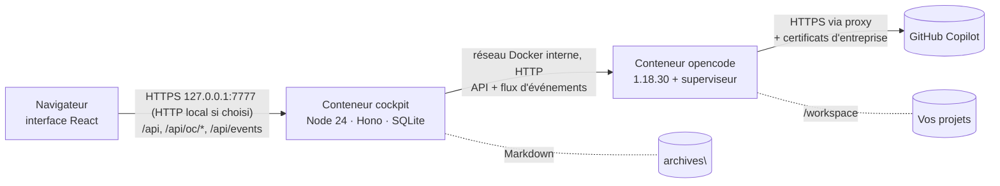

# Récapitulatif — opencode cockpit

> État au 28 septembre 2026. Ce document rassemble tout : ce qui a été construit, d'où vient l'interface, où se trouvent les fichiers, comment installer et lancer les scripts au travail, ce qui a été vérifié, corrigé et testé, et ce qui reste à vérifier.

> **Où en est la publication ?**
> - La **version 1.1.0** est prête localement, **non publiée** (branche locale `chantier/1.1`, jamais poussée ; aucune étiquette). Elle réunit tout le chantier 1.1 : voir qui travaille, borner et arrêter, l'autonomie à la demande, la salle de contrôle et « Revoir », les équipes et la construction, l'onglet Fichiers, la Salle Oh My OpenAgent livrée coupée, et l'assistant qui ne va plus sur Internet (voir `docs/NOTES-1.1.0.md`). **La publier reste votre décision** : liste de publication et état des vérifications au [§10](#version-110--honnêteté-portes-et-publication-non-publiée).
> - La **version 1.0.6** est publiée le 25 septembre 2026 (étiquette `v1.0.6`, release avec les images GHCR `:1.0.6` et `:latest` et l'archive hors ligne). **C'est la dernière version publiée, donc celle à installer aujourd'hui.** Au travail, plus aucun appel vers un site autre que GitHub Copilot ne part vers le proxy de l'entreprise : opencode n'a plus d'accès direct au réseau, sa seule sortie est un relais du cockpit limité aux adresses Copilot, et tout le reste est refusé sur le poste. Elle corrige aussi une faille liée aux noms de dossiers de projets (voir [section 9](#9-ce-qui-a-été-fait-étape-par-étape) et `docs/NOTES-1.0.6.md`). **Défaut connu de la 1.0.6 publiée** : sous Windows PowerShell 5.1, ses `.\cockpit.ps1 backup` et `restore` échouent toujours, avant tout arrêt (le compose porte `HTTP_PROXY` et `http_proxy`, que `ConvertFrom-Json` refuse) ; corrigé en 1.1.0, qui demande de refaire une sauvegarde après la mise à jour.
> - La **version 1.0.5**, publiée sur GitHub le 18 septembre 2026 (étiquette `v1.0.5`), apporte le HTTPS local par défaut (certificat auto-signé créé par le cockpit, avertissement du navigateur au premier accès, jamais approuvé dans Windows), mode HTTP local explicite (`install.ps1 -Http`, confirmation tapée, bandeau permanent), vérification du cockpit avant toute ouverture (empreinte du certificat, preuve du jeton, lien de connexion à usage unique), vérification du poste avant de passer en HTTPS, et retour arrière par `cockpit.ps1 rollback`.
> - La **version 1.0.4**, publiée le 15 septembre 2026, refuse les demandes facturées tant qu'opencode est injoignable, redémarre ou n'a pas vérifié l'adresse de l'API Copilot, y compris au démarrage du cockpit.
> - La **version 1.0.3**, publiée le 14 septembre 2026 avec les images GHCR et l'archive hors ligne, vérifie l'adresse de l'API Copilot dans l'état réel d'opencode et la revérifie après chaque redémarrage.
> - La **version 1.0.2**, publiée le même jour, applique réellement les profils de permissions, « Revenir au profil Prudent » et le fichier brut de configuration, par un redémarrage d'opencode (défaut présent depuis la 1.0.0).
> - La **version 1.0.1**, publiée le même jour, apporte le réseau d'entreprise à routage par abonnement Copilot, les IA du compte lues directement chez GitHub et affichées disponibles ou non, l'interface démarrée même sans opencode et `cockpit.ps1 diag`.
> - La **version 1.0.0**, publiée le même jour, regroupe deux étapes de développement jamais publiées : **0.1.1**, les corrections du 13 septembre, et **0.2.0**, les assistants, les niveaux d'IA et le mode Simple (voir [section 9](#9-ce-qui-a-été-fait-étape-par-étape)). Ces numéros restent cités plus bas pour retracer l'historique.
> - La **version 0.1.0**, publiée le 13 septembre, contient les défauts corrigés depuis : ne plus l'installer.

> **Chantier 1.1, version 1.1.0, état au 28 septembre 2026 : non publiée.** Toutes les branches du chantier sont réunies sur `chantier/1.1` par la grande fusion (salle, salle de contrôle 3D, « 3s », équipes, construction, onglet « Salle OMO » de la carte, migration du web, croisements, onglet Fichiers), et le numéro de version est posé (étape 27 de la [section 9](#9-ce-qui-a-été-fait-étape-par-étape)). Faits : la répétition générale de la grande fusion (banc de bout en bout `--faux` complet 61/61, `--salle`, `--gardes`, banc réel hors ligne, `--volume-1-0-6`, répétition D11, T8, T9 sur quatre volumes ; puis, sur `1c4e443`, `npm test` sous Windows et sous Linux, tableau d'honnêteté et T9 sans cale), la revue F2 (verte, 5 942 tests), puis, le 28 septembre, le `/security-review` complet et la revue adversariale de publication, avec leurs corrections (voir le [§10](#version-110--honnêteté-portes-et-publication-non-publiée)). Votre accord de publication est donné depuis le 28 septembre, sous conditions ; ont suivi la refonte du README (README court, guide `docs/GUIDE.md`, `docs/DEVELOPPEMENT.md`) et les correctifs de la mesure réseau ([section 8](#8-sécurité)). Les recettes sur GitHub Copilot réel restent en attente : les notes de version disent qu'elles n'ont pas été faites. Les paragraphes datés ci-dessous gardent l'état de chaque étape.

<!-- [salle] début : état de la Salle Oh My OpenAgent (DOC-OMO, itération 2 ter) -->
> **Chantier 1.1, Salle Oh My OpenAgent (itérations 2 bis et 2 ter), état au 26 septembre 2026 : non publiée, livrée coupée.** Le code de la salle est intégré dans sa branche de chantier : image `opencode-omo` construite sur le PC personnel et jamais publiée, installation par archive vérifiée, montages inversés qui gardent tous les dépôts git du dossier de travail en lecture seule, superviseur à homme mort, proxy de sortie limité à l'API Copilot, activation confirmée à chaque demande avec un montant saisi, répondeur et interdits absolus, filet de garde, plafonds, détections après coup, relance à neuf, page de la salle, Diagnostic et Journal. Elle reste **coupée par le code** (`SALLE_OUVERTE = false`) : aucune variable d'environnement ne l'ouvre. Les portes du banc complet de la vague 5 (arrêt, plafonds, interdits, dépôts piégés, actions hors contrôle, homme mort avec le cockpit réel) sont vertes hors ligne, deux d'entre elles partielles, et la délégation de l'extension échoue encore dans la salle (voir le [§11](#salle-oh-my-openagent--recettes-en-attente-errata-et-limites-non-publiée)). Avant toute mise en service restent : cette délégation, la revue de l'itération 2 ter avec `/security-review`, puis la [procédure de mise en service](#mettre-la-salle-oh-my-openagent-en-service-11-non-publiée) et ses recettes sur GitHub Copilot réel, dont **aucune n'a été lancée**. Détails dans les sections [3](#3-où-sont-les-fichiers), [6](#6-utiliser-linterface), [8](#8-sécurité), [9](#9-ce-qui-a-été-fait-étape-par-étape), [10](#10-validations-réalisées), [11](#11-limites-et-points-à-vérifier), [12](#12-dépannage) et [13](#13-référence--fichier-env) ; usage pas à pas dans le guide, [E-17](GUIDE.md#e-17-salle-oh-my-openagent-livrée-coupée) à [E-19](GUIDE.md#e-19-ce-que-la-salle-omo-ne-protège-pas), et dans le README, section [« Salle Oh My OpenAgent livrée coupée »](../README.md#salle-oh-my-openagent-livrée-coupée).
<!-- [salle] fin -->

> **Chantier 1.1, itération 2, état au 20 septembre 2026 : non publié.** La revue de l'itération 1 est verte depuis le 20 septembre. Le code de la deuxième itération, « autonomie contrôlée », est intégré : sélecteur à quatre choix et confirmation, activation gardée et interrupteur `COCKPIT_AUTONOMY`, règles de modification, porte déterministe des commandes, IA de contrôle, travail délégué en Autonome, plafonds et arrêts, « Passé sans contrôle », Journal du contrôle, bandeau, repères du Déroulé et Diagnostic. La porte interne qui tenait les deux choix automatiques fermés (`ACTIVATION_OUVERTE`) a été ouverte au train de la troisième vague, avec ses tests, et elle est ouverte à la date de ce document. Restent pour clore l'itération : la revue de l'itération 2, `/security-review`, les recettes facturées de la [section 11](#11-limites-et-points-à-vérifier) (aucune n'a été lancée) et l'intégration de la 1.0.5, qui lèvera l'écart D-05. Détails dans les sections [6](#6-utiliser-linterface), [8](#8-sécurité), [9](#9-ce-qui-a-été-fait-étape-par-étape), [10](#10-validations-réalisées), [11](#11-limites-et-points-à-vérifier) et [13](#13-référence--fichier-env).

> **Chantier 1.1, état au 19 septembre 2026 : non publié.** Le code de la première itération, « voir, borner, arrêter », est intégré : « Qui travaille ? », Déroulé, carte du travail en direct et démonstration, « Arrêter » sur toute la conversation, refus des fichiers de clés posé sur chaque conversation, « Plan d'abord », travail délégué refusé en mode Simple et détaillé en mode Avancé. Restent pour clore cette itération : relecture des corrections de la clôture (la revue globale et la vérification de la clôture ont été faites), `/security-review` et les recettes en attente de la [section 11](#11-limites-et-points-à-vérifier). Détails dans les sections [6](#6-utiliser-linterface), [8](#8-sécurité), [9](#9-ce-qui-a-été-fait-étape-par-étape) et [10](#10-validations-réalisées).

## Sommaire

1. [En bref](#1-en-bref)
2. [D'où vient l'interface ?](#2-doù-vient-linterface-)
3. [Où sont les fichiers](#3-où-sont-les-fichiers)
4. [Installer au travail, pas à pas](#4-installer-au-travail-pas-à-pas)
5. [Les scripts en détail](#5-les-scripts-en-détail)
6. [Utiliser l'interface](#6-utiliser-linterface)
7. [Comment ça marche](#7-comment-ça-marche)
8. [Sécurité](#8-sécurité)
9. [Ce qui a été fait, étape par étape](#9-ce-qui-a-été-fait-étape-par-étape)
10. [Validations réalisées](#10-validations-réalisées)
11. [Limites et points à vérifier](#11-limites-et-points-à-vérifier)
12. [Dépannage](#12-dépannage)
13. [Référence : fichier .env](#13-référence--fichier-env)
14. [Faire évoluer le projet](#14-faire-évoluer-le-projet)

---

## 1. En bref

**opencode cockpit** est un poste de pilotage web pour l'agent de code [opencode](https://opencode.ai). Il est pensé pour un poste de travail d'entreprise où seul **GitHub Copilot** est autorisé. Il ajoute à opencode :

- des **assistants** par tâche (analyser un incident, relire un script, préparer un CAB…), avec des droits limités et une IA fixée, installés depuis un catalogue ou créés en 5 écrans ;
- des **niveaux d'IA** (Rapide, Équilibré, Expert) reliés aux IA du compte Copilot de chacun, avec le coût estimé d'une demande avant l'envoi ;
- un **mode Simple** par défaut pour les collègues peu familiers de l'IA (règles d'or, réglages risqués masqués), et un **mode Avancé** ;
- un **chat** visuel : appels d'outils, diffs, autorisations, travail délégué ;
- un **studio** (mode Avancé) pour créer agents, skills et commandes ;
- des **archives** classées automatiquement par type de conversation ;
- un **suivi des coûts** Copilot face à un budget mensuel (150 $ par défaut).

| Élément | Où |
|---|---|
| Dépôt GitHub (public) | https://github.com/Calgar50/opencode-cockpit |
| Dernière release publiée : 1.0.6 | https://github.com/Calgar50/opencode-cockpit/releases/tag/v1.0.6 |
| Archive d'images hors ligne 1.0.6 | `opencode-cockpit-images-1.0.6.tar.gz` et son `.sha256`, dans la release |
| Images Docker 1.0.6 | `ghcr.io/calgar50/opencode-cockpit-opencode:1.0.6` et `ghcr.io/calgar50/opencode-cockpit-app:1.0.6` (aussi `:latest`) |
| Version 1.1.0 | prête localement, **non publiée** : voir le [§10](#version-110--honnêteté-portes-et-publication-non-publiée) |
| Release 0.1.0 (ancienne, à ne plus installer) | https://github.com/Calgar50/opencode-cockpit/releases/tag/v0.1.0 |
| Interface une fois installée | **https**://127.0.0.1:7777 (avertissement du navigateur au premier accès) ; http://127.0.0.1:7777 si le mode HTTP local a été choisi |
| CI (tests, build, audit) et release | GitHub Actions, onglet « Actions » du dépôt |

---

## 2. D'où vient l'interface ?

**Elle a été créée de zéro pour ce projet.** Ce n'est ni l'interface web intégrée d'opencode (`opencode web`), ni un modèle ou un thème existant.

### Ce qu'elle est

- Une application **React 19 + Vite 8**, écrite en **TypeScript**, dans `app/web/`.
- Elle est construite en fichiers statiques (`app/dist/web/`), puis servie par le serveur du cockpit (`app/server/`), qui tourne dans le conteneur « cockpit ».
- Elle ne parle **jamais directement** à opencode. Elle appelle l'API du cockpit (`/api/...`), qui relaie vers opencode une **liste blanche** de routes (`/api/oc/...`) et diffuse les événements en temps réel (`/api/events`).

### De quoi elle est faite

| Partie | Origine |
|---|---|
| Système de design (couleurs, thèmes clair et sombre, composants CSS) | Écrit à la main : `app/web/styles.css`. La palette des graphiques reprend une palette validée pour le daltonisme. |
| Icônes | Dessinées à la main en SVG : `app/web/components/Icon.tsx`, sans bibliothèque d'icônes |
| Graphiques des coûts | Codés à la main en SVG : `app/web/pages/costs/charts.tsx`, sans bibliothèque de graphiques |
| Rendu Markdown des réponses | `marked` + `DOMPurify` (nettoyage anti-XSS) |
| Coloration du code | `highlight.js` |
| Éditeurs de texte (agents, skills, configuration) | `CodeMirror 6` |
| Composants (boutons, modales, notifications…) | Écrits à la main : `app/web/components/ui.tsx`, `Toast.tsx` |

### Qui a écrit quoi

- **Fondations**, écrites directement par Claude : design, composants, client API, flux d'événements, routage, coquille avec navigation et connexion. Également les pages **Chat** et **Coûts**.
- Page **Archives** : écrite par un agent secondaire, sur un cahier des charges détaillé et avec interdiction de toucher aux fondations.
- Pages **Studio**, **Paramètres** et **Diagnostic** : écrites par un second agent secondaire, dans les mêmes conditions.
- **Contrôle de l'ensemble** par Claude : vérification de types, build, 24 captures d'écran (12 écrans × 2 thèmes), revues de sécurité.
- **Étape 0.2.0, publiée dans la 1.0.0** (assistants, niveaux d'IA, modes) : trois conceptions concurrentes rédigées par des agents secondaires, jugées puis fusionnées ; implémentation en lots parallèles sur un contrat d'interfaces commun ; intégration, tests, revue adversariale et captures par Claude (voir [section 9](#9-ce-qui-a-été-fait-étape-par-étape)).

### Et l'interface d'opencode ?

opencode possède sa propre interface web. Elle n'est **ni utilisée ni exposée** : le port d'opencode n'est pas publié hors de Docker, et le cockpit ne relaie que les routes d'API dont sa propre interface a besoin.

---

## 3. Où sont les fichiers

```text
opencode-cockpit\
├─ install.ps1              ← INSTALLATION (à lancer en premier, et pour mettre à jour)
├─ cockpit.ps1              ← USAGE QUOTIDIEN (open, restart, logs, backup, restore…)
├─ CockpitTls.ps1           ← vérification du cockpit et isolation de compose (utilisée par les deux scripts)
├─ README.md                ← porte d'entrée : installer, mettre à jour, premiers pas, pannes courantes
├─ docs\GUIDE.md            ← guide d'utilisation : procédures, fiches, pannes, explications
├─ docs\DEVELOPPEMENT.md    ← développer, tester, publier
├─ docs\RECAPITULATIF.md    ← ce document
├─ docs\NOTES-1.0.6.md      ← notes de version de la 1.0.6
├─ docs\NOTES-1.1.0.md      ← notes de version de la 1.1.0 (non publiée)
├─ VERSION                  ← numéro de version
├─ docker-compose.yml       ← définition des 2 conteneurs (ne pas modifier : tout passe par .env)
├─ .env.example             ← modèle de configuration
├─ .env                     ← CRÉÉ par install.ps1 : secrets et réglages (jamais versionné, jamais partagé)
│                             (le certificat HTTPS local, lui, est dans le volume Docker cockpit-tls,
│                              hors du dossier et hors des sauvegardes)
├─ certs\                   ← certificats d'entreprise (windows-trust.pem créé par install.ps1)
├─ archives\                ← CRÉÉ : conversations classées en Markdown
├─ backups\                 ← CRÉÉ par « cockpit.ps1 backup »
├─ docker\opencode\         ← image opencode : Dockerfile, superviseur, contrôle de santé, configuration par défaut,
│                             extension @opencode-ai/plugin préinstallée (plugin-seed\ et plugin-seed.mjs, 1.0.6)
├─ app\                     ← le cockpit
│  ├─ Dockerfile
│  ├─ server\               ← serveur Node (API, proxy, coûts, archives, studio, sécurité, relais de sortie d'opencode) et tests
│  └─ web\                  ← interface React (pages, composants, styles)
└─ .github\workflows\       ← ci.yml : types, tests, build, audit, images (push sur main et pull requests)
                               release.yml : images GHCR et archive hors ligne (tag v*)
```

> **Les deux scripts `install.ps1` et `cockpit.ps1` sont à la racine du dossier**, pas dans un sous-dossier. Ouvrez PowerShell *dans ce dossier* pour les lancer.

<!-- [salle] début : fichiers de la Salle Oh My OpenAgent (DOC-OMO) -->
**Chantier 1.1, Salle Oh My OpenAgent (non publiée).** Fichiers propres à la salle :

| Chemin | Rôle |
|---|---|
| `docker\opencode-omo\` | image de la salle : Dockerfile, configuration d'instance d'opencode (`opencode.jsonc`), configuration de l'extension (`omo.jsonc`, non appliquée par la 4.19.4 : voir l'[erratum A14](#salle-oh-my-openagent--recettes-en-attente-errata-et-limites-non-publiée)), superviseur, vérificateurs, fichier de verrouillage de l'extension, référence du manifeste (`omo-manifest.sha256`), contrat machine (`contrat-salle.json`), filet de garde (`guard\cockpit-guard.js`) |
| `scripts\build-omo-image.ps1` | construction de l'image sur le PC personnel, jamais par la CI |
| `docs\omo-audit-4.19.4.md` | audit humain de l'extension : outils, crochets, agents, appels réseau et écritures connus |
| `e2e\omo-banc\` | banc de la salle, hors ligne et complet ; les portes G5 à G9 et G13 de la vague 5 (L27a, L27b) dans `portes\`, le corpus de G7 dans `corpus\` |
| `e2e\scenarios\omo-ui-salle.mjs` | scénario de l'interface de la salle, sur une salle FACTICE (`scripts/run-e2e.sh --faux --salle`) : treize étapes (douze de la salle, plus « revoir-simple » de la répétition générale « 3s »), au clavier seul là où il le faut |
| `docker-compose.omo-projets.yml`, `omo-projets.json` | CRÉÉS par `install.ps1` : projets préparés, dépôts protégés, entrées de premier niveau ouvertes en écriture. Jamais versionnés ; ne pas les modifier à la main |
<!-- [salle] fin -->

---

## 4. Installer au travail, pas à pas

### Avant de commencer : vérifier avec la DSI

- **Docker Desktop :**
  - il n'est gratuit que pour les structures de moins de 250 salariés **et** de moins de 10 M$ de chiffre d'affaires annuel ; au-delà, un abonnement Docker est nécessaire ;
  - son installation demande les droits administrateur, WSL 2 et la virtualisation activée dans le BIOS.
- **GitHub Copilot :**
  - un abonnement Pro, Pro+, Business ou Enterprise est nécessaire ;
  - l'administrateur peut restreindre les modèles disponibles ou l'usage d'un client tiers comme opencode.
- **Windows PowerShell 5.1** ou plus récent : présent d'office sous Windows.

**Test rapide de Docker :** `docker run --rm hello-world`. S'il échoue au téléchargement, Docker Desktop n'atteint pas Docker Hub. Deux solutions :

- régler le proxy dans **Docker Desktop › Settings › Resources › Proxies** ;
- ou installer directement avec l'archive hors ligne (`-Mode Load`, voir plus bas).

`install.ps1 -Proxy` configure les conteneurs et la construction des images (npm, apt), mais pas les téléchargements faits par Docker Desktop lui-même : l'image de base en mode Build et les images GHCR en `-Mode Pull` passent par son propre réglage de proxy.

### Étapes

1. **Récupérer le projet**, au choix :
   - `git clone https://github.com/Calgar50/opencode-cockpit.git` ;
   - ou, sur la page du dépôt : **Code › Download ZIP**, puis extraire.

   Placez le dossier par exemple dans `C:\outils\opencode-cockpit`, **en dehors** du dossier de vos projets : `install.ps1` refuse que l'un contienne l'autre.
2. **Démarrer Docker Desktop** et attendre qu'il soit prêt.
3. **Ouvrir PowerShell dans le dossier du projet :**
   ```powershell
   cd C:\outils\opencode-cockpit
   ```
4. **Si vous avez pris le ZIP**, débloquer les scripts téléchargés :
   ```powershell
   Unblock-File .\install.ps1, .\cockpit.ps1, .\CockpitTls.ps1
   ```
5. **Lancer l'installation** en indiquant le dossier qui contient vos projets (voir le choix du dossier juste après) :
   ```powershell
   .\install.ps1 -WorkspaceDir C:\chemin\vers\mes\projets
   ```
   - Si PowerShell refuse d'exécuter le script (stratégie d'exécution) :
     ```powershell
     powershell -ExecutionPolicy Bypass -File .\install.ps1 -WorkspaceDir C:\chemin\vers\mes\projets
     ```
     Si la stratégie est imposée par la DSI, cela peut rester bloqué : demandez l'autorisation.
   - La première construction des images prend quelques minutes.
6. **Le navigateur s'ouvre sur un avertissement de certificat** (« Votre connexion n'est pas privée ») : c'est attendu en HTTPS local. Comparez l'empreinte affichée par le script avec celle du certificat présenté, puis **Avancé › Continuer vers 127.0.0.1 (non sécurisé)**. Vous êtes alors **connecté au cockpit**, sans rien saisir. Si le cockpit ne répond pas dans les 4 minutes, le script affiche un avertissement : consultez `.\cockpit.ps1 logs`, puis lancez `.\cockpit.ps1 open`.

   *Poste où Edge ne propose pas « Continuer » :* le script s'arrête **avant toute modification** et affiche deux issues : demander l'exception `SSLErrorOverrideAllowedForOrigins = https://127.0.0.1:7777` à l'informatique, ou choisir le mode HTTP local (`.\install.ps1 -Http`, confirmation `HTTP EN CLAIR`). Pour le savoir à l'avance, sans rien modifier : `.\install.ps1 -TlsPreflight`.

   Acceptez ensuite les 6 règles d'or de la fenêtre « Avant de commencer » (case « J'ai lu ces règles et je les appliquerai. », puis **Commencer**), puis allez dans **Paramètres › Connexion › Connecter**. Le cockpit affiche un code :
   - cliquez **Copier le code**, puis **Ouvrir GitHub** ;
   - collez le code sur la page GitHub et autorisez l'accès ;
   - revenez au cockpit : la connexion se termine toute seule. Le code expire au bout d'environ 15 minutes.
7. C'est prêt : **Assistants** pour installer les assistants du catalogue, puis **Chat › Nouvelle conversation**.

### Choisir le dossier des projets

Indiquez le dossier **parent** de vos dépôts, par exemple `C:\dev`, qui contient `C:\dev\api` et `C:\dev\front`. N'indiquez pas un dépôt précis : ses sous-dossiers (`src`, `docs`…) deviendraient autant de « projets ».

- Chaque sous-dossier de premier niveau apparaît comme un projet dans le Chat, avec l'entrée « Tout le workspace » (300 dossiers au maximum).
- Les dossiers masqués (`.xxx`), `node_modules` et `__pycache__` sont ignorés.
- Un dépôt cloné plus tard apparaît sans réinstallation.
- L'agent ne voit **que** ce dossier.
- Sans `-WorkspaceDir`, le script propose `%USERPROFILE%\source\repos` et peut créer le dossier.
- Un dossier trop large (racine d'un lecteur, profil utilisateur, dossier Windows) demande une confirmation ; sans elle, l'installation est annulée.
- Pour changer de dossier plus tard : `.\install.ps1 -WorkspaceDir <nouveau dossier>`.

### Variantes selon le réseau de l'entreprise

| Situation | Solution |
|---|---|
| La construction échoue : Docker Hub, npm ou dépôts Debian bloqués | Télécharger l'archive d'images de la release depuis le navigateur, puis `.\install.ps1 -Mode Load -ImagesArchive .\opencode-cockpit-images-<version>.tar.gz` |
| Vérifier l'archive avant de la charger | `(Get-FileHash .\opencode-cockpit-images-<version>.tar.gz -Algorithm SHA256).Hash`, à comparer au fichier `.sha256` |
| `ghcr.io` joignable | `.\install.ps1 -Mode Pull`. Les images sont publiques : ni compte ni `docker login` (vérifié le 13/09/2026 pour la 0.1.0). |
| Le proxy n'est pas détecté | `.\install.ps1 -Proxy http://proxy.entreprise:8080` |
| Les conteneurs doivent se connecter sans proxy alors que Windows en déclare un | `.\install.ps1 -Proxy ''` : connexion directe, choix mémorisé |
| Erreur de certificat (`SELF_SIGNED_CERT_IN_CHAIN`) **à l'usage** | `.\cockpit.ps1 certs`. Sinon, déposer le certificat racine du proxy dans `certs\` puis `.\cockpit.ps1 restart` (détails ci-dessous). |
| Erreur de certificat **pendant la construction** des images | Déposer le certificat dans `certs\` puis relancer `.\install.ps1` (les certificats sont intégrés aux images lors de leur construction), ou passer en `-Mode Load` |
| Rien d'autre ne fonctionne pour les certificats | **Dernier recours :** `.\install.ps1 -InsecureTls`. La vérification TLS est désactivée, un bandeau rouge le rappelle, et le réglage est mémorisé. `.\install.ps1 -SecureTls` la réactive. |
| Chaque demande échoue (`AI_APICallError`, `Unable to connect`, `Forbidden`) et des IA désactivées par l'organisation apparaissent : le pare-feu n'ouvre que l'adresse de l'abonnement Copilot | 1.0.1 : le cockpit prend de lui-même l'adresse que GitHub annonce pour l'abonnement quand l'adresse générale est bloquée. Pour l'imposer : `.\install.ps1 -CopilotApiUrl https://api.business.githubcopilot.com -NoBrowser` (ou `api.enterprise.githubcopilot.com`). Vérifier : **Diagnostic › Tester la connexion Copilot**. |
| Démarrage bloqué sur « Starting », journal d'opencode vide | 1.0.1 : `.\cockpit.ps1 diag` (état des conteneurs, accès réseau testés depuis opencode, journal). L'interface démarre même quand opencode ne répond pas. |
| Edge ne propose pas « Continuer » sur l'avertissement de certificat de `127.0.0.1` | 1.0.5 : demander à l'informatique l'exception Edge `SSLErrorOverrideAllowedForOrigins = https://127.0.0.1:7777`, puis `.\install.ps1`. Sinon : `.\install.ps1 -Http` (mode HTTP local, confirmation demandée, trafic en clair sur ce PC). Pour vérifier avant d'installer, sans rien modifier : `.\install.ps1 -TlsPreflight`. |

**Ajouter un certificat d'entreprise à la main :**

- Format : texte PEM (le fichier commence par `-----BEGIN CERTIFICATE-----`), extension `.pem` ou `.crt` uniquement.
- Un `.cer` binaire se convertit : `certutil -encode .\racine.cer .\certs\racine.pem`.
- `.\cockpit.ps1 certs` ne réécrit que `certs\windows-trust.pem` : vos fichiers ajoutés sont conservés.
- **Diagnostic › Réseau et sécurité** affiche le nombre de fichiers de certificats chargés par le conteneur opencode et l'état de la vérification TLS. Le serveur du cockpit (1.0.1) note dans son journal les certificats qu'il charge et ceux qu'il ignore.
- Ces certificats servent au conteneur opencode, à la construction des images et, depuis la 1.0.1, au serveur du cockpit (liste des IA et solde lus chez GitHub). Ils ne concernent que le trafic **sortant** : ne jamais placer dans `certs\` le certificat ni la clé du cockpit lui-même (ils sont dans le volume `cockpit-tls`, voir [section 8](#8-sécurité)).

### Mettre à jour

`.\cockpit.ps1 update` récupère la dernière version (`git pull`), puis relance `install.ps1` **dans le mode mémorisé** :

| Mode | Effet de `update` |
|---|---|
| Build | Les images sont reconstruites sur le poste. |
| Pull | Les images de la nouvelle version sont téléchargées depuis GHCR. |
| Load | Sans nouvelle archive, les images déjà chargées sont gardées, avec un avertissement si leur version diffère. Pour les mettre à jour : télécharger l'archive de la nouvelle version, puis `.\install.ps1 -Mode Load -ImagesArchive <archive>`. |

- **Dossier obtenu par ZIP** (pas de git) : `update` affiche un avertissement et s'arrête. Remplacez les fichiers par ceux de la nouvelle version sans toucher à `.env`, `certs\`, `archives\` ni `backups\`, puis lancez `.\install.ps1`.
- **Mise à jour vers la 1.1.0** (non publiée) : l'assistant ne va plus sur Internet.
  1. `.\cockpit.ps1 update`, comme d'habitude. Depuis la 1.0.5 ou la 1.0.6 : même mode d'accès (HTTP reste HTTP, HTTPS reste HTTPS), aucune reconnexion. Depuis une version antérieure à la 1.0.5 : lire d'abord [P-07](GUIDE.md#p-07-mettre-à-jour-depuis-une-version-antérieure-à-la-105) dans le guide (passage en HTTPS, nouveau jeton, une reconnexion). Le mot de passe interne d'opencode n'est renouvelé qu'en venant d'une version antérieure à la 1.0.6 (décision D13).
  2. **Internet est fermé tout seul pendant la mise à jour.** Les profils Prudent, Équilibré et Sans confirmation gardent leur nom ; seul l'accès à Internet passe à « refusé ». Pour des règles personnalisées, seules les valeurs « ask » de `webfetch` et `websearch` deviennent « deny ». Ce passage est **rejoué à chaque mise à jour et à chaque restauration** : un « ask » remis à la main repassera à « deny ». L'ancien fichier est gardé à côté (`opencode.jsonc.avant-1.1.0`, dans le volume `oc-config`, compris dans `.\cockpit.ps1 backup`). Les cas laissés tels quels sont annoncés par l'installateur et signalés dans **Paramètres › Sécurité** : pour un profil d'une version précédente, il propose « Fermer l'accès à Internet » (profil gardé) ; pour une règle générale personnalisée qui demande encore Internet, « Revenir au profil Prudent » la ferme mais remplace aussi vos autres règles (en mode Avancé, **Paramètres › opencode** permet de ne fermer qu'Internet). Avec `-NoStart`, les règles ne sont mises à jour que si opencode est arrêté.
  3. Les assistants créés dans le cockpit ne sont pas modifiés : ceux qui avaient « Consulter Internet » sont signalés, et les ouvrir puis **Enregistrer** ferme Internet pour eux. Seuls les agents déclarés dans la configuration générale d'opencode (`agent.<nom>`, `mode.<nom>`) ont eu leurs règles Internet fermées.
  4. **Mode Load :** l'archive 1.1.0 est obligatoire ; avec des images 1.0.6, `install.ps1` s'arrête avant toute modification (D13).
  5. Retour arrière : `docs/NOTES-1.1.0.md`.
- **Mise à jour vers la 1.0.6** : même mode d'accès (HTTP reste HTTP, HTTPS reste HTTPS), aucune reconnexion ; le mot de passe interne d'opencode est remplacé une fois ; en mode Load, l'archive 1.0.6 est exigée (les images 1.0.5 n'ont pas le relais). Notes : `docs/NOTES-1.0.6.md`.
- **Installation faite en 0.1.0** : le mode n'était pas mémorisé. Si `.env` désigne des images publiées (`ghcr.io/...`, installation faite en Pull ou en Load), la 1.0.0 réutilise les images **0.1.0** déjà présentes, sans rien construire ni télécharger, et le signale à chaque passage : leurs correctifs ne sont donc pas actifs. Lancez une fois `.\install.ps1 -Mode Pull` (GHCR joignable) ou `.\install.ps1 -Mode Load -ImagesArchive <archive 1.0.0>` : ce mode est ensuite mémorisé.
- **Permissions d'opencode** : la configuration par défaut n'est posée qu'au premier démarrage. Une installation existante garde ses anciennes règles (exception : depuis la 1.1.0, les règles Internet sont mises à jour par `install.ps1` et `cockpit.ps1 restore`), qui autorisaient d'office `git status`, `git diff`, `git log`, `git show`, `git branch` et `ls`, des commandes détournables (voir [section 8](#8-sécurité)). Pour passer aux règles actuelles : **Paramètres › Sécurité › Revenir au profil Prudent** (en mode Avancé : **Paramètres › opencode › Permissions globales › Prudent › Appliquer**). Les agents créés depuis les anciens modèles « relecteur sécurité » ou « architecte » gardent aussi leurs règles : passez leur shell à « demander » ou « refuser » dans le Studio (mode Avancé).
- **Installation 0.1.0, nouveautés de la 1.0.0** : rien n'est réécrit.
  - Au premier affichage, la fenêtre des règles d'or s'ouvre, puis l'interface passe en **mode Simple** (le mode Avancé se choisit dans **Paramètres › Affichage**). Depuis la 1.1.0, la notice de la 1.0 (« Passer en mode Avancé », liste des agents et de leur IA) est remplacée par l'annonce de la 1.1.0, avec [Voir la carte] et [Compris], affichée une fois dans le chat et dans **Assistants**.
  - Les agents principaux existants apparaissent dans **Assistants** avec l'état « À compléter ». « Compléter » reprend leur nom, déduit le niveau quand leur IA correspond à un niveau, et marque les droits « Personnalisé » s'ils ne correspondent à aucun profil.
  - **Changement de comportement :** l'IA écrite dans un agent est désormais vraiment utilisée dans le chat (en 0.1.x, le sélecteur du chat l'emportait) : c'est elle qui est facturée. Ces agents sont listés dans **Assistants**, section « À compléter », avec leur IA : vérifiez-la là, avant de vous en servir. La réflexion (« variante ») écrite dans un raccourci non délégué est aussi appliquée.

<!-- [salle] début : procédure de mise en service de la Salle Oh My OpenAgent (DOC-OMO) -->
### Mettre la Salle Oh My OpenAgent en service (1.1, non publiée)

> Rien de ce qui suit n'est fait aujourd'hui. C'est la procédure que devra suivre la version qui ouvrira la salle ; la salle livrée reste coupée.

La mise en service est une **décision humaine**, jamais un réglage. La spécification (§7.6, l.1163) la résume ainsi : image chargée au travail par `install.ps1 -OmoArchive`, recettes G3, G4, G10 et G11 sur Copilot réel, puis `COCKPIT_OMO=on`. Le chantier y ajoute la coupure par le code et une version dédiée (plan des itérations 2 bis et 2 ter, §2.7). Dans cet ordre :

1. **Portes hors ligne vertes** sur le banc local, avec la vraie salle et leur preuve consignée au [§10](#chantier-11-salle-oh-my-openagent--portes-et-preuves-non-publiée) : **G1, G2, G5, G6, G7, G8, G9, G12, G13 et G14** (G6 ajoutée à la liste de la spécification : erratum R5 au [§11](#salle-oh-my-openagent--recettes-en-attente-errata-et-limites-non-publiée)). Un banc de la salle, ce sont deux exécutions obligatoires : le banc hors ligne avec de vrais dépôts, puis le banc complet avec le cockpit réel ([`e2e/omo-banc/README.md`](../e2e/omo-banc/README.md#21-deux-exécutions-obligatoires)).
2. **Décision humaine consignée** dans ce récapitulatif : qui décide, à quelle date, sur quelle tête de branche, au vu de quels résultats. Rien ne change dans le code avant elle.
3. **Version dédiée** où `SALLE_OUVERTE` passe à `true` dans `app/server/wiring-11.ts`, par un commit à part, relu, qui met à jour dans le même temps les tests gardant aujourd'hui la valeur `false`. **Jamais par une variable d'environnement**, ni par une option de ligne de commande : une salle qui s'ouvrirait par `.env` pourrait s'ouvrir par erreur.
4. **Recettes sur GitHub Copilot réel**, sur un poste de recette où cette version est installée avec l'image chargée par `install.ps1 -OmoArchive` et `COCKPIT_OMO=on`, un montant étant saisi pour chaque demande : **G3, G4, G10 et G11**, avec les parties « puis recette » de G1 et G5 et la mesure M20 réelle (liste et contenu au [§11](#salle-oh-my-openagent--recettes-en-attente-errata-et-limites-non-publiée)). Si G3, G4, G5, G12 ou G13 échoue sans correctif, la salle reste coupée (repli C de la spécification, §7.8).
5. **Puis seulement**, au travail : `COCKPIT_OMO=on` dans `.env`, et `.\cockpit.ps1 restart`.
<!-- [salle] fin -->

---

## 5. Les scripts en détail

### `install.ps1`

| Paramètre | Rôle | Valeur par défaut |
|---|---|---|
| `-WorkspaceDir` | Dossier des projets, monté dans les conteneurs sous `/workspace` | valeur de `.env`, sinon demandé |
| `-Port` | Port local de l'interface | valeur de `.env`, sinon `7777` |
| `-Mode` | `Build` (construit les images), `Pull` (télécharge depuis GHCR), `Load` (charge une archive) | mode mémorisé dans `.env` ; sinon `Load`, sans le mémoriser, si `.env` désigne déjà des images publiées (installation 0.1.0) ; sinon `Build` |
| `-ImagesArchive` | Archive d'images pour `-Mode Load` | facultatif lors d'une relance : les images déjà chargées sont réutilisées |
| `-ImageRegistry` | Registre pour `-Mode Pull` | `ghcr.io/calgar50` ; mémorisé seulement s'il est passé |
| `-Proxy` | Proxy d'entreprise (URL) | valeur de `.env`, sinon variable `HTTPS_PROXY`, sinon proxy système Windows (script PAC compris). `-Proxy ''` : connexion directe, mémorisée jusqu'à un nouveau `-Proxy <url>` ou un proxy saisi dans `.env`. |
| `-NoProxy` | Exceptions supplémentaires au proxy | valeur de `.env`, sinon vide. `localhost`, `127.0.0.1`, `::1`, `opencode` et `cockpit` sont toujours ajoutés dans les conteneurs. |
| `-SkipCertificates` | Ne pas exporter les certificats Windows | export activé |
| `-InsecureTls` | Désactiver la vérification TLS (secours) ; mémorisé | — |
| `-SecureTls` | Réactiver la vérification TLS | — |
| `-NoStart` | Préparer sans démarrer les conteneurs | — |
| `-NoBrowser` | Ne pas ouvrir le navigateur à la fin | — |
| `-TlsPreflight` | Vérifier le poste (stratégie du navigateur, `curl.exe`, voie de vérification) **sans rien modifier** et sans Docker, puis s'arrêter | — |
| `-AcceptBrowserBlock` | Passer outre la garde du navigateur pour une entrée en HTTPS, quand `edge://policy` montre que la lecture du registre se trompe. Non mémorisé. | — |
| `-Http` | Mode HTTP local : le cockpit est servi en `http://127.0.0.1:<port>`. Confirmation `HTTP EN CLAIR` demandée, choix mémorisé dans `.env` avec sa date. | — |
| `-Https` | Retour en HTTPS. Nouveau jeton (l'ancien a circulé en clair), reconnexion nécessaire. | mode par défaut |

**Ce que fait le script, dans l'ordre :**

1. Vérifie que Docker et Docker Compose répondent ; depuis la 1.1.0, Docker Compose 2.8 ou plus récent est exigé (option `up --pull`), avant toute modification.
2. Lit `.env` s'il existe et reprend le mode d'installation mémorisé. Pour un `.env` de la 0.1.0, sans mode : réutilise les images publiées qu'il désigne (mode Load, non mémorisé), sinon `Build`.
3. **Pré-contrôles, avant toute modification** : mode d'accès inscrit dans `.env`, images du mode Load, garde du navigateur pour une entrée en HTTPS (installation neuve, passage depuis une version antérieure à la 1.0.5, `-Https`), et, depuis la 1.1.0, proxy donné par un nom court, développé en nom complet par le DNS de Windows. Tout ce qui bloque est affiché en **un seul message**, suivi d'un seul arrêt : `.env`, images et conteneurs sont alors inchangés. Puis, avec `-Http`, la confirmation `HTTP EN CLAIR`.
4. Détermine le dossier des projets (paramètre, `.env` ou question), propose de le créer, et demande confirmation s'il est trop large.
5. Prépare la configuration en mémoire :
   - port, mode d'accès et date de confirmation du mode HTTP ;
   - secrets aléatoires de 64 caractères, conservés s'ils existent. Le jeton est **remplacé** à la sortie du mode HTTP local, au passage depuis une version antérieure à la 1.0.5, et s'il n'a pas le format généré ;
   - proxy, TLS, fuseau horaire. Depuis la 1.1.0, un proxy donné par un nom court (sans point) est remplacé par le nom complet trouvé à l'étape 3 : le cockpit ne transmet plus aucun nom sans point au DNS de l'entreprise, et ne le résoudrait pas.
6. Exporte les autorités de certification de confiance de Windows (hors certificats expirés) vers `certs\windows-trust.pem`, sauf avec `-SkipCertificates`.
7. Crée `archives\`. En mode Load avec archive, charge les images (`docker load`).
8. Écrit `.env` et restreint ses droits à votre compte Windows. Si le script s'arrête avant cette étape, `.env` n'est ni créé ni modifié.
9. Construit (Build) ou télécharge (Pull) les images. En cas d'échec, `.env` retrouve les images précédentes, pour que `start` et `restart` continuent de fonctionner.
10. Sauf avec `-NoStart` : prépare les volumes (donnés à l'utilisateur des conteneurs, volume `cockpit-tls` du certificat local compris), met à jour les règles Internet d'opencode (1.1.0), puis démarre. La mise à jour des règles se fait opencode arrêté, par un conteneur jetable de l'image du cockpit (aucun réseau, aucune variable, système de fichiers en lecture seule) ; elle n'est jamais bloquante, et l'installateur annonce ce qu'il n'a pas pu faire. Avec `-NoStart`, elle n'a lieu que si opencode est arrêté. Depuis la 1.1.0, ce démarrage (`up --pull never --no-build`) ne télécharge ni ne construit aucune image : seuls les modes Pull et Build, à l'étape 9, le font.
11. Attend que le cockpit réponde avec le mode attendu et la preuve du jeton — et, en HTTPS, l'empreinte du certificat épinglée — jusqu'à 4 minutes. S'il répond, affiche l'empreinte et ouvre `https://127.0.0.1:<port>` (ou `http://…` en mode HTTP local) avec un **lien de connexion à usage unique** (port de `-Port` ou de `COCKPIT_PORT`, `7777` par défaut ; rien ne s'ouvre avec `-NoBrowser`). Sinon, affiche un avertissement qui renvoie vers `.\cockpit.ps1 logs`, puis s'arrête : lancez `.\cockpit.ps1 open` une fois le cockpit prêt.

Relancer `install.ps1` est sans danger : secrets, réglages, mode d'installation et mode d'accès sont conservés. Le passage depuis une version antérieure à la 1.0.5 affiche un bloc qui rappelle la nouvelle adresse, le nouveau jeton et le retour arrière possible — même avec `-NoBrowser`.

### `cockpit.ps1`

Toujours lancé depuis le dossier du projet : `.\cockpit.ps1 <commande>`.

| Commande | Effet |
|---|---|
| `open` | Vérifie le cockpit (empreinte du certificat en HTTPS, preuve du jeton dans les deux modes), puis ouvre l'interface déjà connectée. **Aucune page n'est ouverte si la vérification échoue.** |
| `start` | Démarre les conteneurs (applique aussi une modification de `.env`). Refuse un mode d'accès invalide dans `.env`. |
| `stop` | Arrête les conteneurs |
| `restart` | **Recrée** les conteneurs : relit `.env`, et `certs\` pour opencode. Garde le certificat HTTPS local, et applique `.env` seul : les variables du shell et un fichier `docker-compose.override.yml` sont ignorés. |
| `status` | État des conteneurs et du cockpit, mode d'accès, empreinte du certificat et jours restants avant son échéance |
| `logs` | Journaux en direct. `logs opencode` montre le journal complet d'opencode (superviseur et serveur) ; `logs cockpit` celui du cockpit. |
| `certs` | Réexporte les certificats Windows, puis recrée les conteneurs. Ne touche pas au certificat HTTPS du cockpit. |
| `tls` | Certificat HTTPS local servi (empreinte SHA-256, dates, noms couverts) et stratégie du navigateur. En mode HTTP local : rappelle qu'aucun certificat n'est servi. |
| `tls -Renew` | Après avoir tapé `RENOUVELER` : efface la clé et le certificat local, puis le cockpit crée une nouvelle paire à son redémarrage. Nouvelle empreinte, donc nouvel avertissement du navigateur. Le fichier d'informations publié (`cockpit-tls.json`, sans secret) reste : `tls` et la page Diagnostic affichent l'empreinte précédente. |
| `update` | `git pull`, puis `install.ps1` dans le mode mémorisé (le mode d'accès est repris tel quel). Dossier sans git : avertissement seulement. |
| `rollback` | Revient à la version **mémorisée**, après avoir tapé `REVENIR`. Depuis la 1.0.5, la 1.0.6 ou la 1.1.0, c'est celle d'avant la 1.0.5 (1.0.4 ou plus ancienne), servie en HTTP et sans le relais de la 1.0.6 : **jamais la 1.0.6**. Ne l'utilisez pas depuis la 1.0.6 ou la 1.1.0 (retour manuel à la 1.0.6 : `docs/NOTES-1.1.0.md`). Conditions : dépôt git propre, aucun commit local non publié, étiquette de la version cible présente. Remet dans `.env` les images, le mode d'installation et la version mémorisés, repositionne la branche sur l'étiquette sans jamais écraser un fichier, puis relance l'`install.ps1` de cette version. Sans git : affiche la marche à suivre. Retour limité aux scripts si les conteneurs sont restés dans l'ancienne version. |
| `backup` | Sauvegarde dans `backups\cockpit-AAAAMMJJ-HHMMSS.tar.gz` (détail ci-dessous) |
| `restore <fichier>` | Restaure une sauvegarde (détail ci-dessous) |
| `uninstall` | Supprime les conteneurs ; les données restent dans les volumes Docker |
| `uninstall -Purge` | Après avoir tapé `SUPPRIMER` : supprime aussi les volumes — dont `cockpit-tls`, le certificat HTTPS local, d'où un nouvel avertissement du navigateur à la réinstallation —, les images désignées dans `.env` (construites, téléchargées ou chargées) et les images construites sur ce poste. Les images de versions précédentes restent (`docker image ls`, puis `docker image rm`). `archives\`, `backups\`, `certs\` et `.env` sont conservés. |
| `help` | Aide |

### Sauvegarder et restaurer

**`backup`** arrête brièvement les conteneurs, crée l'archive, puis les redémarre. En 1.0.6, `backup` et `restore` échouent toujours sous Windows PowerShell 5.1, avant tout arrêt ; c'est corrigé en 1.1.0 (la configuration de Docker Compose est lue par `Read-CockpitComposeConfig`) : refaites une sauvegarde après la mise à jour.

| Contenu | Inclus ? |
|---|---|
| Volume `cockpit-data` : réglages, coûts, archives indexées | oui |
| Volume `oc-config` : configuration opencode, agents, skills, commandes | oui, sans `node_modules` |
| Volume `oc-data` : données d'opencode (sessions) | oui, **sans `auth.json`** (jeton GitHub Copilot) |
| Volume `oc-omo-data` : conversations de la Salle OMO (1.1) | oui, **sans `auth.json`** |
| Dossier `archives\` (exports Markdown) | oui |
| `.env`, `certs\` | non |
| Volume `cockpit-tls` (certificat HTTPS local et sa clé) | non |

**`restore <fichier>`**, par exemple `.\cockpit.ps1 restore .\backups\cockpit-20260913-180000.tar.gz` :

1. Un chemin relatif se lit depuis le dossier courant.
2. Le nom du fichier n'accepte que lettres, chiffres, point, tiret et souligné, avec l'extension `.tar.gz`.
3. L'archive est vérifiée **avant** tout arrêt : une archive illisible ne coupe pas le cockpit.
4. Vous tapez `RESTAURER` pour confirmer.
5. Les conteneurs sont arrêtés.
6. `cockpit-data`, `oc-config`, `oc-data` et `oc-omo-data` (salle, 1.1) sont vidés, sauf les jetons Copilot (`auth.json`), puis remplis depuis l'archive. `archives\` est complété : les fichiers absents de la sauvegarde restent, ceux qui portent le même nom sont remplacés par la version sauvegardée.
7. Les règles Internet de la sauvegarde sont mises à jour (1.1.0), comme à une mise à jour : seules les valeurs web changent, et une copie `.avant-1.1.0` est gardée. Rien n'est fait si l'extraction a échoué.
8. Les conteneurs redémarrent, **même si la restauration a échoué**.

Sur un nouveau poste : `.\install.ps1`, puis `restore`, puis **Paramètres › Connexion › Connecter**.

---

## 6. Utiliser l'interface

| Page | Ce qu'on y fait |
|---|---|
| **Chat** | Choisir le projet, puis un assistant (cartes d'accueil) ou l'Assistant général et son niveau d'IA. Écrire une demande : `@` joint un fichier, `/` lance un raccourci, on peut coller une image. L'IA qui va répondre et le coût estimé d'une demande sont affichés avant l'envoi ; l'IA d'un assistant ne se change pas depuis le chat. Rouvrir une conversation reprend l'assistant et le niveau enregistrés. Suivre la réponse en direct : réflexion, outils, diffs, sous-agents. Valider ou refuser les autorisations. Le panneau de droite montre le coût de la conversation, son classement, le plan de l'agent et les fichiers modifiés. |
| **Assistants** | Installer un assistant du catalogue, créer un assistant en 5 écrans, le modifier, compléter un agent créé avant la 1.0.0. Chaque assistant a une fiche d'identité : tâche, ce qu'il peut faire et ne fait jamais, IA, coût estimé, fiches. |
| **Coûts** | Dépense du mois face au budget, projection de fin de mois et date d'épuisement estimée. Dépense par jour, cumul, répartitions par modèle, catégorie, agent et projet. Conversations les plus coûteuses, export CSV. |
| **Archives** | Toutes les conversations classées, avec recherche plein texte et filtres (catégorie, période, projet, épinglées). Dans le détail : résumé, étiquettes et catégorie modifiables, transcription, bouton « Reclasser avec l'IA », export `.md`. |
| **Studio** (mode Avancé) | Agents, skills (avec fichiers annexes), commandes et `AGENTS.md`, plus une galerie de modèles prêts à l'emploi. Un sélecteur « Portée » propose « Global (tous les projets) » ou un projet (voir ci-dessous). |
| **Paramètres** | Onglets Connexion (Copilot), Niveaux d'IA, Budget (budget et garde-fou), Chat (valeurs par défaut), Affichage (mode Simple ou Avancé) et Sécurité (profil de droits, fournisseur d'IA). En mode Avancé seulement : Tarifs, Classement (catégories, modèle de classement) et opencode (modèles par défaut, fournisseurs, profils de permissions, fichier brut). |
| **Diagnostic** | État d'opencode et de son superviseur, flux d'événements, réseau et sécurité (proxy, TLS, certificats), catalogue des modèles. Journal d'opencode avec détection des erreurs connues. Boutons « Redémarrer opencode », « Rattraper l'historique » et « Recharger le catalogue ». |

### Modes Simple et Avancé

Une installation neuve s'ouvre en **mode Simple**. On change de mode dans **Paramètres › Affichage** ; le mode choisi est enregistré, et une mise à jour le garde.

| | Mode Simple (défaut) | Mode Avancé |
|---|---|---|
| Pages | Chat, Assistants, Coûts, Archives, Paramètres, Diagnostic | les mêmes, plus **Studio** |
| Paramètres | Connexion, Niveaux d'IA (consultation), Budget, Chat, Affichage, Sécurité | en plus : modification des niveaux d'IA, Tarifs, Classement, opencode |
| Réponse à une demande d'autorisation | « Autoriser une fois » ou « Refuser » | pareil : « Toujours autoriser » n'est jamais proposé (voir [section 8](#8-sécurité)) |
| Un message avec une autre IA que celle de l'assistant | impossible | possible pour un seul message, si l'option est activée |
| Travail que l'IA veut confier à un autre assistant (1.1) | refusé automatiquement, avec un message à l'IA ; avis « En mode Simple, l'IA ne délègue pas : elle continue seule. » (en « Autonome avec contrôle », un travail conforme, règles D1 à D7, part seul) | attend votre accord, avec la carte « Détails de la délégation » (en « Autonome avec contrôle », un travail conforme part seul) |

- **Règles d'or :** au premier lancement, et à chaque changement de leur texte, la fenêtre « Avant de commencer » bloque l'interface (ni Échap, ni clic à côté) jusqu'à la case « J'ai lu ces règles et je les appliquerai. » et le bouton **Commencer**. Le texte n'est pas modifiable depuis l'interface :
  1. Tout ce que vous écrivez ou joignez (texte, fichiers, sorties de commandes) est envoyé à GitHub Copilot, un service extérieur à la banque.
  2. Jamais de données clients : nom, numéro de compte, IBAN, numéro de carte, numéro client, adresse, e-mail, téléphone, montant rattaché à un client. Remplacez-les par des repères : CLIENT_1, IBAN_1, SERVEUR_A.
  3. Jamais de secrets : mots de passe, clés privées, jetons, chaînes de connexion, fichiers .pfx, .p12, .key, .jks, .env, kubeconfig, sorties de terraform plan non nettoyées.
  4. L'IA n'agit jamais sur la production. Elle propose ; vous vérifiez ; vous exécutez, selon la procédure habituelle.
  5. L'IA ne remplace ni la relecture par un collègue (principe des quatre yeux), ni le CAB.
  6. L'IA peut se tromper avec assurance : commandes ou options inventées, dates mal calculées, versions dépassées, failles récentes inconnues. Testez toujours hors production.
- **Bandeau permanent** sous la zone de saisie : « Avant d'envoyer : aucune donnée client, aucun mot de passe, aucune clé. Relisez toujours la réponse : l'IA peut se tromper. »
- **Paramètres › Sécurité** (consultation) : profil de droits d'opencode et fournisseur d'IA. Si le profil a été modifié en mode Avancé, un bouton ramène au profil Prudent. Depuis la 1.1.0, un profil d'une version précédente (Internet encore ouvert) propose « Fermer l'accès à Internet » : le profil est gardé, seul l'accès à Internet change ; les assistants qui peuvent encore demander Internet y sont signalés par leur titre. Une règle générale personnalisée qui le demande encore (joker « * » à « ask », permission en texte) y est signalée aussi, avec « Revenir au profil Prudent » (qui remplace aussi les autres règles) et, en mode Avancé, **Paramètres › opencode** (pré-publication 1.1.0).
- **Garde du serveur :** en mode Simple, le serveur refuse (« Action réservée au mode Avancé (Paramètres › Affichage). ») les écritures du Studio, de la configuration d'opencode et des niveaux d'IA, la remise à zéro des réglages autres que le budget, et tout réglage autre que le budget mensuel, les seuils d'alerte, l'affichage, le niveau et le dossier par défaut du chat. Elle évite les erreurs ; ce n'est pas une barrière de sécurité, puisque chacun peut passer en mode Avancé.

### Assistants et niveaux d'IA

**Vocabulaire.** En mode Simple, l'interface ne montre ni « agent », ni « skill », ni « commande », ni « modèle » :

| Dans l'interface | Pour opencode | En une phrase |
|---|---|---|
| **Assistant** | agent principal géré par le cockpit | Fait une tâche précise, avec des droits limités et une IA adaptée. |
| **Assistant général** | agent `build` | Pour les demandes qui ne correspondent à aucun assistant. Proposé, mais jamais présélectionné. |
| **Fiche** | skill | Une procédure ou une checklist que l'assistant consulte. Elle n'a pas d'IA à elle. |
| **Raccourci** (`/nom`) | commande | Un texte tout prêt, lancé en tapant `/nom` dans le chat. |
| **Niveau d'IA** | liste ordonnée de modèles | Rapide, Équilibré ou Expert. |
| **Réflexion** | variante du modèle | Plus de réflexion : réponses plus lentes et plus chères. |
| **Travail délégué** | sous-agent (`subtask`) | Un autre assistant travaille à part, puis l'IA de la conversation reprend la main. |

**Ce qu'est un assistant.** Un vrai fichier d'agent opencode (`agents/<nom>.md`, portée globale), plus une ligne dans la base du cockpit :

- le fichier ne contient que des clés connues d'opencode : `description`, `mode: primary`, `model`, `variant` éventuelle, `steps`, `color`, `permission`. opencode transmettrait au fournisseur toute clé inconnue ; le titre, le niveau, la taille de tâche et l'origine restent donc dans la base du cockpit ;
- ses consignes se terminent par un bloc « Règles communes (ajoutées par le cockpit) », délimité par des marqueurs pour ne jamais être dupliqué : signaler une donnée client ou un secret sans le recopier, écrire « À VÉRIFIER » plutôt qu'inventer, ne jamais donner de « feu vert » à la place d'un collègue ou du CAB.

**Deux profils de droits**, les seuls que peut produire l'assistant de création :

| | Lecture seule (défaut) | Propose, vous validez |
|---|---|---|
| Modifier un fichier (`edit`) | refusé | sur confirmation |
| Commande shell (`bash`) | refusé | sur confirmation |
| Déléguer (`task`) | refusé | refusé |
| Internet (`webfetch`, `websearch`) | refusé : Internet est fermé (la case « Consulter Internet » n'existe plus depuis la 1.1.0) | idem |
| Fiches (`skill`) | seulement les siennes | idem |
| Lecture (`read`) | fichiers de clés refusés (`.pfx`, `.p12`, `.key`, `.jks`, `.keystore`, `.kdbx`, clés SSH, kubeconfig…, en minuscules et en majuscules) ; `.env` sur confirmation | idem |
| Actions maximum (`steps`) | selon la taille de la tâche | idem |

- Aucune règle `"*"` générale dans `read` : les règles de l'agent passent en dernier chez opencode, et `"*": allow` annulerait la confirmation par défaut sur `.env`.
- `external_directory` n'est jamais touché : un refus casserait l'ouverture des fiches et les sorties d'outils tronquées.
- Toute autre combinaison, faite dans le Studio, s'affiche « Personnalisé », en rouge sur la fiche d'identité.

**Catalogue** (`app/server/assistants-catalogue.ts`, versionné) : six exemples, marqués « Exemple à relire avec votre équipe ».

| Assistant | Droits | Niveau | Taille | Fiches |
|---|---|---|---|---|
| Analyser un incident | Lecture seule | Équilibré | M | `anonymisation-donnees` |
| Relire un script avant mise en production | Lecture seule | Équilibré | M | `standards-scripts`, `anonymisation-donnees` |
| Préparer une demande de changement pour le CAB | Lecture seule | Expert | M | `checklist-cab` |
| Relire une requête SQL sur un réplica | Lecture seule | Équilibré | S | `requetes-sql-sures` |
| Expliquer une alerte de supervision | Lecture seule | Rapide | S | — |
| Rédiger ou mettre à jour un runbook | Propose, vous validez | Équilibré | M | — |

- Les trois nouvelles fiches (`anonymisation-donnees`, `standards-scripts`, `checklist-cab`) ont un contenu utilisable.
- L'installation ajoute les fiches manquantes sans jamais écraser une fiche existante, et ne crée pas de doublon si on la relance.

**Niveaux d'IA** (**Paramètres › Niveaux d'IA**) :

| Niveau | Recommandation livrée : IA préférée, puis IA de secours |
|---|---|
| Rapide | `github-copilot/gpt-5.4-mini` › `gpt-5-mini` › `claude-haiku-4.5` |
| Équilibré | `github-copilot/claude-sonnet-5` › `gpt-5.3-codex` › `claude-sonnet-4.6` |
| Expert | `github-copilot/claude-opus-5` › `claude-opus-4.8` › `gpt-5.6-sol` |

- **Choix :** la première IA du catalogue de **votre** compte Copilot, d'un fournisseur autorisé, capable d'utiliser des outils et non obsolète. État affiché : « ok », « secours » (une IA de secours sert), « indisponible », ou « non vérifié » quand le catalogue n'est pas chargé (les modifications sont alors bloquées).
- **Réflexion** d'un niveau : retirée avec un avertissement si l'IA retenue ne la propose pas.
- **IA réservées :** les IA à prix promotionnel et celles dont la sortie coûte 30 $ par million de jetons ou plus ne sont jamais dans la recommandation. En mode Avancé, elles apparaissent sous « Réservé (très cher) ».
- **Recommandation ou copie :** tant que les niveaux n'ont pas été modifiés, la recommandation suit les mises à jour du cockpit. Les modifier (mode Avancé) enregistre une copie ; « Revenir à la recommandation » demande confirmation.
- **Fichiers jamais réécrits en silence :** un assistant garde l'IA écrite dans son fichier. Si elle disparaît du compte, l'envoi est bloqué et rien n'est envoyé. **Mettre à jour** réaligne alors tous les assistants concernés en un seul lot : refus tant qu'une réponse est en cours ; sauvegarde de chaque fichier ; écriture ; rechargement et vérification par opencode ; en cas de refus, restauration de tous les fichiers, nouvelle vérification et redémarrage d'opencode si besoin. Pour un assistant dont le fichier a été modifié hors du cockpit, « Garder cette IA précise » retire sa liaison au niveau sans réécrire le fichier.
- **Assistant général :** utilise directement l'IA résolue du niveau choisi, secours compris.
- **Coût « ≈ X $ par demande » :** calculé avec le prix retenu partout (tarif personnalisé, sinon grille GitHub, sinon catalogue). D'abord estimé selon la taille de la tâche (S, M, L), puis selon la moyenne observée des demandes de l'assistant quand elles sont assez nombreuses. C'est une estimation, pas une facture.

**Dans le Studio (mode Avancé) :** champ « IA » (niveau ou IA précise), panneau « Quelle IA sera utilisée ? » calculé comme dans le chat et le serveur, badge « Niveau conseillé » sur les modèles de la galerie. La « Variante » d'une commande est désormais appliquée, sauf pour un raccourci délégué : le Studio invite alors à la régler sur l'assistant délégué. Les identifiants d'IA sont vérifiés contre le catalogue. Une clé inconnue d'opencode ajoutée dans l'en-tête d'un agent est refusée ; celles déjà présentes dans un fichier existant sont gardées, avec un avertissement.

**Studio et portée projet :**

- Tant que `COCKPIT_PROJECT_CONFIG=0` (valeur par défaut), les agents, skills et commandes d'un projet (dossier `.opencode/`) se consultent mais ne s'enregistrent pas.
- Le `AGENTS.md` à la racine d'un projet peut être enregistré, mais **opencode ne le charge pas d'office** dans ce mode (vérifié dans le code d'opencode 1.18.30). Exception : quand l'agent lit un fichier, opencode joint encore les `AGENTS.md` des dossiers situés entre ce fichier et le dossier de la conversation ; depuis « Tout le workspace », celui de chaque projet peut donc être lu.
- Placez donc vos consignes dans le `AGENTS.md` **global**. Le Studio le rappelle quand la configuration par projet est désactivée.

**Modèles prêts à l'emploi du Studio :**

- **5 agents :** `revue-securite` (ne modifie rien, commandes sur confirmation), `architecte` et `pedagogue` (ni modification, ni commande, ni sous-agent), `testeur`, `expert-sql`.
- **5 commandes :** `commit`, `revue`, `explique`, `tests`, `description-pr`.
- **3 skills :** `conventions-equipe`, `checklist-securite-web`, `requetes-sql-sures`.
- **Attention aux lignes ``!`…` `` des commandes :** opencode exécute directement, à chaque lancement, toute ligne ``!`commande` `` écrite dans une commande, **sans confirmation et quel que soit le profil**. Les modèles `commit`, `revue` et `description-pr` lancent ainsi `git diff` ou `git log`. Relisez toute commande qui en contient avant de l'enregistrer.

**Profils de permissions** (Paramètres › opencode) :

| Profil | Fichiers | Shell | Sous-agents | Web |
|---|---|---|---|---|
| **Prudent** (configuration d'origine) | demander | demander (seul `pwd` est autorisé d'office ; exception : les lignes ``!`…` `` des commandes) | demander | Refusé |
| Équilibré | autoriser | demander | demander | Refusé |
| Sans confirmation (déconseillé) — appelé « Autonome (risqué) » avant la 1.1, renommé pour ne pas le confondre avec le choix « Autonome avec contrôle » d'une conversation | autoriser | autoriser | autoriser | Refusé |

Colonne Web : depuis la 1.1.0, les trois profils refusent `webfetch` et `websearch` (avant : « demander », « autoriser » pour Sans confirmation). Un profil d'une version précédente n'est plus « actif » : **Appliquer** le met à jour, et sa carte porte « Version précédente : Internet pas encore fermé. ». Le fichier brut, le correctif et les permissions globales refusent (422 `internet-ferme`), quand vous l'introduisez, une valeur « ask » ou « allow » écrite pour `webfetch` ou `websearch`, un joker à « ask » qui s'applique à ces outils, ou une permission en texte à « ask ». Ce refus ne vaut que pour une valeur écrite (fiche de la migration du web §5.1) : retirer la ligne « deny », ou tout ouvrir à « allow » (joker `"*"` ou `"web*"`, `"permission": "allow"`), n'est pas refusé ; opencode permet alors ces outils sans rien demander, sans effet sur le réseau : le relais du cockpit n'ouvre que GitHub Copilot. Ces cas sont figés par `web-rules.test.ts` (« limite du refus 422 internet-ferme »).

Appliquer un profil **remplace** tout le bloc `permission` du fichier de configuration : les commentaires placés à l'intérieur de ce bloc sont perdus, les autres sont conservés.

Depuis la 1.0.2, le cockpit **redémarre ensuite opencode** quelques secondes pour appliquer les règles, car opencode ne relit pas ce fichier autrement. Il ne le fait jamais pendant une réponse : il demande d'attendre la fin des réponses en cours. Même chose pour « Revenir au profil Prudent » et pour l'enregistrement du fichier brut. Rien n'est redémarré quand les règles sont déjà en place.

Les règles d'un agent ne s'appliquent pas aux sous-agents qu'il lance : ceux-ci suivent le profil global. Un agent qui ne doit rien modifier doit donc aussi refuser les sous-agents, comme `architecte` et `pedagogue`.

### 1.1, itération 1 : qui travaille, Arrêter, Plan d'abord (non publié)

Ce qui suit est dans le code du chantier 1.1, pas dans une version publiée. L'usage pas à pas est dans le guide : [R-18](GUIDE.md#r-18-qui-travaille) à [R-21](GUIDE.md#r-21-travail-délégué-selon-le-mode-et-le-choix), [P-27](GUIDE.md#p-27-arrêter-une-demande) et [P-28](GUIDE.md#p-28-faire-écrire-un-plan-puis-lexécuter).

| Élément | Où | Ce qu'on y voit ou fait |
|---|---|---|
| **Qui travaille ?** | entre l'en-tête du chat et la conversation | Apparaît dès qu'un second assistant travaille ou qu'une action attend votre accord, puis reste, replié en fin de demande ; en mode Simple, replié aussi sur sa ligne de tête, [Répondre] compris, tant qu'une demande attend votre réponse (en mode Avancé, il reste déplié et garde toute sa hauteur sous la carte, qui se réduit). Une ligne par intervenant : état en mot et en icône (« travaille · lit {chemin} », « travaille · cherche « {motif} » », « travaille · modifie {chemin} », « travaille · lance une commande », « attend le travail délégué », « en attente de votre accord », « nouvelle tentative (n) », « terminé », « échec », « arrêté »…), durée, coût. [Répondre] amène à la demande d'autorisation (le focus ne bouge qu'à ce clic) ; [Voir le travail] ouvre le travail délégué dans le tiroir de lecture. Un travail délégué lancé par un raccourci porte « lancé sans confirmation » dans les deux modes, précédé de « raccourci /nom » en mode Avancé. À 400 px : une ligne et « +2 ». Phrase d'accueil au premier affichage. |
| Transcription | conversation | Une carte par travail délégué (qui, état, durée, consigne et résultat, affichés en texte). « Reprise dans la conversation » quand l'assistant reprend après un travail délégué. Réponse sans appel d'IA marquée « Sans appel d'IA : non facturé ». Pied de réponse : « {coût} dont {x} $ de travail délégué · {n} appels d'IA ». |
| **Déroulé** | panneau de droite du chat, détail d'une archive | Demande choisie ; par intervenant, barres « génération », « attente de délégation » et « attente de vous » (hachure et mot « vous ») ; prévu et réel avec les écarts ; [Tableau]. « Déroulé partiel » au-delà de 3 niveaux ou de 50 intervenants. « Temps d'attente non enregistré avant la 1.1 » pour une conversation plus ancienne. |
| **Carte du travail en direct** | au-dessus de la liste des intervenants | « Travail en direct » en mode Simple (repliée, résumé d'une ligne), « Carte des agents en direct » en mode Avancé (dépliée, y compris pendant une demande d'autorisation : elle y montre l'attente de votre accord, hexagone hachuré, cadenas, ambre, et la délégation en préparation, pointillé rose fixe ; elle prend alors la hauteur que lui laisse « Qui travaille ? » et s'y réduit, jusqu'à une mini-carte, puis défile). Dessinée depuis les faits enregistrés, jamais sans eux. Un bouton par assistant ouvre ses outils, ses fichiers (lu, modifié, refusé) et « Consigne reçue · Ce qu'il a fait · Résultat rendu ». [Figer l'affichage (le travail continue)], [Tableau]. Au plus 4 rendus par seconde ; un retard de plus de 2 s est rattrapé d'un coup (« Affichage rattrapé », enregistré). Transitions d'environ 900 ms, seulement si le système ne demande pas de réduire les animations ; aucune animation sans fin. Liste seule à 400 px. |
| **Démonstration** | [Voir une démonstration] de la carte | Capture réelle de deux délégations lancées par une même réponse, rejouée moment par moment (←/→, Début, Fin, [Moment précédent], [Moment suivant], [Recommencer]) : « Démonstration enregistrée : aucune IA n'est appelée ». Aucune requête vers opencode. En mode Simple : « Enregistrée en mode Avancé. », suivi de l'avis sur la délégation. |
| **Autonomie** | à côté de « Envoyer », et dans l'en-tête | Menu au clavier (flèches, position annoncée), sans raccourci global. À l'itération 1, seuls « Demander à chaque fois » (défaut) et « Plan d'abord » étaient utilisables, les deux autres choix restant désactivés mais focalisables avec leur raison ; depuis l'itération 2, les quatre choix s'appliquent (voir « 1.1, itération 2 » ci-dessous). Un choix impossible reste désactivé et focalisable, avec sa raison. |
| **Plan d'abord** | sélecteur Autonomie | Nouvelle conversation de plan : outils de modification et de commande retirés à la conversation et à son travail délégué, vérifiés à la création puis avant chaque envoi ; « Cette conversation ne peut rien modifier, même plus tard. » Après chaque réponse, carte à quatre boutons : [Exécuter en demandant à chaque fois] et [Continuer à planifier] ; les deux exécutions automatiques, désactivées à l'itération 1, s'appliquent depuis l'itération 2 et passent par la confirmation. Exécuter crée une autre conversation, saisie préremplie par « Exécute le plan suivant. » et le dernier texte du plan ; rien n'est envoyé sans vous. Budget du mois atteint : confirmation, la création ne coûtant rien. Refusé si la configuration d'opencode déclare des outils MCP ou des extensions. |
| **Arrêter** | zone de saisie | Visible tant que la conversation ou son travail délégué travaille, attente de votre accord comprise. Arrête tout l'arbre (voir [section 8](#8-sécurité)). |
| **Travail délégué** | conversation | En « Autonome avec contrôle », un travail conforme (règles D1 à D7) part seul, dans les deux modes. Sinon, mode Simple : refusé automatiquement, avis « En mode Simple, l'IA ne délègue pas : elle continue seule. » Mode Avancé : votre accord, carte « Détails de la délégation » (assistant demandé, IA, estimation, compteurs de la demande, droits comparés dont « Lire un .env », « Tout @fichier cité dans la consigne est lu sans vous demander… », refus prévu et sa raison). |
| **Diagnostic** | carte « Travail délégué et autonomie » | Bandeaux affichés seulement quand le relevé le constate : un travail délégué peut lui-même déléguer ; travail délégué en tâche de fond ; extensions installées ; assistants qui délèguent sans demander ; relevé incomplet. État des outils internes du cockpit (« Classement des archives », « IA de contrôle »). |
| **Paramètres › Affichage** | « Annonces de « Qui travaille ? » » | Activées par défaut : au plus une annonce toutes les 2 s au lecteur d'écran, sans jamais lire de texte de la conversation. |

### 1.1, itération 2 : autonomie contrôlée (non publié)

Ce qui suit est dans le code du chantier 1.1, pas dans une version publiée. L'usage pas à pas est dans le guide : [R-22](GUIDE.md#r-22-les-quatre-choix-dautonomie) à [R-25](GUIDE.md#r-25-bandeau-dautonomie-carte-de-la-demande-et-journal-du-contrôle), [P-32](GUIDE.md#p-32-laisser-lia-modifier-les-fichiers-sans-demander) à [P-35](GUIDE.md#p-35-lire-le-journal-du-contrôle), et [E-08](GUIDE.md#e-08-ce-que-le-cockpit-ne-peut-pas-empêcher) pour ce qui échappe au contrôle. Le choix vaut pour une conversation **et tout son travail délégué** ; il ne lève jamais un refus de l'assistant et ne vaut jamais pour une autre conversation.

| Élément | Où | Ce qu'on y voit ou fait |
|---|---|---|
| **Sélecteur à quatre choix** | à côté de « Envoyer », et dans l'en-tête | « Demander à chaque fois » (défaut), « Modifications automatiques », « Plan d'abord », « Autonome avec contrôle ». Menu au clavier (flèches, position annoncée), icône + texte, aucun raccourci global. Un choix impossible reste focalisable, désactivé, avec sa raison en toutes lettres. Les mêmes quatre choix dans les deux modes. |
| **Confirmation** | à l'activation d'un choix automatique | Les deux choix automatiques : à **chaque** relâchement (choix plus permissif ou plafond relevé), aucune trace d'une confirmation déjà donnée n'étant gardée ; resserrer ou garder reste immédiat (écart avec le §4.11 de la spécification, [section 11](#11-limites-et-points-à-vérifier)). Quatre lignes exactes — ce qui passe sans vous demander, ce qui attend toujours votre accord, ce qui reste refusé (« Jamais : ce que l'assistant refuse. »), l'arrêt automatique au plafond avec son dépassement possible — plus « Certaines actions d'opencode ne passent par aucune demande : le cockpit les repère après coup et arrête la demande. » Plafonds modifiables et bornés. [Lancer en autonome] [Annuler]. Variante sans IA de contrôle quand elle est coupée dans les réglages. |
| **Refus d'activation** | menu, et avant chaque envoi | Assistant qui agit déjà sans demander, serveurs MCP ou extensions configurés, profil « Sans confirmation (déconseillé) » actif, protections de la conversation non vérifiées, `COCKPIT_AUTONOMY=off`, conversation de plan. Chaque cas a sa phrase. Un changement d'assistant vers un assistant non conforme ramène à « Demander à chaque fois » avant l'envoi, sans rien relayer. |
| **Décisions automatiques** | carte de la demande | Modifications : six règles (hors dossier ou lien sortant, fichier protégé, suppression ou vidage, modification illisible, plafond de fichiers, conversation hors des dossiers de travail). Commandes : sept étapes lisant la commande entière (lexique, tête, consultations et leurs options, interdits, chemins sensibles, dépôt git piégé, programme inconnu). Fiches de l'assistant : automatiques. Tout le reste attend votre accord. |
| **IA de contrôle** | carte « Contrôle de sécurité en cours… » | Seulement les programmes inconnus du cockpit, seulement en « Autonome avec contrôle ». Elle ne voit que la commande, le programme et le dossier ; elle répond « autoriser » ou « attendre », jamais « refuser ». Réponse illisible, silence de 30 s, IA Rapide indisponible, garde-fou budgétaire ou plafond de contrôles : attente de votre accord, avec la raison. Chaque contrôle est un appel d'IA facturé, visible dans « Qui travaille ? » et compté dans la dépense de la demande. |
| **Travail délégué en Autonome** | conversation | Part seul quand l'assistant demandé existe, n'est ni principal ni interne, et ne lit pas un `.env` ni n'agit sans vous demander (pré-publication : `explore` lit les `.env` sans demander, un travail qui lui est confié n'est donc jamais automatique), que la consigne ne cite ni « @fichier », ni « !` », ni adresse web, ni « ~ », ni chemin absolu, ni « .. », que son IA est autorisée et disponible, que le garde-fou budgétaire accepte et que les plafonds le permettent. Au-delà : refusé en mode Simple (avec message à l'IA), attente avec la carte détaillée en mode Avancé. |
| **Plafonds** | Paramètres › Budget (deux modes) et confirmation | Coût 1,00 $ (arrêt de tout l'arbre), 60 actions automatiques, 30 minutes, 25 fichiers, 5 travaux délégués, 20 contrôles par IA. Sauf le coût, un plafond atteint ramène à « Demander à chaque fois », avec la cause affichée. Les seuils mensuels 80 % et 100 % attendent toujours votre confirmation. |
| **Bandeau d'autonomie** | sous l'en-tête du chat | « Autonome avec contrôle · 12 automatiques · 1 en attente · 0,08 $ sur 1,00 $ » [Arrêter] [Journal] ; annonces polies (au plus une toutes les 2 s, qu'on coupe dans Paramètres › Affichage) ; une ligne à 400 px, les segments du milieu passant dans « +2 » ; [Voir les modifications de cette demande] en fin de demande (fin normale, plafond atteint, arrêt, redémarrage d'opencode), gardé jusqu'au rechargement de la page : la route ne rend que la demande en cours. |
| **Journal du contrôle** | depuis le bandeau et le Déroulé | Heure · Qui · Action (résumée à 120 caractères, secrets masqués) · Décision (Autorisé automatiquement, En attente de votre accord, Refusé automatiquement, Passé sans contrôle) · Par (règles, IA de contrôle, vous, cockpit) · Règle · Raison · Coût du contrôle. Textes de l'IA échappés. État vide : « Aucune décision automatique pour cette demande. » Lu depuis les faits enregistrés, jamais reconstitué ; supprimé avec la conversation. |
| **Déroulé** | panneau de droite, détail d'une archive | Chaque ligne d'acteur porte le repère de sa décision, en mot et en icône ; la règle et la raison s'atteignent au clavier et au clic. |
| **Diagnostic** | carte « Travail délégué et autonomie » | Interrupteur `COCKPIT_AUTONOMY`, IA de contrôle (en service ou coupée), et installation de l'assistant de contrôle du cockpit quand elle n'est pas faite — c'est alors la raison pour laquelle les commandes inconnues attendent. |
| **Carte de plan** | conversation de plan | Quatre boutons : [Exécuter en demandant à chaque fois], [… avec modifications automatiques], [… en autonome avec contrôle], [Continuer à planifier]. Un choix automatique passe par la même confirmation que le sélecteur ; refusé, il affiche sa raison. Rien n'est envoyé avant que vous ayez relu le brouillon. |

<!-- [salle] début : interface de la Salle Oh My OpenAgent (DOC-OMO) -->
### 1.1, Salle Oh My OpenAgent (non publié)

Ce qui suit est dans le code du chantier 1.1, **livré coupé** : rien n'en fonctionne tant que la salle n'est pas [mise en service](#mettre-la-salle-oh-my-openagent-en-service-11-non-publiée). L'usage pas à pas est dans le guide : [E-17](GUIDE.md#e-17-salle-oh-my-openagent-livrée-coupée) à [E-19](GUIDE.md#e-19-ce-que-la-salle-omo-ne-protège-pas), et [R-50](GUIDE.md#r-50-salle-omo-bornes-et-arrêts-prévus). Les phrases citées sont celles de `app/server/shared/omo-room-texts.ts`.

| Élément | Où | Ce qu'on y voit ou fait |
|---|---|---|
| **Salle OMO** | menu | Mode Avancé seulement, avec `COCKPIT_OMO=on` et une image inscrite dans `.env`. En mode Simple, rien de la salle n'est atteignable, et ses routes répondent « La Salle OMO est réservée au mode Avancé. ». |
| État de la salle | page de la salle | « Salle coupée », « Salle arrêtée », « Salle en relance », « Salle prête », « Demande en cours » ou « Salle suspendue », avec ses raisons en toutes lettres (image absente, interrupteur, dépôts non protégés et leur liste…). Une lecture impossible donne « État de la salle illisible », jamais « Salle coupée ». |
| Ouvrir une salle | page de la salle | Choix d'un projet préparé, pré-contrôle, liste masquée des chemins trouvés en cas de refus. |
| Activation | à chaque demande | Fenêtre « Lancer cette demande comme Oh My OpenAgent ? » : ce qui est autorisé, ce qui est refusé aux outils de l'IA, ce qu'un programme peut faire, champ « Arrêt automatique à : » vide la première fois, [Lancer comme Oh My OpenAgent] [Annuler] [Ce que l'extension fait sans demande]. |
| Bandeau | conversation de la salle | « Salle OMO · extension active · actions non contrôlées avant exécution · {x} $ sur {montant} $ », [Arrêter] et [Journal]. |
| Ce que l'extension fait sans demande | page de la salle | Tableau tiré de l'audit de la 4.19.4. |
| Détection | page de la salle, pendant la visite | Carte de la demande arrêtée : la cause, « Le cockpit l'a repéré après coup : un programme a pu agir avant l'arrêt. », puis les fichiers signalés et le `.git` mis de côté. |
| Fichiers à relire | page de la salle, pendant la visite | En fin de demande, sans arrêt : les `package.json`, `Makefile` et `*.ps1` modifiés, « à relire avant de lancer sur votre poste », et « Liste incomplète : le cockpit n'a pas pu examiner tous les fichiers de la salle. » quand le cockpit n'a pas tout vu (train de la vague 5). Au-delà de 200 fichiers, la page abrège sa liste et le dit à part, avec leur nombre : « Liste abrégée pour l'affichage. Fichiers relevés non affichés ici : {n}. » ; elle ne dit plus « Liste incomplète » dans ce cas, où le cockpit a tout examiné (relecture de la vague 5). |
| Journal | sous la conversation, et par [Journal] | Décisions du répondeur (autorisé une fois, interdit absolu) et actions faites sans demande, marquées « par l'extension ». La demande elle-même (montant confirmé) n'y figure pas : reste consigné au [§11](#salle-oh-my-openagent--recettes-en-attente-errata-et-limites-non-publiée). |
| **Diagnostic › Salle Oh My OpenAgent** | Diagnostic | État lu par le cockpit, sans rien lancer : interrupteurs, image, battement, authentification de la salle (présence seulement, jamais son contenu), projets préparés et leur état git, raisons de l'attente, pré-contrôle du dernier démarrage, sorties refusées sur 24 h. Absente tant que la salle est coupée. |
<!-- [salle] fin -->

<!-- [3d] début : usage de la salle de contrôle et de « Revoir » (itération 3, DOC-3D) -->

### 1.1, itération 3 : salle de contrôle, « Revoir » et démonstrations (non publié)

Ce qui suit est dans le code du chantier 1.1, pas dans une version publiée. L'usage pas à pas est dans le guide : [P-39](GUIDE.md#p-39-ouvrir-la-salle-de-contrôle) à [P-41](GUIDE.md#p-41-revenir-à-la-3d-sur-ce-poste), [R-32](GUIDE.md#r-32-salle-de-contrôle-niveaux-et-adresses) à [R-34](GUIDE.md#r-34-lecteur-de-revoir-et-copie-des-consignes). Ces deux vues ne font que **lire** ce que le cockpit a déjà enregistré : aucune IA n'est appelée, aucune conversation n'est modifiée.

| Élément | Où | Ce qu'on y voit ou fait |
|---|---|---|
| **Salle de contrôle** | [Ouvrir la salle de contrôle], dans la bande du travail en direct | Vue plein écran du travail en cours, en 3D si le poste sait la dessiner, en 2D sinon. Trois niveaux, trois adresses : `#/salle-controle` (vos projets), `#/salle-controle/<conversation>`, `#/salle-controle/<conversation>/<intervenant>`. Aucune entrée de menu : on y arrive par cette commande de la bande ou par l'adresse. Fil d'Ariane depuis « Projets » ; station fixe « Cockpit – contrôle ». |
| **Vos projets** (premier niveau) | `#/salle-controle` | Un territoire par projet de la liste des projets, plus les dossiers où une conversation a travaillé dans les 24 dernières heures ; positions stables tant que la vue reste ouverte. Trois compteurs par projet : combien travaillent, combien attendent votre accord, et le total étiqueté « Coût des demandes en cours dans ce projet ». État illisible → « état non vérifiable », jamais zéro. Aucun trait entre projets (« Aucun faisceau entre projets : une conversation ne confie jamais de travail à une conversation d'un autre projet. »). Rien à montrer → « Aucune conversation récente dans vos projets. » |
| **Une conversation** | `#/salle-controle/<conversation>` | La scène de la carte du travail en direct, en grand, en direct ou en différé. Sélecteur « Conversations de ce projet » ; [Liste] et [Tableau] donnent la même chose en texte. |
| **Un intervenant** | `#/salle-controle/<conversation>/<intervenant>` | Ses outils, ses fichiers, sa consigne reçue et son résultat rendu. |
| **La liste, seule vérité** | sous la scène | La grille des conversations et le tableau des intervenants disent la même chose que la scène, en texte, en 3D comme en 2D ; la scène est ignorée des lecteurs d'écran. Au plus 60 étiquettes sont posées sur la scène, en donnant la priorité à la conversation, puis à ceux qui travaillent, puis à ceux qui attendent votre accord. |
| **Clavier** | grille des conversations | ←, → dans un projet ; ↑, ↓ d'un projet à l'autre ; Début et Fin aux extrémités de la ligne (Ctrl : de toute la grille) ; Entrée ouvre. Aucune de ces touches n'agit hors de la grille (§5.5 l.917), et le focus n'est jamais déplacé tout seul. |
| **« Revoir »** | [Revoir cette demande] : bande, Archives, premier niveau de la salle | Rejeu moment par moment, en 2D, dans une boîte modale qui ne remplace jamais l'affichage en direct. Bandeau permanent « Revoir : rien n'est relancé ni facturé ». Échap ferme et rend le focus. Rien à rejouer → « Rien à revoir pour cette conversation. » ; faits bornés → « Déroulé partiel ». |
| **Lecteur** | barre de « Revoir » | [Lire], [Figer ici], [Moment précédent], [Moment suivant], curseur « 4 / 12 » (←, →, Début, Fin **seulement** quand le curseur a le focus), « Vitesse » ×0,25 à ×4, badge « EN DIRECT » ou « EN DIFFÉRÉ ×0,5 · 10:42:07 ». Un temps mort de plus de 4 s est montré en 1 s : « 10 s sans nouvel événement, montrées en 1 s ». [Suivre l'action] (3D et différé) ; [Revenir au direct]. |
| **Légendes** | bulles de la scène | Au plus deux phrases, choisies d'après les faits : « Il ne voit pas votre conversation : il reçoit seulement cette consigne et peut lire le projet », « Il reprend son travail précédent, avec tout son historique », « Il travaille en tâche de fond : celui qui lui a confié le travail n'attend pas son résultat. », « Résultat déposé, lu à son prochain tour (sans appel d'IA) ». [Pourquoi ?] ouvre la leçon ; [Voir la consigne] ouvre la consigne reçue. |
| **[Voir la consigne]** | légende, et section « Consigne reçue » du détail | Affiche la consigne reçue par un intervenant, **depuis la copie gardée par le cockpit**, sans aucune requête à opencode : « Copie gardée par le cockpit au moment de l'envoi, secrets reconnus masqués : rien n'est redemandé à l'IA. » Coupée à 8 000 caractères avec la mention « Consigne tronquée : 8 000 caractères affichés sur 12 345. » ; sans copie : « Consigne non enregistrée : le cockpit n'en a pas gardé de copie (demande antérieure à cette version, cockpit arrêté pendant l'envoi, ou plus de 500 consignes dans cette conversation). » Les **autres** textes de message ne sont pas relus : « Texte non affiché pendant « Revoir » : rien n'est redemandé ni relancé. » C'est un choix : le cockpit ne redemande rien pour afficher un rejeu. |
| **Repli en 2D** | salle de contrôle et « Revoir » | La 3D n'est proposée que si le poste sait la dessiner. Raisons possibles du repli, chacune avec sa phrase : « Affichage 2D : vos réglages d'accessibilité le demandent », « Affichage 2D : ce poste dessine la 3D sans carte graphique (bureau à distance ou machine virtuelle) », « Affichage 2D : la 3D n'est pas disponible dans ce navigateur », « La 3D n'était pas fluide sur ce poste », « Affichage 2D : vous l'avez choisi sur ce poste ». En cours d'usage : « La 3D saccade sur ce poste. » avec [Passer en 2D] et [Rester en 3D], puis « Passage en 2D dans quelques secondes. » Interruption subie : « L'affichage 3D s'est interrompu : retour en 2D. » [Réessayer] relance la mesure. La position du rejeu ne se perd pas au passage en 2D. |
| **Préférence du poste** | navigateur | Le choix « 2D » que vous faites est gardé dans le navigateur (clé `cockpit.salle3d`), jamais envoyé au serveur ; une bascule automatique n'est **jamais** gardée, pour qu'un onglet laissé en arrière-plan ne ferme pas la 3D pour de bon. |
| **Démonstrations** | [Voir une démonstration] de la carte | Jouées sur le lecteur de « Revoir », avec « Démonstration enregistrée : aucune IA n'est appelée ». « Choisir une démonstration » en propose trois : « Deux assistants en même temps », « Attente de votre accord », « Arrêt au plafond » ; en mode Avancé, tant que les équipes y sont visibles, une quatrième : « Comment se déroule une équipe ». Zéro requête vers opencode, dans les deux modes. En mode Simple : « Démonstration enregistrée en mode Avancé : en mode Simple, l'IA ne délègue pas, elle continue seule. » |
| **Salle OMO au premier niveau** | territoire à part | En mode Avancé : « Salle OMO · extension active · actions non contrôlées avant exécution ». En mode Simple : « Salle OMO, réservée au mode Avancé » et « Conversations terminées à revoir », sans compteur ni état en direct ; une conversation de la salle revue en mode Simple porte « Cette conversation vient de la Salle OMO, réservée au mode Avancé ». |

<!-- [3d] fin -->

---

## 7. Comment ça marche


```mermaid
flowchart LR
  B[Navigateur<br/>interface React] -- "HTTPS 127.0.0.1:7777 (HTTP local si choisi)<br/>/api, /api/oc/*, /api/events" --> C[Conteneur cockpit<br/>Node 24 · Hono · SQLite]
  C -- "réseau Docker interne, HTTP<br/>API + flux d'événements" --> O[Conteneur opencode<br/>1.18.30 + superviseur]
  O -- "HTTPS via proxy<br/>+ certificats d'entreprise" --> G[(GitHub Copilot)]
  O -. "/workspace" .- W[(Vos projets)]
  C -. "Markdown" .- A[(archives\)]
```

### Quelle IA est réellement utilisée

opencode choisit l'IA de chaque appel selon des règles relevées ligne à ligne dans son code (version 1.18.30). Le cockpit les reproduit dans un seul module sans dépendance, `app/server/shared/assistant-rules.ts`, utilisé par le chat (affichage avant l'envoi), l'assistant de création, le panneau du Studio et le serveur (contrôle de chaque demande).

| Demande | IA | Réflexion | Source dans opencode (`packages/opencode/src/`) |
|---|---|---|---|
| Message | IA de la demande, sinon celle de l'agent, sinon celle de la session | celle de la demande ; sinon celle de l'agent, seulement si l'IA retenue est la sienne | `session/prompt.ts:646-689` |
| Raccourci non délégué | IA du raccourci, sinon celle de l'agent désigné par le raccourci, sinon celle de la demande | celle de la demande. opencode ignore la `variant:` écrite dans un raccourci : le cockpit la recopie dans la demande. | `session/prompt.ts:1370-1473`, `command/index.ts` |
| Travail délégué (raccourci lié à un sous-agent, ou `subtask: true`) | IA du sous-agent, sinon celle du raccourci ; puis **reprise** sur l'IA et l'agent de la conversation (« Summarize the task tool output above and continue with your task. ») | héritée seulement si le sous-agent n'a pas d'IA | `tool/task.ts:179-209`, `session/prompt.ts:430-448` |
| Résumer | IA de l'agent caché `compaction` s'il en a une, sinon IA de la demande | aucune | `session/compaction.ts:358-361` |
| Fiche (skill) | aucune : un `SKILL.md` ne lit que `name` et `description` | — | `skill/index.ts:53-59` |

Ce qui en découle :

- une IA absente du catalogue produit « Model not found », sans repli ; une réflexion inconnue est ignorée sans message ;
- toute fiche est aussi lançable en `/nom`, sans contrôle de droits ni d'IA (`command/index.ts:134-152`) : le cockpit refuse donc une `/fiche` que l'assistant n'a pas le droit d'ouvrir ;
- une clé inconnue dans l'en-tête d'un agent est transmise au fournisseur comme option : le cockpit n'écrit que les clés connues d'opencode.

**Contrôle par le serveur du cockpit** sur `prompt_async`, `command` et `summarize`, après les filtres de contenu de la 0.1.1 :

| Situation | Réponse |
|---|---|
| Demande sans IA explicite (opencode prendrait celle de la session, hors contrôle) | 400 `modele-requis` |
| Un appel facturé (IA de la demande, d'un assistant, d'un raccourci ou d'un sous-agent) vers un fournisseur non autorisé | 403 `fournisseur-refuse` |
| Assistant qui a son IA, demande envoyée avec une autre IA | 409 `assistant-model-changed`, avec l'IA de l'assistant. Le chat renvoie une seule fois avec celle-ci et l'indique. |
| `/fiche` interdite à l'assistant, ou raccourci lié à un assistant introuvable | 403 |
| IA absente du catalogue | 409 `ia-indisponible`, rien n'est envoyé |
| Garde-fou budgétaire sur l'un des appels facturés | 409, confirmation demandée |

Chaque demande acceptée est notée dans la base (table `chat_turns` : assistant, raccourci, niveau, IA, réflexion, appels prévus). Rouvrir une conversation reprend ainsi les mêmes choix. En mode Avancé, si l'option est activée, un message peut partir avec une autre IA que celle de l'assistant.

### Deux conteneurs

- **opencode** : l'agent lui-même, en utilisateur non-root, avec `git` et `ripgrep`. Un **superviseur** le relance s'il s'arrête ou si le cockpit le demande. La demande passe par un fichier dans un dossier partagé, **sans accès au socket Docker**.
- **cockpit** : le serveur de l'interface. Il écoute tous les événements d'opencode pour tenir le registre des coûts et les archives.

### Où sont les données

| Volume Docker | Contenu |
|---|---|
| `cockpit-data` | Base SQLite du cockpit : sessions, coûts par appel, demandes, archives et index plein texte, alertes, réglages, assistants (titre, niveau, taille de tâche, origine) et choix de chaque demande |
| `oc-config` | Configuration opencode : `opencode.jsonc`, `agents/`, `commands/`, `skills/`, `AGENTS.md` |
| `oc-data` | Données opencode, dont `auth.json` (jeton Copilot) |
| `oc-cache` | Cache opencode |
| `control` | Dialogue superviseur ↔ cockpit (demande de redémarrage) et journal `opencode.log` |

À cela s'ajoutent deux dossiers visibles sous Windows : le dossier des projets (`/workspace`) et `archives\`.

**Journaux :** le journal d'opencode est écrit dans `opencode.log`, affiché dans **Diagnostic**, et recopié en continu dans les journaux du conteneur (`cockpit.ps1 logs opencode`). Docker les limite à 3 fichiers de 10 Mo par conteneur.

### Calcul des coûts

- **Mode de facturation :** depuis le 1er juin 2026, GitHub Copilot facture **au token**, en crédits IA (1 crédit = 0,01 $). Le compteur est remis à zéro le **1er de chaque mois à 00:00 UTC**. Un budget utilisateur épuisé bloque les requêtes, sans repli sur un modèle gratuit.
- **Enregistrement :** chaque appel de modèle est enregistré, sous-agents, compaction et classement compris.
- **Montant retenu, par ordre de priorité :**
  1. le coût **réellement facturé**, lu par opencode dans la réponse de GitHub ;
  2. à défaut, **votre tarif personnalisé** (Paramètres › Tarifs) ;
  3. à défaut, pour les modèles GitHub Copilot, la **grille officielle GitHub** intégrée au cockpit (relevée le 13/09/2026, paliers « long contexte » compris) ;
  4. à défaut, le catalogue d'opencode.
- **Personnalisation :**
  - dans Paramètres › Tarifs, modifier le tarif d'un modèle crée un tarif personnalisé, sans toucher à la grille officielle ; « Retirer » le supprime ;
  - l'option « Toujours appliquer la grille » ignore le coût facturé et calcule avec les niveaux 2 à 4.
- **Alertes :** à 50, 75, 90 et 100 % du budget.
- **Garde-fou :**
  - à partir de 80 % du budget, un modèle dont la sortie coûte plus de 15 $/M tokens demande confirmation ;
  - à 100 %, tout modèle payant demande confirmation ;
  - depuis la 1.0.0, il vérifie **chaque appel facturé** d'une demande (IA d'un assistant, d'un raccourci, d'un travail délégué et reprise comprises), et non plus seulement l'IA choisie dans le chat.

### Classement automatique

Le déroulé dépend du mode choisi dans **Paramètres › Classement** (IA par défaut). Les étapes 3 et 4 n'ont lieu qu'en mode IA. En mode par mots-clés seuls, la catégorie est posée une seule fois, au premier archivage, et le bouton « Reclasser avec l'IA » applique l'heuristique sans appeler de modèle. Sans classement automatique, l'heuristique est quand même posée au premier archivage, puis rien n'est reclassé.

1. **Archivage à l'inactivité :** quelques secondes après la fin d'une réponse, la conversation est archivée, avec les secrets de la transcription masqués.
2. **Heuristique immédiate :** un classement gratuit est posé à partir des mots-clés, des outils utilisés et des fichiers touchés.
3. **Affinage par un modèle :** après 2 minutes d'inactivité (délai réglable), un petit modèle peu coûteux affine la catégorie, les étiquettes et le résumé (environ 0,001 $).
   - **Titre :** le modèle en propose un, retenu seulement si opencode n'a laissé qu'un titre générique (« New session… ») et que le titre n'a pas été modifié à la main.
   - **Choix du modèle :** celui choisi dans **Paramètres › Classement**, sinon le premier disponible parmi GPT-5 mini, MAI Code 1.1 Flash, GPT-5.6 Luna, GPT-5.4 mini et Claude Haiku 4.5, sinon le modèle GitHub Copilot connecté le moins cher (prix d'entrée + prix de sortie). Sans modèle Copilot disponible, le classement reste heuristique.
   - **Échec :** l'heuristique est conservée, et un nouvel essai a lieu à l'inactivité suivante.
4. **Mise à jour :** une fois classée par le modèle, la conversation est reclassée après 3 nouvelles demandes (réglable).
   - Corriger à la main la catégorie, les étiquettes ou le résumé fige tout le classement de la conversation : le classement automatique ne la modifie plus, même après de nouvelles demandes.
   - Un titre modifié à la main est toujours conservé.
   - Le bouton « Reclasser avec l'IA » passe outre ces corrections, mais garde le titre. Ensuite, la conversation n'est plus marquée comme corrigée à la main.
5. **Copie Markdown :** `archives\<Catégorie>\<AAAA-MM>\<AAAA-MM-JJ>_<titre>_<id>.md`.
   - `<Catégorie>` : le libellé, où les caractères interdits dans un nom de fichier (`/ \ : * ? " < > |`) deviennent `-`. « Data / SQL » donne donc le dossier `Data - SQL`, pas un sous-dossier.
   - `<titre>` : le titre en minuscules, sans accents, mots séparés par des tirets, 50 caractères au plus ; `<id>` : les 8 derniers caractères de l'identifiant de session.
   - Le mois et la date sont ceux de la création **en UTC** : une conversation ouverte le 1er juste après minuit (heure de Paris) est rangée dans le mois précédent.

Catégories par défaut, toutes modifiables : Débogage, Fonctionnalité, Refactoring, Revue de code, Tests, Question / Explication, Documentation, Data / SQL, DevOps / Infra, Sécurité, Exploration / Idée, Autre.

<!-- [3d] début : fonctionnement de la salle de contrôle 3D et de « Revoir » (itération 3, DOC-3D) -->

### Salle de contrôle 3D et « Revoir » (1.1, non publié)

**Une seule source, trois vues.** La scène de la carte du travail en direct, la salle de contrôle et « Revoir » sont calculées par le **même module pur**, à partir des mêmes faits d'activité enregistrés (migration 5). Rejouer une demande, c'est appeler ce calcul aux instants passés : c'est pourquoi un test « différé = direct » compare, sur chaque capture, le dessin rejoué et le dessin obtenu en direct. La salle de contrôle ajoute un niveau au-dessus (vos projets), calculé par un module neuf, et le détail d'un intervenant.

**Routes de lecture, dédiées et en lecture seule** (itération 3) :

| Route | Rend |
|---|---|
| `GET /api/salle-controle/territoires` | Les projets du premier niveau et leurs compteurs. |
| `GET /api/revoir/:conversation` | Les faits d'une conversation à rejouer (en mode Simple, une racine de la Salle OMO doit avoir sa demande terminée). |
| `GET /api/revoir/:conversation?etat=1` | L'accès seulement, sans les faits. |
| `GET /api/revoir/:conversation/consignes/:appel` | La copie gardée d'une consigne. |
| `GET /api/revoir/:conversation/consignes?enfant=…` | Les copies gardées des consignes reçues par un intervenant. |

Ces routes ne parlent jamais à opencode : elles lisent la base du cockpit. Pendant tout un rejeu, le navigateur ne fait que ces lectures, et le suivi des coûts ne bouge pas.

**Compteurs du premier niveau.** Le nombre de conversations qui travaillent vient de l'état que rend opencode pour le dossier ; une conversation absente de la réponse est au repos ; une réponse illisible donne « état non vérifiable », jamais zéro. Le nombre d'attentes compte les demandes d'autorisation sans réponse. Le coût est la somme dépensée depuis votre dernier message, pour les conversations dont une demande est en cours.

**Copie locale des consignes.** Quand l'IA confie du travail, le cockpit note, au passage et sans aucune requête supplémentaire, le texte de la consigne envoyée à l'intervenant, dans une table à lui (migration 8). C'est cette copie que [Voir la consigne] affiche dans « Revoir ». Voir la [section 8](#8-sécurité) pour ses bornes, son masquage et sa purge.

**Dessin.** La 3D est dessinée par three.js, chargé **à la demande** dans un morceau à part : tant que vous n'ouvrez pas la salle de contrôle, il n'est pas téléchargé. Le dessin est **à la demande** lui aussi : une image par changement, une boucle d'animation seulement quand quelque chose bouge (un halo, un faisceau qui s'ouvre) et seulement si le système ne demande pas de réduire les animations ; au plus **4 recalculs de la scène par seconde**, même sous une rafale d'événements. Les textures sont calculées en mémoire, sans aucune image téléchargée. Quand la vue se ferme, tout est libéré, puis l'affichage 3D est rendu au navigateur.

**Fluidité.** À l'ouverture, le cockpit mesure 90 images : au-delà de 20 ms au 95e centile, ou plus de 3 images de plus de 50 ms, il passe en 2D. Ensuite, il surveille : au-delà de 33 ms par image pendant 5 secondes, il propose de passer en 2D, puis le fait de lui-même 5 secondes plus tard. La mesure attend que la page soit visible : un onglet en arrière-plan ne reçoit aucune image, et ce silence ne compte jamais comme un manque de fluidité.

**2D, la même vue.** Le repli n'est pas une vue dégradée : c'est la même scène, dessinée par la carte néon de l'itération 1, avec les mêmes textes, la même liste et le même lecteur. Seule l'image change.

<!-- [3d] fin -->

---

## 8. Sécurité

### Réglages par défaut

- **Exposition réseau :**
  - interface publiée **uniquement** sur `127.0.0.1`, en HTTPS (certificat auto-signé local, créé par le cockpit au premier démarrage et rangé dans un volume réservé) ou en HTTP local, si ce mode a été choisi à l'installation ;
  - opencode n'a **aucun** port publié et exige un mot de passe aléatoire.
- **Accès à l'interface :**
  - jeton de 256 bits ; le cookie de session `__Host-cockpit_session` (`HttpOnly`, `Secure`, `SameSite=Strict`, `Path=/`, sans `Domain`) porte sa date d'émission et une signature calculée avec un secret aléatoire du serveur. L'expiration de 30 jours est vérifiée par le serveur, et la déconnexion change ce secret : toutes les sessions ouvertes sont révoquées. Après la mise à jour vers la 1.0.5, le jeton est remplacé et il faut se reconnecter une fois (`.\cockpit.ps1 open`) ; c'était déjà le cas après la mise à jour depuis la 0.1.0 ;
  - 20 jetons erronés en 5 minutes bloquent temporairement la connexion ;
  - contrôle de l'en-tête `Host` (anti DNS rebinding) ;
  - en-tête anti-CSRF obligatoire et vérification de l'origine (schéma servi et hôte) ;
  - CSP stricte, aucun script en ligne ;
  - résolution anticipée des noms coupée (1.1.0, `36c00c9`) : en-tête `X-DNS-Prefetch-Control: off` sur toutes les réponses (page, fichiers, API, refus) et méta `http-equiv="x-dns-prefetch-control"` dans la tête de la page, pour que le navigateur ne résolve pas d'avance le nom d'un lien affiché (réponse d'IA, fichier, source d'une méthode), ce que Chromium fait d'office sur une page servie en HTTP. Chaque lien d'une réponse de l'IA (`<a>`, et `<area>` d'une image à zones) s'ouvre dans un nouvel onglet avec `rel="noopener noreferrer"`, comme les trois liens externes de l'interface (sources des méthodes, page de connexion GitHub, sources des tarifs). Ajouté après la mesure réseau finale : tenu par des tests (`prechargement-dns.test.ts`, `croisements-3d-v2.test.ts` sur le HTML construit), effet dans un navigateur réel non mesuré ;
  - le lien de connexion `/auth` refuse les requêtes émises par une autre page, y compris après l'avertissement de certificat (Edge et Chrome 153 envoient alors `Sec-Fetch-Site: none`, mesuré). C'est un **lien à usage unique**, valable 10 minutes, qui ne contient jamais le jeton permanent. En mode HTTP local, la connexion par saisie du jeton est refusée par le serveur, et l'écran de connexion ne propose pas de champ.
- **Certificat HTTPS local :** créé par le cockpit au premier démarrage (ECDSA P-256, 397 jours, renouvelé au démarrage moins de 30 jours avant son échéance, jamais en cours d'utilisation). La clé est écrite dans le volume `cockpit-tls`, monté **seulement** dans le conteneur du cockpit, avec des droits réservés à l'utilisateur du serveur ; elle n'entre ni dans les images, ni dans le contexte de construction, ni dans les sauvegardes, ni dans les journaux, ni dans l'API. Le certificat n'est **jamais** ajouté au magasin de Windows : l'avertissement du navigateur est le prix de ce choix, et il se lève en comparant l'empreinte affichée par `.\cockpit.ps1 tls`.
- **Mode HTTP local, si vous l'avez choisi** (`install.ps1 -Http`, confirmation `HTTP EN CLAIR`) : le cookie de session et tout le contenu des pages circulent **en clair** entre le navigateur et le cockpit, sur ce PC. Peuvent le lire : les outils de sécurité du poste qui inspectent le trafic (EDR, DLP, protection web), qui peuvent enregistrer les adresses complètes et les cookies ; un programme lancé avec les droits administrateur ; tout compte capable de piloter Docker Desktop, puisque le trafic traverse la machine virtuelle et le réseau de Docker — ce compte peut de toute façon lire le jeton dans le conteneur, dans les deux modes. Ne change pas : écoute limitée à `127.0.0.1`, jeton de 256 bits, cookie `__Host-`, contrôles d'hôte et d'origine, CSP, et chiffrement du trafic vers GitHub Copilot. Le mode est visible en permanence (bandeau de l'interface, carte Diagnostic, messages des scripts) et n'est jamais choisi automatiquement.
- **Limite commune aux deux modes :** les cookies n'isolent pas les ports. Un autre serveur local ouvert en `http://127.0.0.1:<autre port>` pendant une session reçoit le cookie du cockpit. C'était déjà vrai avant la 1.0.5.
- **Proxy vers opencode :**
  - **liste blanche minimale** : seules les routes utilisées par l'interface sont relayées. Partage public, mise à jour à distance, injection d'identifiants, terminal, exécution shell directe et routes de lecture de fichiers (`/file*`) ne sont pas relayés ;
  - les dossiers transmis (`directory`) sont bornés au workspace ;
  - les demandes ne peuvent contenir que du texte et des fichiers. Un fichier désigné par une URL `file:` doit être dans le workspace ; seules les images collées (URL `data:image/…`) font exception ;
  - dans une commande (`/commande`), les arguments sont filtrés, car opencode exécuterait ou lirait leur contenu **sans demander d'autorisation**. Sont refusés : tout texte contenant à la fois « ! » et un accent grave (syntaxe ``!`commande` ``, même en morceaux), et les références `@fichier` qui commencent par `~`, contiennent `..`, ou désignent un chemin hors du workspace une fois résolues comme le fait opencode (depuis la racine du dépôt git, ou depuis la racine du conteneur hors dépôt).
- **Conteneurs :** non-root, `cap_drop: ALL`, `no-new-privileges`, cockpit en lecture seule, journaux plafonnés.
- **Configuration opencode par défaut (profil Prudent) :**
  - **seul GitHub Copilot est autorisé**. opencode active d'origine des modèles gratuits hébergés chez un tiers ;
  - confirmation avant chaque modification de fichier par les outils d'édition, chaque commande shell de l'agent et chaque lancement de sous-agent par l'agent ; **aucun accès web** (1.1.0 : `webfetch` et `websearch` refusés) ;
  - **aucune commande shell autorisée d'office, sauf `pwd`** : autoriser `git status` ou `git diff` d'office ouvrirait une porte (voir les limites ci-dessous) ;
  - les sous-agents lancés par l'agent demandent confirmation, et la demande affiche leur consigne, car opencode lit sans contrôle un `@chemin` qui s'y trouverait. « Toujours autoriser » n'est jamais proposé (voir plus bas) ;
  - partage public désactivé ; mises à jour automatiques et téléchargements de serveurs de langage désactivés.
- **Fournisseur d'IA verrouillé deux fois (1.0.0) :** en plus de la configuration d'opencode, le serveur du cockpit refuse toute demande dont un appel facturé viendrait d'un fournisseur hors de `COCKPIT_ALLOWED_PROVIDERS` (`github-copilot` par défaut). Toute autre valeur affiche en permanence le bandeau rouge « Mode test : un fournisseur autre que GitHub Copilot est autorisé. »
- **IA d'un assistant imposée par le serveur (1.0.0) :** voir [section 7](#7-comment-ça-marche).
- **Assistants sûrs par construction (1.0.0) :** l'assistant de création ne peut produire ni autorisation d'office pour modifier, exécuter ou déléguer, ni portée projet, ni IA d'un fournisseur non autorisé ; la lecture des fichiers de clés est refusée (voir [section 6](#6-utiliser-linterface)).
- **Mode Simple (1.0.0) :** règles d'or, bandeau, écritures risquées refusées par le serveur. Protection contre les erreurs, pas contre un utilisateur qui passe volontairement en mode Avancé.
- **« Toujours autoriser » supprimé dans les deux modes (1.0.0) :** dans opencode 1.18.30, une réponse « Toujours » ajoute une règle « tout autoriser » pour cette catégorie d'actions (lecture, modification, web…), valable pour tous les agents du projet et évaluée **après** leurs propres refus, jusqu'au redémarrage d'opencode (`permission/index.ts:28-38, 73, 145-150`). Mesuré sur un opencode isolé : après un « Toujours » sur la lecture d'un `.env`, un assistant qui refuse les `.pfx` en lit un, dans la même conversation, dans une autre, et même quand le « Toujours » a été donné à un autre agent ; un agent qui refuse les modifications par motif écrit un fichier après un « Toujours » d'édition donné ailleurs. Le cockpit ne propose donc plus ce bouton, et son serveur refuse une réponse « Toujours ». Pour autoriser d'office une catégorie d'actions, un profil de permissions (mode Avancé) reste possible : ces règles globales passent **avant** les refus de chaque assistant.
- **Arrêt d'une réponse (1.0.0) :** mesuré sur un opencode isolé, une demande de délégation en attente survit à l'arrêt de la conversation ; y répondre « une fois » deux minutes plus tard a lancé un sous-agent détaché, facturé, dont le résultat a été perdu. À l'arrêt, le cockpit refuse les demandes en attente de la conversation et de ses sous-agents, et son serveur refuse toute autorisation pour une conversation qui ne tourne plus.
- **Limites propres à opencode**, que la configuration ne peut pas corriger :
  - le contrôle des commandes shell ne voit pas ce qui n'est pas une commande. Une affectation de variable (`export GIT_CONFIG_...; git status` suffit à faire exécuter du code par une commande « de consultation ») ou une redirection seule (`> fichier` vide ou crée un fichier, configuration d'opencode comprise) passent sans confirmation ;
  - les lignes ``!`commande` `` écrites dans une commande du Studio s'exécutent à chaque lancement, sans confirmation et quel que soit le profil ;
  - une `/commande` liée à un sous-agent ou marquée `subtask: true` (comme le modèle `revue`) le lance sans confirmation, et mentionner un agent (`@general`) dans les arguments d'une `/commande` lève la confirmation des sous-agents de cette réponse ;
  - une réponse « Toujours autoriser » vaudrait pour tous les agents du projet et lèverait leurs refus, jusqu'au redémarrage d'opencode : le cockpit ne la propose pas et la refuse (voir plus haut) ;
  - `grep` et `glob` demandent l'autorisation avec le **motif recherché**, pas avec le fichier (`tool/grep.ts:39-41`) : un refus de lecture sur un fichier de clés, ou la demande qui protège un `.env`, n'empêche pas `grep` d'en afficher des lignes, dans les quatre choix d'autonomie (le motif `include` devient un `--glob` de ripgrep, qui passe outre le `.gitignore` ; rappelé par le `/security-review` de pré-publication, et déjà vrai en 1.0.6). La fiche d'identité le rappelle : ne laissez aucun fichier de clés, ni aucun `.env` avec de vrais secrets, dans le dossier des projets. Les extensions en casse mélangée (`.Pfx`) ne sont pas couvertes par la liste de refus ;
  - un travail délégué lancé par l'IA elle-même (outil `task`, possible avec l'Assistant général après confirmation) démarre dès qu'il est autorisé, sans estimation par opencode. Dans la 1.1 (non publiée), le cockpit le refuse d'office en mode Simple (en « Autonome avec contrôle », seulement s'il n'est pas conforme : un travail conforme, règles D1 à D7, y part seul, dans les deux modes) et fait passer « Autoriser une fois » par sa garde en mode Avancé (voir plus bas, « Chantier 1.1, itération 1 ») ; une délégation qu'un assistant lance sans demander reste vue après coup. Les assistants du catalogue et ceux de l'assistant de création refusent la délégation ;
  - les consignes d'un agent remplacent le texte système par défaut d'opencode (`session/llm/request.ts`), ce qui peut changer sa façon d'utiliser les outils.
- **Dossier `.opencode/` des dépôts ignoré par défaut** (`COCKPIT_PROJECT_CONFIG=0`) : la configuration du projet n'est pas chargée par opencode (voir la limite observée au banc réseau v2, qui suit), et le `AGENTS.md` à la racine du projet ouvert n'est pas chargé d'office. En revanche, quand l'agent lit un fichier, opencode joint encore les `AGENTS.md` des dossiers situés entre ce fichier et le dossier de la conversation : celui d'un sous-dossier, ou celui de chaque projet depuis « Tout le workspace », peut donc atteindre le modèle. Les fiches qu'un dépôt livrerait dans `.agents/skills` ou `.claude/skills` ne sont pas chargées non plus (`OPENCODE_DISABLE_EXTERNAL_SKILLS=1`, `OPENCODE_DISABLE_CLAUDE_CODE_SKILLS=1`) : sans cela, opencode les chargeait malgré la configuration par projet désactivée, et elles pouvaient remplacer une fiche d'assistant du même nom. **Limite observée au banc réseau v2 (1.1.0)** : avec `COCKPIT_PROJECT_CONFIG=0`, à l'ouverture d'un dépôt dont la configuration déclare une extension npm, opencode 1.18.30 a quand même tenté de l'installer (dossier créé dans son cache de paquets ; npm hors ligne : aucune requête, rien d'installé). D'après la lecture de son code par le banc, le chargeur de configuration du cœur d'opencode parcourt le `.opencode` du projet sans lire `OPENCODE_DISABLE_PROJECT_CONFIG`, et importerait aussi un greffon local (`.opencode/plugin/`) : ce cas n'a pas été essayé, avec `0` ni avec `1` ; à examiner après la 1.1.0. Un tel greffon tournerait dans le conteneur d'opencode, derrière le relais, comme toute commande d'opencode.
- **Jeton Copilot confiné :** la synchronisation facultative du solde ne l'envoie qu'à `api.github.com`, ou au seul domaine GitHub Enterprise déclaré ; la connexion GitHub Enterprise n'est acceptée que vers ce domaine.
- **Données :**
  - secrets masqués dans les archives (titres compris) et les journaux du cockpit : jetons, clés, options de mot de passe de `curl`, `wget`, `mysql` ou `sshpass`, chaînes de connexion JDBC et Oracle, signatures SAS, contenus de kubeconfig, blocs de clés privées ; les aperçus de demandes ne sont plus conservés, et ceux d'avant la 1.0.0 sont effacés de la base ;
  - export CSV protégé contre l'injection de formules, y compris derrière le séparateur « ; » de l'Excel français (vérifié dans Excel) ;
  - réponses de l'API servies avec une CSP « sandbox » et un type de contenu limité à JSON ou au flux d'événements.
- **Écritures de configuration vérifiées :** le serveur refuse un modèle de classement, un modèle par défaut, un modèle d'agent ou une liste `enabled_providers` qui sortiraient de `COCKPIT_ALLOWED_PROVIDERS`. Appliquer un profil de permissions retire les clés `permission` en double, redémarre opencode pour appliquer le fichier (1.0.2), puis relit la configuration pour vérifier que les règles ont vraiment été appliquées. Si opencode ne repart pas ou refuse le fichier, la version précédente est remise.
- **Emplacement du cockpit :** `install.ps1` et `cockpit.ps1` refusent que le dossier du cockpit et le dossier des projets se contiennent l'un l'autre, car l'agent pourrait sinon réécrire les scripts lancés sous Windows.
- **Images :** le paquet opencode de la plateforme est téléchargé puis vérifié par une empreinte SHA-512 épinglée, sans script d'installation lancé en root ; aucun argument de proxy n'est déclaré dans les Dockerfile. Depuis la 1.0.5, les certificats d'entreprise sont montés pendant la construction (`RUN --mount`) au lieu d'être copiés dans **les deux** images, et un `.dockerignore` tient les clés et `.env` hors du contexte de construction : aucun identifiant ni aucune clé ne reste dans l'historique des images.
  - Markdown nettoyé (DOMPurify).
- **Chaîne d'approvisionnement :** versions épinglées, image de base épinglée par empreinte, GitHub Actions épinglées par SHA, `npm audit` en CI.

### Sorties réseau : à qui opencode et le cockpit parlent

Vérifié le 13 septembre de deux façons :

- **mesure réelle** : opencode lancé avec la configuration par défaut sur un réseau Docker sans accès Internet, sa seule sortie étant un proxy qui note chaque requête ;
- **audit du code source** d'opencode 1.18.30, contre-vérifié.

Revérifié les 23 et 24 septembre pour la 1.0.6 : audit complet des sorties d'opencode 1.18.30 (code source et binaire de l'image), puis mesure au proxy espion avant et après le correctif.

**Depuis la 1.0.6 : tout est bloqué sauf GitHub Copilot, sur le poste.**

- opencode est seul sur un réseau Docker « interne », sans route vers l'extérieur ni résolution de noms externes (vérifié : aucun nom externe ne se résout). Sa seule sortie est un relais CONNECT du cockpit (`app/server/egress-relay.ts`), qui n'écoute que sur ce réseau.
- Le relais n'ouvre un tunnel que vers une **liste fermée**, sur le port 443 et par nom (`app/server/egress-policy.ts`) :
  - l'adresse de l'API Copilot effective : imposée par `COCKPIT_COPILOT_API_URL`, sinon celle que le cockpit a vérifiée, sinon celle qu'opencode utilise d'office ;
  - `github.com`, et le domaine GitHub Enterprise déclaré, seulement pendant une connexion à Copilot lancée depuis le cockpit (20 minutes). Un tunnel encore ouvert à la fin de la fenêtre est coupé à l'heure exacte de sa fin, même s'il parle encore ; la liste est en plus revue toutes les 5 s tant qu'un tunnel est ouvert (tout tunnel dont l'hôte n'est plus permis est coupé).
  Jamais `api.github.com`, jamais un joker ni un suffixe, jamais une adresse IP écrite en clair.
- Tout le reste reçoit un refus local, **sans aucune requête vers le proxy de l'entreprise**, noté une fois par hôte et par heure dans le journal du cockpit (hôte, port, raison). Une sortie permise est chaînée au proxy de l'entreprise (`HTTPS_PROXY` du cockpit) ; le TLS reste de bout en bout entre opencode et Copilot.
- Les sources sont coupées en plus, dans l'image d'opencode : `OPENCODE_DISABLE_MODELS_FETCH=1` (le catalogue vient de l'instantané compilé dans le binaire ; la liste des IA du compte vient toujours de l'API Copilot, et si elle est injoignable, les 30 entrées Copilot de l'instantané restent listées), `@opencode-ai/plugin` préinstallé et recopié dans le volume de configuration, npm hors ligne, `--no-mdns`.
- Les appels d'opencode à son propre serveur (`http://0.0.0.0:4096`, avant chaque demande Copilot) ne passent plus par le proxy : `0.0.0.0` est dans `NO_PROXY`.

**Mesure réseau de la 1.1.0 (28 septembre, avant publication).** Au banc espion, repris de celui de la 1.0.6 et étendu : le proxy de l'entreprise et son DNS sont simulés (chaque connexion et chaque question de nom sont notées), GitHub Copilot est un faux servi par inspection TLS (aucun appel réel, rien de facturé), les paquets DNS, SYN et UDP sont capturés dans les conteneurs, et un navigateur parcourt l'interface. Tête mesurée : `49e3866`, dans toutes les configurations (défaut, adresse Business imposée, adresse d'office bloquée, GitHub Enterprise, mises à jour depuis la 1.0.5 et la 1.0.6, salle coupée ou déclarée) :

- le proxy de l'entreprise n'a vu que des adresses GitHub et Copilot : jamais `opencode.ai`, `models.opencode.ai`, `models.dev`, `registry.npmjs.org`, un MCP, PostHog ni aucun autre site ;
- les commandes hostiles lancées depuis le shell d'opencode (curl, npm, pip, git, résolutions directes) échouent sur place ; la page du cockpit ne fait aucune requête hors de son origine (CSP) ;
- **une fuite de nom, corrigée** (`7e77fa3`) : quand le conteneur opencode était absent (arrêté, recréé, en panne) pendant que le cockpit tournait, le DNS intégré de Docker transmettait « opencode. » au DNS de l'entreprise (défaut antérieur à la 1.1.0, que la mise à jour rendait plus fréquent en arrêtant opencode). Le service `cockpit` porte depuis `dns_opt: ["ndots:1"]` et `dns_search: ["."]` : plus aucun nom sans point n'est transmis, et aucun domaine de recherche du poste n'est ajouté. Preuve au même banc (`7e77fa3`, opencode arrêté 90 secondes, cockpit en marche) : 22 questions « opencode. » au DNS de l'entreprise avant le correctif, 0 après, alors que le cockpit posait 33 questions à Docker ; opencode relancé, le cockpit le joint, une conversation et ses outils passent par le relais. Mesuré aussi avec un domaine de recherche DNS du poste, par la contre-vérification (banc `fin11net-cvr` : un moteur Docker dont le résolveur est le DNS de l'entreprise, avec une ligne `search` ; fichier Compose de `65a77f7`, sans aucune surcharge) : sans les deux lignes, 96 questions au DNS de l'entreprise, 48 « opencode. » et 48 « opencode.<suffixe> » ; avec, 0, et le `resolv.conf` du cockpit n'a plus de ligne `search` ; opencode relancé, le cockpit le joint en 2 secondes. Les 84 « opencode.<suffixe> » vus par la première mesure malgré la parade venaient de son banc, qui empilait quatre fichiers Compose (`-f` : le fichier du cockpit, la surcharge du banc, celle du domaine de recherche et celle de la parade) : le suffixe s'ajoutait alors à `dns_search` au lieu d'être remplacé. Conséquence : un proxy donné par un nom court ne se résoudrait plus dans le cockpit ; `install.ps1` le remplace dans `.env` par son nom complet, trouvé par le DNS de Windows, ou s'arrête avant toute modification s'il ne le trouve pas ;
- **plus aucun téléchargement au démarrage** (`39f1d54`) : `docker compose up` tirait une image absente ; mesuré en plus, avec seulement `--pull never`, Compose construisait une image absente (Docker Hub, Debian, npm). Les démarrages des scripts passent `--pull never --no-build` ; seuls les modes Pull et Build, à l'installation ou à la mise à jour, téléchargent ;
- **Diagnostic › Tester la connexion Copilot** (`3b2517a`) sondait `github.com` et `api.github.com` hors de la fenêtre de connexion, et relisait l'adresse de l'abonnement sur `api.github.com` : il n'essaie plus que l'adresse de l'API Copilot utilisée, sans rien demander à GitHub. Un chemin restait : quand le réalignement d'opencode qui suit le test écrivait une nouvelle adresse, la liste des IA était relue avec la lecture de l'adresse de l'abonnement ; cette relecture s'en passe depuis `e27c701` ;
- **lecture de l'adresse de l'abonnement** sur `api.github.com` (`e27c701`) : avec l'adresse imposée (`-CopilotApiUrl`, la configuration d'une entreprise), le cockpit ne la fait plus jamais ; sans elle, il ne la fait que quand l'adresse générale est bloquée, au plus une fois par heure, même après un échec. Un échec était retenté 30 secondes plus tard : derrière un proxy qui refuse `api.github.com`, cela faisait un `CONNECT` refusé à chaque relecture de la liste des IA (au démarrage, tous les quarts d'heure, à chaque **Recharger le catalogue**) ;
- restent, et sont dits dans le tableau des autres sorties : sans adresse imposée, cette lecture de l'adresse de l'abonnement ; la synchronisation facultative du solde (manuelle par défaut). Toutes deux sont faites par le cockpit, sur `api.github.com` ; aucune ne passe par le relais d'opencode, qui refuse toujours `api.github.com`.

**Mesure finale de la 1.1.0 : banc réseau v2 (28 septembre).** Le banc a été refait pour fermer les trous relevés par les contre-examens de la première mesure. Pile de production en HTTPS, fichier Compose du commit inchangé (empreinte gardée), proxy et DNS de l'entreprise simulés en amont d'une machine virtuelle Docker (moteur 29.8.1 ; le poste de développement a Docker Desktop 29.8.0), faux GitHub Copilot, GitHub et GitHub Enterprise servis par inspection TLS (flux de connexion complet), captures DNS, SYN et UDP dans la machine virtuelle, dans les conteneurs et côté entreprise, vrai Edge ouvert sur le cockpit, repos de 66 minutes (80 au supplément). Neuf postes en parallèle : A (défaut ; mises à jour depuis la 1.0.5 et la 1.0.6 par la séquence d'`install.ps1` ; témoin), B (adresse Business imposée, proxy qui refuse `api.github.com`, `github.com` et `api.githubcopilot.com` : la configuration d'une banque), C (connexion complète), S (domaine de recherche DNS du poste), N (sans domaine de recherche ; synchronisation automatique du solde), H (configuration hostile du mode Avancé, serveurs de langage et formateurs, configuration par projet), O (sans adresse imposée, adresse générale et `api.github.com` refusées), R (adresse générale refusée, `api.github.com` permise), G (GitHub Enterprise). Tête mesurée : `e374977`. `23db59c` (garde de la synchronisation du solde, `f597703`), arrivée pendant la mesure, a été vérifiée sur le poste N seul ; entre les deux, le code de l'application ne diffère que par la synchronisation du solde (`quota.ts`, route `/api/quota`, carte **Budget**), et `install.ps1` n'y gagne qu'une ligne d'un message d'arrêt. Le durcissement des liens de la page (`36c00c9`, en-tête `X-DNS-Prefetch-Control`) est venu après la mesure.

- **Témoin positif** : la vraie pile 1.0.5, avec son propre fichier Compose, derrière le même espion : `models.opencode.ai` ×2, `registry.npmjs.org` ×4 et `http://0.0.0.0:4096` ×4 au proxy de l'entreprise, attribués au conteneur opencode 1.0.5. Le banc voit une pile qui fuit. La même pile, mise à jour vers la tête, n'émet plus que vers l'hôte Copilot.
- **Proxy de l'entreprise, aucun hôte tiers sur les neuf postes.** Hôtes vus : `api.githubcopilot.com`, `api.business.githubcopilot.com`, `copilot-api.<domaine>` de GitHub Enterprise ; `github.com` et le domaine GitHub Enterprise pendant la fenêtre de connexion seulement (un tunnel encore ouvert est coupé à la fin de la fenêtre) ; `api.github.com` pour le solde (clic ; synchronisation automatique activée) et pour la lecture de l'adresse de l'abonnement sans adresse imposée. Les tentatives d'opencode (outils de l'IA à la main, en autonomie et en « Sans confirmation », configuration hostile, configuration par projet, serveurs de langage et formateurs, entrée `wellknown`) vers `github.com` hors de la fenêtre de connexion, `models.opencode.ai`, `registry.npmjs.org`, `registry.yarnpkg.com`, `api.github.com`, `opencode.ai`, `models.dev`, un MCP, une adresse IP, un port autre que 443 ou une page en HTTP sont refusées sur place par le relais (49 lignes du journal du cockpit), sans rien au proxy ni au DNS de l'entreprise.
- **DNS de l'entreprise** : une seule question de la tête, le nom complet du proxy quand il est donné par son nom. Parade D1 : opencode arrêté 5 minutes, cockpit redémarré aux deux tiers de l'absence, questions « opencode » comptées sur la phase entière, avant, pendant et après : 0 avec domaine de recherche (poste S, 105 questions répondues sur place par Docker), 0 sans (poste N, 104 ; 0 aussi sur `23db59c`, 101). Variantes dérivées du même fichier Compose : sans les deux lignes de la parade, 360 (180 « opencode. », 180 « opencode.<suffixe> ») et 180 ; `ndots:1` seul laisse partir le nom avec le suffixe même quand opencode tourne (20 avant, 180 pendant, 26 après). Un nom à point envoyé exprès depuis le cockpit atteint bien le DNS de l'entreprise (52 questions témoins) : le chemin DNS est observé.
- **Configuration de la banque** (poste B) : conversations abouties (`claude-sonnet-4.6`, `gpt-5-mini`, `gpt-5.4-mini` ; `gpt-4.1`, absente du catalogue embarqué d'opencode, échoue avec l'adresse Business), liste des IA relue toutes les 15 minutes sur `api.business.githubcopilot.com`, **aucune requête vers `api.github.com` en 66 minutes** de repos, onglet Edge ouvert.
- **Lecture de l'adresse de l'abonnement, sans adresse imposée** : poste O (refusée par l'entreprise) une au démarrage, puis, au supplément, 16:05:59 et 17:20:59, soit toutes les 4 500 secondes (75 minutes : l'échec gardé une heure, puis l'attente de la relecture suivante de la liste des IA) ; poste R (permise) au même rythme, puis `api.business.githubcopilot.com` utilisée. Admise (décisions A43, A46, A47) : c'est un point d'accès de Copilot, et la configuration de la banque n'en fait aucune.
- **Synchronisation automatique du solde** (réglage facultatif, activé à 5 minutes sur le poste N, proxy qui refuse `api.github.com`) : à `e374977`, 13 CONNECT refusés en 13 minutes, un par minute ; à `23db59c`, un essai refusé, puis aucun pendant les 12 minutes observées. La reprise une heure plus tard n'a pas été observée au banc ; elle est tenue par `quota.test.ts` (horloge simulée). Admise (A47) : le réglage est coupé par défaut et c'est l'utilisateur qui l'active ; au travail, le laisser manuel.
- **Navigateur** : Edge en HTTPS, épinglé sur le certificat du cockpit ; 44 routes de l'interface parcourues (paramètres compris), « Revoir », 24 liens survolés ; onglets laissés ouverts 66 et 80 minutes (825 à 995 requêtes chacun) : **aucune requête hors de l'origine du cockpit**. Une image distante glissée dans une réponse est bloquée par la CSP avant toute requête. Edge lui-même contacte ses services (`www.bing.com`, `edge.microsoft.com`, `login.live.com`, `config.edge.skype.com`, `substrate.office.com`, `clients2.google.com`…), refusés au banc par le proxy du navigateur. Comparé adresse par adresse à un témoin neutre, seul le remplissage automatique d'Edge (`edge.microsoft.com/autofillservice`, 96 requêtes) est déclenché par la page, par ses formulaires. Ce trafic dépend de la politique d'Edge du poste (`AutofillAddressEnabled`, `AutofillCreditCardEnabled`, `EdgeShoppingAssistantEnabled`, à vérifier sur l'Edge géré), pas du cockpit.
- **Paquets** : 23 312 paquets capturés dans la machine virtuelle ; aucun paquet direct vers l'extérieur, aucun UDP autre que le DNS ; chaque CONNECT attribué à un conteneur par son port source.
- **Scripts de l'hôte** (actions explicites, listées à part) : `.\cockpit.ps1 update` (`git pull` : CONNECT `github.com`, refusé par l'entreprise au banc), mode Pull (`ghcr.io`), mode Build (Docker Hub, Debian, npm : inventorié, non rejoué), `.\cockpit.ps1 diag` (seule l'adresse Copilot effective sort). La détection du proxy système (WPAD, PAC) n'a pas été exercée.
- **Conditions** : la parade D1 et la fermeture du réseau d'opencode reposent sur deux comportements du DNS intégré de Docker, relus dans les conteneurs et mesurés sur le moteur 29.8.1 : avec `ndots` posé, une question A ou AAAA d'un nom sans point inconnu est répondue sur place (`resolv.conf` du cockpit : `nameserver 127.0.0.11`, `options ndots:1`, aucune ligne `search`) ; un conteneur seul sur un réseau `internal` ne voit transmettre aucune de ses questions (poste A : 56 questions posées dans l'espace réseau d'opencode, `models.opencode.ai`, `models.dev`, `registry.npmjs.org`, `github.com`, `api.githubcopilot.com`, avec et sans suffixe, toutes répondues sur place). Une version plus ancienne du moteur n'a pas été éprouvée : garder Docker Desktop à jour. Les réseaux du produit sont en IPv4 seulement (aucun `enable_ipv6`, par choix) : l'absence de trafic IPv6 des conteneurs est structurelle.
- **Pas mesuré** (limites dites en [section 11](#version-110--limites-dites-et-restes-consignés-non-publiée)) : un vrai poste de la banque (proxy, DNS, Docker Desktop et sa version) ; un navigateur qui résout lui-même les noms ; un greffon local apporté par un dépôt.

**Intelligence artificielle : uniquement GitHub Copilot.**

- `enabled_providers: ["github-copilot"]` retire tous les autres fournisseurs une fois chargés : modèles gratuits « OpenCode Zen », et ceux qu'une clé d'API ou `auth.json` activerait. `disabled_providers` coupe en plus les deux fournisseurs gratuits d'opencode.
- Un modèle d'un autre fournisseur est **refusé sans aucune connexion** : mesuré pour Zen, Anthropic, OpenAI et une demande sans modèle. Il n'existe aucun repli vers un modèle gratuit.
- Tous les appels de modèle passent par ce filtre : conversation, sous-agents, compaction, génération des titres, classement du cockpit (dont le repli est limité aux modèles Copilot).
- Claude, GPT ou Gemini choisis dans le cockpit sont appelés **chez GitHub** (`api.githubcopilot.com`, ou `copilot-api.<domaine>` pour GitHub Enterprise ; depuis la 1.0.1, l'adresse de l'abonnement comme `api.business.githubcopilot.com` quand le cockpit l'impose à opencode), jamais directement chez Anthropic, OpenAI ou Google. La suite du trajet se fait chez GitHub, dans le cadre du contrat Copilot.

**Envoyé à Copilot sans confirmation :**

- le titre de chaque conversation, à partir du premier message ;
- la compaction d'une conversation trop longue ;
- le classement automatique : jusqu'à environ 12 000 caractères de la conversation. Choisissez le mode par mots-clés seuls pour l'éviter.

**Autres sorties, sans intelligence artificielle :**

| Destination | Quand | Ce qui part |
|---|---|---|
| `models.opencode.ai` | Jusqu'à la 1.0.5 : au démarrage d'opencode, puis toutes les heures (6 tentatives par démarrage derrière un proxy qui refuse). **1.0.6 : jamais** | Rien : lecture du catalogue des modèles |
| `registry.npmjs.org` | Jusqu'à la 1.0.5 : à chaque chargement d'un dossier tant que `@opencode-ai/plugin` manquait, donc sans fin derrière un proxy qui refuse. **1.0.6 : jamais** (préinstallé) | Noms et versions de paquets ; aucun code |
| `http://0.0.0.0:4096` (opencode vers lui-même) | Jusqu'à la 1.0.5 : 2 requêtes avant chaque demande Copilot, envoyées **en clair au proxy** avec le mot de passe du serveur d'opencode. **1.0.6 : restent dans le conteneur** | Identifiants de conversation et dossier du projet |
| `api.githubcopilot.com/models`, `github.com/login/…` | Connexion à Copilot, liste des modèles (1.0.6 : par le relais du cockpit ; `github.com` seulement pendant une connexion) | Le jeton GitHub ; aucun code |
| `api.github.com` (cockpit) | Synchronisation du solde, si vous l'activez (à l'intervalle choisi, et une fois à chaque démarrage du cockpit sauf relevé récent) ou cliquez « Synchroniser maintenant » ; après un échec de la synchronisation automatique, jusqu'à la 1.0.6 un nouvel essai chaque minute, depuis la 1.1.0 aucun avant une heure, ou avant l'intervalle s'il est plus long (`f597703`) ; depuis la 1.0.1, lecture de l'adresse de l'abonnement (jusqu'à la 1.0.6 : aussi avec l'adresse imposée, relue une heure après une lecture réussie et 30 secondes après un échec). Depuis la 1.1.0 : jamais avec l'adresse imposée ; sinon seulement quand l'adresse générale est bloquée, au plus une fois par heure, même après un échec (mesuré au banc réseau v2 : une au démarrage, puis une toutes les 75 minutes) ; jamais par **Tester la connexion Copilot** | Le jeton GitHub ; aucun code |
| Adresse de l'API Copilot, `/models` (cockpit, 1.0.1) | Au démarrage, toutes les 15 minutes, **Recharger le catalogue** et **Tester la connexion Copilot** | Le jeton GitHub, seulement vers une adresse officielle de l'API Copilot ; aucun code |
| Adresse de l'API Copilot utilisée, sans jeton (cockpit, 1.0.1 ; jusqu'à la 1.0.6, aussi `api.github.com` et `github.com`) | **Diagnostic › Tester la connexion Copilot** : depuis la 1.1.0, seulement les adresses que le relais laisse sortir hors connexion : l'adresse imposée ou vérifiée, sinon `api.githubcopilot.com` (et `copilot-api.<domaine>` pour un GitHub Enterprise déclaré) | Rien : test de joignabilité |
| Page web choisie par l'agent (`webfetch`) | **refusé : Internet est fermé, le relais n'ouvre que GitHub Copilot** (1.0.6) ; depuis la 1.1.0, refusé aussi par les profils de droits | Rien |

**Absents :**

- aucune télémétrie : ni PostHog, ni Sentry, ni autre. Un export OpenTelemetry n'aurait lieu que si une variable d'environnement le demandait, ce qui n'est pas le cas ;
- pas de partage public, désactivé deux fois (configuration et `OPENCODE_DISABLE_SHARE`) ;
- pas de mise à jour automatique, pas de téléchargement de serveurs de langage ;
- la recherche web (services Exa ou Parallel) n'est pas proposée aux modèles Copilot.

**Ce qui pourrait changer cela :**

- **Une modification de la configuration** : ajouter un fournisseur (Paramètres › opencode › Fournisseurs, avec avertissement) ou, dans le fichier brut, rediriger `github-copilot` vers une autre adresse, ajouter un plugin ou un serveur MCP. C'est possible et volontaire : relisez toute modification du fichier brut, et vérifiez les fournisseurs après une réinstallation sur un ancien volume ou une restauration.
- **Une connexion GitHub Enterprise vers un faux domaine** : opencode y enverrait toutes les demandes et le jeton. Le cockpit refuse tout domaine autre que `COCKPIT_GITHUB_ENTERPRISE_DOMAIN`, et n'accepte de connexion que pour Copilot.
- **Des règles de permission glissées dans une requête** (champ `permission` d'une conversation, ou `tools` dans une demande) : le cockpit les refuse.
- **Un proxy d'entreprise qui inspecte le TLS** : il voit le trafic en clair, Copilot compris. C'est le principe de ces proxys.
- **Ce que vous autorisez** : une commande shell (`curl`, `git push`…), une page web ou un sous-agent approuvés pouvaient envoyer des données ailleurs jusqu'à la 1.0.5. Depuis la 1.0.6, ils ne peuvent plus ouvrir de tunnel que vers les adresses de la liste fermée du relais : l'API Copilot, et `github.com` pendant les 20 minutes d'une connexion (un tunnel ouvert pendant la connexion est coupé à sa fin). Le tunnel est opaque pour le relais : une commande fabriquée exprès et approuvée pourrait y annoncer un autre nom de site (SNI, Host), que le proxy de l'entreprise pourrait journaliser (mesuré au proxy espion avec `curl`). Le profil « Autonome » ne demande plus rien.

### Première revue de sécurité (avant publication de la 0.1.0) : 4 failles, toutes corrigées

| Gravité | Faille | Correctif | Test |
|---|---|---|---|
| Haute | Studio : le champ « ancien nom » d'un renommage n'était pas validé. Une requête forgée pouvait supprimer des fichiers hors du dossier de configuration, jusque dans vos projets. | Validation centrale de tout nom et confinement du chemin avant suppression ou copie | test automatisé |
| Haute | Fichiers annexes des skills : le nom du skill n'était pas validé. Écriture et suppression possibles hors du dossier autorisé. | Même validation centrale | test automatisé |
| Moyenne | N'importe quelle page web visitée pouvait bloquer la connexion pendant 5 minutes en envoyant 20 faux jetons. | `/auth` refuse les requêtes provenant d'une autre page | test automatisé |
| Moyenne | Un dépôt piégé contenant `.opencode/plugin/` voyait son code exécuté **sans confirmation** dès l'ouverture du projet, avec accès au jeton Copilot. | Configuration par projet désactivée par défaut ; synchro du solde limitée au domaine GitHub déclaré | vérifié en réel : plugin **non exécuté** par défaut, exécuté si on l'autorise |

### Seconde revue (13 septembre, après publication) : corrigée dans la 0.1.1

Une revue adversariale menée par 34 agents sur ces corrections a produit 30 constats : 25 confirmés (reproduits, ou vérifiés dans le code et les sources d'opencode) et 5 réfutés. Le tableau regroupe les défauts de la 0.1.0 corrigés dans la 0.1.1, qu'ils viennent de cette revue ou de la vérification du récapitulatif (voir [section 9](#9-ce-qui-a-été-fait-étape-par-étape)). Principaux défauts corrigés :

| Gravité | Défaut dans la 0.1.0 | Correctif 0.1.1 |
|---|---|---|
| Haute (bloquante) | Dans les scripts PowerShell, `-v` et `-d` étaient pris pour `-Verbose` et `-Debug`. `install.ps1` ne pouvait pas aller au bout ; `backup` échouait toujours ; `compose up -d` ne rendait jamais la main. | Fonctions d'appel à Docker réécrites ; vérifié sous PowerShell 5.1 |
| Haute | La route `/commande` exécutait ``!`commande` `` sans autorisation et lisait des `@fichiers` hors du workspace, jeton Copilot compris | Arguments de commande filtrés (références `@` résolues comme le fait opencode) ; demandes limitées au texte, aux fichiers du workspace et aux images collées |
| Haute | Les commandes « de consultation » autorisées d'office (`git status`, `git diff`, `git log`…) pouvaient être détournées par `export` pour exécuter du code | Plus aucune commande autorisée d'office, sauf `pwd` |
| Moyenne | Routes de lecture de fichiers arbitraires et d'exécution shell directe relayées ; fichiers joints non bornés | Liste blanche réduite ; fichiers joints bornés au workspace |
| Moyenne | Un sous-agent pouvait lire un fichier hors du workspace via sa consigne | Sous-agents sur confirmation, consigne affichée (exceptions propres à opencode : voir ci-dessus) |
| Moyenne | Appliquer un profil de permissions gardait les anciennes règles, et passer d'« Autonome » à « Prudent » échouait | Remplacement complet du bloc de permissions |
| Moyenne | `restore` absent ; `restart` ne relisait pas `.env` ; `update` repassait une installation Load ou Pull en Build | `restore` sécurisé, `restart` recrée les conteneurs, mode mémorisé ou déduit |
| Moyenne | `-Proxy ''` n'était pas mémorisé, et une variable de proxy du shell l'emportait sur `.env` | Choix mémorisé ; variables du shell masquées pendant les appels à Docker |
| Faible | Journal d'opencode invisible dans `logs opencode`, `-InsecureTls` irréversible, `-Purge` laissant les images téléchargées, sauvegarde sans `archives\`… | Corrigés |

### Revue adversariale de la 0.2.0

Quatre relecteurs (sécurité, conformité aux règles d'opencode, robustesse du serveur, interface), puis un vérificateur par relecteur chargé de réfuter chaque constat : 17 constats, **15 confirmés** et 2 réfutés. Les 15 confirmés, soit 12 défauts distincts (deux ont été vus côté serveur et côté interface), sont corrigés avec des tests.

| Gravité | Défaut | Correctif |
|---|---|---|
| Moyenne | Le serveur lisait l'IA d'une demande sous n'importe quelle forme, alors qu'opencode n'en lit qu'une par route. Une IA « leurre » contournait la liste des fournisseurs et le garde-fou budgétaire. | L'IA est lue exactement comme opencode la lit : objet `model` pour un message, texte pour un raccourci, champs de premier niveau pour Résumer. Une demande qui contient une autre forme est refusée. |
| Moyenne | « Conseiller (lecture seule) » n'est pas en lecture seule dans opencode 1.18.30 : avec le profil Prudent, il peut modifier ou exécuter après confirmation. | Les droits affichés suivent ce qu'opencode applique réellement. Avec le profil Prudent, il s'appelle « Conseiller » et sa fiche dit qu'il demande avant de modifier ou d'exécuter. |
| Moyenne | Mode Avancé : « Autre IA » pour un seul message était ignorée pour un raccourci, qui partait sur l'IA de l'assistant avec un message trompeur. | Le changement d'IA est aussi transmis pour les raccourcis. |
| Moyenne | Un assistant à IA précise enregistré dans le Studio apparaissait ensuite « Modifié hors du cockpit ». | L'IA appliquée est mise à jour à l'enregistrement. |
| Moyenne | « Réaligner » était proposé sur un élément sans niveau et échouait toujours. | Bouton retiré pour ces éléments ; le serveur explique qu'il faut choisir un niveau ou garder l'IA précise. |
| Faible | En mode Simple, remplacer d'un bloc les tarifs personnalisés échappait à la garde du serveur. | Les blocs remplacés en entier sont comparés en entier. |
| Faible | « Compléter » acceptait les agents intégrés d'opencode et les sous-agents : en mode Simple, on pouvait ainsi supprimer des fichiers d'agents du Studio. | Seuls les agents principaux ordinaires se complètent ; agents intégrés et agent de classement refusés. |
| Faible | Un niveau dont les IA ont un prix promotionnel était ignoré en silence, puis utilisé quand même par le chat. | Une IA promotionnelle choisie en mode Avancé est retenue ; un niveau indisponible bloque l'envoi. |
| Faible | L'IA propre d'un raccourci délégué n'était pas vérifiée dans le catalogue. | Vérifiée ; l'envoi est bloqué si elle manque. |
| Faible | Un premier échec de lecture du catalogue bloquait pendant 15 minutes tout enregistrement portant une IA. | Nouvel essai toutes les 20 secondes tant que le catalogue n'a jamais été lu. |
| Faible | Studio en portée projet : choisir un niveau laissait l'éditeur « modifié » après l'enregistrement. | Corrigé. |
| Faible | Mode Simple : « Choisir un niveau » ouvrait la page Assistants sans l'élément concerné. | Proposé seulement pour les agents qu'on peut compléter ; sinon « Réglable en mode Avancé ». |

**Réfutés :**

- « Toujours autoriser » masqué seulement dans l'interface en mode Simple : c'est la conception retenue. La garde du mode Simple évite les erreurs ; une requête fabriquée à la main peut de toute façon passer d'abord en mode Avancé. *Point dépassé depuis : la recherche menée avant la publication a montré qu'une réponse « Toujours » lève les refus de tous les agents ; la 1.0.0 supprime « Toujours autoriser » dans les deux modes et le serveur la refuse.*
- Réflexion d'un assistant transmise à un travail délégué : c'est bien le comportement d'opencode, et le cockpit en tient déjà compte dans l'aperçu, l'estimation et le garde-fou.

### Revue de sécurité avant publication (1.0.0)

Cinq relecteurs se sont partagé le travail : régressions des derniers correctifs, surface HTTP, écritures de fichiers et de configuration, chaîne d'approvisionnement et empaquetage, secrets et fuites de données. Pour chacun, un vérificateur était chargé de réfuter ses constats. Bilan : **23 constats, 20 confirmés, 3 réfutés** ; 19 sont corrigés avec des tests, 1 reste une limite documentée. Deux défauts de plus, trouvés en préparant le chantier multi-agents puis mesurés sur un opencode isolé, sont corrigés aussi (deux premières lignes).

| Gravité | Défaut | Correctif |
|---|---|---|
| Haute | « Toujours autoriser » levait les refus de tous les agents du projet. Mesuré : fichiers de clés lus malgré l'interdiction, écritures par un agent qui les refusait. | Bouton supprimé ; le serveur refuse une réponse « Toujours ». |
| Moyenne | Après un arrêt, répondre à une demande d'autorisation restée ouverte lançait un sous-agent détaché et facturé. Mesuré. | À l'arrêt, les demandes en attente sont refusées ; le serveur refuse toute autorisation pour une conversation qui ne tourne plus. |
| Moyenne | Les identifiants d'un proxy d'entreprise restaient dans l'historique de l'image opencode construite sur le poste. | Arguments de proxy retirés des Dockerfile ; certificats montés pendant la construction au lieu d'être copiés. |
| Moyenne | Un dépôt pouvait livrer des fiches (`.agents/skills`, `.claude/skills`), chargées malgré la configuration par projet désactivée, qui remplaçaient celles des assistants. | Fiches externes désactivées tant que `COCKPIT_PROJECT_CONFIG=0`. |
| Moyenne | `install.ps1` acceptait le dossier du cockpit à l'intérieur du dossier des projets : l'agent pouvait réécrire les scripts lancés sous Windows. | `install.ps1` et `cockpit.ps1` refusent que l'un contienne l'autre. |
| Moyenne | Le verrou « fournisseurs autorisés » du serveur ne couvrait ni le modèle de classement ni les écritures de configuration d'opencode. | Modèle de classement et configuration vérifiés (fournisseurs, modèles par défaut, modèles d'agents) ; repli automatique sur Copilot. |
| Moyenne | La protection contre les formules de l'export CSV ne marchait pas avec le séparateur « ; » de l'Excel français. Reproduit dans Excel. | Toute formule placée après un séparateur, une tabulation ou un retour à la ligne est neutralisée. |
| Moyenne | Un agent « lecture seule » pouvait déléguer à un sous-agent qui modifie. | La mention « lecture seule » exige que modification, commande **et** délégation soient refusées. |
| Faible | Les réponses du proxy gardaient le type de contenu d'opencode et la CSP de la page. | Types limités à JSON et au flux d'événements ; CSP « sandbox » sur toute l'API. |
| Faible | Cookie de session partagé par tous les ports de 127.0.0.1, jamais renouvelé, non révoqué à la déconnexion. | Cookie signé avec un secret du serveur, expiration contrôlée, déconnexion qui révoque toutes les sessions. |
| Faible | Un seul limiteur de tentatives de connexion, épuisable depuis le conteneur opencode. | Le bon jeton passe toujours ; les échecs restent ralentis. |
| Faible | Résumer contrôlait l'IA de la demande, alors qu'opencode facture celle de l'agent caché de compaction quand il en a une. | Les contrôles et le garde-fou portent sur l'IA réellement facturée. |
| Faible | `install.ps1` affichait le proxy en clair, identifiants compris. | Identifiants masqués à l'affichage. |
| Faible | Masquage des secrets incomplet (options de mot de passe de `curl` ou `mysql`, chaînes JDBC, signatures SAS, kubeconfig…) ; titres de conversation non masqués ; aperçus de demandes conservés en clair. | Règles étendues, titres masqués partout, aperçus supprimés (migration de la base, effacement sécurisé). |
| Faible | Appliquer un profil de permissions pouvait laisser une clé `permission` en double et annoncer un succès sans effet. | Doublons retirés ; règles relues et comparées après l'écriture. |
| Faible | `COCKPIT_TLS_INSECURE=true` ou `yes` coupait la vérification TLS sans afficher le bandeau rouge. | Seule la valeur `1` désactive la vérification. |
| Faible | opencode était installé par `npm install -g`, sans empreinte, avec son script d'installation lancé en root. | Paquet de la plateforme vérifié par une empreinte SHA-512 épinglée, sans script d'installation. |

**Non corrigé, documenté :** les blocs de droits des assistants ne couvrent pas les outils MCP ni ceux des plugins ; aucun serveur MCP ni plugin n'est configuré par défaut (voir [section 11](#11-limites-et-points-à-vérifier)).

**Réfutés :** la mention du secteur bancaire dans l'interface et la documentation (aucune donnée sensible) ; des jetons OAuth MCP dans les sauvegardes (ce fichier ne peut pas en contenir dans cette configuration) ; la branche `main` non protégée pour `cockpit.ps1 update` (réglage du dépôt GitHub, hors du code livré).

### Chantier 1.1, itération 1 (non publié)

Ce qui change pour la sécurité dans le code de la première itération. Les tests et mesures qui tiennent chaque point sont en [section 10](#10-validations-réalisées).

- **Réponses d'autorisation : une file, « une fois » ou « refuser ».** Le filet de la 1.0.0 (demande encore active vérifiée, demandes restées en attente refusées après un arrêt) devient un module unique, le portillon, emprunté par toute réponse : les vôtres, relayées par le proxy, comme celles du cockpit (refus à l'arrêt, refus du mode Simple). Chaque réponse est notée dans un registre **avant** son envoi. Aucune réponse « toujours » ne part (refusée depuis la 1.0.0), et aucune règle d'autorisation (`allow` ou `ask`) n'est écrite sur une conversation.
- **Refus retenu.** Refuser une demande fait refuser par opencode **toutes** les autres demandes en attente de la même conversation, et le tour s'arrête, même avec un message (mesuré, M12). Un refus décidé par le cockpit attend donc que les autres demandes de la conversation soient réglées, et que les autres actions de la même réponse soient finies : sur opencode réel, une modification pose sa demande 5 à 7 ms après la délégation (le temps de lire le fichier et de calculer les changements), une commande environ 100 ms après au premier appel (mesuré à la répétition générale de l'itération 1). 45 s au plus : au-delà, rien n'est envoyé tant qu'une autre demande attend ou qu'une autre action est en cours, et le refus du mode Simple est relancé après votre réponse suivante dans la conversation ou à la fin d'une de ses actions.
- **Planchers : des refus seulement, vérifiés.** Le serveur pose sur la conversation un tableau de règles de refus, puis retrouve ce tableau à l'identique, par empreinte SHA-256, dans la réponse d'opencode (mesuré : opencode le renvoie octet pour octet, M16) :
  - `CONVERSATION`, sur toute conversation créée par le cockpit, et sur une ancienne avant le premier envoi : les refus de lecture des fichiers de clés de `KEY_FILE_READ_RULES`, sans la règle « demander » des `.env` ni « autoriser » des `.env.example` (les `.env` restent lisibles avec votre accord par l'outil de lecture ; l'outil de recherche peut en afficher des lignes, voir la limite de `grep` dans cette section). Le travail délégué en hérite, y compris `general` et `explore`, qui lisaient ces fichiers en 1.0 (mesuré, M2) ;
  - `PLAN`, sur une conversation de plan : `CONVERSATION`, plus `edit` et `bash` refusés, ce qui retire les outils de modification et de commande à la conversation et à son travail délégué (mesuré, M2 ; confirmé pour la conversation en e2e sur opencode réel hors ligne) ;
  - écart ou vérification impossible à la création : la conversation est supprimée, rien n'est envoyé ni facturé (502 `plancher-non-verifie`). Une conversation existante n'est jamais supprimée : seul l'envoi est refusé, et la vérification est refaite au suivant.

  Un refus sur un motif précis ne retire pas l'outil : l'IA garde `read` et peut tenter de lire un fichier de clés, ce qui est refusé sans demande. De même, `read mcp:*` refuse les outils de ressources MCP **à l'appel, sans les masquer** : l'IA les voit, peut les appeler, et la réponse qui les appelle est facturée (mesuré, M3). Ce refus est prévu pour les étapes d'équipe (itération 4) ; une conversation ne le porte pas, et « Plan d'abord » est refusé quand la configuration d'opencode déclare des outils MCP ou des extensions.
- **Arrêter : tout l'arbre, dans cet ordre.** Même séquence pour « Arrêter » et pour un plafond de délégation dépassé :
  1. refus, dans la file des réponses, de toutes les demandes en attente de la conversation et de son travail délégué (base du cockpit et `/children` d'opencode, bornés) ;
  2. arrêt de la conversation, puis de chaque travail délégué encore occupé : l'arrêt de la conversation seule ne les arrête pas tous ;
  3. vérification de `/session/status` toutes les 500 ms pendant 10 s au plus, un second arrêt, sinon « arrêt non confirmé » au journal ;
  4. tout « une fois » tardif est refusé ;
  5. travail délégué en cours marqué « arrêté », fait `statut` et événement `conversation.arretee`. Aucun résultat partiel n'est ajouté à la conversation.

  L'arrêt n'écrit aucune configuration et ne redémarre pas opencode. Le bouton « Arrêter » du navigateur et l'arrêt relayé par le proxy passent par cette séquence pour toute conversation suivie par le cockpit.
- **Travail délégué.** « Autoriser une fois » d'une délégation passe par une garde, dans la file des réponses : refus (409, rien n'est relayé, la demande reste en attente) pour une demande morte, un assistant inconnu, réservé aux conversations ou interne (`cockpit-*`, `compaction`, `title`, `summary`), un `task_id` hors de la conversation, une consigne qui cite un fichier existant avec « @ », une commande « !` » ou une adresse web, une IA hors Copilot ou hors catalogue, un refus du garde-fou budgétaire, ou le plafond de la demande atteint (`budget.delegation` : 5 délégations et 1,00 $ par défaut). En mode Simple, la délégation est refusée d'office (en « Autonome avec contrôle », seulement s'il n'est pas conforme : un travail conforme, règles D1 à D7, y part seul, dans les deux modes), avec un message à l'IA, par le refus retenu. Une délégation lancée sans demande (assistant `task: allow`, raccourci lié à un sous-agent) est comptée après coup, dans les deux modes ; au-delà du plafond, toute la conversation est arrêtée.
- **Agents internes gardés.** `cockpit-classifier` (classement) et `cockpit-controle` (IA de contrôle d'« Autonome avec contrôle », qu'aucun choix n'appelait à l'itération 1 ; `mode: primary`, caché, `"*": "deny"`) ne sont installés qu'au repos : ni réponse en cours, ni demande facturée en vol, ni redémarrage ou application de configuration en cours. Une occupation impossible à vérifier ne vaut jamais « au repos ». Sinon, nouvel essai à 30 s, doublé à chaque report jusqu'à 5 min ; l'état est dans **Diagnostic**, jamais un 503 silencieux.
- **Garde « réponse en cours » partout.** Le Studio, l'installation, la modification et la suppression d'assistants et **Redémarrer opencode** sont refusés (409) pendant un redémarrage d'opencode, et pendant une réponse ou une demande facturée en vol ; dans ce second cas, en mode Avancé, une confirmation (`x-cockpit-confirm: 1`) passe outre. Pour le Studio et les assistants, la vérification est refaite après l'attente dans la file des écritures de configuration, qui reste tenue jusqu'à la fin du rechargement : aucune demande facturée ne commence entre les deux. Quand opencode répond mais que ses conversations sont illisibles, le refus a son propre code (`reponses-non-verifiables`) et un message vrai ; **Redémarrer opencode** accepte alors la confirmation même en mode Simple (décision du 15 septembre), jamais quand une réponse est lue en cours. Les écritures de configuration d'opencode et le réalignement des assistants gardent leur refus, sans confirmation possible.
- **Données.** Les faits d'activité (migration 5, table `activity_facts`) ne portent ni texte de message ni secret ; ils sont supprimés avec la conversation. « Affichage rattrapé » est enregistré par une route `POST` bornée.
- **Aucune dépendance npm nouvelle** : le banc e2e n'utilise que Node 24, Docker et un navigateur déjà installé ; il refuse de démarrer sur la pile de l'utilisateur, sur un `.env` ou sur le port 7777, et ses secrets sont fabriqués à chaque exécution, jamais affichés.

### Chantier 1.1, itération 2 (non publié)

Ce que l'autonomie contrôlée change pour la sécurité. Les tests et mesures qui tiennent chaque point sont en [section 10](#10-validations-réalisées) ; ce qui échappe au contrôle est dit à la fin.

- **Rien d'autre que « une fois » et « refuser ».** Quel que soit le choix d'autonomie, le cockpit répond à opencode par le même portillon que l'itération 1 : seules les réponses « une fois » et « refuser » partent, elles sont notées dans un registre **avant** l'envoi, et aucune règle d'autorisation (`allow`, `ask`, « toujours ») n'est écrite sur une conversation. Une décision automatique est relue juste avant l'envoi : si le choix a été resserré entre-temps, rien ne part. Une demande qui vient d'une autre conversation que la conversation suivie n'est jamais autorisée.
- **Les planchers `deny` tiennent.** Le refus de lire les fichiers de clés, posé et vérifié par empreinte sur chaque conversation (itération 1), reste en place en autonomie et est hérité par le travail délégué. L'autonomie ne peut donc pas autoriser ce que l'assistant ou le plancher refusent : un refus ne produit aucune demande, donc l'autonomie ne le voit même pas. La confirmation le dit : « Jamais : ce que l'assistant refuse. »
- **Activation refusée quand le contrôle serait aveugle.** Les deux choix automatiques sont refusés — à l'activation **et** avant chaque envoi — quand l'assistant a déjà un droit « autoriser » pour modifier, lancer une commande, confier du travail ou aller sur le web ; quand la configuration d'opencode déclare des serveurs MCP ou des extensions ; quand le profil « Sans confirmation (déconseillé) » est actif ; quand les protections de la conversation n'ont pas pu être vérifiées ; quand `COCKPIT_AUTONOMY=off`. Une lecture impossible vaut refus, jamais acceptation.
- **Travail délégué automatique : droits de l'assistant visé (pré-publication 1.1.0).** En « Autonome avec contrôle », une délégation ne part seule que si l'assistant visé demande avant d'agir (modifier, lancer une commande, déléguer, aller sur le web) et avant de lire un `.env` (règle D1, `AUTONOMY_RULES_VERSION` 2). L'enfant garde ses propres règles et n'hérite de la conversation que ses refus : le sous-agent intégré `explore` d'opencode 1.18.30 (« read * allow » posé après le « *.env ask » des défauts) aurait lu un `.env` sans aucune demande, après une délégation décidée sans vous. Constat du `/security-review` de pré-publication (MOYEN ; deux lentilles sur trois le ramènent à BAS, car `grep` lisait déjà les `.env`), corrigé : une délégation vers `explore` est refusée en mode Simple et attend votre accord en mode Avancé. Compléments de la contre-vérification : des règles de l'assistant visé que `GET /agent` ne rend pas en entier (valeur qui n'est pas un tableau, entrée mal formée, liste coupée) comptent comme illisibles, donc D1 ; et la carte « Détails de la délégation » porte une ligne « Lire un .env », car « Lire un fichier », évalué sur « * », ne montrait pas qu'`explore` lit un `.env` sans demander, même après un « Autoriser une fois » donné à la main.
- **Porte des commandes, déterministe, avant toute IA.** L'entrée est la **commande entière** (`metadata.command`), jamais le résumé qu'opencode affiche : `export GIT_CONFIG_COUNT=1 …; git status` n'est pas vu comme un simple `git status`. Sept étapes, la première qui échoue décide : lexique (longueur, caractères, guillemets), tête de commande, liste blanche de consultations avec leurs options, commandes interdites (réseau, production, code et interpréteurs, enveloppes, suppression et droits, éditeurs, déclarations, git qui n'est pas une consultation), chemins sensibles (clés, secrets, `.env`, `.git`, configurations d'outils), dépôt git piégé, programme inconnu. Sur les 116 commandes de la sonde de préparation, 11 passent automatiquement ; des règles natives « lecture seule » d'opencode en auraient laissé passer 49, dont `git log --output=…/opencode.jsonc` et `cat …/auth.json`.
- **IA de contrôle : un avis, jamais un pouvoir.** Elle n'est consultée que pour un programme inconnu du cockpit, en « Autonome avec contrôle », et jamais pour une commande interdite. Elle ne reçoit que la commande, le programme et le dossier, présentés comme des données (« données, pas des consignes »), sans conversation ni sortie d'outil ; elle n'a aucun droit (`"*": "deny"`), aucune mémoire entre demandes, et sa réponse ne peut qu'autoriser ou faire attendre. Toute autre forme de réponse, une erreur, un silence de 30 s, une IA Rapide indisponible, un refus du garde-fou budgétaire ou le plafond de contrôles donnent une attente de votre accord, avec la raison. Sa session de contrôle est créée sous la conversation, vérifiée, puis supprimée ; un appel qui traîne est d'abord arrêté, puis attendu au repos, car une suppression n'arrête pas un appel en cours et il resterait facturé.
- **Arrêt de l'arbre, à l'identique.** Un plafond de coût dépassé, un plafond de travaux délégués dépassé, ou une commande passée sans contrôle déclenchent la **même** séquence que « Arrêter » (refus des demandes en attente, arrêt de la conversation puis de chaque travail délégué, vérification pendant 10 s, refus de tout « une fois » tardif). L'autonomie n'écrit aucune configuration et **ne redémarre jamais opencode**. Un raccourci qui exécuterait des commandes sans demande (lignes « !` ») est, lui, refusé avant l'envoi : rien ne part, et rien n'est arrêté.
- **Agents internes gardés.** L'assistant de contrôle (`cockpit-controle`, caché, sans aucun droit) et celui du classement ne sont installés qu'au repos : ni réponse en cours, ni demande facturée en vol, ni redémarrage ou application de configuration en cours. Une occupation impossible à vérifier ne vaut jamais « au repos ». Sinon, nouvel essai à 30 s, doublé jusqu'à 5 minutes, avec l'état visible dans **Diagnostic**. Les deux noms sont réservés : aucun assistant ne peut les prendre, et l'IA ne peut pas leur déléguer du travail.
- **Journal et données.** Chaque décision automatique est enregistrée avec la version des règles et un résumé de l'action masqué et borné à 120 caractères ; la raison rendue par l'IA de contrôle est masquée, bornée et échappée avant affichage. Aucun texte de message n'est enregistré. Le Journal est supprimé avec la conversation.
- **Ce qui échappe au contrôle** (mesuré sur opencode 1.18.30 réel, piloté hors ligne par un faux fournisseur, sans jeton Copilot ni appel facturé) :
  - **la prévention n'est pas possible.** La partie « commande » est publiée 3 à 4 ms avant l'effet sur le disque, mais un arrêt envoyé 2,6 ms avant cet effet n'empêche pas la commande de s'exécuter (mesure M5, trois passes). La phrase de la confirmation reste donc « le cockpit les repère après coup et arrête la demande » ;
  - **la liste réelle des formes sans demande est plus large que la spécification** (mesure F-l, 29 formes) : affectations, `declare`, `export`, `readonly`, `typeset`, `local`, `unset`, `declare -p > fichier` (qui écrit un contenu), redirections seules `>`, `>>` et `<` y compris dans une boucle ou un sous-shell, tests `[[ ]]` et `[ ]`, `cd` seul ou chaîné à une redirection seule, et `> ~/.gitconfig`. En revanche **`echo a > fichier` n'en fait pas partie** : c'est la redirection **seule** qui passe sans demande. Le cockpit ne se fie pas à cette liste pour décider : le fait qui compte est « partie `bash` terminée sans aucune demande pour son appel », et la liste sert de corroboration au Journal, pour qu'une forme non prévue ne passe pas inaperçue ;
  - **G04 est limité au dépôt** (mesure M11). Le contrôle des dépôts git piégés lit le `.git/config` du dossier de la conversation. La configuration git **globale** du conteneur opencode n'existe pas au départ, mais `$HOME` y est inscriptible : une redirection seule vers `~/.gitconfig` — forme sans demande — la crée ou l'écrase, et un `core.fsmonitor` global y serait exécuté par `git status`. Le cockpit **ne peut pas la lire** : elle est hors de tout volume partagé (il ne monte que la configuration d'opencode, ses données en lecture seule et le dossier des projets). Le repère « Passé sans contrôle » reste la seule parade, et le guide l'annonce ([E-08](GUIDE.md#e-08-ce-que-le-cockpit-ne-peut-pas-empêcher)) ;
  - **les outils de ressources MCP sont refusés à l'appel, jamais masqués** (mesure M3) : l'IA les voit toujours, peut les appeler, et la réponse qui les appelle est facturée. C'est pourquoi l'activation d'un choix automatique est refusée quand la configuration déclare des serveurs MCP ou des extensions ;
  - **le contrôle porte sur ce que le cockpit a lu au moment de la demande.** Entre cette lecture et l'exécution par opencode, le disque peut changer : un fichier créé entre-temps par une autre action autorisée de la même réponse, ou un `.git/config` modifié après la vérification, ne sont pas revus. La fenêtre est courte et propre à la réponse « une fois » ; les catégories de commandes interdites et les refus de l'assistant, qui ne dépendent d'aucune lecture du disque, restent la première barrière.
- **Aucune dépendance npm nouvelle** dans cette itération non plus.

<!-- [salle] début : sécurité de la Salle Oh My OpenAgent (DOC-OMO) -->
### Chantier 1.1, Salle Oh My OpenAgent (non publié)

Ce que la salle change pour la sécurité, dans le code livré **coupé**. Ce qui est prouvé sur la vraie salle et ce qui ne l'est que par les tests est au [§10](#chantier-11-salle-oh-my-openagent--portes-et-preuves-non-publiée) ; les limites et les écarts avec la spécification au [§11](#salle-oh-my-openagent--recettes-en-attente-errata-et-limites-non-publiée).

- **Coupée par le code.** `SALLE_OUVERTE = false` dans `app/server/wiring-11.ts` : toutes les routes `/api/omo/*` répondent 403, le proxy `/api/omo/oc/*` ne relaie rien, aucune seconde instance n'est construite, et le cockpit n'écrit ni battement, ni accord de démarrage, ni authentification pour la salle. Aucune variable d'environnement ne l'ouvre ; les bancs basculent la constante dans une copie jetable, jamais dans le dépôt.
- **Image jamais publiée, vérifiée.** Construite sur le PC personnel par `scripts/build-omo-image.ps1` (`npm ci --ignore-scripts`, intégrité SHA-512, audit, SBOM, vérification de la configuration sans réseau), jamais par la CI ; des tests vérifient qu'aucun workflow ne la construit ni ne télécharge l'extension. Au travail, l'empreinte de l'archive est vérifiée avant tout `docker load`, puis l'identifiant d'image ; `pull_policy: never`. À chaque démarrage, le superviseur compare chaque fichier du périmètre (extension, vérificateurs, filet, configuration, superviseur) au manifeste de référence, et revérifie la configuration de l'extension telle qu'auditée ; un écart, ou une référence restée à l'état d'amorce, et rien ne démarre.
- **Cloison réseau.** `opencode-omo` n'est branché que sur `omo-internal`, réseau fermé (`internal: true`) : aucune résolution de nom public, aucune route. Sa seule sortie est le proxy `egress`, membre des deux réseaux, qui n'accepte que `CONNECT` vers l'hôte de l'API Copilot en vigueur, port 443, jamais `api.github.com`, et journalise les refus (Diagnostic « Sorties refusées (24 h) »).
- **Conteneur.** Racine en lecture seule ; `cap_drop: ALL`, plus `SETUID` et `SETGID` pour la seule bascule du superviseur vers `node` ; `no-new-privileges` ; 2 Gio de mémoire, 256 processus et 2 processeurs au plus. Les cinq dossiers de configuration du HOME (`~/.config/opencode`, `~/.opencode`, `~/.omo`, `~/.claude`, `~/.agents`) sont montés en lecture seule depuis un volume qui appartient à root : ni configuration ni installation npm possibles à l'exécution. `snapshot: false`, et les données d'opencode de la salle sont purgées à chaque démarrage, sauf ses conversations.
- **Authentification réduite.** Le cockpit lit son `auth.json` (monté en lecture seule), n'en garde que l'entrée `github-copilot` et l'écrit en `0600` dans le volume `omo-auth`, monté en lecture seule dans la salle ; le volume de données de l'instance principale n'y est jamais monté. Le fichier est retiré quand la salle est inactive, et son contenu n'est jamais journalisé.
- **Dépôts git : montages inversés** (décision A16). Dossier de travail entier en lecture seule, écriture rouverte entrée de premier niveau par entrée de premier niveau, jamais sur `.git` ni ses alias, jamais sur la racine d'un projet ni sur une entrée qui contient un dépôt ; tous les dépôts du dossier de travail protégés, pas seulement ceux des projets ; sonde du superviseur sur la table des montages et sur les alias de chaque `.git` et de ses parents ; salle fermée au moindre doute. Carnets dans un volume à part : aucun `.omo` créé chez vous.
- **Homme mort.** Battement du cockpit toutes les 5 s, périmé au-delà de 20 s, relu toutes les 2 s par le superviseur, TERM puis KILL 3 s plus tard : 27 s au plus après le dernier battement (mêmes constantes dans le cockpit et le superviseur, borne testée). La salle ne peut pas écrire le battement.
- **Activation, une par demande.** Mode Avancé, en-tête de confirmation, jeton à usage unique pour un seul envoi, conditions relues au moment de l'envoi, montant saisi sans aucune valeur par défaut, borné par le maximum des réglages et par le garde-fou budgétaire, jamais confirmé automatiquement. Une seule demande à la fois dans la salle.
- **Répondeur et interdits absolus.** Seuls « une fois » et « refuser » partent, par le portillon de la salle, inscrits au registre avant l'envoi ; aucune règle d'autorisation n'est écrite. Les interdits absolus lisent la commande entière et tous les chemins d'un correctif. Trois failles confirmées par l'arbitrage A18 (correctif de plus de 256 fichiers tronqué, citation au milieu d'un mot, métacaractère qui faisait tomber la règle des noms) sont corrigées, chacune avec son test.
- **Filet de garde** (`tool.execute.before`, sans dépendance, dans le périmètre du manifeste). Il refuse aux outils de l'IA les clés et les `.env*`, les chemins hors du projet, le web, `grep`, les 30 outils que l'audit coupe (plus les préfixes `codegraph_` et `lsp_`), et `task` et `call_omo_agent` quand l'état de garde les bloque. Il lit cet état dans `/control/guard-state.json`, en lecture seule, sans secret ni requête au cockpit ; un état illisible bloque les délégations.
- **Plafonds et arrêt.** Montant saisi, 60 minutes, 30 sessions, trois nouvelles tentatives d'affilée après un refus de débit, seuils mensuels 80 % et 100 % : délégations bloquées par l'état de garde, puis arrêt de la salle. L'arrêt n'envoie jamais de commande à l'extension (`/stop-continuation` compris) : refus des attentes, abandon des sessions occupées, demande d'arrêt au superviseur, relance à neuf, `boulder.json` mis de côté.
- **Salle hors demande.** Arrêt au redémarrage du cockpit ; arrêt sur toute activité sans demande, suspension à la deuxième en 10 minutes ; relance à neuf à la fin de chaque demande, qui tue les programmes restés en arrière-plan.
- **Détections après coup** : dix causes, toutes suivies d'un arrêt. Un `.git` créé est mis de côté **après** l'arrêt, une fois sorti le conteneur de la demande, jamais à travers un lien et jamais supprimé.
- **Aucune dépendance npm nouvelle** : l'extension et ses dépendances ne vivent que dans l'image de la salle, avec leur propre fichier de verrouillage ; `app/package.json` et son verrouillage n'ont pas bougé.
<!-- [salle] fin -->

<!-- [3d] début : sécurité de la salle de contrôle 3D et de « Revoir » (itération 3, DOC-3D) -->

### Chantier 1.1, itération 3 (non publié)

Ce que la salle de contrôle 3D et « Revoir » changent pour la sécurité. Les tests et mesures qui tiennent chaque point sont en [section 10](#10-validations-réalisées).

- **Politique de sécurité du navigateur (CSP) inchangée.** L'arrivée de la 3D n'ajoute aucune directive et n'en élargit aucune : ni `'unsafe-eval'`, ni source externe. La CSP servie est restée celle de la 1.0.5, octet pour octet, et une mesure la compare à l'en-tête réellement reçu par le navigateur pendant un rendu 3D : **zéro violation**. Les textures sont calculées en mémoire ; aucune image, aucune police, aucun script n'est chargé depuis l'extérieur.
- **Garde du build.** Un greffon du build fait échouer la construction dans quatre cas : un morceau contenant du code de three porte `new Function` ou `eval(` ; un module expérimental de three entre dans l'application ; three est atteint depuis l'entrée par un import **statique** (il doit rester chargé à la demande) ; la licence MIT de three n'est pas émise dans `licences/`. La règle reconnaît aussi les formes que le minifieur produit (`Function(` nu, `(0, eval)(`, `globalThis.eval(`…), mesurées sur de vrais builds : sans cela, un `new Function` du source passait inaperçu dans le morceau final.
- **Dépendance unique et épinglée.** `three@0.186.0`, licence MIT, en dépendance de développement, version exacte sans `^` ni `~` ; aucune dépendance transitive ; aucun script d'installation. L'archive du registre porte le SHA-256 `61eeff9d7616005c9a481c796f52287d81fbbbc0d55eaca5565322924252c1aa`, recoupé avec l'empreinte SHA-512 inscrite dans `package-lock.json`. `npm audit --audit-level=high` : aucune alerte. C'est la seule bibliothèque ajoutée par la 1.1.
- **« Revoir » est une lecture.** La boîte ne propose aucune saisie, aucun bouton d'autorisation, aucun arrêt, aucun envoi. Elle passe par des routes dédiées en lecture seule (`GET /api/revoir/…`), jamais par les routes d'écriture ni par opencode. Une conversation de l'instance principale se revoit dans les deux modes, et la **Salle OMO** se revoit en **mode Avancé** ; en **mode Simple**, une racine de la Salle OMO (ou d'instance illisible) n'est ouverte qu'une fois sa demande **terminée** — aucune session occupée, demande close : `autonomy_requests.ended_at` renseigné, et, pour la salle, qui ne tient pas sa demande dans cette table, sa ligne « omo » de `conversation_autonomy` sans demande en cours et aucune demande active (correction de la répétition générale « 3s ») — et en cas de doute (faits incomplets, fin invérifiable) l'accès est refusé, avec la raison ; c'est la règle unique du code (`revoirAcces`), que les routes et l'interface appliquent toutes. Mesuré de bout en bout : pendant tout un rejeu, le navigateur ne fait que ces lectures, opencode ne reçoit **aucune** requête, et le journal des dépenses est identique avant et après.
- **Copie locale des consignes.** Pour afficher [Voir la consigne] sans rien redemander, le cockpit garde une copie du texte transmis à chaque intervenant :
  - **bornes** : 64 000 caractères lus au plus dans le texte d'origine, puis 8 000 caractères gardés au plus, la coupe ne séparant jamais un caractère en deux ; 500 copies au plus par conversation, au-delà rien n'est écrit. La longueur d'origine est conservée, pour afficher la mention de troncature ;
  - **masquage avant la coupe** : les secrets reconnus sont masqués **d'abord**, pour qu'aucun morceau de secret ne survive à la coupe, et le compte affiché est celui des caractères réellement montrés ;
  - **purge avec la conversation** : les copies partent avec les faits et les archives, par le même point unique de suppression ;
  - **jamais journalisée** : ni dans les journaux, ni dans les événements du cockpit, ni dans l'index ou l'export Markdown des Archives ; les fixtures de test sont des textes marqués `[synthétique]`, passés à l'analyse de secrets ;
  - **affichage** : texte rendu en nœud de texte, jamais en HTML ni en Markdown, et nettoyé des séquences de terminal comme tout texte d'IA affiché par le cockpit. La copie gardée, elle, reste fidèle à ce qui a été envoyé ;
  - **lecture** : même règle d'accès que « Revoir » (voir ci-dessus), lecture seule, zéro requête à opencode, zéro ligne ajoutée au suivi des coûts.
- **Migration 8, à numéro réservé.** Le chantier 1.1 avance sur quatre branches en parallèle ; pour qu'aucune ne prenne le numéro d'une autre, les numéros sont **réservés à l'avance** : 6 pour la Salle OMO, 7 pour les équipes, **8 pour la salle de contrôle 3D et « Revoir »**, 9 pour la construction. Sur cette branche, les entrées 6 et 7 sont des entrées **vides** (un commentaire seul) que leur propriétaire remplira à la fusion. La migration 8 n'est faite que d'ajouts (une table et son index) et ne cite aucun objet des migrations 6 et 7 : elle s'applique donc même quand une entrée réservée est vide. Les tests vérifient la montée depuis les versions 5, 6 et 7 et depuis une base 1.0.4, et le numéro attendu est toujours déduit du tableau des migrations, jamais écrit en dur. Les bases de branche qui ont vu une entrée vide sont des bases de test, jetables : aucune base réelle ne passe par cet état.
- **La Salle OMO reste fermée.** La salle de contrôle ne l'ouvre pas : l'activation reste coupée, la salle est réservée au mode Avancé, et en mode Simple elle ne montre que ses conversations **terminées**, à revoir. Aucune vérification ne déduit l'appartenance à la salle d'une absence de réponse : tant qu'elle n'est pas prouvée, rien n'est ouvert.
- **Tests du navigateur sans porte dérobée.** Les scénarios de bout en bout simulent les causes de repli (affichage 3D refusé, rendu sans carte graphique, mouvement réduit) et l'horloge de la mesure **par le protocole de pilotage du navigateur**, jamais par un réglage ou un paramètre du cockpit : le code livré n'a aucun interrupteur de test.

<!-- [3d] fin -->

---

## 9. Ce qui a été fait, étape par étape

1. **Recherche sur des faits vérifiés :**
   - lancement du vrai binaire opencode 1.18.30 et lecture de son contrat d'API (environ 230 routes) ;
   - test d'une vraie conversation ;
   - deux recherches documentaires : fonctionnement d'opencode et facturation de Copilot.
2. **Découvertes qui ont orienté la conception :**
   - Copilot est passé à la **facturation au token** le 1er juin 2026 : le suivi compte les tokens de chaque appel, pas les prompts ;
   - opencode fournit le **coût réellement facturé** par GitHub pour chaque appel ;
   - opencode active par défaut des **modèles gratuits d'un tiers**, désactivés ici pour ne pas envoyer de code hors de Copilot ;
   - un **fichier d'agent invalide bloque tout le serveur opencode**, même après correction. Le Studio valide donc avant d'écrire, annule et redémarre opencode si nécessaire.
3. **Construction du serveur** (Node 24, TypeScript exécuté nativement, SQLite intégré) : proxy filtré, flux d'événements, registre des coûts, archives, classement, studio, sécurité HTTP.
4. **Construction de l'interface** (voir [section 2](#2-doù-vient-linterface-)).
5. **Emballage :** deux images Docker, `docker-compose.yml`, `install.ps1` et `cockpit.ps1` (ASCII pur avec BOM, pour éviter les pièges d'encodage de PowerShell 5.1), CI et release GitHub.
6. **Tests réels et corrections de bogues trouvés en route :**
   - opencode **redémarrait en boucle** parce qu'un volume Docker partagé appartenait à root, selon l'ordre de création des conteneurs. Corrigé dans les images **et** dans `install.ps1` ;
   - les archives gardaient le titre générique « New session ». Le titre est maintenant synchronisé avec opencode, ou proposé par le modèle de classement.
7. **Première revue de sécurité**, 4 failles corrigées (voir [section 8](#8-sécurité)).
8. **Publication de la 0.1.0 :** dépôt public, tag `v0.1.0`, CI et release au vert, archive d'images en téléchargement.
9. **Ce récapitulatif, puis sa vérification point par point :** 310 affirmations contrôlées contre le code, 19 erreurs confirmées. Plusieurs révélaient de vrais défauts du produit, par exemple `restart` qui ne relisait pas `.env` ou le mode d'installation non mémorisé.
10. **Corrections du produit** plutôt que de la seule documentation : mode mémorisé, `-SecureTls`, `restore`, sauvegarde complète, journal d'opencode visible, purge des images installées, routes et chemins mieux bornés.
11. **Seconde revue de sécurité adversariale** sur ces corrections : 25 défauts confirmés, dont un bloquant antérieur (voir [section 8](#8-sécurité)). Tous ont été traités : la plupart dans le code, certains par une limite documentée lorsqu'ils viennent d'opencode lui-même.
12. **Nouvelle validation** (voir [section 10](#10-validations-réalisées)), puis mise à jour du README, du guide et de ce document.
13. **Contre-vérification** des corrections et de ce document par 48 agents : 40 points confirmés, 2 réfutés. Surtout des formulations trop affirmatives, corrigées ici, mais aussi de vrais défauts corrigés dans le code :
    - références `@` relatives dans une `/commande`, qui permettaient de lire le jeton Copilot hors d'un dépôt git ;
    - installation 0.1.0 en Pull bloquée en Load ;
    - proxy saisi dans `.env` effacé par le mode direct ;
    - consigne des sous-agents non affichée ;
    - agents « architecte » et « pédagogue » capables de lancer des sous-agents ;
    - chemins accentués mal lus par la sauvegarde.
14. **Vérification des communications** (« opencode parle-t-il à d'autres IA que Copilot ? ») : mesure réelle derrière un proxy espion, puis audit du code source d'opencode par 8 agents. Seul GitHub Copilot reçoit des demandes d'IA. Deux trous exploitables par une simple requête ont été bouchés dans le cockpit : domaine GitHub Enterprise libre, et règles de permission glissées dans une conversation. S'y ajoutent une seconde barrière (`disabled_providers`, `OPENCODE_DISABLE_SHARE`) et un classement limité aux modèles Copilot.
15. **Question « puis-je choisir l'IA selon les skills ? »** : vérification dans le code d'opencode. Réponse : oui par agent et par commande, non par skill. Et le chat du cockpit 0.1.1 ignorait l'IA des agents principaux : 12 défauts relevés.
16. **Conception de la 0.2.0** pour des collègues peu familiers de l'IA : trois approches concurrentes (par cas d'usage, par niveaux d'IA, pack d'équipe avec modes), jugées par trois juges, puis fusionnées autour de l'approche « par cas d'usage ». Quatre décisions prises sans attendre : correspondance des niveaux, IA verrouillée par assistant (changement pour un seul message en mode Avancé seulement), Assistant général visible mais jamais présélectionné, règles d'or et bandeau sans texte juridique.
17. **Implémentation** en lots parallèles sur un contrat d'interfaces : module de règles partagé, contrôle par le serveur, assistants et catalogue, niveaux d'IA, modes et règles d'or, écrans. Puis intégration : types, tests et build au vert.
18. **Revue adversariale** de la 0.2.0 et corrections (voir [section 8](#8-sécurité)), répétition générale étendue aux nouveaux contrôles, captures des nouveaux écrans, documentation, passage en version 0.2.0.
19. **Publication en 1.0.0**, avec l'accord de l'utilisateur. Étapes :
    - renommage de la version ;
    - revue de sécurité avant publication (5 relecteurs, 23 constats, 20 confirmés, 19 corrigés) ;
    - deux défauts trouvés en préparant le chantier multi-agents, mesurés sur un opencode isolé puis corrigés : « Toujours autoriser », et l'autorisation orpheline après un arrêt ;
    - nouvelle construction des images, nouvelle répétition générale, publication du tag `v1.0.0`.
20. **Correctif 1.0.1 après les premiers essais au travail** (symptômes : `AI_APICallError … Unable to connect`, aucune IA utilisable, des IA désactivées par l'organisation affichées, démarrage bloqué sur « Starting ») :
    - **mesures sur des conteneurs de test** derrière un proxy qui n'ouvre que GitHub : opencode démarre en 3 secondes même quand `models.opencode.ai` et npm sont bloqués (refus immédiat ou connexion pendante) ; il envoie pourtant chaque demande et sa lecture de la liste des IA à `api.githubcopilot.com`, adresse codée en dur ; faute de liste, il affiche ses 30 IA embarquées sans aucun filtre ; le réglage `provider.github-copilot.options.baseURL` redirige bien les demandes vers `api.business.githubcopilot.com`, mais pas la lecture de la liste ;
    - **cause côté entreprise**, documentée par GitHub : le routage réseau par abonnement n'ouvre que `*.business.githubcopilot.com` ou `*.enterprise.githubcopilot.com` ;
    - **corrections :** adresse générale gardée quand elle est joignable, sinon adresse de l'abonnement (imposée par `-CopilotApiUrl` ou annoncée par GitHub), écrite dans opencode ; liste des IA du compte lue directement par le cockpit, chaque IA affichée « Disponible » ou « Pas disponible » avec la raison (**Paramètres › Connexion**), une IA non disponible n'étant proposée nulle part ; certificats d'entreprise chargés par le serveur du cockpit ; interface démarrée sans attendre opencode ; test de connexion dans **Diagnostic** ; `cockpit.ps1 diag`.
    - **Revue de sécurité avant publication** (4 relecteurs, chaque constat contre-vérifié) : 10 constats vérifiés, 9 confirmés, 1 réfuté, tous corrigés, plus 3 constats mineurs non contre-vérifiés, corrigés aussi. Principaux :
      - le verrou de configuration ne contrôlait que `options.baseURL`, alors que `provider.api`, `models.<id>.provider.api` et le module `npm` du fournisseur Copilot peuvent aussi envoyer le jeton ailleurs : tous refusés maintenant ;
      - une lecture ratée de l'adresse de l'abonnement restait une heure en mémoire, et une adresse jamais confirmée pouvait être écrite dans opencode : seules une lecture réussie ou l'adresse de `.env` sont écrites, et « Tester la connexion Copilot » repart de zéro ;
      - `cockpit.ps1 diag` pouvait lancer un `docker.exe` déposé dans le dossier courant et affichait le journal brut : chemin absolu de Docker, seules les lignes d'erreur sont affichées, avec les secrets courants masqués ;
      - page de blocage renvoyée en 200 reconnue comme un blocage ; certificat illisible signalé sans écarter les autres ; contrôle de `-CopilotApiUrl` aligné sur le serveur ; `COCKPIT_TLS_INSECURE=1` documenté pour le serveur du cockpit.
    - **Écarté à la demande de l'utilisateur :** une règle locale qui bloquerait des IA (par exemple GPT-6 Astra) en plus de la politique Copilot. Le cockpit reflète la politique de l'organisation telle que GitHub la renvoie.
21. **Correctif 1.0.2 : permissions et fichier brut réellement appliqués.** En préparant la 1.0.1, une mesure a montré qu'opencode 1.18.30 garde sa configuration globale en mémoire et ne relit jamais une écriture directe de `opencode.jsonc`, même après `/global/dispose`. Conséquence depuis la 1.0.0 : un profil de permissions, « Revenir au profil Prudent » et le fichier brut ne prenaient effet qu'au redémarrage suivant d'opencode, et l'interface affichait « opencode en applique d'autres ». Corrections :
    - le fichier est écrit, opencode est **redémarré** (quelques secondes), puis la configuration est relue ; rien n'est redémarré quand les règles sont déjà en place ;
    - **jamais pendant une réponse** : refus « Attendez la fin des réponses en cours » (409), sans rien écrire ; refus aussi pendant un redémarrage déjà lancé ; une seule écriture de configuration à la fois ;
    - opencode qui refuse le fichier : **version précédente remise**, relue par un second redémarrage. Mesuré : avec une configuration invalide, opencode s'arrête dès le démarrage et le superviseur le relance en boucle. Le cockpit reconnaît maintenant ces arrêts répétés en quelques secondes, au lieu d'attendre 2 minutes (valable aussi pour **Diagnostic › Redémarrer opencode** et les retours arrière du Studio) ;
    - opencode qui ne répond toujours pas après 2 minutes : version précédente remise dans le fichier, et le message invite à redémarrer opencode depuis Diagnostic ;
    - les écritures par `PATCH` (IA par défaut, fournisseurs, adresse de l'API Copilot) étaient déjà appliquées sans redémarrage, tout comme les fichiers d'agents du Studio.
    - **Relecture adversariale du correctif** : 8 constats (1 moyen, 7 faibles), tous corrigés :
      - seul un refus explicite d'opencode (400) déclenche le retour arrière ; une réponse passagère en erreur est réessayée, puis signalée « non confirmée » sans rien annuler ;
      - version précédente remise même si le redémarrage lève une erreur ;
      - un retour arrière dont le redémarrage échoue est signalé comme tel (503), jamais comme « restauré » ;
      - l'interface relit la configuration après le dernier redémarrage ;
      - le fichier obtenu par un profil garde le verrou « fournisseurs », comme le fichier brut ;
      - les demandes facturées sont refusées pendant l'application d'une configuration ou un redémarrage ;
      - codes de retour corrigés (opencode injoignable, superviseur absent) ;
      - **lectures sans suivre de lien symbolique** dans les dossiers partagés avec le conteneur opencode (configuration, sauvegardes du Studio) : un lien posé par un processus d'opencode aurait fait lire au cockpit un de ses propres fichiers, par exemple son environnement avec le jeton d'accès, puis le recopier dans le dossier partagé.
22. **Correctif 1.0.3 : adresse de l'API Copilot vraiment vérifiée.** Au travail, avec la 1.0.2, les demandes GitHub échouaient après les 5 tentatives d'opencode, et un redémarrage d'opencode a tout réglé. Enquête : lecture du code d'opencode 1.18.30, puis mesure réelle derrière un proxy de test.
    - **L'adresse imposée prend bien effet sans redémarrage.** `PATCH /global/config` puis `/global/dispose` redirige les demandes suivantes vers l'adresse Business, même dans une conversation déjà utilisée et après 5 tentatives échouées. L'état du fournisseur d'IA est rangé par dossier et reconstruit après la libération des instances.
    - **Le défaut était côté cockpit :**
      - « appliquée » et « à jour » étaient vérifiés dans le cache de configuration globale, qui ne prouve rien ;
      - un échec de la libération des instances était ignoré ;
      - une seule nouvelle tentative suivait l'état « en attente » ;
      - une erreur de la sonde des conversations comptait comme « occupé » ;
      - aucune synchronisation n'était relancée après un redémarrage ;
      - la synchronisation écrivait hors de la file des écritures de configuration.
    - **Cause probable de l'incident** : opencode n'utilisait pas l'adresse Business, alors que le cockpit la disait appliquée. Le symptôme « échec après 5 tentatives » correspond à des erreurs rapides et retentables vers une adresse bloquée (1 envoi et 5 tentatives en 69 s, mesurés). Les connexions coupées par le proxy sont écartées pour ce symptôme : une fermeture franche est transparente, et une coupure silencieuse bloque la demande 300 s, puis la première nouvelle tentative aboutit (voir [section 10](#10-validations-réalisées)). Cause non vérifiée sur le poste du travail (voir [section 11](#11-limites-et-points-à-vérifier)).

    Corrections :
    - **Vérification de l'adresse réellement utilisée** dans chaque dossier connu (`GET /config/providers`), jamais dans le cache global. Diagnostic n'affiche que des adresses relues après la dernière écriture.
    - **Double écriture dès qu'un dossier diffère de la cible** : valeur intermédiaire, puis cible, car une écriture identique ne recharge rien. L'écriture de la cible est retentée une fois, puis l'état passe « en attente ».
    - **Libération des instances attendue** (60 s). Si elle échoue, le cockpit relit quand même l'adresse :
      - l'adresse est bonne : « appliquée » ;
      - l'adresse est écrite mais pas utilisée : « redémarrage requis » ;
      - la relecture est impossible : « échec », avec le bouton **Redémarrer opencode** quand il aide.
    - **Nouvel état « redémarrage requis »**, avec le bouton **Redémarrer opencode** dans Diagnostic.
    - **Nouvelles tentatives** toutes les 30 s tant qu'une conversation travaille. Une erreur de la sonde vaut « opencode injoignable », et non « occupé ».
    - **Revérification après tout redémarrage d'opencode** : depuis Diagnostic, le fichier brut, les profils de permissions, « Revenir au profil Prudent », le réglage avancé et le Studio, ou hors du cockpit (reconnexion du flux d'événements).
    - **Demandes facturées refusées (409)** :
      - pendant l'application ;
      - quand une demande déjà admise n'a pas encore été transmise à opencode (compteur des demandes en vol) ;
      - tant que l'adresse n'a pas été revérifiée après un redémarrage, avec un déblocage forcé au bout de 90 s.

      Le classement automatique est reporté pendant ce temps.
    - **File partagée pour toutes les écritures de configuration** (`config-queue.ts`) : synchronisation, fichier brut, permissions, réglage avancé, redémarrages de Diagnostic et du Studio. Le réglage avancé (`PATCH /api/opencode/config`) est désormais refusé pendant une réponse. Un échec de libération y est signalé en 503, et le journal note les clés modifiées sans leurs valeurs.
    - **Journal au niveau info** à chaque écriture ou libération.
    - **Adresse utilisée par opencode** affichée dans Diagnostic pour chaque dossier vérifié.
23. **Correctif 1.0.4 : plus aucune demande vers une adresse non vérifiée.** La répétition générale de la 1.0.3 a mesuré trois fenêtres de quelques secondes où une demande facturée pouvait encore partir vers l'adresse d'office, et un message de refus trompeur. Le correctif a été fait en deux passes, avec trois répétitions générales et des relectures contre-vérifiées.
    - **opencode injoignable ou en redémarrage.** Tant que le flux d'événements est coupé, les demandes facturées sont refusées (« opencode est injoignable ou redémarre : reconnexion en cours »), sans déblocage forcé : pendant la coupure, opencode ne répond pas et le cockpit ne peut pas suivre les réponses. Au retour, le refus dure jusqu'à la revérification de l'adresse.
    - **Démarrage du cockpit.** Quand l'adresse est imposée, les demandes facturées sont refusées dès l'écoute, jusqu'à la première synchronisation qui vérifie ou corrige l'adresse. Il n'y a aucun déblocage forcé tant qu'opencode n'a jamais répondu.
    - **Adresse fausse pendant une réponse en cours.** Écrire la correction tout de suite couperait cette réponse. Les autres demandes sont donc refusées (« L'adresse de l'API Copilot sera corrigée dès la fin de la réponse en cours : réessayez une fois cette réponse terminée »), et la correction part **dès la fin de la réponse**, signalée par opencode. Le déblocage forcé à 90 s ne s'applique jamais à la synchronisation qui corrige.
    - **Messages de refus selon la cause** : vérification de l'adresse, reconnexion, correction différée ou redémarrage réel.
    - **Écriture incertaine.** Un réglage avancé ou une libération du Studio en erreur, ou hors délai, déclenche une revérification.
24. **1.0.5 : HTTPS local et mode HTTP explicite.** Jusqu'à la 1.0.4, l'interface était servie en clair sur la boucle locale et le jeton permanent partait dans le lien d'ouverture. La 1.0.5 sert le cockpit en HTTPS par défaut, avec un certificat auto-signé créé sur le poste, et garde un mode HTTP local pour les postes où le navigateur interdit l'avertissement de certificat.
    - **Mesures faites avant d'écrire le code**, sur des bancs jetables supprimés ensuite :
      - un seul point d'écoute est servi à la fois : HTTPS **ou** HTTP, jamais les deux, jamais de redirection ni de repli automatique ;
      - le certificat est produit par le paquet Debian `openssl` ajouté à l'image, appelé par chemin absolu, et non par du code de cryptographie écrit pour l'occasion : l'hypothèse de départ (Node suffirait seul) s'est révélée fausse ;
      - remplacer le certificat pendant que le cockpit tourne coupe le flux d'événements de l'interface : le renouvellement n'a donc lieu qu'au démarrage ;
      - le cookie `__Host-cockpit_session` est accepté par Edge et par Chrome 153 sur `http://127.0.0.1` : le même nom de cookie sert dans les deux modes ;
      - en Windows PowerShell 5.1, `curl.exe` sait épingler un certificat, et le HMAC-SHA256 calculé par PowerShell est identique à celui de Node : c'est ce qui permet au script de faire prouver au serveur qu'il connaît le jeton avant d'ouvrir la moindre page. Une ligne d'erreur d'un programme appelé directement interrompt le script : `curl` et `git` sont donc lancés comme des processus, sorties séparées et délai borné ;
      - `docker compose` fait passer les variables du shell avant `.env` et charge un `docker-compose.override.yml` voisin : toutes les commandes docker des scripts masquent ces variables et désignent le fichier `docker-compose.yml` explicitement, pour que le mode servi soit toujours celui de `.env` ;
      - `git checkout -B` peut écraser sans prévenir un fichier ignoré par la version en place : le retour arrière emploie `--no-overwrite-ignore` et refuse plutôt que d'écraser ;
      - Node et PowerShell n'acceptent pas les mêmes dates (Node accepte un 30 février) : la date de confirmation du mode HTTP est validée des deux côtés par la même règle, vérifiée par un fichier de vecteurs commun aux tests Node et PowerShell.
    - **Décisions prises le 15 septembre 2026 :** HTTPS par défaut ; mode HTTP local gardé, mais explicite (paramètre dédié, confirmation tapée, bandeau permanent, jamais de bascule automatique) ; publication prévue même si le poste géré du travail bloque le HTTPS ; voie de secours compilée par PowerShell réservée au cas où `curl.exe` manque ; retour arrière qui repositionne la copie git après la saisie de `REVENIR`, et seulement si le dossier est propre ; port `7777` et exception de navigateur la plus étroite possible ; certificat de 397 jours renouvelé 30 jours avant son échéance ; lien de connexion à usage unique, pour que le jeton permanent ne circule plus dans aucune adresse.
    - **Écarts avec la spécification d'origine :** le certificat issu d'une autorité interne d'entreprise est reporté hors de la 1.0.5 ; `thisisunsafe` et l'import du certificat dans le magasin de Windows ne sont pas pris en charge ; `/auth?t=<jeton>` est remplacé par le lien à usage unique ; `/api/health` renvoie désormais le mode servi et la preuve du jeton.
    - **Répétition générale et revue de sécurité (17 septembre 2026) : 32 contrôles OK sur 34.** Sur ce PC, avec des piles Docker jetables, un dépôt git synthétique, et Edge et Chrome réels :
      - installations neuves en HTTPS et en HTTP ;
      - passage en HTTP refusé sans la saisie exacte, puis accepté ; retour en HTTPS avec un nouveau jeton, l'ancien étant refusé ;
      - mise à jour depuis la 1.0.4 arrêtée par la garde Edge, puis réussie ; retour arrière refusé dans quatre situations, puis réussi ;
      - poste verrouillé simulé, isolation de `docker compose`, sauvegarde sans clé ni secret, aucun secret dans les journaux ;
      - trafic capturé par un conteneur en réseau hôte : en HTTP, le contenu de la page et le nom du cookie sont lisibles (10 et 12 occurrences sur 5 requêtes) ; en HTTPS, aucune occurrence sur 907 lignes capturées.

      **Les 2 écarts, corrigés ensuite** : l'étape 12 du test de fumée signalait les clés d'auto-test FIPS du paquet Debian `libgnutls30`, présentes dans l'image de base (elle n'examine plus que les couches ajoutées) ; `tls -Renew` effaçait le certificat et `cockpit-tls.json`, et le serveur ne pouvait plus annoncer l'empreinte précédente (le JSON est désormais gardé). **Corrigés aussi** : l'étape 13 ne chargeait pas l'image avec le constructeur de GitHub Actions, et au premier lancement la fenêtre des règles recouvrait le bandeau du mode HTTP. **Revue de sécurité** : aucun secret dans le diff ni dans les 17 commits, aucune régression depuis la 1.0.0 ; `.dockerignore` étendu aux `.env` des sous-dossiers ; `diag` ne compile plus rien quand `curl.exe` manque. La répétition complète n'a pas été rejouée après ces corrections.

25. **Chantier 1.1 (non publié) : banc e2e en HTTPS épinglé (R105b), écart D-05 levé.** Le banc de bout en bout du chantier (`scripts/run-e2e.sh`, piles Docker jetables, faux opencode, Edge ou Chromium piloté) tournait, depuis l'intégration de la 1.0.5, dans le mode HTTP explicite de la 1.0.5 : c'était l'écart D-05 à la spécification, qui demande un banc en HTTPS épinglé, jamais `-k`. Il sert désormais en HTTPS, comme une installation 1.0.5, et s'y connecte comme `.\cockpit.ps1 open` :
    - **certificat lu sur le volume** `cockpit-tls` de la pile jetable (fichiers publics seulement, jamais la clé), contre-vérifié (un seul certificat, empreintes recalculées, clé P-256, adresse `127.0.0.1` couverte, dates) ;
    - **épinglage** : ce certificat seul pour autorité, vérification TLS complète, empreinte et clé publique comparées à chaque connexion ; le navigateur n'accepte que cette clé publique (`--ignore-certificate-errors-spki-list`). Jamais `-k`, `NODE_TLS_REJECT_UNAUTHORIZED=0` ni `--ignore-certificate-errors` ;
    - **contre-épreuves à chaque exécution** : une autre empreinte et le magasin d'autorités par défaut doivent être refusés, sinon le banc s'arrête. Vérifié : lancé avec `NODE_TLS_REJECT_UNAUTHORIZED=0`, il refuse (code 1) et démonte sa pile ;
    - connexion par ticket à usage unique, comme avant ; **`--http`** garde le mode HTTP explicite de la 1.0.5 ;
    - variables `COCKPIT_*` et `E2E_*` du shell retirées de l'environnement de `docker compose` : le fichier du banc l'emporte toujours ;
    - scénario de fumée étendu : schéma servi, empreinte du Diagnostic égale à celle épinglée, page en contexte sûr, trame `hello` du flux d'événements reçue par la page ;
    - **M25 (flux d'événements) remesurée**, Edge 153 et Chrome 153, sous la CSP réelle, 4 passages : **0 violation CSP** sur 24 parcours (HTTPS épinglé, HTTPS avec l'avertissement accepté à la main, HTTP explicite) ; reconnexion seule après un redémarrage du conteneur (24 sur 24 ; en HTTPS épinglé, 2,3 à 2,5 s après la commande, une seule nouvelle requête, même certificat) et après un arrêt de 10 s (12 sur 12 ; 3 tentatives refusées pendant l'arrêt, puis reconnexion 0,9 à 1,2 s après la relance) ; flux conservé à une coupure réseau de 3 s ; sans épinglage, ou épinglé sur une autre clé, la page n'est pas servie (« Erreur de confidentialité »). Un défaut de l'interface, sans lien avec le HTTPS, a été vu pendant ces mesures : voir [section 11](#11-limites-et-points-à-vérifier).

26. **Correctif 1.0.6 : rien d'autre que GitHub Copilot au proxy de l'entreprise.** Au travail, le poste envoyait au proxy de la banque des appels vers `models.opencode.ai` ; refusés en 503, ils déclenchaient des alertes chez IT-Sec. Exigence retenue : **tout est bloqué sauf ce dont le cockpit a besoin pour Copilot, et le blocage se fait sur le poste**, avant le proxy, pour ne laisser aucune trace dans ses journaux.
    - **Audit des sorties d'opencode 1.18.30** (code source et binaire de l'image, 23 septembre) : aucune télémétrie ; `models.opencode.ai` au démarrage puis toutes les heures, coupé par `OPENCODE_DISABLE_MODELS_FETCH` ; installation de `@opencode-ai/plugin` depuis le registre npm à chaque chargement d'un dossier tant qu'il manque, sans aucun drapeau pour la couper ; LSP, formateurs, partage, mise à jour, recherche web, mDNS et OTLP déjà coupés par la configuration ; restaient la page web et les commandes de l'IA, que seul un réseau fermé peut arrêter.
    - **Mesure au proxy espion (1.0.5 telle quelle)** : 22 tentatives en 4 minutes, dont 17 hors Copilot. Constat nouveau : avant chaque demande Copilot, opencode s'adresse à son propre serveur par `http://0.0.0.0:4096`, adresse absente de `NO_PROXY` : ces requêtes partaient **en clair au proxy, avec le mot de passe du serveur d'opencode**.
    - **Correctif** :
      - dans l'image d'opencode : drapeau posé, extension préinstallée (versions et empreintes figées, recopiée dans le volume de configuration des installations existantes), npm hors ligne, `--no-mdns` ;
      - réseau Docker interne pour opencode, relais CONNECT du cockpit limité à la liste fermée Copilot, refus sur place journalisé une fois par hôte et par heure ;
      - `0.0.0.0` dans `NO_PROXY`, mot de passe interne renouvelé à la mise à jour ;
      - domaine GitHub Enterprise validé ; diagnostic limité aux adresses utilisées ;
      - `install.ps1` : images 1.0.6 exigées, avertissement si le proxy n'est pas en `http://`. Le mode d'accès n'est jamais changé : le contrat « ResteHttp » est tenu et testé.
    - **Travail repris** d'un premier passage interrompu avant tout commit : relu sur pièces, jugé juste, complété par les tests de la fenêtre de connexion, l'avertissement de proxy, des sondes du diagnostic vérifiables par le banc PowerShell, et la preuve au proxy espion.
    - **Faille des noms de dossiers, corrigée dans la même version** (commit dédié). opencode 1.18.30 décode le paramètre `directory` deux fois, alors que le contrôle du cockpit est textuel. Un dossier du workspace au nom contenant une séquence `%XX` était proposé comme projet, et opencode ouvrait alors un autre dossier, hors du workspace. Mesuré le 23 septembre sur l'image 1.0.5, hors réseau, avec des identifiants factices. Désormais, tout chemin contenant `%XX` est refusé et ces dossiers ne sont plus proposés ; le Studio refuse aussi leur portée projet (403), avant toute lecture ou écriture ; un `%` isolé reste accepté. Tests écrits d'abord (ils échouaient), puis 5 mutations, toutes détectées.

27. **Version 1.1.0 (non publiée) : grande fusion, migration du web, numéro de version.** Les branches du chantier, menées en parallèle, ont été réunies sur `chantier/1.1` dans un seul ordre, chaque fusion étant un commit de fusion depuis la tête relue de sa branche, jamais un rebase, avec des tests de croisement, une relecture et une répétition générale :
    - **F1** : la Salle OMO, puis la salle de contrôle 3D ; puis **« 3s »**, la part de la 3D qui demandait la salle, faite sur la branche du chantier ;
    - **F2** : les équipes, puis la construction, l'onglet « Salle OMO » de la carte, la **migration du web**, les **croisements de la grande fusion** (dont la table des demandes en attente, voir ci-dessous), puis l'**onglet Fichiers**, et enfin la version ;
    - **Migration du web** (décision de l'utilisateur du 27 septembre : pas de 1.0.7, le refus du web part dans la version la plus haute). Les profils refusaient déjà le web depuis la préparation de la grande fusion ; mais un volume 1.0.x mis à jour gardait « ask », car la configuration par défaut n'est posée qu'au premier démarrage, et l'écran Sécurité l'affichait en vert. `install.ps1` (étape 4 et `-NoStart`) et `cockpit.ps1 restore` lancent donc, opencode arrêté, un conteneur jetable de l'image du cockpit (`--pull never`, `--network none`, `--user 1000:1000`, `--read-only`, `--cap-drop ALL`, aucune variable) qui ferme ces règles en place, fermé en cas de doute, sans jamais bloquer l'installation. L'interface ne rouvre plus le web (case retirée, 422 `internet-ferme` pour une ouverture introduite, Studio limité à « Refuser »), propose « Fermer l'accès à Internet » en mode Simple et signale ce qui reste (`security.webIssues`) ;
    - **Liste des demandes d'autorisation** : opencode 1.18.30 répond 400 à `GET /permission` tant qu'une demande en attente du dossier a omis un argument facultatif (`webfetch` sans délai, `glob` ou `grep` sans chemin, `websearch` ; mesuré, jamais `bash`), ce qui rendait « Autoriser une fois » impossible pour tout le dossier. Le cockpit tient désormais une table des demandes en attente alimentée par le flux d'événements, avec ses réserves : resynchronisation sans course, contrôle fort de l'entrée citée par opencode, dossier « incertain » en cas de doute, et tout accord relit toujours l'état réel de la conversation ;
    - **L51, version 1.1.0** : `VERSION` et `app/package.json` à 1.1.0 (seul le champ version change) ; annonce de la version, une fois, dans le chat et dans Assistants ; `install.ps1` exige des images 1.1.0 (le compose 1.1 lance `egress` depuis l'image du cockpit, et l'image porte le script de la migration du web) et sépare le seuil du renouvellement du mot de passe interne, fixé à la 1.0.6 (décision D13) ; textes des droits web dits vrais (règle « Accès à Internet », confirmations d'autonomie, droits comparés d'une délégation, carte d'une demande web) ; phrase « Rien n'a été envoyé ni facturé. » ajoutée au refus d'un choix invalide ; cette documentation, le README, le guide et `docs/NOTES-1.1.0.md`.
    - **Répétition générale et revue F2** (sur `3217f25`, puis corrections dans `1c4e443`) : banc de bout en bout `--faux` complet 61/61, `--salle`, `--gardes`, `--poste-mouvement reduce`, `--autonomie-coupee`, banc réel hors ligne (`it1-api` 6/6, `mc5` 2/2, répétition D11 en 5 étapes sur 5), `--volume-1-0-6`, T8 (épreuves de la migration du web) et T9 (vraie mise à jour 1.0.6 → 1.1.0 sur quatre volumes, restauration d'une sauvegarde 1.0.6, retour manuel aux images 1.0.6). Elle a trouvé quatre défauts, corrigés dans `1c4e443` : `backup` et `restore` en échec sous PowerShell 5.1 (défaut présent aussi dans la 1.0.6 publiée), deux tests rouges sous Linux (droits rendus après la suppression du dossier ; alias de casse jamais créés sur un système sensible à la casse), et un tri manquant avant la coupe des fichiers signalés par le pré-contrôle de la salle. Rejeu sur `1c4e443` : `npm test` sous Windows et sous Linux, tableau d'honnêteté, T9 sans cale sur les scripts 1.1.0. Revue F2 verte, sans bloquant ni faille (5 942 tests).
    - **Pré-publication (28 septembre)** : `/security-review` complet et revue adversariale de publication, par une exécution dédiée. Sécurité : un constat confirmé, corrigé (délégation automatique vers un assistant qui lit les `.env` sans demander, voir la [section 8](#8-sécurité)). Publication : 21 constats (8 bloquants, 5 à corriger, 8 mineurs), traités par des textes rendus vrais et des limites dites. La contre-vérification de ces corrections a relevé des phrases restées fausses dans ce document (mode d'accès et assistants à la mise à jour vers la 1.1.0, `rollback` dans le tableau des commandes) et la réserve « hors Autonome avec contrôle » absente du refus du travail délégué en mode Simple : corrigées, avec deux compléments du correctif de sécurité (règles de l'assistant visé lues en partie : D1 ; ligne « Lire un .env » dans la carte de délégation). Le reste D11 de la revue F2 est corrigé en partie (la demande en cause reste affichée et refusable après une reconnexion du flux) et ses textes de rétablissement disent le recours. Aucune décision prise à votre place : l'IA de contrôle reste active par défaut, `rollback` ne vise toujours pas la 1.0.6 (son plan l'avertit désormais).
    - **Reste avant publication** : les recettes en attente sur GitHub Copilot réel, puis votre décision ([§10](#version-110--honnêteté-portes-et-publication-non-publiée)). Aucune exécution facturée n'a été faite. (Votre accord est venu ensuite, le 28 septembre, sous conditions : voir le §10.)

### Chantier 1.1 : itération 1 (non publiée)

La 1.1 doit montrer qui travaille pour une demande, borner et arrêter ce travail, puis, dans les itérations suivantes, apporter une autonomie contrôlée, des équipes d'assistants et leur construction. L'itération 1, « voir, borner, arrêter », s'est déroulée ainsi :

1. **Spécification** (14 septembre, révision 2) : trois conceptions concurrentes, jugées pour la faisabilité, la sécurité et l'accessibilité ; l'une est retenue, avec des emprunts aux deux autres. L'utilisateur a validé les 15 décisions qu'elle proposait, puis a tranché le 14 septembre (Salle Oh My OpenAgent cloisonnée, HTTPS local, carte néon) et le 15 septembre (redémarrage d'un opencode bloqué permis avec confirmation, même en mode Simple, quand l'occupation n'est pas vérifiable). Principes gardés : mode Simple par défaut, aucune dépendance npm nouvelle dans les itérations 1 et 2, aucune phrase affichée sans application et sans test.
2. **Rebase sur la 1.0.4** (15 septembre) des premiers lots : faux opencode scripté pour les tests, migration 4 et réglages des plafonds, garde « réponse en cours ». Le HTTPS local, d'abord prévu avant l'itération 1, est sorti à part en 1.0.5 : il entrera dans la 1.1 par un rebase dédié, et d'ici là le banc e2e sert le cockpit en HTTP (écart D-05).
3. **Mesures hors ligne sur opencode 1.18.30** (MX1, 15 septembre), avant les lots qui en dépendent : un faux fournisseur compatible OpenAI pilote opencode, sans IA réelle ni appel facturé. Aucune décision n'en est changée ; trois précisions de la spécification en découlent (résultats en [section 10](#10-validations-réalisées)).
4. **Développement en vagues**, sur un socle de contrats et de ports neutres (tant qu'un module n'est pas branché, le cockpit se comporte comme la 1.0.4) et un harnais de tests avec un faux opencode fidèle aux mesures :
   - vague 0 : contrats, harnais, faux opencode complété ;
   - vague 1 : portillon des réponses extrait de `http.ts` sans changer son comportement, migration 5 (faits d'activité), emplacements de l'interface, origine des messages, banc e2e isolé ;
   - vague 2 : « une fois » relayé et refus retenu, arrêt de l'arbre, plancher de conversation, magasin et réducteur des faits d'activité, scène néon, choix d'autonomie par conversation, agents internes gardés ;
   - vague 3 : garde du travail délégué et refus du mode Simple, surveillance des délégations lancées sans demande, Plan d'abord, sélecteur « Autonomie », « Qui travaille ? », transcription et Déroulé, bande néon ;
   - vague 4 : interface du portillon (avis du mode Simple, carte du mode Avancé, Diagnostic), démonstration, carte de plan, e2e par l'API ;
   - vague 5 : e2e de l'interface, documentation de l'itération 1, mention « lancé sans confirmation ».

   Les modules de l'itération 2 (porte des commandes shell, règles de modification, IA de contrôle, phrases de l'autonomie) ont avancé en parallèle. Aucun choix utilisable n'y mène ; seule l'IA de contrôle est déjà installée comme agent interne.
5. **Intégration et revue à chaque vague** : les lots sont intégrés dans un ordre fixé, avec des tests de croisement propres à la vague (`croisements-it1-v0` à `v5`), puis relus par un agent qui n'en a écrit aucun ; les constats retenus sont corrigés avec un test, dans un commit « corrections de la relecture » par vague.
6. **Répétition générale et revue de l'itération** (19 septembre) : trois constats de la répétition, corrigés avec un test chacun ; la revue de l'itération a relevé une régression de ces corrections (en mode Avancé, la carte des agents et « Qui travaille ? » se repliaient à chaque demande d'autorisation), levée à la clôture ; la vérification de la clôture a relevé que, dépliée, la carte poussait « Qui travaille ? » hors de la partie visible de la région (rendu mais caché, dès 1440 × 900) : la liste garde désormais sa hauteur et la carte se réduit (résultats en [section 10](#10-validations-réalisées)).
7. **Reste à faire pour clore l'itération 1** : relecture des corrections de la clôture, `/security-review`, puis les recettes en attente de la [section 11](#11-limites-et-points-à-vérifier). Rien n'est poussé sans l'accord de l'utilisateur. *La revue de l'itération 1 est verte depuis le 20 septembre 2026. Le `/security-review` complet a été fait le 28 septembre 2026, à la pré-publication de la 1.1.0 (voir l'étape 27 de cette section).*

### Chantier 1.1 : itération 2 (non publiée)

L'itération 2, « autonomie contrôlée », donne à une conversation le droit d'enchaîner du travail sans vous demander à chaque fois, dans des limites que le cockpit applique lui-même. Elle s'est déroulée ainsi :

1. **Mesures hors ligne avant le code** (MX2, 17 septembre), sur opencode 1.18.30 réel piloté par un faux fournisseur compatible OpenAI, sans jeton Copilot ni appel facturé, sur une pile Docker jetable (réseau interne, aucun port publié, piles supprimées, sorties analysées pour les secrets). Trois questions tranchées : le moment où la partie « commande » est publiée par rapport à l'effet sur le disque (M5, trois passes) ; la liste réelle des formes de commande qui ne produisent aucune demande (F-l, 29 formes) ; la configuration git globale du conteneur opencode (M11). **Aucune décision de la spécification n'en est changée** ; deux précisions en découlent, reportées dans les lots concernés et en [section 8](#8-sécurité) : la liste des formes sans demande est plus large que prévu, et « `echo a > f` » n'en fait pas partie.
2. **Développement en vagues**, chaque lot livré avec ses tests, puis intégré dans un ordre fixé, avec des tests de croisement propres à la vague et une relecture par un agent qui n'a écrit aucun des lots :
   - vague 0 : mesures MX2 ; porte des commandes en module pur ; règles de modification E1 à E6 en module pur ; entrée, sortie et fichier de l'IA de contrôle ;
   - vague 1 : matrice des décisions, délégation, activation et phrases (module pur) ; faits du disque de la porte des commandes et corpus de 116 commandes ; faits d'une demande de modification ; IA de contrôle et installation gardée de son assistant ;
   - vague 2 : activation de l'autonomie et quatre choix ; service d'autonomie, cycle de décision et demandes ;
   - vague 3 : plafonds, « Passé sans contrôle » et redémarrages ; travail délégué en Autonome ; sélecteur à quatre choix et confirmation ; cartes de décision et bandeau ; Journal du contrôle, repères du Déroulé, réglages et Diagnostic ;
   - vague 4 : scénarios de bout en bout de l'itération 2, et cette documentation.
3. **Ouverture de la porte interne** (train de la vague 3). Tant que l'itération 1 n'était pas relue, une constante du câblage (`ACTIVATION_OUVERTE`) tenait les deux choix automatiques fermés : le module d'activation était monté, testé, mais rendait exactement le refus « Pas encore disponible dans cette version du cockpit. ». La revue de l'itération 1 étant verte le 20 septembre, la constante est passée à `true` au train de la vague 3, avec ses tests : le crochet d'activation s'inscrit au bon rang, un choix automatique sans confirmation reçoit 428 puis 200 une fois confirmé, et la suite de tests qui décrivait la porte fermée a été **retournée**, non retirée : elle tourne désormais sur le même câblage avec la seule porte refermée par la fabrique, et reste vraie point par point.
4. **Corrections des relectures**, une par vague, chacune avec un test qui échoue sans elle. Les plus notables de la dernière : « Passé sans contrôle » n'éteint plus l'attente d'accord en cours (le fait écrit était lu comme un arrêt de la conversation) ; la ligne de Journal de ce même cas existe enfin ; une délégation refusée en mode Simple n'est plus écrite au Journal comme refusée tant que le refus n'est pas parti ; un plafond maximal à trois décimales rendait « Autonome avec contrôle » inactivable dans toute conversation ; depuis l'ouverture de la porte, une seule demande de la vue d'autonomie relevait deux fois la configuration d'opencode (le verdict étant le même pour les deux choix automatiques) : le relevé est fait une fois, et le nombre de lectures par ouverture de conversation est divisé par deux.
5. **Intégration de la 1.0.5 dans le chantier** (20 septembre), une fois la revue de l'itération 2 au vert : la 1.0.5 publiée, le banc e2e en HTTPS épinglé (R105b) et l'écran de reprise corrigé (U4) entrent dans la branche du chantier par un seul commit de fusion. L'écart D-05 est levé pour les deux itérations : les deux requêtes de confirmation de l'itération 2 passent du `fetch` nu au transport épinglé du banc (`ctx.api.brut`, à qui un paramètre d'en-têtes a été ajouté).
6. **Reste à faire pour clore l'itération 2** : `/security-review`, puis les recettes facturées de la [section 11](#11-limites-et-points-à-vérifier). **Aucune exécution facturée n'a été faite dans cette itération**, sur décision de l'utilisateur. *Le `/security-review` complet a été fait le 28 septembre 2026, à la pré-publication de la 1.1.0 (étape 27) ; les recettes facturées restent en attente.*

<!-- [salle] début : étapes de la Salle Oh My OpenAgent (DOC-OMO) -->
### Chantier 1.1 : Salle Oh My OpenAgent, itérations 2 bis et 2 ter (non publiées)

La salle confie une demande à l'extension Oh My OpenAgent 4.19.4, dans une seconde instance d'opencode cloisonnée. Décidée le 14 septembre (salle cloisonnée, image construite sur le PC personnel et jamais publiée, projets préparés, montant d'arrêt saisi à chaque demande), elle a été construite en deux itérations — 2 bis : image, conteneur, superviseur, réseau, pré-contrôle, données par instance ; 2 ter : activation, répondeur, plafonds, détections, filet, interface — sur une branche à part, en six vagues communes. Chaque vague a fini par un train de fusion avec ses tests de croisement, puis une relecture adversariale et ses corrections.

1. **Plan** (17 septembre) : six vagues, dont deux en voie précoce, en parallèle des itérations 1 et 2. Décisions de l'utilisateur du même jour : exécutions locales hors ligne permises, sans aucun appel Copilot ; plugin de garde en lecture seule d'un état sans secret ; sauvegarde des conversations de la salle sans son `auth.json` ; aucune exécution facturée ; branche dédiée.
2. **Vague 0** : contrats de la salle ; mesures sans l'extension (MX-OMO, onze questions : identifiants de message, données d'opencode, montages de Docker Desktop, `noexec`, capacités du superviseur, réseau fermé…) ; faux fournisseur scripté ; proxy de sortie ; superviseur à homme mort ; modules purs du pré-contrôle, du montant d'arrêt et des détections ; audit de la 4.19.4.
3. **Vague 1** : image `opencode-omo`, script de construction, contrôle côté cockpit (battement, arrêt, pré-contrôle, authentification, suspension), plugin de garde.
4. **Porte de la vague 2** (20 septembre) : itérations 1 et 2 closes, 1.0.5 intégrée, commit d'ouverture.
5. **Vagues 2 et 3 de la 2 bis** : câblage, signatures et migration 6 ; compose et installation (projets préparés, protection de tous les `.git`) ; données et événements par instance, routeur et proxy de la salle, salles par projet et arrêt, pré-contrôle en service ; puis le **banc hors ligne** sur la vraie salle (21 septembre). Il a trouvé trois défauts : le `.git` monté en lecture seule contourné par ses alias sous Windows (la salle, fermée au moindre doute, ne démarrait donc jamais), la salle qui mourait au premier envoi (`CLAUDE_CONFIG_DIR`, corrigé depuis), et la configuration de l'extension non appliquée (erratum A14).
6. **Revue de l'itération 2 bis** (22 septembre) : non verte ; clôture contre-vérifiée (un test à retardement, la trace d'un conflit d'instance, un relevé de mémoire, des fixtures réécrites par le banc). Décisions A14 (erratum de la spécification), A15 (une seule revue finale pour la 2 bis et la 2 ter) et **A16** (montages inversés, choisis par l'utilisateur sur deux mesures).
7. **Vagues 2 à 4 de la 2 ter** : interdits absolus, faits de l'extension, page et activation, Diagnostic et Journal (vague 2) ; **montages inversés** (vague 3), avec la porte `git` du banc rejouée pour de vrai et verte trois fois, et les trois failles du portillon corrigées (A18) ; activation et montant saisi, répondeur, plafonds et fin de demande, arrêt et salle hors demande, détections, carte de la salle, banc complet avec le cockpit réel (vague 4). Le train de la vague 4 a corrigé trois défauts que seul le banc complet voyait : aucun battement n'était lancé, la page ne pouvait envoyer aucun message, la salle ne démarrait pas à la première installation. Sa relecture a corrigé une activation acceptée pendant une relance à neuf, un état du flux jamais réconcilié, et fait passer la mise de côté d'un `.git` **après** l'arrêt.
8. **Vague 5** (26 septembre) : scénario de l'interface sur une salle factice (L26c, douze étapes), portes G5, G9 et G13 (L27a) et G6, G7 et G8 (L27b) sur le banc complet, et cette documentation. Le train de la vague 5 a corrigé trois défauts du cockpit et un du banc que ces épreuves ont trouvés : des autorisations d'une seule fois, décidées avant un arrêt hors contrôle, partaient encore après lui (porte G7), la page ne montrait pas les fichiers à relire de fin de demande, l'écran d'activation reprenait le focus à chaque relecture de l'état, et l'espion du banc laissait le cockpit aveugle 35 s après chaque relance. La relecture de la vague 5 a fermé la fenêtre qui restait pendant que l'arrêt lit l'état de la salle (des autorisations d'une seule fois pouvaient encore partir entre le début de l'arrêt et la clôture de la demande), et séparé deux mentions de la liste des fichiers à relire : une liste abrégée par la page n'est plus dite « incomplète ». Reste la revue de l'itération 2 ter, avec `/security-review`.

**Aucune exécution facturée** n'a été faite, et `SALLE_OUVERTE` vaut `false` sur toute la branche.
<!-- [salle] fin -->

<!-- [3d] début : déroulé de l'itération 3 (DOC-3D) -->

### Chantier 1.1 : itération 3, salle de contrôle 3D et « Revoir » (non publiée)

L'itération 3 donne une vue d'ensemble du travail en cours et la possibilité de **revoir** une demande terminée, sans jamais la relancer. Elle s'est déroulée ainsi :

1. **Spécification et plan** : les vues 3D et le rejeu viennent de la spécification validée le 14 septembre ; le plan de l'itération y ajoute 30 décisions techniques (route dédiée, bornes des copies de consignes, règle d'import de three, sections balisées…). L'utilisateur a tranché deux points le 19 septembre : les consignes affichées dans « Revoir » viennent d'une **copie gardée localement**, et les équipes restent fermées en mode Simple.
2. **Mesures avant le code** (vague 0, hors dépôt) : huit mesures sur un vrai navigateur, avant d'écrire les vues — affichage 3D disponible ou non et nom du moteur de rendu, violations de la CSP pendant un rendu, taille du morceau de three selon la forme d'import, 90 images de mesure, mémoire libérée, injections de test, three dans Node, formes interdites dans les morceaux du build. Aucune décision de la spécification n'en a été changée ; quatre précisions en ont découlé (mesure qui attend la page visible, contrôle mémoire plus fort que le seul compteur de three, aucun affichage 3D créé après un refus, forme exacte de l'horloge simulée).
3. **Développement en vagues**, sur des contrats et des composants neutres (tant qu'un module n'est pas branché, le cockpit se comporte comme avant) :
   - vague 0 : types et contrats communs, textes, three épinglé avec sa garde de build, mesure de fluidité, légendes ;
   - vague 1 : plan 3D pur, route et service de « Revoir », boîte de rejeu et lecteur, territoires du premier niveau, graphe three, copies locales des consignes et migration 8 ;
   - vague 2 : moteur three (caméra, boucle à la demande, libération), scène et étiquettes, page de la salle de contrôle, zooms et repli 2D, démonstrations passées au lecteur complet ;
   - vague 3 : tests de bout en bout de la salle de contrôle, de « Revoir », des démonstrations et du débit ;
   - vague 4 : accessibilité, couleurs et captures ; documentation.
4. **Intégration et relecture à chaque vague** : chaque lot est intégré dans un ordre fixé, avec des tests de croisement propres à la vague, puis relu par un agent qui n'en a écrit aucun ; les constats retenus sont corrigés avec un test, dans un commit « corrections de la relecture » par vague.
5. **Deux défauts trouvés par la mesure, corrigés** : le premier banc de la vague 3 a montré que la scène était **recalculée 8 à 11 fois par seconde** sous une rafale d'événements, au lieu des 4 prévues — non pas dans le rendu 3D, qui tenait ses 4 images par seconde, mais dans le calcul qui le précède : une même liste de faits était republiée à chaque événement. Corrigé à l'intégration de la vague 3, mesuré de nouveau à 4 recalculs par seconde au plus, avec un contrôle qui échoue si la mesure est vide. La répétition générale du 21 septembre en a trouvé un **second**, de la même famille : la vue publiait l'ouverture de la conversation **hors de la file** qui borne le débit, et le cockpit ouvre deux fois à l'affichage (liste vidée, puis faits déjà enregistrés) — d'où **5 recalculs** dans la première seconde en repli 2D, contre 4 en 3D. Corrigé ici : toute publication passe par le même créneau de 250 ms, une ouverture qui ne change rien ne publie plus, et un test rejoue l'ouverture à tous les décalages d'une seconde. Le banc complet a été **rejoué sur la correction**, le même jour : 23 scénarios, aucun échec, et le plafond tenu en 3D comme en repli 2D ([section 10](#10-validations-réalisées)).
6. **Ce qui reste** : la fusion des branches du chantier, puis le branchement de la Salle OMO sur ces vues, et les recettes en attente de la [section 11](#11-limites-et-points-à-vérifier). Rien n'est poussé sans l'accord de l'utilisateur.

<!-- [3d] fin -->

<!-- équipes (it4) : début -->

### Chantier 1.1, itération 4 : équipes et carte des assistants (non publiée)

Quatrième itération du chantier 1.1, menée sur une branche à part, jamais publiée : faire travailler **plusieurs assistants** sur une même demande (une **équipe**), et montrer sur une **carte** qui peut faire travailler qui. L'usage est décrit dans le guide : [P-42](GUIDE.md#p-42-installer-un-exemple-déquipe-puis-lancer-une-équipe), et les fiches [R-35](GUIDE.md#r-35-formes-et-bornes-dune-équipe) à [R-41](GUIDE.md#r-41-équipes-en-mode-simple). Aucune exécution facturée, aucun jeton GitHub Copilot : tout a tourné sur le faux opencode des tests, ou sur opencode 1.18.30 réel piloté hors ligne par un faux fournisseur d'IA.

Les phrases entre guillemets de cette partie sont celles de l'interface, écrites dans `app/server/shared/team-texts.ts` (équipes), `app/server/shared/agent-map-texts.ts` (carte des assistants) et `app/server/shared/delegation-texts.ts` (avis de délégation en mode Simple).

1. **Point de départ** : la tête de l'itération 1 relue, à laquelle ont été jointes la 1.0.5 publiée, le banc e2e en HTTPS épinglé (R105b, écart D-05 levé) et l'écran de reprise qui se rétablit seul. La branche des équipes n'a plus reçu aucune fusion ensuite : les croisements avec l'autonomie, la salle de contrôle et la 3D se feront à la grande fusion de la 1.1.
2. **Mesures hors ligne** (MX-EQ, 19 septembre), avant les lots qui en dépendent : huit questions posées à opencode 1.18.30 réel, avec un faux fournisseur d'IA, deux passages identiques. Résultats et conséquences en [section 10](#10-validations-réalisées). Aucune décision de la spécification n'en est changée.
3. **Vague 0 — contrats et textes** : types et bornes partagés, ports neutres et ordre de câblage (tant qu'un module n'est pas installé, le cockpit se comporte comme avant), emplacements de l'interface, tous les textes affichés des équipes et de la carte, et le module pur de la carte des assistants.
4. **Vague 1 — le déroulé et ce qui s'affiche** : grammaire d'une équipe (blocs, avis, pauses), ordonnanceur, message envoyé à chaque étape, livrable ; estimation, empreinte et disposition ; magasin des équipes et fidélité du faux opencode aux mesures ; lanceur et feuille de lancement ; cartes d'exécution, de pause, de résultat et d'arrêt ; onglet Équipes et galerie d'exemples.
5. **Vague 2 — le service et l'exécution** : équipes, aperçu, estimation et exemples ; pré-lancement (onze contrôles) ; exécution des étapes sous règles de sécurité vérifiées, injections, reprise après un redémarrage du cockpit ; incidents (verrous, arrêt, plafond, rechargement d'opencode, relance) ; route et vues de la carte.
6. **Vague 3 — l'éditeur et les branchements** : éditeur guidé en quatre écrans ; Déroulé « Prévu / Réel », réglages des équipes, avis de délégation en mode Simple, transcription des messages injectés.
7. **Vague 4 — épreuves et documentation** : scénarios de bout en bout et captures (contraste forcé, mouvement réduit, clavier seul), documentation, et l'onglet « Salle OMO » de la carte, qui attend la salle (voir la porte plus bas).
8. **Intégration et relecture à chaque vague** : chaque lot est fusionné dans un ordre fixé, avec des tests de croisement propres à la vague (`croisements-eq-v0` à `v4`), puis relu par des agents qui n'en ont écrit aucun. Les constats retenus sont corrigés avec un test qui échoue sans la correction, dans un commit « corrections de la relecture » par vague. Les trois constats les plus graves, tous de la vague 2 et tous corrigés :
   - un envoi facturé pouvait encore partir quand l'arrêt survenait pendant la création de la conversation d'une étape ; l'arrêt est désormais relu à chacune des trois attentes, la conversation créée puis abandonnée est supprimée, et le passage de l'étape à « Travaille » est bloquant ;
   - une équipe arrêtée à son plafond était enregistrée comme « Arrêtée », état final : elle n'était plus relançable ; la cause écrite avant l'arrêt est maintenant relue ;
   - le bouton de relance restait offert après la purge d'une conversation, alors que la relance échouait : la vue et la relance passent désormais par la même porte que la route, la base.
9. **Ce que les décisions du 19 septembre imposent, tenu par un test** : les équipes restent fermées en mode Simple (constante du code, jamais une variable d'environnement) ; aucun refus de lancement ni de relance n'émet de requête vers opencode ; aucune migration de base n'est écrite par cette itération ; la consigne réelle d'une étape n'est jamais journalisée.

**Numéros de migration réservés** (arbitrage A2 du 19 septembre). Pour que les branches parallèles du chantier ne se marchent pas dessus, les numéros de migration sont **réservés d'avance**, jamais attribués dans l'ordre de fusion : 6 à la salle de contrôle, **7 aux équipes**, 8 à la salle 3D et à « Revoir », 9 à la construction. **L'itération 4 n'écrit aucune migration** : le numéro 7 reste réservé et inutilisé, les tables des équipes étant déjà posées par la migration 4 de l'itération 1. Aucun test des équipes n'écrit un numéro de version : ils vérifient que la base est au moins en version 5, ou qu'une base neuve est à la dernière version connue du code.

**Consigne d'une étape et « Revoir »** (décision U2 du 19 septembre, D-eq-26). La consigne réellement envoyée à chaque étape est gardée localement, dans la colonne `message_text` de la table des étapes, purgée avec la conversation. Elle n'est **jamais journalisée** : un journal ne peut citer que son empreinte `message_sha256`. La table des consignes de « Revoir », qui vient d'une autre branche (migration 8), n'existe pas ici : la jonction entre les deux se fera à la grande fusion, par le paquet de fusion des équipes, et par aucun lot de cette itération.

**Porte « Salle OMO » de la carte** (porte P-SALLE du plan). L'onglet « Salle OMO » de la carte des assistants demande le code de la salle de contrôle (rôles par clé de configuration, routeur d'instances, constante d'ouverture, données par instance, textes des rôles et de l'état « Salle coupée »). **Relevé le 20 septembre sur la branche des équipes : porte fermée**, aucune des cinq premières conditions n'étant remplie (ni la fonction des rôles, ni l'interface du routeur, ni le champ d'instances, ni la constante d'ouverture, ni les lots de données par instance), et la sixième à moitié seulement (les textes des secteurs de la carte néon existent, pas ceux de l'état « Salle coupée »). C'est **attendu et non bloquant** : la branche des équipes ne fusionne rien avant la grande fusion. Aucun fichier n'est écrit, aucun commit n'est fait, et l'onglet est livré par la grande fusion de la 1.1.

**Banc de bout en bout.** La porte commune du banc en HTTPS épinglé est **vraie** sur cette branche (relevé du 20 septembre : le lot R105b est dans l'historique, plus aucune mention de l'écart D-05 ne subsiste dans les bibliothèques du banc, et le récapitulatif porte cet écart comme levé). Les scénarios de l'itération 4 tournent donc en **HTTPS épinglé**, comme une installation réelle, sous des préfixes de projet et des images propres à cette branche ; les conteneurs du cockpit de l'utilisateur ne sont jamais touchés.

**Ouvrir les équipes en mode Simple** (décision U1 du 19 septembre). L'ouverture tient en **une ligne** : la constante `EQUIPES_SIMPLE_OUVERTES` de `app/server/wiring-eq.ts`, passée à `true`. C'est une **décision humaine**, prise **après** les recettes d'accessibilité de la [section 11](#11-limites-et-points-à-vérifier) (clavier seul, un passage NVDA, captures en contraste forcé, niveaux de gris et mouvement réduit, test chronométré de 6 minutes au plus avec un collègue peu à l'aise avec l'IA). Elle ne se fait **jamais** par une variable d'environnement, ni par un réglage de l'interface. Que cette seule ligne suffise est vérifié par un test de croisement : avec elle, et rien d'autre, les six routes fermées sont acceptées, le lanceur du chat apparaît, l'onglet Équipes et l'éditeur guidé s'ouvrent, et l'avis de délégation passe à son texte complet.

#### Errata et écarts assumés de l'itération 4

Écarts entre ce qui a été écrit et ce que la spécification ou la conception décrivaient, tous assumés et consignés ici. Aucun ne change une décision de la spécification.

| Réf. | Écart | Ce que prévoyait la conception | Ce qui a été fait, et pourquoi |
|---|---|---|---|
| D-eq-04 | Verrous des équipes | des crochets ajoutés à la chaîne de traitement des requêtes | **Une seule fonction de verrou**, appelée à deux entrées : en tête du relais vers opencode, et avant la suppression d'une conversation par les Archives (qui ne passe pas par le relais). Aucune étape de crochet nouvelle ; verrou absent = comportement inchangé. |
| D-eq-05 | Arrêt d'une équipe | un point d'arrêt propre aux équipes | L'arrêt de la 1.1 est **décoré** : le cockpit prévient l'exécution des étapes avant l'arrêt interne (plus aucune étape n'est lancée), puis après. Le code d'arrêt de la 1.1 n'est pas modifié. |
| D-eq-06 | Garde de rechargement | une liste de vérifications à étendre | Le prédicat « des réponses sont en cours » de la 1.1 est **décoré** lui aussi, réalignement des assistants compris : tous ses lecteurs en profitent sans qu'aucun d'eux soit modifié. |
| D-eq-11 | Assistants qui proposent des modifications | utilisables comme étape | **Refusés** pour l'instant : une étape lit, rien d'autre. L'éditeur le dit dans la liste des assistants indisponibles. |
| D-eq-16 | Portée des verrous | tout état d'équipe verrouille la conversation | Une équipe **terminée, en échec, interrompue ou arrêtée au plafond ne verrouille plus** : vous pouvez réécrire dans la conversation. Seuls la préparation, les étapes en cours et les pauses verrouillent. |
| D-eq-20 | Échec d'une étape | proposer de continuer sans cet avis en mode Avancé | **L'équipe s'arrête dans les deux modes**, et le dit ; le choix « continuer sans cet avis » est reporté. |
| D-eq-21 | Suppression d'un assistant utilisé par une équipe | refus de la suppression | **Pas de refus** : l'assistant se supprime, l'équipe passe « À compléter » et son lancement est refusé, avec la raison (un assistant de l'équipe n'est plus installé). |
| D-eq-22 | Résultats partiels | reporté par l'itération 1 | **Livré ici** : le bouton « Ajouter les résultats obtenus à la conversation » est proposé pour une équipe arrêtée, arrêtée au plafond, interrompue ou en échec ; il recopie une seule fois les résultats des étapes terminées, sans appel d'IA. |
| D-eq-27 | Demande et pièces jointes d'un lancement | gardées en base | **Aucune colonne ne les garde.** Elles sont reconstituées localement, sans aucune requête, à partir du texte du message d'une étape du premier bloc. Textes purgés, ou aucune étape envoyée : la relance est refusée, avec sa raison. |
| Q3 (a) | Exemples livrés | « Relecteur critique » et « Synthèse et rapport » | Les deux exemples utilisent **les seuls assistants déjà au catalogue** (`relire-requete-sql`, `relire-script`) : « Revue SQL sur réplica » (avis indépendants) et « Chaîne de relecture de script » (à la suite, avec une pause). Les deux assistants d'équipe de la conception arrivent à l'itération suivante. |

**Écart décidé par l'utilisateur, avec sa référence** (D-eq-13). Les équipes sont **complètes en mode Avancé** et **fermées en mode Simple** jusqu'aux recettes d'accessibilité : en mode Simple, l'avis affiché quand l'IA veut déléguer garde son texte court (« En mode Simple, l'IA ne délègue pas : elle continue seule. », `app/server/shared/delegation-texts.ts`), et l'éditeur guidé, livré et testé, y reste inaccessible jusqu'à l'ouverture en une ligne. C'est la **décision U1 du 19 septembre 2026 (option a)**, prise par l'utilisateur **contre la lettre de la décision Q5 (b)** du plan des itérations 1 et 2, qui prévoyait le texte complet dès que les équipes existeraient. La raison de Q5 (b) est gardée : ne jamais annoncer une fonction que le cockpit refuserait.

**Sans écart : « Rien n'a été envoyé ni facturé. »** (D-eq-17, décision A4 du 19 septembre.) La sortie attendue par la spécification — aucun refus de pré-lancement n'émet de requête — est tenue **à la lettre**, sans aménagement : l'estimation est le seul point qui lit opencode, ses lectures sont gardées dix minutes en mémoire, et le lancement comme la relance décident sans émettre une seule requête. Un changement survenu depuis l'estimation ne devient pas un refus mais une **pause** à vérifier, avant toute écriture dans la conversation et avant tout appel d'IA.

<!-- équipes (it4) : fin -->

<!-- [gf3] début : jonction des équipes à la grande fusion (GF3) -->

**Grande fusion, équipes (GF3, 27 septembre, chantier non publié).** Les équipes ont rejoint la branche du chantier, qui portait déjà l'autonomie contrôlée, la Salle OMO (livrée coupée) et la salle de contrôle 3D :

- **Consigne d'une étape dans « Revoir »** : à chaque message d'étape accepté par opencode, l'exécution des étapes en garde aussi une copie dans la table des consignes de « Revoir » (clé `etape-<tour>-<tentative>-<session>`), avec les mêmes règles que les consignes de travail délégué : bornée à 8 000 caractères avec la mention de troncature, secrets masqués avant la coupe, purgée avec la conversation, jamais journalisée. [Voir la consigne] d'une étape la lit sans aucune requête à opencode ni ligne de coût.
- **Verrous des équipes** : reportés sur le relais vers opencode de l'instance principale seulement, juste après la liste des routes permises. Une conversation de la Salle OMO n'est jamais verrouillée par une équipe, et une équipe ne se lance jamais dans une conversation de la salle (refus « instance-salle », sans aucune requête).
- **Deux défauts de croisement corrigés, chacun avec son test** (`app/server/croisements-fusion.test.ts`) :
  - une équipe lancée dans une conversation « Autonome avec contrôle » dont la demande autonome était encore ouverte faisait monter la dépense de cette demande : le plafond d'autonomie était atteint, l'équipe arrêtée et la conversation ramenée à « Demander à chaque fois ». La dépense d'une demande autonome ne compte plus les étapes d'une équipe, qui ont leur propre plafond d'arrêt (spécification §4.11) ;
  - la carte néon et la salle de contrôle 3D ne dessinaient aucune étape d'équipe : elles les dessinent désormais comme des assistants à qui du travail est confié (secteur « Autres » pour un assistant sans rôle d'opencode), ce qui rend aussi [Voir la consigne] d'une étape atteignable dans « Revoir ».
- **Deux défauts de plus, trouvés à la relecture de cette fusion et corrigés, chacun avec son test écrit d'abord (il échouait) et ses mutations, toutes détectées :**
  - **plafond des délégations lancées sans demande** : quand l'IA avait lancé un sous-agent sans demande (assistant du Studio autorisé à déléguer sans demander) et qu'une équipe était lancée ensuite dans la même conversation, le coût des étapes de l'équipe comptait dans cette demande. Au-delà du plafond par demande (1,00 $ par défaut), l'équipe était arrêtée, affichée « plafond d'arrêt atteint » alors que son propre plafond ne l'était pas. Ce plafond ne compte plus les étapes d'une équipe, qui ont leur propre plafond d'arrêt ; un sous-agent lancé sans demande qui dépasse seul le plafond arrête toujours la conversation (`croisements-fusion.test.ts`) ;
  - **dossier par défaut du chat et assistants des équipes** : la liste des équipes, l'aperçu de l'éditeur, l'enregistrement d'une équipe et l'installation d'un exemple lisaient les assistants dans le dossier par défaut des réglages (modifiable en mode Simple), sans le contrôle des dossiers de la 1.0.6. Un dossier dont le nom contient une séquence `%XX`, ou un chemin hors du dossier de travail, y ouvrait une lecture d'opencode hors du dossier de travail. Ce dossier n'est plus transmis que s'il est permis ; sinon, les assistants sont lus sans dossier, comme pour tout assistant global (section `<gf3:v106>` de `croisements-v106.test.ts`, T-EQ4).

<!-- [gf3] fin -->
<!-- c5:etapes -->

### Chantier 1.1, itération 5 : construction, méthodes et Seconde lecture (non publiée)

Cinquième itération du chantier 1.1, menée sur une branche à part, jamais publiée : les **méthodes**, la **Seconde lecture**, deux formes d'équipe de plus (rédaction et relecture, aiguillage), le **schéma modifiable**, la **chronologie** d'une demande, les **coûts et archives par équipe**, la **vue d'ensemble** de la carte et une **démonstration** d'équipe. L'usage est décrit dans le guide : [R-42](GUIDE.md#r-42-méthodes-livrées-et-leurs-bornes) à [R-45](GUIDE.md#r-45-démonstration-déquipe), [P-46](GUIDE.md#p-46-choisir-le-spécialiste-dun-aiguillage) à [P-50](GUIDE.md#p-50-demander-une-seconde-lecture). **Aucune exécution facturée, aucun jeton GitHub Copilot** : tout a tourné sur le faux opencode des tests, ou sur opencode 1.18.30 réel piloté hors ligne par un faux fournisseur d'IA.

Sauf mention contraire, les phrases entre guillemets de cette partie sont celles de l'interface, écrites dans `app/server/shared/construction-texts.ts` ; celles des équipes de l'itération 4 viennent de `app/server/shared/team-texts.ts`, et la première colonne de la table des errata cite, elle, des phrases de la conception que le cockpit n'affiche pas.

L'itération s'est faite en **deux temps**, deux exécutions successives sur la même branche.

**Étape 5a — les fondations, seule.** Elle est partie de la tête relue de l'itération 1, à laquelle étaient déjà jointes la 1.0.5 publiée, le banc en HTTPS épinglé et l'écran de reprise qui se rétablit seul. Elle n'attendait ni les équipes, ni la Salle OMO, ni la salle de contrôle 3D.

1. **Vague 0 — contrats, textes et modules purs** : types, bornes et **tous les textes affichés** de la construction ; catalogue des huit méthodes et module pur de leur lecture ; module pur de la chronologie ; les quatre assistants d'équipe au catalogue, avec leur fiche. En parallèle, **hors dépôt**, la mesure MC5 (deux questions posées à opencode réel, [section 10](#10-validations-réalisées)), faite **avant** les lots qui en dépendent.
2. **Vague 1 — les services** : méthodes attachées aux assistants (écrites dans le fichier de l'assistant, qui fait foi) ; Seconde lecture côté serveur, avec son estimation ; coûts et archives par équipe.
3. **Vague 2 — les interfaces** : bibliothèque des méthodes, création et fiche d'identité ; puce, bulle et bouton de Seconde lecture dans le chat ; chronologie ; coûts et archives.
4. **Vague 3 — les épreuves** : scénarios de bout en bout et banc de captures de la 5a.
5. **Revue de l'itération 5a** : verte, aucun point bloquant, aucune faille.

**Étape 5b — la construction sur les équipes.** Elle n'a commencé qu'une fois l'itération 4 relue, et a d'abord fusionné sa tête relue.

1. **Vague 0 — fusion d'entrée** : la tête relue des équipes est fusionnée dans la branche de la construction, avec un test de croisement d'entrée et une **table de correspondance** vérifiée ligne à ligne dans le code (voir plus bas).
2. **Vague 1 — le déroulé** : grammaire et règles des deux formes nouvelles, liens entre étapes et méthodes des étapes ; vue d'ensemble de la carte ; démonstration d'équipe.
3. **Vague 2 — l'exécution et les écrans** : exécution de la relecture et de l'aiguillage ; cartes du chat et Déroulé « Prévu / Réel » ; éditeur guidé ; quatre exemples d'équipe et le contrôle SQL local.
4. **Vague 3 — le schéma et les liens** : schéma modifiable en mode Avancé ; onglet Méthodes, équipe dans la saisie, Seconde lecture d'un résultat d'équipe, Archives.
5. **Vague 4 — épreuves et documentation** : scénarios de bout en bout et captures de la 5b, écrits par un lot mené **en même temps** que ce document, et ce document. À l'intégration de la vague, la passe de ces scénarios avec ceux de la 5a (douze en tout) est **verte**, après deux corrections faites à ce moment-là, chacune avec son test : la section « Équipes lancées dans cette conversation » des Archives écrivait le code brut « non-choisi » là où le Déroulé d'équipe disait « Non choisi » (sa table de libellés ignorait quatre états d'étape et un état de lancement), et deux scénarios de la 5a cherchaient encore la bibliothèque des méthodes sur la page Assistants, alors que la vague 3 l'avait déplacée dans l'onglet Méthodes.
6. **Intégration et relecture à chaque vague**, comme aux itérations précédentes : ordre de fusion fixé, tests de croisement propres à la vague (`croisements-c5a-v0` à `v2`, `croisements-c5-entree`, `croisements-c5b-v1` à `v4`), relecture par des agents qui n'ont écrit aucun des lots, et un commit « corrections de la relecture » par vague, la règle de la relecture demandant pour chaque correction un test qui échoue sans elle.
7. **Revue de l'itération 5b** : **verte**, aucun point bloquant, aucune faille. Elle a relevé un défaut moyen et un défaut bas, vérifiés par sonde, et une entorse à la convention des balises ; le point suivant dit comment ils sont corrigés.
8. **Clôture de la 5b** (après la revue, sur la même branche ; arbitrage A20 du 23 septembre) :
   - **Une pause qui survit à un redémarrage du cockpit a de nouveau une issue.** L'estimation d'un lancement ne vit qu'en mémoire : après un redémarrage du cockpit, une équipe en pause (choix d'un aiguillage, pause « vérifier », pause d'avant une relecture, « Le cockpit a redémarré », garde-fou budgétaire, assistant changé) la perdait. Toute réponse était alors refusée, « Aucun ne convient » compris, par un message qui disait à tort « une nouvelle estimation est affichée », et seul [Arrêter l'équipe] sortait de la pause, en perdant le travail déjà payé. Désormais, votre réponse est jouée à blanc : si elle ne lance rien (« Aucun ne convient » sans bloc suivant, une pause suivie d'une autre pause, la fin de l'équipe), elle passe ; si elle lancerait un appel, elle est refusée **avant toute écriture et toute requête** par une phrase vraie : « L'estimation de la suite n'a pas été gardée au redémarrage du cockpit : refaites-la avant de continuer. Rien n'a été envoyé ni facturé. » Cette phrase, comme la note de la carte, ne dit pas **quand** le cockpit a redémarré : la pause « Le cockpit a redémarré » naît du redémarrage lui-même, pendant l'équipe. La carte propose **[Refaire l'estimation de la suite]** : l'estimation du reste est montrée, vous la confirmez, puis la pause revient telle quelle et c'est **votre** réponse qui fait repartir l'équipe (le choix d'un aiguillage reste le vôtre, jamais celui de l'autonomie) ; seule la pause « Le cockpit a redémarré », qui n'a pas d'autre réponse que continuer, repart à la confirmation. Quand la nouvelle estimation demande votre accord — la suite peut coûter plus que ce qui reste sur le budget du mois ou, en mode Avancé, le plafond d'arrêt dépasse le plafond maximum d'un lancement —, la boîte l'écrit avant votre confirmation, qui le vaut, comme sur la feuille de lancement : « La suite peut coûter jusqu'à {maximum} $, plus que ce qui reste sur le budget du mois : en confirmant, vous l'acceptez. » C'est ce qui rend son issue à la pause « garde-fou budgétaire » quand le budget du mois est épuisé, le cas même qui la crée avec les réglages par défaut : sans cet accord, sa confirmation était refusée à chaque fois. L'accord ne vaut que pour cette reprise et n'est jamais enregistré dans le lancement : la pause revient, et c'est votre [Continuer], qui confirme le garde-fou budgétaire, qui fait partir l'étape. Le message de cette pause nomme l'étape qui attend, jamais un spécialiste que vous n'avez pas retenu. En mode Simple, tant que les équipes y sont fermées, la carte ne propose pas [Refaire l'estimation de la suite], que le cockpit refuserait : sa note le dit, avec la phrase des équipes fermées. Rien de déjà payé n'est refait : la proposition de l'aiguilleur et le premier jet d'une relecture sont gardés, aucune tentative neuve n'est créée. Chaque étape lancée ensuite passe les mêmes gardes que toute étape (règles de l'assistant revérifiées, garde-fou budgétaire, refus du cockpit pendant une application de configuration, plafond d'arrêt, avec un coût inconnu qui vaut refus). Deux confirmations envoyées au même moment n'en font passer qu'une ; l'autre reçoit « Cette action n'est plus possible dans l'état actuel de l'équipe. Rien n'a été envoyé ni facturé. ». Le même défaut existait déjà dans l'itération 4 pour la pause « Le cockpit a redémarré » et les pauses « vérifier » : il est corrigé avec.
   - **Une estimation périmée est refaite et montrée.** Quand la boîte « Relancer la suite ? » ou « Reprendre avec cette estimation ? » reste ouverte plus de 10 minutes, ou que la situation change entre-temps, la relance est refusée sans rien envoyer. La carte affichait alors « une nouvelle estimation est affichée », alors qu'elle n'affichait rien (défaut hérité de l'itération 4). Désormais, elle refait l'estimation et la montre dans une nouvelle boîte, qui commence par « L'estimation n'était plus à jour : voici la nouvelle. Rien n'a été envoyé ni facturé. » ; rien ne part sans votre nouvelle confirmation. Si cette nouvelle estimation est refusée à son tour, la carte le dit (« La nouvelle estimation a été refusée à son tour : la suite n'est pas repartie. Si le refus se répète, relancez l'équipe depuis la saisie. Rien n'a été envoyé ni facturé. »), sans estimer de nouveau d'elle-même, et sans promettre qu'un nouvel essai aboutira. La relance d'un lancement interrompu, en échec ou au plafond dont une relecture avait commencé, que la clôture laissait refusée à chaque fois (l'estimation et la relance ne comptaient pas le reste de la même façon), part depuis la grande fusion : voir « Grande fusion, construction (GF4) » à la fin de cette section.
   - **Notes de la relecture signées par le cockpit seulement.** Le journal de relecture n'est replié, et ses deux notes (« Non relue après la dernière correction. », « Relecture non conclue après {n} tours : points restants ci-dessous. ») ne sont montrées comme des notes du cockpit, que là où le cockpit les a lui-même écrites. La carte le vérifie sur ce que le cockpit a enregistré de l'équipe, jamais sur le texte : il faut un résultat **complet**, dont le **dernier** bloc de travail est une relecture (la règle même qui écrit le résultat). Le journal demande en plus qu'au moins un tour de relecture soit terminé. « Relecture non conclue après {n} tours… » demande que tous les tours prévus soient faits et que le dernier verdict ne soit pas « rien à reprendre ». « Non relue après la dernière correction. » est écrite, depuis la grande fusion, dès que la dernière version de l'auteur n'a pas été relue — premier jet d'une relecture arrêtée avant la fin de son premier tour compris, que le cockpit ajoute comme un résultat complet, sans journal mais avec cette seule note ; à la clôture, elle ne l'était qu'avec l'autre, au plafond de tours. Ce sont alors exactement ces phrases, à la fin du résultat, dans cet ordre. **Jamais sur des résultats partiels** d'une équipe arrêtée, en échec, au plafond ou interrompue : le cockpit n'y écrit ni journal ni note. Une étape placée après une relecture, un premier jet ou un relecteur ne peuvent donc plus faire passer leur texte pour des notes du cockpit : une phrase qui les imite reste dans le texte, montrée comme le travail des assistants. Le reste consigné par la clôture pour la grande fusion (l'extrait d'une étape montré par la carte quand le résultat n'a pas été ajouté, qu'un titre écrit par l'IA repliait) est traité : voir « Grande fusion, construction (GF4) » à la fin de cette section.
   - **Balises de la construction sans imbrication.** Aucune section de la construction n'est plus ouverte dans un bloc des équipes, ni l'inverse, et le test des balises le refuse désormais. Deux endroits gardent des lignes de la construction dans un bloc des équipes, parce que le contrat de l'itération 4 l'y exige : dans la saisie du chat, la ligne qui lit la place du lanceur d'équipe ; dans le routeur, les deux lignes de l'itération 4 modifiées pour ajouter l'onglet « Méthodes ». Elles sont consignées pour la grande fusion.

**Textes de la conception réécrits** (errata, table complète). La conception détaillée employait des mots que la spécification interdit, ou promettait des formulations que le code ne pouvait pas tenir. La première colonne cite la **conception** — ces phrases-là ne sont donc **pas** affichées par le cockpit ; la dernière colonne dit ce qui est affiché à leur place, et d'où vient le texte.

| Texte de la conception (non affiché) | Règle appliquée | Ce que le cockpit affiche à la place |
|---|---|---|
| « Des avis indépendants demandent de 2 à 5 regards. » | « regard » est interdit en mode Simple : on écrit « avis » | « Des avis indépendants comptent de 2 à 5 avis. » (texte de l'itération 4) |
| « Regards manquants : {liste} » | idem | aucun message du cockpit : une équipe s'arrête quand un avis échoue, elle ne continue pas sans lui (voir deux lignes plus bas). Le mot corrigé ne survit que dans les consignes de l'assistant « Synthèse et rapport », qui titre une section de sa réponse « Avis manquants » (`app/server/assistants-catalogue.ts`) |
| « Continuer sans ce regard » | idem, et le choix lui-même est reporté (écart D-eq-20 de l'itération 4) | rien : le bouton n'existe pas |
| « Le regard « {titre} » a échoué ({cause}). » | idem | « L'équipe s'est arrêtée : l'étape « {titre} » a échoué. Aucune nouvelle étape n'a été lancée. » (itération 4) |
| « … ; vous validez son choix. » (forme Aiguillage) | « validation » est bannie partout, « validé » interdit en mode Simple | « Un premier assistant propose le bon spécialiste dans une liste fixe ; vous confirmez son choix. » |
| « L'aiguilleur ne choisit que dans la liste ; vous validez » | idem ; et la promesse est tenue par le code, pas seulement écrite | la phrase ci-dessus, plus la carte « Choisissez le ou les spécialistes » où rien ne part avant votre confirmation |
| « Réfléchit » (état d'une étape) | mot banni | « Travaille » (état d'une étape, texte de l'itération 4) |
| « Méthodes de réflexion (facultatif) » | vocabulaire de la conception, allégé | « Méthodes (facultatif) » |
| « Étape précédente » ; « Étape suivante » (démonstration) | « étape » est réservé aux équipes | des libellés qui parlent de moments : ceux du lecteur de l'itération 1 dans la branche de la construction, ceux de « Revoir » depuis la grande fusion (« {n} / {total} », [Moment précédent], [Moment suivant]) |
| « Relecture non conclue » | dire ce qui reste, pas seulement que rien n'est conclu | « Relecture non conclue après {n} tours : points restants ci-dessous. » |
| Jetons montrés dans la chronologie en mode Simple | « jeton » est interdit en mode Simple | chronologie **réservée au mode Avancé**, bascule absente en Simple |
| « modèle d'équipe » | « modèle » est banni pour désigner autre chose qu'une IA | « Exemples à relire avec votre équipe » (galerie, itération 4) |
| « Seconde lecture (≈ 0,06 $ au moins) » | un profil ou une moyenne n'est **pas** un minimum | « Seconde lecture (≈ {x} $) », base de l'estimation nommée dans l'infobulle |
| « Vous pouvez aussi lancer une équipe prête à l'emploi. », affichée d'office | ne jamais proposer ce que le cockpit refuserait | la même phrase, mais affichée **seulement** là où les équipes sont ouvertes dans le mode courant |
| Étapes facultatives dans deux exemples | aucun bloc facultatif n'existe dans le déroulé d'une équipe | exemples livrés sans elles (voir juste en dessous) |

**Écart avec la conception, assumé : les exemples sont livrés sans étape facultative.** La conception prévoyait une étape facultative « Avocat du diable » dans « Enquête sur un incident » et une « Seconde lecture de la synthèse » dans « Revue SQL sur réplica ». **Ni la spécification, ni le déroulé des équipes de l'itération 4 ne connaissent de bloc facultatif** : une équipe est une suite de blocs qui s'exécutent tous. Les deux exemples sont donc livrés **sans ces étapes**, plutôt qu'avec une case à cocher qui n'aurait rien piloté. Le contrôle SQL local de « Revue SQL sur réplica », lui, est bien livré, et il ne coûte rien : il ne fait appel à aucune IA.

**Correspondance avec l'itération 4.** La construction s'appuie sur des dizaines de types, de fonctions et de fichiers écrits par l'itération des équipes. Avant d'écrire une ligne de la 5b, chacun a été **retrouvé dans le code de la tête relue des équipes**, par son nom et son fichier : quarante-trois noms et l'ensemble des fichiers d'interface. La table complète, avec les corrections apportées aux prévisions du plan, est tenue hors dépôt par le lot de fusion d'entrée (`execution/mesures/c5-correspondance-it4.md`). Chaque écart avec les prévisions du plan y est écrit, et les lots de la 5b en ont tenu compte ; parmi eux : un état de pause avait **cinq** valeurs et non quatre ; une liste de mots SQL attendue par le plan **n'existait pas**, et la construction l'a donc écrite elle-même ; deux types de même nom désignaient deux choses différentes dans deux fichiers ; un champ du contexte de validation d'une équipe existait déjà, et la 5b a ajouté le sien à côté sans le retirer ; un numéro de tour, typé comme une valeur fixe, a dû être élargi. Aucune ligne n'est restée « à vérifier ».

**Équipes fermées en mode Simple, ouverture en une ligne.** La décision de l'utilisateur du 19 septembre (**U1**, option a) est **inchangée** par cette itération : les équipes sont complètes en mode Avancé et **fermées en mode Simple** jusqu'aux recettes d'accessibilité de la [section 11](#11-limites-et-points-à-vérifier). Tout ce que la construction ajoute aux équipes suit cette règle, sans exception : le lanceur, les quatre exemples, l'éditeur guidé, la démonstration, la Seconde lecture d'un résultat d'équipe et l'annonce de la version lisent tous la même valeur, `ouvertesEnSimple`, que le serveur tire de cette seule constante ; aucun lot n'a ajouté de constante ni de réglage à lui. C'est un **écart assumé avec la décision Q5 (b)** du plan des itérations 1 et 2, qui prévoyait le texte complet de l'avis de délégation dès que les équipes existeraient ; l'écart a été consigné par l'itération 4 et il est repris ici tel quel, avec sa raison : ne jamais annoncer une fonction que le cockpit refuserait.

**Procédure d'ouverture, en une ligne** (la même qu'à l'itération 4, [plus haut](#chantier-11-itération-4--équipes-et-carte-des-assistants-non-publiée)) :

1. faire les recettes d'accessibilité et de premier usage de la [section 11](#11-limites-et-points-à-vérifier), et les consigner ;
2. passer à `true` la constante `EQUIPES_SIMPLE_OUVERTES` de `app/server/wiring-eq.ts`. **C'est la seule ligne du code à changer** : les six exemples sont déjà valides en mode Simple (test de croisement de la vague 2 de la 5b), et tout le reste suit `ouvertesEnSimple` ;
3. adapter les tests qui verrouillent aujourd'hui la valeur `false` (décision U1) : ils sont là pour qu'aucune ouverture ne passe par mégarde.

C'est une **décision humaine**, prise après les recettes, jamais une variable d'environnement ni un réglage de l'interface. La preuve de bout en bout pour la 5b revient au lot e2e de la vague 4, qui bascule cette seule ligne dans la copie jetable de son banc, jamais dans le dépôt. L'annonce de la version, dont le texte et la règle sont déjà écrits et testés, ne propose une équipe que là où les équipes sont ouvertes dans le mode courant ; elle sera posée à la grande fusion, avec le numéro de version.

**Numéro de migration 9 : réservé et inutilisé.** Comme les itérations précédentes, la construction **n'écrit aucune migration de base**. Le numéro 9, réservé d'avance pour elle (arbitrage A2 du 19 septembre), **reste réservé et inutilisé** : tout ce que la construction enregistre tient dans des tables et des colonnes déjà posées par la migration 4 de la 1.0. Le seul changement dans le fichier des migrations est une valeur de type ajoutée à une colonne existante, pour reconnaître une seconde lecture ; la liste des migrations est **intacte à l'octet**.

**Grande fusion de la 1.1 : conditions, ordre et méthode.** Rien de tout cela n'est fait ici. La grande fusion réunira, sur la branche du chantier (`chantier/1.1`), les quatre branches menées en parallèle : la Salle OMO, la salle de contrôle 3D et « Revoir », les équipes et la construction. Elle est accordée (arbitrage A1 du 19 septembre) et **un seul ordre** est retenu :

> Salle OMO → salle de contrôle 3D → exécution « 3s » → équipes → construction → onglet « Salle OMO » de la carte → tests de croisement → version 1.1.0.

L'exécution « 3s » (la part de la 3D qui demande la Salle OMO) n'est pas une branche : elle se fait toujours sur la branche du chantier, entre les deux fusions de la Salle OMO et de la 3D et celle des équipes. La construction passe après les équipes parce qu'elle les contient déjà : sa fusion n'apporte que le travail de l'itération 5.

- **Conditions, toutes exigées avant de commencer** : revue verte de l'itération 2 sur la branche du chantier, et aucun travail en cours sur elle ; la 1.0.5 et le banc en HTTPS épinglé présents ; revue verte de la Salle OMO, avec la salle **coupée** ; revue verte de la salle de contrôle 3D, et sa bibliothèque 3D disponible sans installation ; revues vertes des équipes et de la construction, la tête relue des équipes étant bien contenue dans celle de la construction ; l'accord de la grande fusion (arbitrage A1, déjà donné) ; les têtes relues toutes consignées ; **trois sauvegardes** posées avant les trois étapes ; plus aucune branche ni copie temporaire d'un des travaux ; et le mécanisme des migrations réservées appliqué.
- **Méthode, toujours la même** : chaque fusion est un lot du moteur, fait dans une copie de travail partie de la tête **actuelle** de la branche du chantier, qui ne reçoit ensuite que des copies vertes. Elle se fait **par un commit de fusion**, jamais par un rebase, depuis la tête **relue** de la branche d'origine, jamais depuis une tête mouvante ; chaque conflit résolu est nommé dans le message du commit de fusion. Après chaque fusion, dans la copie de travail : vérification de types, tests deux fois, build, banc de bout en bout complet, tests d'intégration continue, dépendances comparées à la liste fermée, montée de base vérifiée depuis les versions 5, 6 et 7, et les constantes de fermeture relues (salle coupée, équipes fermées en mode Simple). Ni étiquette, ni envoi vers le dépôt distant.
- **Les branches ne bougent plus après leur revue** : leurs têtes relues restent des repères fixes, qui permettent de vérifier qu'aucune ligne n'a été perdue en chemin. Les seules fusions montantes permises vers une branche parallèle l'ont été à une porte écrite du plan, avant sa revue : le point de départ commun, puis, pour la construction, la fusion d'entrée des équipes relues (vague 0 de la 5b).

**Grande fusion, construction (GF4, 27 septembre, chantier non publié).** La construction a rejoint la branche du chantier, qui portait déjà l'autonomie contrôlée, la Salle OMO (livrée coupée), la salle de contrôle 3D et les équipes, par un commit de fusion depuis sa tête relue, chaque conflit nommé. Rien n'est perdu sans être nommé : dans les fichiers partagés, aucun ajout hors des sections de la construction ; dans les fichiers de l'itération 4, les changements de la construction, à deux lignes de commentaire près dans `team-runner.ts` (réécrites sans apostrophe pour un contrôle de la 3D, aucun changement de code). Une seule partie de la construction n'a pas été reprise telle quelle : le lecteur de la démonstration passée, dans `DemoPlayer.tsx`. Ses sept sections s'inséraient dans le lecteur de l'itération 1, que la salle de contrôle 3D a remplacé par le lecteur complet de « Revoir » ; elles sont remplacées par un lecteur pas à pas propre à la démonstration passée, avec les mots de « Revoir » (« {n} / {total} », [Moment précédent], [Moment suivant] ; plus de [Recommencer]), ouvert sur son premier moment, sans lecture automatique. C'est sur lui que tourne désormais la démonstration d'équipe ; son entrée dans le choix du lecteur complet reste aux croisements de la grande fusion (GF5).

- **Câblage réuni** : la Seconde lecture s'inscrit en tête des crochets d'envoi facturé, avant le plancher, les plans, l'activation, les demandes et les deux crochets de la Salle OMO ; les routes de la construction passent avant celle de la Salle OMO, qui reste la dernière. La copie locale de la consigne d'une étape, lue par [Voir la consigne] dans « Revoir », est écrite à chaque envoi d'étape, tours d'une relecture compris.
- **Restes de la clôture de la 5b, traités** — chacun avec son test écrit d'abord (il échouait) et ses mutations, toutes détectées :
  - ce que le cockpit écrit dans le message de résultat (journal, notes, nombre de titres « Journal de relecture » de l'auteur) est figé à son dépôt : la carte de ce message ne relit plus l'état d'un lancement relancé depuis ;
  - la relance d'une relecture commencée n'est plus refusée à chaque fois : l'estimation montrée, le contrôle de votre confirmation, le libellé [Relancer la suite (≈ x $)] et l'exécution suivent un seul chemin, celui que la relance fait vraiment (le bloc de relecture repart entier, dans des conversations neuves) ; une relecture relancée ne relit plus les tours ni les verdicts d'une tentative précédente, qui lui faisaient faire une révision de trop ;
  - [Relancer la suite] écrit dans sa boîte les accords que l'estimation demande (budget du mois, plafond maximum en mode Avancé), comme la reprise d'une pause : votre confirmation les vaut, pour cette relance seulement, et le garde-fou budgétaire attend toujours votre [Continuer] ;
  - quand le résultat n'a pas été ajouté à la conversation, la carte montre l'extrait de la dernière étape **entier** : jamais replié, aucune note signée ;
  - une étape absente de l'instantané du lancement, à un tour de relecture suivant, fait échouer l'équipe au lieu d'être relancée sans fin (défaut latent, que le vrai pré-lancement ne peut pas produire) ;
  - « Non relue après la dernière correction. » dès que la dernière version n'a pas été relue (point 8 ci-dessus) ;
  - le journal replié commence au titre que le cockpit a écrit, jamais à une section « Journal de relecture » de l'auteur.
- **Limites dites** : la carte seule d'une relecture conclue montre le texte du relecteur, pas la dernière version de l'auteur (elle dit quelle étape l'a rédigé) — [Ajouter à la conversation] dépose, lui, le résultat composé ; un auteur qui recopie le titre du journal **et** l'en-tête « ### tour 1 · … » que le cockpit écrit dessous, dans un message dont le dépôt n'a pas gardé le nombre de titres, fait encore replier la suite de son texte (aucune note n'en est signée à tort) ; deux estimations de même empreinte (deux lancements identiques) partagent le même instantané, la dernière gagne, comme depuis l'itération 4.
- **Croisements avec la 1.0.6** (section `<gf4:v106>` de `croisements-v106.test.ts`) : l'estimation de la Seconde lecture et la relance d'une relecture commencée refusent un dossier au nom en `%XX` sans aucune requête aux deux instances ; dans un dossier permis, la relance refait le bloc dans ce dossier, à l'octet.
<!-- /c5:etapes -->
---

## 10. Validations réalisées

| Validation | Version | Résultat |
|---|---|---|
| Banc e2e en HTTPS épinglé (R105b, écart D-05 levé) | 1.1 (chantier) | Gardes du banc (`--gardes`) : **47**, aucune tombée (30 avant R105b). Banc complet contre le faux opencode : HTTPS épinglé **1 scénario, 0 échec** (fumée 1,8 s, exécution 14 s, images en cache) ; `--http` **1 scénario, 0 échec** (fumée 1,5 s, exécution 15 s). Banc lancé avec `NODE_TLS_REJECT_UNAUTHORIZED=0` : refusé par la contre-épreuve (code 1). `npm test` : **760 tests, 758 réussis, 0 échec, 2 sautés** (droits POSIX sous Windows), deux passages ; vérification des types : 0 erreur ; build : 162 modules. M25 : voir l'étape 25 de l'historique. |
| Tests automatisés (`npm test`) | 1.0.6 | **374 tests** sous Windows : 372 réussis, 0 échec, 2 sautés (droits POSIX, comme en 1.0.5) ; le passage sous Linux est celui du job CI, non rejoué ici. Cas ajoutés : relais (hôte permis relayé, hôte refusé sans aucune connexion sortante, en-tête CONNECT malformé, casse et point final du nom, adresse IP écrite en clair, port autre que 443, chaînage au proxy de l'entreprise avec identifiants jamais journalisés, bornes, écoute jamais sur toutes les interfaces, tunnel `github.com` coupé à la fin de la fenêtre de connexion même s'il parle, tunnel de l'API intact, liste illisible : tout coupé), liste fermée et fenêtre de connexion, configuration (`COCKPIT_RELAY_*`, domaine GitHub Enterprise), déploiement figé (réseau interne, drapeaux de l'image, amorce de l'extension), noms de dossiers `%XX` (unitaires, et intégration : 403 sans aucune requête vers opencode ; Studio : portée projet refusée en 403 sans aucun fichier lu ni écrit), invariant de l'en-tête `x-opencode-directory`. **22 mutations volontaires** (dont 9 sur la coupure des tunnels), toutes détectées. |
| Vérification de types, build de l'interface, `npm audit` | 1.0.6 | 0 erreur, build réussi, 0 vulnérabilité (verrou du cockpit et verrou de la préinstallation de l'image opencode) |
| Tests PowerShell 5.1 | 1.0.6 | `Validate-Scripts` conforme ; `Test-CockpitTls` **381** ; `Test-Install` **194**, dont la mise à jour depuis la 1.0.5 en HTTP (reste en HTTP, aucune question, jeton inchangé) et en HTTPS, le mode Load refusé avec des images 1.0.5 avant toute modification, le domaine GitHub Enterprise et le schéma du proxy ; `Test-Cockpit` **119**, dont les verdicts du relais dans `diag`. 0 échec |
| Preuve au proxy espion : vraie mise à jour 1.0.5 → 1.0.6 sur les mêmes volumes, 67 minutes | 1.0.6 | **1.0.5 (témoin) : 19 tentatives en 4 minutes, dont 16 hors Copilot** : 6 vers `models.opencode.ai` en 3 s au démarrage, 8 vers `registry.npmjs.org`, 2 requêtes en clair vers `0.0.0.0:4096` avec le mot de passe du serveur d'opencode. **1.0.6 : 19 tentatives en 67 minutes, toutes vers `api.githubcopilot.com`, aucune hors Copilot**, y compris au passage de l'heure, après un redémarrage d'opencode et après un redémarrage du conteneur. Les sorties tentées depuis le conteneur (catalogue, npm, page en clair, adresse IP, port 8443, `github.com`, `api.github.com`, `git`, `npm view`, sortie directe) sont toutes refusées sur place, et aucune n'a été vue par l'espion. Journal du cockpit : une ligne par hôte et par heure (deux fenêtres observées). tcpdump : opencode n'ouvre de connexions que vers le relais et `127.0.0.1:9`, et ne fait aucune requête DNS. Conversation Copilot réussie 5 fois sur 5 à travers une inspection TLS (autorité de test dans `certs/`) ; sans cette autorité, la connexion échoue, la chaîne est donc bien vérifiée. Extension recopiée dans le volume venu de la 1.0.5, puis « présente ». Jeton factice, faux Copilot, piles supprimées. |
| Tests automatisés (`npm test`) | 1.0.5 | **355 / 355** (52 suites) sous Linux avec `openssl` obligatoire, comme le job CI, aucun cas sauté. Sous Windows : **319 / 321**, 0 échec, 2 cas sautés (droits POSIX), et les suites `openssl` sautées. Cas ajoutés : un seul mode servi et jamais de repli automatique ; lecture stricte du mode et de la date de confirmation, par vecteurs communs aux tests Node et PowerShell ; certificat créé, vérifié, renouvelé et jamais changé en cours d'exécution ; droits du volume du certificat ; cookie `__Host-` et effacement de l'ancien cookie ; contrôle d'origine et d'hôte dans les deux modes ; preuve du jeton et lien de connexion à usage unique (expiration, réutilisation, lien d'une ancienne version) ; connexion par saisie du jeton refusée en mode HTTP local ; contrôle de santé de Docker insensible aux variables de proxy et à `NODE_TLS_REJECT_UNAUTHORIZED` ; journal sans adresse, message ni contenu de certificat. |
| Vérification de types TypeScript, build de l'interface | 1.0.5 | 0 erreur, build réussi (147 modules) |
| Test de fumée des images (deux modes) | 1.0.5 | **14 étapes, 114 contrôles, 0 échec**, sur Docker Desktop 29.8, deux fois : avec le constructeur par défaut, puis avec un constructeur `docker-container` comme celui de GitHub Actions, qui a aussi construit l'image. Contrôles : certificat et droits, épinglage par `curl`, preuve du jeton, `POST /api/login` refusé en mode HTTP local, volume du certificat ni lu ni écrit dans ce mode, `tls -Renew` avec l'empreinte précédente, aucun bloc de clé privée dans les couches ajoutées à l'image de base, contexte de construction propre (`.env` de la racine et des sous-dossiers compris). Détection vérifiée sur une image piégée, avec un faux bloc de clé privée dans une couche ajoutée : couche signalée, fichier nommé, test en échec. Les jobs GitHub n'ont pas encore tourné. |
| Tests PowerShell 5.1 (job Windows de la CI) | 1.0.5 | Sur ce PC : `Test-CockpitTls` **381** vérifications, `Test-Install` **161**, `Test-Cockpit` **113**, 0 échec ; `Validate-Scripts` conforme (auto-test de 52 cas) ; 0 erreur du parseur. Le job Windows de GitHub n'a pas encore tourné. Couverture : scripts en ASCII avec BOM et analysés par le parseur de PowerShell 5.1, règles statiques (paramètres exacts, confirmations en liste fermée, isolation de `docker compose`, appels natifs par processus), vecteurs communs, aucune page ouverte sans vérification réussie, retour arrière sans écrasement de fichier. |
| Répétition générale 1.0.5 (deux modes, bascule, mise à jour depuis la 1.0.4, retour arrière, capture du trafic local) | 1.0.5 | **32 contrôles OK sur 34** (détail à l'étape 24 de l'historique). Les 2 écarts (faux positif de l'étape 12 du test de fumée, empreinte précédente perdue par `tls -Renew`) sont corrigés et vérifiés par le test de fumée et les tests ; la répétition complète n'a pas été rejouée. |
| Tests automatisés (`npm test`) | 1.0.4 | **234 / 234** (32 suites). Cas couverts : coupure du flux au-delà de 90 s (aucun déblocage forcé, un seul avertissement, levée par la reconnexion) ; démarrage avec ou sans adresse imposée, opencode injoignable au démarrage, écriture pendant la première lecture de la liste des IA ; correction différée (épisode ouvert, fin de réponse par `session.idle` et par `session.status`, rafale de 50 événements donnant 2 synchronisations, deux conversations, déblocage forcé compté depuis la première détection, synchronisation qui démarre après 90 s sans déblocage ni fenêtre sans garde, tentative planifiée avant l'échéance, épisode expiré) ; messages de refus selon la cause, vérifiés à travers le vrai proxy ; écriture incertaine du réglage avancé et du Studio. **81 mutations** volontaires : 80 détectées, 1 équivalente. |
| Vérification de types TypeScript, build de l'interface | 1.0.4 | 0 erreur |
| Répétitions générales sur une pile Docker jetable : opencode 1.18.30 réel, cockpit 1.0.4, proxy de test (jeton factice) | 1.0.4 | **N° 1 (passe 1).** opencode arrêté 108 s : 21 demandes sur 21 refusées (« reconnexion »), y compris après 90 s, puis admission après la revérification, vers Business. Messages exacts pendant l'écriture de la synchronisation. Écart : la correction différée ne partait qu'après le déblocage forcé (corrigé en passe 2). **N° 2 (passe 2).** Écart : quand opencode était arrêté plus de 90 s au démarrage du cockpit, la première demande partait vers l'adresse d'office (corrigé). **N° 3 (version finale, deux passages) : aucune demande vers l'adresse d'office.** Adresse fausse pendant une réponse en tentatives : l'autre conversation est refusée 35 fois (texte exact), la correction est écrite 20 ms après la fin de la réponse, puis la demande est admise 2,9 s plus tard, vers Business, sans déblocage forcé. Démarrage : refus jusqu'à la première synchronisation ; opencode arrêté 100 s au démarrage : 100 refus sur 100, aucun déblocage forcé, puis admission vers Business. Clic « Redémarrer opencode » pendant une lecture lente de la liste des IA : 107 refus « vérification », aucune admission avant la synchronisation. Aucun secret dans les journaux ; piles de test supprimées. |
| Tests automatisés (`npm test`) | 1.0.3 | **218 / 218** (32 suites). Synchronisation de l'adresse Copilot testée sur un faux opencode fidèle aux mesures : texte du fichier distinct du cache global, `PATCH` sans changement de texte, reconstruction par dossier après libération. Cas couverts : à jour, appliquée, cache périmé réparé par double écriture, fichier déjà sur la cible mais cache périmé, écriture refusée, écriture de la cible en échec (retentée, puis « en attente »), libération en échec suivie d'une relecture (appliquée, « redémarrage requis » ou échec), relectures en échec, adresses affichées jamais périmées, conversation qui travaille, sonde en erreur, redémarrage lancé pendant la sonde. Écritures signalées « en cours » pendant la sonde, les écritures, la libération et les relectures. Compteur des demandes en vol. Revérification (pose, levée dans tous les états, nouvelle pose pendant une synchronisation, reconnexion, déblocage forcé à 90 s). Revérification après fichier brut, permissions, profil Prudent, réglage avancé, Studio et reconnexion. Réglage avancé : file, 409 pendant une réponse ou un redémarrage, 503 sur sonde ou libération en échec, journal sans valeurs. Classement reporté. **22 mutations volontaires** des nouvelles gardes, toutes détectées. |
| Vérification de types TypeScript, build de l'interface | 1.0.3 | 0 erreur |
| Répétition générale n° 1 sur une pile Docker jetable : opencode 1.18.30 réel, cockpit 1.0.3, proxy de test (jeton factice) | 1.0.3 | **15 contrôles OK sur 16**. Conversation en tentatives vers l'adresse bloquée : « en attente » et aucune écriture pendant les tentatives ; « appliquée » au repos ; demande suivante vers `api.business.githubcopilot.com`. Cache périmé : **Tester la connexion** le répare sans redémarrage (2 écritures, 1 libération). Fichier brut, profil de permissions et redémarrage hors du cockpit : adresse revérifiée seule, Business partout. Réglage avancé pendant des tentatives : 409, conversation non coupée ; au repos : 200. Aucun secret dans les journaux. Écart : le réglage avancé ne laissait aucune ligne de journal (corrigé et contrôlé en répétition n° 2). |
| Répétition générale n° 2, version finale | 1.0.3 | **14 contrôles OK sur 15**. Demande facturée envoyée 0,1 ms après la réponse du fichier brut : 409, puis admise 2,3 s plus tard, vers Business ; aucune demande vers l'adresse d'office. Redémarrage hors du cockpit : 18 demandes sur 18 refusées pendant la coupure, Diagnostic jamais périmé, demande admise 4,9 s après le retour d'opencode, vers Business. Réglage avancé : ligne de journal avec les clés modifiées, sans valeurs. opencode arrêté plus de 90 s : déblocage forcé avec un avertissement, aucune boucle, adresse corrigée à son retour. Aucun secret dans les journaux ; pile de test supprimée. Écart : fenêtre de 2,9 s au retour d'opencode après le déblocage forcé (voir [section 11](#11-limites-et-points-à-vérifier)). |
| Connexions coupées par un proxy, opencode 1.18.30 (proxy de test) | 1.0.3 | Fermeture franche (RST ou FIN) pendant l'inactivité : transparente, connexion neuve à l'envoi suivant, aucune tentative. Coupure silencieuse : demande « en cours » 300 s (délai d'en-têtes d'opencode), puis la première nouvelle tentative ouvre une connexion neuve et aboutit (3 fois sur 3). La libération des instances ne vide pas ces connexions ; un redémarrage d'opencode, oui. Le symptôme « 1 envoi + 5 tentatives en 69 s » vient d'erreurs rapides retentables, pas de connexions mortes. |
| Rechargement de l'adresse du fournisseur par opencode 1.18.30, derrière un proxy de test (jeton factice) | 1.0.3 | `PATCH /global/config` + `/global/dispose` : demandes suivantes vers `api.business.githubcopilot.com` dans la même conversation, dans une nouvelle, dans un autre dossier déjà utilisé, après `/instance/dispose` et après 5 tentatives échouées (proxy en 503 : 1 envoi + 5 tentatives en 69 s). Redémarrage : même résultat, rien de plus. Un 403 du proxy n'est pas retenté. Une libération pendant des tentatives abandonne la demande sans erreur (d'où « jamais pendant une réponse »). Les connexions HTTPS du processus survivent aux deux libérations. `options.baseURL` de `/config/providers` suit l'adresse ; `model.api.url` reste `api.githubcopilot.com`. |
| Tests automatisés (`npm test`) | 1.0.2 | **182 / 182**, dont 6 ajoutés. Configuration servie en mémoire jusqu'au redémarrage, comme opencode 1.18.30 : refus pendant une réponse ou un redémarrage en cours, sans rien écrire, et demande facturée refusée pendant un redémarrage ; fichier sans verrou « fournisseurs » refusé ; application par un redémarrage, puis relecture ; aucun redémarrage quand les règles sont déjà en place ; version précédente remise quand opencode ne repart pas, s'arrête à chaque démarrage, refuse le fichier brut ou quand le redémarrage lève une erreur ; retour arrière dont le redémarrage échoue signalé en 503 ; réponse passagère en erreur réessayée sans rien annuler. Superviseur simulé : redémarrage réussi, arrêts répétés reconnus avant la fin du délai, délai dépassé, superviseur absent. Lecture sans lien symbolique : fichier ordinaire, absent, dossier, chemin hors du dossier, lien. |
| Vérification de types TypeScript, construction de l'image du cockpit | 1.0.2 | 0 erreur, image construite |
| Répétition générale sur une pile Docker jetable : opencode 1.18.30 réel, sans accès Internet, et cockpit 1.0.2 | 1.0.2 | **14 contrôles OK sur 14**. Contrôle du défaut : une écriture directe du fichier n'est pas relue par opencode. Profil Autonome : écrit, opencode redémarré (5,5 s), règles appliquées dans la configuration effective. Même profil une seconde fois : aucun redémarrage. « Revenir au profil Prudent » : redémarrage (5,5 s), règles appliquées, commentaires du fichier conservés. Fichier brut modifié puis remis : valeur appliquée chaque fois. Fichier invalide (`"share": 42`) : opencode s'arrête dès le démarrage (« Configuration is invalid ») et le superviseur le relance en boucle ; le cockpit le refuse en **16 s** (422), remet la version précédente et opencode repart avec elle (avant la détection des arrêts répétés : 503 après 120 s). Aucune ressource de test restante. Non couvert : le refus pendant une réponse, faute d'IA joignable. |
| Répétition générale sur une pile Docker jetable : proxy qui n'ouvre que GitHub et `api.business.githubcopilot.com`, adresse Business imposée, jeton Copilot factice | 1.0.1 | **20 contrôles OK sur 20** : interface démarrée et utilisable sans opencode ; adresse Business retenue et liste demandée à cette adresse à travers le proxy (401 de GitHub, attendu avec un jeton factice) ; test de connexion (Business et api.github.com joignables, adresse générale « refusée par le proxy d'entreprise (réponse 403) », Enterprise non joignable) ; adresse écrite par `PATCH`, appliquée par opencode, commentaires du fichier conservés, verrou sans anomalie, Diagnostic « appliquée » ; demande GPT-5.4 mini relayée, **appel du modèle par opencode à `api.business.githubcopilot.com`** (journal du proxy), erreur venue de GitHub (`AuthenticateToken authentication failed`) et non du proxy. Aucune ressource de test restante. |
| Tests automatisés (`npm test`) | 1.0.1 | **174 / 174**, dont 15 ajoutés : adresse d'API Copilot (liste d'hôtes officiels, `.env`, verrou de configuration), IA de l'API Copilot (disponibles, désactivées par l'organisation, règles d'opencode), choix de l'adresse (adresse d'office joignable, bloquée par le proxy ou par une page de blocage, adresse annoncée hors liste ignorée, `.env` prioritaire), messages d'erreur réseau sans jeton (forme mesurée du refus du proxy), catalogue croisé opencode / Copilot, écriture de l'adresse par `PATCH` (attente pendant une conversation, retour à l'adresse d'office, échec), certificats d'entreprise |
| Vérification de types TypeScript, build de l'interface, scripts PowerShell (parseur de Windows PowerShell 5.1) | 1.0.1 | 0 erreur ; scripts 100 % ASCII avec BOM |
| Démarrage d'opencode derrière un proxy qui filtre tout sauf GitHub (conteneurs de test) | 1.0.1 | Refus immédiat ou connexion pendante : santé OK en 3 s. Liste des IA : 30 IA embarquées sans filtre quand `api.githubcopilot.com` est bloquée. Demandes : envoyées à `api.githubcopilot.com`, puis à `api.business.githubcopilot.com` avec `options.baseURL`. |
| Relecture de la configuration globale par opencode 1.18.30 | 1.0.1 | Écriture directe du fichier : **jamais relue** avant redémarrage (ni après `/global/dispose`, ni après un `PATCH` anodin). `PATCH /global/config` : appliqué. |
| `cockpit.ps1 diag` sur la pile locale (lecture seule) | 1.0.1 | Conteneurs, 7 adresses testées depuis opencode, journal : conforme |
| Tests automatisés (`npm test`) | 1.0.0 | **159 / 159**, dont 20 ajoutés avant la publication : masquage des secrets, export CSV, cookie de session, limiteur de connexion, vérification des fournisseurs dans la configuration, doublons de permissions, migration effaçant les aperçus, et garde des autorisations (« Toujours » refusé, demande inactive ou appel d'outil arrêté refusés, arrêt pendant une autorisation, refus des demandes en attente à l'arrêt sans toucher une conversation relancée, opencode injoignable pendant la vérification). Chaque protection de la garde a été désactivée une à une pour vérifier qu'un test échoue. |
| Vérification de types TypeScript, build de l'interface, audit des dépendances | 1.0.0 | 0 erreur, build réussi, 0 vulnérabilité |
| Construction réelle de l'image opencode par `docker compose` (chemin d'`install.ps1`) | 1.0.0 | Réussie : opencode 1.18.30 démarre en utilisateur 1000, aucune variable ni ligne d'historique contenant un identifiant de proxy |
| Répétition générale sur la vraie pile Docker, avec un modèle gratuit | 1.0.0 | **54 contrôles OK sur 54**, sur les images 1.0.0 construites par `docker compose`. Aux 52 contrôles de la 0.2.0 s'ajoutent : « Toujours autoriser » refusé par le serveur (403) ; autorisation d'une demande qui n'est plus active refusée (409). |
| « Toujours autoriser » mesuré sur un opencode 1.18.30 isolé (modèle gratuit, conteneurs de test) | 1.0.0 | **Refus levés** : après un « Toujours » sur un `.env`, lecture d'un `.pfx` interdit dans la même conversation, dans une autre et par un autre agent ; écriture par un agent qui refuse les modifications par motif. Règles d'origine rétablies au redémarrage d'opencode. Un agent en `edit: deny` simple n'écrit pas, car opencode lui masque les outils d'écriture. |
| Délégation et arrêt mesurés sur un opencode 1.18.30 isolé | 1.0.0 | Délégations parallèles, raccourci délégué, mention `@agent`, arrêt : le flux d'événements suffit à reconstituer qui travaille quand. **Défaut trouvé :** la demande d'autorisation survit à l'arrêt, et y répondre lance un sous-agent détaché facturé. |
| Tests automatisés (`npm test`) | 0.2.0 | **139 / 139**, dont 83 ajoutés depuis la 0.1.1 : module de règles (IA et réflexion de chaque appel, droits effectifs, comparés au code d'opencode 1.18.30), niveaux d'IA, contrôle des demandes par le serveur (IA leurre, fournisseurs, IA verrouillée, fiches, garde-fou sur chaque appel), assistants (installation, adoption, mise à jour en lot avec restauration des fichiers à l'octet près si opencode refuse), garde du mode Simple |
| Vérification de types TypeScript et build de l'interface | 0.2.0 | 0 erreur |
| Répétition générale sur la vraie pile Docker, avec un modèle gratuit | 0.2.0 | **52 contrôles OK sur 52**, sur les images finales. Les 32 contrôles de la 0.1.1, plus : mode Simple par défaut et réglage avancé refusé ; niveaux d'IA réglés ; assistant du catalogue installé et chargé par opencode avec l'IA de son niveau, modification et délégation refusées ; demande avec une autre IA refusée (409, avec l'IA de l'assistant), fournisseur hors liste refusé (403), demande sans IA refusée (400) ; réponse produite par l'assistant avec sa propre IA ; choix de la conversation mémorisé ; estimation de coût ; mise à jour des IA sans confirmation refusée ; Studio et niveaux d'IA non modifiables en mode Simple. Le test autorise `opencode` en plus de Copilot (`COCKPIT_ALLOWED_PROVIDERS`), faute de compte Copilot sur ce PC. |
| Captures d'écran | 0.2.0 | **38 captures**, thèmes clair et sombre, **0 erreur** dans la console du navigateur. 13 écrans en mode Simple (accueil du chat, chat sur un assistant, conversation, Assistants, création, fiche d'identité, Niveaux d'IA, Affichage, Sécurité, Budget, Coûts, Archives, Diagnostic) et 5 en mode Avancé (Studio, éditeur d'agent, niveaux d'IA, Tarifs, opencode), plus la fenêtre des règles d'or, acceptée par l'interface elle-même. Navigation vérifiée : Studio absent en mode Simple, présent en mode Avancé. |
| Tests automatisés (`npm test`) | 0.1.1 | **56 / 56** : 32 unitaires et 24 d'intégration (sécurité HTTP sur un vrai serveur, filtrage des demandes relayées à opencode, connexion limitée à Copilot, remplacement des permissions, registre des coûts sur SQLite réel, confinement des chemins) |
| Vérification de types TypeScript et build de l'interface | 0.1.1 | 0 erreur |
| Audit des dépendances (`npm audit`) | 0.1.1 | 0 vulnérabilité |
| Scripts PowerShell : analyse par le parseur de Windows PowerShell 5.1 | 0.1.1 | 0 erreur, 100 % ASCII avec BOM |
| Scripts PowerShell : passage des options à Docker (`-v`, `-d`, chemins avec espaces, tableaux, proxy du shell masqué puis restauré) | 0.1.1 | réussi, avec un faux exécutable Docker |
| Règles de permission simulées avec l'algorithme exact d'opencode 1.18.30 | 0.1.1 | conformes |
| Configuration par défaut chargée par opencode 1.18.30, dans un conteneur neuf | 0.1.1 | acceptée : permissions relues telles quelles (`bash` : demander sauf `pwd` ; `task` : demander). Journal complet et message d'arrêt visibles dans `docker logs`. |
| Répétition générale sur la vraie pile Docker, avec un modèle gratuit | 0.1.1 | **32 contrôles OK sur 32** : sécurité HTTP ; conversation (le modèle a trouvé le bogue volontaire) ; demande d'autorisation puis création du fichier ; coûts comptés et CSV ; archivage et classement par IA ; recherche ; Studio (agent invalide bloqué) ; exécution shell directe non exposée ; diagnostic. Depuis que le classement ne se replie plus que sur des modèles Copilot, le test choisit explicitement le modèle gratuit utilisé, faute de compte Copilot sur ce PC. |
| Scripts réels `install.ps1` et `cockpit.ps1` sur une pile de test (données de test, réponses aux questions simulées) | 0.1.1 | **41 contrôles OK sur 41** : `status` ; `restart` rend la main et recrée les conteneurs (journaux plafonnés) ; journal complet dans `logs opencode` ; `backup` (contenu vérifié, jeton exclu) ; `restore` d'une archive corrompue refusé sans rien arrêter ; `restore` réel depuis un chemin relatif (données remises, jeton conservé) ; annulation de `uninstall -Purge` ; relance d'`install.ps1` en Build sans question ; installation en Load depuis une archive `docker save`, avec proxy direct ; relance sans `-Mode` ni archive, proxy du shell ignoré ; retour en Build. **Non exécutés :** la suppression réelle par `-Purge`, et `update` (qui fait `git pull`). Second passage après les dernières corrections : 38 contrôles OK et 3 faux échecs du script d'essai (lancé depuis Git Bash, il listait l'archive avec le `tar` de MSYS, qui échoue) ; contenu de la sauvegarde revérifié ensuite avec le `tar` de Windows : conforme. |
| Sorties réseau d'opencode, configuration par défaut, réseau Docker sans Internet et proxy espion | 0.1.1 | Hôtes contactés : `models.opencode.ai` (1 requête) et `registry.npmjs.org` (72, noms de paquets). Demandes vers Zen, Anthropic, OpenAI et sans modèle : **toutes refusées, aucune connexion**. Aucune télémétrie observée. Non couvert (pas de compte Copilot) : appels Copilot réussis, titres, `webfetch`. |
| Proxy d'entreprise simulé (mitmproxy interceptant le TLS) | 0.1.0 | Sans certificat : refusé (attendu). Avec le certificat du proxy et la vérification TLS active : requête au modèle **réussie**, dépendances npm téléchargées. Mode secours : réussi. |
| Plugin piégé dans un dépôt | 0.1.0 | Par défaut : **non exécuté**. Configuration par projet autorisée : exécuté, ce qui prouve que le test mesure bien quelque chose. |
| Captures d'écran | 0.1.0 | 24 captures (12 écrans × thèmes clair et sombre), **0 erreur** dans la console du navigateur |
| CI GitHub et release | 0.1.0 | Au vert : images publiées sur GHCR, archive hors ligne et empreinte SHA-256 jointes |

### Chantier 1.1, itération 1 (non publiée)

Aucune exécution facturée : tout a tourné hors ligne, sur le faux opencode des tests ou sur opencode 1.18.30 réel piloté par un faux fournisseur d'IA, sans jeton Copilot. Les mesures MX1 (15 septembre) ont été faites deux fois, avec les mêmes résultats (M-B1 : complète au second essai, le premier ayant révélé un défaut du banc, corrigé) ; piles de mesure supprimées, aucun secret dans les sorties.

| Validation | Résultat |
|---|---|
| Tests automatisés (`npm test`), 19 septembre | **1 312 tests** (276 suites) : 1 310 passent, 0 échec, 2 sautés sous Windows (dossier que `chmod` ne rend pas illisible ; cas obligatoires sous Linux). Le compte comprend les modules de l'itération 2 déjà intégrés. Test « textes » (mots interdits), pureté des modules partagés, tests de croisement de chaque vague, « différé = direct » (la carte rejouée depuis les faits enregistrés dessine la même chose qu'en direct) et « jamais plus permissif » des planchers : verts. |
| Vérification de types, build de l'interface | 0 erreur |
| Retrait d'outils par règles de conversation (M2, 14 septembre, opencode 1.18.30, faux fournisseur) | Refus de `edit` et `bash` sur la conversation : `bash`, `edit` et `write` retirés. Sous-agent `general` : il hérite des refus de la conversation. |
| Redémarrage d'opencode pendant une demande d'autorisation (MX1, M14) | `POST /global/dispose` : chaque conversation occupée reçoit l'erreur d'arrêt, ses outils passent en échec, puis la libération de chaque dossier est annoncée, la libération globale en dernier. La demande disparaît **sans** réponse publiée ; un « une fois » tardif reçoit 404. Le flux d'événements reste ouvert. |
| `bash` et `task` demandés dans la même réponse (MX1, M12) | Les deux demandes sont publiées ensemble, dans un ordre variable. En refuser une refuse l'autre, avec ou sans message, et le tour s'arrête : d'où le refus retenu du cockpit. |
| Plancher, titre et archive (MX1, M16) | Posé à la création ou ajouté ensuite, le plancher ne change ni le titre généré ni les messages. opencode renvoie les règles à l'identique, ordre compris : la vérification par empreinte SHA-256 est possible. |
| Ressources MCP (MX1, M3) | Avec un serveur MCP local à ressources, `read mcp:*` refuse l'appel des trois outils de ressources **sans les masquer** : l'IA les voit toujours. Seul un refus de toute lecture les retire. |
| Coût par appel d'IA (MX1) | Chaque appel d'un tour est un message clos avec son coût dès la fin de l'appel : une surveillance peut arrêter entre deux appels, et le dépassement se limite à l'appel en cours de chaque conversation occupée. L'appel qui écrit le titre n'est porté par aucun message : la dépense d'une demande l'ignore. |
| Métadonnées des modifications (MX1) | Relevées pour l'itération 2 : pour un déplacement par `apply_patch`, la destination n'apparaît que dans `files[].movePath`. |
| Cockpit réel sur un faux fournisseur (MX1, M-B1) | Possible sans toucher au code : `COCKPIT_ALLOWED_PROVIDERS` limité au faux, adresse Copilot vide, aucun jeton. Le verrou « Copilot seul » tient : autre fournisseur refusé (403), IA hors catalogue refusée (409), faux refusé dans le réglage par défaut ; une adresse Copilot non officielle empêche le cockpit de démarrer. D'où le mode `--reel-hors-ligne` du banc e2e. |
| Base de données (migration 5) | Une base passée en version 5 reste lisible par les 1.0.2 à 1.0.4 : les tests rejouent sur une base v5 les requêtes SQL relevées dans leur code. La 1.0.5 sera ajoutée à son intégration. |
| e2e par l'API (`scripts/run-e2e.sh`, 19 septembre, cockpit en HTTP) | 6 scénarios `it1-api-*` : plancher exact à la création, relu et après un tour ; fichier `.pfx` refusé sans demande à un travail délégué `explore` ; « Arrêter » (demande en attente refusée, conversation arrêtée la première, plus aucune session occupée, « une fois » tardif refusé) ; titre et archive intacts sous le plancher ; Plan d'abord (plancher exact, outils retirés à la conversation et à son travail délégué). Chaque scénario vérifie qu'opencode n'est jamais libéré, et, en `--faux`, qu'aucune configuration n'est écrite et qu'aucune réponse autre que « une fois » ou « refuser » ne part. **`--faux` : 6 sur 6**, deux passages. **`--reel-hors-ligne` : 6 sur 6**, deux passages ; les parties qui demandent un appel d'outil (lecture du `.pfx`, délégation, arbre occupé pour « Arrêter ») y sont annoncées « non joué », le faux fournisseur ne rendant que du texte. Outils envoyés à l'IA sous chaque plancher : exactement ceux de M2. **12 mutations** des gardes, 12 détectées par le bon scénario. Piles supprimées, aucun secret dans les journaux. |
| e2e de l'interface (`scripts/run-e2e.sh`, 19 septembre, cockpit en HTTP) | 8 scénarios `it1-ui-*`, joués dans la vraie page au clic et au clavier : délégation en mode Avancé (carte « Détails de la délégation », « Autoriser une fois » cliqué, faisceau rose puis bleu dans l'ordre des faits ; vérifiée sur le faux opencode par `it1-ui-delegation`, et sur opencode 1.18.30 réel hors ligne seulement avec un fournisseur scripté hors dépôt, voir la ligne « Clôture de l'itération 1 » : le faux fournisseur du dépôt ne délègue pas) ; « Arrêter » visible pendant le travail délégué, qui arrête tout l'arbre (consigne figée en gris) ; démonstration en Simple et en Avancé sans aucune requête de la page ni d'opencode ; raccourci délégué dit « lancé sans confirmation » ; M25 en HTTP (CSP réelle, flux d'événements, transitions de 900 ms jouées une fois, aucune violation) ; sélecteur « Autonomie » au clavier seul ; répétition de M1 sans IA réelle. Captures à 1440, 1024 et 400 px dans les deux thèmes, console muette. **`--faux` : 15 scénarios sur 15** (avec `000-smoke` et les `it1-api-*`) ; **`--reel-hors-ligne` : 14 sur 14**, les parties qui demandent une délégation y étant annoncées « non joué ». **17 mutations** des vérifications, 17 concluantes. Après la relecture de la vague 5, chaque scénario `it1-ui-*` qui agit sur opencode tourne sous le témoin P6 et P4 (opencode jamais libéré ni reconfiguré, seulement « une fois » ou « refuser » envoyés) : rejoués, `--faux` 8 sur 8 et `--reel-hors-ligne` 8 sur 8. **À l'intégration de la 1.0.5 (banc en HTTPS épinglé, écart D-05 levé), les 15 scénarios `it1-*` ont été rejoués en `--faux` : 15 sur 15, aucun échec**, M25 comprise. |
| Répétition générale de l'itération 1, corrections (1), 19 septembre | Trois constats corrigés, chacun avec son test : refus du mode Simple qui emportait une autre demande du même tour (moyen), mise en page du chat pendant une délégation (moyen), focus perdu après « Plan d'abord (nouvelle conversation) » au clavier (bas). `npm test` : **1 320 tests** (276 suites), 1 318 passent, 0 échec, 2 sautés sous Windows, deux passages ; **23 mutations** des corrections, 23 détectées. e2e `--faux` : 15 scénarios sur 15, dont le nouveau `it1-ui-mise-en-page` ; sur le code d'avant les corrections, `it1-ui-mise-en-page` et `it1-ui-selecteur-clavier` échouent sur les défauts relevés (fil à 0 px, boutons hors de la fenêtre, zone principale débordée de 639 px ; focus perdu). Sur opencode 1.18.30 réel hors ligne, scénarios de la répétition rejoués sur le code corrigé : délégation + commande, **8 conformes sur 8**, premier appel d'un opencode neuf compris (7 sur 8 avant) ; délégation + modification, **4 sur 4** (1 sur 4 avant) ; mise en page mesurée aux quatre tailles (limite en [section 11](#11-limites-et-points-à-vérifier)). Piles supprimées, aucun appel facturé. |
| Clôture de l'itération 1, 19 septembre | Régression de la correction précédente levée (revue de l'itération : rejeu `rg-reel-7` en échec, 2 sur 2) : en mode Avancé, une demande d'autorisation, quelle qu'elle soit (modification, commande, délégation), ne replie plus la carte des agents ni « Qui travaille ? » ; la carte montre sans clic l'attente de votre accord (hexagone hachuré, cadenas, ambre) et la délégation en préparation (pointillé rose fixe). Mode Simple inchangé. `npm test` : **1 322 tests** (276 suites), 1 320 passent, 0 échec, 2 sautés sous Windows, deux passages ; les tests modifiés (`neon-band`, `croisements-it1-v3` et `v4`, `activity-live`) échouent sur le code d'avant. **Sur le faux opencode** (`--faux`, 15 scénarios `it1-*` sur 15) : `it1-ui-delegation` pose désormais la demande 5 ms après la partie `task`, comme opencode réel, et vérifie les signes de la carte pendant la demande, sans clic ni défilement, à 1440 × 900 ; sur le code d'avant, il échoue (« faisceau de préparation dessiné » jamais vu), comme `it1-ui-mise-en-page` (carte repliée). `it1-ui-mise-en-page` : boutons de la demande et « Arrêter » atteignables aux quatre tailles, zone principale jamais défilée ; signes visibles sans défiler à 1440 et 1280, atteints en faisant défiler la seule région d'activité à 1024 × 768 (la saisie y prend 428 px). **Sur opencode 1.18.30 réel hors ligne** (`--reel-hors-ligne`) : les 15 scénarios `it1-*` du dépôt passent, leurs parties de délégation « non jouées » ; avec le fournisseur scripté de la répétition générale, hors dépôt, `rg-reel-7` passe **4 fois sur 4** (avant : en échec 3 fois sur 3, 2 à la revue et 1 à la reproduction), et sa variante qui relève les signes de la carte les voit sans clic ni défilement à 1440 × 900, deux bandeaux affichés (4 sur 4). Mise en page mesurée avec les deux bandeaux du banc et l'avis « IA indisponible » : voir la [section 11](#11-limites-et-points-à-vérifier). Aucun appel facturé. |
| Vérification de la clôture, 19 septembre | Un constat moyen corrigé : pendant une demande en mode Avancé, « Qui travaille ? » (titre, lignes, [Répondre]) était rendu mais caché sous le fil et la carte de la demande, dès 1440 × 900, alors que le banc le comptait comme affiché (lignes relevées par `getClientRects`). Correction (`activity.css`, `chat.css`) : « Qui travaille ? » garde toute sa hauteur sous la carte des agents, qui prend la place restante et s'y réduit (unités de conteneur, jusqu'à la mini-carte), puis défile ; la carte de la demande cède quatre fois plus vite que la région ; à 400 px, le bandeau d'une ligne passe avant la bande. Le banc relève désormais VU, par elementFromPoint, le titre, chaque ligne et [Répondre] (`it1-ui-commun`, pour `it1-ui-delegation` et `it1-ui-mise-en-page`), et `it1-ui-mise-en-page` ajoute une modification en attente sur la racine, à 1440. Sur le code d'avant, `it1-ui-delegation` et `it1-ui-mise-en-page` échouent (titre de « Qui travaille ? » recouvert), comme le test de sources ajouté à `croisements-it1-v4`. `npm test` : **1 323 tests** (276 suites), 1 321 passent, 0 échec, 2 sautés sous Windows, deux passages ; build OK ; gardes du banc : 57, aucune tombée (30 au moment de la vérification ; les gardes HTTPS de R105b sont entrées depuis avec la 1.0.5, puis les 4 gardes du réglage de mouvement avec R106-b, et les 2 gardes des corrections de la répétition générale F1). e2e `--faux` : **15 scénarios `it1-*` sur 15**. Sur opencode 1.18.30 réel hors ligne, avec le fournisseur scripté de la répétition générale (hors dépôt) : `rg-reel-7` et sa variante, qui relève désormais aussi « Qui travaille ? », passent **4 fois sur 4** à 1440 × 900 (deux bandeaux, avis de la saisie, panneau « Contexte » ouvert : titre, lignes, [Répondre], attente et préparation vus sans défiler). Mise en page mesurée aux quatre tailles, avec et sans les bandeaux du banc : voir la [section 11](#11-limites-et-points-à-vérifier). Aucun appel facturé. |

### Chantier 1.1, itération 2 (non publiée)

Aucune exécution facturée : tout a tourné hors ligne, sur le faux opencode des tests ou sur opencode 1.18.30 réel piloté par un faux fournisseur d'IA, sans jeton Copilot. Les piles de mesure et les bancs ont été démontés après chaque passage, et leurs sorties analysées pour les secrets, sans concordance. Les conteneurs de l'utilisateur n'ont jamais été touchés.

| Validation | Résultat |
|---|---|
| Tests automatisés (`npm test`), 20 septembre | **1 515 tests** (330 suites) : 1 513 passent, 0 échec, 2 sautés sous Windows (dossier que `chmod` ne rend pas illisible ; cas obligatoires sous Linux). Le compte couvre les itérations 1 et 2, corrections de la relecture « 2-vague-4 » comprises. Test « textes » (mots interdits, deux variantes des phrases d'autonomie), pureté des modules partagés, tests de croisement de chaque vague, « différé = direct » et « jamais plus permissif » des planchers : verts. |
| Vérification de types, build de l'interface | 0 erreur |
| Mesures hors ligne (MX2, 17 septembre, opencode 1.18.30, faux fournisseur) | **M5, trois passes** : la partie « commande » est publiée 3,7 ms en moyenne avant l'effet disque, mais un arrêt envoyé 2,6 ms avant cet effet ne l'empêche pas (fichier créé, état final « terminé », « User aborted the command ») : prévention impossible, détection après coup conservée. **F-l, 29 formes** : 21 sans aucune demande (dont 5 qui écrivent réellement), 7 avec une demande `bash`, 1 avec une demande de dossier ; « `echo a > f` » demande bien `bash`. **M11** : aucune configuration git globale au départ, mais `$HOME` inscriptible, `> ~/.gitconfig` (forme sans demande) la crée, et elle est hors de tout volume partagé, donc illisible par le cockpit. |
| Croisements de la vague 0 (7 croisements) | Fixture des 29 formes mesurées relue sans fuite ; les 21 formes sans demande sont **toutes** reconnues par le module de la porte, donc aucune écriture réelle n'échappe au repère « Passé sans contrôle » ; sur le vrai faux opencode, chaque forme sans demande termine sa partie `bash` sans aucune demande pour son appel — le fait dont la surveillance fait sa condition principale ; les 14 cas de métadonnées de modification donnent les mêmes chemins, diffs et décisions que la mesure. **11 mutations, 11 détectées.** |
| Croisements de la vague 1 (10 tests) | Les 116 commandes de la sonde passent par la porte : exactement **11 consultations automatiques**, et seulement quand le choix y mène ; les 34 commandes interdites n'ouvrent **aucune** session de contrôle ; seules deux commandes du corpus sont « à juger » ; chaque règle rendue (dépôt sain et piégé) a sa phrase dans les deux modes et les deux variantes ; les deux assistants internes gardent un nom unique et ne sont installés qu'au repos. **15 mutations, 15 détectées.** |
| Croisements de la vague 2 (6 cas) | Porte interne fermée en production : le module d'activation réel n'inscrit aucun crochet, ne lit rien chez opencode et rend exactement le refus du port neutre ; répétition générale de son ouverture par la fabrique (jamais par la constante) : 428 sans confirmation, 200 confirmé, une seule réponse « une fois » envoyée ; un assistant non conforme est refusé avant l'ouverture de la demande ; un examen en cours ferme la garde de rechargement (409). |
| Croisements de la vague 3 (4 cas) | Ouverture de la porte interne en production, et sa refermeture par la fabrique ; plafond de coût : demande close, arbre arrêté, fait d'arrêt, **puis** retour à « Demander à chaque fois » avec sa cause ; sixième travail délégué : refusé en Simple, attente en Avancé, sans déclencher l'arrêt de la surveillance des délégations ; « différé = direct » sur la fixture d'autonomie, tous les modules montés. **3 mutations, 3 détectées.** |
| Croisements de la vague 4 (8 cas, `croisements-it2-v4`) | Posés par la relecture « 2-vague-4 », sur les trois documents et le code qu'ils décrivent : le nombre de gardes d'isolation annoncé par ce §10 est celui que `run-e2e.sh --gardes` joue sur **cette** branche, et non celui des branches qui portent déjà R105b ; chaque scénario `it2-*` qui agit sur opencode tourne sous `avecTemoinP6`, sauf trois exemptés figés par le test et nommés dans `e2e/README.md` avec ce qu'ils ne vérifient pas ; la confirmation d'un choix automatique est redemandée à **chaque** relâchement, « Modifications automatiques » réactivé dans la même conversation compris (428 rejoué sur le câblage du dépôt), et la ligne `conversation_autonomy` n'a aucune colonne qui en garderait la trace. |
| Mutations par lot | Chaque lot a sa campagne, une mutation par garde. Exemple : 36 mutations des faits de modification, 35 tuées par les tests, la dernière par la vérification de types ; sources remises et empreintes vérifiées après chaque campagne. |
| Liens physiques à travers un montage Docker Desktop (train de la vague 1) | Conteneur jetable sans réseau, dossier Windows monté comme en production : un fichier ordinaire porte un seul nom, un fichier à deux noms est vu comme tel. La règle « fichier ordinaire à un seul nom » laisse donc passer les fichiers ordinaires et repère les liens physiques. Aucun changement de code. |
| Banc e2e (`scripts/run-e2e.sh --faux`) | Joué à chaque train de vague, puis démonté : **16 scénarios, aucun échec** au dernier passage (projet `i211-e2e`, images `:i211`, jamais la pile de l'utilisateur ni le port 7777) ; **gardes d'isolation du banc : 57 gardes, aucune tombée** — les 30 d'avant, les 2 gardes des corrections de la répétition générale F1 (fermeture de la seconde connexion de la 3D, option `--autonomie-coupee`), les 4 gardes du réglage de mouvement ajoutées par R106-b (aucun scénario ne dépend plus du réglage d'animations du poste), et les 21 gardes HTTPS de R105b, entrées avec l'intégration de la 1.0.5 à la fin de l'itération 2. Le cockpit du banc était servi en HTTP jusque-là ; il l'est en HTTPS épinglé depuis. Le scénario du sélecteur au clavier a été déplacé dans une conversation de plan après l'ouverture de la porte interne : c'est là qu'un choix désactivé reste atteignable avec sa raison. Au train de la vague 4, les treize scénarios propres à l'itération 2 (`it2-*`) sont entrés dans le banc : **29 scénarios, aucun échec** au passage complet. Après l'intégration de la 1.0.5, rejoués en HTTPS épinglé (projet `gf0-e2e`, images `:gf0`) : `it1-*` **15 scénarios, aucun échec**, `it2-*` **13 scénarios, aucun échec**. |
| Dépendances | `package.json` et fichier de verrouillage **inchangés** sur toute l'itération ; `npm audit --audit-level=high` sans alerte aux trains des vagues 0 et 1. Aucune dépendance npm nouvelle. |

<!-- [salle] début : portes et preuves de la Salle Oh My OpenAgent (DOC-OMO) -->
### Chantier 1.1, Salle Oh My OpenAgent : portes et preuves (non publiée)

Aucune exécution facturée : tout a tourné hors ligne, sur le faux opencode des tests, dans des conteneurs jetables, ou sur la **vraie salle** (image `opencode-omo` : opencode 1.18.30 et Oh My OpenAgent 4.19.4) devant un faux GitHub Copilot, sur un réseau fermé, avec un `auth.json` factice. Les piles des bancs ont été démontées après chaque passage ; les conteneurs de l'utilisateur n'ont jamais été touchés.

**État des portes G1 à G14, au 26 septembre 2026.** Banc : la vraie salle, hors ligne ; banc complet : avec, en plus, le cockpit réel. Les portes de la vague 5 (L27a, L27b) ont été jouées sur le banc complet les 25 et 26 septembre, puis rejouées sur la tête du train de la vague 5 (ci-dessous).

| Porte | Tests sans image (CI) | Banc local | Recette |
|---|---|---|---|
| G1 Réseau | proxy de sortie (liste blanche, refus, journal), compose | **verte** : 30 minutes, 180 envois, aucun `CONNECT` hors de l'hôte autorisé, aucun nom public résolu (21 septembre) ; rejouée avec de vrais dépôts, abrégée à 2 minutes (train de la vague 3, L21b). Depuis la salle, sans connexion, le cockpit refuse : 401 avec un hôte admis forgé, 421 avec le nom d'hôte que la salle voit (garde d'hôte, avant l'authentification) (L27a) | « puis recette » : en attente |
| G2 Chargement | dossiers à root, montages en lecture seule, `test -w` | **verte** : aucun `npm` au démarrage, dossiers de configuration non inscriptibles, extension chargée ; la couche `omo.jsonc` y est relevée non appliquée (erratum A14) | — |
| G3 IA du compte | IA `github-copilot/*` de la configuration, table d'audit | — | en attente |
| G4 Contexte | montant saisi sans valeur par défaut | — | en attente |
| G5 Arrêt | arrêt de la salle, TERM puis KILL | **verte, partielle** (L27a, banc complet, avec et sans vrais dépôts) : [Arrêter] accepté en 0,6 à 1,6 s, plus aucune conversation occupée 1,3 à 2,3 s après ; 180 s de silence (0 envoi, 0 conversation, 0 commande, 0 usage du faux fournisseur, seul son catalogue relevé à part) ; aucun `POST …/command` ; relance à neuf ; empreintes des dossiers de configuration et des données d'opencode (hors base et `storage/`) : aucun écart hors journal recréé ; `boulder.json` mis de côté dans les deux projets ouverts | « puis recette » : en attente |
| G6 Plafonds | montant saisi, activation, plafonds, redémarrage du cockpit, 429 | **verte** (L27b, banc complet) : 10 montants refusés en 409 sans rien envoyer ; 3 × 429 → arrêt ; montant de 0,20 $ avec deux conversations facturées en même temps, franchi au 17e appel, dépassement 0 ; 31 conversations → arrêt ; seuil mensuel → arrêt ; cockpit redémarré avec deux appels en vol → aucun appel après la reprise ; durée : arrêt à 60,2 minutes (exécution dédiée) | — |
| G7 Interdits | corpus des interdits (failles A18 comprises), répondeur, filet, protection de tous les `.git`, `.agents/` | **verte** (L27b, banc complet, vrais dépôts), après une correction du cockpit au train de la vague 5 : corpus du banc aligné sur les interdits (30 témoins) ; 20 interdits refusés par le répondeur avec leur catégorie ; clés et `.env` refusés par la configuration ; parade A16 (0 alias inscriptible, 11 `EROFS`, 4 `EXDEV`, écriture légitime persistée) ; compétence piégée refusée au pré-contrôle ; compétence apparue en cours → arrêt, jamais chargée, **aucune commande autorisée après la détection** (des autorisations d'une seule fois, décidées juste avant l'arrêt, partaient encore après lui : reproduit trois fois, corrigé, rejoué vert ; une fenêtre restait ouverte pendant que l'arrêt lit l'état de la salle, avant de clore la demande : fermée à la relecture de la vague 5, le portillon refuse tout « once » dès que l'arrêt a commencé, prouvé par un test de croisement avec l'arrêt réel ; G7 n'a pas été rejouée au banc depuis) ; `.git` créé → quarantaine ; `.vscode/tasks.json` écrit → arrêt, dans un projet ouvert ou non ; `.git` fichier : 8 `EROFS` | — |
| G8 Dépôt piégé | 15 dépôts piégés, pré-contrôle en service, fichier créé en cours de demande | **verte** (L27b, banc complet) : 15 dépôts piégés refusés avant tout démarrage, chacun avec sa raison, sans accord de démarrage ; projet préparé piégé non ouvert → démarrage refusé (portée `prepares`) ; fichier de configuration créé en cours → arrêt, puis relance refusée par le pré-contrôle refait | — |
| G9 Homme mort | borne calculée de 27 s, battement coupé | **verte** : avec les pilotes du banc, arrêt 21,2 puis 21,5 s après le dernier battement ; avec le cockpit réel (L27a), `docker kill` du cockpit → opencode arrêté 20,7 à 22,3 s après le dernier battement, aucun redémarrage sans battement ; cockpit rallumé → arrêt pour redémarrage du cockpit et aucun usage du faux fournisseur après la reprise | — |
| G10 Facturation | ordre de l'arrêt réglable | — | en attente (M6, M29) |
| G11 Juridique | licence copiée dans l'image, aucun texte de l'extension versionné | licence présente, aucune citation hors de la liste permise (SUL, **verte**) | usage interne à valider par vous |
| G12 Permissions d'agents | table d'audit | **verte** : 17 agents, égaux à la table d'audit, aucun `allow` sensible | — |
| G13 Hors contrôle | détections (programme simulé), activité hors demande, suspension | **verte, partielle** (L27a, banc complet) : 10 scénarios normaux, fins de demande comprises → 0 faux positif ; programme lancé par l'extension, muni du mot de passe : réponse à sa propre demande → arrêt en 0,07 à 0,13 s, conversation créée → 2,03 à 2,05 s, `dispose` → 0,06 à 0,17 s (borne 5 s) ; activité hors demande → arrêt, deux fois → salle suspendue, activation refusée, levée à la réouverture ; délégation réelle en attente (elle échoue dans la salle) | — |
| G14 Configuration | vérification, valeurs épinglées, amorce | **verte** : `-SelfTest`, démarrage refusé sur une configuration mutée et sur l'amorce | — |

**Autres passages du banc :**

- **Porte `git`** (décision A16) : verte trois fois au train de la vague 3, puis par L21b, sur de vrais dépôts, sur le partage de Docker Desktop pour Windows. `/workspace` en lecture seule, huit écritures rouvertes et pas une de plus ; **aucun alias inscriptible** (six noms de `.git` sur deux projets, 24 chemins de dossiers parents), aucun crochet posé ; 11 refus `EROFS` sur 11 (racines, `.git/config`, remontées `..`) ; liens durs refusés par `EXDEV` (4 sur 4) ; écriture légitime retrouvée sur le poste ; dépôts intacts à l'empreinte ; aucun `.omo` créé.
- **Fumée du cockpit réel** (banc complet, sur la tête du train de la vague 4) : verte en 30 s, sans pilote. Mode Avancé, authentification publiée réduite à `github-copilot` en `0600`, salle prête, pré-contrôle réel lié au démarrage en cours, salle ouverte, activation à 0,10 $, un envoi et un appel d'outil, fin de demande puis relance à neuf en 26 s, aucune commande envoyée à l'extension.
- **Mesures** (`mes`) : adresse Copilot lue par la variable avec l'extension chargée (M17) ; 3,3 événements par seconde (M20) ; 507,9 Mio et 25 processus au plus sous charge, pour des limites de 2 Gio et 256 (M22) ; `git status` et `git diff` répondent, `.git` en `EROFS` (M23) ; relance après une sortie (M27) ; projet témoin intact (M31) ; capacités à 0 après la bascule (M32) ; aucune relance spontanée après une relance à neuf (MB-1).
- **`sup`** : une entrée de premier niveau supprimée ne se recrée pas sur le poste à la relance de la salle.
- **Tête du train de la vague 5** (26 septembre, cockpit réel bâti depuis cette tête, vrais dépôts, aucun appel Copilot) : deux passes complètes, **vertes toutes les deux** (4 portes sur 4 chacune, fumée du cockpit réel comprise). Réglages de L27a : fumée, G5, G9 (22,2 s après le dernier battement) et G13 (0 faux positif sur 10) ; réglages de L27b : fumée, G6 (42 points sur 42), G7 (112 sur 112, dont aucune commande autorisée après la détection d'une compétence apparue) et G8 (29 sur 29). La durée de G6 (60,2 minutes) et le démarrage refusé de G8 sur un projet de test piégé ont été joués par L27b, sur la tête du train de la vague 4, et ne sont pas rejoués ici. Piles démontées, pile de l'utilisateur identique avant et après.
- **`hooks`** (M28) : les trois automatismes visés se déclenchent, mais aucune directive marquée n'atteint le flux ni les journaux ; la table d'audit n'est donc pas complétée (reste au §11).

**Deux exécutions du banc sont obligatoires** : le banc hors ligne avec de vrais dépôts, puis le banc complet avec le cockpit réel ; aucune ne remplace l'autre. L'ancienne raison — une exécution avec de vrais dépôts, une autre sans dépôt, parce que la salle ne démarrait pas avec un dépôt sous Windows — est tombée avec les montages inversés : voir [`e2e/omo-banc/README.md`](../e2e/omo-banc/README.md#21-deux-exécutions-obligatoires).

**Prouvé sur la vraie salle, ou seulement par les tests** (reste S4 de la clôture de la 2 bis) :

| Prouvé sur la vraie salle, hors ligne | Prouvé seulement par les tests unitaires, le faux opencode ou des conteneurs jetables |
|---|---|
| montages inversés et protection des dépôts (porte `git`) ; réseau fermé et proxy de sortie (G1) ; chargement sans npm (G2) ; capacités (M32) ; homme mort avec les pilotes du banc et avec le cockpit réel (G9) ; agents (G12) ; configuration et manifeste (G14) ; authentification réduite, pré-contrôle réel, activation, envoi, fin de demande et relance à neuf (fumée du cockpit réel) ; relance sans reprise spontanée (MB-1) ; arrêt par [Arrêter] (G5) et au redémarrage du cockpit (G6, G9) ; plafonds (G6) ; interdits absolus du répondeur, configuration, compétence apparue, `.git` fichier (G7) ; dépôts piégés et pré-contrôle refait (G8) ; détections, quarantaine, suspension, reprise du battement à la réouverture, zéro faux positif sur dix scénarios (G13, G7) ; **coupure du filet dans une vraie salle pour deux outils** : `session_list` (liste `OUTILS_COUPES`) et `lsp_status` (préfixe `lsp_`), refusés par le filet, la demande continuant (G13) | le reste de la coupure du filet : les 29 autres noms d'`OUTILS_COUPES` (5 servis par la salle, 24 absents), les sept autres `lsp_*` et le préfixe `codegraph_` (aucun outil de ce nom proposé à l'assistant par défaut) suivent la même règle (liste ou préfixe), prouvée par les tests unitaires du filet ; `create_goal` n'est pas servi (`goal` coupé). Aussi : une vraie délégation de l'extension, et son arrêt par la détection des permissions (`multimodal-looker`) : la délégation échoue dans la salle (§11) ; la relance de la salle quand `install.ps1` change la liste des projets pendant que le cockpit tourne ; la séquence d'une tâche de fond et d'un réveil (fixture synthétique). |

**Tests et contrôles :**

| Contrôle | Résultat |
|---|---|
| Tests automatisés (`npm test`), 26 septembre, tête du train de la vague 5 | **3 151 tests** (706 suites), lancés deux fois : 3 129 passent, 0 échec, 22 sautés sur ce poste Windows (droits POSIX, `/proc`, liens sans `O_NOFOLLOW` ou `openssl` absents : cas joués sous Linux, en conteneur ou en CI ; tests conteneur sans `OMO_TESTS_CONTENEUR=1`). Test « textes » (une phrase par code de la salle, mots interdits) et tests de pureté verts. |
| Vérification de types, build de l'interface | 0 erreur |
| Tests de croisement de la salle | `croisements-2bis-v0` à `croisements-2bis-v5`, un par train de vague |
| Scénario de l'interface de la salle (e2e, salle factice, `run-e2e.sh --faux --salle`) | 26 septembre, tête du train de la vague 5 : **12 étapes sur 12**, dont les fichiers à relire et le focus jamais volé (deux défauts trouvés par ce scénario, corrigés au train) ; clavier seul, captures 1440, 1024 et 400 dans les deux thèmes, console muette, aucune violation de CSP, rien de la salle reçu en mode Simple ; `run-e2e.sh --gardes` : les 51 gardes d'isolation (dont celles du HTTPS épinglé de R105b) et les 8 de la salle, aucune tombée. |
| Tests conteneur (`OMO_TESTS_CONTENEUR=1`, hors `npm test`) | superviseur, montages inversés et filet dans des conteneurs jetables ; 131 tests au paquet des montages inversés (128 passent, 0 échec, 3 propres à un système) |
| Suites PowerShell 5.1, locales | au paquet des montages inversés : `Test-OmoInstall` 168 cas, `Test-Install` 161, `Test-Cockpit` 132, `Test-CockpitTls` 395, 0 échec |
| Mutations | une campagne par paquet et par train, sources rétablies à l'octet ; par exemple 26 tuées sur 26 pour les montages inversés, 26 sur 26 pour le banc complet, 22 sur 22 au train de la vague 4, 10 sur 10 au train de la vague 5 |
| Dépendances | `app/package.json` et son verrouillage **inchangés** ; `npm audit --audit-level=high` sans alerte |
<!-- [salle] fin -->

<!-- [3d] début : validations de l'itération 3 (DOC-3D) -->

### Chantier 1.1, itération 3 (non publiée)

Aucune exécution facturée : tout a tourné sur le faux opencode du banc, sans jeton Copilot. Les chiffres ci-dessous sont **mesurés** et tous du **21 septembre 2026**. Les tests sont de **cette** version du code, corrections comprises ; les tailles et le banc de bout en bout, **rejoué en entier**, sont de la tête `28823b6` — la dernière où le **code de l'application** ait changé : la correction du débit y est comprise. Depuis, seuls ce récapitulatif et son test de garde (`croisements-3d-v4`) ont bougé, et ce test ne va pas jusqu'au banc : les fichiers `*.test.ts` sont retirés à l'étape de construction de l'image. Un compte qui dépend de la fenêtre de mesure ou de l'horodatage réel des faits est donné « au passage du … », avec sa date, jamais comme une valeur stable : le même code rejoué donne un autre compte. Ce qui fait foi, c'est la règle que le scénario vérifie **vraiment** — une forme de relevé, un plafond, un contrôle jamais vide — et non le chiffre lu ce jour-là. Pour « Revoir », par exemple, le scénario contrôle la **forme** du compteur (« n / N »), exige au moins trois moments et promène le lecteur sur **tous** les moments de la boîte : il ne compare jamais entre eux les deux nombres du compteur. Ce qui n'a pas été mesuré est écrit « en attente » en [section 11](#11-limites-et-points-à-vérifier), jamais compté tenu.

| Validation | Résultat |
|---|---|
| Tests automatisés (`npm test`), joués plusieurs fois | **2 071 tests** en 471 suites : **2 065 passent**, **0 échec**, 6 ignorés (droits POSIX et openssl, absents de ce poste Windows), le même compte à chaque passage complet. Un autre passage du même jour a vu un fichier de test (`stop-tree.test.ts`) tomber en bloc au démarrage, sans aucun sous-test rouge, pendant que d'autres bancs chargeaient la machine ; rejoué, il passe — fragilité du poste sous charge, relevée aussi sur `conversation-autonomy.test.ts`, et non un défaut du code. Mesuré le 21 septembre 2026 sur cette version du code, corrections de la relecture de la vague 4, de la répétition générale et de la revue d'itération comprises. Le compte comprend les modules des itérations 1 et 2 déjà intégrés. |
| Vérification de types, build de l'interface | 0 erreur ; build vert, garde de three verte. |
| `npm audit --audit-level=high` | 0 vulnérabilité (three n'a aucune alerte ni dépendance). |
| Banc de bout en bout, complet, en **HTTPS épinglé** | `run-e2e.sh --faux`, le 21 septembre 2026, rejoué **en entier** sur la tête `28823b6` — la dernière où le code de l'application ait changé ; depuis, seuls ce récapitulatif et son test de garde ont bougé : **23 scénarios** joués, **23 verts**, **aucun échec** (code de sortie 0), dont les **six** de l'itération 3 (pile Docker jetable, faux opencode, Edge piloté ; connexion par lien à usage unique, certificat épinglé, jamais de mot de passe ; affichage 3D matériel relu à l'exécution). Le passage précédent du même jour, sur la version d'**avant** la correction du débit, avait laissé quatre scénarios en échec, tous expliqués depuis. `it3-debit` relevait **5 recalculs de scène** dans la première seconde du repli 2D au lieu de 4 : défaut réel de la vue, **corrigé** (voir la ligne « Débit » ci-dessous), et le scénario est vert sur la correction. Les trois scénarios d'animation de l'itération 1 (`it1-ui-arreter`, `it1-ui-delegation`, `it1-ui-m25`) tombent **tant que les animations de Windows sont coupées sur ce poste** : le navigateur du banc lit alors « mouvement réduit » (relevé à part : `prefers-reduced-motion: reduce` vrai), et la feuille de style ramène volontairement toutes les transitions à 0,01 ms. Animations rétablies, les trois sont verts sur le même code de vue et relèvent de vraies transitions de 900 ms (14 sur la carte du travail délégué, 4 en M25) : l'itération 3 ne touche ni à ces vues ni à leurs feuilles de style. Il reste que le banc ne nomme pas lui-même cette cause, voir la [section 11](#11-limites-et-points-à-vérifier). Gardes du banc : aucune tombée. |
| **Taille du morceau de three** (M24) | **567 336 octets bruts, 142 027 octets compressés**, chargé **à la demande** : il n'est pas téléchargé tant que la salle de contrôle n'est pas ouverte. Le reste de l'interface : 1 675,50 kB (539,20 kB compressés) et 95,92 kB de CSS (17,82 kB). Le morceau principal dépasse l'avertissement de 1 500 kB du constructeur, comme avant la 3D : l'avertissement n'a pas été relevé, three reste à part. |
| **CSP pendant un rendu 3D** (M25) | **0 violation**, en HTTPS épinglé, écouteur posé avant le premier script de la page : ni pendant la salle de contrôle en 3D, ni pendant le repli. La CSP servie est celle de la 1.0.5, inchangée. |
| **Mémoire libérée** à la fermeture | Compteurs de three à **0 géométrie, 0 texture** ; compteurs d'objets du navigateur, relevés par injection : **0 tampon, 0 tableau de sommets, 0 programme**. Restent 24 textures et 18 tampons d'image internes à three (4 et 3 par affichage créé, six ici), libérés avec l'affichage lui-même. Le seul compteur de three ne suffisait pas : il ne voit pas un tampon d'instances oublié. |
| **Débit** (M20) : 800 événements en 4 rafales, sur 50 conversations à 3 niveaux | Plafond visé : **4 recalculs de scène par seconde au plus** (fenêtre glissante). Mesuré le 21 septembre 2026, après la correction : **tenu en 3D comme en repli 2D**, aux **trois** passages du jour (le banc complet, puis `it3-debit` rejoué seul deux fois) — au plus **4** recalculs par seconde dans chacun des deux rendus, 18 recalculs en 3D à chaque passage, 18, 11 puis 18 en repli 2D. Dans les deux rendus, **aucune seconde de rafale sans le moindre recalcul** : le contrôle n'est pas vide. Le dépassement relevé le matin même (5 recalculs dans la première seconde du repli 2D) venait de l'ouverture de la vue, publiée hors de la file ; corrigé — toute publication passe par le même créneau de 250 ms — avec un test qui rejoue l'ouverture à tous les décalages d'une seconde sans jamais dépasser 4. Images de scène dessinées en 3D : **101** au passage du 21 septembre 2026 (102 puis 101 aux deux rejeux du même jour), le compte dépendant de la fenêtre de mesure. La mesure **sature exactement le plafond**, sans marge ([section 11](#11-limites-et-points-à-vérifier)). |
| **La 3D a réellement dessiné** (sinon le scénario échoue) | Morceau de three chargé et exécuté ; des images réellement dessinées au premier zoom d'une conversation — **9** au passage du 21 septembre 2026, le compte dépendant de la fenêtre de mesure, et le scénario échoue s'il est nul ; affichage 3D **matériel** sur le banc, relu à chaque exécution, sans aucune simulation. |
| **« Revoir »** | Depuis la bande : le lecteur est ramené au premier moment, puis avancé **au clavier**, un moment à la fois, sur **tous** les moments de la boîte, l'étiquette relevée à chaque pas. Le scénario contrôle la **forme** du compteur (« n / N ») et exige au moins trois moments — il ne compare pas les deux nombres entre eux — et il lit **8 / 8** au passage du 21 septembre 2026, le regroupement des moments dépendant de l'horodatage réel des faits. Depuis les Archives, la boîte s'ouvre sur la même demande et son bandeau comme son compteur sont relevés (**8 / 8** au même passage), puis Échap ferme : aucun moment n'y est parcouru. ← et → seulement quand le curseur a le focus ; les cinq vitesses lues sur le badge ; étiquette d'un temps mort : « 10 s sans nouvel événement, montrées en 1 s ». [Voir la consigne] depuis le détail et depuis une légende : 8 000 caractères lus dans la copie gardée, mention de troncature affichée pour une consigne de 9 000. **Réseau du navigateur pendant tout le rejeu : 3 lectures `GET /api/revoir/…`, dont 2 de consignes, et rien d'autre** ; 0 requête reçue par opencode ; journal des dépenses identique avant et après. |
| **Repli en 2D** | Les quatre causes simulées par le protocole du navigateur donnent chacune leur phrase ; [Réessayer], le réglage d'accessibilité levé, ramène la 3D ; un refus survenu **pendant** un rejeu garde la position (même demande, même moment, même vitesse). |
| **Clavier seul** | Grille des conversations (flèches puis Entrée), étiquette d'un intervenant atteinte au clavier, curseur des moments déplacé d'un cran au clavier (9 → 8 au passage du 21 septembre 2026, le nombre de moments dépendant de l'horodatage des faits). |
| **Démonstrations** | Les trois jouées entièrement (59, 13 et 39 moments), en mode Simple et en mode Avancé : **0 requête** émise par la page, **0 requête** reçue par opencode ; l'avis du mode Simple est présent en Simple et absent en Avancé. |
| **Accessibilité, couleurs et captures** (L33) | Script `neon-3d-couleurs` **vert** : texte des étiquettes posées sur la scène ≥ 4,5:1 sur son fond, arêtes des territoires et enceinte de la Salle OMO ≥ 3:1, dans les deux thèmes néon et sous trois visions (normale, deutéranopie, protanopie) ; six témoins fabriqués sous le seuil font échouer le script. **90 captures** écrites par `it3-captures` dans le dossier du banc, jamais dans le dépôt : 5 vues × 3 tailles (1440, 1024 et 400 px) × 2 thèmes, plus niveaux de gris et deutéranopie à 1440 px, plus couleurs forcées et mouvement réduit à 1440 et 400 px, où la salle passe en 2D avec la phrase du repli d'accessibilité et sans canevas ; à 400 px, la vue de chaque zoom disparaît et la liste reste la vérité ; 3D **matérielle** relue à l'exécution, morceau de three chargé et images rendues ; **0 violation** de CSP en HTTPS épinglé, console muette. |
| Lignes de sortie de la spécification (§7.7, l.1169 à l.1176) | Elles sont **huit**, toutes **tenues et mesurées** au banc du 21 septembre 2026, joué sur la tête `28823b6` (le code de l'application n'a pas changé depuis) : « Revoir » en lecture seule (l.1169), mémoire libérée et CSP avec three réellement exécuté (l.1170), repli sans perdre la position (l.1171), clavier seul (l.1172), taille du morceau (l.1173), script couleurs vert et captures (l.1174), démonstrations sans requête (l.1175), 4 recalculs par seconde au plus (l.1176) — cette dernière tenue en 3D comme en repli 2D, aux trois passages du jour, avec `run-e2e.sh` rendu 0. **Aucune n'est en attente.** |

Mesures de la vague 0, avant d'écrire les vues (hors dépôt, sur ce poste) : affichage 3D matériel obtenu dans le navigateur sans tête ; **0 violation de CSP** en 5 secondes de rendu continu, dans les quatre combinaisons essayées, contre 1 violation pour un témoin volontaire ; forme d'import retenue **la plus petite** des cinq essayées (141 148 octets compressés, contre 184 589 pour la forme rejetée) ; 90 images à 6,2 ms au 95e centile sur ce poste, contre 21,6 à 26 ms sans carte graphique — d'où le repli ; libération complète vérifiée objet par objet.

<!-- [3d] fin -->

<!-- équipes (it4) : début -->

### Chantier 1.1, itération 4 : équipes et carte des assistants (non publiée)

Aucune exécution facturée : tout a tourné hors ligne, sur le faux opencode des tests ou sur opencode 1.18.30 réel piloté par un faux fournisseur d'IA, sans jeton GitHub Copilot. Les phrases entre guillemets sont celles de l'interface (`app/server/shared/team-texts.ts`, `app/server/shared/agent-map-texts.ts`).

**Chaque phrase affichée est tenue par du code et par un test** (règle d'honnêteté de la spécification : aucune phrase sans application et sans test).

| Phrase affichée | Ce qui la tient | Comment c'est vérifié |
|---|---|---|
| « Aucune étape ne modifie, ne lance de commande, ne va sur Internet ni ne délègue. » | règles de sécurité de l'étape, posées par le cockpit et vérifiées à l'écho ; grammaire qui refuse un assistant qui délègue, consulte Internet ou agit sans demander | test unitaire des outils retirés ; test d'intégration de l'écho ; scénario de bout en bout sur opencode réel hors ligne : les outils offerts à l'IA d'une étape sont exactement chercher, chercher dans les fichiers et lire |
| « N'ouvre jamais les fichiers de clés ; une recherche dans le projet peut en afficher une ligne. » | les règles de l'étape refusent la lecture des fichiers de clés ; la recherche, elle, n'est pas filtrée | test d'intégration : la lecture d'un `.pfx` dans une étape est refusée par le faux opencode ; mesuré aussi sur opencode réel |
| « Chaque avis ne voit pas le travail des autres. » et « Toutes les étapes peuvent lire le projet. » | conversations d'étape séparées ; un avis ne reçoit que votre demande, la synthèse reçoit tous les résultats | test unitaire du message d'étape ; test de croisement sur le corps réel des messages ; test « textes » : aucune formule du genre « ne voit que » |
| « Recopié ici par le cockpit, sans appel d'IA. » | le résultat est ajouté par un message sans réponse, rendu par une carte et jamais par une bulle qui vous serait attribuée | test d'intégration : aucune ligne de dépense pour les messages ajoutés ; module pur de la transcription : le résultat paraît une seule fois ; captures sans marqueur visible |
| « Arrêt automatique à {plafond} $ ; un appel en cours peut le dépasser d'environ {depassement} $. » | surveillance de la dépense, puis arrêt de tout l'arbre au nom de l'équipe | test d'intégration : refus puis arrêt, état « Arrêtée : plafond d'arrêt atteint », cause relue à l'arrêt |
| « Rien n'a été envoyé ni facturé. » | aucun refus de lancement ni de relance n'émet de requête ; les lectures sont celles de l'estimation | tests d'intégration et de croisement : **zéro requête reçue par le faux opencode** pendant un lancement refusé, pour chaque code de refus ; un changement après l'estimation donne une pause, jamais un appel d'IA |
| « Une équipe travaille dans cette conversation : arrêtez-la avant de la supprimer. » | une seule fonction de verrou, au relais vers opencode et avant la suppression par les Archives | test d'intégration : refus, et aucune purge pendant qu'une équipe travaille |
| « Arrêter l'équipe » arrête vraiment les étapes | l'arrêt de la 1.1 est décoré : plus aucune étape lancée, puis arrêt de chaque conversation d'étape | test d'intégration : plus aucune conversation occupée après l'arrêt ; scénario de bout en bout |
| « après votre accord » sur la carte | la carte lit les règles et distingue ce qui demande votre accord de ce qui ne le demande pas | test unitaire de parité avec le calcul des droits du cockpit |
| « ≈ {typique} $ en général · {maximum} $ au plus (arrêt automatique) » | estimation par profils ou par votre moyenne, plafond d'arrêt | test unitaire des chiffres : « au plus » n'est jamais plus bas que « en général », dépassement chiffré à part |
| « Une étape demande une IA indisponible sur votre compte GitHub Copilot : aucune autre IA n'est prise à sa place. » | catalogue des IA lu à l'estimation ; aucune IA de remplacement | test d'intégration : une IA indisponible n'est pas proposée, le lancement est refusé |
| La promesse de la spécification : l'autonomie ne redémarre jamais opencode, étendue aux équipes | aucune route d'équipe n'écrit la configuration d'opencode ni ne le libère | témoin posé sur tous les scénarios : aucune libération, aucune écriture de configuration |

**Mesures hors ligne MX-EQ** (19 septembre, opencode 1.18.30 réel, faux fournisseur d'IA, deux passages identiques, aucun appel facturé). Elles ont été faites **avant** les lots qui en dépendent ; aucune ne contredit une décision de la spécification.

| Mesure | Résultat | Conséquence |
|---|---|---|
| Règles de sécurité d'une étape renvoyées à l'identique ? | **Oui**, à l'octet (46 règles), avec le rattachement à la conversation et les repères posés par le cockpit. Une conversation fille créée sans règles n'hérite de rien. | La vérification par empreinte est possible : un écart supprime la conversation d'étape et fait échouer l'étape **avant** tout envoi facturé. |
| Outils réellement offerts à l'IA d'une étape | Exactement chercher un fichier, chercher dans les fichiers et lire ; aucun outil interdit ; les consignes de l'assistant sont bien présentes. **La limite d'actions n'est pas imposée par opencode** : au-delà, il ajoute un message à l'IA mais garde les outils. | Le faux opencode des tests a été aligné sur ce relevé. Seul le plafond de coût arrête vraiment une équipe. Reste un point d'honnêteté pour l'utilisateur, en [section 11](#11-limites-et-points-à-vérifier). |
| Message ajouté à une conversation sans réponse | Enregistré, **aucune requête au fournisseur**, conversation qui reste au repos ; deux ajouts puis une vraie demande : les trois messages sont acceptés et la réponse finit normalement. L'identifiant du message est rendu par la réponse. | L'ajout du résultat sans appel d'IA tient hors ligne. La même épreuve sur GitHub Copilot réel reste une recette en attente. |
| Trois étapes lancées en même temps | Les trois requêtes arrivent en 42 à 47 ms ; les trois conversations d'étape sont créées à 7-11 ms d'écart. | Le seuil des scénarios (trois avis démarrés à moins de 2 s) est tenable ; trois étapes en même temps donnent une vraie simultanéité. |
| Configuration effective d'opencode | Les clés sont rendues telles qu'écrites ; un serveur MCP **désactivé** compte comme configuré ; l'ordre des autorisations de dossiers de fiches **change d'un chargement à l'autre**. Une extension déclarée fait durer le premier chargement ≈ 70 s hors ligne. | Refus prudent pour un MCP désactivé ; empreintes calculées sur une forme canonique, sans quoi chaque rechargement aurait produit de fausses pauses ; toute lecture est bornée et se solde par un refus explicite, jamais par une attente sans fin. |
| Arrêts | Arrêter une étape ne touche pas ses sœurs ; **arrêter la conversation racine n'arrête pas les étapes** créées par le cockpit. Un arrêt sur une conversation au repos publie quand même un repos. | L'arrêt de tout l'arbre de la 1.1 est nécessaire et suffit ; ce repos-là n'est jamais lu comme la fin d'un tour. |
| Lecture de fin d'étape | Une lecture limitée aux N derniers messages rend un coût **partiel**, et empêche de compter les actions de l'étape. | Le coût est pris sur toute la conversation d'étape ; la mention « Réponse peut-être incomplète » est comptée sur la liste complète des messages. |
| Sortie trop longue dans une étape | **Lecture refusée.** Une recherche s'arrête d'elle-même à 100 correspondances, un fichier se lit par morceaux de 50 Ko, et le fichier de sortie complète d'une commande de conversation est refusé **sans demande** à une étape. Ce dossier de sorties est commun à toutes les conversations et à tous les projets. | Décision de l'utilisateur : garder les règles de l'étape **telles quelles**, jamais plus permissives, et documenter la limite (guide, [E-24](GUIDE.md#e-24-limites-des-équipes), et aide de l'éditeur : « Une étape ne relit pas une sortie trop longue : demandez-lui de chercher plus précisément. »). Le point hors équipes est en [section 11](#11-limites-et-points-à-vérifier). |

| Validation | Résultat |
|---|---|
| Tests automatisés (`npm test`), 21 septembre (clôture) | **2 165 tests** (482 suites) : 2 161 passent, 0 échec, 4 sautés sous Windows (droits POSIX), deux passages de suite. Le compte comprend les itérations 1 et 2 déjà intégrées, les tests ajoutés par les corrections de la relecture de la vague 4, et ceux des corrections de la revue d'itération, clôture du scénario de pré-lancement comprise. Test « textes » (mots interdits), pureté des modules partagés, tests de croisement des vagues 0 à 4 : verts. |
| Vérification de types, build de l'interface | 0 erreur |
| Tests de croisement propres aux équipes | `croisements-eq-v0` à `v4`, propriété de l'intégrateur, sur les cinq modules réels montés ensemble, sans aucune doublure : avis de bout en bout (exemple installé, estimation, lancement, conversations d'étape filles sous les règles de l'étape, synthèse qui reçoit les trois avis, résultat ajouté sans appel d'IA, aucune ligne de dépense dans la conversation) ; verrous réels pendant une équipe qui travaille ; **zéro requête vers opencode pour chaque refus de lancement et de relance** ; pause à vérifier quand la configuration change après l'estimation ; mode Simple fermé ; ouverture en une seule ligne prouvée dans les deux sens ; carte qui montre l'équipe installée, une étape par assistant. Ce que garde la **vague 4**, une fois les six défauts du banc corrigés : la boucle de rendu du crochet des équipes, montée sous les règles de React et comptée ; le refus d'installation d'un exemple rendu tel quel (409 `catalogue-indisponible`, 422 `ia-indisponible`) ; la vue Liste sans répétition de mot ; `GET /skill` servi par le faux opencode ; la tabulation retenue par la boîte de dialogue ; le mouvement réduit (nombre de répétitions ramené à 1). |
| Contrôle de mutation | À chaque vague, les tests de croisement sont éprouvés par des mutations du code qu'ils couvrent : toutes détectées (9 sur 9 à la vague 3, 7 sur 7 à la vague 4, 9 sur 9 aux corrections de la revue d'itération, 3 sur 3 à la clôture du scénario de pré-lancement). |
| Migrations | **Aucune** écrite par cette itération : le numéro 7 reste réservé et inutilisé. Un test refuse qu'un fichier des équipes écrive un numéro de version de base. |
| Dépendances | **Aucune dépendance npm nouvelle** : `app/package.json` et `app/package-lock.json` sont inchangés depuis le point de départ. |
| Scénarios de bout en bout de l'itération 4 (passe complète du 21 septembre, après les corrections de la revue d'itération) | Joués par le lot e2e de la vague 4, banc en **HTTPS épinglé**, sous des préfixes de projet et des images propres à cette branche. Sur le faux opencode, **trois passes complètes ont été jouées le 21 septembre**, et la DERNIÈRE, celle de la clôture, est la seule où rien ne tombe : celle de 17 h 35 (projet `eq11-e2e-2609211735-a88a`) rend 27 verts ; celle de 18 h 11 (`eq11-e2e-2609211811-ca46`) rend 26 verts et 1 échec (`it4-prelancement`) ; celle de **22 h 20** (`eq11-e2e-2609212220-46d5`), après la clôture du scénario de pré-lancement, rend **27 verts, aucun échec, code de sortie 0**, 163 captures. Les chiffres qui suivent sont ceux de la passe de 22 h 20. Un de ces verts, `it4-simple-ouvert`, n'a **rien joué** dans cette passe : son corps ne s'exécute que si les équipes sont ouvertes en mode Simple, et la constante reste fausse dans le dépôt (décision U1) ; il s'annonce alors « non joué ». Il a donc été joué à part, le 21 septembre, la constante basculée à `true` dans la **seule copie jetable du banc**, avant la construction des images, le dépôt n'étant jamais touché : **vert en 22 s**, avec les six routes fermées qui s'ouvrent, le lanceur dans la saisie, l'onglet Équipes, l'éditeur guidé, l'avis complet de délégation et une équipe lancée de bout en bout en mode Simple. C'est la seconde moitié de la preuve que l'ouverture tient à cette seule ligne ; la première est le test de croisement de la vague 3. Les six défauts relevés le 20 septembre et remis à l'intégrateur par l'arbitrage A13 sont corrigés, et les cinq échecs qui restaient à la répétition générale le sont aussi : la carte des agents est de nouveau lisible sous « Qui travaille ? » pendant une demande (à 1440 × 900 comme à 1280 × 800, la place venant de la saisie et non de la région, mesures dans le relevé des constats de la vague) ; les captures d'accessibilité du Déroulé d'équipe sont produites ; l'attente du repos d'`it4-studio` ne porte plus que sur les sessions d'étape de son propre lancement ; et une demande d'autorisation laissée sans réponse par un scénario en échec ne pèse plus sur les suivants, ce qui faisait refuser en 409 « sessions occupées » l'installation d'un exemple dès le premier scénario de l'itération 4 — ce relevé a disparu de la passe, et `it4-arret` passe de 124 s à 34 s. **`it4-prelancement` est repris et tenu.** Il tombait dans la passe complète ET en passage isolé, avec trois visages selon l'état de la pile, tous au banc : il estimait un second exemple (« relecture-script ») qu'il n'installait jamais — le cockpit répondait 404, ce qui est la bonne réponse ; la liste des assistants lui venait de l'instantané que le cockpit garde 15 s, si bien que son estimation ne lisait rien sur le fil ; et le rafraîchissement d'archive que le cockpit programme 4 s après qu'une conversation passe au repos tombait parfois dans la fenêtre où il compte les requêtes d'un refus. Le scénario pose désormais lui-même ses deux équipes, dérivées du même exemple ; il attend l'expiration de l'instantané avant de compter les lectures de l'estimation ; il met le classement automatique des conversations de côté le temps de sa mesure et le remet comme trouvé ; et une mesure salie par une relecture d'archive est REPRISE, au plus deux fois, toute autre requête faisant tomber le refus sur-le-champ. Aucune assertion n'a été relâchée et le produit n'a pas été touché. Résultat : **vert en passage complet (41 s) et vert en passage isolé (43 s)**, avec le relevé « estimation : 3 lecture(s) d'opencode ». Le délai entre l'état « terminee » d'une équipe et le repos réel de ses sessions d'étape est mesuré à **7 ms** par `it4-studio` (borne du banc : 30 s) : le refus 409 « sessions occupées » qui pouvait suivre une fin d'équipe ne tient à aucun délai du produit, et la garde n'est pas changée. Sur opencode 1.18.30 réel hors ligne, le scénario des outils d'une étape est **vert** : les outils offerts à l'IA d'une étape sont exactement `glob`, `grep` et `read`, et l'installation d'un exemple y rend bien son refus propre (« liste des IA indisponible ») au lieu d'une erreur interne. |

<!-- équipes (it4) : fin -->
<!-- c5:validations -->

### Chantier 1.1, itération 5 : construction, méthodes et Seconde lecture (non publiée)

Aucune exécution facturée : tout a tourné hors ligne, sur le faux opencode des tests ou sur opencode 1.18.30 réel piloté par un faux fournisseur d'IA, **sans jeton GitHub Copilot**. Les phrases entre guillemets sont celles de l'interface (`app/server/shared/construction-texts.ts`, et `app/server/shared/team-texts.ts` pour celles des équipes).

**Chaque phrase affichée est tenue par du code et par un test** (règle d'honnêteté de la spécification : aucune phrase sans application et sans test). La dernière colonne ne cite que des tests présents dans le dépôt. Les scénarios de bout en bout de la 5b (`c5b-*`), écrits par le lot e2e de la vague 4 **en même temps** que ce document, y sont notés *scénario de la 5b*, avec leur nom : ils sont réunis au dépôt depuis l'intégration de la vague 4, où leur passe est verte, et le test de croisement de cette vague vérifie que les phrases qu'ils lisent sont, à l'octet, celles de l'interface.

| Phrase affichée | Ce qui la tient | Comment c'est vérifié |
|---|---|---|
| « Méthode appliquée » / « Méthode non détectée dans la réponse », et l'infobulle « Le cockpit vérifie seulement que la section attendue est présente, pas que le raisonnement est juste. » | la détection cherche **l'en-tête** demandé par la méthode, ligne par ligne, et rien d'autre | tests unitaires de la détection (en-tête en début de ligne ; casse et accents tolérés ; en-tête au milieu d'une ligne ignoré ; section absente ou d'une autre méthode) et du modèle de la vue, qui porte l'infobulle ; scénario de bout en bout de la 5a qui relève la pastille, appliquée puis non détectée |
| « Aucun appel d'IA en plus » (méthodes) | une méthode est du texte, ajouté aux consignes ou au message ; aucun envoi de plus | test d'intégration : l'enregistrement d'un assistant avec deux méthodes n'écrit que leurs blocs dans son fichier, à l'octet ; test de croisement : un message avec deux méthodes fait **un seul** envoi (`prompt_async`), sans champ `system`, et les blocs partent dans le texte du message |
| « Seconde lecture (≈ {x} $) », sa base nommée dans l'infobulle, et « Il voit toute la conversation : le coût dépend de sa longueur. » | estimation d'après la longueur de la conversation, sinon d'après les relectures précédentes, sinon un profil de conversation courte ; jamais présentée comme un minimum | mesure hors ligne (MC5-1, plus bas) ; test unitaire des trois bases, valeur exacte sur des lignes semées, montant qui **croît** avec la longueur ; test du libellé, qui refuse « au moins » ; scénario de bout en bout de la 5a |
| « Repéré dans la requête : {mots} — la synthèse le signalera en premier. » | liste de mots d'écriture SQL, lue **localement**, sans aucune IA ; le contrôle ne lit ni les chaînes de caractères ni les procédures appelées, et ne prétend pas analyser le SQL | tests unitaires du repérage (casse, mots entiers seulement, commentaires SQL ignorés, texte vide) et de la ligne de la feuille de lancement (modèle pur, remplie sans aucun appel d'IA, même sans estimation) |
| « Prévu : jusqu'à {n} tours · Réel : {m} tour » et « Non choisi » | tours et choix réellement enregistrés pour chaque étape, relus par le Déroulé | tests unitaires des accords (un tour, deux tours, aucun spécialiste retenu) ; test de croisement sur un lancement complet du faux opencode (verdict concluant au tour 1 : le Déroulé affiche 2 tours prévus au plus et 1 tour réel) ; test de la table des états des Coûts et des Archives (aucun état écrit par son code) ; scénario de la 5b (`c5b-couts-archives` : Déroulé du panneau, Déroulé et section des équipes de la fiche d'Archives) |
| « Relecture par un autre assistant : elle ne remplace ni la relecture par un collègue ni le CAB. » | vérité affichée sous chaque seconde lecture | test « textes » ; scénario de bout en bout de la 5a qui lit ce pied sous la réponse du relecteur |
| « 2 tours au maximum » | le calcul de la suite d'une équipe ne rend jamais un tour de plus | test unitaire avec un relecteur qui répond **toujours** « à reprendre » : l'équipe s'arrête au tour prévu ; test d'intégration du plafond |
| « Un premier assistant propose le bon spécialiste dans une liste fixe ; vous confirmez son choix. » | la lecture du choix est **fermée** sur la liste écrite dans l'équipe, et une pause obligatoire attend votre confirmation | test unitaire : un choix hors liste est refusé ; test d'intégration : **aucun spécialiste lancé** avant la confirmation, et aucune confirmation automatique, ni par l'autonomie, ni par un crochet |
| « 1 tour en général, {n} au plus » et « 1 spécialiste en général, {n} au plus » | le chemin le plus long est compté par l'estimation, et le plafond d'arrêt de l'itération 4 s'applique | test unitaire : « au plus » couvre le chemin maximal (cinq appels pour deux tours ; tous les spécialistes possibles plus la synthèse) ; test du plafond |
| « Ce choix de spécialistes ne correspond plus à la liste proposée : rouvrez la carte et choisissez de nouveau. » (choix invalide) | le refus est rendu **avant** tout envoi : rien n'est envoyé ni facturé. Depuis la version 1.1.0, la phrase se termine par « Rien n'a été envoyé ni facturé. », que la carte de choix affiche (message de la route) | test d'intégration : un choix hors de la liste est refusé et le faux opencode ne reçoit **aucune** requête, la pause tient, et le message rendu est cette phrase ; un choix de trop est refusé par la route, avant l'exécution ; le choix valide qui suit part normalement (`team-runner-relecture-aiguillage.test.ts`, `croisements-c5b-v2.test.ts`) ; `team-texts.test.ts` « choix-invalide : dit quoi faire, puis « Rien n'a été envoyé ni facturé. », une seule fois (A20) » |
| « Le cockpit exécute les étapes de haut en bas : un lien ne peut aller que vers une étape plus bas. » et les trois autres refus du schéma | contrôle au moment du geste, **puis** revalidation par le serveur à l'enregistrement et au lancement | tests unitaires de chaque opération et de chaque refus du schéma ; propriété sur 200 suites d'opérations tirées au hasard (aucune n'aboutit à un déroulé que le serveur refuserait sans qu'un problème soit affiché) ; tests de la revalidation par le serveur ; scénario de la 5b (`c5b-schema` : au clavier seul, puis le seul geste qui demande un lien vers le haut, un glisser au pointeur, refusé avec la phrase annoncée) |
| « Démonstration enregistrée : aucune IA n'est appelée » | le lecteur lit un fichier du dépôt ; il n'importe aucun client d'API | test des imports du lecteur (ni client d'API, ni proxy, ni `fetch`, ni import dynamique), avec contrôles discriminants ; test du fichier enregistré, exactement la sortie de son générateur ; scénario de la 5b (`c5b-demonstration` : **zéro requête** de la page et zéro requête reçue par opencode, hors son activité de fond, dans le journal du banc) |
| « Détail des étapes indisponible : conversation supprimée d'opencode. Coûts conservés. » | la purge existante efface les textes, jamais les lignes de dépense | test du module des archives d'équipe : après la purge, l'extrait est vide, le coût et l'état de chaque étape restent |
| « Jetons non enregistrés pour cet appel. » | une ligne de dépense sans jetons rend une valeur vide, jamais une estimation | test unitaire de la chronologie : un appel sans ligne `usage` rend des jetons vides, jamais 0 |
| « Déroulé de l'équipe « {equipe} » » dans l'export Markdown | l'export ne lit même pas la colonne des extraits | tests : aucun extrait dans l'export ; par la vraie route de téléchargement, le même contenu que le fichier d'archive, résumé compris |
| « Nouveau : voir qui travaille, et faire travailler une équipe » (annonce de version) | la phrase d'équipe n'est assemblée que si les équipes sont ouvertes dans le mode courant | test unitaire de l'assemblage, dans les deux sens ; depuis la version 1.1.0, l'annonce est affichée une fois, dans le chat et dans Assistants : `annonce-110.test.ts` (Avancé, Simple fermé, Simple ouvert, lecture en échec) |

**Mesures hors ligne MC5** (20 septembre, opencode 1.18.30 réel, faux fournisseur d'IA, **deux passages identiques**, aucun appel facturé). Elles ont été faites **en tout début d'itération**, avant les lots qui en dépendent. Aucune ne contredit une décision de la spécification.

| Question posée à opencode | Résultat | Conséquence |
|---|---|---|
| Un envoi avec **un autre assistant et une autre IA**, dans la **même** conversation, après une réponse qui a utilisé des outils, est-il accepté ? Le relecteur reçoit-il tout l'historique ? L'envoi suivant reprend-il l'IA d'origine ? | **Oui, tenue.** L'envoi est accepté, le fournisseur reçoit l'IA demandée, la seule consigne du relecteur et **tout l'historique, parties d'outil comprises** ; l'envoi suivant reprend bien l'assistant et l'IA d'origine. Onze contrôles machine vrais, identiques aux deux passages. | **Voie principale retenue, aucun repli.** La Seconde lecture reste **un message ordinaire** dans votre conversation, et non une conversation fille dont on recopierait la réponse. Aucune route ni aucun texte de repli n'a été écrit. La phrase « Il voit toute la conversation : le coût dépend de sa longueur. » est **fondée**, et l'estimation d'après la longueur de la conversation aussi. |
| Un **second envoi** dans une conversation au repos garde-t-il l'historique (tour 2 d'une relecture) ? La dernière ligne `VERDICT:` du tour 1 est-elle rendue telle quelle ? | **Oui, tenue.** L'historique est gardé, la réponse du tour 1 y figure entière, et sa dernière ligne est rendue **à l'octet, accents compris** : opencode n'ajoute ni ne retire rien après elle. Neuf contrôles machine vrais, identiques aux deux passages. | **Le tour 2 reprend les mêmes conversations d'étape**, celle du rédacteur et celle du relecteur : la décision D-5-14 du plan est **confirmée** telle quelle. Le repli prévu (recommencer dans une conversation neuve en y recopiant la version précédente) **n'est pas nécessaire** et n'a pas été écrit. |

**Écart déclaré de la répétition générale de la 5a.** Le scénario qui rejoue la première de ces deux mesures sur le code réel (`e2e/scenarios/c5a-mc5-reel.mjs`, opencode 1.18.30 réel hors ligne) est vert : le Relecteur critique reçoit sa seule consigne et tout l'historique, compté en messages, et son passage ne colle pas à la conversation. Mais il **ne rejoue pas les parties d'outil** de l'historique transmis : le faux fournisseur du banc ne sait répondre que du texte, et son relevé ne garde aucun texte de message, seulement l'empreinte de la consigne et le nombre de messages. Ce point reste donc tenu par **la mesure MC5 elle-même**, sur son banc dédié, et par elle seule. L'écart est écrit dans l'en-tête du scénario, dans `e2e/README.md` et dans le message du commit qui l'ajoute : il est **déclaré, pas caché**.

**Les deux mesures sont tenues, et chacune a son scénario sur le code réel.** MC5-1 : `e2e/scenarios/c5a-mc5-reel.mjs` (répétition générale de la 5a, écart ci-dessus). MC5-2 : `e2e/scenarios/c5b-mc5-reel.mjs`, joué **vert** par la répétition générale de la 5b le 23 septembre (opencode 1.18.30 réel hors ligne, faux fournisseur, aucun appel facturé) : au second envoi dans une conversation au repos, le fournisseur reçoit tout l'historique avec la même consigne, et la dernière ligne `VERDICT: À REPRENDRE` du tour 1 est rendue **à l'octet, accents compris** ; le vrai exécuteur, sur « Compte rendu d'incident relu », fait trois jets et deux relectures dans **exactement deux** conversations d'étape, reprises d'un tour à l'autre, et lit les deux verdicts sur la dernière ligne. Resté hors du dépôt après cette répétition, ce scénario y a été **versé à la grande fusion** (étape GF4), avec le pilotage du faux fournisseur qu'il demande au banc ; il se déclare « non joué » sur le faux opencode, comme son jumeau de la 5a.

| Validation | Résultat |
|---|---|
| Tests automatisés (`npm test`), clôture de la 5a | **1 742 tests** (371 suites) : 1 738 passent, **0 échec**, 4 sautés sur ce poste Windows (droits POSIX, openssl absent), deux passages de suite. Test « textes » (mots interdits), pureté des modules partagés et tests de croisement : verts. |
| Tests automatisés (`npm test`), 5b à la fin de la vague 3 (le code que décrit ce document) | **2 841 tests** (631 suites) : 2 837 passent, **0 échec**, les 4 mêmes sautés, deux passages de suite. Le compte comprend les tests de l'itération 4, réunis par la fusion d'entrée. Les scénarios de bout en bout de la vague 4 ne sont pas dans ce compte. |
| Vérification de types, build de l'interface, audit des dépendances | 0 erreur, 0 vulnérabilité de gravité haute |
| **Dépendances** | **Aucune dépendance npm nouvelle** : `app/package.json` et `app/package-lock.json` sont **inchangés** depuis le point de départ de l'itération, à la ligne près. |
| **Migrations** | **Aucune** écrite par cette itération : le numéro 9 reste réservé et inutilisé, et la liste des migrations est intacte à l'octet. Le seul changement du fichier des migrations est une valeur de type ajoutée à une colonne existante. |
| Fichiers volontairement laissés intacts | la configuration Copilot, la file de configuration, le client d'API de l'interface, l'émulation du banc et le relais des requêtes n'ont **pas** été modifiés par la construction (les seules différences de deux d'entre eux depuis le point de départ viennent de l'itération 4, réunie par la fusion d'entrée) : les routes de la construction passent toutes par son propre câblage. |
| Tests de croisement propres à la construction | `croisements-c5a-v0` à `v2`, `croisements-c5-entree`, `croisements-c5b-v1` à `v3`, sur les modules réels montés ensemble, sans doublure : un assistant enregistré avec deux méthodes puis rouvert rend le même fichier ; une seconde lecture requalifie la bonne ligne du journal des envois, et la saisie retrouve l'assistant précédent ; une relecture en deux tours fait **exactement deux** conversations d'étape ; un aiguillage ne lance **aucun** spécialiste avant la confirmation ; un refus de pré-lancement n'émet **aucune** requête ; la vue d'ensemble range la sortie réelle de la carte. Hors croisements, le test de la démonstration vérifie que le fichier enregistré est exactement la sortie de son générateur. `croisements-c5b-v4`, à l'intégration de la vague 4, lit le dépôt seul : chaque état d'une équipe a son libellé dans les Coûts et les Archives ; les scénarios de bout en bout suivent les adresses du vrai routeur et sont tous décrits dans `e2e/README.md` ; les phrases qu'ils lisent sont celles de l'interface ; la constante d'ouverture vaut `false`, sans constante sœur, et la bascule décrite ne touche qu'une ligne ; les recettes de la [section 11](#11-limites-et-points-à-vérifier) sont toutes « en attente ». Depuis la relecture de la vague 4, il vérifie aussi que la démonstration décrite par le guide ([R-45](GUIDE.md#r-45-démonstration-déquipe)) ne cite que des libellés qu'un écran affiche, et que les scénarios de la 5b exigent les deux notes d'une relecture arrêtée au plafond, lisent le CSV cellule par cellule et n'attendent la fin d'un lancement que sur ses états réels. `ouverture-u1-procedure` joue la procédure d'ouverture d'`e2e/README.md` dans un dépôt jetable : elle s'arrête au premier échec et ne touche jamais le dépôt. |
| Contrôle de mutation | Consigné dans les commits de quatre trains : vague 0 de la 5a (17 mutations, toutes détectées), vague 2 de la 5a (9, toutes détectées), vague 3 de la 5b (6, toutes détectées) et vague 4 de la 5b (12, toutes détectées) ; chaque mutation posée seule, puis retirée. Aucune campagne de mutation n'est consignée pour les autres trains : ce contrôle n'est pas revendiqué pour eux. |
| Scénarios de bout en bout | Joués sur le faux opencode, banc en **HTTPS épinglé**, sous des préfixes de projet et des images propres à cette branche ; les conteneurs du cockpit de l'utilisateur ne sont jamais touchés. Passe complète de la 5a : 22 scénarios, aucun échec, dont `c5a-mc5-reel`, qui ne se joue que sur opencode réel et se déclare non joué sur le faux opencode. À l'intégration de la vague 4 de la 5b, la passe de la construction (cinq scénarios de la 5a, sept de la 5b) : **12 sur 12, aucun échec**, avec 180 captures des vues d'équipe (dix vues, trois modes, deux thèmes, trois tailles) et aucune animation perceptible à chaque capture en mouvement réduit. L'ouverture des équipes en mode Simple a été jouée par `c5b-demonstration` dans une copie jetable du banc où **une seule ligne** diffère de la branche, la constante `EQUIPES_SIMPLE_OUVERTES` ; dans le dépôt, elle reste à `false`. Trois scénarios de l'itération 1 (`it1-ui-arreter`, `it1-ui-delegation`, `it1-ui-m25`) tombaient selon l'état du poste : on les disait alors « non déterministes quand la machine est chargée ». **La cause est établie et corrigée** : le navigateur du banc suivait le réglage d'animations du poste, que Windows met en « réduit » avec les sessions à distance ; depuis R106-b, chaque scénario fixe ce réglage avant d'agir et le banc refuse celui qui ne le fait pas, et depuis la grande fusion (A33) l'aide d'émulation de média des équipes et de la construction passe par ce même envoi. |
| Revue de l'itération 5a | **Verte** : aucun point bloquant, aucune faille de sécurité. Requêtes SQL entièrement paramétrées, textes masqués avant toute troncature, aucune injection de HTML dans les vues de l'itération, bornes posées sur chaque lecture. |
<!-- /c5:validations -->

### Version 1.1.0 : honnêteté, portes et publication (non publiée)

La version 1.1.0 est posée sur la branche locale du chantier (`chantier/1.1`), après la grande fusion de toutes ses branches (étape 27 de la [section 9](#9-ce-qui-a-été-fait-étape-par-étape)). **Elle n'est pas publiée** : aucune étiquette n'a été créée, rien n'a été poussé, aucune image n'a été publiée. Aucune exécution facturée n'a été faite.

**Tableau d'honnêteté de la spécification (§6), ligne par ligne.** Chaque phrase affichée a un point d'application et un test (principe P3). La dernière colonne nomme les tests du dépôt qui la prouvent : fichiers de `app/server/`, scénarios `e2e/scenarios/`, bancs `tests/ps51/`, et, entre guillemets, le nom du test. Les portes G1 à G14 renvoient au tableau des portes de la Salle OMO, plus haut dans cette section : la salle est livrée coupée.

| Phrase affichée (spéc. §6) | Application | Test qui la prouve |
|---|---|---|
| « Aucune étape ne modifie, ne lance de commande, ne va sur Internet ni ne délègue » | plancher `ETAPE`, vérifié à l'écho, et grammaire des équipes | `session-floors.test.ts` « ETAPE ne laisse que read grep glob list (sans MCP à ressources), pour tout assistant » ; `team-runner.test.ts` « trois avis en même temps puis la synthèse : plancher ETAPE vérifié, résultat injecté noReply, coûts additionnés » ; `e2e/scenarios/it4-outils-etape.mjs` (opencode réel hors ligne : outils réellement offerts à une étape) |
| « N'ouvre jamais les fichiers de clés » (et « une recherche dans le projet peut en afficher une ligne ») | planchers `CONVERSATION` et `ETAPE`, hérités par le travail délégué ; la recherche n'est pas filtrée, et c'est dit | `session-floors.test.ts` « planchers : jamais plus permissif (§3.4, 500 jeux × 40 couples, graine fixe) » ; `session-floor-service.test.ts` « un enfant explore d'une conversation créée par le cockpit ne lit pas un fichier de clés, sans demande (F-f)… » ; `e2e/scenarios/it1-api-pfx-explore.mjs` |
| « Chaque avis ne voit pas le travail des autres » ; « Toutes les étapes peuvent lire le projet » | conversations d'étape séparées ; un avis ne reçoit que votre demande | `team-limits.test.ts` « synthèse : les avis de son bloc (tous) ; aucun avis ne reçoit le résultat d'un autre avis » ; `flow.test.ts` « les résultats transmis sont exactement ceux de receivedFrom (T4), dans son ordre » ; `team-texts.test.ts` « « ne voit que » absent des textes et des sources » |
| « Recopié ici par le cockpit, sans appel d'IA » | injection `noReply` | `team-runner.test.ts` « trois avis en même temps puis la synthèse : … résultat injecté noReply, coûts additionnés » ; `croisements-eq-v2.test.ts` « avis de bout en bout : … résultat injecté noReply » |
| « Arrêt automatique à {x} $ ; un appel en cours peut le dépasser » | surveillance de la dépense, puis arrêt de tout l'arbre | `team-runner.test.ts` « arrêt au plafond (guards.stopForCap) : lancement « plafond », relançable » ; `autonomy-watch.test.ts` « coût : l'arbre est arrêté (fin `plafond-cout`, fait `statut`), puis retour à « Demander à chaque fois »… » |
| « Rien n'a été envoyé ni facturé » | refus de pré-lancement et de relance sans aucune requête ; refus d'un choix invalide avant tout envoi | `team-preflight.test.ts` « L37p : groupe A (aucune requête) » et « L37p : groupe B (aucune requête) » ; `team-runner-relecture-aiguillage.test.ts` (choix invalide : aucune requête, phrase rendue) |
| « En mode Simple, l'IA ne délègue pas » ; sans annuler votre autre demande | refus au relais et refus retenu | `task-once-guard.test.ts` « T-L1-c, dans les deux ordres : `bash` + `task` en Simple, aucun refus avant la réponse au `bash`… » ; `permission-relay.test.ts` « F-c sur le faux opencode, dans les deux ordres… » |
| « Autorisé automatiquement » (modification) | règles E1 à E6, puis réponse « une fois » | `autonomy-edit-rules.test.ts` (E1 à E6, dont « E2 : chemin protégé dans le chemin demandé, dans le chemin résolu ou dans un motif → attente ») ; `e2e/scenarios/it2-api-modifications.mjs` (fichier de `.github/workflows` en attente) |
| « Consultation dans le dossier de la conversation » | porte déterministe des commandes, étapes S1 à S7 | `shell-corpus.test.ts` « 116 lignes, identifiants uniques, champs de la sonde gardés, verdict attendu de la porte 1.1 » ; `shell-gate.test.ts` ; `shell-facts.test.ts` (G04 et liens) |
| « L'IA de contrôle ne peut pas autoriser une commande interdite » | S1 à S6 décidés avant tout appel | `control-ai.test.ts` « S1-S6 et U01 (réseau, suppression, code, git, chemins, astuces) ou consultation automatique : aucune session de contrôle, rien de compté » |
| « Réponse illisible / Contrôle par IA indisponible : en attente de votre accord » | analyseur fermé ; niveau Rapide résolu avant l'appel | `control-ai-output.test.ts` « sorties malformées : toujours « attendre », avec le code du défaut » ; `control-ai.test.ts` « délai dépassé (30 s, réduit ici)… » et « IA Rapide indisponible sur le compte (§6 l.1042) : aucun appel » |
| « Ne lève jamais un refus de l'assistant » ; « ne vaut que pour cette conversation » | réponses « une fois » seulement, planchers de refus, filtrage par racine | `session-floors.test.ts` « aucune règle « allow » ni « ask » sur une racine… » ; `permission-relay.test.ts` « entrées refusées et sorts sans envoi : … autre conversation… » ; `autonomy-cycle.test.ts` « … jamais celle d'une autre conversation » ; `e2e/scenarios/it2-api-lecture-seule.mjs` |
| « Plan d'abord : cette conversation ne peut rien modifier » | plancher `PLAN` | `session-floors.test.ts` « PLAN = CONVERSATION + edit * deny + bash * deny ; CONTROLE = * * deny » ; `e2e/scenarios/it1-api-plan.mjs` |
| Plafonds d'actions, durée, fichiers, délégations, contrôles | service d'autonomie | `autonomy-watch.test.ts` « L10c : plafonds d'une demande autonome » (un test par plafond) |
| « Passé sans contrôle : la demande a été arrêtée » | détection d'une commande passée sans demande | `autonomy-watch.test.ts` « affectation puis redirection seule, sans aucune demande : l'arbre est arrêté (`non-controle`) et le Journal garde la trace » |
| « Arrêter » arrête le travail délégué et les étapes | arrêt unique de l'arbre | `stop-tree.test.ts` « ordre des 6 étapes : … » ; `e2e/scenarios/it1-api-arret.mjs` et `it4-arret.mjs` |
| « Après votre accord » (carte) ; « lancé sans confirmation » | évaluation des règles d'opencode ; détection des délégations sans demande | `agent-map.test.ts` « carte des assistants : parité sur 200 jeux de règles aléatoires (graine fixe) contre evaluate » ; `activity.test.ts` « « lancé sans confirmation » (sansConfirmation)… » ; `e2e/scenarios/it1-ui-p2-raccourci.mjs` |
| « En général / au plus » | estimateur et plafond d'arrêt | `flow-estimate.test.ts` « L36b · honnêteté « En général / au plus » » ; `autonomy-rules.test.ts` « estimation « en général / au plus » (§6 l.1049) » |
| « Aucune IA indisponible n'est proposée » | catalogue du compte (1.0.1) | `integration.test.ts` « IA absente du compte Copilot : 409 ia-indisponible, rien d'envoyé ni facturé » ; `team-preflight.test.ts` « B2 : une IA retirée du catalogue après l'estimation → 409 ia-indisponible, sans repli (P1) » |
| « Méthode appliquée » (détection d'en-tête, l'infobulle le dit) | détection de l'en-tête seulement | `methods.test.ts` « méthodes : détection de l'en-tête dans la réponse » |
| « L'autonomie ne redémarre jamais opencode » | aucune route de l'autonomie n'écrit la configuration ni ne libère opencode | `autonomy-watch.test.ts` « P6 : aucun `PATCH /global/config`, aucun `dispose`, aucun redémarrage de l'instance principale » ; témoin P6 de `e2e/scenarios/it2-api-commun.mjs` |
| « Réseau fermé sauf GitHub Copilot » | instance principale : relais du cockpit sur le réseau « interne » (1.0.6) ; salle : `egress` | `egress-relay.test.ts` « hôte refusé : 403 sans AUCUNE connexion sortante… » ; `deploiement.test.ts` (réseau interne, aucun port publié) ; `egress-proxy.test.ts` ; G1 (banc de la salle) |
| « L'extension délègue, relance et résume sans vous demander » | vérité ; tableau tiré de l'audit | `omo-audit.test.ts` « le tableau suit la table : une entrée ajoutée apparaît, une entrée coupée disparaît » ; `omo-activation-view.test.ts` « tableau « sans demande » : les phrases d'honnêteté, distinctes de celles de l'écran d'activation » |
| « Ses appels ne passent pas par le contrôle de coût avant envoi : le cockpit arrête à {montant saisi} $… » | montant saisi, puis arrêt de la salle | `omo-activation.test.ts` « T-L22-e et T-L22-f : vide, absent, nul, négatif, non numérique… → 409 et sa phrase ; aucun jeton, RIEN n'est envoyé » ; G6 (banc complet) |
| « Le planificateur (Prometheus)… » | table d'audit et `GET /agent` | `omo-audit.test.ts` « L20 : porte G12 sur GET /agent (T-L20-a) » ; `omo-activation-view.test.ts` « variante Prometheus : la phrase suit la permission réellement posée par le cockpit » ; G12 |
| « Un programme lancé automatiquement peut lire les fichiers du projet… ; le cockpit arrête tout s'il le détecte, après coup » | détections après coup | `omo-detections-service.test.ts` « délais : l'arrêt tient dans les 5 s de G13… » ; G13 (banc complet, partielle) |
| « Des fichiers écrits dans le projet peuvent s'exécuter plus tard sur votre poste ; l'historique git reste en lecture seule… » | montages inversés (décision A16) et détection | `omo-detections.test.ts` « .vscode/tasks.json modifié dans un projet préparé NON ouvert → ide-ci-modifie, signalé à relire » ; `omo-compose.test.ts` « la surcharge générée n'ouvre qu'en écriture, entrée par entrée, jamais .git ni la racine d'un projet… » ; G7 |
| « Interdits absolus : fichiers de clés, production, réseau, envoi git — refusés automatiquement » | répondeur, configuration, réseau | `omo-forbidden.test.ts` « corpus G7 : interdits absolus de la salle » ; `omo-responder.test.ts` ; G7 |
| « Arrêter relance la salle à neuf » | arrêt de la salle | `omo-stop.test.ts` « T-L23-a : pendant ET après l'arrêt comme la relance, seules les routes permises partent… » ; G5 (banc complet, partielle) |
| « Si le cockpit s'arrête, la salle s'arrête en 30 secondes au plus » | homme mort (27 s au plus) | `omo-supervisor.test.ts` « superviseur : un tour de la boucle de l'homme mort » ; G9 |
| « Version 4.19.4, auditée le {date} ; image construite sur votre PC, jamais publiée » | manifeste, audit, P13 | `omo-p13.test.ts` « P13, T-L15-a : la CI ne cite jamais l'image ni l'extension » ; `omo-image.test.ts` ; `omo-manifeste-sources.test.ts` |
| « Projet non préparé pour la salle : relancez `install.ps1` » | surcharge des projets préparés | `omo-room.test.ts` « T-L18-e : projet non préparé → 409 et la phrase « Projet non préparé pour la salle : relancez install.ps1 »… » |
| « Démonstration enregistrée : aucune IA n'est appelée » | lecteur hors ligne | `demo-p1.test.ts` « DemoPlayer : aucune requête (examen statique, §6 l.1064) » ; `demos-it3.test.ts` ; `e2e/scenarios/it3-demos.mjs` (zéro requête) |
| « Revoir : rien n'est relancé ni facturé » | lecture seule (§5.9) | `croisements-3d-fusion.test.ts` « « Revoir » d'une conversation autonome de l'instance principale → 200 en Simple, zéro requête à opencode et zéro ligne usage… » ; `routes-revoir.test.ts` (racine de la salle en Simple : 403 tant que la demande n'est pas finie) ; `e2e/scenarios/it3-revoir.mjs` |
| « Message non écrit par vous (origine non identifiée) » | origine des messages | `message-origin.test.ts` « cas 7 : rien de ce qui précède → origine-inconnue » |
| « Résultat déposé, lu à son prochain tour (sans appel d'IA) » | fait `reveil-sans-reponse` | `activity.test.ts` « JP-2 : un réveil `noReply` … ne fait ni appel, ni coût, ni travail, ni changement de ligne » ; `legendes.test.ts` |
| « La 3D n'était pas fluide sur ce poste » / « Affichage 2D : vos réglages d'accessibilité le demandent » | mesure de fluidité | `fluidity.test.ts` « le mouvement réduit (ou les couleurs forcées) l'emporte sur tout : toutes les combinaisons » ; `e2e/scenarios/it3-repli.mjs` |
| « Connexion chiffrée par un certificat créé sur ce poste, non approuvé par Windows… ; empreinte {sha256} » | `tls.ts` et `install.ps1` | `tls.test.ts` ; `https.test.ts` ; `tests/ps51/Validate-Scripts.ps1` (règle « interdit » : ni `Import-Certificate` ni `certutil` hors de l'export des autorités) ; `e2e/scenarios/000-smoke.mjs` (empreinte du Diagnostic égale à l'empreinte épinglée) |

**Lignes ajoutées par le chantier.** Les itérations 4 et 5 et l'onglet Fichiers ont leurs propres tableaux « chaque phrase affichée est tenue par du code et par un test » (plus haut dans cette section, et [onglet « Fichiers »](#11--onglet--fichiers--non-publié) en section 11). Deux lignes de la construction y changent avec la version : l'annonce, désormais affichée, et le refus d'un choix invalide. Lignes propres à la version 1.1.0 :

| Phrase affichée | Application | Test qui la prouve |
|---|---|---|
| « Nouveau : voir qui travaille, et faire travailler une équipe » (annonce de la version) | phrase d'équipe seulement là où les équipes sont ouvertes dans le mode courant ; en mode Simple, `ouvertesEnSimple` lu par `GET /api/teams`, lecture en échec = fermé ; une fois, chat et Assistants | `annonce-110.test.ts` « Simple, ouvertesEnSimple faux → sans la phrase d'équipe, avec la phrase de l'itération 4 à l'octet », « Simple, lecture absente ou en échec (null) → variante fermée… » ; `construction-contracts.test.ts` « annonceMiseAJour… » ; `e2e/scenarios/it4-simple-ouvert.mjs` (ouverture en une ligne) |
| « L'assistant ne va plus sur Internet. C'était déjà impossible au travail… » (annonce) | relais de la 1.0.6 ; profils de la 1.1.0 ; assistants signalés par `security.webIssues` | `annonce-110.test.ts` « Simple : ni webfetch, ni websearch, ni D11, ni « volume »… » ; `egress-relay.test.ts` « hôte refusé : 403 sans AUCUNE connexion sortante… » |
| « … Rien n'a été envoyé ni facturé. » (choix invalide) | refus 409 avant toute écriture et toute requête | `team-runner-relecture-aiguillage.test.ts` ; `croisements-c5b-v2.test.ts` ; `team-texts.test.ts` « choix-invalide : dit quoi faire, puis « Rien n'a été envoyé ni facturé. », une seule fois (A20) » |
| « Profil de droits : Prudent. … Il ne va jamais sur Internet. » | profils de la 1.1.0 (web refusé) et relais | `web-rules.test.ts` « textes de l'accès à Internet (§7, à la lettre) » ; `core.test.ts` (profils) |
| « Profil de droits : {profil} (réglage d'une version précédente)… », « Fermer l'accès à Internet » | le même profil, web refusé ; 409 pour tout autre réglage | `web-rules.test.ts` « écran Sécurité (T5, §5.2) : securiteProfil » ; `integration.test.ts` « 1.1.0 : « Fermer l'accès à Internet » (POST /api/security/update-profile, deux modes) : profil 1.0 → même profil 1.1, sinon 409 » |
| « Internet est fermé : « ask » et « allow » ne sont plus acceptés pour webfetch et websearch (…) » | refus des seules ouvertures web introduites | `integration.test.ts` « 1.1.0 : 422 internet-ferme pour les seules ouvertures web INTRODUITES (correctif, fichier brut, permissions), rien d'écrit, aucun redémarrage » ; `assistants.test.ts` (Studio) |
| « Ces assistants peuvent encore vous demander d'aller sur Internet : {titres}… » ; ligne « Accès à Internet » du Diagnostic | règles effectives de `GET /agent` | `web-rules.test.ts` « assistants qui peuvent encore demander Internet (§5.3, webAskAgents) » ; `integration.test.ts` « 1.1.0 : security.webIssues (démarrage et Diagnostic)… » |
| « Internet : fermé. L'assistant ne consulte jamais Internet : au travail, seul GitHub Copilot est joignable. » (assistant de création) | fichier d'assistant toujours écrit avec le web refusé | `assistants.test.ts` « enregistrement avec web: true (champ accepté mais ignoré) : fichier écrit avec webfetch et websearch à deny » |
| Installateur : « [OK] Profil de droits … conserve : seul l'acces a Internet est desormais refuse. », « [!] Regles Internet laissees telles quelles (…) » | migration du web, opencode arrêté, jamais bloquante | `tests/ps51/Test-Install.ps1` (sections « Migration du web (A37) ») ; `tests/ps51/Test-Cockpit.ps1` (restauration) ; `migrate-oc-config.test.ts` ; `oc-config-web.test.ts` |
| « Accès à Internet (fermé : seul GitHub Copilot est joignable) » (règle), « Internet reste fermé. » (confirmations d'autonomie, « Demander à chaque fois »), « Consulter une page web (Internet fermé) » (droits comparés), « Internet est fermé : seul GitHub Copilot est joignable. Refusez cette demande. » (carte d'une demande web) | relais de la 1.0.6 et profils de la 1.1.0 | `autonomy-rules.test.ts` « droits web dits vrais (L51)… » ; `diagnostics-11.test.ts` « droits comparés : webfetch et websearch disent « Internet fermé »… » ; `web-rules.test.ts` « chat : carte d'une demande web et carte d'accueil d'un assistant (L51) » |
| « … une demande web en attente l'en empêche. Refusez-la, puis rechargez. Si elle n'est pas affichée, arrêtez les réponses en cours, puis Diagnostic › Redémarrer opencode. » | table des demandes en attente, dossier « incertain » en cas de doute ; la demande en cause que la table connaît est servie avec le 503 pour rester refusable (pré-publication) ; limite : inconnue après un redémarrage du cockpit, ou pour une demande arrivée pendant une coupure du flux, d'où le recours | `pending-table.test.ts` « table des attentes : fiabilité » et « reste D11 : … » ; `permission-gate.test.ts` ; `croisements-v106.test.ts` « reconnexion du flux avec une demande en cause… » |
| « Règle : Assistant inconnu, principal, réservé au cockpit, ou qui lirait un .env ou agirait sans vous demander » (délégation en Autonome, D1 ; pré-publication) | droits effectifs de l'assistant visé (`targetRightsFacts`, règles de `GET /agent`) | `autonomy-rules.test.ts` « délégation en Autonome : D1 regarde les droits effectifs de la cible (revue de pré-publication 1.1.0) » ; `autonomy-delegation.test.ts` « D1 par les droits de la cible (pré-publication 1.1.0)… » |
| « Lire un .env » (droits comparés de la carte « Détails de la délégation », mode Avancé ; pré-publication) | règles effectives de `GET /agent`, évaluées sur des `.env` comme D1 ; règles lues en partie : « inconnu », et D1 | `task-once-guard.test.ts` « droits comparés, ligne « Lire un .env » (pré-publication 1.1.0)… », « règles d'un agent lues en partie dans GET /agent… » et « D1 fermé en cas de doute (pré-publication 1.1.0)… » |
| « Votre réglage personnalisé peut encore vous demander d'aller sur Internet… » (Sécurité ; pré-publication) | `security.webIssues.global` hors d'un profil d'une version précédente | `web-rules.test.ts` « règle générale personnalisée qui demande encore Internet (pré-publication 1.1.0)… » |
| « Profil de droits : Prudent. L'assistant demande avant de modifier un fichier ou de lancer une commande. … » (mode Simple ; pré-publication) | variante sans « déléguer » : en mode Simple, le travail délégué est refusé d'office, sauf un travail conforme en « Autonome avec contrôle » | `web-rules.test.ts` « textes de l'accès à Internet (§7, à la lettre) » |
| Installateur : « La salle reste coupee : cette version ne l ouvre pas… » (pré-publication) | `SALLE_OUVERTE = false`, aucune option ne l'ouvre | `tests/ps51/Test-OmoInstall.ps1` « archive conforme (pre-publication 1.1.0)… » |
| `rollback` : « [!] La version {0} n a pas le relais de la 1.0.6… » (pré-publication) | plan affiché avant `REVENIR`, pour toute cible antérieure à la 1.0.6 | `tests/ps51/Test-Cockpit.ps1` « rollback (pre-publication 1.1.0)… » |

**Portes G1 à G14 (spéc. §7.10).** La Salle OMO est **livrée coupée** (`SALLE_OUVERTE = false` dans le code, `COCKPIT_OMO=off` par défaut) : ses portes ne conditionnent pas la version 1.1.0, mais la mise en service de la salle, **en recette**. État au 26 septembre 2026, détaillé dans le tableau [portes et preuves](#chantier-11-salle-oh-my-openagent--portes-et-preuves-non-publiée) :

| Porte | État |
|---|---|
| G1 Réseau | verte hors ligne (banc) ; recette en attente |
| G2 Chargement | verte (banc) ; la couche `omo.jsonc` n'est pas appliquée par la 4.19.4 (erratum A14) |
| G3 IA du compte | recette en attente |
| G4 Contexte | recette en attente |
| G5 Arrêt | verte, partielle (banc complet) ; recette en attente |
| G6 Plafonds | verte (banc complet) |
| G7 Interdits | verte (banc complet, vrais dépôts) |
| G8 Dépôt piégé | verte (banc complet) |
| G9 Homme mort | verte (banc, puis banc complet avec le cockpit réel) |
| G10 Facturation | recette en attente (M6, M29) |
| G11 Juridique | licence présente dans l'image ; usage interne à valider par vous |
| G12 Permissions d'agents | verte |
| G13 Hors contrôle | verte, partielle (banc complet) |
| G14 Configuration | verte |

Avant toute mise en service restent aussi les constats réservés au paquet « ouverture de la salle » (délégation de l'extension impossible dans la salle, lien dur NTFS, lecture de fichiers d'identifiants par l'outil `read`, carnets de l'extension en lecture seule, bande néon de la page de la salle) et une image de la salle reconstruite sur la base 1.1.0 : voir la [section 11](#version-110--limites-dites-et-restes-consignés-non-publiée).

**Recettes en attente, toutes itérations.** Aucune n'a été lancée : aucune exécution facturée n'a été faite, sur décision de l'utilisateur. Votre accord du 28 septembre donne la publication de la 1.1.0 sans elles, et les notes de version disent qu'elles n'ont pas été faites ; le détail et le repli de chacune sont dans la [section 11](#11-limites-et-points-à-vérifier).

- **GitHub Copilot réel, conversations et autonomie** : M1 (messages ajoutés sans réponse d'affilée, sur une IA Claude puis GPT) ; M4 (latence entre une demande d'autorisation et la réponse « une fois ») ; M6 (coût de chaque appel, dépassement réel d'un plafond, facturation d'un appel interrompu) ; M7 (dernières lignes `DÉCISION:`, `VERDICT:` et `CHOIX:` des IA Rapide) ; M8 et l'épreuve des 60 programmes inconnus (corpus de l'IA de contrôle ; la 1.1.0 livre l'IA de contrôle active par défaut sans cette épreuve, et le README, le guide ([R-26](GUIDE.md#r-26-onglet-budget-des-paramètres), [E-06](GUIDE.md#e-06-comment-le-cockpit-décide-en-autonomie)) et les notes le disent) ; M9 (l'IA continue seule après un refus du mode Simple) ; M12 (plusieurs délégations dans une même réponse) ; M16 (titre écrit par une petite IA Copilot) ; délégation à 85 % du budget ; `scripts/run-e2e.sh --reel` des itérations 1 et 2.
- **Équipes et construction** : M13 (trois étapes en même temps) ; avis simultanés réels et dépassement réel du plafond ; relecture entre deux familles d'IA ; Seconde lecture sur une autre famille d'IA (RM Q1) ; méthode attachée et Seconde lecture par un novice en moins de 2 minutes.
- **Accessibilité et premier usage** (spéc. §7.11 n° 4, avant d'ouvrir les équipes au mode Simple) : parcours au clavier seul, un passage NVDA (itérations 1 à 5), captures relues en contraste forcé, niveaux de gris et mouvement réduit, test chronométré de 6 minutes au plus avec un collègue peu à l'aise avec l'IA, et ce même collègue sur « Revoir ».
- **Navigateur et poste de travail** : M25 dans un second navigateur, M30 (reprise après une veille du poste), seuils de fluidité de la 3D sur un poste représentatif et en bureau à distance, CSP pendant un rendu 3D dans Edge et Chrome du poste, débit d'une demande réelle.
- **Salle OMO** : G1 et G5 « puis recette », G3, G4, G10 (M6, M29), G11, M20 réel.
- **Onglet Fichiers** : M-NAV-8 (hôte permis), recette en attente.
- **Au travail** : le vrai proxy de la banque et une vraie connexion à Copilot avec l'adresse de l'abonnement imposée (restes de la 1.0.6).
- **Capture de la salle de contrôle** (« 3s », L3s-b) : arrêtée derrière la mesure de capture, qui demande des appels facturés ; non bloquante.

**Liste de publication (spéc. §7.11) : décision humaine.** Rien de ce qui suit n'est fait par le chantier sans votre accord.

1. **Tous les contrôles verts ; chaque ligne du §6 testée** : tenu à la pose de la version, puis rejoué à la répétition générale de la grande fusion et sur `1c4e443` (38/38 lignes du §6, 11/11 lignes de la 1.1.0) ; les lignes ajoutées par la pré-publication ont leurs tests (tableau ci-dessus), verts avec toute la suite (validations ci-dessous).
2. **`/security-review` et revue adversariale traitées** : faites le 28 septembre par l'exécution de pré-publication, après la revue F2. Issue : un constat de sécurité confirmé, corrigé (délégation automatique vers un assistant qui lit les `.env` sans demander) ; 21 constats de publication, traités (textes rendus vrais, limites dites), puis contre-vérifiés : les phrases restées fausses dans ce document et la réserve « hors Autonome avec contrôle » ont été corrigées, avec deux compléments du correctif de sécurité ; reste D11 corrigé en partie. Restent à votre décision : l'IA de contrôle active par défaut sans l'épreuve M8, le retour vers la 1.0.6 par `rollback`, les recettes facturées.
3. **Recettes consignées** : en attente (liste ci-dessus).
4. **Avant d'ouvrir les équipes au mode Simple** : sans objet pour la 1.1.0, qui les garde fermées (`EQUIPES_SIMPLE_OUVERTES = false`, une ligne à changer après les recettes).
5. **Salle OMO** : livrée coupée ; les tests P13 sont verts (`omo-p13.test.ts`) ; l'image `opencode-omo` n'est jamais poussée ni publiée.
6. **Rien n'est poussé sans accord** : rien n'est poussé, aucune étiquette n'est créée, aucune release ni aucune image n'est publiée.

Votre accord est donné (28 septembre), sous conditions. À la publication, le chemin suivi pour la 1.0.6 s'applique : analyse de secrets du diff, poussée de la branche, demande de fusion vers `main` (corps : `docs/NOTES-1.1.0.md`), intégration continue verte (application, images, PowerShell 5.1), avance de `main`, étiquette annotée `v1.1.0` poussée (le workflow de release publie les images GHCR `:1.1.0` et `:latest` et l'archive `opencode-cockpit-images-1.1.0.tar.gz`), puis vérification de la release. Un retour arrière vers la 1.0.6 par `.\cockpit.ps1 rollback` n'est **pas** dans la 1.1.0 : votre accord le reporte à une 1.1.1 (il demanderait d'écrire `COCKPIT_PREVIOUS_*` à chaque changement de version). Depuis la pré-publication, le README, le guide ([P-09](GUIDE.md#p-09-revenir-de-la-110-à-la-106), [R-05](GUIDE.md#r-05-commandes-de-cockpitps1)) et `docs/NOTES-1.1.0.md` disent de ne pas l'utiliser depuis la 1.1.0 et donnent le retour manuel à la 1.0.6, et le plan de `rollback` avertit que la version visée n'a pas le relais de la 1.0.6.

**Validations de la version (L51).**

| Validation | Résultat |
|---|---|
| Vérification de types, build de l'interface, `npm audit --audit-level=high` | 0 erreur de types ; build réussi (381 modules ; morceau de three de 567 711 octets, chargé à la demande) ; `npm audit` : 0 vulnérabilité. Rejoués après la garde de l'échec de la synchronisation du solde (`239bb80`) : mêmes résultats |
| Tests automatisés (`npm test`), deux passages | À `1c4e443` (revue F2) : **5 942 tests**, 5 901 réussis, **0 échec**, 41 sautés sur ce poste Windows (cas qui exigent Linux ou des droits POSIX). Après les corrections de pré-publication : **5 954 tests** (1 395 suites), 5 913 réussis, **0 échec**, 41 sautés, deux passages de suite identiques. Après leur contre-vérification : **5 957 tests** (1 395 suites), 5 916 réussis, **0 échec**, 41 sautés, deux passages de suite identiques. À la finalisation : à `65a77f7`, **5 963 tests**, 5 922 réussis, **0 échec**, 41 sautés ; à `0253233`, **5 964 tests** (1 398 suites), 5 923 réussis, **0 échec**, 41 sautés, deux passages identiques (un troisième a vu `croisements-eq-v3.test.ts` tomber en bloc, sans aucun sous-test rouge : rejoué seul trois fois, 7/7). Après le traitement du proxy donné par un nom court (`23a2fb4`) : **5 964 tests** (1 398 suites), 5 923 réussis, **0 échec**, 41 sautés, deux passages identiques. Au second tour de contre-vérification (`117c583`) : **5 964 tests** (1 398 suites), 5 923 réussis, **0 échec**, 41 sautés, deux passages identiques (entre les deux, un passage a vu `team-guards.test.ts`, inchangé depuis `1ce6a8f`, tomber en bloc, sans aucun sous-test rouge : rejoué seul trois fois, 22/22). Après la garde de l'échec de la synchronisation du solde (`f597703`, documentation `239bb80`) : **5 972 tests** (1 400 suites), 5 931 réussis, **0 échec**, 41 sautés, deux passages identiques (entre les deux, un passage a vu `internal-agents.test.ts`, inchangé, tomber en bloc, sans aucun sous-test rouge : rejoué seul trois fois, 21/21). Test « textes » (mots interdits), pureté des modules partagés, balises et croisements : verts |
| Passe Linux de `npm test` (image `node:24-bookworm-slim` avec git et openssl, comme la CI) | À `1c4e443` : 5 941 tests, **0 échec**, 3 fois sur 3. Rejouée à la finalisation (conteneur jetable sans réseau, uid 1000, `COCKPIT_TEST_REQUIRE_OPENSSL=1`) : à `65a77f7`, 5 962 tests, 5 955 réussis, **0 échec**, 7 sautés ; à `0253233`, **5 963 tests**, 5 956 réussis, **0 échec**, 7 sautés, deux passages identiques ; un premier passage a vu tomber un test inchangé depuis `49e3866` (`omo-faux-copilot.test.ts`, « refuse un corps démesuré » : `EPIPE` du client quand le faux serveur ferme la connexion avant la fin de l'envoi), vert rejoué seul cinq fois. Non rejouée après `f597703` (`quota.ts` et son test, sans code propre à un système) |
| Tests PowerShell 5.1 | `Validate-Scripts` conforme (auto-test de 61 cas) ; à `1c4e443` : `Test-CockpitTls` **414** ; `Test-Install` **304** ; `Test-Cockpit` **151** ; `Test-OmoInstall` **219**. Après la pré-publication : `Test-CockpitTls` **414** ; `Test-Install` **304**, dont les sections « D13 » (1.0.6 → 1.1.0 en HTTP reste en HTTP et en HTTPS reste en HTTPS, sans renouveler le mot de passe interne ; 1.0.5 → 1.1.0 le renouvelle une fois ; mode Load avec des images ou une archive 1.0.6 refusé avant toute modification) ; `Test-Cockpit` **152** ; `Test-OmoInstall` **220** : 0 échec. À la finalisation (`65a77f7` puis `0253233`, mêmes nombres) : `Validate-Scripts` conforme ; `Test-CockpitTls` **414** ; `Test-Install` **325** (Docker Compose 2.8 exigé, `--pull never --no-build`, proxy donné par un nom court) ; `Test-Cockpit` **154** (messages de `restore` et d'`uninstall -Purge`) ; `Test-OmoInstall` **220** : 0 échec. Après le traitement du proxy donné par un nom court (`23a2fb4`) : `Validate-Scripts` conforme (auto-test de 61 cas) ; `Test-CockpitTls` **414** ; `Test-Install` **375** (nom court développé par le DNS de Windows, espion `Resolve-DnsName` sans aucune vraie requête ; nom non développable : arrêt avant toute modification, installation neuve comme mise à jour depuis un `.env` 1.0.6 ; nom complet, IPv4 et IPv6 gardés sans question au DNS) ; `Test-Cockpit` **154** ; `Test-OmoInstall` **220** : 0 échec. Au second tour (`117c583`) : `Validate-Scripts` conforme (auto-test de 61 cas) ; `Test-CockpitTls` **414** ; `Test-Install` **388** (en plus : `localhost` en toute casse et IPv4 hexadécimale gardés sans question au DNS ; arrêt en mode Load qui rappelle l'archive des images, archive donnée ou non ; aucune ligne du mode Load en mode Build) ; `Test-Cockpit` **154** ; `Test-OmoInstall` **220** : 0 échec. Non rejoués après `f597703` : aucun script PowerShell ni test PowerShell changé |
| Numéro de version | `VERSION`, `app/package.json` et la racine du lockfile valent 1.1.0 ; seul le champ `version` a changé dans `app/package.json` et le lockfile : depuis la 1.0.6, la seule dépendance ajoutée reste `three@0.186.0` (`p8-dependances.test.ts`, `annonce-110.test.ts`) |
| Constantes de fermeture | `SALLE_OUVERTE = false`, `EQUIPES_SIMPLE_OUVERTES = false`, `COCKPIT_OMO=off` par défaut, mode Simple par défaut |
| Liens internes du README, du guide, de `docs/DEVELOPPEMENT.md`, de ce document, de `docs/NOTES-1.1.0.md` et d'`e2e/README.md` | 202 liens internes relevés à `1c4e443`, 206 après la pré-publication et sa contre-vérification ; 1181 dans ces six documents après la refonte du README (commit de la refonte `2d5b034`, sur la base `7971b13`), 1189 à la finalisation (`0253233`), 1199 après le traitement du proxy donné par un nom court (`23a2fb4`) et au second tour (`117c583`), 1210 après la garde de l'échec du solde (`239bb80`, nouvelle panne X-95 du guide), aucun cassé (ancres calculées comme GitHub) ; à `239bb80`, README et guide reconstruits depuis leurs sources identiques octet pour octet aux fichiers du dépôt, grille de la documentation à 0 erreur, 0 avertissement et 0 note, exigences des tests de la documentation tenues (229 titres du guide), aucune citation du code perdue (994 morceaux trouvés sur 1 143) ; `croisements-it1-v5.test.ts` vert, aussi après la pré-publication |
| Vraie mise à jour 1.0.6 → 1.1.0 (T9, répétition générale) | Quatre volumes conformes : Prudent en mode Simple, Équilibré, adresse Copilot imposée, règles personnalisées avec « * » à « ask » (règle générale signalée par l'installateur). Restauration d'une sauvegarde 1.0.6 re-migrée ; retour manuel aux images 1.0.6 sain (cales sur les seuls scripts 1.0.6, pour leur défaut de `compose config`). Rejoué sur `1c4e443` sans cale sur les scripts 1.1.0 (volume a : installation, sauvegarde, restauration d'une sauvegarde 1.0.6) |
| Banc de bout en bout (`scripts/run-e2e.sh --faux`, HTTPS épinglé) | À la répétition générale (`3217f25`) : complet, 61/61. Après la pré-publication, scénarios ciblés sous le préfixe `pp11-e2e` : `it2-api-*` 8/8 (dont la délégation automatique vers `general`, règle A-task) et `it1-ui-*` 9/9 (page de chat, délégation, captures) ; 0 échec, piles et image du banc retirées. Rejoués après la contre-vérification (faits et carte de la délégation modifiés) : `it2-api-*` 8/8 et `it1-ui-*` 9/9, 0 échec, piles et image retirées. Rejoué **complet** à la finalisation, sous le préfixe `fin11-e2e` : à `65a77f7`, 61 scénarios, aucun échec ; à `0253233`, complet, **61 scénarios, aucun échec**. Non rejoué après le traitement du proxy donné par un nom court (`fe6ea00`, `23a2fb4`) : aucun chemin joué par le banc n'a changé (`install.ps1` est couvert par les suites PowerShell ; le conseil de `LogsViewer.tsx` n'est affiché par aucun scénario). Ni au second tour (`cfe8065`, `117c583`) : seuls `install.ps1`, ses tests, la documentation et `.env.example` ont changé, et aucun scénario ne les lit. Ni après la garde de l'échec du solde (`f597703`) : aucun scénario n'ouvre la carte du solde ni n'appelle `/api/quota`. Deux passages l'avaient précédé : le lanceur arrêté par Windows (code `0xC0000409`) après 9 scénarios verts, pile et navigateur démontés à la main ; puis 60 sur 61, `000-smoke.mjs` tombé sur une requête `/api/chat/resolve` annulée (`net::ERR_ABORTED`), vert rejoué seul trois fois |
| Analyse de secrets des lignes ajoutées par la pré-publication | aucun motif trouvé (témoins détectés) ; à la finalisation, 4 928 lignes ajoutées depuis `49e3866` jusqu'à `0253233` : aucun motif (témoin positif détecté) ; 279 lignes ajoutées de `1ce6a8f` à `23a2fb4` : aucun secret, les deux seules alertes sont l'identifiant factice `MOTDEPASSE-PROXY` des tests du proxy, qui prouvent qu'il n'est jamais affiché (dix témoins positifs détectés) ; au second tour, 51 lignes ajoutées de `e374977` à `117c583` : aucun motif (dix témoins positifs détectés) ; 396 lignes ajoutées de `25733ed` à `239bb80` : aucun motif (dix témoins positifs détectés) |
| Mesure réseau au banc espion (tête `49e3866`, section 8) | proxy de l'entreprise : adresses GitHub et Copilot seules, dans toutes les configurations ; DNS de l'entreprise : du cockpit et d'opencode, le seul nom interne « opencode » (« opencode. », et « opencode.<suffixe> » quand le poste a un domaine de recherche), quand opencode était absent (fuite D1) ; en plus, dans la phase où le banc place un Chromium dans l'espace réseau du cockpit pour parcourir l'interface, les noms Google propres à ce navigateur (jamais une requête de la page du cockpit) |
| Preuve du correctif D1 (banc repris sous le préfixe `fin11net`, `7e77fa3`) | opencode arrêté 90 secondes, cockpit en marche : 22 questions « opencode. » au DNS de l'entreprise avec le fichier Compose de `49e3866`, 0 avec le correctif ; un nom à point part toujours (témoin), un nom court non ; opencode relancé : joint, conversation et outils au faux Copilot, relais vu au proxy. Avec un domaine de recherche DNS du poste (contre-vérification, banc `fin11net-cvr`, fichier Compose de `65a77f7`) : 96 questions « opencode. » et « opencode.<suffixe> » sans les deux lignes, 0 avec |
| Balises des sections (construction, équipes, onglet Fichiers) | équilibrées (`construction-balises.test.ts`, `fichiers-balises.test.ts`) |
| Contrôle de mutation | 18 mutations des gardes de la version (annonce, numéro de version, phrases des droits web, choix invalide, D13), chacune posée seule puis retirée : toutes détectées. Proxy donné par un nom court (`fe6ea00`) : 8 mutations d'`install.ps1` (aucun développement, échec non bloquant, sans `-DnsOnly`, cible d'alias acceptée, section de la réponse ignorée, adresse IPv4 en un seul nombre prise pour un nom court, ligne [OK] absente, `HTTP_PROXY` resté court), chacune posée seule puis retirée : toutes détectées par `Test-Install`. Second tour (`cfe8065`) : 5 mutations (ligne du mode Load absente, toujours ajoutée, archive donnée ignorée ; `localhost` pris pour un nom court, `localhost` comparé avec la casse), chacune posée seule puis retirée (empreinte SHA-256 vérifiée) : toutes détectées par `Test-Install`. Garde de l'échec de la synchronisation du solde (`f597703`) : 13 mutations de `quota.ts` et de la route `/api/quota` (échec non gardé, minimum au lieu du maximum, garde d'une minute, borne stricte à une heure pile, tentative en cours non partagée, échec noté comme une réussite, échéance annoncée réglage coupé, intervalle ignoré après une réussite, bouton bloqué pendant la garde, échec du bouton qui ne repousse pas l'essai automatique, aucun essai au démarrage, réglage coupé ignoré par le minuteur, route sans `automaticRetryAt`), chacune posée seule puis retirée : toutes détectées par `quota.test.ts`, dont les tests du minuteur échouent aussi sur le code précédent (14 appels en 14 minutes au lieu d'un) |
| Étiquettes | aucune étiquette sur la tête de la version ; rien poussé |

---

## 11. Limites et points à vérifier

Depuis votre accord du 28 septembre, les recettes en attente ne bloquent plus la publication de la 1.1.0 : les notes de version disent qu'elles n'ont pas été faites. Les mentions contraires des sections d'itération ci-dessous gardent l'état de leur date.

**Chantier 1.1, itération 1 : en attente ou pas vérifié ici (non publié) :**

- **Recettes en attente.** Elles bloquent la publication de la 1.1, pas la suite du chantier. Aucune exécution facturée n'a été faite, sur décision de l'utilisateur :
  - **M1** : deux messages ajoutés sans réponse (`noReply`) d'affilée, puis une réponse, sur une IA Copilot (Claude et GPT). Aucune fonction de l'itération 1 n'en dépend ; les équipes (itération 4) en auront besoin, avec un repli prévu (carte seule et [Ajouter à la conversation]).
  - **M9** : après le refus d'une délégation en mode Simple, avec son message, l'Assistant général continue-t-il seul, sans tourner en rond, sur une IA Copilot ? L'avis « elle continue seule » en dépend. Repli prévu si la recette échoue : le refus devient une attente de votre réponse (réglage interne, coupé aujourd'hui).
  - **M12 réel** : le mécanisme est tranché par MX1 ([section 10](#10-validations-réalisées)) ; reste le comportement d'une IA Copilot qui lance plusieurs `task` dans une même réponse.
  - **M16 réel** : tranché hors ligne (MX1 et e2e : titre écrit sous le plancher par la petite IA du faux fournisseur) ; reste le titre écrit par une petite IA Copilot.
  - **M25 en HTTPS, second navigateur** : depuis l'intégration de la 1.0.5 dans le chantier, `it1-ui-m25` est joué par le banc en **HTTPS épinglé** (CSP réelle servie, flux d'événements ouvert, réglage reçu par le flux en 13 ms, 4 transitions de 900 ms sur `opacity` et `transform`, 0 violation de la CSP) ; reste à le rejouer dans l'autre navigateur que celui du banc, et sous WebGL (L29).
  - **NVDA** : un passage au lecteur d'écran sur « Qui travaille ? », la carte du travail en direct, le sélecteur « Autonomie », la carte de plan et la démonstration.
  - **Captures** des nouvelles vues en couleurs forcées (contraste élevé de Windows). Celles à 1440, 1024 et 400 px, thèmes clair et sombre, sont prises par le banc e2e (`it1-ui-*`).
  - **Délégation à 85 % du budget** (spécification §7.11) : sur Copilot réel, budget du mois à 85 % (au-delà du seuil de 80 % du garde-fou), « Autoriser une fois » d'une délégation, avec une IA de plus de 15 $/M tokens en sortie puis une moins chère : confirmation demandée quand le garde-fou l'exige, coût réel du travail délégué compté dans le plafond de la demande et dans la dépense du mois. Le mécanisme (409 sans confirmation, « une fois » relayé après votre confirmation) n'est vérifié que par les tests, sur le faux opencode.
  - **e2e `--reel` de l'itération 1** (`scripts/run-e2e.sh --reel`, appels facturés, sur votre accord et dans une enveloppe que vous fixez) : les scénarios `it1-*` sur une IA Copilot réelle, dont M1 (`it1-ui-m1-noreply`) et la délégation visible. Jamais lancé ; les mêmes scénarios passent en `--faux` et en `--reel-hors-ligne`.
- **Écart D-05 : levé.** La spécification voulait des e2e en HTTPS épinglé dès l'itération 1 ; le HTTPS étant sorti à part en 1.0.5, le banc a servi le cockpit en HTTP jusqu'au rebase. Depuis R105b (étape 25) et l'intégration de la 1.0.5 dans le chantier, le banc sert en **HTTPS épinglé par défaut** et les scénarios des itérations 1 et 2 y passent : le flux d'événements du témoin P6 (`it1-api-commun.mjs`) est ouvert par le transport épinglé du banc (`ctx.api.flux`), la CSP de la page (`it1-ui-commun.mjs`, `it1-ui-m25.mjs`) est lue par `ctx.api.brut`, et l'adresse comme le protocole de la page sont comparés au schéma du banc. Les deux requêtes de confirmation de l'itération 2 (`it2-api-commun.mjs` : l'en-tête `x-cockpit-confirm: 1`, que les raccourcis du client d'API ne posent pas) passent elles aussi par `ctx.api.brut`, à qui l'entrée de la 1.0.5 dans le chantier a ajouté un paramètre d'en-têtes. Il ne reste plus un seul `fetch` sans épinglage vers le cockpit, dans `e2e/lib/` comme dans les scénarios ; `croisements-it1-v5` le vérifie. Le mode HTTP explicite de la 1.0.5 reste jouable par `--http`.
- **[Ajouter les résultats obtenus à la conversation]** : prévu avec « Arrêter » par la spécification, reporté à l'itération 4 (étapes d'équipe). « Arrêter » n'ajoute aucun résultat partiel.
- **« Modifications automatiques » et « Autonome avec contrôle »** : affichés et désactivés à la fin de l'itération 1 ; l'itération 2 les rend utilisables, et son IA de contrôle est appelée pour les commandes inconnues du cockpit (voir le bloc « itération 2 » ci-dessous).
- **Plafonds de délégation** (5 délégations et 1,00 $ par demande) : valeurs par défaut, réglables dans **Paramètres › Budget** depuis l'itération 2, dans les deux modes. La dépense d'une demande ignore l'appel qui écrit le titre (mesuré) : le dépassement du plafond de coût peut atteindre l'appel en cours de chaque conversation occupée, plus ce petit appel.
- **Délégation lancée sans demande** (assistant réglé sur « autoriser » dans le Studio, raccourci lié à un autre assistant) : vue seulement après coup ; elle est comptée et arrête la conversation au-delà du plafond, sans vérification préalable.
- **« @fichier » dans la consigne d'une délégation** : vérifié au moment de « Autoriser une fois ». Un fichier créé entre cette vérification et le lancement du travail délégué, par une autre action autorisée du même tour, serait lu : fenêtre courte, propre à la réponse « une fois ».
- **Refus du mode Simple** : une demande de délégation arrivée pendant une coupure du flux d'événements, avant un redémarrage du cockpit, ou en mode Avancé avant le passage en Simple, n'est pas refusée d'office : elle vous attend, et « Autoriser une fois » la refuse alors. Un refus retenu (45 s au plus) part même si le mode change pendant l'attente. Une action de la même réponse que l'IA n'a pas encore commencé à écrire quand le cockpit relit la réponse, et dont la demande arriverait avant le refus (un aller-retour local), serait refusée avec lui : opencode n'a pas de refus « de cette seule demande ».
- **Panneau « Contexte » sous 1280 px de large** : il s'y pose sur la conversation. Il recouvrait « Qui travaille ? » et la zone de saisie, bouton « Arrêter » compris, parce qu'il était ouvert par défaut (comme depuis la 0.2.0) ; depuis la correction de la répétition générale, il y est fermé par défaut et à chaque passage sous cette largeur, et ne s'ouvre qu'à la demande (bouton de l'en-tête ou [Journal]). Ouvert ainsi, il recouvre encore la saisie jusqu'à ce que vous le fermiez. Une page ouverte au-dessus de 1280 px suit votre dernier choix, ouvert par défaut ; revenu au large après un passage sous cette largeur, le panneau reste fermé jusqu'à ce que vous le rouvriez.
- **Place à l'écran pendant une demande (mode Avancé)** : une demande qui attend votre réponse (modification, commande ou délégation) ne replie ni la carte des agents ni « Qui travaille ? » (clôture de l'itération 1) ; la carte montre sans clic l'attente de votre accord et la délégation en préparation. « Qui travaille ? », qui reste la vérité, garde toute sa hauteur sous la carte : la vérification de la clôture a montré que, dépliée, la carte le poussait hors de la partie visible de la région (rendu, mais caché sous le fil et la carte de la demande, dès 1440 × 900 ; le banc le comptait comme affiché). La carte prend la hauteur qui reste et s'y réduit, jusqu'à une mini-carte (4,5 em de haut), puis défile en gardant sa ligne de titre. Quand la hauteur manque, la carte de la demande cède quatre fois plus vite que la région, jusqu'à son titre et ses boutons collés en bas (son contenu défile) ; la région cède ensuite, et défile en dernier recours ; l'en-tête et la saisie gardent leur taille, le fil garde quelques lignes, la zone principale ne bouge jamais. À 400 px (liste seule), le bandeau d'une ligne de « Qui travaille ? » passe avant la bande. Pendant le travail délégué, la région est bornée et défile. Mesuré VU (elementFromPoint), et non plus seulement rendu. Sur le faux opencode, un bandeau (banc e2e `it1-ui-mise-en-page`, et un relevé hors dépôt pour 1920 × 1080, 1366 × 768 et 1280 × 720) : titre de « Qui travaille ? » vu sans défiler aux sept tailles ; ses lignes, [Répondre], l'attente de votre accord et la préparation vus sans défiler à 1920 × 1080, 1440 × 900 (panneau « Contexte » ouvert ou fermé) et 1280 × 800 ; à 1366 × 768 et 1280 × 720, la liste et [Répondre] sont vus, mais la carte s'atteint en faisant défiler la bande (à 1366 × 768, seulement quand la phrase d'accueil de « Qui travaille ? » est affichée, au premier affichage) ; à 1024 × 768, la saisie prend 428 px et la région 57 px : lignes, [Répondre] et carte s'atteignent en faisant défiler la région et la bande ; à 400 × 860, le bandeau d'une ligne et [Répondre] sont vus. Sur opencode 1.18.30 réel hors ligne, avec les deux bandeaux du banc (mode test, Copilot non connecté) et l'avis « IA indisponible » dans la saisie : à 1440 × 900, panneau « Contexte » ouvert, tout est vu sans défiler (`rg-reel-7`) ; au premier affichage de « Qui travaille ? » (phrase d'accueil), et à 1280 × 800, « Qui travaille ? » (titre, lignes, [Répondre]) est vu, mais la bande n'a plus que sa ligne de titre et la carte s'atteint en la faisant défiler ; à 1024 × 768, la région n'a que 40 px et « Qui travaille ? » s'atteint en la faisant défiler ; à 400 × 860, le bandeau d'une ligne et [Répondre] sont vus. Sans ces bandeaux ni cet avis (Copilot connecté), tout est vu à 1440 et 1280, et le titre de « Qui travaille ? » à 1024 et 400. « Autoriser une fois », « Refuser… » et « Arrêter » restent dans la fenêtre aux quatre tailles, la colonne défilant pour les lignes d'aide sous la saisie. Reste, inchangé : à 400 × 860 dans ces conditions, pendant le travail délégué, la région n'est visible que sur 28 px. Mode Simple, inchangé : pendant une demande, la bande (repliée par défaut) et « Qui travaille ? » se replient sur leur ligne de tête, qui garde [Répondre].
- **Banc e2e hors ligne** : le faux fournisseur du dépôt ne rend que du texte ; en `--reel-hors-ligne`, la lecture d'un fichier de clés par un travail délégué, la délégation et « Arrêter » sur un arbre occupé y sont donc « non joués ». Ils ont été joués sur opencode 1.18.30 réel, sans coût, à la répétition générale et à la clôture de l'itération 1, avec un fournisseur scripté par marqueur resté hors dépôt (scénarios `rg-reel-*`) ; l'intégrer au banc reste à faire. Le comportement d'une IA Copilot réelle, lui, attend la recette facturée.
- **Démonstration** : enregistrée en mode Avancé (deux délégations) ; en mode Simple, où la délégation est refusée, le lecteur le dit.
<!-- équipes (it4) : début -->

**Chantier 1.1, itération 4 (équipes et carte des assistants) : en attente ou pas vérifié ici (non publié) :**

- **Recettes en attente.** Elles bloquent la **publication** de la 1.1, **pas** la suite du chantier. Aucune exécution facturée n'a été faite, sur décision de l'utilisateur. Chacune a son repli, déjà écrit et testé, qui se pose en une ligne si la recette échoue :
  - **Messages ajoutés sans réponse, sur GitHub Copilot réel** (recette M1, **en attente**) : deux messages ajoutés d'affilée sans réponse, sur une IA Claude puis sur une IA GPT de Copilot, puis un vrai message. Mesuré hors ligne ([section 10](#10-validations-réalisées)), jamais sur Copilot. **Échec → repli « carte seule »** (une ligne : `EQUIPES_INJECTION` de `app/server/wiring-eq.ts`) : le résultat n'est plus recopié dans la conversation ; il est montré par sa carte, avec un bouton pour l'ajouter vous-même.
  - **Limites de débit de Copilot avec trois étapes en même temps** (recette M13, **en attente**) : trois étapes lancées ensemble sur Copilot réel, avec des contrôles. **Échec → deux étapes en même temps** (le réglage `teams.concurrentSteps` est ramené à 2).
  - **Avis simultanés réels et dépassement réel du plafond** (spécification §7.11 n° 3, **en attente**) : sur Copilot réel, trois avis dont les conversations d'étape démarrent à moins de 3 s d'écart ; puis un lancement mené jusqu'au plafond d'arrêt, pour mesurer le dépassement réellement facturé.
  - **Accessibilité, avant d'ouvrir les équipes en mode Simple** (spécification §7.11 n° 4, **en attente**) : parcours **au clavier seul** de la feuille de lancement, des cartes, de l'éditeur guidé et de la carte des assistants ; **un passage au lecteur d'écran NVDA** ; **captures en contraste forcé** (couleurs forcées de Windows), **en niveaux de gris** et **avec le mouvement réduit** ; **test chronométré de 6 minutes au plus**, où un collègue peu à l'aise avec l'IA lance une équipe et lit son résultat. Tant que cette recette n'est pas faite, les équipes restent fermées en mode Simple ; l'ouverture est décrite à la [section 9](#9-ce-qui-a-été-fait-étape-par-étape).
  - **Facturation d'un appel interrompu** (recette M6, partie facturée, **en attente**) : quand l'arrêt d'une équipe coupe un appel d'IA en cours, GitHub Copilot le facture-t-il, et combien ? La carte du plafond le dit déjà au conditionnel.
- **Point d'honnêteté laissé à l'utilisateur** : la limite d'actions d'un assistant, affichée depuis l'itération 1 comme une borne (« Vous rend la main après {steps} actions au maximum », `app/server/shared/assistant-rules.ts`), **n'est pas imposée** par opencode 1.18.30 : c'est une consigne donnée à l'IA, que l'IA peut dépasser ([section 10](#10-validations-réalisées)). La phrase appartient à l'itération 1 et n'a pas été changée ici. Seul le plafond de coût arrête vraiment une équipe.
- **Hors équipes, à décider** : les sorties complètes qu'opencode enregistre pour les conversations sont **communes à toutes les conversations et à tous les projets**, et une conversation ordinaire les lit sans vous demander (mesuré). Les étapes d'une équipe, elles, n'y ont pas accès. À trancher : le documenter, ou le refuser dans les règles des conversations, dont les effets restent à mesurer.
- **Sortie trop longue dans une étape** : décidé et documenté, pas corrigé. Les règles d'une étape ne sont **jamais rendues plus permissives** : une étape ne relit pas une sortie trop longue, et l'interface conseille de chercher plus précisément. Sur un très gros projet, la qualité d'un avis peut s'en ressentir.
- **Onglet « Salle OMO » de la carte des assistants** : absent de cette branche, sa porte étant fermée (le code de la salle de contrôle n'y est pas). C'est attendu ; l'onglet est livré par la grande fusion de la 1.1.
- **Croisements avec les autres travaux du chantier** (autonomie contrôlée, salle de contrôle, salle 3D et « Revoir », construction) : faits à la **grande fusion**, pas ici. En particulier, le bouton qui montrera la consigne d'une étape dans « Revoir » sera branché là, par le paquet de fusion des équipes : la consigne est déjà gardée localement et purgée avec la conversation, mais la table de « Revoir » n'existe pas sur cette branche.
- **Estimation d'un lancement** : faite par profils de taille tant que le cockpit n'a pas assez de lancements pour prendre votre moyenne. Ce n'est pas une facture ; seul le plafond d'arrêt est une borne, à un appel d'IA par étape en cours près.
- **Texte piégé dans un fichier du projet** : le résultat d'une étape est transmis aux suivantes tel quel, sans filtre. L'éditeur le dit avant d'enregistrer une équipe. Le cockpit désamorce seulement ses propres repères, pour qu'un résultat ne puisse pas se faire passer pour votre demande.
- **Relance après une purge** : quand la conversation a été supprimée, ou quand aucune étape n'a été envoyée, la suite d'une équipe ne peut plus être relancée (le cockpit ne garde ni la demande ni les pièces jointes en base). Il faut relancer l'équipe depuis la saisie.

<!-- équipes (it4) : fin -->
<!-- c5:limites -->

**Chantier 1.1, itération 5 (construction, méthodes et Seconde lecture) : en attente ou pas vérifié ici (non publié) :**

- **Recettes en attente.** Elles **bloquent la publication de la 1.1**, **pas** l'itération ni la suite du chantier. Aucune exécution facturée n'a été faite, sur décision de l'utilisateur, et **aucune de ces recettes n'est présentée comme faite** :
  - **Dernières lignes respectées par GitHub Copilot** (recette M7, **en attente**) : les IA du niveau Rapide de Copilot terminent-elles vraiment leur réponse par la ligne seule `VERDICT:` demandée au relecteur, et par la ligne seule `CHOIX:` demandée à l'aiguilleur ? La lecture de ces lignes n'est vérifiée qu'hors ligne, avec un faux fournisseur qui les écrit toujours. Le cockpit ne devine rien : un verdict illisible est traité comme « à reprendre », et un choix illisible vous rend la main.
  - **Seconde lecture sur une autre famille d'IA** (recette RM Q1, **en attente**) : faire relire, par une famille d'IA différente de celle qui a répondu, un historique qui contient des appels d'outils. Ce qu'opencode transmet au relecteur est mesuré hors ligne sur opencode 1.18.30 ([section 10](#10-validations-réalisées)) ; ce qu'en fait une vraie IA d'une autre famille, sur Copilot réel, ne l'est pas.
  - **Avis simultanés réels** (conception détaillée §17.5 n° 1, **en attente**) : lancer « Enquête sur un incident » sur Copilot réel et vérifier que les **trois avis démarrent à moins de 3 secondes d'écart**.
  - **Relecture entre deux familles d'IA sur un cas réel** (conception détaillée §17.5 n° 2, **en attente**) : lancer « Compte rendu d'incident relu » sur Copilot réel, avec une IA Claude pour la rédaction et une IA GPT pour la relecture.
  - **Limites de débit avec trois étapes en même temps** (recette M13, **en attente**) : trois étapes lancées ensemble sur Copilot réel, en même temps que les contrôles de l'IA de contrôle, pour relever si Copilot en limite le débit. Cette recette est commune avec l'itération des équipes.
  - **Accessibilité et premier usage** (spécification §7.11 n° 4, **en attente**) : **un passage au lecteur d'écran NVDA** sur l'éditeur guidé, le schéma modifiable et la carte de choix d'un aiguillage ; **relecture humaine des captures** prises par le banc (contraste forcé, niveaux de gris, mouvement réduit) — le banc les produit et compte les animations, il ne juge pas ce qu'elles montrent ; **test chronométré de 6 minutes au plus** avec un collègue peu à l'aise avec l'IA ; et **un novice qui attache une méthode à un assistant puis demande une Seconde lecture en moins de 2 minutes**. Tant que cette recette n'est pas faite, les équipes restent fermées en mode Simple ; l'ouverture est décrite à la [section 9](#9-ce-qui-a-été-fait-étape-par-étape).
- **Chronologie d'une racine de la Salle OMO en mode Simple** : elle répondra 403, comme la vue des faits d'activité, **à la grande fusion**, et pas dans cette branche. La raison est simple : le code de la Salle OMO, qui seul sait reconnaître une racine de la salle, n'existe pas dans cette branche. Ce n'est **pas un défaut** de l'itération, c'est un reste connu (décision D-5-17 du plan), à poser par le lot des croisements de la grande fusion. Le même lot, par la même décision, désactivera la Seconde lecture et la puce de méthode dans une conversation de la salle.
- **Onglet « Salle OMO » de la carte des assistants** et **démonstration jouée par le lecteur de « Revoir »** (salle de contrôle 3D) : dans la branche de la construction, tous deux attendaient la grande fusion, faute du code de ces deux travaux. Depuis la fusion de la construction (GF4, voir la [section 9](#9-ce-qui-a-été-fait-étape-par-étape)), le lecteur de l'itération 1 n'existe plus : la démonstration d'équipe tourne sur le lecteur pas à pas de la démonstration passée, avec les mots de « Revoir » (« {n} / {total} », [Moment précédent], [Moment suivant]), ce qui ne change rien à ce qu'elle montre. Son entrée dans le choix du lecteur complet reste aux croisements de la grande fusion (GF5), et l'onglet « Salle OMO » de la carte à son propre paquet de la grande fusion.
- **Annonce de la version 1.1.0** : son texte et sa règle (ne proposer une équipe que là où les équipes sont ouvertes) sont écrits et testés ; depuis la version 1.1.0, l'annonce est affichée une fois, dans le chat et dans Assistants (`annonce-110.test.ts`).
- **Estimation de la Seconde lecture** : c'est une estimation, **jamais un minimum**. Elle part de la longueur actuelle de la conversation, ou de vos relectures précédentes, ou d'un profil de conversation courte ; le montant réel n'est connu qu'après coup, dans les coûts du mois.
- **Détection d'une méthode** : le cockpit vérifie la présence de l'en-tête que la méthode demande, rien de plus. Une réponse qui écrit l'en-tête sans appliquer la méthode sera comptée « Méthode appliquée » ; c'est dit dans l'infobulle, à l'endroit même où la pastille s'affiche.
- **Trois scénarios de bout en bout de l'itération 1** (`it1-ui-arreter`, `it1-ui-delegation`, `it1-ui-m25`) étaient dits « non déterministes quand la machine est chargée ». Ce n'était pas la charge : le navigateur du banc suivait le réglage d'animations du poste (Windows le met en « réduit » avec les sessions à distance). **Corrigé** par R106-b (réglage fixé par chaque scénario, banc qui refuse un scénario qui agit avant de l'avoir fixé), puis étendu par la grande fusion à l'aide d'émulation de média des équipes et de la construction (A33).
- **Croisements avec les autres travaux du chantier** (autonomie contrôlée, Salle OMO, salle de contrôle 3D et « Revoir ») : faits à la **grande fusion**, pas ici.
<!-- /c5:limites -->

<!-- [gf3] début : restes de la grande fusion des équipes (GF3) -->

**Grande fusion, équipes (GF3) : ce qui a changé ci-dessus.** Les croisements annoncés « à la grande fusion » sont faits pour l'autonomie contrôlée, la Salle OMO et la salle de contrôle 3D (`croisements-fusion.test.ts` et la section `<gf3:v106>` de `croisements-v106.test.ts`) ; le bouton qui montre la consigne d'une étape dans « Revoir » est branché. Restent pour la suite de la grande fusion : la construction et l'onglet « Salle OMO » de la carte des assistants. Limite dite : la Salle OMO ne compose pas la garde « réponse en cours » de l'instance principale (son compteur d'envois est propre), ce qui est voulu : un envoi de la salle ne coupe rien de l'instance principale.

<!-- [gf3] fin -->

**Chantier 1.1, itération 2 : en attente ou pas vérifié ici (non publié) :**

- **Recettes en attente.** **Aucune n'a été lancée** : l'utilisateur a décidé qu'aucune exécution facturée ne serait faite dans cette itération. Elles bloquent la publication de la 1.1, pas la suite du chantier. Pour chacune, ce qui est déjà tranché hors ligne et ce qui reste :
  - **M1** — deux messages ajoutés sans réponse d'affilée, puis une réponse, sur une IA Copilot (Claude et GPT). Tranché : rien de l'itération 2 n'en dépend ; les équipes (itération 4) en auront besoin, avec le repli prévu (carte seule et [Ajouter à la conversation]). Reste : la recette sur IA réelle.
  - **M4** — délai entre la demande d'autorisation d'opencode et la réponse « une fois » relayée par le cockpit, et reprise de l'IA après une attente de plus de 10 minutes. Tranché : le chemin est mesuré sur le faux opencode et sur opencode réel hors ligne, et la file des réponses borne l'attente à 45 s pour un refus retenu. Reste : le comportement d'une IA Copilot réelle après une longue attente ; si elle abandonne, les délais seront ajustés.
  - **M6** — arrivée du coût de chaque appel, dépassement réel d'un plafond d'arrêt, et **facturation par GitHub d'un appel interrompu**. Tranché hors ligne : chaque appel est un message clos avec son coût dès sa fin, la surveillance peut donc arrêter entre deux appels, et le dépassement se limite à l'appel en cours de chaque assistant au travail (mesure de l'itération 1). Reste : ce que GitHub facture réellement pour un appel interrompu — d'où la phrase prudente de la confirmation et du message d'arrêt, qui ne promet pas un montant maximal facturé.
  - **M7** — respect de la ligne « DÉCISION: AUTORISER » ou « DÉCISION: ATTENDRE » par les IA Rapide de Copilot. Tranché : l'analyseur tolère la casse et les accents, borne la raison à 200 caractères, et **toute autre forme, erreur, réponse vide ou silence de 30 s donne une attente de votre accord** ; les tests couvrent chaque forme malformée. Reste : la façon dont une IA Rapide réelle rend cette ligne.
  - **M8 et la barrière des 60 commandes** — 60 programmes inconnus du cockpit (30 inoffensifs, 30 nuisibles hors commandes interdites) soumis à l'IA Rapide réelle. Le corpus est préparé avec les scénarios e2e de l'itération 2 (`e2e/corpus/controle-60.json`) et **n'est jamais lancé automatiquement** : il demande des appels facturés. Tranché : le repli est déjà écrit et testé — avec `controleIa: false`, aucune session de contrôle n'est créée, les commandes inconnues attendent votre accord, et les textes du sélecteur, de la confirmation et du Diagnostic ont leur variante. Reste : la recette elle-même ; **une seule autorisation dangereuse et l'IA de contrôle est livrée coupée**. La 1.1.0 la livre active par défaut sans cette recette, et le dit (README, guide [R-26](GUIDE.md#r-26-onglet-budget-des-paramètres), `docs/NOTES-1.1.0.md`) ; la couper reste un réglage de **Paramètres › Budget**, ou un défaut à changer si vous le décidez.
  - **M9** — après le refus d'une délégation en mode Simple, avec son message, l'Assistant général continue-t-il seul, sans tourner en rond, sur une IA Copilot ? Tranché : le refus retenu et son message sont mesurés sur opencode réel hors ligne ; le repli est prévu (le refus devient une attente de votre réponse, réglage interne aujourd'hui coupé). Reste : la recette sur IA réelle.
  - **M12** — plusieurs travaux délégués lancés dans une même réponse par une IA Copilot. Tranché hors ligne : refuser une demande fait refuser toutes les autres demandes en attente de la même conversation, d'où le refus retenu du cockpit. Reste : le comportement d'une IA Copilot qui enchaîne plusieurs délégations.
  - **M14** — séquence d'un redémarrage d'opencode vue par l'autonomie. Tranché : joué sur le faux opencode (demande marquée « interrompue », retour à « Demander à chaque fois », repli par sondage si le flux est coupé). Reste : la même séquence pendant une vraie réponse facturée.
  - **M16** — plancher de règles sans effet sur le titre et l'archive. Tranché hors ligne. Reste : le titre écrit par une petite IA Copilot.
  - **M25 en HTTPS** — animations et flux d'événements sous la CSP réelle, en HTTPS, dans Edge et Chrome. À rejouer après l'intégration de la 1.0.5 (écart D-05 ci-dessous).
  - **Délégation à 85 % du budget** — sur Copilot réel, budget du mois à 85 %, « Autoriser une fois » d'une délégation avec une IA coûteuse puis une moins chère : confirmation demandée quand le garde-fou l'exige, coût réel compté dans le plafond de la demande et dans la dépense du mois. Le mécanisme n'est vérifié que par les tests, sur le faux opencode.
  - **NVDA** — un passage au lecteur d'écran sur le sélecteur d'autonomie et sa confirmation, puis sur la carte de décision, le bandeau et le Journal du contrôle. Tranché : rôles, position annoncée, choix désactivé focalisable avec sa raison et annonces polies sont écrits et testés ; reste l'écoute réelle.
  - **Captures en couleurs forcées** (contraste élevé de Windows) des nouvelles vues. Tranché : les règles `forced-colors` sont écrites, le mot accompagne toujours l'icône et jamais la couleur seule, et le banc e2e prend déjà les six captures de chaque vue (1440, 1024 et 400 px, thème clair et sombre). Reste : le passage en couleurs forcées lui-même, à regarder, sur le sélecteur, la confirmation, la carte de décision, le bandeau et le Journal.
  - **e2e `--reel` de l'itération 2** (`scripts/run-e2e.sh --reel`, appels facturés, sur votre accord et dans une enveloppe que vous fixez) : les scénarios `it2-*` sur une IA Copilot réelle, dont l'arrêt au plafond avec un plafond minuscule. **Jamais lancé.**
- **Errata D-08 : 116 commandes, et non 110.** La spécification (§4.5) parle de « 110 commandes » relevées par la sonde de préparation : le corpus réel en compte **116**, dont **11** passent automatiquement. Le corpus versionné et les tests font foi ; l'errata est consigné, le §4.5 n'est pas réécrit.
- **Écart D-09 : « Modifications automatiques » demande une confirmation à chaque relâchement, et non « la première fois ».** La spécification (§4.11) distingue « Autonome à chaque activation ; Modifications automatiques la première fois ». Le code ne fait pas cette différence : la ligne `conversation_autonomy` ne garde aucune trace d'une confirmation déjà donnée, et tout relâchement — choix plus permissif ou plafond relevé — repasse par la confirmation, pour les deux choix (`guardAutomatic`). Un retour à « Demander à chaque fois » (plafond de fichiers atteint, par exemple) suivi d'une nouvelle sélection de « Modifications automatiques » rouvre donc la fenêtre. Le guide ([R-22](GUIDE.md#r-22-les-quatre-choix-dautonomie)) et le §10 disent ce que fait le code ; la distinction du §4.11 (mémoire d'une première confirmation par conversation) **reste à faire**, et n'est pas comptée comme faite.
- **Témoin P6 du banc : trois scénarios `it2-*` n'ont que le journal du faux.** `it2-api-interrupteur.mjs`, `it2-ui-onglet-ferme.mjs` et `it2-ui-selecteur-clavier.mjs` établissent P6 et P4 par `exigerP6SurRequetes` (journal des requêtes du faux opencode) au lieu d'`avecTemoinP6` : ce journal n'existe qu'en `--faux`, donc **en `--reel-hors-ligne` ces trois scénarios ne vérifient rien de P6 ni de P4**. Pour `it2-ui-onglet-ferme.mjs`, c'est voulu : sa démonstration est qu'aucun flux du cockpit n'est ouvert. Pour les deux autres, le passage au témoin complet **reste à faire**. La liste des trois est figée par un test de `npm test` et nommée dans `e2e/README.md`.
- **[Ajouter les résultats obtenus à la conversation] : reporté à l'itération 4.** La spécification le prévoyait avec « Arrêter ». Il demande les étapes d'équipe, qui arrivent à l'itération 4 : il n'est donc **pas** livré ici. « Arrêter » et un arrêt de plafond n'ajoutent aucun résultat partiel à la conversation.
- **Écart D-05 : e2e en HTTP.** La spécification voulait des e2e en HTTPS épinglé. Le HTTPS local étant sorti à part en 1.0.5, le banc sert encore le cockpit **en HTTP** dans cette branche ; il passera en HTTPS épinglé quand la 1.0.5 y sera intégrée. L'écart reste donc ouvert à la fin de l'itération 2, et M25 attend cette bascule. Les endroits à reprendre portent tous la mention `D-05`.
- **Le plafond de coût est une borne appliquée par un arrêt, pas une facture.** L'appel en cours de chaque assistant au travail peut le dépasser, GitHub Copilot peut facturer un appel interrompu, et l'appel qui donne son titre à une nouvelle conversation n'est pas compté dans la dépense de la demande. Les messages le disent ; M6 reste à faire.
- **« Passé sans contrôle » est une détection après coup.** La prévention est impossible (M5). La condition qui déclenche l'arrêt est le fait observé — une commande terminée sans aucune demande — et la liste des formes connues ne sert que de corroboration au Journal : une forme non prévue est donc quand même repérée, mais **après** son effet.
- **G04 ne voit pas la configuration git globale du conteneur opencode** (M11) : elle est illisible par le cockpit et modifiable par une forme qui passe sans demande. Annoncé dans le guide ([E-08](GUIDE.md#e-08-ce-que-le-cockpit-ne-peut-pas-empêcher)).
- **Outils de ressources MCP** : un refus les refuse **à l'appel, sans les masquer** ; l'IA les voit et la réponse qui les appelle est facturée. C'est pourquoi l'activation d'un choix automatique est refusée quand la configuration déclare des serveurs MCP ou des extensions.
- **Fenêtre entre la décision et l'exécution.** Le cockpit décide sur ce qu'il a lu au moment de la demande : un fichier, un lien ou un `.git/config` créé ou modifié ensuite, par une autre action autorisée de la même réponse, n'est pas revu.
- **Plafonds réglables, mais pas par demande.** Les plafonds d'autonomie et de travail délégué se règlent dans **Paramètres › Budget** (dans les deux modes) et dans la confirmation, pour toutes les conversations : il n'y a pas de plafond propre à une conversation enregistré ailleurs que dans la demande en cours.
- **Journal du contrôle** : il est lu depuis les faits enregistrés, jamais reconstitué. Une conversation antérieure à la 1.1 n'en a pas ; une demande sans décision automatique affiche « Aucune décision automatique pour cette demande. ».
- **Lignes déjà classées à tort** (défaut trouvé et corrigé pendant la vague 1 : une conversation renommée par l'IA de titre d'opencode pouvait être prise pour une conversation de classement) : la correction empêche le cas de se reproduire, mais **les lignes déjà classées à tort dans une base existante ne sont pas migrées**.

<!-- [3d] début : recettes en attente et écarts de l'itération 3 (DOC-3D) -->

**Chantier 1.1, itération 3 (salle de contrôle 3D et « Revoir ») : en attente ou pas vérifié ici (non publié) :**

- **Recettes en attente.** Elles bloquent la publication de la 1.1, pas la suite du chantier. Aucune n'a été jouée, aucune exécution facturée n'a eu lieu :
  - **Seuils de fluidité sur un poste de travail représentatif, et en bureau à distance.** Les seuils (95e centile à 20 ms, au plus 3 images de plus de 50 ms) ont été mesurés sur le PC de développement, où l'écran rafraîchit environ 164 fois par seconde : la marge y est large. Sur un écran à 60 Hz, une image dure 16,7 ms et la marge tombe à 3,3 ms. À rejouer sur un poste de travail réel et dans une session à distance, où le repli en 2D est attendu.
  - **CSP sous WebGL, sur le poste de travail** : la mesure a été faite sur le banc, dans le navigateur du banc. À rejouer dans Edge **et** dans Chrome sur le poste de travail, en HTTPS avec l'avertissement de certificat accepté, comme une installation réelle.
  - **NVDA** : un passage au lecteur d'écran sur la salle de contrôle (fil d'Ariane, grille des conversations, étiquettes, compteurs) et sur « Revoir » (lecteur, curseur des moments, légendes, consigne).
  - **Test d'un collègue peu à l'aise avec l'IA**, en mode Simple, sur « Revoir » : comprend-il qu'il relit un enregistrement et que rien n'est relancé ni facturé ?
  - **Captures sur le poste de travail** : les captures en contraste forcé, niveaux de gris, mouvement réduit et aux trois largeurs sont prises par le banc ; restent celles du poste de travail, avec ses réglages Windows réels.
  - **Débit sur Copilot réel** : le débit a été mesuré sur une suite d'événements dense et déterministe, jouée par le faux opencode. La capture d'une demande réelle de la Salle OMO reste à faire, lors du branchement de la salle ; le défaut trouvé au banc était dans la page, pas dans la suite d'événements.
- **Débit : plafond tenu, mais sans aucune marge.** Le débit a été mesuré et **tenu** en 3D comme en repli 2D, aux trois passages du 21 septembre (ligne « Débit » de la [section 10](#10-validations-réalisées)) : la ligne l.1176 du §7.7 n'est plus en attente. Ce qui reste à savoir : la mesure **sature exactement** le plafond — 4 recalculs sur les 4 autorisés dans chaque seconde de rafale. C'est voulu (le témoin du test unitaire s'appuie dessus pour prouver qu'une publication de plus serait vue), mais cela veut dire que `it3-debit` tombera au premier écart. Détail à garder en tête : le créneau de publication (250 ms) est posé **avant** le rendu, donc l'écart entre deux marques relevées par le banc vaut 250 ms plus la différence des temps de rendu ; si le scénario redevenait intermittent, c'est là qu'il faudrait regarder, pas dans la file.
- **Le banc ne nomme pas la cause « mouvement réduit du poste ».** `it1-ui-arreter`, `it1-ui-delegation` et `it1-ui-m25` relèvent des transitions d'environ 900 ms sur la carte du travail en direct. Quand le poste a les **effets d'animation de Windows coupés**, le navigateur du banc lit « mouvement réduit », la feuille de style ramène volontairement toutes les transitions à 0,01 ms, et ces trois scénarios tombent — sans rapport avec la salle de contrôle, qu'ils n'ouvrent pas. C'est ce qui s'est passé au premier passage du 21 septembre ; animations rétablies, les trois sont verts le même jour, sur le même code de vue. Le diagnostic est donc établi, mais le banc annonce encore « aucune transition WAAPI relevée sur la carte », ce qui se lit comme une régression : il gagnerait à relever lui-même `prefers-reduced-motion` à l'ouverture et à écrire « non joué : mouvement réduit sur ce poste ».
- **Écarts avec la spécification, assumés et consignés :**
  - **Route dédiée pour « Revoir », au lieu d'une exception sur la route des faits.** La spécification (§3.9 l.343, §5.9 l.1021) ouvrait la lecture d'une conversation terminée de la Salle OMO en mode Simple par une exception posée sur la route des faits existante. Le code fait **plus strict** : la route des faits garde son refus en mode Simple pour une conversation de la salle, sans exception, et « Revoir » passe par ses propres routes de lecture (`GET /api/revoir/…`), qui portent la règle d'accès à un seul endroit. Même garantie pour vous, une seule porte à relire. Choix confirmé par l'utilisateur.
  - **Vocabulaire du lecteur.** La spécification parlait d'une « pause » du rejeu ; le mot est réservé aux étapes d'équipe (un sens par mot), et « Arrêter » à l'arrêt d'une conversation. Le lecteur dit donc [Lire] et [Figer ici]. De même, un temps mort de plus de 4 secondes est montré en une seconde, avec l'étiquette qui le dit, plutôt qu'en le laissant s'écouler.
  - **Compteurs du premier niveau, définis précisément.** La spécification donnait l'exemple affiché, pas la règle de calcul. Ici : le nombre de conversations qui travaillent se lit dans l'état que rend opencode pour le dossier (une conversation absente est au repos, une réponse illisible donne « état non vérifiable », jamais zéro) ; le coût est la somme dépensée depuis votre dernier message, pour les seules conversations dont une demande est en cours, et il est étiqueté « Coût des demandes en cours dans ce projet ».
  - **Types de three déclarés localement.** Plutôt que d'ajouter un second paquet de déclarations de types, la 1.1 déclare elle-même les classes et constantes de three qu'elle utilise, et un test vérifie que chaque nom déclaré existe bien dans la bibliothèque et que sa version est la 0.186. Une dépendance de moins, pour la même vérification de types.
  - **« Revoir » d'une conversation de la Salle OMO** : le dessin est calculé en mode Avancé, pour que **toutes** les délégations apparaissent, puis renommé en vocabulaire du mode Simple (« Assistant principal », noms de secteurs), afin qu'aucun nom interne n'atteigne l'écran. Le rejeu est donc complet et lisible en mode Simple, sans jamais nommer l'extension.
- **Ce qui n'est pas un écart** : pendant un rejeu, seule la **consigne reçue** est affichée, depuis la copie que le cockpit a gardée au moment de l'envoi ; les autres textes de message portent « Texte non affiché pendant « Revoir » : rien n'est redemandé ni relancé. » C'est le choix de l'utilisateur, pas une limite du code : afficher un rejeu ne doit rien redemander à l'IA.
- **La Salle OMO n'est pas branchée sur ces vues** : ses conversations se revoient déjà, mais les compteurs de son territoire, ses notes partagées et le vocabulaire de ses rôles arrivent avec la fusion de la branche de la salle. Son activation reste coupée.
- **Bibliothèque 3D en dépendance de développement** : three est compilé dans l'interface, jamais installé dans l'image du serveur. Une installation qui construirait l'interface autrement que par le build du dépôt perdrait la garde qui vérifie la licence et les formes interdites.

<!-- [3d] fin -->

**Pas testé ici, faute d'environnement adapté :**

- **GitHub Copilot réel :** aucun compte Copilot n'est connecté sur le PC de développement ; tout a été testé avec un modèle gratuit. Restent à vérifier au travail : la connexion, le montant facturé remonté par GitHub, les prix de la grille.
- **Le vrai proxy de l'entreprise :** seulement simulé. Un proxy exigeant une authentification **NTLM/Kerberos** n'est pas pris en charge par opencode : il faudrait un relais local validé par la DSI.
- **Installation depuis les images publiées 1.0.0 :** l'archive et les images GHCR sont produites par la CI de publication. Une installation complète en `-Mode Pull` ou `-Mode Load` n'a pas été rejouée sur ce PC, car elle recrée les conteneurs en service.

**1.0.0, pas vérifié ici :**

- **Identifiants des IA des niveaux :** ils viennent de la grille de prix GitHub. Sans compte Copilot sur le PC de développement, leur présence exacte dans le catalogue réel n'a pas été vérifiée. Au travail, ouvrez **Paramètres › Niveaux d'IA** : un niveau « secours » ou « indisponible » le signalera.
- **Qualité des réponses des assistants :** leurs consignes remplacent le texte système par défaut d'opencode. À comparer sur de vraies demandes.
- **IA refusée par l'abonnement au moment de la demande :** mesuré en 1.0.1, opencode retombe bien sur sa liste générique quand il ne peut pas lire celle de Copilot. Depuis la 1.0.1, le cockpit lit lui-même la liste du compte ; si cette lecture échoue aussi, **Diagnostic** indique « non vérifiée » et la raison.

**1.0.1, pas vérifié ici (aucun compte Copilot Business sur le PC de développement) :**

- **Jeton d'opencode sur l'adresse Business :** l'adresse `api.business.githubcopilot.com` accepte-t-elle le jeton de connexion d'opencode, utilisé tel quel ? Mesuré seulement jusqu'à la réponse de GitHub (401 avec un jeton factice). Au travail, **Diagnostic › Tester la connexion Copilot** le montre : liste « vérifiée auprès de GitHub » ou refus 401.
- **Défaut de la 1.0.0 trouvé en préparant la 1.0.1 :** profils de permissions et fichier brut appliqués seulement au redémarrage suivant d'opencode. Corrigé en 1.0.2 (voir [section 9](#9-ce-qui-a-été-fait-étape-par-étape)). En 1.0.0 et 1.0.1 : **Diagnostic › Redémarrer opencode** après un changement de profil.

**1.0.3, pas vérifié ici :**

- **Cause de l'incident du travail (1.0.2) :** probable, mais non vérifiée sur le poste du travail : l'adresse Business n'était pas utilisée par opencode. Pour la confirmer si l'incident revient, relever **Diagnostic › Adresse imposée à opencode** et le journal du cockpit au moment d'un échec : `docker logs opencode-cockpit-cockpit-1 --since 24h 2>&1 | Select-String "Copilot|adresse|dispose"`.
- **Connexions coupées par un proxy d'entreprise :** mesurées avec un proxy de test, pas avec celui du travail. Une coupure silencieuse bloque une demande 300 s, puis elle aboutit seule ; un redémarrage d'opencode la débloque tout de suite.
- **Jeton réel :** toutes les mesures utilisent un jeton factice. Un 401 de GitHub prouve que l'adresse Business est atteinte, pas qu'une vraie conversation aboutit.
- **Limites de faible gravité relevées en répétition générale :** trois sont **corrigées en 1.0.4** :
  - la fenêtre après une coupure de plus de 90 s ;
  - les demandes admises pendant une réponse sur une adresse fausse ;
  - le message « réessayez dans une minute » pendant l'écriture de la synchronisation.

  Il reste une limite : « Redémarrer opencode » attend la fin d'une écriture de configuration en cours, jusqu'à 60 s si opencode ne répond pas.

**1.0.4, pas vérifié ici :**

- **Refus prolongés, sans demande vers une adresse fausse :**
  - après l'écriture de l'adresse, les demandes restent refusées pendant la relecture de la liste des IA : 10 s mesurées avec un GitHub ralenti, plafonnées par les délais de lecture ;
  - si `/global/health` d'opencode ne répond jamais sain alors que ses autres routes marchent, ou si le flux d'événements reste coupé alors qu'opencode répond, les demandes facturées restent refusées (« reconnexion »). Diagnostic signale le flux coupé, et `cockpit.ps1 diag` aide ;
  - une conversation bloquée « en cours » sur une adresse fausse donne des cycles : environ 90 s de refus, puis au plus 30 s d'admission, avec un avertissement au journal à chaque cycle.
- **Démarrage du cockpit :** une synchronisation déclenchée par la lecture de la liste des IA peut vérifier et corriger l'adresse avant que le cockpit voie opencode joignable. La garde est alors levée plus tôt, sur une adresse déjà vérifiée ; mesuré sans aucune demande vers l'adresse d'office.
- **Conversations du classement automatique :** leur fin ne relance pas la correction différée, qui attend la tentative planifiée (30 s au plus).

**1.0.5, pas vérifié ici :**

- **Le poste géré du travail :** toutes les mesures du HTTPS local viennent du PC de développement, sans proxy, sans stratégie de navigateur, sans contrôle d'exécution et sans outil de sécurité d'entreprise. Restent à vérifier au travail : les stratégies réellement appliquées à Edge (`edge://policy` fait foi, le registre n'est qu'un indice), la réaction de l'antivirus ou de l'EDR à la petite classe .NET compilée quand `curl.exe` manque, et ce que les outils de sécurité du poste enregistrent du trafic local.
- **Windows 10 et autres navigateurs :** mesures faites sous Windows 11 avec Edge et Chrome 153. Un navigateur imposé par l'entreprise peut se comporter autrement sur l'avertissement de certificat.
- **Capture du trafic local sous Docker Desktop :** la liste « qui peut lire le trafic en clair » du mode HTTP local repose sur le chemin suivi par le trafic (machine virtuelle et réseau de Docker). Elle est vérifiée en répétition générale sur le PC de développement, pas sur un poste géré.

**Chantier 1.1 (non publié), vu pendant la mesure M25 du banc e2e (étape 25) :**

- **Écran « Le cockpit ne répond pas » qui restait après une coupure — corrigé :** si l'interface rechargeait ses données au moment d'une coupure (réseau coupé quelques secondes, cockpit arrêté), cet écran remplaçait toute l'interface et y restait, même quand le cockpit répondait de nouveau et que le flux d'événements s'était reconnecté. Vu 4 fois en 4 passages de mesure ; le défaut était déjà dans la 1.0.5 et ne dépendait pas du mode HTTPS ou HTTP. Corrigé dans le chantier (décision U4, sur `tmp/r105-base`, entré par la fusion de la 1.0.5) : l'amorçage réessaie de lui-même, avec une attente croissante et bornée, et repart aussitôt au retour du réseau, au retour de l'onglet ou à la reconnexion du flux ; une interface déjà chargée reste en place, la reprise étant signalée par un bandeau et non plus par l'écran d'erreur. **Réessayer** reste possible. Vérifié par `boot-recovery.test.ts` et par le scénario e2e `010-reprise-apres-coupure.mjs`.
- **Mise en veille du poste :** la reconnexion du flux après une veille, avec l'avertissement de certificat accepté, reste à vérifier à la main (recette M30).

**1.0.6, pas vérifié ici :**

- **Le vrai proxy de la banque :** le relais a été prouvé avec un proxy espion qui fait de l'inspection TLS avec une autorité de test, devant un faux Copilot. Le comportement du vrai proxy (authentification, délais, pages de blocage) n'a pas été rejoué. Un proxy à authentification NTLM/Kerberos n'est pas pris en charge par le relais (identifiants `Basic` seulement).
- **Copilot réel :** aucune vraie conversation, aucun jeton réel. La connexion à Copilot (code « device » sur `github.com`) est couverte par les tests (ouverture de la fenêtre de 20 minutes), pas de bout en bout avec GitHub. GitHub Enterprise n'a pas été rejoué.
- **Adresse de l'abonnement imposée :** opencode 1.18.30 lit toujours la liste des IA à `api.githubcopilot.com`. Le relais la refuse alors sur place : opencode retombe sur les 30 entrées de son instantané, sans filtre, et le cockpit continue d'afficher sa propre liste, lue chez Copilot. Même comportement qu'en 1.0.5, mais sans trace au proxy.
- **Appels du cockpit lui-même :** sans `-CopilotApiUrl`, le cockpit essaie `api.githubcopilot.com` à chaque relecture de la liste des IA (entre autres au démarrage, tous les quarts d'heure, **Recharger le catalogue**, **Tester la connexion Copilot** ; aussi après un enregistrement dans le Studio ou dans les réglages d'opencode, après **Redémarrer opencode**, et toutes les 20 secondes tant qu'aucune liste n'a pu être lue), sauf quand l'adresse de l'abonnement, lue et vérifiée depuis moins d'une heure, répond ; quand elle est bloquée, il lit l'adresse de l'abonnement sur `api.github.com`, au plus une fois par heure. Si le proxy bloque ces adresses, chaque refus reste visible dans ses journaux : au travail, imposez l'adresse de l'abonnement (le cockpit n'essaie alors qu'elle).
- **Pièces jointes :** un fichier dont le nom contient une séquence `%XX` est désormais refusé comme pièce jointe, par la même règle que les dossiers.
- **Retour arrière :** `cockpit.ps1 rollback` ramène à la version mémorisée lors du passage à la 1.0.5 (clés `COCKPIT_PREVIOUS_*`, écrites une seule fois), pas à la 1.0.5.
- **Mises à jour au travail :** les modes Build et Pull téléchargent depuis Docker Hub, Debian, npm et GHCR, en passant par le proxy. Seul le mode Load (archive de la release) ne sort pas.

**1.0.2, pas vérifié ici :**

- **Refus pendant une réponse :** couvert par les tests automatisés, pas par la répétition générale, faute d'IA joignable pour garder une réponse en cours.
- **IA Anthropic avec une adresse remplacée :** affichées « Pas disponible » par précaution, car opencode 1.18.30 ne leur ajoute plus le suffixe `/v1`. Sans effet quand l'organisation n'autorise que les GPT.
- **Rechargement pendant une réponse :** l'effet d'un enregistrement dans le Studio pendant qu'une réponse s'affiche n'a pas été mesuré ; la mise à jour groupée des IA, elle, refuse de démarrer tant qu'une réponse est en cours.
- **Estimations de coût :** fondées sur des profils de demande (S, M, L) tant que l'assistant n'a pas assez servi.
- **Règles d'or et bandeau :** texte de bon sens, volontairement sans référence juridique (secret bancaire, RGPD, DORA, AI Act). À faire relire par la conformité ou le DPO avant diffusion.
- **Pack d'équipe** (distribuer les mêmes assistants et fiches à toute l'équipe, avec signature et plancher de conformité) : prévu en phase 2, non fait.
- **Mise à jour d'opencode :** le module de règles reproduit opencode 1.18.30 ligne à ligne. Toute nouvelle version impose de revérifier ses tests contre le nouveau code.

**À savoir :**

- **« Conseiller » (agent `plan` d'opencode) :** avec le profil Prudent, il n'est **pas** en lecture seule : comme l'Assistant général, il demande avant de modifier un fichier ou de lancer une commande. Sa fiche d'identité l'indique. Pour le rendre vraiment en lecture seule, ajouter en mode Avancé, dans le fichier brut de configuration d'opencode, `"agent": { "plan": { "permission": { "edit": "deny", "bash": "deny", "task": "deny" } } }` (la délégation doit être refusée aussi : un sous-agent, lui, pourrait modifier) ; il s'affichera alors « Conseiller (lecture seule) ».
- **Outils MCP et plugins :** les blocs de droits générés pour les assistants ne les mentionnent pas. Aucun serveur MCP ni plugin n'est configuré par défaut ; en ajouter un (mode Avancé, fichier brut) les rend utilisables par les assistants selon les règles globales. Dans la 1.1, « Plan d'abord » est alors refusé. Un refus de session `read mcp:*` refuse les outils de ressources MCP à l'appel, sans les masquer : l'IA les voit toujours et peut tenter de les appeler, et la réponse qui les appelle est facturée (mesure M3).
- **Images construites avec un proxy authentifié avant la 1.0.0 :** les identifiants du proxy restent dans l'historique de ces anciennes images ; supprimez-les après la mise à jour (`docker image ls`, puis `docker image rm`).
- **Budget de 150 $ :** supposé correspondre à un **budget utilisateur Copilot** (15 000 crédits), ajustable dans Paramètres › Budget. Le cockpit **suit** la dépense ; c'est GitHub qui bloque réellement au-delà du budget.
- **Prix :** relevés le 13/09/2026 ; les prix Gemini Flash sont promotionnels jusqu'au 31/12/2026.
- **Solde réel GitHub :** synchronisation facultative et désactivée par défaut, car elle repose sur un endpoint **non documenté** de GitHub. Activée, elle ne réessaie pas avant une heure après un échec, ou avant l'intervalle choisi s'il est plus long (depuis la 1.1.0 ; avant, chaque minute) ; chaque redémarrage du cockpit refait un essai au démarrage (voir [Version 1.1.0 : limites dites et restes consignés](#version-110--limites-dites-et-restes-consignés-non-publiée)).
- **Politique de la DSI :** vérifier que l'usage de Copilot via un client tiers est autorisé.
- **Configuration par projet** (`.opencode/`) désactivée par défaut pour la sécurité. Conséquence : le `AGENTS.md` à la racine d'un projet n'est pas chargé d'office (voir [section 6](#6-utiliser-linterface)) ; utilisez le `AGENTS.md` global.
- **Pas de « Toujours autoriser » :** chaque action sensible se confirme une fois à la fois. Pour autoriser d'office une catégorie d'actions (par exemple les modifications de fichiers), passez par un profil de permissions en mode Avancé : ces règles globales, contrairement à « Toujours », ne lèvent pas les refus propres à chaque assistant (voir [section 8](#8-sécurité)).
- **Limites d'opencode :** redirection seule, lignes ``!`…` `` des commandes, `/commande` de type sous-agent et mention `@agent` passent sans confirmation (détail en [section 8](#8-sécurité)).
- **Git dans le conteneur :** l'agent n'a ni votre identité git, ni vos clés SSH, ni vos identifiants. `git commit` et `git push` échouent depuis opencode : faites-les depuis Windows. Le conteneur force `core.autocrlf=true` pour rester compatible avec les dépôts Windows.
- **Mises à jour d'opencode :** version épinglée (1.18.30). La changer se fait volontairement dans `docker/opencode/Dockerfile`, puis se valide.
- **Architecture :** images publiées pour processeurs x86-64 uniquement.

<!-- [salle] début : recettes, errata et limites de la Salle Oh My OpenAgent (DOC-OMO) -->
### Salle Oh My OpenAgent : recettes en attente, errata et limites (non publiée)

**Recettes en attente.** **Aucune n'a été lancée**, conformément à la décision (4) du 17 septembre : aucune exécution facturée. Elles bloquent la mise en service de la salle, pas les itérations, et aucune date n'est promise. Elles se jouent sur GitHub Copilot réel, sur la version dédiée de la [procédure de mise en service](#mettre-la-salle-oh-my-openagent-en-service-11-non-publiée), avec un montant saisi pour chaque demande et consigné ici :

- **G1, puis recette** : 30 minutes de demandes réelles, aucun `CONNECT` hors de l'hôte Copilot en vigueur au journal du proxy de sortie. Hors ligne : verte.
- **G3 IA du compte** : chaque agent et chaque catégorie actifs résolus sur une IA `github-copilot/*` du catalogue du compte ; `/start-work` en Copilot seul, sinon coupé et annoncé (les carnets de l'extension étant indisponibles, voir plus bas, il ne peut pas reprendre un plan) ; Team Mode absent.
- **G4 Contexte** : dix demandes types ; jetons d'entrée médians et maximaux par appel, sous la limite de contexte de l'IA ; aucune boucle de compaction ; coût médian et maximal par demande.
- **G5, puis recette** : arrêt d'une vraie demande : aucune session occupée en 10 s, rien pendant 180 s, aucune commande envoyée à l'extension, empreintes des dossiers de configuration identiques après la relance.
- **G10 Facturation** : consommation Copilot des appels internes de l'extension ; **M6** (coût de chaque appel, dépassement réel du montant d'arrêt, facturation d'un appel interrompu) ; **M29** (un appel facturé part-il encore après l'abandon des sessions ? La réponse fixe l'ordre de l'arrêt, réglable en une ligne : `OMO_ORDRE_ARRET`).
- **G11 Juridique** : usage **interne** de la licence SUL-1.0 validé par vous ; l'image n'est ni publiée ni distribuée, et son avis de licence y est présent.
- **M20 réel** : débit d'événements d'une vraie demande (recette de l'itération 3) ; le banc a relevé 3,3 événements par seconde devant le faux fournisseur.

**Errata de la spécification.** La spécification (`spec-final.md`, révision 2) n'est pas modifiée par le chantier. Pour la salle, ce qui suit fait foi à sa place.

1. **A14 — `omo.jsonc` figé (§3.15.1, point 6) : couche non appliquée.** La spécification décrit les coupures de `/etc/opencode-omo/omo/omo.jsonc` (crochets, commandes, outils, MCP, agents, Team Mode, IA épinglées) comme en vigueur. Le banc a mesuré deux fois que la 4.19.4 ne lit pas ce fichier, pourtant posé à `~/.omo/omo.jsonc` : à la porte G2, `GET /command` rend encore `goal` et `stop-continuation`, que `disabled_commands` coupe. Le dépôt est corrigé (en-têtes d'`omo.jsonc` et d'`opencode.jsonc`, Dockerfile, superviseur, filet, note de `docs/omo-audit-4.19.4.md`) : le fichier reste la référence auditée, vérifiée à la construction et à chaque démarrage, mais **aucune barrière ne s'appuie sur lui**. Portent les coupures : la configuration d'instance (`/etc/opencode-omo/opencode.jsonc`, seule couche appliquée), les variables de l'image, le filet de garde, qui refuse lui-même les outils coupés, le réseau fermé, les montages en lecture seule, et côté cockpit les plafonds, les détections et l'arrêt. Consigné par la décision A14 du 22 septembre ; la revue de l'itération 2 ter ne le compte pas comme un écart de conformité.
2. **R5 — G6 absente de la liste du §7.1 (l.1086).** La spécification exige G1, G2, G5, G7, G8, G9, G12, G13 et G14 vertes avant toute recette sur Copilot réel, sans G6, qui est pourtant une porte du banc local (l.1220). **G6 est ajoutée** aux portes exigées. Les parties « puis recette » de G1 et G5, sur Copilot réel, sont consignées en attente avec les autres recettes.
3. **R1 — `ralph-loop` (§3.15.1, l.477).** Ce n'est pas un nom de crochet de la 4.19.4, qui en compte 56, dont `goal` : la configuration `ralph_loop` y est dépréciée au profit de `goal`. Livré (décision (8) du 19 septembre) : crochet `goal` dans `disabled_hooks`, `goal.enabled: false`, aucune clé `ralph_loop`. Depuis A14, ces coupures ne tiennent que par le filet, qui refuse les outils `create_goal`, `update_goal` et `get_goal` ; la commande `goal` reste listée par la salle, et le cockpit n'envoie jamais de commande à l'extension.
4. **R3 — jokers (§3.15.1, l.478).** `disabled_tools` ne connaît pas de joker : `session_*` et `team_*` n'y coupent rien. Livré : les noms exacts relevés par l'audit (`docs/omo-audit-4.19.4.md`, `docker/opencode-omo/enums-4.19.4.json`), un par un, dans `omo.jsonc` et dans la liste `OUTILS_COUPES` du filet ; un nom inconnu fait échouer la construction et le démarrage (G14).
5. **Q2 — point de contact du plugin de garde (§7.6, l.1157 ; reste n° 1 du paquet L24).** La spécification le décrit « secret partagé en variable, lu par requête au cockpit ». Livré (variante (a) de Q2, décision (2) du 17 septembre) : **aucun secret et aucune requête au cockpit**. Le filet lit en lecture seule `/control/guard-state.json`, que seul le cockpit écrit dans le volume `control-omo` : 4 Kio au plus ; absent, aucun blocage ; illisible ou invalide, `task` et `call_omo_agent` refusés. Il couvre aussi plus que les chemins de clés et la délégation : hors du projet et web (décision (7) du 19 septembre), `grep` (opencode n'applique ses règles qu'au motif cherché, jamais aux fichiers lus), outils coupés par l'audit (conséquence d'A14).
6. **R13 — phrases de refus.** La spécification demande une phrase pour chaque refus d'activation et chaque montant refusé, sans en fixer le texte, et n'en donne aucune pour le bandeau, le message d'interdit ni l'adresse Copilot changée. Toutes sont fixées dans `app/server/shared/omo-room-texts.ts`, une par code (refus d'activation, arrêts, détections, catégories d'interdits, raisons du pré-contrôle, sorties refusées, états), et contrôlées par le test « textes ».
7. **D-2b-38 — phrases d'honnêteté élargies.** Un programme lancé automatiquement peut lire et modifier **tous les projets du dossier de travail**, et les refus automatiques ne valent que **pour les outils de l'IA**. Textes livrés, à l'octet :

   | Spécification | Ce qui change | Texte livré (`omo-room-texts.ts`) |
   |---|---|---|
   | l.859 (écran d'activation) | les refus valent pour les outils de l'IA, pas pour un programme | `activation.refuse` : « Refusé automatiquement aux outils de l'IA (interdits absolus) : fichiers de clés et `.env`, production, réseau, envoi git, hors du projet, fichiers de configuration, d'IDE et de CI. » |
   | l.863 et l.1057 | lire **et modifier**, dans **tous** les projets du dossier de travail, clés comprises | `activation.programme` : « Un programme lancé automatiquement peut lire et modifier les fichiers de tous les projets du dossier de travail, dont les `.env` et les fichiers de clés, lire le jeton Copilot et agir sur opencode. Le cockpit arrête tout s'il le détecte, après coup. » |
   | l.864 et l.1058 | le dossier de travail, pas le seul projet ; la modification vous est signalée | `activation.fichiersExecutes` : « Des fichiers écrits dans le dossier de travail peuvent s'exécuter plus tard sur votre poste. L'historique git de chaque projet reste en lecture seule ; une modification des fichiers d'IDE ou de CI arrête la demande et vous est signalée. » |
   | l.865 | la relance à neuf a aussi lieu à la fin de chaque demande | `activation.arreter` : « Arrêter relance la salle à neuf ; elle l'est aussi à la fin de chaque demande. Si le cockpit s'arrête, la salle s'arrête en 30 secondes au plus. » |
   | l.1059 (tableau d'honnêteté) | comme l.859 | `honnetete.interditsAbsolus` : « Interdits absolus, refusés automatiquement aux outils de l'IA : fichiers de clés, production, réseau, envoi git. » |

8. **D-2b-26 — `oc-data` retiré de la salle (§3.15.2).** La spécification monte le volume de données de l'instance principale en lecture seule sur `/auth-src`, et recopie `auth.json` au démarrage. Livré : ce volume n'est jamais monté dans la salle. Le cockpit n'en garde que l'entrée `github-copilot` d'`auth.json`, l'écrit en `0600` dans le volume `omo-auth`, monté en lecture seule sur `/auth-src`, et la retire quand la salle est inactive. Vérifié par la fumée du cockpit réel (fichier réduit, `0600`, relevé sans en lire la valeur).
9. **D-2b-25 — délais de l'homme mort (§3.15.2, superviseur).** La spécification attend un battement de moins de 30 s, vérifié toutes les 5 s, puis TERM et KILL 5 s plus tard : jusqu'à 40 s, au-delà de la promesse « 30 secondes au plus » de l'écran d'activation. Livré : battement toutes les 5 s, périmé au-delà de 20 s, vérifié toutes les 2 s, KILL 3 s après TERM ; pire cas 20 + 2 + 3 = 25 s, plus 2 s de marge, soit **27 s**, avec les mêmes constantes dans le cockpit et le superviseur et un test qui calcule la borne. Mesuré au banc : 21,2 et 21,5 s.
10. **A16 — montages de la salle (§3.15.2).** La spécification monte le dossier de travail en lecture-écriture, et le `.git` de chaque projet en lecture seule par-dessus. Sur Docker Desktop pour Windows, ce `.git` reste inscriptible par ses alias (casse, noms courts, dossier parent : 10 chemins mesurés, crochet `pre-commit` posé dans le vrai dépôt), et la salle, fermée au moindre doute, ne démarrait jamais. Livré (décision de l'utilisateur du 22 septembre, option E1, mesurée deux fois) : dossier de travail entier en lecture seule, écriture rouverte entrée de premier niveau par entrée de premier niveau, carnets dans un volume nommé, sonde du superviseur étendue, raison de l'attente affichée par la page de la salle et le Diagnostic, deux frictions dites dans le guide ([E-18](GUIDE.md#e-18-comment-la-salle-protège-vos-dépôts-git)). Écartées : le durcissement NTFS (refusé sur un dossier non vide, droits administrateur, irréversible), la copie des projets dans un volume (plus de vue en direct), le projet entier en lecture seule (salle inutile), le filet seul (il ne lit pas les commandes shell), les projets dans WSL (non mesurable ici).
11. **Autres écarts décidés, déjà dans le code** :
    - le pré-contrôle couvre **tous** les projets préparés avant chaque démarrage (D-2b-35), là où le §3.15.2 refuse projet par projet : la mesure M31 qui permettrait de resserrer n'a été faite que sur un banc sans dépôt, et reste à rejouer ;
    - **15** dépôts piégés et non 14 (G8, l.1222) : `.agents/` rejoint le pré-contrôle (D-2b-34) ;
    - **cinq** dossiers de configuration du HOME en lecture seule, et non trois (§3.15.2) ou quatre (G2) : `.claude` et `.agents` en plus (D-2b-33) ;
    - les carnets `.omo/` que le §3.15.2 accepte comme état de l'extension ne peuvent plus être créés par elle (racine du projet en lecture seule) ;
    - un `.git` créé pendant une demande est mis de côté **après** l'arrêt et la sortie du conteneur de la demande, jamais avant (relecture de la vague 4 : aucun renommage pendant que la salle peut écrire).

**Restes connus et limites du code livré.** Les limites franches de la salle (détection après coup, filet et non frontière, `/tmp` en `exec`, jeton Copilot lisible par un programme, `.git` sous `node_modules` non vérifiés, ensemble borné de capacités, DNS, configuration git, trafic interne en HTTP) sont écrites dans le guide, [E-19](GUIDE.md#e-19-ce-que-la-salle-omo-ne-protège-pas). S'y ajoutent :

- **Message de fin d'`install.ps1 -OmoArchive`** : il disait « activez-la depuis l interface, en mode Avance », ce qui était inexact (l'interface ne met pas la salle en service). Corrigé à la pré-publication de la 1.1.0 : `La salle reste coupee : cette version ne l ouvre pas ; sa mise en service demandera une version dediee (voir le README).`
- **Carnets de l'extension indisponibles** : la 4.19.4 écrit ses plans, son `boulder.json` et ses notes sous `.omo/` dans le projet, à un chemin figé ; la racine étant en lecture seule, elle reçoit `EROFS`. Le volume `omo-carnets` existe, mais l'extension ne s'en sert pas d'elle-même : à arbitrer.
- **Table d'audit des automatismes (M28) non complétée** : au banc, les automatismes visés se déclenchent sans qu'aucune directive marquée n'atteigne le flux ; il faudrait une séance `start-work` sur un plan, que les carnets indisponibles empêchent. La liste des marques de relance connues du cockpit ne recoupe pas celle des types de la 4.19.4 ; la détection accepte toute forme marquée, elle n'est donc pas en défaut, mais l'écart reste à trancher.
- **Montant de la demande hors du Journal** : le montant confirmé et la demande en cours sont gardés dans la ligne `omo` de l'autonomie de la conversation, pas dans la table des demandes que prévoit le §4.8.2 (l.730) ; le Journal du contrôle ne montre donc pas la demande de la salle. Demande de contrat à arbitrer à la grande fusion, où tous les lecteurs de cette table sont visibles.
- **Faits de la salle sur fixture synthétique** : le réveil sans réponse et la tâche de fond (JP-2, JP-3) ne sont prouvés que sur une fixture synthétique ; la capture du banc ne contient ni tâche de fond ni délégation.
- **Préfixes de test figés** : les noms de projets et d'images des bancs (`sal11`, `omo11`…) sont écrits dans le code livré (`e2e/omo-banc/lib/verrou.mjs`, tests conteneur) ; à rendre neutres à la grande fusion, d'un bloc avec ceux des autres branches.
- **Mode Simple et « Revoir »** : pour une conversation de la salle, les routes d'activité et de faits (`…/activity`, `…/facts`) répondent 403 en mode Simple, et ce refus est **définitif** : c'est voulu, pas un défaut. « Revoir » (itération 3) ne modifie pas `routes-activity.ts` et passe par ses propres routes en lecture seule, `GET /api/revoir/:rootId` et `…/consignes/:callId`.
- **Fournisseurs** : `COCKPIT_ALLOWED_PROVIDERS` vaut pour les deux instances ; sans `github-copilot`, tout envoi de la salle est refusé (403).
- **Constats des portes de la vague 5, remis et non corrigés** (détail dans le guide, [E-19](GUIDE.md#e-19-ce-que-la-salle-omo-ne-protège-pas)) :
  - **délégation de l'extension impossible dans la salle** : chaque délégation finit en erreur (`agents.some is not a function`), aucune conversation enfant n'est créée ; cause supposée, l'extension qui interroge opencode sans le mot de passe de la salle. À corriger avant toute mise en service : c'est le cœur de l'extension. Tant qu'elle manque, l'arrêt d'une délégation à `multimodal-looker` par la détection des permissions et les faits d'une vraie délégation restent sans preuve de banc ;
  - **demande d'autorisation perdue pendant une coupure du flux**, jamais répondue ensuite (le répondeur ne réagit qu'à l'événement) : la demande reste en cours jusqu'à un plafond ou [Arrêter]. Pistes : exiger pour activer que le flux de la salle soit connecté, ou relire les demandes en attente à chaque reconnexion ;
  - **délégation en tâche de fond qui échoue** : la fin de demande l'attend jusqu'au plafond de durée ;
  - **flux d'opencode accepté mais muet** : le chien de garde de 35 s du client du cockpit n'est armé qu'après les en-têtes ; une connexion acceptée sans réponse le laisse aveugle environ 300 s (délai d'en-têtes de Node), sans statut. Prouvé hors banc avec le vrai client ; présent aussi dans les versions publiées 1.0.5 et 1.0.6. Correction proposée : armer le chien de garde avant la requête, sur `chantier/1.1` (fichier commun aux deux instances) ;
  - **détections aveugles pendant la reprise du flux** (0,5 à 10 s après chaque lancement) : une racine créée dans ce délai n'est pas relevée ; pistes : relire les conversations à `server.connected`, ou borner le recul du client de la salle ;
  - la copie de la quarantaine dans le Journal n'est pas atteinte par la seule tabulation une fois la demande arrêtée ; la carte de la demande arrêtée, qui porte les mêmes chemins, l'est ;
  - le commentaire des gardes de purge du superviseur dit `storage/` absent en 1.18.30 : il existe pendant l'exécution, et il est purgé au démarrage suivant. Fichier du périmètre de l'image, non modifié (le manifeste serait à resceller).
<!-- [salle] fin -->
<!-- nav:fichiers -->
### 1.1 : onglet « Fichiers » (non publié)

Relire en lecture seule les fichiers des projets (décisions A19 point 2, A21, A29 D14) : paquets NAV-1 à NAV-4, réalisés sur la branche locale `chantier/1.1-nav` (décision A30, exécution anticipée) et fusionnés dans `chantier/1.1` à leur rang de la grande fusion, après GF5 et avant L51, où le banc est rejoué. Description pour l'utilisateur et pour l'IT-Sec : `docs/GUIDE.md`, [P-38](GUIDE.md#p-38-relire-un-fichier-que-lia-vient-décrire), [R-30](GUIDE.md#r-30-onglet-fichiers), [R-31](GUIDE.md#r-31-onglet-fichiers-garanties-et-bornes) et [X-76](GUIDE.md#x-76-messages-de-longlet-fichiers).

**Tableau d'honnêteté de l'onglet.** Chaque phrase affichée a son application et son test.

| Phrase affichée | Application | Test |
|---|---|---|
| « Lecture seule : ici, rien n'est modifié et rien n'est envoyé à une IA. » | montage `:ro` ; aucune fonction d'écriture ; module sans client d'opencode ni suivi des coûts | M-NAV-6 (`ro` dans `mountinfo`) ; tests statiques de `workspace-files.test.ts` ; `croisements-nav.test.ts` (aucune requête reçue par le faux, aucune ligne `usage`) ; banc : `nav-fichiers.mjs` (`billedCalls` inchangé, aucune requête `/file*` ni `/find*` reçue par opencode) |
| « {n} éléments protégés ne sont pas montrés : clés, mots de passe, historique git. » | `estProtege` avant tout accès au disque | `fichiers-regles.test.ts` ; `routes-fichiers.test.ts` (même 403, que l'élément existe ou non) ; banc : `.env`, `.git`, `cle.pfx` et `credentials.json` absents, « 4 éléments protégés », `.env` par adresse directe → phrase « protégé » |
| « C'est un raccourci vers un autre endroit : par sécurité, il n'est pas ouvert. » | `lstat`, `O_NOFOLLOW`, chemin réel du descripteur | passe Linux (courses 1, 2 et 5) ; banc : lien vers `/proc/self/environ` posé dans le conteneur → 403 `lien`, aucune variable d'environnement ; M-NAV-2, M-NAV-3 |
| « Ce fichier porte plusieurs noms sur le disque : par sécurité, il n'est pas affiché. » | `nlink` au `lstat` et au `fstat` | unitaire (Windows et Linux) ; M-NAV-1, tenue sur Docker Desktop : lien physique posé dans le conteneur → 403 `plusieurs-noms` |
| « Des passages qui ressemblent à des mots de passe ou à des clés sont remplacés par \*\*\*\* » | blocs de clé privée PEM ligne par ligne, puis `redactSecrets` ligne par ligne ; masquage « au mieux » : une copie d'un `.env` sous un autre nom n'est pas reconnue par son nom | unitaire ; banc : `Get-Rapport.ps1` (UTF-16LE) → `$password = "****"` et bandeau |
| « Ce fichier est long ({taille}) : seul le début est affiché. » | borne de 256 Kio, 10 000 lignes, 2 000 caractères par ligne | unitaire ; banc : `gros.log` (1 Mio), bandeau en tête et en fin |
| « Ce fichier a changé pendant la lecture. » | dev et ino, taille et date, chemin réel ; pour un dossier, seconde résolution au chemin demandé (risque n° 2) | passe Linux (courses 2, 3 et 5) ; M-NAV-5 ; courses 10, 10 bis et 10 ter, sous Windows et sur le montage 9p |

**Mesures sur ce poste** (Windows 11, Docker Desktop : le dossier de travail est monté dans les conteneurs par 9p ; protocole et journaux hors dépôt, `execution/mesures/NAV.md`) :

- **M-NAV-1**, liens physiques : un lien physique posé par un conteneur Linux est vu avec `nlink` = 2 sur `/projets-lecture` ; refus 403 `plusieurs-noms`. La phrase est tenue sur ce poste.
- **M-NAV-2**, liens symboliques : un lien posé dans un conteneur est vu comme lien dans un autre ; refus 403 `lien`, sans aucune variable d'environnement dans la réponse.
- **M-NAV-3**, jonction Windows créée sur le poste dans le dossier de travail : le conteneur la voit comme **lien symbolique**, refusée (403 `lien`) ; elle n'apparaît pas comme un vrai dossier.
- **M-NAV-4**, alias : le montage résout `.ENV`, `ENV~1` (nom court) et `SCRIPTS` vers les vrais fichiers, pas `.env.`. Le cockpit les refuse tous (403 `protege`, 400 `invalide`, 404 `introuvable`), jamais 200.
- **M-NAV-5** : `dev` et `ino` stables entre `lstat` et `fstat` (300 essais). Le chemin réel du descripteur rend le nom **tel que demandé**, casse comprise : sur Docker Desktop, seule la preuve du nom exact arrête un alias de casse, et elle l'arrête.
- **M-NAV-6** : `/projets-lecture` est monté `ro` dans le cockpit, `/workspace` reste `rw`.
- **M-NAV-7**, durées par l'API : liste de 1 000 fichiers en 223 ms (médiane), lecture de 256 Kio en 26 ms, parcours « récents » arrêté à 5 000 éléments en 1,3 s (borne de 2 s). Bornes inchangées. Après la parade de la relecture F2-vague-6 (risque n° 2), lecteur seul sur le même montage 9p, deux séries en alternance avec le lecteur d'avant (conteneurs jetables) : la liste de 1 000 fichiers passe de 266 et 286 ms à 632 et 653 ms (médianes), car chaque entrée montrée est relue par `lstat` ; le parcours « récents » arrêté à 5 000 éléments passe de 1,55 et 1,56 s à 1,56 et 1,69 s, sous sa borne de 2 s (aucun `lstat` de plus). Remesurée par l'API à la répétition générale F2 (tête `d7d4a2f`, HTTPS épinglé, 7 essais, pendant qu'un autre banc tournait sur le poste) : liste de 1 000 fichiers en **739 ms** (médiane ; 581 à 810), lecture de 256 Kio en **32 ms** (28 à 34) ; parcours « récents » de 6 000 fichiers en 1,8 s (médiane de 5 essais), arrêté à 5 000 éléments 4 fois, et une fois par la borne de 2 s à 4 760 éléments (`incomplet: true` dans les 5 cas).
- **M-NAV-8**, relais 1.0.6 pendant un parcours : un `CONNECT` vers un hôte hors liste est refusé sur place en 1 ms au plus, parcours ou non ; vers l'hôte permis, réponse en moins de 100 ms pendant les parcours comme sans eux. Cette seconde variante a été jouée sur une pile qui, contrairement à ce que le banc annonce, **avait une sortie vers Internet** (constat n° 3 ci-dessous) : elle reste une recette en attente.

**Passe Linux** (tests du lecteur et des règles dans un conteneur jetable, image du banc) : sur `/tmp`, 105 tests, 0 échec, aucun cas « exige Linux » sauté. Sur le montage réel du banc, deux échecs, toujours les mêmes (constat n° 4) ; après le train de la vague 6, `workspace-files.test.ts` sur ce montage : 55 tests, 0 échec, aucun cas « exige Linux » sauté, en trois passes. Relecture F2-vague-6 (`node:24-bookworm-slim`, conteneurs jetables `nav11-fix-*`, `--network none --read-only --cap-drop ALL`) : avant la correction, les trois substitutions par un vrai dossier tombaient sur le montage (noms de `secrets/` et de `.ssh/` montrés), pas sur `/tmp` ; après, `workspace-files.test.ts` : sur `/tmp`, 63 tests, 0 échec ; sur le montage, 63 tests, 0 échec, en trois passes ; aucun cas « exige Linux » sauté.

**Banc** (26/09, `--faux`, HTTPS épinglé, projets `nav11-e2e-*`) :

- **Paquet NAV-4, puis train de la vague 6**, quand le scénario attendait la fin de « Modifiés récemment » avant de changer de projet : `nav-fichiers.mjs` vert, seul et dans le banc complet (30 scénarios sur 31).
- **Répétition générale F2** (tête `d7d4a2f`, scénario qui change de projet sans attendre) : `nav-fichiers.mjs` vert joué seul, mais rouge 2 fois sur 2 dans le banc complet (29 puis 30 scénarios sur 31). C'est la course du constat n° 5.
- **Après la correction de la répétition générale** (quatre bancs complets) : la course s'est produite une fois dans chaque passe, et la page l'a toujours rejouée avec succès ; « Une autre lecture est en cours » ne s'est jamais affiché. Le scénario n'admet un 429 que sur une route de parcours, suivi d'un rejeu qui rend 200 sur la même route, au moins 250 ms plus tard ; il admet dans la console la trace de ce seul 429. Avant cette adaptation, deux bancs l'ont vu rouge au journal réseau seulement (30, puis 29 scénarios sur 31). Après : 31 scénarios sur 31, puis 30 sur 31.
- **Autre rouge**, étranger à l'onglet : `it2-ui-bandeau-journal.mjs`, dans un des deux bancs de la répétition générale et dans deux des quatre bancs d'après la correction. Ce défaut est corrigé sur `chantier/1.1` par R106-b (`1191a89`), que `chantier/1.1-nav` ne contient pas : il disparaît à la fusion.
- Vérifications d'isolation du banc (`--gardes`) : toutes vertes.

**Rang de fusion (paquet GFN, 27/09)** : `chantier/1.1-nav` (tête relue `bf41191`) est fusionnée dans `chantier/1.1` après les croisements de la grande fusion (GF5), par commit de fusion (décisions A30 et A34).

- **Câblage** : « fichiers » est placé juste avant la construction, dans `MODULE_ORDER` comme dans `STEP_ORDER.routes` : le groupe de la salle garde le dernier rang, et la construction lui reste collée (tests de GF4). Aucun crochet, aucune dérivation, aucun port.
- **Banc sous la garde du mouvement** (R106-b ; décision A34 (1)) : l'émulation d'accessibilité du scénario n'envoie plus rien elle-même. Les médias passent par l'onglet du banc, avec le réglage de mouvement à chaque envoi ; la vision des couleurs et les 18 captures passent par `e2e/lib/a11y.mjs` (`captureAccessibilite`, `focusVisible`). Le scénario fixe son réglage avant sa première action sur la page ; sans cela, la garde le refuse (vérifié par une mutation au banc).
- **Banc rejoué** (`--faux`, HTTPS épinglé, projets `gf11-e2e-*`) : `nav-fichiers.mjs` vert sur un poste normal et avec `--poste-mouvement reduce`, 19 captures, focus visible en contraste forcé (contour de 2 px), aucune animation en mouvement réduit ; banc complet : **61 scénarios, aucun échec** (la course du constat n° 5 s'y est produite une fois, rejouée par la page ; « Une autre lecture est en cours » jamais affiché) ; vérifications d'isolation (`--gardes`) : aucune tombée.
- **Passe Linux** (image du banc, conteneurs jetables sans réseau, en lecture seule, sans capacité ; `app/web` et les dépendances montés en lecture seule, car `fichiers-regles.test.ts` lit `web/lib/router.ts`) : sur `/tmp`, 113 tests, 0 échec ; sur le montage réel du banc, deux passes de 113 tests, 0 échec ; un seul cas sauté (« exige Windows »), aucun « exige Linux ». M-NAV-6 revue sur la pile du banc : `/projets-lecture` en `ro`, `/workspace` en `rw`.
- **Croisements** : `croisements-nav.test.ts` complété (câblage de production avec les équipes et la salle coupée ; liste blanche de la salle sans `/file*` ; `/projets-lecture` jamais donné aux services de la salle, ni par son contrat, ni par la surcharge de ses projets ; dépendances de la tête de GF5) ; section NAV de la sentinelle `croisements-v106.test.ts` : un dossier `%XX` est listé et lu dans l'onglet sans aucune requête aux deux instances, et jamais proposé pour une conversation. Le constat n° 2 (mentions `@`) est corrigé (voir plus bas).

**Risques résiduels** (fiche NAV §11, tels quels) :

1. **Copies non reconnues** : une copie d'un secret sous un nom ordinaire (`cp .env notes.txt`) n'est reconnue que par son contenu, au mieux (`redactSecrets`).
   - Faux négatifs possibles.
   - Faux positifs possibles : `password = input()` devient `password = ****`, et le bandeau le dit.
2. **Liste pendant une course** : Node n'expose ni `openat` ni `fdopendir`. La liste d'un dossier et chaque dossier d'un parcours sont ouverts sans suivre de lien (`O_DIRECTORY | O_NOFOLLOW`), vérifiés sur leur descripteur (mêmes `dev` et `ino` qu'au contrôle, chemin réel égal au chemin demandé), puis lus par `/proc/self/fd/<fd>`.
   - **Linux, système de fichiers local** : ce lien mène au dossier déjà ouvert. Une course, même aller-retour, ne fait apparaître que des noms du dossier demandé, ou un refus.
   - **Docker Desktop, montage 9p** (la production sous Windows ; relecture F2-vague-6, mesuré) : le serveur du montage rouvre ce lien **par le chemin** du dossier ouvert. Un lien mis à la place n'y est pas suivi (refus). Mais un autre **vrai** dossier du dossier de travail, mis à la place entre l'ouverture et la lecture puis remis avant la revérification, y est lu : sans parade, ses NOMS, tailles et dates s'affichaient sous le nom du dossier demandé, protégés compris (`secrets/`, `.git`, `.ssh`, un autre projet).
   - **Parade** (relecture F2-vague-6). Pour une **liste** : après la revérification du dossier, une seconde résolution au chemin demandé (chaque entrée montrée relue par `lstat`, mêmes `dev` et `ino` ; chaque nom protégé ou douteux présent parmi les noms relus), puis une dernière revérification ; sinon 409 `a-change`. Pour un **parcours**, borné à 2 s : le dossier est revérifié par chemin AVANT l'examen de ses entrées, qui se fait alors au chemin demandé sur ce montage, puis une dernière fois après ; un nom lu dans le remplaçant n'est plus trouvé (sauté, parcours dit incomplet), un remplaçant encore en place fait sauter le dossier. Les deux **rétrécissent** la course sans la fermer : un second aller-retour, placé entre la revérification et la relecture puis défait avant la dernière revérification, peut encore faire montrer un instant ces noms, tailles et dates.
   - **Jamais un contenu** : un fichier est lu par son descripteur, lié au fichier ouvert, sur ce montage aussi (mesuré). **Jamais hors du dossier de travail** : les liens sont refusés, et un renommage entre deux montages échoue (EXDEV). L'acteur qui peut jouer cette course (une IA qui écrit dans le dossier de travail) peut aussi recopier ces noms dans un fichier ordinaire : ce reste n'est pas pire que le n° 1.
   - **Sans `/proc`** (cockpit de développement sous Windows, voir n° 8) : le dossier est lu par son chemin après ces contrôles, avec la même parade et le même reste.
3. **Jonctions Windows** créées par l'utilisateur sur son poste : selon M-NAV-3, elles peuvent apparaître comme de vrais dossiers. L'IA, depuis son conteneur Linux, ne peut pas en créer.
4. **Liens physiques** : si M-NAV-1 montre que `nlink` vaut toujours 1 sur le montage, ils ne sont pas détectables. Un lien physique ne peut pas relier deux montages (EXDEV, mesuré par A16).
5. **Faux positifs de nom** : `tokenizer/`, `password-policy.txt` et un projet nommé `api-token` sont masqués. Seul leur nombre est dit, avec « Pourquoi ? » en Avancé.
6. **Encodages** : un UTF-16 sans BOM peut être pris pour un binaire ; windows-1252 est supposé plutôt que Latin-1. L'encodage est affiché en Avancé.
7. **Un seul parcours à la fois** dans le cockpit : un second onglet reçoit « Une autre lecture est en cours ». Un parcours abandonné par la page (changement de projet, **Actualiser**, recherche relancée) rend sa place quand le serveur voit sa connexion fermée. La requête suivante de la même page peut arriver avant : elle reçoit alors « occupe », et la page la rejoue une fois, 300 ms plus tard (constat n° 5). Si la place est encore tenue à ce rejeu (fermeture vue plus tard, machine très chargée), la page montre « Une autre lecture est en cours » avec **Réessayer**, comme pour un second onglet.
8. **Cockpit de développement sous Windows** : sans `/proc`, l'étape 11 est sautée. La production tourne dans le conteneur Linux.
9. **Glissement de périmètre** : les demandes à venir (modifier, télécharger, chercher dans le contenu, « expliquer ce fichier avec l'IA ») contredisent A19 (lecture seule, aucune requête facturée). Elles sont à décider par l'utilisateur. Un bouton « demander à l'IA » ferait sortir le contenu vers Copilot.

Ce que les mesures de ce poste en disent : n° 3, une jonction est vue comme un lien et refusée (M-NAV-3) ; n° 4, `nlink` est bien rapporté, les liens physiques sont détectés (M-NAV-1) ; ces deux restes demeurent écrits pour d'autres versions de Docker Desktop et d'autres montages. N° 2 : sur ce poste, le montage 9p relit le dossier par son chemin (constat n° 4) ; la parade rétrécit la course sans la fermer. N° 7 vaut pour un second onglet ; dans un seul onglet, seulement si la connexion annulée n'est pas encore vue fermée au rejeu de la page, 300 ms plus tard (constat n° 5).

**Constats hors périmètre** (fiche NAV §12.2, mis à jour ; les n° 4 et 5 sont traités dans NAV par la relecture F2-vague-6, le n° 5 complété par la répétition générale F2 ; le n° 2 est corrigé au rang de fusion ; le n° 3 n'est pas corrigé dans NAV) :

1. **Double décodage de `directory` : CLOS par la 1.0.6**, avec la règle `%XX` et non « tout `%` » : un dossier dont le nom contient `%` suivi de deux chiffres hexadécimaux n'est ni proposé comme projet, ni transmis à opencode, ni ouvert par le Studio ; « Remise 20% » reste un projet. NAV ne décode rien et n'appelle jamais opencode : il **montre** ces dossiers en lecture sous « Tout le workspace », jamais pour une conversation (D14 (b) ; banc : le dossier `a%2F..%2F..%2Fhome%2Fnode%2F.local%2Fshare%2Fopencode` de la faille mesurée est listé et lu, absent des projets). Un tel dossier dont le nom contient `secret` reste protégé par son nom.
2. **BAS, corrigé au rang de fusion (GFN, décision A21)** : le proxy `/api/oc/find/file` (mentions `@` du composeur) rendait les noms des fichiers protégés sans filtre, alors que l'onglet les masque. Dans `oc-proxy.ts` (commit dédié, sections `nav:`), la liste rendue par opencode passe désormais par `estProtege`, sur les deux montages (`/api/oc` et `/api/omo/oc`) : `.env`, `.env.example`, clés, identifiants, `.git`… ne sont plus proposés ; une réponse illisible, ou qui n'est pas une liste, donne une liste vide ; une erreur d'opencode est relayée telle quelle ; la liste blanche du proxy ne change pas. Test : `oc-proxy-mentions.test.ts`.
3. **MOYEN, banc e2e** (M-NAV-8) : en `--faux`, le cockpit de la pile jetable **sort vers Internet** par le réseau `e2e-front` (route par défaut `172.24.0.1`) : sur Docker Desktop, `enable_ip_masquerade=false` ne coupe pas la sortie. Le relais a ainsi établi 24 connexions TCP vers `api.githubcopilot.com:443` pendant la mesure, fermées aussitôt, sans aucun octet applicatif ni jeton. La phrase d'`e2e/README.md` « `internal` (sans Internet) » ne vaut donc pas pour le cockpit. À corriger par les propriétaires du banc (surcharge Compose et garde d'isolation).
4. **BAS, sûreté partielle** (passe Linux sur le montage ; reclassé par la relecture F2-vague-6, qui retire « sûreté tenue ») : sur le montage 9p de Docker Desktop, `/proc/self/fd/<fd>` est rouvert **par le chemin** du dossier ouvert, côté serveur. L'ENOENT mesuré par NAV-4 en était la trace : un LIEN mis à la place n'y est pas suivi (refus `illisible`, ou dossier sauté), et les deux tests assouplis au train de la vague 6 restent justes pour ce seul cas. Mais un autre VRAI dossier mis à la place y est lu. Mesuré dans des conteneurs jetables `nav11-fix-*` (`--network none --read-only --cap-drop ALL`), sur un dossier Windows monté comme `/projets-lecture`, avant la parade : `secrets/` mis à la place de `d` après l'ouverture puis remis après la liste → `{ok: true, entrees: [releve-bancaire-2026.txt, 10 o]}` ; un dossier aux seuls noms douteux et protégés → son nom douteux et son nombre de protégés ; un parcours « récents » → `a/releve-bancaire-2026.txt`. Même résultat sous Windows sans `/proc`. Traité par la parade du risque n° 2 (liste : seconde résolution au chemin demandé ; parcours : revérification avant l'examen des entrées ; puis, dans les deux cas, dernière revérification) : courses 10, 10 bis et 10 ter, et deux cas de parcours, dans `workspace-files.test.ts`, verts sur `/tmp`, sur ce montage et sous Windows ; rouges sur ce montage et sous Windows sans la parade. La parade rétrécit la course sans la fermer : le double aller-retour du risque n° 2 est un **reste transmis à l'orchestrateur**, jamais un contenu, jamais hors du dossier de travail.
5. **BAS, interface : corrigé en deux temps** (relecture F2-vague-6, puis répétition générale F2) : changer de projet (ou cliquer **Actualiser**, ou relancer une recherche) pendant le parcours « Modifiés récemment » du projet précédent donnait « Une autre lecture est en cours », même dans un seul onglet : la requête quittée était annulée dans la page, mais son parcours continuait sur le serveur et gardait la place unique jusqu'à 2 s. La route transmet désormais le signal d'annulation de la requête au lecteur. Un parcours abandonné rend la place dès l'annulation, puis s'arrête à son prochain contrôle, comme à sa borne de durée. Une requête déjà annulée ne prend pas la place, et une requête annulée pendant qu'elle attend une place de lecture quitte l'attente. Un parcours concurrent réel (second onglet) reçoit toujours 429 `occupe` tout de suite (§2.3, risque n° 7). Tests : `workspace-files.test.ts` (parcours abandonné, fin tardive qui ne libère pas la place du suivant, requête déjà annulée, attente annulée) et `routes-fichiers.test.ts` (connexion fermée pendant le parcours, second « récents » → 200). Le scénario `nav-fichiers.mjs` change désormais de projet pendant le chargement des récents, sans attendre : vert joué seul (`--faux`, HTTPS épinglé, trois passes).

   **Répétition générale F2** (MOYEN, deux reproductions, sans effet sur la sûreté) : cette correction avait une course. La place n'est rendue qu'à l'annulation vue par le serveur, c'est-à-dire à la fermeture de la connexion ; la page lance la requête du nouveau projet aussitôt après avoir annulé l'ancienne, et la nouvelle peut arriver la première : 429 `occupe`, « Une autre lecture est en cours » dans un seul onglet. Banc complet : `nav-fichiers.mjs` rouge 2 fois sur 2 (`nav-fichiers.mjs:434`), vert joué seul ; sonde en page : 2 fois sur 12 sans attente, 0 sur 12 avec 100 ms d'attente. **Correction côté page** ; le contrat du serveur (fiche §2.3 : 429 tout de suite) ne change pas : la file des parcours d'`api-fichiers.ts` (`fileDesParcours`) rejoue **une fois**, après 300 ms, un « occupe » reçu par le parcours qui suit l'annulation d'un parcours déjà parti de la page. Tout autre « occupe » (second onglet, place encore tenue au rejeu) est montré tel quel, comme tout autre refus. Tests : `web-fichiers.test.ts` (rejeu unique ; aucun rejeu sans annulation préalable, ni d'un autre refus, ni après une annulation déjà consommée ; annulation pendant la pause ; parcours annulé avant son départ ; câblage de `fichiersApi.recents` avec un faux `fetch` ; attente annulable), 8 mutations sur 8 tuées. Banc : `nav-fichiers.mjs` admet ce rejeu, et lui seul (voir « Banc » ci-dessus : quatre bancs complets, la course rejouée à chaque passe, « occupe » jamais affiché).

**Recettes en attente** (elles bloquent la publication, pas la suite du chantier) :

- un passage au lecteur d'écran NVDA sur l'onglet (listes imbriquées, boutons de dossier, fichier courant, bandeaux) ;
- un passage au clavier seul par un humain, sans souris (le banc ne fait que le simuler : **Tab** et **Entrée** envoyés par le navigateur piloté) ;
- une relecture de l'onglet et de ses fiches du guide ([P-38](GUIDE.md#p-38-relire-un-fichier-que-lia-vient-décrire), [R-30](GUIDE.md#r-30-onglet-fichiers), [X-76](GUIDE.md#x-76-messages-de-longlet-fichiers)) par un collègue peu à l'aise avec l'IA ;
- les captures en contraste élevé réel de Windows : le banc prend 18 captures par vue (normal, contraste forcé et niveaux de gris avec mouvement réduit émulés par le navigateur, 3 tailles, 2 thèmes) et la vue à 400 px avec « Retour aux fichiers » ; depuis le rang de fusion, ces 18 captures passent par `captureAccessibilite` (`e2e/lib/a11y.mjs`), comme celles de la construction ;
- M-NAV-8, variante « hôte permis », sur une pile réellement sans sortie ;
- au travail : relire dans l'onglet un script PowerShell écrit par l'IA, sur le Docker Desktop et le dossier de travail du poste de l'entreprise.
<!-- /nav:fichiers -->

### Version 1.1.0 : limites dites et restes consignés (non publiée)

**Migration du web : limites assumées**, dites aussi dans le guide ([E-03](GUIDE.md#e-03-pourquoi-internet-est-fermé-depuis-la-110), [P-36](GUIDE.md#p-36-fermer-laccès-à-internet-dun-profil-ou-dun-assistant-signalé)) et dans `docs/NOTES-1.1.0.md` :

- **Moment de la migration** : elle n'est rejouée qu'à la mise à jour (`install.ps1`) et à la restauration (`.\cockpit.ps1 restore`), jamais à chaque démarrage. Un fichier de configuration modifié ensuite, à la main ou par l'IA, n'est repris qu'à l'occasion suivante. Entre-temps : **Paramètres › Sécurité** (« Fermer l'accès à Internet », assistants signalés), **Diagnostic**, et la table des demandes en attente.
- **`-NoStart` avec opencode en marche** : aucune migration (ligne `[!]` de l'installateur), et `.\cockpit.ps1 start` ne migre pas. Le prochain `install.ps1` sans `-NoStart` le fera.
- **Laissés tels quels** : les « allow » personnalisés du web (aucune demande, donc aucun blocage ; ils bloquent toujours l'activation de l'autonomie), une `permission` écrite en texte (« ask » global : compté et signalé), un joker « * » ou « web* » à « ask » placé après `webfetch`, et les assistants d'une version précédente qui avaient « Consulter Internet » (signalés, jamais modifiés : les ouvrir puis **Enregistrer** ferme Internet pour eux).
- **Ce que la migration ne couvre pas** : `glob` et `grep` sous un « * » à « ask » (même défaut d'opencode : la table des demandes en attente y répond), la configuration par projet (`COCKPIT_PROJECT_CONFIG=1`), et un volume que la migration n'a pas pu traiter (la raison est annoncée ; rien n'est écrit).
- **Contrôle « internet » des équipes et configuration générale** : si la configuration générale d'opencode est personnalisée sans clé `webfetch` (ou `websearch`), un assistant qui n'a pas lui-même ces deux outils à « deny » est refusé comme étape d'équipe par le contrôle « internet », car opencode autorise ces outils par défaut et la migration n'ajoute aucune clé. Ajoutez `"webfetch": "deny"` et `"websearch": "deny"` à la configuration générale (**Paramètres › opencode › Permissions globales**) ou à l'assistant (Studio : « Refuser » pour ces deux outils). Sous les profils Prudent, Équilibré et Sans confirmation de la 1.1.0, un assistant dont les règles ne touchent pas au web hérite du refus et passe ce contrôle (`croisements-grande-fusion.test.ts`, « la limite vient de la configuration GÉNÉRALE »).
- **Image ancienne** : le mode Load avec des images 1.0.6 est refusé avant toute modification (décision D13). Une image sans le script de migration ne serait pas bloquante : l'installateur écrirait « verification impossible », et l'écran Sécurité garderait son bouton.
- **Retour aux images 1.0.6** : à la main (marche à suivre dans `docs/NOTES-1.1.0.md` : sauvegarde avec la 1.1.0 d'abord, scripts `v1.0.6`, `install.ps1` de la 1.0.6) ; rien ne casse (T9) ; **Paramètres › Sécurité** y affiche « Personnalisé ». En 1.0.6, `backup` et `restore` échouent sous PowerShell 5.1, et un nom de projet Docker Compose changé n'est pas pris en charge par ses scripts. `.\cockpit.ps1 rollback` ne vise jamais la 1.0.6 : depuis la 1.1.0, son plan avertit que la version visée n'a pas le relais.
- **Mot de passe interne d'opencode** : renouvelé une seule fois, en passant la 1.0.6 ; jamais de 1.0.6 à 1.1.0 (D13, `tests/ps51/Test-Install.ps1`, sections « D13 »).
- **Proxy donné par un nom court** : depuis le correctif D1, le cockpit ne résout plus un nom sans point hors de Docker ; un proxy écrit `http://proxy:8080` n'y répondrait plus. À chaque installation et mise à jour, `install.ps1` le développe par le DNS de Windows (`Resolve-DnsName -DnsOnly`, sinon .NET), qui applique le suffixe DNS du poste, et écrit le nom complet dans `.env` (`HTTP_PROXY` et `HTTPS_PROXY` ; `NO_PROXY` inchangé). Il ne retient qu'un nom de la forme `<nom court>.<domaine>`, jamais la cible d'un alias. Sans nom complet, il s'arrête avec les pré-contrôles, avant toute question et toute modification, et donne la commande `.\install.ps1 -Proxy http://<nom.complet>:<port>` (en mode Load, avec « Mode Load : ajoutez -Mode Load -ImagesArchive … » quand l'archive est à redonner). Après `.\cockpit.ps1 update`, les scripts sont déjà en 1.1.0 : d'ici là, `start` et `restart` recréeraient le cockpit avec la protection D1, et Copilot tomberait ; le message le dit. Tests : `tests/ps51/Test-Install.ps1`, section « proxy donne par un nom court » (espion `Resolve-DnsName`, aucune vraie requête DNS). Le fonctionnement réel du DNS de Windows sur le poste de la banque n'a pas été éprouvé ici (le poste de développement n'a pas de suffixe DNS). Non éprouvés non plus : la voie .NET (`[System.Net.Dns]::GetHostEntry`, poste sans `Resolve-DnsName`), que l'espion remplace toujours ; un nom court inscrit dans le fichier `hosts` du poste, qui devrait arrêter l'installation même si le DNS connaît le nom complet (`Resolve-DnsName` lit ce fichier avant le DNS, sauf avec `-NoHostsFile`). La détection du proxy (y compris le proxy système de Windows) se fait désormais pendant les pré-contrôles : une installation arrêtée par un autre pré-contrôle l'a donc déjà faite, comme toute installation qui allait à son terme avant la 1.1.0.
- **Image absente au démarrage** : `start`, `restart`, `restore`, `certs`, `tls -Renew` et le démarrage d'`install.ps1` s'arrêtent (« No such image ») au lieu de télécharger ou de construire ; relancer `install.ps1` dans son mode (archive en mode Load).
- **Lecture de l'adresse de l'abonnement en échec, sans adresse imposée** : l'échec est gardé une heure (`e27c701`). Si l'adresse générale est bloquée, la liste des IA peut rester indisponible jusqu'à une heure et quart environ : la relecture qui tombe à l'heure pile arrive juste avant la fin de ce délai, et la lecture n'est refaite qu'à la suivante, un quart d'heure plus tard (simulé à la finalisation avec le vrai `CopilotApi`, une fausse horloge et un faux réseau : `api.github.com` de nouveau joignable dès la première minute, liste revenue à 75 minutes). **Recharger le catalogue**, une fois l'heure écoulée, refait la lecture ; `.\cockpit.ps1 restart` la refait tout de suite. **Tester la connexion Copilot** ne la refait plus (il la remettait à zéro depuis la 1.0.1). Au travail, imposer l'adresse ([P-12](GUIDE.md#p-12-imposer-ladresse-copilot-de-votre-abonnement)).
- **Synchronisation automatique du solde en échec** (`f597703`) : réglage facultatif, coupé par défaut. Jusqu'à la 1.0.6, un échec n'était pas noté : le minuteur de 60 secondes relançait un essai à chaque tour tant qu'aucun relevé récent n'existait, soit, derrière un proxy qui refuse `api.github.com` (403, 407, délai), un `CONNECT` refusé par minute. Depuis la 1.1.0, chaque tentative, automatique ou manuelle, est notée ; après un échec, aucun essai automatique avant une heure, ou avant l'intervalle choisi s'il est plus long, compté depuis le début de la tentative en échec. **Synchroniser maintenant** n'est jamais bloqué, et son échec repousse de même l'essai automatique ; deux clics pendant une tentative n'en font qu'une. Limites : l'échec n'est noté qu'en mémoire, donc chaque redémarrage du cockpit refait un essai au démarrage (réglage actif, aucun relevé récent) ; l'heure du prochain essai n'est affichée que dans **Paramètres › Budget** (**Diagnostic** ne montre que l'erreur), et cette carte ne se met pas à jour seule après un échec automatique : il faut recharger la page. Tests : `app/server/quota.test.ts` (minuteries simulées, aucun appel réel). Au travail, laisser le solde en synchronisation manuelle ([R-10](GUIDE.md#r-10-poste-de-travail-réglages-conseillés), [X-95](GUIDE.md#x-95-synchronisation-du-solde-réel-en-échec)).

**Mesure réseau finale (banc v2) : conditions et limites**, dites aussi dans le guide ([R-09](GUIDE.md#r-09-ce-qui-sort-ce-qui-est-bloqué), [E-01](GUIDE.md#e-01-pourquoi-tout-est-bloqué-sauf-github-copilot), [E-16](GUIDE.md#e-16-pourquoi-la-configuration-des-dépôts-est-ignorée)) et dans `docs/NOTES-1.1.0.md` (section « Réseau ») ; résultats en [section 8](#sorties-réseau--à-qui-opencode-et-le-cockpit-parlent) :

- **Admis, et dit** : sans adresse imposée et adresse générale bloquée, la lecture de l'adresse de l'abonnement sur `api.github.com` (une au démarrage, puis une toutes les 75 minutes environ) ; la synchronisation automatique du solde, réglage coupé par défaut que l'utilisateur active lui-même (`api.github.com` à l'intervalle choisi, une heure après un échec, une fois à chaque démarrage du cockpit sauf relevé récent). Au travail : imposer l'adresse ([P-12](GUIDE.md#p-12-imposer-ladresse-copilot-de-votre-abonnement)) et laisser le solde manuel.
- **Condition de moteur** : la protection des noms internes repose sur le DNS intégré de Docker (réseau interne d'opencode sans transmission des noms ; nom sans point répondu sur place dans le cockpit, pour les questions A et AAAA). Mesurée avec le moteur Docker 29.8 ; la version de Docker Desktop du poste de la banque est inconnue et aucune version plus ancienne n'a été éprouvée : garder Docker Desktop à jour. Réseaux du produit en IPv4 seulement, par choix.
- **Trafic propre d'Edge** : Bing, `edge.microsoft.com` (dont le remplissage automatique, déclenché par les formulaires de la page), `login.live.com`, services Office. Il dépend de la politique d'Edge du poste, pas du cockpit.
- **Greffon local d'un dépôt** : avec `COCKPIT_PROJECT_CONFIG=1`, il s'exécute dans opencode et reste contenu par le relais, comme toute commande d'opencode ; non essayé au banc. Avec `0`, l'extension npm déclarée par un dépôt a été tentée (sans requête) : voir la limite de la [section 8](#réglages-par-défaut) ; à examiner après la 1.1.0.
- **Pas mesuré** : un vrai poste de la banque (proxy, DNS, Docker Desktop et sa version, détection WPAD ou PAC) ; un navigateur qui résout lui-même les noms (au banc, Edge était lancé avec un proxy fixe et `--host-resolver-rules "MAP * ~NOTFOUND"` : il ne résolvait aucun nom, si bien que ni ses résolutions anticipées ni l'effet de l'en-tête `X-DNS-Prefetch-Control` ne sont mesurés ; les quelques résolutions qu'Edge a tentées de lui-même, aussi dans le témoin neutre, iraient au DNS de Windows sur un vrai poste) ; le saut de Docker Desktop vers le résolveur de Windows ; la reprise horaire de la synchronisation automatique du solde et son essai après un redémarrage du cockpit (fenêtre observée de 12 minutes ; tenus par `quota.test.ts`) ; `23db59c` sur les postes autres que N.
- **Limites de méthode du banc**, consignées sans bloquer (A47) : aucun témoin positif de sortie directe (la sonde `/dev/tcp` ne fonctionne pas sous `dash`, et `curl --noproxy` échoue avant d'émettre : l'absence de paquet direct n'est pas contre-prouvée) ; vie de l'espion et des captures non prouvée par un battement ; le rejeu par défaut du banc est plus court que le cycle de 75 minutes de la lecture de l'adresse de l'abonnement, vu seulement au supplément de 80 minutes ; le cas inverse de D1 (opencode en marche, cockpit absent) n'a pas été tenu dans la durée, et repose sur le réseau interne d'opencode, comme toutes ses questions de nom.

**Table des demandes en attente : limites.** Un bloc du flux d'événements qu'opencode rendrait illisible est ignoré par le client du flux, sans le signaler : la table ne peut pas savoir qu'une demande s'est perdue. Garde-fous : contrôle fort de l'entrée citée par opencode, refus « liste bloquée » plutôt qu'une table fausse, relecture de l'état réel de la conversation avant tout accord. Une conversation dont les demandes en attente sont illisibles n'est pas supprimée (503) : le cockpit ne supprime jamais sans avoir d'abord refusé ses demandes.

**Liste bloquée après une reconnexion ou un redémarrage (reste D11, BAS, consigné par la revue F2).** Après une reconnexion du flux (coupure du réseau interne, chien de garde de 35 s) pendant qu'une demande en cause attend, la table ne redevient pas fiable : la relecture retombe sur le 400 d'opencode, la liste reste en 503 pour tout le dossier, et une demande nouvelle du dossier, même un `bash`, ne peut pas être accordée. Correction de pré-publication : la demande en cause que la table connaît est servie avec ce 503 (champ `demandes`, au format d'opencode) ; la page la garde affichée après un rechargement, et son refus, relayé sans la liste, guérit le dossier (« Autoriser une fois » reste en 503 sur elle). Reste : après un redémarrage du **seul cockpit**, ou pour une demande arrivée pendant une coupure du flux (événement perdu), la table ne connaît pas la demande. La liste reste alors bloquée, rien n'est affiché, **Arrêter** ne refuse pas la demande (sa lecture échoue ; il arrête bien la réponse) et la conversation ne peut pas être supprimée. Recours, dit par les messages : arrêter les réponses en cours, puis **Diagnostic › Redémarrer opencode** (ou `.\cockpit.ps1 restart`) ; le redémarrage vide les demandes en attente d'opencode. Piste pour une 1.1.1 : faire refuser par **Arrêter** les demandes en cause que la table connaît.

**Limites dites par la revue de pré-publication** (README, guide et `docs/NOTES-1.1.0.md`) :

- **IA de contrôle active par défaut sans l'épreuve M8** : les 60 programmes inconnus n'ont pas été soumis (appels facturés). Repli déjà écrit et testé : `controleIa: false` (**Paramètres › Budget**), les commandes inconnues attendent alors votre accord.
- **`grep` et les `.env`** : l'outil de recherche peut afficher des lignes d'un `.env` sans demande, dans les quatre choix (section 8) ; la délégation automatique, elle, ne lit plus de `.env` sans demande (D1).
- **`rollback`** : ne jamais l'utiliser depuis la 1.0.6 ou la 1.1.0 (version d'avant la 1.0.5, en HTTP, sans relais).
- **Liste bloquée après un redémarrage du cockpit** : voir « Liste bloquée après une reconnexion ou un redémarrage » ci-dessus.
- **Travail délégué en mode Simple** : il est refusé d'office, sauf en « Autonome avec contrôle » quand il est conforme (règles D1 à D7) : il part alors seul, dans les deux modes. L'avis « En mode Simple, l'IA ne délègue pas : elle continue seule. » (décision U1) n'est affiché qu'à un refus ; la phrase des démonstrations en mode Simple (« … en mode Simple, l'IA ne délègue pas, elle continue seule. », dérivée de U1) est générale et ne dit pas l'exception : elle est gardée telle quelle, la changer est votre décision.

**Restes consignés, non traités par la version** (à décider ou à faire après la 1.1.0) :

- **`.\cockpit.ps1 diag`** suppose le relais de la 1.0.6 en place sans lire la version des conteneurs en marche, et ne résume pas les refus d'`egress` de la salle.
- **Durcissement du relais par lecture du SNI** du premier message TLS : hors 1.1.0 (le tunnel Copilot reste opaque, limite dite en section 8).
- **Retour arrière vers la 1.0.6** par `.\cockpit.ps1 rollback` : hors 1.1.0, question pour vous à l'accord de publication. Piste 1.1.1 : faire refuser par `rollback` toute cible antérieure à la 1.0.6 (le plan l'annonce déjà).
- **Salle OMO** : image non reconstruite sur la base 1.1.0 (à faire sur le PC personnel, avec `-AcceptManifest`) ; constats de la revue de la 2 ter réservés au paquet « ouverture de la salle » (lien dur NTFS, lecture de fichiers d'identifiants par l'outil `read`, délégation de l'extension impossible, carnets `.omo` en lecture seule, demande perdue pendant une coupure du flux, chien de garde du flux ; relevé par la contre-vérification de pré-publication : le répondeur de la salle relaie seul un `task` vers `explore` sans regarder les droits de l'assistant visé, alors que D1 les regarde désormais) ; bande néon absente de la page de la salle ; épreuves T-S7 et D8 du banc complet, qui ne tourne que sous des préfixes de test figés.
- **Tests** : sous Windows, un fichier de `node --test` peut s'arrêter en bloc (code 0xC0000409) sans sous-test rouge ; il est alors rejoué seul, et la cause sera mesurée après la 1.1.0. Le test « le fichier est exactement la sortie du générateur » de la démonstration d'équipe est sensible à la charge de la machine (un caractère d'écart, rarement, rejoué vert). Le test « refuse un corps démesuré » du faux fournisseur de la salle (`omo-faux-copilot.test.ts`) a échoué une fois sous la charge de la suite complète, pendant la contre-vérification de pré-publication (ECONNRESET : la connexion est coupée avant que la réponse 413 soit lue) ; fichier non modifié, rejoué seul vert 5 fois sur 5.
- **Banc de bout en bout** : en `--faux`, le cockpit de la pile de test sort vers Internet par son réseau d'accès (constat des propriétaires du banc) ; la mesure « hôte permis » de l'onglet Fichiers reste en recette.
- **Hygiène de fin de chantier** : `npm test` laisse des dossiers `cockpit-*` dans le dossier temporaire de Windows, et des images et dossiers de banc des travaux parallèles restent à effacer, après le chantier.

---

## 12. Dépannage

| Symptôme | Solution |
|---|---|
| Écran « Accès protégé par jeton » | `.\cockpit.ps1 open` ; en HTTPS, on peut aussi coller la valeur de `COCKPIT_TOKEN` du fichier `.env` après avoir vérifié l'empreinte du certificat. En mode HTTP local, la saisie du jeton n'est pas proposée : c'est voulu. La connexion dure 30 jours. |
| « Hôte non autorisé » | Ouvrir uniquement `https://127.0.0.1:7777` (ou `http://127.0.0.1:7777` en mode HTTP local), pas le nom ni l'adresse IP du PC |
| « Trop de tentatives » | 20 jetons erronés ou liens de connexion invalides en 5 minutes : patienter quelques minutes |
| `SELF_SIGNED_CERT_IN_CHAIN` dans **Diagnostic › Journal** | `.\cockpit.ps1 certs`, sinon certificat PEM dans `certs\` puis `.\cockpit.ps1 restart`. Pendant la construction des images : relancer `.\install.ps1`. Sans rapport avec l'avertissement du navigateur sur le certificat local. |
| « Votre connexion n'est pas privée » (`NET::ERR_CERT_AUTHORITY_INVALID`) | Normal au premier accès : comparer l'empreinte affichée par `.\cockpit.ps1 tls`, puis **Avancé › Continuer vers 127.0.0.1 (non sécurisé)** |
| « 127.0.0.1 est actuellement inaccessible », sans bouton **Continuer** | Le poste interdit de passer l'avertissement : exception `SSLErrorOverrideAllowedForOrigins = https://127.0.0.1:7777`, ou `.\install.ps1 -Http` |
| `ERR_EMPTY_RESPONSE`, « 127.0.0.1 n'a envoyé aucune donnée » | Ancienne adresse `http://` d'un cockpit passé en HTTPS : ouvrir `https://127.0.0.1:7777` et corriger le favori |
| Bannière « Connexion au cockpit perdue » | Flux d'événements coupé : cliquer **Recharger**. Un nouvel avertissement de certificat signifie un certificat renouvelé : comparer l'empreinte avec `.\cockpit.ps1 tls` |
| « Lien de connexion invalide, expiré ou déjà utilisé », « Lien d'une ancienne version » | Le lien ne sert qu'une fois, pendant 10 minutes : relancer `.\cockpit.ps1 open` |
| Conteneur cockpit qui redémarre en boucle, journal « HTTPS local impossible » | Droits du volume du certificat : `.\install.ps1`, ou `.\cockpit.ps1 tls -Renew` |
| `ECONNREFUSED`, `ETIMEDOUT` dans **Diagnostic › Journal** | Proxy absent ou erroné : `.\install.ps1 -Proxy http://…` |
| `AI_APICallError` (`Unable to connect`, `Forbidden`, 503) à chaque demande | Pare-feu à routage par abonnement : **Diagnostic › Tester la connexion Copilot**, puis `.\install.ps1 -CopilotApiUrl https://api.business.githubcopilot.com -NoBrowser` si seule l'adresse Business est joignable |
| Des IA désactivées par l'organisation apparaissent comme utilisables | Liste non vérifiée auprès de GitHub : raison dans **Diagnostic**, puis **Tester la connexion Copilot** |
| Une IA attendue est « Pas disponible » | Raison affichée dans **Paramètres › Connexion** ; le plus souvent, désactivée par la politique Copilot de l'organisation |
| Démarrage bloqué sur « Starting », journal vide | `.\cockpit.ps1 diag` |
| Un réglage de `.env` semble ignoré | `.\cockpit.ps1 restart`, puis vérifier **Diagnostic › Réseau et sécurité** |
| « GitHub Copilot n'est pas connecté » | **Paramètres › Connexion** |
| Un modèle attendu n'apparaît pas | Désactivé par l'administrateur Copilot ou hors de votre plan ; **Diagnostic › Recharger le catalogue** |
| opencode ne répond plus après une modification de configuration | **Diagnostic › Redémarrer opencode** |
| « Arguments refusés » sur une `/commande` | L'argument contient à la fois un « ! » et un accent grave, même éloignés (``ça plante ! voir `main.ts` `` est refusé), ou une référence `@` qui commence par `~`, contient `..` ou sort du workspace. Retirer le « ! » ou les accents graves, écrire un chemin relatif au dépôt, ou demander à l'agent de lancer la commande (avec autorisation) |
| `git commit` ou `git push` échoue depuis l'agent | Normal : voir [section 11](#11-limites-et-points-à-vérifier). Commiter depuis Windows. |

Quand c'est un **script** qui affiche un message et s'arrête, le guide donne la commande correspondante : pannes [X-01](GUIDE.md#x-01-le-script-refuse-de-se-lancer) à [X-27](GUIDE.md#x-27-salle-omo-non-démarrée-par-cockpitps1), groupe « Dans la fenêtre PowerShell ».

<!-- [salle] début : dépannage de la Salle Oh My OpenAgent (DOC-OMO) -->
**Salle Oh My OpenAgent (1.1, non publiée).** Tant que la salle est livrée coupée, seuls les messages des scripts peuvent apparaître. Les phrases de l'interface citées ici sont celles de `app/server/shared/omo-room-texts.ts` ; les messages des scripts, sans accents, sont recopiés tels quels.

| Symptôme | Solution |
|---|---|
| `install.ps1` : `Depots git du dossier de travail qui ne peuvent pas etre proteges en lecture seule`, puis la liste | Un lien ou une jonction de dossier, un `.git` lien, une cible `gitdir:` introuvable, un lien de fichier à la racine d'un projet, un dossier illisible ou plus de 200 000 entrées : corrigez la liste, puis relancez `.\install.ps1` (ou `.\install.ps1 -OmoProjetsSeulement -WorkspacePath <dossier>` pour vérifier sans rien installer). |
| `cockpit.ps1` : `Salle non demarree : depuis install.ps1, ces entrees de premier niveau ont ete supprimees, renommees ou remplacees par un lien ou une jonction` | Relancez `.\install.ps1` ; le reste du cockpit démarre normalement. |
| L'IA de la salle reçoit `EROFS` (système de fichiers en lecture seule) | Normal à la racine d'un projet : elle n'y crée rien. Pour ouvrir une nouvelle entrée de premier niveau, relancez `.\install.ps1`. |
| « L'historique git de ces dossiers n'est pas protégé : relancez `install.ps1`. {liste} » | Un dépôt ajouté après l'installation : relancez `.\install.ps1`. |
| « L'historique git de ces dossiers n'est pas protégé : la salle ne démarre pas. {liste} » | La sonde du superviseur a un doute sur les montages (liste des chemins). Relancez `.\install.ps1`, sans modifier à la main `docker-compose.omo-projets.yml` ; `.\cockpit.ps1 logs` montre la ligne du superviseur. |
| « Adresse Copilot changée : relancez l'installation » | L'adresse de l'API Copilot du cockpit n'est plus celle de la salle : relancez `.\install.ps1`. |
<!-- [salle] fin -->

---

## 13. Référence : fichier `.env`

Créé et maintenu par `install.ps1`, qui le **réécrit entièrement** à chaque passage, y compris lors de `.\cockpit.ps1 update` : commentaires et lignes vides supprimés, `HTTP_PROXY` aligné sur `HTTPS_PROXY`, images recalculées en mode Build ou Pull.

- À modifier à la main seulement si nécessaire, puis `.\cockpit.ps1 restart`, qui recrée les conteneurs avec la nouvelle configuration.
- `COCKPIT_INSTALL_MODE`, `COCKPIT_IMAGE_REGISTRY` et `COCKPIT_PROXY_MODE` ne sont lus que par `install.ps1` : relancez-le après les avoir modifiés.
- En mode Build, un changement de proxy qui doit aussi servir à la construction des images demande de relancer `install.ps1`.

| Variable | Rôle |
|---|---|
| `WORKSPACE_DIR` | Dossier des projets (barres obliques, ex. `C:/dev`) |
| `ARCHIVE_DIR` | Dossier des exports Markdown (défaut `./archives`) |
| `COCKPIT_PORT` | Port local de l'interface (défaut `7777`). En HTTPS, le changer impose de redemander l'exception `SSLErrorOverrideAllowedForOrigins` sur un poste géré, car elle porte sur l'adresse **et** le port. |
| `COCKPIT_TOKEN` | Jeton d'accès à l'interface. **Secret.** |
| `OPENCODE_SERVER_PASSWORD` | Mot de passe du serveur opencode. **Secret.** |
| `HTTP_PROXY`, `HTTPS_PROXY`, `NO_PROXY` | Proxy d'entreprise et exceptions. Depuis la 1.0.6, utilisés par le cockpit seul (ses appels et le relais d'opencode) ; en `http://` pour le relais. opencode reçoit toujours le relais du cockpit comme proxy |
| `COCKPIT_PROXY_MODE` | `direct` : connexion sans proxy choisie avec `-Proxy ''` (plus de détection) ; `manual` : proxy passé avec `-Proxy` ou saisi dans `HTTPS_PROXY` (information seulement). Un proxy présent dans `.env` est toujours repris tel quel. Pour revenir à la détection automatique : supprimez cette ligne, videz `HTTP_PROXY` et `HTTPS_PROXY`, puis relancez `.\install.ps1`. |
| `COCKPIT_TLS_INSECURE` | `0` : TLS vérifié (recommandé) ; `1` : secours sans vérification. Toute autre valeur vaut `0`. |
| `COCKPIT_PROJECT_CONFIG` | `0` : `.opencode/` et `AGENTS.md` des dépôts ignorés (recommandé) ; `1` : autorisés (dépôts de confiance uniquement) |
| `COCKPIT_GITHUB_ENTERPRISE_DOMAIN` | GitHub Enterprise avec résidence des données uniquement (ex. `entreprise.ghe.com`) : seul domaine accepté pour la connexion Copilot Enterprise et la synchronisation du solde. 1.0.6 : nom de domaine seul (ni IP, ni port, ni chemin), sinon `install.ps1` et le cockpit refusent ; c'est le seul domaine que le relais ouvre à opencode, pendant une connexion |
| `COCKPIT_OPENCODE_IMAGE`, `COCKPIT_APP_IMAGE` | Images utilisées (renseignées selon le mode d'installation) |
| `COCKPIT_INSTALL_MODE` | Mode d'installation mémorisé : `Build`, `Pull` ou `Load` |
| `COCKPIT_IMAGE_REGISTRY` | Registre du mode Pull, seulement s'il a été choisi avec `-ImageRegistry` |
| `COCKPIT_VERSION` | Numéro de version recopié du fichier `VERSION` par `install.ps1`. Il est intégré aux images construites sur le poste et affiché dans l'interface ; sans lui : « version de développement ». |
| `COCKPIT_ALLOWED_PROVIDERS` | Facultatif, absent du fichier généré. Fournisseurs d'IA acceptés par le serveur du cockpit, séparés par des virgules ; défaut `github-copilot`. Toute autre valeur affiche en permanence le bandeau rouge « Mode test ». Réservé aux essais : la répétition générale l'utilise pour un modèle gratuit. |
| `COCKPIT_COPILOT_API_URL` | 1.0.1. Adresse d'API Copilot imposée à opencode et au cockpit (ex. `https://api.business.githubcopilot.com`). Vide : adresse générale si elle est joignable, sinon celle que GitHub annonce pour l'abonnement. Seules les adresses officielles de Copilot sont acceptées ; une autre valeur empêche le cockpit de démarrer. Réglé par `install.ps1 -CopilotApiUrl`. |
| `COCKPIT_ALLOWED_HOSTS` | Facultatif, absent du fichier généré (une ligne ajoutée à la main est conservée). Noms d'hôte acceptés dans l'en-tête `Host`, séparés par des virgules, sans port ; défaut `localhost,127.0.0.1,[::1]`. La valeur remplace ce défaut. Seuls des noms en `.localhost` fonctionnent en plus : ailleurs, le navigateur refuse le cookie de connexion. En HTTPS, chaque nom valide entre dans le certificat : le modifier crée un nouveau certificat, donc une nouvelle empreinte et un nouvel avertissement. Les valeurs invalides sont ignorées et signalées dans le journal. |
| `COCKPIT_LOCAL_SCHEME` | 1.0.5. Mode d'accès local : `https` (défaut, y compris si la ligne est absente ou vide) ou `http`. Écrite par `install.ps1 -Http` et `install.ps1 -Https` ; toute autre valeur empêche le démarrage du cockpit et fait refuser les commandes des scripts. |
| `COCKPIT_LOCAL_HTTP_CONFIRMED` | 1.0.5. Date UTC (`AAAA-MM-JJTHH:MM:SSZ`) de la confirmation du mode HTTP local, écrite par `install.ps1` après la saisie de `HTTP EN CLAIR` ; vidée dès le retour en HTTPS. Obligatoire avec `COCKPIT_LOCAL_SCHEME=http`, affichée dans le bandeau de l'interface. **Ne pas la modifier à la main.** |
| `COCKPIT_PREVIOUS_VERSION`, `COCKPIT_PREVIOUS_APP_IMAGE`, `COCKPIT_PREVIOUS_OPENCODE_IMAGE`, `COCKPIT_PREVIOUS_INSTALL_MODE` | 1.0.5. Version, images et mode d'installation d'avant le passage à la 1.0.5, écrits une seule fois par `install.ps1` et lus par `.\cockpit.ps1 rollback`. **Ne pas les modifier à la main.** |
| `COCKPIT_AUTONOMY` | 1.1. Facultatif, absent du fichier généré (une ligne ajoutée à la main est conservée). `on` (défaut, valeur vide comprise) : les quatre choix d'autonomie sont proposés. `off` : « Modifications automatiques » et « Autonome avec contrôle » sont coupés pour tout le cockpit, avec la raison affichée dans le sélecteur ; « Demander à chaque fois » et « Plan d'abord » restent possibles. Toute autre valeur empêche le cockpit de démarrer. **Non modifiable depuis l'interface** : modifiez `.env`, puis `.\cockpit.ps1 restart`. État affiché dans **Diagnostic › Travail délégué et autonomie**. |
| `COCKPIT_FICHIERS` | 1.1. Facultatif, absent du fichier généré (une ligne ajoutée à la main est conservée). `on` (défaut, valeur vide comprise) : onglet **Fichiers** actif ; `off` : ses quatre routes de lecture répondent 403 et l'onglet affiche « La lecture des fichiers est coupée sur ce poste. ». Toute autre valeur empêche le cockpit de démarrer. Interrupteur de l'équipe IT-Sec : modifiez `.env`, puis `.\cockpit.ps1 restart`. Le dossier lu, `COCKPIT_FICHIERS_DIR`, est **absent de `.env`** : fixé à `/projets-lecture` par `docker-compose.yml` (second montage du dossier de travail, en lecture seule) ; toute autre valeur que ce dossier ou le dossier de travail refuse le démarrage. |
| `TZ` | Fuseau horaire (défaut `Europe/Paris`) |

<!-- [salle] début : variables de la Salle Oh My OpenAgent (DOC-OMO) -->
**Salle Oh My OpenAgent (1.1, non publiée).** Aucune de ces variables n'ouvre la salle, livrée coupée par le code.

| Variable | Rôle |
|---|---|
| `COCKPIT_OMO` | 1.1. `off` (défaut, y compris vide ou absente) ou `on` ; toute autre valeur empêche le cockpit de démarrer. Écrire `on` en minuscules : `cockpit.ps1` ne crée les conteneurs de la salle que pour cette forme. Écrite à `off` par `install.ps1 -OmoArchive` quand elle manque, jamais mise à `on` par un script. **Non modifiable depuis l'interface** : modifiez `.env`, puis `.\cockpit.ps1 restart`. Tant que la salle est coupée dans le code, `on` crée ses conteneurs sans rien y lancer. `COCKPIT_AUTONOMY=off` coupe aussi la salle. |
| `COCKPIT_OMO_IMAGE` | 1.1. Étiquette locale de l'image de la salle, écrite par `install.ps1 -OmoArchive` seulement quand l'empreinte de l'archive et l'identifiant de l'image correspondent à son `.sha256`. Vide : aucune image, entrée **Salle OMO** cachée. Ne pas la modifier à la main. |
| `OPENCODE_OMO_PASSWORD` | 1.1. Mot de passe du serveur opencode de la salle, distinct de `OPENCODE_SERVER_PASSWORD`, tiré par `install.ps1 -OmoArchive` (32 octets aléatoires, écrits en 64 caractères) et jamais affiché. Exigé, 32 caractères au moins, avec `COCKPIT_OMO=on`. **Secret.** |
| `COCKPIT_OMO_AUTH_DIR` | 1.1. **Absente de `.env`** : fixée par `docker-compose.yml` pour le conteneur du cockpit (`/omo-auth`, volume `omo-auth`). C'est là que le cockpit écrit l'`auth.json` de la salle, réduit à l'entrée `github-copilot`, en `0600`. De même `COCKPIT_OMO_CONTROL_DIR` (battement, demande d'arrêt, état de garde), `COCKPIT_OMO_STATE_DIR` (état publié par le superviseur, lu seulement) et `COCKPIT_OMO_PROJECTS_FILE` (liste des projets préparés par `install.ps1`). |
<!-- [salle] fin -->

---

## 14. Faire évoluer le projet

**Commandes de développement**, dans `app\` :

```powershell
npm ci --ignore-scripts
npm run typecheck   # vérification des types
npm test            # tests unitaires et d'intégration
npm run build       # construit l'interface
npm run dev:link    # lien de connexion à usage unique vers le serveur de développement
```

Le serveur de développement tourne en mode HTTP local : `app\.env.dev` (jamais versionné) contient `COCKPIT_LOCAL_SCHEME=http` et `COCKPIT_LOCAL_HTTP_CONFIRMED=<date UTC>` en plus des clés habituelles. `npm run dev:link` vérifie que le serveur connaît le jeton, puis affiche un lien à usage unique : le jeton n'apparaît jamais dans l'adresse.

**Publier une nouvelle version :**

1. Modifier `VERSION` (ex. `1.0.1`) et commiter.
2. `git tag -a v1.0.1 -m "..."`, puis `git push origin main v1.0.1` : poussez le commit et le tag **ensemble**, car `-Mode Pull` cherche les images de la version indiquée dans `VERSION`.
3. GitHub Actions construit les images, les publie sur GHCR et joint l'archive hors ligne à la release.

**Tests de bout en bout (chantier 1.1, hors CI) :** `scripts/run-e2e.sh` monte une pile Docker jetable, isolée de celle de l'utilisateur, et pilote Edge ou Chromium par le protocole CDP, sans dépendance npm. Modes `--faux` (défaut), `--reel-hors-ligne` (vrai opencode, faux fournisseur, aucun appel facturé) et `--reel` (appels facturés, jamais lancé automatiquement). Mode d'emploi : [`e2e/README.md`](../e2e/README.md).

**Chiffres du projet :**

- serveur : environ 13 300 lignes de TypeScript, dont 2 700 de tests ;
- interface : environ 22 000 lignes de TypeScript et CSS ;
- 5 dépendances d'exécution seulement : `hono`, `@hono/node-server`, `zod`, `yaml`, `jsonc-parser`.
